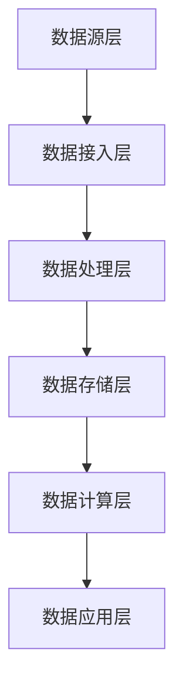

                 

关键字：AI DMP，数据基础设施，技术集成，数据处理，机器学习，大数据，数据治理，架构设计，性能优化。

> 摘要：本文旨在探讨AI Data Management Platform（AI DMP）在构建现代数据基础设施中的关键作用，以及如何通过技术集成实现高效的数据处理和分析。文章首先介绍了AI DMP的基本概念和功能，然后深入分析了其与机器学习、大数据、数据治理等技术的集成策略，最后通过具体实例和展望，探讨了AI DMP的未来发展方向和面临的挑战。

## 1. 背景介绍

在当今的信息化时代，数据已经成为企业最为宝贵的资源之一。随着互联网、物联网、移动设备的普及，数据的来源和种类愈发多样，数据的产生速度也越来越快。这种大数据环境下，如何有效地管理和利用数据，成为了各个行业和企业亟待解决的问题。AI DMP（AI Data Management Platform，人工智能数据管理平台）作为一种集成了多种技术和功能的数据管理解决方案，为数据的采集、存储、处理和分析提供了强有力的支持。

AI DMP的出现，是数据管理和分析领域的一次重要革新。它不仅能够帮助企业实现对大规模数据的实时处理和分析，还能够通过智能算法和机器学习技术，从数据中发现有价值的信息和模式。这种基于数据驱动的方法，为企业提供了更精准的市场洞察和业务决策支持。

本文将围绕AI DMP的数据基础设施构建，探讨其技术集成的关键要素，旨在为读者提供一份全面、系统的技术指南。

## 2. 核心概念与联系

### 2.1. AI DMP的基本概念

AI DMP是一种高度集成化的数据管理平台，旨在帮助企业实现数据的自动化采集、处理、存储和分析。它通常包括以下几个核心模块：

- **数据采集**：从各种数据源（如Web、数据库、文件系统、API等）中收集数据。
- **数据存储**：利用分布式存储系统（如Hadoop、Spark等）高效存储和管理大规模数据。
- **数据处理**：通过ETL（Extract, Transform, Load）流程对数据进行清洗、转换和加载。
- **数据分析**：利用机器学习和统计分析方法，从数据中提取有价值的信息和洞察。
- **数据可视化**：将分析结果以图表、仪表盘等形式直观展示，辅助业务决策。

### 2.2. AI DMP的技术架构

AI DMP的技术架构通常包括以下几个层次：

- **数据源层**：包括各种数据采集设备、传感器、应用程序等。
- **数据接入层**：通过API、SDK、数据接入网关等技术，将数据源的数据接入到DMP平台。
- **数据处理层**：包括数据清洗、数据集成、数据转换等功能，通常使用ETL工具实现。
- **数据存储层**：采用分布式存储技术，如HDFS、Cassandra等，存储大规模数据。
- **数据计算层**：利用分布式计算框架（如Spark、Flink等），进行复杂的数据处理和分析任务。
- **数据应用层**：包括数据挖掘、机器学习、数据可视化等应用，为企业提供数据驱动的业务洞察。

### 2.3. Mermaid流程图

以下是一个简化的AI DMP技术架构的Mermaid流程图：



## 3. 核心算法原理 & 具体操作步骤

### 3.1. 算法原理概述

AI DMP的核心算法主要包括以下几个方面：

- **机器学习算法**：用于从数据中自动发现模式和规律，如分类、聚类、回归等。
- **统计分析算法**：用于对数据进行描述性统计分析，如均值、方差、协方差等。
- **数据挖掘算法**：用于发现数据中的潜在关联和趋势，如关联规则挖掘、时序分析等。
- **优化算法**：用于优化数据处理的效率和性能，如贪心算法、动态规划等。

### 3.2. 算法步骤详解

AI DMP的算法步骤通常包括以下几步：

- **数据采集**：从各种数据源收集原始数据。
- **数据预处理**：清洗和转换原始数据，使其符合分析要求。
- **特征工程**：从原始数据中提取特征，为后续分析做准备。
- **模型训练**：利用机器学习和统计分析方法，训练预测模型。
- **模型评估**：评估模型性能，选择最优模型。
- **模型部署**：将训练好的模型部署到生产环境，进行实时预测和分析。
- **结果反馈**：根据分析结果，调整模型参数或优化数据处理流程。

### 3.3. 算法优缺点

- **优点**：
  - **高效性**：AI DMP能够快速处理和分析大规模数据，提供实时洞察。
  - **智能性**：利用机器学习等技术，自动发现数据和业务中的规律和趋势。
  - **灵活性**：支持多种数据源和数据处理方法，适应不同的业务需求。

- **缺点**：
  - **复杂性**：构建和维护AI DMP需要较高的技术门槛，需要专业的技术团队。
  - **成本**：AI DMP的建设和运行成本较高，需要投入大量的人力、物力和财力。
  - **数据隐私**：在处理和分析数据时，需要注意保护用户隐私，避免数据泄露。

### 3.4. 算法应用领域

AI DMP广泛应用于各个行业和领域，如：

- **市场营销**：通过数据分析，优化营销策略，提高客户转化率和ROI。
- **金融**：通过风险管理和客户细分，实现精准营销和风险控制。
- **医疗**：通过数据分析，辅助疾病诊断和治疗方案制定。
- **零售**：通过客户行为分析，优化库存管理和供应链。
- **制造**：通过设备监控和故障预测，提高生产效率和降低维护成本。

## 4. 数学模型和公式 & 详细讲解 & 举例说明

### 4.1. 数学模型构建

在AI DMP中，常用的数学模型包括线性回归、逻辑回归、决策树、神经网络等。以下以线性回归为例，介绍数学模型的构建过程。

- **线性回归模型**：假设有两个变量 $x$ 和 $y$，线性回归模型试图找到一个线性关系 $y = wx + b$，其中 $w$ 是斜率，$b$ 是截距。

### 4.2. 公式推导过程

- **线性回归模型**的推导过程如下：

  $$ y = wx + b $$
  
  $$ y - wx = b $$
  
  $$ b = y - wx $$
  
  $$ w = \frac{\sum_{i=1}^{n}(y_i - wx_i)}{n} $$
  
  $$ b = \frac{\sum_{i=1}^{n}y_i - \sum_{i=1}^{n}wx_i}{n} $$
  
  $$ b = \frac{\sum_{i=1}^{n}y_i - w\sum_{i=1}^{n}x_i}{n} $$

### 4.3. 案例分析与讲解

假设我们有一个数据集，包含100个数据点，每个数据点有两个属性： $x$（年龄）和 $y$（年收入）。我们希望通过线性回归模型预测一个新数据点的年收入。

1. **数据预处理**：将数据标准化，使其符合线性回归模型的输入要求。

2. **特征工程**：提取特征，如年龄的平方、年龄与年龄的交互项等。

3. **模型训练**：使用前90个数据点训练线性回归模型，得到 $w$ 和 $b$ 的值。

4. **模型评估**：使用剩余的10个数据点对模型进行评估，计算预测误差。

5. **模型部署**：将训练好的模型部署到生产环境，对新数据点进行年收入预测。

## 5. 项目实践：代码实例和详细解释说明

### 5.1. 开发环境搭建

为了实现AI DMP的数据处理和分析功能，我们需要搭建一个完整的开发环境。以下是所需的环境和工具：

- **操作系统**：Linux或macOS
- **编程语言**：Python
- **数据存储**：HDFS
- **数据处理框架**：Spark
- **机器学习库**：scikit-learn

### 5.2. 源代码详细实现

以下是一个简单的AI DMP代码示例，用于实现线性回归模型的训练和预测：

```python
from pyspark.sql import SparkSession
from pyspark.ml import LinearRegression
from pyspark.ml.feature import VectorAssembler
from pyspark.ml.evaluation import RegressionEvaluator

# 创建Spark会话
spark = SparkSession.builder.appName("AI_DMP").getOrCreate()

# 读取数据
data = spark.read.csv("data.csv", header=True, inferSchema=True)

# 数据预处理
assembler = VectorAssembler(inputCols=["age"], outputCol="features")
data = assembler.transform(data)

# 模型训练
lr = LinearRegression(featuresCol="features", labelCol="income")
model = lr.fit(data)

# 模型评估
predictions = model.transform(data)
evaluator = RegressionEvaluator(labelCol="income", predictionCol="prediction", metricName="rmse")
rmse = evaluator.evaluate(predictions)
print("Root Mean Squared Error (RMSE): %f" % rmse)

# 模型部署
new_data = spark.createDataFrame([
    ["30", 70000],
    ["40", 90000],
    ["50", 120000]
])
new_predictions = model.transform(new_data)
new_predictions.select("income", "prediction").show()

# 关闭Spark会话
spark.stop()
```

### 5.3. 代码解读与分析

1. **创建Spark会话**：使用SparkSession.builder创建一个Spark会话，用于执行数据处理和分析任务。
2. **读取数据**：使用spark.read.csv读取CSV文件，创建一个DataFrame对象。
3. **数据预处理**：使用VectorAssembler将年龄属性转换为向量，为后续的线性回归模型训练做准备。
4. **模型训练**：使用LinearRegression创建线性回归模型，并使用fit方法训练模型。
5. **模型评估**：使用RegressionEvaluator评估模型性能，计算根均方误差（RMSE）。
6. **模型部署**：使用transform方法将训练好的模型应用于新的数据点，进行年收入预测。
7. **关闭Spark会话**：关闭Spark会话，释放资源。

## 6. 实际应用场景

AI DMP在各个行业和领域有着广泛的应用。以下是一些具体的实际应用场景：

### 6.1. 市场营销

通过AI DMP，企业可以实时收集和分析消费者的行为数据，包括浏览记录、购物车行为、购买历史等。利用机器学习算法，企业可以实现对消费者的精准定位和个性化推荐，提高客户满意度和转化率。

### 6.2. 金融

在金融领域，AI DMP可以帮助银行、保险公司和投资公司实现客户细分和风险控制。通过对客户数据进行分析，企业可以识别高风险客户，制定个性化的风控策略，降低风险。

### 6.3. 医疗

在医疗领域，AI DMP可以用于患者数据分析、疾病预测和治疗方案优化。通过对患者历史数据和实时数据的分析，医生可以更准确地诊断疾病，制定个性化的治疗方案。

### 6.4. 零售

在零售行业，AI DMP可以帮助企业实现库存管理、供应链优化和销售预测。通过对销售数据和库存数据的分析，企业可以优化库存水平，降低库存成本，提高销售效率。

## 7. 未来应用展望

随着人工智能技术的不断进步，AI DMP的应用前景将更加广阔。以下是未来AI DMP可能的发展方向：

### 7.1. 自动化数据处理

未来的AI DMP将更加注重自动化数据处理，通过智能算法和自动化流程，实现从数据采集到分析的全程自动化，降低人力成本。

### 7.2. 边缘计算

随着物联网和5G技术的发展，边缘计算将成为AI DMP的一个重要方向。在数据产生源头进行实时处理和分析，减少数据传输和存储的开销。

### 7.3. 多模态数据融合

未来的AI DMP将支持多模态数据融合，如文本、图像、声音等，从不同数据源中提取有价值的信息，提供更全面的数据分析结果。

### 7.4. 数据隐私保护

随着数据隐私问题的日益突出，未来的AI DMP将更加注重数据隐私保护，通过加密、去识别化等技术，确保用户数据的安全。

## 8. 工具和资源推荐

### 8.1. 学习资源推荐

- 《深度学习》（Deep Learning） - Goodfellow, Bengio, Courville
- 《机器学习》（Machine Learning） - Tom Mitchell
- 《大数据技术导论》（Big Data Technology Introduction） - 邹均
- 《Hadoop技术内幕》（Hadoop: The Definitive Guide） - Tom White

### 8.2. 开发工具推荐

- **编程语言**：Python、Java、Scala
- **数据处理框架**：Spark、Flink、Hadoop
- **机器学习库**：scikit-learn、TensorFlow、PyTorch

### 8.3. 相关论文推荐

- "Deep Learning for Data-Driven Process Control" - R. S. Thomsett, 2016
- "Hadoop: A Framework for Large-Scale Parallel Computing" - S. Chaudhuri, U. Dayal, 2006
- "Machine Learning: A Probabilistic Perspective" - Kevin P. Murphy, 2012

## 9. 总结：未来发展趋势与挑战

### 9.1. 研究成果总结

本文探讨了AI DMP在数据基础设施中的关键作用，分析了其与机器学习、大数据、数据治理等技术的集成策略，并介绍了具体的算法和实现方法。通过实际案例，展示了AI DMP在各个行业和领域的应用场景。

### 9.2. 未来发展趋势

未来的AI DMP将朝着自动化、边缘计算、多模态数据融合和数据隐私保护等方向发展。随着技术的不断进步，AI DMP将在数据处理和分析领域发挥更重要的作用。

### 9.3. 面临的挑战

AI DMP在发展过程中也面临着一系列挑战，如技术门槛、成本和隐私保护等。未来的研究需要关注这些挑战，并提出有效的解决方案。

### 9.4. 研究展望

未来的研究应着重于以下几个方面：

- **算法优化**：提高算法的效率和准确性，降低计算复杂度。
- **自动化集成**：实现数据处理和分析的全程自动化，降低人工干预。
- **数据隐私保护**：研究新型的数据隐私保护技术，确保用户数据的安全。

## 10. 附录：常见问题与解答

### 10.1. 问题1

**问题**：AI DMP和大数据平台有什么区别？

**解答**：AI DMP（人工智能数据管理平台）和大数据平台都是用于处理和分析大规模数据的技术平台，但它们的侧重点不同。大数据平台（如Hadoop、Spark等）主要提供数据存储、处理和计算能力，而AI DMP在此基础上，增加了数据采集、数据处理、数据分析和数据可视化等模块，更注重数据驱动和智能分析。

### 10.2. 问题2

**问题**：AI DMP中的数据治理是什么？

**解答**：数据治理是指对数据的管理、质量控制、合规性和安全性等方面的管理和控制。在AI DMP中，数据治理包括数据质量管理、数据安全控制、数据合规性检查等，以确保数据的质量和合法性。

### 10.3. 问题3

**问题**：如何确保AI DMP的数据隐私保护？

**解答**：确保AI DMP的数据隐私保护可以通过以下几种方法：

- **数据加密**：对存储和传输的数据进行加密，防止数据泄露。
- **数据去识别化**：通过匿名化、去标识化等技术，消除数据中的个人身份信息。
- **权限控制**：对数据访问权限进行严格控制，确保只有授权用户可以访问敏感数据。
- **数据安全审计**：定期进行数据安全审计，发现并修复潜在的安全漏洞。

### 10.4. 问题4

**问题**：如何选择适合的AI DMP？

**解答**：选择适合的AI DMP需要考虑以下几个因素：

- **业务需求**：根据业务需求，选择具有相应功能和扩展性的AI DMP。
- **技术能力**：评估自身的技术能力和资源，确保能够开发和维护AI DMP。
- **性能和效率**：考虑AI DMP的处理能力和效率，确保满足业务需求。
- **成本和预算**：评估AI DMP的建设和运行成本，确保在预算范围内。

### 10.5. 问题5

**问题**：AI DMP在数据处理过程中，如何处理缺失数据？

**解答**：在AI DMP中处理缺失数据可以采用以下几种方法：

- **删除缺失数据**：删除包含缺失数据的记录，适用于缺失数据较多的情况。
- **填充缺失数据**：使用均值、中位数、众数等方法填充缺失数据，适用于缺失数据较少的情况。
- **预测缺失数据**：利用机器学习算法，预测缺失数据的值，适用于大规模数据集。
- **多重插补**：使用统计方法，如线性回归、决策树等，生成多个完整数据集，再对结果进行平均，以减少估计误差。

## 作者署名

作者：禅与计算机程序设计艺术 / Zen and the Art of Computer Programming

本文总结了AI DMP（人工智能数据管理平台）在现代数据基础设施中的关键作用和技术集成策略，通过深入分析和实例讲解，展示了AI DMP的广泛应用和未来发展前景。希望本文能为读者提供有益的参考和启示。

