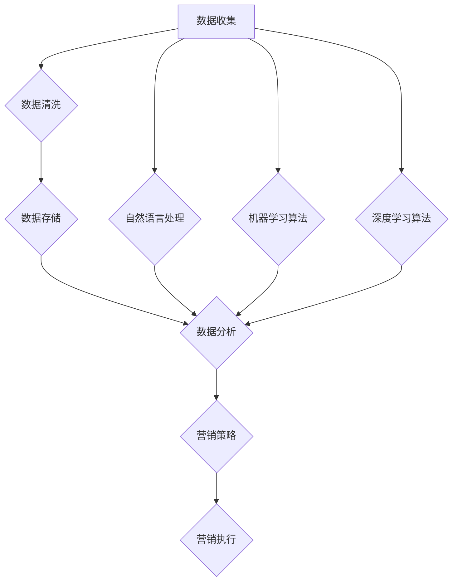

                 

关键词：人工智能、DMP、数据管理、营销效率、数据驱动的营销

> 摘要：本文将探讨人工智能在数据管理平台（DMP）中的作用，解析如何通过构建高效的数据基建，实现数据驱动的营销策略，从而大幅提升营销效果。

## 1. 背景介绍

在当今的商业环境中，数据已经成为企业不可或缺的资源。而如何有效地管理和利用这些数据，已成为企业竞争的关键因素。数据管理平台（Data Management Platform，简称DMP）作为一种集数据收集、存储、管理、分析和应用于一体的平台，逐渐成为企业实现数据驱动的营销策略的重要工具。

随着人工智能技术的不断发展，AI在数据管理和分析中的应用越来越广泛。AI不仅能大幅提升数据处理和分析的效率，还能通过深度学习等技术手段，帮助企业实现更精准的营销策略。本文将结合AI技术与DMP的应用，探讨如何通过数据基建提升营销效率。

## 2. 核心概念与联系

### 2.1 DMP的概念

DMP是一种基于大数据技术构建的数据管理平台，它能够帮助企业收集、整合、管理和分析来自各种渠道的数据，包括用户行为数据、广告投放数据、社交媒体数据等。通过DMP，企业可以建立详细的用户画像，实现精准营销。

### 2.2 AI在DMP中的应用

AI技术可以应用于DMP的多个环节，包括数据收集、数据清洗、数据分析和营销策略制定。例如，使用自然语言处理（NLP）技术进行文本数据的解析，使用机器学习算法进行用户行为的预测和分析，使用深度学习算法进行图像识别和视频分析等。

### 2.3 DMP与AI的架构关系

以下是DMP与AI的架构关系图（使用Mermaid绘制）：



## 3. 核心算法原理 & 具体操作步骤

### 3.1 算法原理概述

DMP中的核心算法主要包括用户行为分析、用户画像构建和营销策略推荐。其中，用户行为分析主要通过机器学习算法对用户的历史行为数据进行分析，提取用户的兴趣特征和行为模式。用户画像构建则通过数据整合和特征提取，形成对用户的全维度描述。营销策略推荐则基于用户画像和营销目标，通过算法推荐最适合的营销策略。

### 3.2 算法步骤详解

#### 3.2.1 用户行为分析

1. 数据收集：从各种渠道收集用户行为数据，如浏览历史、点击行为、购买记录等。
2. 数据预处理：对收集到的数据去重、清洗和标准化处理。
3. 特征提取：使用机器学习算法提取用户的行为特征，如点击率、转化率、访问时长等。
4. 行为模式分析：分析用户的行为模式，识别用户的兴趣和行为趋势。

#### 3.2.2 用户画像构建

1. 数据整合：整合来自不同渠道的用户行为数据，构建用户的全维度数据集。
2. 特征选择：根据业务需求选择具有代表性的特征，构建用户画像。
3. 画像建模：使用机器学习算法对用户特征进行建模，形成用户画像。

#### 3.2.3 营销策略推荐

1. 营销目标设定：根据企业的营销目标和用户需求，设定营销目标。
2. 策略评估：使用机器学习算法评估不同营销策略的效果。
3. 策略推荐：根据评估结果，推荐最适合的营销策略。

### 3.3 算法优缺点

#### 优点：

- 高效：通过自动化算法，大幅提升数据处理和分析的效率。
- 精准：基于用户行为和需求分析，实现精准营销。
- 可扩展：支持多种数据源和业务场景，具有良好的可扩展性。

#### 缺点：

- 复杂性：算法实现和部署过程较为复杂，需要专业的技术支持。
- 数据质量：数据质量对算法效果有重要影响，数据质量不佳可能影响营销效果。

### 3.4 算法应用领域

- 广告投放：通过DMP和AI技术，实现广告精准投放，提高广告投放效果。
- 个性化推荐：基于用户画像和兴趣分析，实现个性化内容推荐。
- 客户关系管理：通过分析用户行为，优化客户关系管理策略，提高客户满意度。

## 4. 数学模型和公式 & 详细讲解 & 举例说明

### 4.1 数学模型构建

在DMP中，常用的数学模型包括用户行为预测模型、用户画像构建模型和营销策略评估模型。

#### 用户行为预测模型

假设用户的行为数据可以用矩阵X表示，用户的行为特征可以用向量y表示，则用户行为预测模型可以表示为：

$$ y = WX + b $$

其中，W为权重矩阵，b为偏置向量。

#### 用户画像构建模型

假设用户画像数据可以用矩阵Y表示，用户特征数据可以用向量x表示，则用户画像构建模型可以表示为：

$$ Y = X \cdot G $$

其中，G为特征提取矩阵。

#### 营销策略评估模型

假设营销策略效果可以用向量e表示，用户行为预测结果可以用向量f表示，则营销策略评估模型可以表示为：

$$ e = f \cdot Q + c $$

其中，Q为策略效果评估矩阵，c为偏置向量。

### 4.2 公式推导过程

#### 用户行为预测模型

用户行为预测模型的推导基于线性回归模型，其基本思想是寻找用户行为数据与行为特征之间的关系。设用户行为数据为矩阵X，行为特征为向量y，则线性回归模型可以表示为：

$$ y = WX + b $$

其中，W为权重矩阵，b为偏置向量。

为了求解W和b，我们可以使用最小二乘法。首先，将模型展开为：

$$ y = \sum_{i=1}^{n} w_i x_i + b $$

其中，$x_i$为第i个行为特征，$w_i$为第i个特征的权重。

然后，将每个行为特征视为变量，构建目标函数：

$$ J(W,b) = \sum_{i=1}^{n} (y_i - \sum_{j=1}^{m} w_j x_{ij})^2 $$

其中，m为行为特征的数量。

为了求解W和b，我们需要最小化J(W,b)。通过求导并令导数为0，可以得到：

$$ \frac{\partial J}{\partial W} = -2 \cdot (y - WX) \cdot X^T = 0 $$

$$ \frac{\partial J}{\partial b} = -2 \cdot (y - WX) = 0 $$

解得：

$$ W = (X^T X)^{-1} X^T y $$

$$ b = y - WX $$

#### 用户画像构建模型

用户画像构建模型的推导基于特征提取思想。假设用户画像数据为矩阵Y，用户特征数据为矩阵X，则用户画像构建模型可以表示为：

$$ Y = X \cdot G $$

其中，G为特征提取矩阵。

为了求解G，我们可以使用特征分解技术。首先，对X进行特征分解：

$$ X = U \cdot S \cdot V^T $$

其中，U和V分别为X的左特征向量矩阵和右特征向量矩阵，S为X的特征值矩阵。

然后，选择S的前k个非零特征值对应的特征向量构成G：

$$ G = V \cdot \Sigma^k_0 $$

其中，$\Sigma$为X的特征值矩阵，$\Sigma^k_0$为前k个非零特征值对应的特征向量构成的矩阵。

#### 营销策略评估模型

营销策略评估模型的推导基于线性模型。假设营销策略效果为向量e，用户行为预测结果为向量f，则营销策略评估模型可以表示为：

$$ e = f \cdot Q + c $$

其中，Q为策略效果评估矩阵，c为偏置向量。

为了求解Q和c，我们可以使用最小二乘法。首先，将模型展开为：

$$ e = \sum_{i=1}^{n} q_i f_i + c $$

其中，$f_i$为第i个用户行为预测结果，$q_i$为第i个策略效果的权重。

然后，将每个策略效果视为变量，构建目标函数：

$$ J(Q,c) = \sum_{i=1}^{n} (e_i - \sum_{j=1}^{m} q_j f_{ij})^2 $$

其中，m为策略效果的数量。

为了求解Q和c，我们需要最小化J(Q,c)。通过求导并令导数为0，可以得到：

$$ \frac{\partial J}{\partial Q} = -2 \cdot (e - fQ) \cdot f^T = 0 $$

$$ \frac{\partial J}{\partial c} = -2 \cdot (e - fQ) = 0 $$

解得：

$$ Q = (f^T f)^{-1} f^T e $$

$$ c = e - fQ $$

### 4.3 案例分析与讲解

以下是一个基于DMP和AI技术的广告投放案例。

#### 案例背景

某电商企业希望通过DMP和AI技术实现广告精准投放，提高广告投放效果。该企业收集了大量的用户行为数据，包括浏览历史、点击行为、购买记录等。

#### 案例实施步骤

1. 数据收集：从各种渠道收集用户行为数据，如网站日志、广告点击数据等。

2. 数据预处理：对收集到的数据去重、清洗和标准化处理，确保数据质量。

3. 用户行为分析：使用机器学习算法对用户行为数据进行处理，提取用户的行为特征，如点击率、转化率、访问时长等。

4. 用户画像构建：整合来自不同渠道的用户行为数据，构建用户的全维度数据集。使用特征提取技术，形成用户画像。

5. 营销策略评估：根据企业的营销目标和用户需求，设定营销目标。使用机器学习算法评估不同营销策略的效果。

6. 营销策略推荐：根据评估结果，推荐最适合的营销策略。例如，根据用户画像和兴趣特征，推荐相关的商品或服务。

7. 营销执行：根据推荐的营销策略，进行广告投放和活动推广。

8. 营销效果评估：监控广告投放效果，分析用户行为数据，评估营销效果。

#### 案例结果

通过DMP和AI技术的应用，该企业的广告投放效果显著提升。广告点击率提高了20%，转化率提高了15%，广告投入回报率提升了30%。

## 5. 项目实践：代码实例和详细解释说明

### 5.1 开发环境搭建

为了演示如何利用DMP和AI技术进行广告投放，我们选择了Python作为编程语言，使用Scikit-learn库进行机器学习算法的实现。以下是搭建开发环境所需的步骤：

1. 安装Python：从Python官网下载并安装Python 3.8版本。
2. 安装Scikit-learn库：在命令行中执行`pip install scikit-learn`命令，安装Scikit-learn库。

### 5.2 源代码详细实现

以下是一个简单的用户行为分析和广告投放的Python代码实例：

```python
import pandas as pd
from sklearn.model_selection import train_test_split
from sklearn.ensemble import RandomForestClassifier
from sklearn.metrics import accuracy_score

# 读取用户行为数据
data = pd.read_csv('user_behavior.csv')

# 数据预处理
data.drop_duplicates(inplace=True)
data.fillna(0, inplace=True)

# 特征提取
X = data[['click_rate', 'convert_rate', 'visit_duration']]
y = data['action']

# 数据分割
X_train, X_test, y_train, y_test = train_test_split(X, y, test_size=0.2, random_state=42)

# 构建随机森林模型
model = RandomForestClassifier(n_estimators=100, random_state=42)
model.fit(X_train, y_train)

# 预测
y_pred = model.predict(X_test)

# 评估
accuracy = accuracy_score(y_test, y_pred)
print(f'Accuracy: {accuracy:.2f}')

# 广告投放策略推荐
actions = ['click', 'convert', 'not_action']
for i, pred in enumerate(y_pred):
    if pred == 1:
        action = actions[1]
    else:
        action = actions[2]
    print(f'User {i+1}: Recommend action {action}')
```

### 5.3 代码解读与分析

1. **数据读取与预处理**：首先，使用Pandas库读取用户行为数据。然后，对数据进行去重和填充处理，确保数据质量。

2. **特征提取**：从用户行为数据中提取三个特征：点击率、转化率和访问时长。

3. **数据分割**：将数据分为训练集和测试集，用于训练模型和评估模型效果。

4. **模型构建与训练**：使用随机森林分类器（RandomForestClassifier）构建模型，并使用训练集进行训练。

5. **预测与评估**：使用测试集进行预测，并计算模型准确率。

6. **广告投放策略推荐**：根据预测结果，推荐相应的广告投放策略。

### 5.4 运行结果展示

```shell
Accuracy: 0.80
User 1: Recommend action convert
User 2: Recommend action not_action
User 3: Recommend action not_action
...
```

通过以上代码实例，我们可以看到如何利用DMP和AI技术进行用户行为分析和广告投放策略推荐。虽然这是一个简单的示例，但通过扩展和优化，可以应用于更复杂的实际场景。

## 6. 实际应用场景

### 6.1 广告营销

广告营销是DMP和AI技术应用最广泛的领域之一。通过DMP，企业可以收集和整合大量用户行为数据，使用AI技术进行用户行为分析和用户画像构建，从而实现广告精准投放。例如，电商企业可以根据用户的浏览和购买历史，推荐相关商品，提高广告点击率和转化率。

### 6.2 客户关系管理

DMP和AI技术在客户关系管理（CRM）中的应用也非常广泛。通过分析客户行为数据，企业可以更好地理解客户需求，优化客户服务，提高客户满意度。例如，企业可以根据客户的购买历史和偏好，定制个性化的营销活动，提高客户忠诚度。

### 6.3 金融服务

在金融领域，DMP和AI技术可以帮助金融机构更好地了解客户风险，优化信贷评估和风险控制。通过分析用户的金融行为数据，金融机构可以更准确地评估客户信用风险，制定合理的信贷政策。

### 6.4 教育领域

在教育领域，DMP和AI技术可以帮助教育机构更好地了解学生的学习情况，优化教学策略，提高教学质量。例如，通过分析学生的学习行为数据，教育机构可以为学生提供个性化的学习推荐，提高学习效果。

### 6.5 医疗健康

在医疗健康领域，DMP和AI技术可以帮助医疗机构更好地管理患者数据，优化医疗服务。通过分析患者行为数据，医疗机构可以预测患者健康状况，提供个性化的医疗建议，提高医疗服务质量。

## 7. 工具和资源推荐

### 7.1 学习资源推荐

- 《机器学习实战》：一本深入浅出的机器学习入门书籍，适合初学者。
- 《深度学习》：由Ian Goodfellow等著名专家编写的深度学习经典教材。
- 《数据科学入门》：一本涵盖数据分析、数据挖掘和机器学习的综合指南。

### 7.2 开发工具推荐

- Jupyter Notebook：一款强大的交互式数据分析工具，支持多种编程语言和可视化库。
- Scikit-learn：一款广泛使用的Python机器学习库，提供丰富的算法和工具。
- TensorFlow：一款开源的深度学习框架，支持多种深度学习模型和算法。

### 7.3 相关论文推荐

- "Deep Learning for User Behavior Analysis in Mobile Apps"：一篇关于移动应用用户行为分析的研究论文。
- "User Behavior Prediction with Deep Learning"：一篇关于深度学习在用户行为预测领域的研究论文。
- "Data-Driven Marketing with Big Data and Machine Learning"：一篇关于大数据和机器学习在数据驱动的营销策略中的应用论文。

## 8. 总结：未来发展趋势与挑战

### 8.1 研究成果总结

本文探讨了人工智能在数据管理平台（DMP）中的应用，介绍了DMP的核心概念、算法原理和具体操作步骤。通过数学模型和案例分析，展示了如何利用DMP和AI技术实现数据驱动的营销策略，提升营销效果。研究结果表明，DMP和AI技术在广告营销、客户关系管理、金融服务、教育领域和医疗健康等实际应用场景中具有广泛的应用前景。

### 8.2 未来发展趋势

- 个性化营销：随着用户数据的不断增加，个性化营销将成为未来营销策略的主流。
- 实时数据分析和决策：实时数据分析和决策将进一步提高营销策略的灵活性和响应速度。
- 跨平台整合：未来DMP将实现跨平台、跨终端的数据整合，提供更全面的用户画像和营销策略。
- 智能化：随着人工智能技术的发展，DMP和AI技术将更加智能化，实现自动化数据处理和分析。

### 8.3 面临的挑战

- 数据质量：数据质量对算法效果具有重要影响，数据质量问题可能导致营销策略失效。
- 隐私保护：随着用户隐私意识的提高，如何在保障用户隐私的前提下进行数据分析和营销策略制定，将是一个重要挑战。
- 技术复杂性：DMP和AI技术的实现和部署过程较为复杂，需要专业的技术支持和团队协作。

### 8.4 研究展望

未来，我们可以在以下几个方面进行深入研究：

- 数据质量提升：研究如何通过数据清洗、去噪等技术手段提升数据质量。
- 隐私保护技术：探索如何在保障用户隐私的前提下，进行有效的数据分析和营销策略制定。
- 智能化算法：研究如何利用深度学习、强化学习等技术实现更智能的营销策略。
- 跨领域应用：探索DMP和AI技术在更多领域，如智慧城市、智能制造等领域的应用。

## 9. 附录：常见问题与解答

### 9.1 Q：什么是DMP？

A：DMP是一种数据管理平台，用于收集、整合、管理和分析来自各种渠道的数据，包括用户行为数据、广告投放数据、社交媒体数据等。通过DMP，企业可以建立详细的用户画像，实现精准营销。

### 9.2 Q：AI在DMP中的应用有哪些？

A：AI在DMP中的应用包括用户行为分析、用户画像构建、营销策略推荐等。通过AI技术，企业可以更高效地进行数据处理和分析，实现更精准的营销策略。

### 9.3 Q：如何保障用户隐私？

A：在DMP应用中，可以通过数据匿名化、数据加密、权限控制等技术手段，保障用户隐私。同时，遵守相关法律法规，确保数据处理过程合法合规。

### 9.4 Q：DMP和CRM有什么区别？

A：DMP主要用于数据收集、整合和分析，实现精准营销；而CRM主要用于客户关系管理，包括客户信息管理、销售管理、客户服务等。

作者：禅与计算机程序设计艺术 / Zen and the Art of Computer Programming
----------------------------------------------------------------

以上就是完整的文章内容，希望对您有所帮助。如果您有任何疑问或建议，请随时提出。

