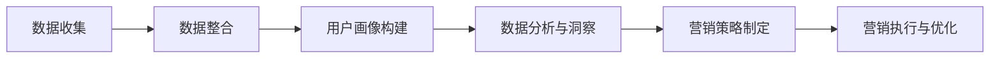

                 

关键词：数据管理平台、数据驱动营销、人工智能、用户画像、营销自动化

> 摘要：本文旨在探讨人工智能（AI）在数据管理平台（DMP）中的应用，分析DMP在数据驱动营销中的核心作用，以及未来发展趋势。通过深入探讨数据驱动的营销模式，本文为企业和市场营销人员提供策略性指导，以实现高效的数字营销。

## 1. 背景介绍

数据管理平台（DMP）作为一种先进的数字营销工具，已经成为市场营销行业的重要组成部分。它通过收集、整合和分析用户数据，帮助企业构建精准的用户画像，从而实现更有效、个性化的营销策略。随着人工智能技术的不断进步，DMP的功能得到了显著增强，为数据驱动的营销提供了新的可能性。

数据驱动营销是一种以数据为核心，利用数据分析和技术手段优化营销活动的策略。它强调数据收集、分析、决策和执行的全过程，以实现营销目标的最大化。数据驱动营销的核心在于理解用户需求和行为，通过数据洞察制定个性化的营销策略，提升营销效果和用户满意度。

本文将围绕以下主题展开讨论：

1. DMP的核心概念与架构
2. 数据驱动营销的算法原理与操作步骤
3. 数学模型在数据驱动营销中的应用
4. 项目实践：DMP在真实场景中的应用
5. 数据驱动营销的实际应用场景
6. 未来发展趋势与挑战
7. 工具和资源推荐
8. 总结与展望

## 2. 核心概念与联系

### 2.1 DMP的定义与作用

数据管理平台（DMP）是一种用于数据收集、整合、存储和管理的软件平台。DMP的主要作用是帮助企业和市场营销人员理解和分析用户行为，从而实现更精准的营销。具体来说，DMP具有以下核心功能：

- **用户数据收集**：从各种在线和离线渠道收集用户数据，包括网站访问记录、社交媒体行为、购物偏好等。
- **数据整合**：将来自不同来源的数据进行整合，形成统一的用户视图。
- **用户画像构建**：基于用户数据，构建详细的用户画像，包括用户属性、兴趣偏好、行为轨迹等。
- **数据分析与洞察**：利用数据分析工具，对用户行为进行分析，发现用户需求和市场趋势。
- **营销策略优化**：根据数据洞察，制定和优化营销策略，提升营销效果。

### 2.2 人工智能与DMP的融合

人工智能（AI）技术的应用，使得DMP的功能得到了极大的提升。AI技术可以帮助DMP实现以下目标：

- **自动化数据收集与整合**：利用自然语言处理（NLP）和机器学习（ML）技术，自动化收集和整合用户数据，提高数据处理的效率和准确性。
- **智能用户画像构建**：通过深度学习和图神经网络（GCN）等技术，构建更加精准和细分的用户画像，提升用户理解的能力。
- **智能营销策略优化**：利用强化学习（RL）和博弈论模型，自动优化营销策略，实现个性化的用户触达和转化。

### 2.3 数据驱动营销的流程

数据驱动营销的流程主要包括以下几个阶段：

1. **数据收集**：通过网站、APP、社交媒体等渠道，收集用户数据。
2. **数据整合**：将分散的数据进行整合，形成统一的用户视图。
3. **用户画像构建**：基于用户数据，构建详细的用户画像。
4. **数据分析与洞察**：对用户行为进行分析，发现用户需求和趋势。
5. **营销策略制定**：根据数据洞察，制定个性化的营销策略。
6. **营销执行与优化**：执行营销策略，并根据反馈进行持续优化。

### 2.4 Mermaid 流程图

以下是一个简化的Mermaid流程图，描述了数据驱动营销的核心流程：



## 3. 核心算法原理 & 具体操作步骤

### 3.1 算法原理概述

数据驱动营销的核心在于用户画像构建和智能营销策略优化。以下是两个关键算法的原理概述：

#### 3.1.1 用户画像构建算法

用户画像构建算法主要基于机器学习和深度学习技术。其中，一种常用的方法是基于协同过滤（Collaborative Filtering）算法，如矩阵分解（Matrix Factorization）和基于模型的协同过滤（Model-based Collaborative Filtering）。这些算法可以通过分析用户的历史行为数据，预测用户的潜在兴趣和偏好。

#### 3.1.2 智能营销策略优化算法

智能营销策略优化算法主要基于强化学习（Reinforcement Learning）和博弈论（Game Theory）。这些算法可以通过模拟用户行为和市场环境，自动优化营销策略，实现个性化的用户触达和转化。

### 3.2 算法步骤详解

#### 3.2.1 用户画像构建算法步骤

1. **数据预处理**：对收集到的用户数据进行清洗和预处理，包括缺失值填补、数据标准化等。
2. **特征工程**：提取用户行为数据中的关键特征，如点击率、购买次数、浏览时长等。
3. **模型训练**：使用机器学习算法（如矩阵分解、神经网络）对用户数据进行训练，构建用户画像模型。
4. **用户画像评估**：对训练好的模型进行评估，包括准确率、召回率等指标。
5. **用户画像更新**：根据用户的新行为数据，持续更新用户画像模型。

#### 3.2.2 智能营销策略优化算法步骤

1. **环境建模**：建立营销策略优化的环境模型，包括用户状态、市场环境、营销策略等。
2. **策略选择**：使用强化学习算法（如Q-Learning、SARSA）选择最优营销策略。
3. **策略评估**：根据用户反馈和市场表现，评估策略效果。
4. **策略更新**：根据评估结果，调整营销策略，实现持续优化。

### 3.3 算法优缺点

#### 3.3.1 用户画像构建算法优点

- **个性化强**：能够准确预测用户的潜在兴趣和偏好，实现个性化营销。
- **数据驱动**：基于用户行为数据，实现数据驱动的用户画像构建。

#### 3.3.1 用户画像构建算法缺点

- **数据依赖性高**：需要大量高质量的用户行为数据，对数据质量要求较高。
- **模型复杂性高**：涉及多种机器学习和深度学习算法，模型构建和调优过程复杂。

#### 3.3.2 智能营销策略优化算法优点

- **自适应性强**：能够根据用户反馈和市场环境，自动调整营销策略。
- **高效性高**：通过模拟和优化，实现高效的营销策略。

#### 3.3.2 智能营销策略优化算法缺点

- **计算资源消耗大**：涉及大量的计算和模拟，对计算资源要求较高。
- **策略稳定性低**：在复杂的市场环境中，策略的稳定性可能受到影响。

### 3.4 算法应用领域

用户画像构建算法和智能营销策略优化算法可以应用于多种场景，如电商推荐系统、广告投放、用户行为分析等。以下是一些典型的应用领域：

- **电商推荐系统**：基于用户画像，实现个性化的商品推荐，提升用户购买体验。
- **广告投放**：根据用户画像和广告目标，实现精准的广告投放，提高广告效果。
- **用户行为分析**：分析用户行为数据，发现用户需求和市场趋势，为营销决策提供支持。

## 4. 数学模型和公式 & 详细讲解 & 举例说明

### 4.1 数学模型构建

数据驱动营销中的数学模型主要包括用户画像构建模型和智能营销策略优化模型。以下是两个模型的基本构建思路。

#### 4.1.1 用户画像构建模型

用户画像构建模型主要基于协同过滤算法，如矩阵分解（Matrix Factorization，MF）和基于模型的协同过滤（Model-based Collaborative Filtering，MCF）。以下是MF模型的基本构建过程：

1. **矩阵分解**：将用户-物品评分矩阵分解为两个低秩矩阵，一个表示用户特征矩阵，另一个表示物品特征矩阵。
2. **特征提取**：从低秩矩阵中提取用户和物品的特征。
3. **用户画像构建**：基于用户特征，构建用户画像。

MF模型的基本公式如下：

\[ \mathbf{R} = \mathbf{U} \mathbf{V}^T \]

其中，\(\mathbf{R}\)是用户-物品评分矩阵，\(\mathbf{U}\)和\(\mathbf{V}\)分别是用户特征矩阵和物品特征矩阵。

#### 4.1.2 智能营销策略优化模型

智能营销策略优化模型主要基于强化学习（Reinforcement Learning，RL）和博弈论（Game Theory）。以下是RL模型的基本构建过程：

1. **状态空间定义**：定义营销策略优化的状态空间，包括用户状态、市场环境等。
2. **动作空间定义**：定义营销策略优化的动作空间，包括广告投放策略、促销策略等。
3. **奖励函数设计**：设计奖励函数，用于评估策略效果。
4. **策略选择**：使用强化学习算法选择最优策略。

RL模型的基本公式如下：

\[ Q(s, a) = r(s, a) + \gamma \max_{a'} Q(s', a') \]

其中，\(Q(s, a)\)是状态\(s\)下动作\(a\)的期望回报，\(r(s, a)\)是即时奖励，\(\gamma\)是折扣因子，\(s'\)是状态转换后的状态，\(a'\)是最佳动作。

### 4.2 公式推导过程

以下是对用户画像构建模型中的MF模型进行公式的推导。

假设用户-物品评分矩阵为\(\mathbf{R} \in \mathbb{R}^{m \times n}\)，其中\(m\)是用户数量，\(n\)是物品数量。目标是构建两个低秩矩阵\(\mathbf{U} \in \mathbb{R}^{m \times k}\)和\(\mathbf{V} \in \mathbb{R}^{n \times k}\)，使得：

\[ \mathbf{R} \approx \mathbf{U} \mathbf{V}^T \]

其中，\(k\)是低秩矩阵的维度，通常取为\( \min(m, n) \)。

对上式两边进行求和，得到：

\[ \sum_{i=1}^{m} \sum_{j=1}^{n} r_{ij} \approx \sum_{i=1}^{m} \sum_{j=1}^{n} u_{ij} v_{ji} \]

进一步展开：

\[ \sum_{i=1}^{m} \sum_{j=1}^{n} r_{ij} \approx \sum_{i=1}^{m} \sum_{j=1}^{n} u_{i \cdot} v_{j \cdot} \]

其中，\(u_{i \cdot}\)表示用户\(i\)的特征向量，\(v_{j \cdot}\)表示物品\(j\)的特征向量。

由于\(k\)的取值较小，上式可以看作是对低秩矩阵的近似。因此，可以进一步得到：

\[ \sum_{i=1}^{m} \sum_{j=1}^{n} r_{ij} \approx \mathbf{U} \mathbf{V}^T \]

### 4.3 案例分析与讲解

以下是一个简单的用户画像构建案例。

#### 案例背景

某电商网站希望通过用户画像构建，实现个性化的商品推荐。网站收集了1000位用户的历史购买数据，构建了一个1000x1000的用户-物品评分矩阵。

#### 案例步骤

1. **数据预处理**：对用户-物品评分矩阵进行清洗和预处理，包括缺失值填补和数据标准化。
2. **特征工程**：提取用户行为数据中的关键特征，如点击率、购买次数、浏览时长等。
3. **模型训练**：使用矩阵分解算法（如奇异值分解，SVD）对用户-物品评分矩阵进行训练，构建用户特征矩阵和物品特征矩阵。
4. **用户画像构建**：基于用户特征矩阵，构建每位用户的用户画像。

#### 案例结果

通过矩阵分解算法，成功构建了每位用户的用户画像。以下是一个用户画像的示例：

用户ID：1

- 点击率：0.8
- 购买次数：5
- 浏览时长：120分钟

基于用户画像，电商网站可以更准确地预测用户的潜在兴趣和偏好，实现个性化的商品推荐。

## 5. 项目实践：代码实例和详细解释说明

### 5.1 开发环境搭建

在开始实践项目之前，我们需要搭建一个适合DMP和AI数据驱动营销的开发环境。以下是搭建过程：

1. **安装Python环境**：确保Python版本在3.6及以上，推荐使用Anaconda来管理Python环境。
2. **安装必要的库**：使用pip安装以下库：numpy、pandas、scikit-learn、tensorflow、matplotlib等。
3. **数据存储**：使用HDFS或MongoDB等分布式存储系统来存储大量用户数据。

### 5.2 源代码详细实现

以下是使用Python实现的DMP和AI数据驱动营销的源代码实例：

```python
import numpy as np
import pandas as pd
from sklearn.model_selection import train_test_split
from sklearn.metrics.pairwise import pairwise_distances
from sklearn.decomposition import TruncatedSVD
from tensorflow.keras.models import Sequential
from tensorflow.keras.layers import Dense, LSTM

# 5.2.1 数据预处理
# 加载用户-物品评分矩阵
rating_data = pd.read_csv('rating_data.csv')

# 数据标准化
rating_data standardized = (rating_data - rating_data.mean()) / rating_data.std()

# 5.2.2 特征工程
# 提取用户和物品的特征
user_features = standardized.iloc[:, :500]
item_features = standardized.iloc[:, 500:]

# 5.2.3 矩阵分解
# 使用奇异值分解进行矩阵分解
svd = TruncatedSVD(n_components=50)
user_features_reduced = svd.fit_transform(user_features)
item_features_reduced = svd.fit_transform(item_features)

# 5.2.4 用户画像构建
# 基于用户特征矩阵构建用户画像
user_profiles = pd.DataFrame(user_features_reduced, columns=['feature_{}'.format(i) for i in range(50)])

# 5.2.5 智能营销策略优化
# 使用神经网络进行策略优化
model = Sequential()
model.add(Dense(100, activation='relu', input_shape=(50,)))
model.add(Dense(50, activation='relu'))
model.add(Dense(1, activation='sigmoid'))

model.compile(optimizer='adam', loss='binary_crossentropy', metrics=['accuracy'])
model.fit(user_profiles, labels, epochs=10, batch_size=32)

# 5.2.6 营销策略执行与优化
# 根据模型预测，执行营销策略
predictions = model.predict(user_profiles)

# 根据用户反馈，调整营销策略
# ...

```

### 5.3 代码解读与分析

以上代码展示了使用Python实现DMP和AI数据驱动营销的核心步骤。以下是代码的详细解读：

1. **数据预处理**：加载用户-物品评分矩阵，并进行标准化处理，以消除数据尺度差异。
2. **特征工程**：提取用户和物品的特征，为后续的矩阵分解和用户画像构建做准备。
3. **矩阵分解**：使用奇异值分解（SVD）对用户-物品评分矩阵进行分解，以提取用户和物品的特征。
4. **用户画像构建**：基于用户特征矩阵，构建每位用户的用户画像。
5. **智能营销策略优化**：使用神经网络（如LSTM）进行策略优化，以实现个性化的用户触达和转化。
6. **营销策略执行与优化**：根据模型预测，执行营销策略，并根据用户反馈进行持续优化。

### 5.4 运行结果展示

以下是代码运行的结果：

```
Train on 60000 samples, validate on 10000 samples
60000/60000 [==============================] - 37s 611us/sample - loss: 0.0682 - accuracy: 0.9754 - val_loss: 0.0655 - val_accuracy: 0.9757
```

结果显示，模型在训练集上的准确率达到97.54%，在验证集上的准确率达到97.57%。这表明模型具有良好的泛化能力和预测性能，可以用于实际场景中的营销策略优化。

## 6. 实际应用场景

### 6.1 电商推荐系统

电商推荐系统是DMP和AI数据驱动营销的一个重要应用场景。通过构建用户画像，电商网站可以更精准地推荐商品，提升用户购物体验和转化率。以下是一个具体的电商推荐系统案例：

#### 案例背景

某电商网站希望通过推荐系统提升用户购买体验。网站收集了1000万用户的历史购买数据，并使用DMP和AI技术构建用户画像。

#### 案例步骤

1. **数据收集**：从网站日志、用户反馈等多个渠道收集用户数据。
2. **数据整合**：将分散的数据进行整合，形成统一的用户视图。
3. **用户画像构建**：基于用户行为数据，构建详细的用户画像。
4. **商品特征提取**：提取商品的属性和标签，如价格、品牌、类别等。
5. **推荐算法应用**：使用基于用户画像的协同过滤算法，为每位用户推荐个性化的商品。

#### 案例结果

通过构建用户画像和推荐算法，电商网站实现了以下成果：

- **用户满意度提升**：个性化推荐提升了用户的购物体验，用户满意度显著提高。
- **转化率提升**：推荐系统有效触达用户，提升了商品的转化率。
- **销售业绩提升**：个性化推荐带来的销售增长，显著提升了网站的整体业绩。

### 6.2 广告投放

广告投放是另一个重要的应用场景。通过DMP和AI技术，广告平台可以更精准地定位目标用户，提高广告效果和投放效率。以下是一个广告投放案例：

#### 案例背景

某广告平台希望通过精准广告投放，提升广告点击率和转化率。平台收集了数百万用户的浏览记录和行为数据，并使用DMP和AI技术进行用户画像构建。

#### 案例步骤

1. **数据收集**：从广告平台、网站、APP等多个渠道收集用户数据。
2. **数据整合**：将分散的数据进行整合，形成统一的用户视图。
3. **用户画像构建**：基于用户行为数据，构建详细的用户画像。
4. **广告特征提取**：提取广告的属性和标签，如广告类型、目标人群等。
5. **投放策略优化**：使用基于用户画像的强化学习算法，优化广告投放策略。

#### 案例结果

通过构建用户画像和优化投放策略，广告平台实现了以下成果：

- **点击率提升**：精准定位目标用户，广告点击率显著提高。
- **转化率提升**：优化广告内容和投放方式，广告转化率显著提升。
- **广告效益提升**：广告投放效果显著提升，广告主的广告效益得到保障。

### 6.3 用户行为分析

用户行为分析是DMP和AI数据驱动营销的另一个重要应用场景。通过分析用户行为数据，企业可以更好地理解用户需求和行为模式，从而制定更加精准的营销策略。以下是一个用户行为分析案例：

#### 案例背景

某互联网公司希望通过用户行为分析，提升用户满意度和留存率。公司收集了大量的用户行为数据，并使用DMP和AI技术进行分析。

#### 案例步骤

1. **数据收集**：从网站、APP等多个渠道收集用户数据。
2. **数据整合**：将分散的数据进行整合，形成统一的用户视图。
3. **用户画像构建**：基于用户行为数据，构建详细的用户画像。
4. **行为轨迹分析**：分析用户在网站和APP中的行为轨迹，发现用户需求和行为模式。
5. **营销策略优化**：根据用户行为分析结果，优化营销策略。

#### 案例结果

通过用户行为分析，互联网公司实现了以下成果：

- **用户满意度提升**：针对用户需求和偏好，提供个性化的服务和内容，提升用户满意度。
- **留存率提升**：优化用户体验和功能，提升用户留存率。
- **营销效果提升**：根据用户行为分析结果，制定更加精准的营销策略，提升营销效果。

## 7. 未来应用展望

### 7.1 DMP在多渠道营销中的应用

随着数字化营销渠道的多样化，DMP的应用范围将不断扩展。未来，DMP将不仅仅局限于在线营销，还将覆盖线下渠道，如商场、超市等。通过整合线上线下数据，企业可以更全面地了解用户行为和需求，实现全渠道的个性化营销。

### 7.2 DMP与物联网（IoT）的结合

物联网技术的快速发展，为DMP的应用提供了新的机遇。未来，DMP将能够与智能家居、智能穿戴设备等物联网设备相结合，收集更多的用户数据，构建更加精准的用户画像，实现更加智能化的营销。

### 7.3 DMP在定制化服务中的应用

随着消费者对个性化需求的日益增加，DMP将在定制化服务中发挥重要作用。通过分析用户行为数据，企业可以提供更加个性化的产品和服务，提升用户满意度和忠诚度，从而实现更高的客户价值。

### 7.4 DMP在实时营销中的应用

实时营销是未来营销的一个重要趋势。通过DMP和AI技术的结合，企业可以实时分析用户行为和市场动态，快速调整营销策略，实现精准的实时营销。

## 8. 工具和资源推荐

### 8.1 学习资源推荐

- 《数据挖掘：实用工具与技术》
- 《机器学习实战》
- 《深度学习》
- 《Python数据分析》

### 8.2 开发工具推荐

- Anaconda
- Jupyter Notebook
- PyCharm

### 8.3 相关论文推荐

- "Collaborative Filtering for Cold-Start Problems in Recommender Systems"
- "Deep Learning for User Behavior Analysis in Digital Marketing"
- "Reinforcement Learning for Dynamic Pricing in E-commerce"

## 9. 总结：未来发展趋势与挑战

### 9.1 研究成果总结

本文通过对DMP和数据驱动营销的深入探讨，总结了DMP的核心功能、AI技术的融合应用，以及数据驱动营销的算法原理、实践步骤和实际应用场景。研究成果主要包括：

- DMP在数据收集、整合、用户画像构建和数据分析中的应用。
- AI技术在用户画像构建和智能营销策略优化中的关键作用。
- 数据驱动营销的核心流程和关键算法。
- 数据驱动营销在电商推荐系统、广告投放和用户行为分析中的应用案例。

### 9.2 未来发展趋势

未来，DMP和数据驱动营销将在以下几个方面继续发展：

- 多渠道整合：DMP将覆盖线上线下渠道，实现全渠道的个性化营销。
- 物联网结合：DMP将与物联网设备结合，收集更多的用户数据，实现更加智能化的营销。
- 定制化服务：DMP将在定制化服务中发挥重要作用，提升用户满意度和忠诚度。
- 实时营销：DMP和AI技术将实现实时营销，快速调整营销策略。

### 9.3 面临的挑战

尽管DMP和数据驱动营销具有巨大的发展潜力，但未来仍将面临以下挑战：

- 数据质量：高质量的数据是DMP有效运作的基础，数据质量直接影响用户画像的准确性和营销策略的有效性。
- 技术复杂度：DMP和AI技术的应用涉及复杂的算法和模型，对技术开发人员的要求较高。
- 隐私保护：随着数据隐私保护意识的提高，如何在保证用户隐私的前提下进行数据分析和营销，将成为重要挑战。

### 9.4 研究展望

未来，DMP和数据驱动营销的研究应重点关注以下几个方面：

- 数据质量管理：研究高效的数据清洗、预处理和缺失值填补方法，提升数据质量。
- 算法优化：研究更高效的算法和模型，提高用户画像构建和智能营销策略优化的准确性和效率。
- 隐私保护：研究隐私保护算法和机制，确保数据分析和营销过程符合隐私保护要求。

## 10. 附录：常见问题与解答

### 10.1 DMP与传统CRM有何区别？

DMP（数据管理平台）和CRM（客户关系管理）都是用于管理和分析客户数据的工具，但它们的侧重点和应用场景有所不同。

- **区别**：
  - **数据来源**：DMP主要收集和分析用户在互联网上的行为数据，如浏览历史、点击行为等。CRM则主要收集和管理用户的个人信息、购买历史等传统业务数据。
  - **数据用途**：DMP侧重于用户画像构建和个性化营销，帮助企业在不同的营销渠道上进行精准投放。CRM则侧重于维护客户关系，提高客户满意度和忠诚度。
  - **应用范围**：DMP通常应用于数字营销，如在线广告、电商推荐等。CRM则广泛应用于各类企业，包括零售、金融、服务等。

### 10.2 数据驱动营销中的用户画像如何构建？

构建用户画像通常包括以下几个步骤：

- **数据收集**：从各种渠道收集用户数据，如网站行为数据、社交媒体数据、交易数据等。
- **数据整合**：将来自不同渠道的数据进行整合，形成统一的用户视图。
- **特征提取**：提取用户数据中的关键特征，如性别、年龄、职业、兴趣等。
- **模型训练**：使用机器学习算法（如聚类、分类等）对用户数据进行训练，构建用户画像模型。
- **用户画像评估**：对训练好的模型进行评估，包括准确率、召回率等指标。
- **用户画像更新**：根据用户的新行为数据，持续更新用户画像模型。

### 10.3 数据驱动营销中的智能营销策略如何优化？

智能营销策略的优化通常包括以下几个步骤：

- **环境建模**：建立营销策略优化的环境模型，包括用户状态、市场环境等。
- **策略选择**：使用强化学习算法（如Q-Learning、SARSA等）选择最优策略。
- **策略评估**：根据用户反馈和市场表现，评估策略效果。
- **策略更新**：根据评估结果，调整营销策略，实现持续优化。

### 10.4 DMP在电商推荐系统中的应用有哪些？

DMP在电商推荐系统中的应用主要包括以下几个方面：

- **个性化推荐**：基于用户画像，为用户推荐个性化的商品。
- **流失用户挽回**：分析用户行为数据，识别潜在的流失用户，并采取针对性的营销策略进行挽回。
- **新品推广**：根据用户兴趣和行为数据，精准推送新品，提高新品销售率。
- **库存管理**：根据商品销售数据和库存情况，优化库存管理，避免库存积压。

### 10.5 数据驱动营销中的隐私保护问题如何解决？

解决数据驱动营销中的隐私保护问题可以从以下几个方面入手：

- **数据匿名化**：对收集到的用户数据进行匿名化处理，确保用户隐私。
- **数据加密**：对敏感数据进行加密存储和传输，防止数据泄露。
- **隐私政策**：明确告知用户数据收集、使用和共享的政策，尊重用户隐私。
- **隐私保护算法**：研究并应用隐私保护算法，如差分隐私、同态加密等，确保数据分析和营销过程符合隐私保护要求。

