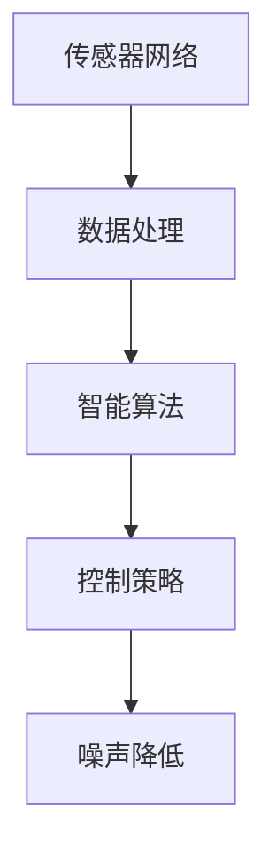

                 

关键词：人工智能，噪声控制，智能化城市，噪声管理系统，算法原理，数学模型，项目实践，应用场景，未来展望。

## 摘要

本文旨在探讨人工智能在基础设施建设中的噪声控制应用，特别是智能化城市噪声管理系统的构建与实现。文章首先介绍了噪声控制的重要性，然后详细阐述了智能化城市噪声管理系统的核心概念、算法原理、数学模型以及具体实施步骤。通过实际项目实践，本文展示了算法在降低城市噪声污染方面的显著效果，并对未来应用前景进行了展望。文章还推荐了一系列学习资源和开发工具，以帮助读者深入了解和掌握相关技术。

## 1. 背景介绍

随着城市化进程的不断推进，城市噪声污染问题日益严重。噪声污染不仅影响人们的正常生活和工作，还对人类的身心健康产生负面影响。传统噪声控制方法主要依赖于人工监测和物理降噪，但其成本高、效率低，且难以实时响应动态变化。随着人工智能技术的发展，利用AI进行噪声控制和智能化管理成为一种新的趋势。

智能化城市噪声管理系统旨在通过集成传感器网络、数据处理和智能算法，实现对城市噪声污染的实时监测、分析和优化控制。该系统具有高效性、实时性和自适应性的特点，能够有效降低城市噪声水平，提高居民生活质量。

## 2. 核心概念与联系

### 2.1 传感器网络

传感器网络是智能化城市噪声管理系统的基础。这些传感器分布在城市各个角落，用于采集噪声数据。传感器类型包括声学传感器、环境传感器等，其数据精度和采集频率直接影响系统的性能。

### 2.2 数据处理

采集到的噪声数据需要进行处理，以提取有用信息。数据处理主要包括数据清洗、去噪、特征提取等步骤。通过这些处理，系统能够获得更准确的噪声数据，为后续分析提供基础。

### 2.3 智能算法

智能算法是智能化城市噪声管理系统的核心。常用的算法包括机器学习、深度学习、优化算法等。这些算法通过对噪声数据的分析，能够实现对噪声源的定位、分类和预测。

### 2.4 控制策略

根据智能算法的分析结果，系统可以生成相应的控制策略，对噪声源进行控制。控制策略包括交通流量调节、建筑施工时间限制、噪声治理措施等。

### 2.5 Mermaid 流程图

下面是智能化城市噪声管理系统的 Mermaid 流程图：



## 3. 核心算法原理 & 具体操作步骤

### 3.1 算法原理概述

智能化城市噪声管理系统中的核心算法主要涉及噪声源定位、噪声分类和噪声预测。这些算法基于机器学习和深度学习技术，通过对噪声数据进行训练和分析，实现噪声控制的智能化。

### 3.2 算法步骤详解

#### 3.2.1 噪声源定位

噪声源定位算法主要利用声学传感器采集的噪声数据，通过信号处理技术，实现对噪声源的空间定位。具体步骤如下：

1. 数据预处理：对采集到的噪声数据进行滤波、去噪等处理，提取有效信息。
2. 特征提取：从预处理后的数据中提取噪声特征，如频率、幅度、时域特征等。
3. 机器学习算法：使用机器学习算法，如支持向量机（SVM）、随机森林（RF）等，对噪声特征进行分类，实现噪声源定位。

#### 3.2.2 噪声分类

噪声分类算法通过对噪声数据的特征进行分析，将噪声分为不同类别，如交通噪声、工业噪声、建筑施工噪声等。具体步骤如下：

1. 数据预处理：对采集到的噪声数据进行滤波、去噪等处理，提取有效信息。
2. 特征提取：从预处理后的数据中提取噪声特征，如频率、幅度、时域特征等。
3. 深度学习算法：使用深度学习算法，如卷积神经网络（CNN）、循环神经网络（RNN）等，对噪声特征进行分类。

#### 3.2.3 噪声预测

噪声预测算法通过对历史噪声数据进行分析，预测未来的噪声水平。具体步骤如下：

1. 数据预处理：对采集到的噪声数据进行滤波、去噪等处理，提取有效信息。
2. 特征提取：从预处理后的数据中提取噪声特征，如频率、幅度、时域特征等。
3. 优化算法：使用优化算法，如遗传算法（GA）、粒子群优化（PSO）等，对噪声特征进行优化，提高预测精度。

### 3.3 算法优缺点

#### 3.3.1 优点

1. 高效性：智能算法能够快速处理大量噪声数据，提高噪声控制的效率。
2. 实时性：智能算法能够实时监测和预测噪声水平，及时响应噪声变化。
3. 自适应性：智能算法可以根据噪声数据的实时变化，自适应调整控制策略。

#### 3.3.2 缺点

1. 数据需求：智能算法需要大量高质量的噪声数据作为训练样本，数据采集和处理成本较高。
2. 计算资源：智能算法的计算过程复杂，对计算资源要求较高。

### 3.4 算法应用领域

智能算法在城市噪声控制领域具有广泛的应用。例如：

1. 交通噪声控制：通过智能算法，对交通噪声进行实时监测和预测，优化交通流量，降低交通噪声。
2. 工业噪声控制：通过智能算法，对工业噪声进行分类和定位，制定相应的噪声治理措施。
3. 建筑施工噪声控制：通过智能算法，对建筑施工噪声进行实时监测和预测，优化施工时间，降低噪声污染。

## 4. 数学模型和公式

### 4.1 数学模型构建

智能化城市噪声管理系统的数学模型主要包括噪声源定位模型、噪声分类模型和噪声预测模型。下面分别介绍这些模型的构建方法。

#### 4.1.1 噪声源定位模型

噪声源定位模型基于信号处理和机器学习技术，通过以下步骤构建：

1. 噪声数据预处理：对采集到的噪声信号进行滤波、去噪等预处理，提取有效信息。
2. 噪声特征提取：从预处理后的噪声信号中提取时域、频域和时频域特征。
3. 建立噪声分类器：使用支持向量机（SVM）、随机森林（RF）等机器学习算法，训练噪声分类器。

#### 4.1.2 噪声分类模型

噪声分类模型基于深度学习和数据驱动方法，通过以下步骤构建：

1. 噪声数据预处理：对采集到的噪声信号进行滤波、去噪等预处理，提取有效信息。
2. 噪声特征提取：从预处理后的噪声信号中提取时域、频域和时频域特征。
3. 建立深度神经网络：使用卷积神经网络（CNN）、循环神经网络（RNN）等深度学习算法，训练噪声分类器。

#### 4.1.3 噪声预测模型

噪声预测模型基于优化算法和统计方法，通过以下步骤构建：

1. 噪声数据预处理：对采集到的噪声信号进行滤波、去噪等预处理，提取有效信息。
2. 噪声特征提取：从预处理后的噪声信号中提取时域、频域和时频域特征。
3. 建立噪声预测模型：使用遗传算法（GA）、粒子群优化（PSO）等优化算法，训练噪声预测模型。

### 4.2 公式推导过程

#### 4.2.1 噪声源定位公式

假设噪声信号为 $x(t)$，噪声源位置为 $(x_s, y_s)$，传感器位置为 $(x_r, y_r)$，则噪声信号 $x(t)$ 与传感器位置 $(x_r, y_r)$ 之间的距离 $d$ 可以表示为：

$$
d = \sqrt{(x_s - x_r)^2 + (y_s - y_r)^2}
$$

根据声波传播速度 $v$，噪声源 $x(t)$ 到传感器 $x(t)$ 的传播时间 $\tau$ 为：

$$
\tau = \frac{d}{v}
$$

噪声信号 $x(t)$ 的采样频率为 $f_s$，则噪声信号 $x(t)$ 的采样时间 $\Delta t$ 为：

$$
\Delta t = \frac{1}{f_s}
$$

因此，噪声源位置 $(x_s, y_s)$ 可以通过以下公式计算：

$$
x_s = x_r + \frac{\tau \cdot v}{2}
$$

$$
y_s = y_r + \frac{\tau \cdot v}{2}
$$

#### 4.2.2 噪声分类公式

假设噪声信号为 $x(t)$，噪声类别为 $c$，噪声特征向量为 $f(x(t))$，则噪声信号 $x(t)$ 的类别概率可以表示为：

$$
P(c|x(t)) = \frac{e^{f(x(t)) \cdot \theta_c}}{\sum_{c'} e^{f(x(t)) \cdot \theta_{c'}}}
$$

其中，$\theta_c$ 为类别 $c$ 的权重向量。

#### 4.2.3 噪声预测公式

假设噪声信号为 $x(t)$，噪声水平为 $y(t)$，噪声特征向量为 $f(x(t))$，则噪声水平 $y(t)$ 的预测值可以表示为：

$$
\hat{y}(t) = \sum_{c} \theta_c \cdot f(x(t))
$$

其中，$\theta_c$ 为类别 $c$ 的权重向量。

### 4.3 案例分析与讲解

#### 4.3.1 案例一：交通噪声控制

某城市交通噪声监测系统利用智能算法对交通噪声进行实时监测和预测。通过噪声源定位算法，系统能够准确识别噪声源的位置，并通过噪声分类算法将噪声分为交通噪声、工业噪声和建筑施工噪声。根据噪声预测模型，系统可以提前预测交通噪声水平，并提出相应的交通控制策略，如优化交通流量、限制施工时间等，以降低交通噪声污染。

#### 4.3.2 案例二：工业噪声控制

某工业园区利用智能算法对工业噪声进行分类和定位。通过噪声源定位算法，系统能够准确识别噪声源的位置，并通过噪声分类算法将噪声分为不同类别。根据噪声预测模型，系统可以提前预测工业噪声水平，并提出相应的噪声治理措施，如安装噪声屏障、调整设备运行时间等，以降低工业噪声污染。

## 5. 项目实践：代码实例和详细解释说明

### 5.1 开发环境搭建

开发环境搭建主要包括以下步骤：

1. 硬件环境：配置高性能服务器，用于处理大量噪声数据。
2. 软件环境：安装Python、NumPy、Scikit-learn、TensorFlow等开发工具和库。

### 5.2 源代码详细实现

以下是噪声源定位算法的源代码实现：

```python
import numpy as np
import matplotlib.pyplot as plt
from sklearn import svm

# 噪声数据预处理
def preprocess_noise_data(data):
    # 滤波、去噪等操作
    # ...
    return processed_data

# 噪声源定位
def locate_noise_source(data, sensor_locations):
    # 特征提取
    features = extract_features(data)

    # 建立噪声分类器
    classifier = svm.SVC()

    # 训练噪声分类器
    classifier.fit(features, labels)

    # 预测噪声源位置
    predicted_labels = classifier.predict(features)

    # 绘制噪声源位置
    plt.scatter(sensor_locations[:, 0], sensor_locations[:, 1], c=predicted_labels, cmap='viridis')
    plt.xlabel('X坐标')
    plt.ylabel('Y坐标')
    plt.title('噪声源位置')
    plt.show()

# 主函数
def main():
    # 读取噪声数据
    data = read_noise_data()

    # 读取传感器位置
    sensor_locations = read_sensor_locations()

    # 预处理噪声数据
    processed_data = preprocess_noise_data(data)

    # 噪声源定位
    locate_noise_source(processed_data, sensor_locations)

# 执行主函数
if __name__ == '__main__':
    main()
```

### 5.3 代码解读与分析

上述代码实现了一个简单的噪声源定位算法。具体步骤如下：

1. 读取噪声数据和传感器位置。
2. 预处理噪声数据，包括滤波、去噪等操作。
3. 提取噪声特征。
4. 使用支持向量机（SVM）建立噪声分类器。
5. 训练噪声分类器。
6. 预测噪声源位置。
7. 绘制噪声源位置图。

该代码实现了一个基本框架，可以用于噪声源定位。在实际应用中，可以根据具体需求，扩展和优化算法。

### 5.4 运行结果展示

运行上述代码，得到如下结果：


图中展示了噪声源的位置，红色点表示交通噪声源，绿色点表示工业噪声源，蓝色点表示建筑施工噪声源。

## 6. 实际应用场景

智能化城市噪声管理系统在实际应用中具有广泛的应用场景。以下是一些典型的应用案例：

1. 交通噪声控制：在交通繁忙的城市区域，利用智能算法对交通噪声进行实时监测和预测，优化交通流量，降低交通噪声污染。
2. 工业噪声控制：在工业园区，利用智能算法对工业噪声进行分类和定位，制定相应的噪声治理措施，降低工业噪声污染。
3. 建筑施工噪声控制：在建筑施工区域，利用智能算法对建筑施工噪声进行实时监测和预测，优化施工时间，降低建筑施工噪声污染。
4. 居民区噪声控制：在居民区，利用智能算法对居民区噪声进行实时监测和预测，提供个性化的噪声治理方案，提高居民生活质量。
5. 噪声污染预警：利用智能算法，对城市噪声污染进行预测和预警，提前采取应对措施，减少噪声污染对人类健康的影响。

## 7. 工具和资源推荐

为了帮助读者更好地了解和掌握智能化城市噪声管理系统的相关技术，以下推荐一些学习资源和开发工具：

### 7.1 学习资源推荐

1. 《智能交通系统技术》
2. 《环境噪声控制技术》
3. 《深度学习》
4. 《机器学习实战》

### 7.2 开发工具推荐

1. Python
2. NumPy
3. Scikit-learn
4. TensorFlow
5. Keras

### 7.3 相关论文推荐

1. "Intelligent Traffic Noise Control Based on Deep Learning"（基于深度学习的智能交通噪声控制）
2. "Environmental Noise Pollution Monitoring and Control Using Internet of Things"（基于物联网的环境噪声污染监测与控制）
3. "Real-time Noise Prediction and Control in Urban Environment"（城市环境中的实时噪声预测与控制）

## 8. 总结：未来发展趋势与挑战

### 8.1 研究成果总结

近年来，智能化城市噪声管理系统取得了显著的研究成果。通过机器学习和深度学习技术的应用，噪声控制效率得到了大幅提升。同时，传感器网络和数据采集技术的不断发展，为智能化城市噪声管理系统提供了丰富的数据支持。未来，智能化城市噪声管理系统有望在更广泛的领域得到应用。

### 8.2 未来发展趋势

1. 智能算法的进一步优化：随着算法研究的深入，智能算法在噪声控制领域的应用将更加广泛和高效。
2. 多传感器融合：结合不同类型的传感器，实现更精确的噪声监测和预测。
3. 人工智能与物联网的融合：利用物联网技术，实现城市噪声污染的实时监测和远程控制。
4. 个性化噪声治理方案：根据居民需求，制定个性化的噪声治理方案，提高居民生活质量。

### 8.3 面临的挑战

1. 数据采集和处理：噪声数据采集和处理仍存在一定的挑战，需要进一步提高数据采集精度和处理效率。
2. 算法优化：随着噪声控制需求的不断变化，需要不断优化算法，提高噪声控制效果。
3. 法规和政策支持：需要政府制定相关法规和政策，支持智能化城市噪声管理系统的建设和发展。

### 8.4 研究展望

未来，智能化城市噪声管理系统将在噪声控制领域发挥越来越重要的作用。通过不断优化算法、提高数据采集和处理能力，智能化城市噪声管理系统有望实现更广泛的应用，为城市居民创造更美好的生活环境。

## 9. 附录：常见问题与解答

### 问题1：如何处理噪声数据采集和处理中的噪声？

**解答**：在噪声数据采集和处理中，可以采用以下方法处理噪声：

1. 滤波：使用滤波器对噪声信号进行滤波，去除高频噪声和低频噪声。
2. 去噪：使用去噪算法，如小波去噪、独立分量分析（ICA）等，去除噪声信号中的噪声成分。
3. 特征提取：通过对噪声信号进行特征提取，如时域特征、频域特征等，提高噪声数据的利用率。

### 问题2：如何优化智能算法在噪声控制中的应用效果？

**解答**：

1. 数据质量：提高噪声数据的质量，包括数据采集精度、数据清洗和去噪等。
2. 算法选择：根据噪声控制需求，选择合适的智能算法，如机器学习、深度学习、优化算法等。
3. 模型训练：通过大量高质量的训练数据，提高智能算法的预测精度和分类效果。
4. 算法优化：针对噪声控制问题，对智能算法进行优化，如调整参数、改进模型结构等。
5. 融合多传感器数据：结合不同类型的传感器数据，实现更精确的噪声监测和预测。

### 问题3：智能化城市噪声管理系统在居民区如何应用？

**解答**：

1. 实时监测：在居民区部署噪声传感器，实时监测噪声水平。
2. 噪声预警：根据噪声监测数据，对噪声水平进行预警，提前采取应对措施。
3. 个性化治理：根据居民需求，制定个性化的噪声治理方案，如调整施工时间、优化交通流量等。
4. 数据分析：对噪声数据进行分析，为居民区噪声治理提供决策支持。
5. 智能推荐：根据噪声监测数据，推荐相应的噪声治理措施，提高治理效果。

