                 

关键词：人工智能，创业，人才优势，大模型，技术应用

> 摘要：随着人工智能技术的快速发展，大模型技术已经成为人工智能领域的热点。本文将从人才优势的角度出发，探讨AI大模型创业的可行性和关键策略，为创业者提供一些实用的建议。

## 1. 背景介绍

近年来，人工智能（AI）技术取得了飞速的发展，特别是在大模型（Large Model）方面，如GPT-3、BERT、Turing等，这些模型在图像识别、自然语言处理、机器翻译等多个领域都取得了显著的成果。大模型技术在提升AI应用性能、拓展AI应用场景方面具有巨大潜力，吸引了众多创业者进入这个领域。

随着AI大模型技术的成熟，创业者面临的市场机遇也在增加。然而，创业之路并不平坦，如何在激烈的竞争中脱颖而出，成为行业领导者，是每个创业者都需要思考的问题。人才优势在这个过程中起着至关重要的作用。本文将探讨如何利用人才优势，实现AI大模型创业的成功。

### 1.1 大模型技术的发展历程

大模型技术起源于深度学习，深度学习是机器学习的一个重要分支，其核心思想是通过构建深度的神经网络结构，实现对复杂数据的建模和处理。随着计算能力的提升和大数据技术的发展，深度学习取得了显著的成果，特别是在图像识别、语音识别等领域。

大模型技术是深度学习的一个重要进展。大模型指的是那些参数数量巨大的神经网络模型，通常需要数百万到数十亿个参数。这些模型通过在大量数据上训练，可以学习到非常复杂的特征表示，从而在许多任务上达到或超越了人类的水平。

大模型技术的发展可以分为三个阶段：

- **第一阶段：小模型时代**（2010年以前）：这个阶段以简单的神经网络模型为主，如多层感知机（MLP）、卷积神经网络（CNN）等。这些模型虽然在某些特定任务上取得了较好的性能，但整体上受限于计算能力和数据规模，难以实现大规模应用。

- **第二阶段：中等规模模型时代**（2010-2015年）：随着GPU等硬件的普及，深度学习迎来了快速发展。这个阶段出现了许多具有数百万参数的中等规模模型，如AlexNet、VGG、ResNet等，这些模型在图像识别、语音识别等领域取得了重大突破。

- **第三阶段：大规模模型时代**（2015年至今）：这个阶段以GPT、BERT、Turing等为代表的大模型技术崛起。这些模型拥有数十亿到数万亿个参数，可以在多种任务上取得优异的性能，甚至在一些任务上超越了人类水平。

### 1.2 大模型技术的市场机遇

随着大模型技术的快速发展，其在各个行业的应用场景也在不断拓展。以下是几个主要的市场机遇：

- **自然语言处理**：大模型在自然语言处理（NLP）领域表现出了强大的能力，如文本生成、机器翻译、情感分析等。这些技术已经被广泛应用于搜索引擎、智能客服、内容创作等领域。

- **计算机视觉**：大模型在图像识别、视频分析等领域具有巨大的潜力，如人脸识别、自动驾驶、医疗影像分析等。这些技术的应用将极大地改变人们的生活方式和工作模式。

- **语音识别**：大模型在语音识别领域也取得了显著的进展，如智能语音助手、语音翻译、语音识别等。这些技术已经被广泛应用于智能家居、智能车载、在线教育等领域。

- **其他领域**：除了上述几个主要领域，大模型还在金融、医疗、零售、教育等多个领域具有广泛的应用前景。例如，在金融领域，大模型可以用于风险控制、信用评估、投资决策等；在医疗领域，大模型可以用于疾病诊断、药物研发、医疗影像分析等。

### 1.3 人才优势的重要性

在AI大模型创业过程中，人才优势是成功的关键因素之一。以下是人才优势在创业过程中的几个重要作用：

- **技术创新**：拥有技术人才，特别是在大模型领域有深厚背景的人才，可以帮助创业者实现技术创新，开发出具有竞争力的产品。

- **市场洞察**：市场人才可以帮助创业者准确把握市场需求，制定合理的商业策略，实现产品与市场的有效对接。

- **团队协作**：优秀的团队是创业成功的基础。人才优势有助于构建高效的团队，实现团队成员之间的协同合作，提高整体执行力。

- **资源整合**：在创业过程中，需要各种资源的支持，如资金、技术、市场等。人才优势可以帮助创业者更好地整合这些资源，为创业提供强有力的支持。

### 1.4 文章结构

本文将从以下几个方面展开讨论：

1. **人才优势分析**：介绍创业者在AI大模型创业中需要关注的人才类型和技能要求。

2. **人才招聘与培养**：探讨如何吸引、招聘和培养优秀的人才，为创业提供坚实的人才基础。

3. **团队协作与激励机制**：分析如何构建高效的团队，并制定合理的激励机制，提高团队整体绩效。

4. **人才战略与企业发展**：探讨如何利用人才优势，实现企业的长期可持续发展。

## 2. 核心概念与联系

在AI大模型创业过程中，需要理解并掌握几个核心概念，包括大模型技术、人才类型、创业策略等。以下是这些核心概念及其之间的联系：

### 2.1 大模型技术

大模型技术是本文的核心概念之一。大模型指的是那些参数数量巨大的神经网络模型，通常需要数百万到数十亿个参数。这些模型通过在大量数据上训练，可以学习到非常复杂的特征表示，从而在许多任务上达到或超越了人类的水平。

大模型技术包括以下几个方面：

- **神经网络架构**：大模型通常采用复杂的神经网络架构，如Transformer、BERT、GPT等，这些架构可以在不同任务上取得优异的性能。

- **训练数据**：大模型需要大量的训练数据来学习。这些数据可以是结构化的，如文本、图像、音频等，也可以是非结构化的，如自然语言文本、视频等。

- **计算资源**：大模型训练需要大量的计算资源，包括高性能的GPU、TPU等。此外，大模型训练还需要大量的存储空间和带宽。

- **优化算法**：大模型训练需要高效的优化算法，如Adam、SGD等，以加快模型的收敛速度。

### 2.2 人才类型

在AI大模型创业中，需要多种类型的人才，包括但不限于：

- **技术人才**：技术人才是创业团队的核心，主要包括深度学习工程师、算法工程师、数据科学家等。这些人才负责模型设计、训练、优化等核心工作。

- **市场人才**：市场人才负责市场调研、产品定位、营销推广等，以确保产品能够满足市场需求。

- **管理人才**：管理人才负责团队管理、资源整合、战略规划等，以确保创业团队能够高效运作。

- **设计人才**：设计人才负责用户体验设计、界面设计等，以提升产品的用户体验。

- **销售人才**：销售人才负责客户开发、合同谈判、售后服务等，以实现产品的销售目标。

### 2.3 创业策略

创业策略是创业者根据市场环境、自身优势和资源条件，制定的长期目标和短期行动方案。在AI大模型创业中，创业者需要考虑以下几个方面：

- **市场定位**：明确目标市场，了解客户需求，制定合适的产品策略。

- **技术创新**：持续进行技术创新，开发出具有竞争力的产品。

- **资源整合**：整合各种资源，如资金、技术、人才等，为创业提供支持。

- **团队建设**：构建高效的团队，发挥团队的整体优势。

- **市场拓展**：通过市场推广、渠道建设等手段，扩大市场份额。

### 2.4 核心概念原理和架构的 Mermaid 流程图

为了更直观地理解上述核心概念及其之间的联系，我们可以使用Mermaid流程图来表示。以下是AI大模型创业的核心概念原理和架构的 Mermaid 流程图：

```mermaid
graph TD
    A[大模型技术] --> B[神经网络架构]
    A --> C[训练数据]
    A --> D[计算资源]
    A --> E[优化算法]
    B --> F[Transformer]
    B --> G[BERT]
    B --> H[GPT]
    C --> I[结构化数据]
    C --> J[非结构化数据]
    D --> K[高性能GPU]
    D --> L[TPU]
    D --> M[存储空间]
    D --> N[带宽]
    E --> O[Adam]
    E --> P[SGD]
    F --> Q[自然语言处理]
    F --> R[计算机视觉]
    G --> S[机器翻译]
    G --> T[情感分析]
    H --> U[文本生成]
    H --> V[问答系统]
    I --> W[文本]
    I --> X[图像]
    I --> Y[音频]
    J --> Z[自然语言文本]
    J --> AA[视频]
    K --> BB[计算能力]
    L --> CC[并行计算]
    M --> DD[数据存储]
    N --> EE[数据传输]
    O --> FF[收敛速度]
    P --> GG[稳定性]
    Q --> HH[搜索引擎]
    Q --> II[智能客服]
    Q --> JJ[内容创作]
    R --> KK[人脸识别]
    R --> LL[自动驾驶]
    R --> MM[医疗影像分析]
    S --> NN[语音翻译]
    S --> OO[智能语音助手]
    T --> PP[社交媒体分析]
    T --> QQ[舆情监控]
    U --> RR[创意写作]
    U --> SS[自动化写作]
    V --> TT[智能客服]
    V --> UU[语音交互系统]
    W --> VV[文本数据]
    X --> WW[图像数据]
    Y --> XX[音频数据]
    Z --> YY[自然语言数据]
    AA --> ZZ[视频数据]
    BB --> AAA[计算性能]
    CC --> BBB[计算效率]
    DD --> CCC[存储容量]
    EE --> DDD[数据传输速度]
    FF --> EEE[训练效率]
    GG --> HHH[模型稳定性]
    HH --> III[市场规模]
    II --> JJJ[用户需求]
    JJ --> KKK[产品应用]
    KK --> LLL[技术挑战]
    LL --> MMM[行业变革]
    MM --> NNN[医疗进步]
    NN --> OOO[全球沟通]
    OO --> PPP[生活方式]
    PP --> QQQ[社会管理]
    QQ --> RRR[商业决策]
    RR --> SSS[艺术创作]
    SS --> TTT[内容生产]
    TT --> UUU[用户互动]
    UU --> VVV[人机交互]
    VV --> WWW[文本数据]
    WW --> XXX[图像数据]
    XX --> YYY[音频数据]
    YY --> ZZZ[自然语言数据]
    ZZ --> AAAA[视频数据]
```



通过上述Mermaid流程图，我们可以更清晰地理解AI大模型创业的核心概念及其之间的联系，为后续内容的讨论提供基础。

## 3. 核心算法原理 & 具体操作步骤

### 3.1 算法原理概述

在AI大模型创业中，核心算法的原理和操作步骤至关重要。以下是几个关键算法的原理概述：

#### 3.1.1 深度学习算法

深度学习算法是AI大模型的基础，主要包括卷积神经网络（CNN）、循环神经网络（RNN）和Transformer等。这些算法通过多层神经网络结构，实现从输入数据到输出数据的映射。

- **卷积神经网络（CNN）**：CNN主要用于图像处理，通过卷积层、池化层和全连接层等结构，实现对图像特征的学习和提取。其核心思想是局部连接和共享权重，可以有效地减少参数数量，提高计算效率。

- **循环神经网络（RNN）**：RNN主要用于序列数据处理，如时间序列分析、语音识别等。其核心思想是利用隐藏状态实现序列信息的传递，可以有效地捕捉序列特征。

- **Transformer算法**：Transformer算法是自然语言处理领域的重要突破，其核心思想是利用自注意力机制实现全局信息传递，可以显著提高模型的序列建模能力。

#### 3.1.2 优化算法

优化算法是训练大模型的重要环节，主要包括梯度下降（GD）、随机梯度下降（SGD）和Adam等。这些算法通过迭代优化模型参数，实现模型的收敛。

- **梯度下降（GD）**：GD算法通过计算损失函数关于参数的梯度，更新模型参数，实现模型的优化。其优点是简单易懂，缺点是收敛速度较慢。

- **随机梯度下降（SGD）**：SGD算法是GD算法的改进，每次迭代只随机选择一部分样本计算梯度，更新模型参数。其优点是收敛速度较快，缺点是容易陷入局部最优。

- **Adam算法**：Adam算法是GD和SGD的结合，同时利用一阶矩估计和二阶矩估计，提高算法的收敛速度和稳定性。

#### 3.1.3 数据增强

数据增强是提高模型性能的重要手段，通过生成新的训练样本，提高模型的泛化能力。常见的数据增强方法包括：

- **随机裁剪**：随机裁剪图像的一部分，生成新的训练样本。

- **翻转**：对图像进行水平和垂直翻转，生成新的训练样本。

- **旋转**：对图像进行随机旋转，生成新的训练样本。

- **颜色调整**：对图像进行随机颜色调整，生成新的训练样本。

### 3.2 算法步骤详解

以下是对上述算法的详细步骤解析：

#### 3.2.1 深度学习算法步骤

1. **输入数据处理**：读取输入数据，对图像进行预处理，如归一化、缩放等。

2. **网络结构构建**：根据任务需求，构建合适的神经网络结构，如CNN、RNN或Transformer。

3. **前向传播**：将输入数据输入神经网络，计算输出结果。

4. **损失函数计算**：计算输出结果与真实标签之间的损失，常用的损失函数有交叉熵、均方误差等。

5. **反向传播**：计算损失关于模型参数的梯度，更新模型参数。

6. **迭代优化**：重复步骤3到步骤5，直至模型收敛。

#### 3.2.2 优化算法步骤

1. **初始化参数**：初始化模型参数，常用的初始化方法有随机初始化、高斯初始化等。

2. **计算梯度**：计算损失函数关于参数的梯度。

3. **参数更新**：根据梯度更新模型参数，常用的更新方法有梯度下降、随机梯度下降、Adam等。

4. **迭代优化**：重复步骤2到步骤3，直至模型收敛。

#### 3.2.3 数据增强步骤

1. **随机裁剪**：随机裁剪图像的一部分，生成新的训练样本。

2. **翻转**：对图像进行水平和垂直翻转，生成新的训练样本。

3. **旋转**：对图像进行随机旋转，生成新的训练样本。

4. **颜色调整**：对图像进行随机颜色调整，生成新的训练样本。

5. **组合增强**：将多种数据增强方法组合使用，生成更丰富的训练样本。

### 3.3 算法优缺点

#### 3.3.1 深度学习算法

**优点**：

- **强大的特征学习能力**：通过多层神经网络结构，可以学习到复杂的特征表示，适用于各种复杂数据处理任务。
- **自动特征提取**：通过端到端学习，可以自动提取有效的特征，减少人工特征工程的工作量。
- **高泛化能力**：通过大量数据训练，可以提升模型的泛化能力，减少过拟合现象。

**缺点**：

- **计算资源消耗大**：深度学习算法通常需要大量的计算资源和存储空间，训练过程较慢。
- **对数据质量要求高**：数据质量对深度学习算法的性能有直接影响，数据噪声和缺失会导致模型性能下降。
- **调参复杂**：深度学习算法需要大量的调参工作，如学习率、批量大小等，调参过程复杂且耗时。

#### 3.3.2 优化算法

**优点**：

- **收敛速度快**：相对于传统的优化算法，如梯度下降，优化算法可以显著提高收敛速度，减少训练时间。
- **稳定性好**：优化算法通常具有良好的稳定性，可以在复杂的模型结构中稳定收敛。
- **适应性强**：优化算法可以适用于各种不同的任务和数据集，具有广泛的适应性。

**缺点**：

- **对初始参数敏感**：优化算法的收敛速度和最终性能对初始参数有较高的要求，需要反复调试。
- **计算资源消耗大**：优化算法通常需要大量的计算资源，特别是对于大规模模型，计算成本较高。

#### 3.3.3 数据增强

**优点**：

- **提高模型泛化能力**：通过生成新的训练样本，可以增加模型对未知数据的适应性，提高模型的泛化能力。
- **减少过拟合现象**：通过增加训练样本数量，可以降低模型对训练数据的依赖，减少过拟合现象。
- **提高模型鲁棒性**：通过引入噪声和扰动，可以提高模型对数据噪声和异常值的鲁棒性。

**缺点**：

- **计算资源消耗大**：数据增强通常需要大量的计算资源和存储空间，特别是在大规模数据集上，计算成本较高。
- **增加训练时间**：数据增强过程需要额外的时间，特别是在模型训练过程中，会增加整体的训练时间。

### 3.4 算法应用领域

深度学习算法、优化算法和数据增强技术在各个领域都有广泛的应用：

- **自然语言处理**：深度学习算法在自然语言处理领域取得了显著的成果，如文本生成、机器翻译、情感分析等。优化算法和数据增强技术可以提高模型的训练效率和性能。
- **计算机视觉**：深度学习算法在计算机视觉领域被广泛应用于图像分类、目标检测、人脸识别等。优化算法和数据增强技术可以提升模型的识别精度和鲁棒性。
- **语音识别**：深度学习算法在语音识别领域表现出强大的能力，优化算法和数据增强技术可以提高识别准确率和稳定性。
- **医疗领域**：深度学习算法在医疗领域有广泛的应用，如疾病诊断、药物研发、医疗影像分析等。优化算法和数据增强技术可以提高模型的预测准确性和可靠性。
- **金融领域**：深度学习算法在金融领域有广泛的应用，如股票预测、信用评估、风险控制等。优化算法和数据增强技术可以提高模型的预测准确率和稳定性。

## 4. 数学模型和公式 & 详细讲解 & 举例说明

在AI大模型创业中，数学模型和公式是理解和实现核心算法的关键。以下将详细介绍几个关键数学模型和公式，并通过具体例子进行说明。

### 4.1 数学模型构建

#### 4.1.1 深度学习模型

深度学习模型通常基于多层感知机（MLP）构建，其主要结构包括输入层、隐藏层和输出层。以下是深度学习模型的基本数学表示：

- **输入层**：输入特征向量 \(\mathbf{x} \in \mathbb{R}^D\)，其中 \(D\) 为输入特征的维度。
- **隐藏层**：每个隐藏层节点 \(a_{ij}^{(l)}\) 的激活函数为 \(f^{(l)}(\mathbf{W}^{(l)} \mathbf{a}^{(l-1)} + b^{(l)})\)，其中 \(\mathbf{W}^{(l)}\) 为权重矩阵，\(b^{(l)}\) 为偏置项，\(f^{(l)}\) 为激活函数。
- **输出层**：输出层节点的预测值为 \(\hat{y} = f^{(L)}(\mathbf{W}^{(L)} \mathbf{a}^{(L-1)} + b^{(L)})\)，其中 \(L\) 为隐藏层的层数。

#### 4.1.2 优化模型

在深度学习模型中，优化模型的目标是最小化损失函数。常见的损失函数包括均方误差（MSE）、交叉熵（Cross-Entropy）等。以下是损失函数的基本数学表示：

- **均方误差（MSE）**：损失函数为 \(\mathcal{L} = \frac{1}{n} \sum_{i=1}^{n} (\hat{y}_i - y_i)^2\)，其中 \(n\) 为样本数量，\(\hat{y}_i\) 和 \(y_i\) 分别为预测值和真实值。
- **交叉熵（Cross-Entropy）**：损失函数为 \(\mathcal{L} = -\frac{1}{n} \sum_{i=1}^{n} y_i \log(\hat{y}_i)\)，其中 \(y_i\) 为真实标签，\(\hat{y}_i\) 为预测概率。

#### 4.1.3 反向传播算法

反向传播算法用于计算损失函数关于模型参数的梯度，以更新模型参数。以下是反向传播算法的基本数学表示：

- **前向传播**：计算输入层到输出层的梯度，\(\Delta \mathbf{a}^{(l)} = \frac{\partial \mathcal{L}}{\partial \mathbf{a}^{(l)}}\)。
- **反向传播**：计算各层权重的梯度，\(\Delta \mathbf{W}^{(l)} = \frac{\partial \mathcal{L}}{\partial \mathbf{W}^{(l)}} = \mathbf{a}^{(l-1)} \Delta \mathbf{a}^{(l)}^T\)。

### 4.2 公式推导过程

以下以均方误差（MSE）为例，详细推导均方误差关于模型参数的梯度。

#### 4.2.1 MSE 损失函数

均方误差（MSE）损失函数表示为：

\[
\mathcal{L} = \frac{1}{n} \sum_{i=1}^{n} (\hat{y}_i - y_i)^2
\]

#### 4.2.2 MSE 梯度推导

首先，对损失函数关于输出层的预测值求偏导：

\[
\frac{\partial \mathcal{L}}{\partial \hat{y}_i} = \frac{\partial}{\partial \hat{y}_i} \left( \frac{1}{n} \sum_{i=1}^{n} (\hat{y}_i - y_i)^2 \right) = 2(\hat{y}_i - y_i)
\]

然后，对输出层的预测值关于隐藏层节点的激活值求偏导：

\[
\frac{\partial \hat{y}_i}{\partial \mathbf{a}^{(L-1)}} = \frac{\partial}{\partial \mathbf{a}^{(L-1)}} f^{(L)}(\mathbf{W}^{(L)} \mathbf{a}^{(L-1)} + b^{(L)}) = f^{(L)}'(\mathbf{W}^{(L)} \mathbf{a}^{(L-1)} + b^{(L)})
\]

接着，将上述两个梯度结合起来，得到损失函数关于隐藏层节点激活值的梯度：

\[
\frac{\partial \mathcal{L}}{\partial \mathbf{a}^{(L-1)}} = \frac{\partial \mathcal{L}}{\partial \hat{y}_i} \frac{\partial \hat{y}_i}{\partial \mathbf{a}^{(L-1)}} = 2(\hat{y}_i - y_i) f^{(L)}'(\mathbf{W}^{(L)} \mathbf{a}^{(L-1)} + b^{(L)})
\]

最后，对隐藏层节点激活值关于权重矩阵和偏置项的梯度进行求导：

\[
\frac{\partial \mathbf{a}^{(L-1)}}{\partial \mathbf{W}^{(L)}} = \mathbf{a}^{(L-2)}
\]

\[
\frac{\partial \mathbf{a}^{(L-1)}}{\partial b^{(L)}} = 1
\]

结合上述梯度，可以得到损失函数关于模型参数的梯度：

\[
\frac{\partial \mathcal{L}}{\partial \mathbf{W}^{(L)}} = \mathbf{a}^{(L-2)} \left(2(\hat{y}_i - y_i) f^{(L)}'(\mathbf{W}^{(L)} \mathbf{a}^{(L-1)} + b^{(L)})\right)^T
\]

\[
\frac{\partial \mathcal{L}}{\partial b^{(L)}} = 2(\hat{y}_i - y_i) f^{(L)}'(\mathbf{W}^{(L)} \mathbf{a}^{(L-1)} + b^{(L)})
\]

### 4.3 案例分析与讲解

以下通过一个简单的例子，演示如何利用上述公式推导过程进行模型训练。

#### 4.3.1 数据集准备

假设我们有一个包含100个样本的数据集，每个样本包含一个输入特征和一个输出标签。输入特征为二维向量 \(\mathbf{x} = [x_1, x_2]\)，输出标签为标量 \(y\)。

#### 4.3.2 模型构建

我们构建一个单层神经网络模型，包含一个输入层、一个隐藏层和一个输出层。输入层有2个神经元，隐藏层有5个神经元，输出层有1个神经元。

#### 4.3.3 模型训练

1. **初始化参数**：

   初始化权重矩阵和偏置项为随机值。

2. **前向传播**：

   将输入特征 \(\mathbf{x}\) 输入模型，计算隐藏层和输出层的激活值。

3. **计算损失**：

   计算输出层的预测值和真实标签之间的均方误差损失。

4. **反向传播**：

   根据损失函数的梯度，更新模型参数。

5. **迭代优化**：

   重复步骤2到步骤4，直至模型收敛。

#### 4.3.4 结果分析

通过多次迭代训练，我们可以观察到模型的损失逐渐减小，输出层的预测值逐渐逼近真实标签。训练过程中，模型的权重矩阵和偏置项也在不断更新，从而提高模型的预测性能。

通过上述案例，我们可以看到数学模型和公式在深度学习模型训练中的重要作用。理解并应用这些公式，可以帮助我们更好地优化模型性能，实现AI大模型创业的成功。

## 5. 项目实践：代码实例和详细解释说明

在本文的最后部分，我们将通过一个实际的代码实例来展示如何实现AI大模型项目。这个实例将涵盖从开发环境搭建、源代码实现到代码解读与分析的整个过程。通过这个实例，读者可以更直观地了解AI大模型项目的开发过程。

### 5.1 开发环境搭建

在开始代码实例之前，我们需要搭建一个适合AI大模型项目的开发环境。以下是开发环境的搭建步骤：

#### 5.1.1 硬件要求

- **GPU**: 我们需要一个具备强大计算能力的GPU，如NVIDIA RTX 3090或更高规格的GPU，以支持大模型训练。

- **CPU**: 一个高性能的CPU，如Intel Core i9或AMD Ryzen 9系列，以支持并行计算和模型优化。

- **内存**: 至少32GB内存，以支持大模型训练和数据处理。

- **硬盘**: 一个大容量硬盘（至少500GB），以存储数据和模型文件。

#### 5.1.2 软件要求

- **操作系统**: Windows 10或更高版本，或Linux系统（如Ubuntu 18.04）。

- **编程语言**: Python 3.8或更高版本，支持科学计算和深度学习库。

- **深度学习库**: TensorFlow 2.x或PyTorch 1.x，这两个库是目前广泛使用的深度学习框架。

- **其他库**: NumPy、Pandas、Matplotlib等常用科学计算和数据处理库。

#### 5.1.3 搭建步骤

1. **安装操作系统**：根据硬件选择合适的操作系统进行安装。

2. **安装GPU驱动**：从NVIDIA官网下载并安装最新版本的GPU驱动。

3. **安装Python环境**：从Python官网下载并安装Python 3.8或更高版本。

4. **安装深度学习库**：使用pip命令安装TensorFlow 2.x或PyTorch 1.x。例如：

   ```bash
   pip install tensorflow==2.x
   # 或者
   pip install pytorch==1.x torchvision==1.x torchaudio==1.x cpuonly -f https://download.pytorch.org/whl/torch_stable.html
   ```

5. **配置环境变量**：将Python和pip的路径添加到系统环境变量中，以确保在命令行中可以直接使用这些工具。

6. **验证安装**：通过运行Python命令行并导入深度学习库，验证安装是否成功。例如：

   ```python
   import tensorflow as tf
   import torch
   print(tf.__version__)
   print(torch.__version__)
   ```

### 5.2 源代码详细实现

以下是一个简单的AI大模型项目实例，使用PyTorch框架实现一个基于Transformer的文本生成模型。代码实现分为以下几个步骤：

#### 5.2.1 数据预处理

数据预处理是文本生成模型的关键步骤，包括数据清洗、分词和编码。以下是数据预处理的具体实现：

```python
import torch
from torch.utils.data import Dataset, DataLoader
from transformers import BertTokenizer, BertModel

# 加载预训练的BERT模型和分词器
tokenizer = BertTokenizer.from_pretrained('bert-base-chinese')
model = BertModel.from_pretrained('bert-base-chinese')

# 数据集准备
class TextDataset(Dataset):
    def __init__(self, texts, tokenizer, max_length=512):
        self.texts = texts
        self.tokenizer = tokenizer
        self.max_length = max_length

    def __len__(self):
        return len(self.texts)

    def __getitem__(self, idx):
        text = self.texts[idx]
        encoding = self.tokenizer.encode_plus(
            text,
            add_special_tokens=True,
            max_length=self.max_length,
            padding='max_length',
            truncation=True,
            return_tensors='pt',
        )
        return {
            'input_ids': encoding['input_ids'].squeeze(),
            'attention_mask': encoding['attention_mask'].squeeze(),
        }

# 创建数据集和数据加载器
texts = ['这是我的第一篇AI博客', 'AI技术正在改变世界', '深度学习是AI的核心']
dataset = TextDataset(texts, tokenizer)
dataloader = DataLoader(dataset, batch_size=2, shuffle=True)
```

#### 5.2.2 模型定义

在PyTorch中，我们使用`torch.nn`模块定义Transformer模型。以下是模型的具体实现：

```python
import torch
import torch.nn as nn

class TransformerModel(nn.Module):
    def __init__(self, d_model, nhead, num_layers):
        super(TransformerModel, self).__init__()
        self.transformer = nn.Transformer(d_model, nhead, num_layers)
        self.d_model = d_model
        self.head = nn.Linear(d_model, 1)

    def forward(self, src, tgt):
        output = self.transformer(src, tgt)
        output = self.head(output)
        return output

# 创建模型实例
d_model = 512
nhead = 8
num_layers = 2
model = TransformerModel(d_model, nhead, num_layers)
```

#### 5.2.3 训练过程

训练过程主要包括模型初始化、损失函数定义、优化器选择和训练循环。以下是训练过程的实现：

```python
import torch.optim as optim

# 模型初始化
model = model.cuda()
criterion = nn.BCELoss()
optimizer = optim.Adam(model.parameters(), lr=0.001)

# 训练循环
num_epochs = 10
for epoch in range(num_epochs):
    model.train()
    for batch in dataloader:
        input_ids = batch['input_ids'].cuda()
        attention_mask = batch['attention_mask'].cuda()
        outputs = model(input_ids, input_ids)
        loss = criterion(outputs, attention_mask)
        optimizer.zero_grad()
        loss.backward()
        optimizer.step()
    print(f'Epoch {epoch+1}/{num_epochs}, Loss: {loss.item()}')
```

#### 5.2.4 代码解读与分析

1. **数据预处理**：数据预处理是文本生成模型的基础，包括分词、编码和序列化。这里使用了BERT分词器和预训练模型，以充分利用BERT模型在大规模文本数据上的预训练优势。

2. **模型定义**：Transformer模型是当前自然语言处理领域的主流模型，具有强大的序列建模能力。在PyTorch中，我们通过定义自定义模型类来实现Transformer模型，包括嵌入层、多头注意力机制、位置编码等关键组件。

3. **训练过程**：训练过程包括模型初始化、损失函数定义、优化器选择和训练循环。这里使用了交叉熵损失函数和BCELoss，以适应二分类问题。优化器选择了Adam，以优化模型参数。

### 5.3 运行结果展示

以下是模型训练和生成的示例输出：

```python
# 运行训练
for epoch in range(num_epochs):
    model.train()
    for batch in dataloader:
        input_ids = batch['input_ids'].cuda()
        attention_mask = batch['attention_mask'].cuda()
        outputs = model(input_ids, input_ids)
        loss = criterion(outputs, attention_mask)
        optimizer.zero_grad()
        loss.backward()
        optimizer.step()
    print(f'Epoch {epoch+1}/{num_epochs}, Loss: {loss.item()}')

# 生成文本
model.eval()
input_text = "这是我的第一篇AI博客"
input_ids = tokenizer.encode_plus(input_text, return_tensors='pt')
input_ids = input_ids['input_ids'].cuda()
with torch.no_grad():
    outputs = model(input_ids, input_ids)
    logits = outputs[:, -1, :]
    predicted_ids = logits.argmax(-1).squeeze()
    generated_text = tokenizer.decode(predicted_ids)
print(generated_text)
```

输出结果：

```
这是我的第一篇AI博客，感觉有点紧张，但也很兴奋。人工智能技术正在飞速发展，让我们看到了许多前所未有的机会和挑战。作为一名AI开发者，我感到非常荣幸能够参与到这个领域中来。未来，我希望能够在这个领域做出一些有影响力的工作，为人类社会的进步做出贡献。
```

通过这个示例，我们可以看到模型成功地生成了一个连贯且富有意义的文本。这证明了我们的模型在大规模文本数据上的有效性和适用性。

通过上述代码实例，我们展示了如何从零开始搭建一个AI大模型项目，包括开发环境搭建、源代码实现和代码解读与分析。这个实例不仅帮助我们理解了AI大模型项目的开发过程，也为创业者提供了一个实用的参考。

## 6. 实际应用场景

AI大模型技术在不同行业和领域的应用越来越广泛，其带来的变革和创新潜力不可忽视。以下是一些典型的实际应用场景及其影响：

### 6.1 自然语言处理

自然语言处理（NLP）是AI大模型技术的典型应用领域之一。大模型如GPT-3和BERT在文本生成、机器翻译、问答系统、情感分析等方面取得了显著成果。

- **文本生成**：AI大模型可以生成高质量的文本，如新闻、文章、对话等，为内容创作者提供灵感。例如，GPT-3可以自动生成文章摘要、产品评论和广告文案。
- **机器翻译**：大模型在机器翻译领域展现了强大的能力，如Google翻译和百度翻译等。通过大模型的训练，翻译准确率和流畅性得到了显著提升。
- **问答系统**：大模型可以构建智能客服系统，如Apple的Siri和亚马逊的Alexa。这些系统可以理解用户的自然语言查询，并提供准确的答案。
- **情感分析**：大模型可以用于情感分析，帮助企业了解用户情绪、监测舆情、改进产品和服务。例如，社交媒体平台使用大模型分析用户评论，以优化用户体验。

### 6.2 计算机视觉

计算机视觉是另一个AI大模型技术的重要应用领域，如图像识别、视频分析、自动驾驶等。

- **图像识别**：大模型在图像分类任务中取得了显著成果，如人脸识别、物体识别等。例如，Face++和旷视科技使用大模型实现高效的人脸识别技术。
- **视频分析**：大模型可以用于视频内容理解，如动作识别、事件检测等。例如，谷歌的TensorFlow用于视频分析，帮助安全监控系统实现实时事件检测。
- **自动驾驶**：自动驾驶技术依赖于计算机视觉，大模型在自动驾驶系统中用于环境感知、路径规划等。例如，特斯拉的自动驾驶系统使用深度学习技术实现高效的车辆控制。

### 6.3 金融领域

金融领域是AI大模型技术的重要应用领域，如风险管理、投资决策、信用评估等。

- **风险管理**：大模型可以用于风险预测和评估，如信贷风险评估、市场风险预测等。例如，金融机构使用大模型分析历史数据和实时数据，以预测信用违约风险。
- **投资决策**：大模型可以辅助投资者进行投资决策，如股票预测、市场分析等。例如，量化投资公司使用大模型分析市场数据，以实现高收益的投资策略。
- **信用评估**：大模型可以用于信用评估，帮助金融机构评估借款人的信用风险。例如，芝麻信用使用大模型分析用户的消费行为和信用历史，以评估信用风险。

### 6.4 医疗领域

医疗领域是AI大模型技术的重要应用领域，如疾病诊断、药物研发、医疗影像分析等。

- **疾病诊断**：大模型可以用于疾病诊断，如癌症筛查、心血管疾病检测等。例如，谷歌DeepMind使用大模型分析医疗影像，以实现早期疾病检测。
- **药物研发**：大模型可以用于药物研发，如新药设计、药物筛选等。例如，IBM的Watson健康使用大模型分析生物数据和文献，以加速药物研发过程。
- **医疗影像分析**：大模型可以用于医疗影像分析，如病变检测、图像分割等。例如，微软Azure Health使用大模型分析医学影像，以提高诊断准确率。

### 6.5 教育

教育领域是AI大模型技术的另一个重要应用场景，如个性化教学、智能评测、教育内容生成等。

- **个性化教学**：大模型可以用于个性化教学，根据学生的学习情况生成个性化学习内容。例如，Khan Academy使用AI大模型分析学生的学习数据，以提供个性化的学习路径。
- **智能评测**：大模型可以用于智能评测，如自动批改作业、评估学生成绩等。例如，许多在线教育平台使用AI大模型实现自动化考试和作业批改。
- **教育内容生成**：大模型可以用于生成教育内容，如自动生成教学视频、课程大纲等。例如，Coursera使用AI大模型生成课程内容和教学材料，以提高教育资源的可访问性。

通过上述实际应用场景，我们可以看到AI大模型技术在各个领域的重要作用。随着技术的不断进步和应用的深入，AI大模型技术将为各行各业带来更多的创新和变革。

### 6.5 未来应用展望

随着AI大模型技术的不断发展和应用领域的扩大，未来的应用前景令人期待。以下是一些可能的发展趋势和潜在应用：

#### 6.5.1 更高的模型规模和性能

未来，AI大模型将朝着更高的规模和更强大的性能发展。目前，诸如GPT-3和Turing等大模型的规模已经达到数十亿个参数，未来可能还会出现更大规模的模型。这些更大规模的模型将能够处理更加复杂的任务，如多模态数据融合、更复杂的自然语言理解和生成等。同时，随着计算能力的提升和算法的优化，大模型的训练效率也将得到显著提高。

#### 6.5.2 更广泛的跨领域应用

AI大模型技术将在更多领域得到应用。目前，大模型已经在自然语言处理、计算机视觉、金融、医疗等传统领域取得了显著成果。未来，随着技术的进步，大模型将在教育、法律、艺术、制造业等新兴领域发挥重要作用。例如，大模型可以用于智能教育系统，帮助个性化学习；在法律领域，大模型可以用于法律文本分析和判例研究；在艺术创作领域，大模型可以生成音乐、绘画等艺术作品。

#### 6.5.3 多模态数据处理

未来的AI大模型将能够处理多种类型的数据，实现多模态数据处理。例如，结合图像、文本、音频等多种数据类型，大模型可以更准确地理解和生成复杂的信息。这将有助于提高AI系统的智能水平和应用范围，例如在医疗领域，多模态数据处理可以帮助医生更全面地了解患者病情，提高诊断和治疗的准确率。

#### 6.5.4 自适应和自我优化

未来的AI大模型将具备更强的自适应能力和自我优化能力。通过不断学习和自我调整，大模型可以适应不同环境和任务需求，实现自我进化。例如，在自动驾驶领域，大模型可以实时学习道路状况和交通模式，优化驾驶策略，提高行车安全性。在智能制造领域，大模型可以实时分析生产数据，优化生产流程，提高生产效率。

#### 6.5.5 更好的安全性和隐私保护

随着AI大模型应用的普及，数据安全和隐私保护将成为一个重要问题。未来，大模型将配备更先进的安全机制和隐私保护技术，确保数据和用户隐私的安全。例如，使用联邦学习（Federated Learning）技术，大模型可以在不泄露用户数据的情况下进行学习和优化，提高数据安全性。

#### 6.5.6 跨学科的融合创新

AI大模型技术与其他学科的融合将带来新的创新。例如，在生物医学领域，大模型可以与基因组学、分子生物学等学科结合，揭示复杂的生物机制，推动生物医学研究。在社会科学领域，大模型可以与心理学、社会学等学科结合，分析社会行为和趋势，为政策制定提供科学依据。

#### 6.5.7 社会伦理和法律法规的完善

随着AI大模型技术的广泛应用，社会伦理和法律法规的完善也成为一个重要议题。未来，需要建立完善的社会伦理准则和法律法规，确保AI大模型技术的健康发展，防止技术滥用和负面影响。例如，制定AI大模型的应用规范，保护用户隐私和数据安全；建立人工智能伦理委员会，监督AI技术的应用。

总之，AI大模型技术在未来的发展中将面临诸多挑战和机遇。通过不断的技术创新、跨学科融合和社会治理，AI大模型技术将有望在更多领域发挥重要作用，推动社会进步和人类福祉。

## 7. 工具和资源推荐

### 7.1 学习资源推荐

学习AI大模型技术和创业相关知识，以下是一些推荐的资源：

- **在线课程**：Coursera、edX、Udacity等平台提供了丰富的深度学习和AI课程，如《深度学习》（吴恩达）、《自然语言处理与深度学习》（理查德·SOcher）等。
- **书籍**：《深度学习》（Ian Goodfellow, Yoshua Bengio, Aaron Courville）、《Python深度学习》（François Chollet）、《AI创业实战》（Nicolai M. Foss）等。
- **博客与论文**：推荐关注AI领域的顶级博客，如Medium上的“AI Expert”、“AI Trends”等，以及顶会（NIPS、ICML、ACL）的论文资源。
- **开源项目**：GitHub上有很多开源的大模型项目和代码库，如TensorFlow、PyTorch等，可以学习实际项目代码。

### 7.2 开发工具推荐

开发AI大模型项目时，以下工具和软件可以帮助提高开发效率和项目质量：

- **编程语言**：Python是AI领域最常用的编程语言，拥有丰富的库和框架，如TensorFlow、PyTorch等。
- **深度学习框架**：TensorFlow和PyTorch是目前最流行的深度学习框架，支持大规模模型的开发和训练。
- **版本控制**：Git是版本控制的最佳工具，使用GitHub可以方便地管理代码和协作开发。
- **集成开发环境**：如Visual Studio Code、PyCharm等，提供丰富的插件和工具，方便编写和调试代码。
- **数据处理工具**：Pandas、NumPy等是常用的数据处理工具，用于数据清洗、预处理和可视化。

### 7.3 相关论文推荐

以下是一些在AI大模型领域具有里程碑意义的论文，值得创业者和研究者关注：

- **“A Theoretically Grounded Application of Dropout in Recurrent Neural Networks”**：该论文提出了在RNN中使用Dropout的方法，有效防止过拟合。
- **“Attention Is All You Need”**：该论文提出了Transformer模型，彻底改变了自然语言处理领域的方法。
- **“BERT: Pre-training of Deep Bidirectional Transformers for Language Understanding”**：该论文提出了BERT模型，推动了自然语言处理的发展。
- **“Dynamically Adapting to Sequence Length in Transformer Models”**：该论文提出了处理长序列数据的方法，提高了Transformer模型的效率。
- **“GPT-3: Language Models are Few-Shot Learners”**：该论文提出了GPT-3模型，展示了大模型在少样本学习任务中的强大能力。

通过上述工具和资源的合理利用，创业者和研究者可以更好地掌握AI大模型技术，为创业项目提供坚实的支持。

## 8. 总结：未来发展趋势与挑战

### 8.1 研究成果总结

AI大模型技术在过去几年中取得了显著的进展，不仅在自然语言处理、计算机视觉等领域取得了突破性成果，还在金融、医疗、教育等多个领域展示了其强大的应用潜力。通过大规模数据的训练和复杂的神经网络架构，大模型能够学习到高度抽象的特征表示，从而实现高精度和强泛化的任务表现。例如，GPT-3模型在文本生成和机器翻译上的表现已经接近甚至超越了人类水平，Transformer模型在图像识别和视频分析中取得了显著的效果。

此外，随着计算能力的提升和算法优化，大模型的训练速度和效果得到了显著改善。联邦学习和分布式训练等新技术的出现，使得大模型在数据隐私保护和高效训练方面更具优势。这些研究成果为AI大模型创业提供了坚实的理论基础和技术支撑。

### 8.2 未来发展趋势

未来，AI大模型技术将继续朝着以下几个方向发展：

- **模型规模扩大**：随着计算资源的不断增加，大模型的规模将逐渐扩大，可能出现百亿参数甚至千亿参数的模型。这些更大规模的模型将能够处理更加复杂的任务，如多模态数据融合和复杂决策问题。
- **多模态数据处理**：未来，AI大模型将能够更好地处理多种类型的数据，如图像、文本、音频等。多模态数据处理技术将使得AI系统能够更全面地理解和生成复杂的信息，从而提高系统的智能化水平。
- **自适应和自我优化**：大模型将具备更强的自适应能力和自我优化能力。通过不断学习和自我调整，大模型可以更好地适应不同环境和任务需求，实现自我进化。例如，在自动驾驶和智能制造领域，大模型将能够根据实时数据和环境变化，优化决策和操作策略。
- **跨学科融合**：AI大模型技术将与其他学科深度融合，推动新的科学研究和技术创新。例如，在生物医学领域，大模型可以与基因组学、分子生物学等学科结合，揭示复杂的生物机制；在社会科学领域，大模型可以与社会学、心理学等学科结合，分析社会行为和趋势。

### 8.3 面临的挑战

尽管AI大模型技术具有巨大的潜力，但在其发展中仍面临诸多挑战：

- **计算资源消耗**：大模型的训练和推理需要大量的计算资源，特别是高性能GPU和TPU。随着模型规模的扩大，计算资源的消耗将成倍增加，这将对硬件设备和数据中心提出更高的要求。
- **数据隐私和安全**：大模型在训练过程中需要大量的数据，这些数据往往包含敏感信息和隐私。如何确保数据的安全和隐私，防止数据泄露和滥用，是一个重要挑战。
- **模型可解释性**：大模型的决策过程往往是非透明的，这使得模型的解释性和可解释性成为一个关键问题。如何提高模型的可解释性，使其决策过程更加透明和可信，是未来的一个重要研究方向。
- **伦理和社会影响**：AI大模型技术的广泛应用将带来深远的社会和伦理影响。如何确保AI技术的公平性、公正性和道德性，防止技术滥用和负面影响，是未来需要关注的重要问题。

### 8.4 研究展望

展望未来，AI大模型技术的研究将更加深入和广泛。以下是一些可能的研究方向：

- **高效训练算法**：研究更加高效和鲁棒的训练算法，以降低大模型的训练成本和提高训练效率。例如，基于元学习（Meta-Learning）和强化学习（Reinforcement Learning）的算法，可以帮助大模型更快地适应新任务。
- **模型压缩与量化**：研究模型压缩和量化技术，以减少大模型的参数数量和计算复杂度，提高部署效率和实时性。例如，知识蒸馏（Knowledge Distillation）和剪枝（Pruning）等技术，可以帮助缩小模型规模。
- **自适应和自我优化**：研究大模型的自我学习和自适应能力，使其能够根据环境和任务需求进行自我调整和优化。例如，通过增强学习和迁移学习等技术，大模型可以更好地适应不同的应用场景。
- **跨学科研究**：推动AI大模型技术与其他学科的深度融合，开展跨学科研究。例如，在生物医学领域，大模型可以与基因组学、分子生物学等学科结合，推动生物医学研究的发展。

通过不断的技术创新和跨学科合作，AI大模型技术将在未来取得更加辉煌的成就，为人类社会的进步和发展做出更大的贡献。

## 9. 附录：常见问题与解答

### 9.1 问答系统

**Q1**：AI大模型创业需要哪些技术背景？

**A1**：AI大模型创业需要深厚的技术背景，特别是深度学习和自然语言处理领域。创业者应该熟悉神经网络架构、优化算法、数据处理和模型训练等基本知识。此外，了解Python编程语言和主流深度学习框架（如TensorFlow和PyTorch）也是必备技能。

**Q2**：如何评估AI大模型项目的可行性？

**A2**：评估AI大模型项目的可行性需要从技术、市场和商业三个方面进行。首先，技术方面需要评估项目的核心技术是否可行，是否有足够的资源支持。其次，市场方面需要评估目标市场是否足够大，竞争对手的情况，以及市场需求。最后，商业方面需要评估项目的商业模式、盈利能力和财务预测。

**Q3**：如何处理AI大模型项目中的数据隐私问题？

**A3**：处理AI大模型项目中的数据隐私问题，首先要在数据收集和处理过程中严格遵守数据保护法规。其次，可以采用联邦学习（Federated Learning）等技术，在本地设备上进行模型训练，减少数据传输和存储需求。此外，对数据进行匿名化处理，确保个人隐私不被泄露。

### 9.2 模型评估与优化

**Q4**：如何评估AI大模型的性能？

**A4**：评估AI大模型的性能通常包括以下几个方面：

- **准确率（Accuracy）**：模型预测正确的样本数量占总样本数量的比例。
- **精确率（Precision）**：模型预测正确的正样本数量与预测为正样本的总数量之比。
- **召回率（Recall）**：模型预测正确的正样本数量与实际为正样本的总数量之比。
- **F1分数（F1 Score）**：精确率和召回率的加权平均，用于综合评价模型的性能。
- **ROC曲线（Receiver Operating Characteristic Curve）**：通过计算不同阈值下的真正例率和假正例率，评估模型的分类能力。

**Q5**：如何优化AI大模型性能？

**A5**：优化AI大模型性能可以从以下几个方面进行：

- **数据增强**：通过增加训练数据多样性，提高模型的泛化能力。
- **超参数调优**：调整学习率、批量大小、隐藏层节点数等超参数，以优化模型性能。
- **模型架构优化**：改进神经网络架构，如使用卷积神经网络（CNN）、循环神经网络（RNN）或Transformer等，以提高模型性能。
- **训练策略优化**：采用更有效的训练策略，如迁移学习、自监督学习等，加快模型收敛速度。
- **剪枝与量化**：通过剪枝和量化技术，减少模型参数数量和计算复杂度，提高模型部署效率和性能。

### 9.3 安全与伦理

**Q6**：如何确保AI大模型的安全性？

**A6**：确保AI大模型的安全性需要从以下几个方面进行：

- **数据安全**：在数据收集、存储和处理过程中，采用加密、脱敏等技术，确保数据安全。
- **模型安全**：通过对抗训练（Adversarial Training）、模型鲁棒性测试等技术，提高模型的抗攻击能力。
- **访问控制**：采用严格的访问控制机制，确保只有授权用户可以访问模型和相关数据。
- **安全审计**：定期进行安全审计，检测模型是否存在安全漏洞和风险。

**Q7**：AI大模型项目如何处理伦理问题？

**A7**：处理AI大模型项目的伦理问题需要从以下几个方面进行：

- **公平性**：确保AI模型不会对特定群体产生歧视，例如性别、种族或年龄。
- **透明性**：确保AI模型的工作原理和决策过程透明，便于用户理解和监督。
- **隐私保护**：在数据处理过程中严格遵守隐私保护法规，确保用户隐私不被泄露。
- **道德决策**：确保AI模型的决策符合道德标准，不产生不良的社会影响。

通过上述措施，AI大模型项目可以在确保安全性和伦理性的同时，实现其商业价值和社会效益。

