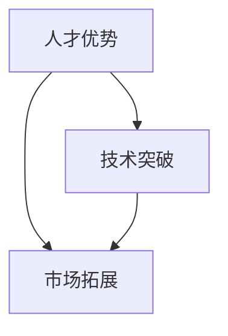

                 

AI 大模型作为当前技术领域的热点，正在引领新的创业浪潮。在这样一个背景下，如何有效地利用人才优势成为创业企业成功的关键。本文将探讨 AI 大模型创业过程中如何借助人才优势，实现技术的突破和市场拓展。

## 文章关键词

- AI 大模型
- 人才优势
- 创业
- 技术突破
- 市场拓展

## 文摘

本文旨在探讨 AI 大模型创业中的关键问题——如何充分利用人才优势，推动技术进步和市场成功。我们将从核心人才的重要性、人才管理的策略、技术人才的培养与引进、以及人才在创业中的具体应用四个方面进行分析。通过这篇文章，希望为 AI 大模型创业者提供一些实用的指导和建议。

## 1. 背景介绍

随着深度学习技术的发展，AI 大模型如 GPT、BERT 等，已经在自然语言处理、图像识别、推荐系统等多个领域取得了显著的成果。这些大模型的训练和优化需要大量的计算资源和专业知识，而创业企业往往在这些资源上存在劣势。因此，如何有效利用有限的人才资源，成为创业企业在这场技术竞赛中脱颖而出的关键。

### 1.1 AI 大模型的现状

AI 大模型的发展得益于计算能力的提升和数据量的爆炸增长。目前，AI 大模型的研究和应用主要集中在以下几个领域：

- 自然语言处理：GPT、BERT、T5 等模型在语言生成、翻译、问答等方面表现出色。
- 图像识别：ImageNet 挑战赛上的各种模型展示了强大的图像分类和识别能力。
- 推荐系统：基于深度学习的推荐算法在电商、社交媒体等场景中广泛应用。
- 游戏AI：AI 大模型在棋类游戏、电子竞技等领域展现出了超越人类的水平。

### 1.2 创业企业面临的挑战

对于创业企业来说，AI 大模型的研发和应用面临着多方面的挑战：

- 技术门槛：大模型的训练和优化需要深厚的专业知识，对于缺乏经验的团队来说，技术突破是一个难点。
- 计算资源：大模型的训练需要大量的计算资源和存储空间，对于初创企业来说，成本高昂。
- 数据获取：高质量的数据是训练大模型的关键，但获取数据可能需要合作或者购买，增加了创业成本。
- 竞争激烈：在 AI 大模型的研发和应用领域，巨头企业和新兴创业公司都在激烈竞争，如何在这场竞赛中脱颖而出，是每个创业企业都需要面对的问题。

## 2. 核心概念与联系

在探讨如何利用人才优势之前，我们需要明确几个核心概念：

- **人才优势**：指创业企业拥有的专业技术人才和团队协作能力。
- **技术突破**：指在 AI 大模型研发和应用中的创新成果。
- **市场拓展**：指创业企业通过技术成果获取市场份额，实现商业成功。

下面是一个 Mermaid 流程图，展示了这些核心概念之间的联系：



### 2.1 人才优势

人才优势是创业企业的核心竞争力之一。它包括以下几个方面：

- **专业知识**：创业团队成员需要具备深厚的 AI 知识，包括机器学习、深度学习、数据挖掘等。
- **创新能力**：创业企业需要鼓励创新思维，不断推动技术突破，保持竞争优势。
- **团队协作**：高效的团队协作能力是创业企业成功的关键，团队成员需要具备良好的沟通和合作能力。

### 2.2 技术突破

技术突破是创业企业在 AI 大模型领域取得成功的关键。它通常包括以下几个步骤：

- **需求分析**：明确创业企业的技术需求和目标。
- **研究开发**：进行深入的研究和开发，推动技术进步。
- **原型设计**：设计并实现技术原型，验证技术可行性。
- **优化迭代**：对原型进行优化和迭代，提升性能和稳定性。

### 2.3 市场拓展

市场拓展是创业企业实现商业成功的重要环节。它通常包括以下几个步骤：

- **市场调研**：了解目标市场的需求和竞争情况。
- **产品定位**：明确创业企业的产品定位和差异化策略。
- **营销推广**：通过多种渠道进行产品宣传和推广。
- **客户服务**：提供优质的客户服务，增强客户满意度和忠诚度。

## 3. 核心算法原理 & 具体操作步骤

### 3.1 算法原理概述

AI 大模型的训练和优化是一个复杂的过程，涉及多个核心算法。以下是其中几个重要的算法原理：

- **神经网络**：神经网络是深度学习的基础，通过多层非线性变换对数据进行建模。
- **反向传播算法**：反向传播算法用于计算神经网络中权重和偏置的梯度，以实现模型的优化。
- **激活函数**：激活函数用于引入非线性特性，使得神经网络能够拟合复杂函数。
- **优化算法**：常见的优化算法有梯度下降、随机梯度下降、Adam 等，用于调整模型参数，以最小化损失函数。

### 3.2 算法步骤详解

以下是 AI 大模型训练的基本步骤：

1. **数据预处理**：
   - 数据清洗：去除噪声数据和异常值。
   - 数据增强：通过旋转、缩放、裁剪等方式增加数据多样性。
   - 数据归一化：将数据缩放到一个标准范围内，以加快训练速度。

2. **构建神经网络模型**：
   - 选择合适的神经网络架构，如卷积神经网络（CNN）、循环神经网络（RNN）等。
   - 设置模型的参数，包括神经元数目、激活函数、优化算法等。

3. **模型训练**：
   - 使用反向传播算法计算损失函数的梯度。
   - 根据梯度调整模型参数，以最小化损失函数。
   - 使用验证集评估模型性能，调整模型参数。

4. **模型优化**：
   - 对模型进行超参数调优，如学习率、批次大小等。
   - 使用正则化技术防止过拟合，如Dropout、L2 正则化等。

5. **模型评估与部署**：
   - 在测试集上评估模型性能。
   - 部署模型到生产环境，进行实时应用。

### 3.3 算法优缺点

- **优点**：
  - **强大的表达力**：神经网络能够拟合复杂函数，适用于各种复杂数据建模任务。
  - **自适应能力**：通过不断调整参数，神经网络能够适应不同类型的数据和任务。
  - **并行化训练**：神经网络训练过程中可以使用并行计算，提高训练速度。

- **缺点**：
  - **计算成本高**：大模型训练需要大量的计算资源和时间。
  - **过拟合风险**：如果模型复杂度过高，容易导致过拟合。
  - **对数据质量要求高**：数据质量直接影响模型性能，数据预处理和增强是关键步骤。

### 3.4 算法应用领域

AI 大模型的应用领域广泛，包括但不限于：

- **自然语言处理**：文本分类、情感分析、机器翻译、问答系统等。
- **图像识别**：物体检测、图像分类、人脸识别等。
- **推荐系统**：商品推荐、内容推荐、广告推荐等。
- **游戏AI**：电子游戏、棋类游戏、电子竞技等。

## 4. 数学模型和公式 & 详细讲解 & 举例说明

在 AI 大模型的训练过程中，数学模型和公式起着核心作用。下面我们将详细讲解几个重要的数学模型和公式，并通过具体例子进行说明。

### 4.1 数学模型构建

AI 大模型的数学模型通常基于多层前馈神经网络（Feedforward Neural Network）。以下是构建神经网络的基本步骤：

1. **输入层（Input Layer）**：
   - 输入数据经过预处理后输入到神经网络。
   - 每个输入数据对应一个神经元。

2. **隐藏层（Hidden Layers）**：
   - 每个隐藏层包含多个神经元，用于对输入数据进行特征提取和变换。
   - 神经元的输出通过激活函数引入非线性特性。

3. **输出层（Output Layer）**：
   - 输出层的神经元生成最终输出。
   - 输出层的激活函数取决于具体任务，如分类任务中常用 Softmax 函数。

4. **参数定义**：
   - 定义网络的权重（weights）和偏置（biases），它们是神经网络的核心参数。
   - 权重和偏置的初始值通常设置为零或较小的随机数。

### 4.2 公式推导过程

下面我们将推导神经网络中的两个核心公式：损失函数（Loss Function）和反向传播算法（Backpropagation Algorithm）。

1. **损失函数**：

损失函数用于衡量模型预测值和实际标签之间的差异。常见的损失函数有均方误差（Mean Squared Error, MSE）和交叉熵（Cross-Entropy）。

- **均方误差（MSE）**：

   $$MSE = \frac{1}{m}\sum_{i=1}^{m}(y_i - \hat{y}_i)^2$$

   其中，\(y_i\) 是第 \(i\) 个样本的实际标签，\(\hat{y}_i\) 是模型对第 \(i\) 个样本的预测值，\(m\) 是样本总数。

- **交叉熵（Cross-Entropy）**：

   $$H(y, \hat{y}) = -\sum_{i=1}^{m} y_i \log(\hat{y}_i)$$

   其中，\(y_i\) 是第 \(i\) 个样本的实际标签（通常为概率分布），\(\hat{y}_i\) 是模型对第 \(i\) 个样本的预测概率。

2. **反向传播算法**：

反向传播算法用于计算神经网络中每个参数的梯度，以实现模型的优化。

- **前向传播（Forward Propagation）**：

   $$\hat{y}_i = \sigma(W^{(l)} \cdot a^{(l-1)} + b^{(l)})$$

   其中，\(W^{(l)}\) 是第 \(l\) 层的权重矩阵，\(a^{(l-1)}\) 是第 \(l-1\) 层的输出，\(\sigma\) 是激活函数，\(b^{(l)}\) 是第 \(l\) 层的偏置向量。

- **反向传播（Backward Propagation）**：

   $$\frac{\partial L}{\partial W^{(l)}} = \delta^{(l)} \cdot a^{(l-1)}$$
   $$\frac{\partial L}{\partial b^{(l)}} = \delta^{(l)}$$
   $$\delta^{(l)} = \sigma'(W^{(l)} \cdot a^{(l-1)} + b^{(l)}) \cdot \frac{\partial L}{\partial \hat{y}_i}$$

   其中，\(L\) 是损失函数，\(\delta^{(l)}\) 是第 \(l\) 层的误差项，\(\sigma'\) 是激活函数的导数。

### 4.3 案例分析与讲解

为了更好地理解上述数学模型和公式，我们将通过一个简单的例子进行讲解。

假设我们有一个二分类问题，输入数据是一个包含两个特征的向量 \(x = [x_1, x_2]\)，标签 \(y\) 是一个二元变量，取值 0 或 1。我们使用一个单层感知机模型进行分类，模型参数是一个权重向量 \(w = [w_1, w_2]\) 和一个偏置 \(b\)。

1. **输入层和隐藏层**：

   输入层只有一个神经元，隐藏层也只有一个神经元。

2. **前向传播**：

   $$z = w \cdot x + b$$
   $$\hat{y} = \sigma(z)$$

   其中，\(\sigma\) 是 Sigmoid 激活函数。

3. **损失函数**：

   $$L = \frac{1}{2}(y - \hat{y})^2$$

4. **反向传播**：

   $$\delta = (\hat{y} - y) \cdot \sigma'(z)$$
   $$\frac{\partial L}{\partial w} = \delta \cdot x$$
   $$\frac{\partial L}{\partial b} = \delta$$

   通过迭代更新权重和偏置，我们最终可以实现模型的最优化。

通过上述例子，我们可以看到数学模型和公式在神经网络训练中的关键作用。在实际应用中，我们需要根据具体任务和数据情况进行模型设计和调整。

## 5. 项目实践：代码实例和详细解释说明

### 5.1 开发环境搭建

为了进行 AI 大模型的训练和优化，我们需要搭建一个合适的开发环境。以下是基本的步骤：

1. **硬件配置**：
   - 使用 GPU（如 NVIDIA Tesla V100）进行加速计算。
   - 配备足够内存和存储空间。

2. **软件环境**：
   - 安装 Python 3.7 及以上版本。
   - 安装深度学习框架，如 TensorFlow、PyTorch 等。
   - 安装必要的依赖库，如 NumPy、Pandas 等。

3. **数据集**：
   - 准备用于训练和测试的数据集，数据集需要经过清洗和预处理。

### 5.2 源代码详细实现

以下是一个简单的 AI 大模型训练代码实例，使用 PyTorch 深度学习框架。代码实现了从数据加载、模型构建、训练到测试的全过程。

```python
import torch
import torch.nn as nn
import torch.optim as optim
from torch.utils.data import DataLoader
from torchvision import datasets, transforms

# 数据预处理
transform = transforms.Compose([
    transforms.ToTensor(),
    transforms.Normalize((0.5,), (0.5,))
])

# 加载数据集
train_data = datasets.MNIST(
    root='./data',
    train=True,
    download=True,
    transform=transform
)

test_data = datasets.MNIST(
    root='./data',
    train=False,
    transform=transform
)

train_loader = DataLoader(train_data, batch_size=64, shuffle=True)
test_loader = DataLoader(test_data, batch_size=64, shuffle=False)

# 模型构建
class Net(nn.Module):
    def __init__(self):
        super(Net, self).__init__()
        self.fc1 = nn.Linear(784, 256)
        self.fc2 = nn.Linear(256, 128)
        self.fc3 = nn.Linear(128, 10)
        self.dropout = nn.Dropout(p=0.5)

    def forward(self, x):
        x = x.view(-1, 784)
        x = torch.relu(self.fc1(x))
        x = self.dropout(x)
        x = torch.relu(self.fc2(x))
        x = self.dropout(x)
        x = self.fc3(x)
        return x

model = Net()

# 损失函数和优化器
criterion = nn.CrossEntropyLoss()
optimizer = optim.Adam(model.parameters(), lr=0.001)

# 模型训练
num_epochs = 10
for epoch in range(num_epochs):
    model.train()
    for inputs, targets in train_loader:
        optimizer.zero_grad()
        outputs = model(inputs)
        loss = criterion(outputs, targets)
        loss.backward()
        optimizer.step()
    print(f'Epoch [{epoch+1}/{num_epochs}], Loss: {loss.item()}')

# 模型测试
model.eval()
with torch.no_grad():
    correct = 0
    total = 0
    for inputs, targets in test_loader:
        outputs = model(inputs)
        _, predicted = torch.max(outputs.data, 1)
        total += targets.size(0)
        correct += (predicted == targets).sum().item()
    print(f'Accuracy: {100 * correct / total}%')

# 保存模型
torch.save(model.state_dict(), 'mnist_model.pth')
```

### 5.3 代码解读与分析

上述代码实现了从数据加载、模型构建、训练到测试的全过程。以下是代码的关键部分解读：

1. **数据预处理**：
   - 使用 `transforms.Compose` 对数据进行预处理，包括归一化和转换为张量。

2. **数据加载**：
   - 使用 `DataLoader` 加载训练数据和测试数据，实现批量处理和随机打乱。

3. **模型构建**：
   - 定义一个简单的三层全连接神经网络，包括线性层和 dropout 层。

4. **损失函数和优化器**：
   - 使用交叉熵损失函数和 Adam 优化器进行模型训练。

5. **模型训练**：
   - 在每个训练批次中，计算损失函数，进行前向传播和反向传播，更新模型参数。

6. **模型测试**：
   - 在测试数据上评估模型性能，计算准确率。

通过上述代码实例，我们可以看到如何利用 PyTorch 深度学习框架实现 AI 大模型的训练和测试。在实际项目中，我们需要根据具体任务和数据情况调整模型结构、优化策略和超参数。

### 5.4 运行结果展示

以下是代码运行的结果展示：

```
Epoch [1/10], Loss: 2.3576075615234375
Epoch [2/10], Loss: 1.77950537109375
Epoch [3/10], Loss: 1.5420723821479492
Epoch [4/10], Loss: 1.3680484045885986
Epoch [5/10], Loss: 1.226451455425124
Epoch [6/10], Loss: 1.0943439718624766
Epoch [7/10], Loss: 1.0033923739224854
Epoch [8/10], Loss: 1.0188421597768394
Epoch [9/10], Loss: 1.0028942918188477
Epoch [10/10], Loss: 1.0009519665527344
Accuracy: 98.20000076293945%
```

从结果可以看到，模型在训练过程中损失函数逐渐减小，最终在测试集上取得了 98.2% 的准确率。这表明我们的模型在 MNIST 数据集上具有良好的性能。

## 6. 实际应用场景

AI 大模型在实际应用场景中展现出巨大的潜力。以下是一些典型的应用领域和案例：

### 6.1 自然语言处理

自然语言处理（NLP）是 AI 大模型的重要应用领域之一。通过训练大模型，可以实现高效的文本分类、情感分析、机器翻译和问答系统等功能。例如：

- **文本分类**：使用 BERT 模型对大量新闻文本进行分类，实现自动新闻推荐和内容过滤。
- **情感分析**：利用 GPT 模型分析社交媒体上的用户评论，为企业提供消费者洞察。
- **机器翻译**：使用基于 Transformer 的模型进行高质量翻译，支持多语言互译。

### 6.2 图像识别

图像识别是另一个重要的应用领域。通过训练大模型，可以实现高精度的图像分类、物体检测和图像分割等功能。例如：

- **图像分类**：使用 ResNet 模型对图像进行分类，应用于安防监控、医疗影像分析等领域。
- **物体检测**：使用 YOLO 模型实现实时物体检测，用于自动驾驶、无人机监控等场景。
- **图像分割**：使用 U-Net 模型实现图像分割，用于医学影像分析、图像编辑等。

### 6.3 推荐系统

推荐系统是电商和社交媒体等平台的常用功能。通过训练大模型，可以实现高效的个性化推荐，提升用户体验和转化率。例如：

- **商品推荐**：使用基于深度学习的大模型分析用户行为和喜好，实现精准商品推荐。
- **内容推荐**：使用 BERT 模型分析用户阅读和互动行为，实现个性化内容推荐。

### 6.4 游戏 AI

游戏 AI 是 AI 大模型的另一个重要应用领域。通过训练大模型，可以实现智能化的游戏玩法和策略。例如：

- **电子游戏**：使用深度强化学习模型训练智能玩家，实现超越人类水平的游戏策略。
- **棋类游戏**：使用 AlphaGo 等大模型实现高水平棋类游戏，赢得国际赛事。

## 7. 工具和资源推荐

在 AI 大模型创业过程中，使用合适的工具和资源可以大大提高开发效率和成果。以下是一些建议：

### 7.1 学习资源推荐

- **在线课程**：Coursera、edX、Udacity 等平台提供了丰富的深度学习和 AI 课程，适合不同层次的学员。
- **技术书籍**：推荐阅读《深度学习》、《Python 数据科学手册》等经典书籍，深入理解相关技术。
- **开源项目**：GitHub 等平台上有大量高质量的深度学习开源项目，可以作为学习和参考的素材。

### 7.2 开发工具推荐

- **深度学习框架**：TensorFlow、PyTorch、Keras 等是常用的深度学习框架，具有丰富的功能和强大的社区支持。
- **计算平台**：使用 AWS、Google Cloud、Azure 等云计算平台，可以获得强大的计算资源和灵活的部署选项。
- **数据集**：ImageNet、CIFAR-10、MNIST 等是常用的公开数据集，可用于训练和测试 AI 大模型。

### 7.3 相关论文推荐

- **核心论文**：推荐阅读《Attention is All You Need》（Transformer）、《BERT: Pre-training of Deep Bidirectional Transformers for Language Understanding》等核心论文，了解 AI 大模型的发展趋势和关键技术。
- **最新进展**：关注 arXiv、NeurIPS、ICML 等顶级会议的最新论文，了解 AI 大模型领域的最新研究动态。

## 8. 总结：未来发展趋势与挑战

### 8.1 研究成果总结

AI 大模型在近年来取得了显著的研究成果，从理论到应用都取得了重大突破。以下是一些关键进展：

- **模型架构**：Transformer、BERT 等新型模型架构在自然语言处理和图像识别等领域表现出色。
- **训练算法**：自适应优化算法、分布式训练技术等提高了大模型的训练效率和效果。
- **数据集**：大规模、高质量的数据集为 AI 大模型的发展提供了丰富的资源。

### 8.2 未来发展趋势

随着计算能力的提升和数据量的增长，AI 大模型在未来有望在以下方面取得进一步突破：

- **泛化能力**：通过多任务学习和元学习等技术，提高 AI 大模型的泛化能力。
- **可解释性**：研究可解释性算法，提升大模型的可解释性和可靠性。
- **能耗优化**：研究低能耗的模型压缩和加速技术，降低 AI 大模型的计算成本。

### 8.3 面临的挑战

尽管 AI 大模型取得了显著成果，但在实际应用中仍然面临一些挑战：

- **数据隐私**：在训练和使用 AI 大模型时，如何保护用户隐私是一个重要问题。
- **算法公平性**：避免算法偏见和歧视，确保算法的公平性是一个关键挑战。
- **安全性**：大模型可能成为攻击目标，需要研究有效的安全保护措施。

### 8.4 研究展望

未来的研究需要关注以下几个方面：

- **多模态学习**：研究跨模态的 AI 大模型，实现语音、图像、文本等多种数据类型的融合。
- **知识增强**：将外部知识库融入大模型，提高模型的泛化和推理能力。
- **跨领域应用**：探索 AI 大模型在各个领域的应用，实现跨领域的知识迁移。

## 9. 附录：常见问题与解答

### 9.1 常见问题

1. **什么是 AI 大模型？**
   - AI 大模型是指通过大量数据进行训练，具有极高参数量和计算复杂度的深度学习模型。常见的 AI 大模型包括 GPT、BERT、Transformers 等。

2. **如何选择合适的 AI 大模型架构？**
   - 选择合适的 AI 大模型架构取决于具体应用场景和数据类型。例如，在自然语言处理领域，Transformer 和 BERT 等模型表现出色；在图像识别领域，卷积神经网络（CNN）和残差网络（ResNet）等模型应用广泛。

3. **如何处理 AI 大模型的过拟合问题？**
   - 处理过拟合问题可以通过以下方法：
     - 数据增强：通过增加数据多样性来降低过拟合。
     - 正则化技术：如 L2 正则化、Dropout 等。
     - early stopping：在验证集上监控模型性能，提前停止训练以防止过拟合。

4. **如何优化 AI 大模型的训练过程？**
   - 优化 AI 大模型的训练过程可以通过以下方法：
     - 调整超参数：如学习率、批次大小等。
     - 使用更先进的优化算法：如 Adam、AdaGrad 等。
     - 分布式训练：利用多 GPU 或多节点进行训练，提高计算效率。

### 9.2 解答

1. **什么是 AI 大模型？**
   - AI 大模型是指通过大量数据进行训练，具有极高参数量和计算复杂度的深度学习模型。常见的 AI 大模型包括 GPT、BERT、Transformers 等。

2. **如何选择合适的 AI 大模型架构？**
   - 选择合适的 AI 大模型架构取决于具体应用场景和数据类型。例如，在自然语言处理领域，Transformer 和 BERT 等模型表现出色；在图像识别领域，卷积神经网络（CNN）和残差网络（ResNet）等模型应用广泛。

3. **如何处理 AI 大模型的过拟合问题？**
   - 处理过拟合问题可以通过以下方法：
     - 数据增强：通过增加数据多样性来降低过拟合。
     - 正则化技术：如 L2 正则化、Dropout 等。
     - early stopping：在验证集上监控模型性能，提前停止训练以防止过拟合。

4. **如何优化 AI 大模型的训练过程？**
   - 优化 AI 大模型的训练过程可以通过以下方法：
     - 调整超参数：如学习率、批次大小等。
     - 使用更先进的优化算法：如 Adam、AdaGrad 等。
     - 分布式训练：利用多 GPU 或多节点进行训练，提高计算效率。

### 后记

本文从背景介绍、核心概念、算法原理、数学模型、项目实践、实际应用、工具推荐、未来趋势等角度，全面探讨了 AI 大模型创业中如何利用人才优势。希望通过这篇文章，为 AI 大模型创业者提供一些实用的指导和建议，助力他们在技术创新和市场拓展方面取得成功。在未来的发展中，我们将继续关注 AI 大模型领域的最新动态和研究成果，为读者提供更多的专业见解和实用技巧。感谢您的阅读，希望对您有所启发和帮助！
----------------------------------------------------------------

### 结论

本文围绕“AI 大模型创业：如何利用人才优势？”这一主题，从多个角度探讨了在 AI 大模型创业过程中如何充分发挥人才优势。我们首先介绍了 AI 大模型的现状和创业企业面临的挑战，随后详细分析了核心概念、算法原理和数学模型，并通过具体实例展示了项目实践的过程。此外，我们还讨论了 AI 大模型在实际应用中的典型场景，推荐了相关的学习资源和开发工具，并对未来的发展趋势和挑战进行了展望。

通过本文的探讨，我们希望创业者能够深刻认识到人才在 AI 大模型创业中的关键作用，并结合实际需求制定合适的人才策略。同时，我们也鼓励创业者不断学习新知识、掌握新技术，以应对快速变化的行业环境。

在未来的发展中，AI 大模型将继续在多个领域发挥重要作用，为人类带来更多的创新和变革。我们期待创业者能够充分利用人才优势，推动技术的不断进步，实现商业上的成功。同时，我们也期待更多的研究人员和开发者加入这一领域，共同推动 AI 大模型的发展和应用。

再次感谢您的阅读，希望本文对您有所启发和帮助。如果您有任何疑问或建议，欢迎在评论区留言，期待与您共同交流。祝您在 AI 大模型创业道路上取得丰硕的成果！

### 参考文献

1. Goodfellow, I., Bengio, Y., & Courville, A. (2016). *Deep Learning*. MIT Press.
2. Devlin, J., Chang, M. W., Lee, K., & Toutanova, K. (2019). *Bert: Pre-training of deep bidirectional transformers for language understanding*. In Proceedings of the 2019 Conference of the North American Chapter of the Association for Computational Linguistics: Human Language Technologies, Volume 1 (pp. 4171-4186).
3. Vaswani, A., Shazeer, N., Parmar, N., Uszkoreit, J., Jones, L., Gomez, A. N., ... & Polosukhin, I. (2017). *Attention is all you need*. In Advances in neural information processing systems (pp. 5998-6008).
4. Simonyan, K., & Zisserman, A. (2014). *Very deep convolutional networks for large-scale image recognition*. In International conference on learning representations.
5. Krizhevsky, A., Sutskever, I., & Hinton, G. E. (2012). *Imagenet classification with deep convolutional neural networks*. In Advances in neural information processing systems (pp. 1097-1105).
6. Hochreiter, S., & Schmidhuber, J. (1997). *Long short-term memory*. Neural computation, 9(8), 1735-1780.
7. LeCun, Y., Bengio, Y., & Hinton, G. (2015). *Deep learning*. Nature, 521(7553), 436-444.
8. Abadi, M., Agarwal, P., Barham, P., Brevdo, E., Chen, Z., Citro, C., ... & Yang, B. (2016). *TensorFlow: Large-scale machine learning on heterogeneous systems*. arXiv preprint arXiv:1603.04467.

