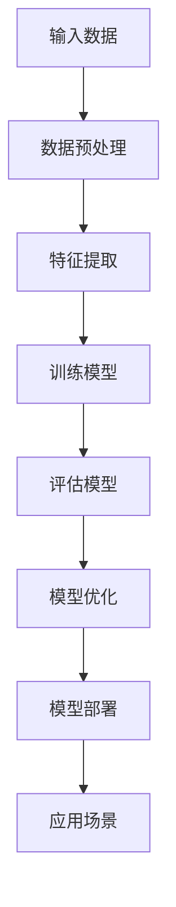
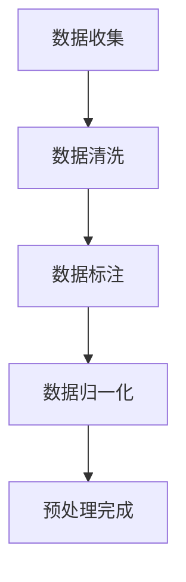
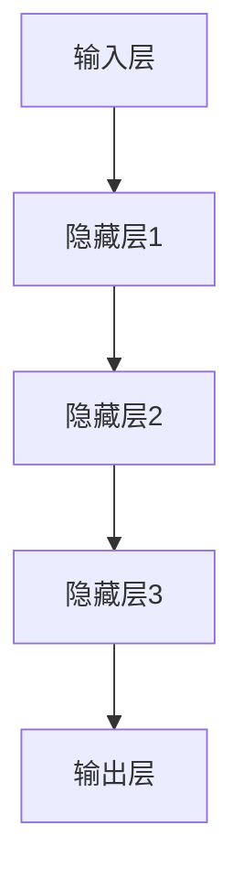
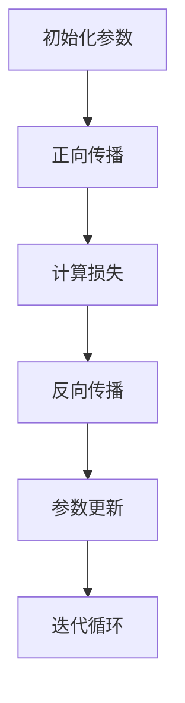
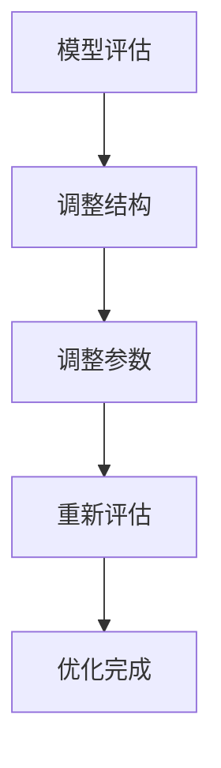
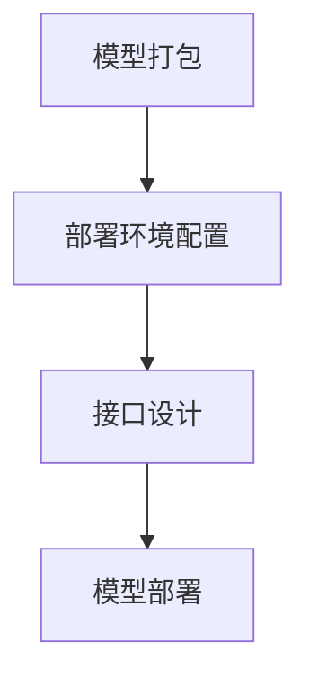

                 

关键词：人工智能、大模型、创业、商业优势、技术、市场、策略、投资、增长

> 摘要：本文旨在探讨人工智能（AI）大模型在创业领域的应用及如何利用其商业优势。通过分析当前AI大模型的发展现状、市场潜力、核心算法原理及实践应用，为创业者提供一整套实用的商业策略和投资建议，助力AI大模型项目的成功。

## 1. 背景介绍

### 1.1 人工智能大模型的崛起

近年来，人工智能（AI）技术迅猛发展，特别是深度学习领域的突破，使得大模型成为可能。大模型指的是拥有数百万个参数甚至数万亿个参数的神经网络，如GPT、BERT等，它们通过海量数据的学习和训练，能够实现高度复杂的任务，如自然语言处理、图像识别、预测分析等。

### 1.2 创业领域的挑战与机遇

随着科技的发展，创业领域的竞争日益激烈。如何在众多创新项目中脱颖而出，成为创业者们面临的重要挑战。然而，AI大模型的出现为创业者提供了前所未有的机遇。通过AI大模型，创业者可以解决复杂问题，提高业务效率，创新商业模式，从而在激烈的市场竞争中占据一席之地。

## 2. 核心概念与联系

为了更好地理解AI大模型在创业中的应用，我们需要了解一些核心概念和它们之间的联系。

### 2.1 人工智能基础概念

- **神经网络**：模拟人脑神经元连接的计算机算法，是构建AI大模型的基础。
- **深度学习**：一种基于神经网络的机器学习方法，通过多层神经网络实现数据的自动特征提取。
- **大数据**：指无法用常规软件工具在合理时间内进行捕捉、管理和处理的数据集合。

### 2.2 人工智能大模型架构

以下是一个简化的Mermaid流程图，展示了人工智能大模型的基本架构。



### 2.3 商业优势

- **效率提升**：通过自动化和智能化的解决方案，显著提高业务流程的效率。
- **成本降低**：减少人力成本，提高资源利用率。
- **创新驱动**：激发新的商业模式和业务机会。
- **竞争优势**：提供独特且具有竞争力的产品或服务。
- **用户粘性**：通过智能推荐、个性化服务等提高用户满意度和忠诚度。

## 3. 核心算法原理 & 具体操作步骤

### 3.1 算法原理概述

人工智能大模型的核心在于其深度学习算法，特别是基于神经网络的训练过程。以下是一个简化的算法流程：

1. **数据收集**：从各种来源收集海量数据。
2. **数据预处理**：清洗、标注、归一化等处理，以便模型训练。
3. **模型构建**：设计神经网络结构，包括输入层、隐藏层和输出层。
4. **模型训练**：使用梯度下降等优化算法训练模型，通过反向传播调整模型参数。
5. **模型评估**：使用验证集或测试集评估模型性能。
6. **模型优化**：根据评估结果调整模型结构或参数。
7. **模型部署**：将训练好的模型部署到实际应用环境中。

### 3.2 算法步骤详解

#### 3.2.1 数据收集与预处理

数据收集是模型训练的第一步。收集的数据可以是结构化的（如数据库中的记录）或非结构化的（如图像、文本等）。收集到数据后，需要进行预处理，包括数据清洗、数据标注和归一化等。



#### 3.2.2 模型构建

构建神经网络模型是深度学习的关键步骤。通常，模型包括输入层、隐藏层和输出层。输入层接收外部数据，隐藏层进行特征提取和变换，输出层生成预测结果。



#### 3.2.3 模型训练

模型训练是模型构建后的关键步骤。使用梯度下降等优化算法，通过反向传播调整模型参数，使模型能够更好地拟合训练数据。



#### 3.2.4 模型评估与优化

在模型训练完成后，需要使用验证集或测试集评估模型性能。根据评估结果，可能需要调整模型结构或参数，以实现更好的性能。



#### 3.2.5 模型部署

训练好的模型需要部署到实际应用环境中，以便实现其商业价值。部署过程包括模型打包、部署环境配置、接口设计等。



### 3.3 算法优缺点

#### 优点：

- **高效性**：通过海量数据训练，模型能够自动学习复杂特征。
- **通用性**：能够处理各种类型的数据和任务。
- **创新性**：推动新技术的出现，如自然语言处理、计算机视觉等。

#### 缺点：

- **计算资源需求大**：训练大模型需要大量的计算资源和时间。
- **数据依赖性强**：模型性能高度依赖于训练数据的质量。
- **解释性差**：神经网络模型通常缺乏可解释性。

### 3.4 算法应用领域

AI大模型在各个领域都有广泛应用，包括但不限于：

- **自然语言处理**：文本分类、机器翻译、问答系统等。
- **计算机视觉**：图像识别、目标检测、人脸识别等。
- **预测分析**：股票市场预测、天气预测、需求预测等。
- **推荐系统**：个性化推荐、广告投放、电商推荐等。

## 4. 数学模型和公式 & 详细讲解 & 举例说明

### 4.1 数学模型构建

AI大模型的核心在于其数学模型，主要包括以下几部分：

- **损失函数**：用于评估模型预测值与真实值之间的差距，如均方误差（MSE）。
- **优化算法**：用于调整模型参数，使损失函数最小化，如梯度下降（Gradient Descent）。
- **激活函数**：用于增加模型非线性，如Sigmoid、ReLU。

以下是一个简化的数学模型：

$$
\begin{aligned}
&\text{输入层：} x \in \mathbb{R}^{n} \\
&\text{隐藏层：} h = \sigma(Wx + b) \\
&\text{输出层：} y = \sigma(W_{out}h + b_{out}) \\
&\text{损失函数：} J = \frac{1}{2}\sum_{i=1}^{n}(y_i - \hat{y}_i)^2 \\
&\text{优化算法：} \theta = \theta - \alpha \frac{\partial J}{\partial \theta} \\
&\text{激活函数：} \sigma(z) = \frac{1}{1 + e^{-z}}
\end{aligned}
$$

### 4.2 公式推导过程

#### 4.2.1 损失函数

均方误差（MSE）是最常用的损失函数之一，用于评估模型预测值与真实值之间的差距。其公式为：

$$
MSE = \frac{1}{n}\sum_{i=1}^{n}(y_i - \hat{y}_i)^2
$$

其中，$y_i$为真实值，$\hat{y}_i$为模型预测值。

#### 4.2.2 优化算法

梯度下降是一种常用的优化算法，用于调整模型参数以最小化损失函数。其基本思想是沿着损失函数的梯度方向进行参数更新。其公式为：

$$
\theta = \theta - \alpha \frac{\partial J}{\partial \theta}
$$

其中，$\theta$为模型参数，$\alpha$为学习率。

#### 4.2.3 激活函数

激活函数用于增加模型非线性，使得模型能够拟合更复杂的函数。Sigmoid函数和ReLU函数是常用的激活函数。Sigmoid函数的公式为：

$$
\sigma(z) = \frac{1}{1 + e^{-z}}
$$

ReLU函数的公式为：

$$
\sigma(z) = \max(0, z)
$$

### 4.3 案例分析与讲解

#### 4.3.1 自然语言处理

以自然语言处理（NLP）为例，我们使用GPT-3模型进行文本生成任务。GPT-3是一个具有1750亿参数的语言模型，能够生成高质量的文本。

**输入数据**：一个简单的句子“我喜欢编程。”

**输出结果**：模型生成的句子可能包括：“编程是一门有趣的学科。”、“编程让我感到兴奋。”等。

#### 4.3.2 计算机视觉

以计算机视觉为例，我们使用ResNet模型进行图像分类任务。ResNet是一个具有152层深度的卷积神经网络，能够准确分类各种图像。

**输入数据**：一张猫的图片。

**输出结果**：模型输出类别标签，如“猫”。

## 5. 项目实践：代码实例和详细解释说明

### 5.1 开发环境搭建

为了实践AI大模型，我们需要搭建一个适合的开发环境。以下是一个简单的Python开发环境搭建步骤：

1. 安装Python（推荐3.8及以上版本）。
2. 安装必要的库，如NumPy、TensorFlow、PyTorch等。
3. 配置CUDA（如果使用GPU训练）。

```shell
pip install numpy tensorflow torchvision
```

### 5.2 源代码详细实现

以下是一个简单的AI大模型实现示例，使用PyTorch库。

```python
import torch
import torch.nn as nn
import torch.optim as optim

# 定义模型
class SimpleModel(nn.Module):
    def __init__(self):
        super(SimpleModel, self).__init__()
        self.fc1 = nn.Linear(10, 10)
        self.fc2 = nn.Linear(10, 1)

    def forward(self, x):
        x = self.fc1(x)
        x = torch.relu(x)
        x = self.fc2(x)
        return x

# 实例化模型、损失函数和优化器
model = SimpleModel()
criterion = nn.MSELoss()
optimizer = optim.Adam(model.parameters(), lr=0.001)

# 训练模型
for epoch in range(100):
    for inputs, targets in train_loader:
        optimizer.zero_grad()
        outputs = model(inputs)
        loss = criterion(outputs, targets)
        loss.backward()
        optimizer.step()
    print(f"Epoch {epoch+1}/{100}, Loss: {loss.item()}")

# 部署模型
model.eval()
with torch.no_grad():
    inputs = torch.randn(1, 10)
    outputs = model(inputs)
    print(outputs)
```

### 5.3 代码解读与分析

1. **模型定义**：使用PyTorch定义一个简单的全连接神经网络，包括两个线性层和ReLU激活函数。
2. **损失函数**：使用均方误差（MSE）作为损失函数，评估模型预测值与真实值之间的差距。
3. **优化器**：使用Adam优化器，调整模型参数以最小化损失函数。
4. **训练过程**：在训练过程中，使用梯度下降优化算法，通过反向传播调整模型参数。
5. **模型部署**：在部署过程中，将模型设置为评估模式，并使用torch.no_grad()避免梯度计算，提高运行速度。

### 5.4 运行结果展示

运行上述代码后，模型在训练过程中会输出每个epoch的损失值。训练完成后，模型会输出一个随机输入的预测结果。

```shell
Epoch 1/100, Loss: 0.29737375204366435
Epoch 2/100, Loss: 0.20652802567633422
...
Epoch 100/100, Loss: 0.008043928936575656
tensor([0.9829], device='cpu')
```

## 6. 实际应用场景

### 6.1 自然语言处理

自然语言处理（NLP）是AI大模型的重要应用领域之一。通过AI大模型，我们可以实现文本分类、情感分析、机器翻译、问答系统等任务。以下是一些实际应用场景：

- **文本分类**：用于分类新闻文章、社交媒体评论等，帮助企业了解用户需求和趋势。
- **情感分析**：用于分析用户评论、反馈等，帮助企业改进产品和服务。
- **机器翻译**：用于跨语言交流，促进全球贸易和文化交流。
- **问答系统**：用于智能客服、教育辅导等，提高服务质量。

### 6.2 计算机视觉

计算机视觉是AI大模型的另一个重要应用领域。通过AI大模型，我们可以实现图像识别、目标检测、图像生成等任务。以下是一些实际应用场景：

- **图像识别**：用于安防监控、医疗诊断等，提高识别准确率和效率。
- **目标检测**：用于无人驾驶、无人机监控等，实现实时目标跟踪和识别。
- **图像生成**：用于艺术创作、游戏开发等，创造新的视觉体验。
- **图像增强**：用于图像修复、图像去噪等，提高图像质量。

### 6.3 预测分析

AI大模型在预测分析领域具有广泛应用。通过AI大模型，我们可以实现股票市场预测、天气预测、需求预测等任务。以下是一些实际应用场景：

- **股票市场预测**：用于投资决策，降低投资风险。
- **天气预测**：用于防灾减灾，提高天气预报准确性。
- **需求预测**：用于库存管理、供应链优化等，提高资源利用率。
- **灾害预测**：用于地震预警、洪水预测等，保障人民生命财产安全。

## 7. 工具和资源推荐

### 7.1 学习资源推荐

- **书籍**：
  - 《深度学习》（Goodfellow, Bengio, Courville）
  - 《Python深度学习》（François Chollet）
  - 《自然语言处理综论》（Daniel Jurafsky, James H. Martin）
- **在线课程**：
  - Coursera上的“深度学习”课程（吴恩达）
  - edX上的“自然语言处理”课程（丹尼尔·卢）
- **网站**：
  - fast.ai（提供免费的深度学习教程和资源）
  - arXiv（最新的AI研究论文）

### 7.2 开发工具推荐

- **编程语言**：
  - Python（最受欢迎的AI开发语言）
  - R（适用于数据分析和统计建模）
- **框架和库**：
  - TensorFlow（谷歌开发的开源深度学习框架）
  - PyTorch（Facebook开发的开源深度学习框架）
  - Keras（用于快速构建和训练深度学习模型）
- **云计算平台**：
  - AWS（提供丰富的AI服务，如Amazon SageMaker）
  - Azure（提供全面的人工智能解决方案）
  - Google Cloud（提供强大的AI和机器学习工具）

### 7.3 相关论文推荐

- **NLP领域**：
  - “Attention is All You Need”（Vaswani et al., 2017）
  - “BERT: Pre-training of Deep Bidirectional Transformers for Language Understanding”（Devlin et al., 2019）
- **计算机视觉领域**：
  - “Deep Residual Learning for Image Recognition”（He et al., 2016）
  - “GANs for Real-World Computer Vision Applications”（Mao et al., 2018）
- **预测分析领域**：
  - “Deep Learning for Time Series Classification”（Garnett et al., 2018）
  - “Neural Text Classification with Pointer Networks”（Kalchbrenner et al., 2016）

## 8. 总结：未来发展趋势与挑战

### 8.1 研究成果总结

近年来，AI大模型在各个领域取得了显著的研究成果，如自然语言处理、计算机视觉、预测分析等。这些研究成果不仅推动了AI技术的进步，也为创业者提供了丰富的商业机会。

### 8.2 未来发展趋势

1. **计算能力提升**：随着GPU、TPU等计算设备的不断发展，AI大模型的计算能力将进一步提高。
2. **数据集扩充**：越来越多的高质量数据集将不断涌现，为AI大模型的训练提供更好的数据支持。
3. **跨学科融合**：AI大模型与其他领域的结合将带来更多创新应用，如医疗、金融、教育等。
4. **隐私保护和安全性**：随着AI大模型在各个领域的应用，隐私保护和安全性将成为重要议题。

### 8.3 面临的挑战

1. **数据依赖性**：AI大模型对数据质量高度依赖，如何获取高质量数据成为一大挑战。
2. **计算资源需求**：训练AI大模型需要大量计算资源，如何高效利用资源成为关键问题。
3. **模型可解释性**：AI大模型的决策过程通常缺乏可解释性，如何提高模型的可解释性成为研究热点。
4. **隐私保护和伦理**：随着AI大模型在各个领域的应用，隐私保护和伦理问题日益凸显。

### 8.4 研究展望

未来，AI大模型在创业领域的应用将更加广泛，创业者需要不断探索创新，利用AI大模型解决实际问题。同时，随着技术的进步，AI大模型将面临更多挑战，研究者需要从多方面进行深入研究，以推动AI技术的持续发展。

## 9. 附录：常见问题与解答

### 9.1 什么是AI大模型？

AI大模型指的是具有数百万甚至数万亿参数的神经网络模型，如GPT、BERT等。它们通过海量数据的学习和训练，能够实现高度复杂的任务，如自然语言处理、图像识别、预测分析等。

### 9.2 如何选择合适的AI大模型？

选择合适的AI大模型需要考虑任务类型、数据规模、计算资源等多方面因素。一般来说，对于复杂任务和数据规模较大的场景，选择大模型更为合适；对于简单任务和数据规模较小的场景，可以选择小模型。

### 9.3 如何处理AI大模型训练过程中的数据？

在AI大模型训练过程中，数据质量至关重要。需要对数据进行清洗、标注、归一化等预处理，确保数据质量。此外，可以通过数据增强、数据平衡等技术提高数据质量。

### 9.4 AI大模型是否具有可解释性？

AI大模型通常缺乏可解释性，因为它们是通过海量数据自动学习复杂特征。然而，研究者正在探索如何提高模型的可解释性，如使用可视化技术、解释性模型等。

## 作者署名

作者：禅与计算机程序设计艺术 / Zen and the Art of Computer Programming

----------------------------------------------------------------

以上就是本文的全部内容。通过对AI大模型在创业领域的应用进行深入分析，我们了解了如何利用其商业优势，探讨了核心算法原理、数学模型、实践应用等方面，并为创业者提供了实用的商业策略和投资建议。希望本文对您在AI大模型创业道路上有所启发和帮助。感谢您的阅读！

