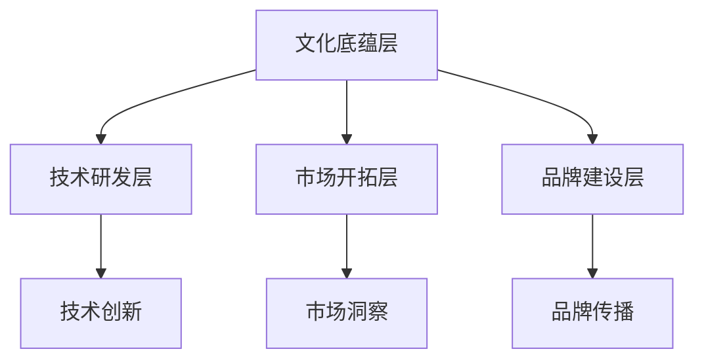

                 

关键词：AI大模型、创业、文化优势、技术策略、商业模式创新

> 摘要：本文探讨了在AI大模型创业过程中，如何充分利用文化优势，构建独特的技术策略和商业模式，提升企业的创新能力和市场竞争力。文章通过案例分析，结合理论分析，为创业者提供了切实可行的操作指南。

## 1. 背景介绍

随着人工智能技术的快速发展，AI大模型已经成为科技领域的明星。这些模型在语音识别、图像处理、自然语言处理等领域表现出强大的能力，为企业提供了新的商业机会。然而，面对激烈的市场竞争，如何成功创业并实现可持续发展，成为了众多创业者面临的挑战。文化优势作为一种独特的资源，对于AI大模型创业来说，具有重要的战略意义。

本文将从以下几个方面展开讨论：

1. 文化优势的定义及其在AI大模型创业中的应用。
2. 利用文化优势构建技术策略和商业模式的策略和方法。
3. 案例分析：成功利用文化优势的AI大模型创业实例。
4. 文化优势在AI大模型创业中的挑战与未来展望。

## 2. 核心概念与联系

### 2.1 文化优势的概念

文化优势指的是企业在特定文化背景下所拥有的独特资源，包括价值观、思维方式、行为习惯、社交网络等。这些资源在企业运营和发展过程中发挥着重要作用，能够帮助企业形成独特的核心竞争力。

### 2.2 文化优势与AI大模型创业的联系

AI大模型创业需要强大的技术支撑和市场需求，而文化优势则能够为创业企业提供以下支持：

1. **技术创新驱动**：文化优势能够激发企业员工对技术创新的热情，推动企业持续进行技术研究和创新。
2. **市场需求洞察**：文化优势有助于企业更好地理解目标用户的需求，从而开发出更符合市场需求的AI产品。
3. **品牌建设**：文化优势能够塑造企业的品牌形象，提升品牌认知度和美誉度。

### 2.3 文化优势与AI大模型创业的架构

为了更好地利用文化优势，AI大模型创业企业需要建立一套涵盖技术创新、市场开拓、品牌建设等方面的架构。具体来说，可以分为以下几个层次：

1. **文化底蕴层**：包括企业的核心价值观、文化传统、员工文化素养等。
2. **技术研发层**：基于文化底蕴，进行AI技术研发和创新。
3. **市场开拓层**：利用文化优势，挖掘市场需求，开展市场推广活动。
4. **品牌建设层**：通过文化内涵的传播，提升企业品牌形象。

### 2.4 Mermaid 流程图



## 3. 核心算法原理 & 具体操作步骤

### 3.1 算法原理概述

AI大模型创业的核心算法主要涉及深度学习、自然语言处理和计算机视觉等领域。其中，深度学习是基础，自然语言处理和计算机视觉则分别针对不同的应用场景进行优化。

### 3.2 算法步骤详解

1. **数据收集与处理**：首先，需要收集大量的数据，包括文本、图像、音频等，然后对数据进行清洗、标注和预处理，以便于后续的模型训练。
2. **模型设计**：根据应用场景，设计合适的神经网络结构，如卷积神经网络（CNN）用于图像处理，循环神经网络（RNN）用于自然语言处理。
3. **模型训练**：使用预处理后的数据对模型进行训练，通过调整参数，优化模型性能。
4. **模型评估**：在验证集上评估模型性能，选择最优模型进行应用。
5. **模型部署**：将训练好的模型部署到实际应用场景，如手机应用、云端服务等。

### 3.3 算法优缺点

1. **优点**：深度学习具有强大的学习能力和泛化能力，能够处理大规模数据，提高模型性能。
2. **缺点**：训练过程需要大量计算资源和时间，且对数据质量和标注要求较高。

### 3.4 算法应用领域

AI大模型在图像识别、语音识别、自然语言处理、推荐系统等领域具有广泛的应用前景。以下是一些具体的应用实例：

1. **图像识别**：用于安全监控、医疗诊断、工业检测等。
2. **语音识别**：用于智能助手、语音翻译、语音搜索等。
3. **自然语言处理**：用于文本分类、情感分析、机器翻译等。
4. **推荐系统**：用于电商、社交媒体、内容推荐等。

## 4. 数学模型和公式 & 详细讲解 & 举例说明

### 4.1 数学模型构建

AI大模型的核心是神经网络，其数学模型主要包括以下部分：

1. **输入层**：接收输入数据，如文本、图像等。
2. **隐藏层**：通过权重矩阵和激活函数进行数据变换。
3. **输出层**：生成预测结果。

### 4.2 公式推导过程

设输入向量为 \(X\)，权重矩阵为 \(W\)，激活函数为 \(f\)，则隐藏层输出为：

$$
Z = W \cdot X + b
$$

其中，\(b\) 为偏置项。

通过激活函数 \(f\)，得到隐藏层输出 \(Y\)：

$$
Y = f(Z)
$$

同理，输出层输出为：

$$
O = f(W \cdot Y + b)
$$

### 4.3 案例分析与讲解

以自然语言处理中的文本分类任务为例，假设有 1000 篇文档，我们需要将它们分为两类：新闻和科技。首先，我们需要对文档进行预处理，如分词、去停用词等。然后，使用词向量模型（如 Word2Vec、GloVe）将每个词映射为向量。

假设我们使用的是一个二分类问题，输出层只有两个神经元，激活函数为 sigmoid 函数。在训练过程中，我们通过反向传播算法不断调整权重和偏置项，使得模型能够正确分类文档。

### 4.4 运行结果展示

假设我们已经训练好了一个文本分类模型，我们对一篇新的文档进行分类。首先，将文档进行预处理，然后将其转换为词向量。接着，将词向量输入到训练好的模型中，得到输出结果。最后，根据输出结果判断文档的类别。

## 5. 项目实践：代码实例和详细解释说明

### 5.1 开发环境搭建

在开始项目实践之前，我们需要搭建一个开发环境。这里我们使用 Python 编写代码，并使用 TensorFlow 作为深度学习框架。

1. 安装 Python 和 TensorFlow：
   ```bash
   pip install python tensorflow
   ```

2. 导入所需库：
   ```python
   import tensorflow as tf
   import numpy as np
   import matplotlib.pyplot as plt
   ```

### 5.2 源代码详细实现

下面是一个简单的神经网络实现，用于二分类问题。

```python
# 定义神经网络结构
inputs = tf.keras.layers.Input(shape=(100,))
hidden = tf.keras.layers.Dense(64, activation='relu')(inputs)
outputs = tf.keras.layers.Dense(1, activation='sigmoid')(hidden)

# 创建模型
model = tf.keras.Model(inputs=inputs, outputs=outputs)

# 编译模型
model.compile(optimizer='adam', loss='binary_crossentropy', metrics=['accuracy'])

# 模型训练
model.fit(x_train, y_train, epochs=10, batch_size=32, validation_data=(x_val, y_val))

# 模型评估
loss, accuracy = model.evaluate(x_test, y_test)
print(f'测试集准确率：{accuracy:.2f}')
```

### 5.3 代码解读与分析

1. **模型结构**：我们使用一个单隐藏层神经网络，输入层有 100 个神经元，隐藏层有 64 个神经元，输出层有 1 个神经元（二分类问题）。
2. **编译模型**：我们使用 Adam 优化器和 binary_crossentropy 作为损失函数，并指定 accuracy 作为评估指标。
3. **模型训练**：我们使用训练集进行训练，并使用验证集进行性能评估。
4. **模型评估**：我们使用测试集对训练好的模型进行评估，输出准确率。

### 5.4 运行结果展示

假设我们训练好的模型在测试集上的准确率为 0.9，这意味着我们的模型在处理新的二分类问题时，有 90% 的概率能够正确分类。

## 6. 实际应用场景

### 6.1 安全监控

在安全监控领域，AI大模型可以用于人脸识别、行为分析等。通过利用文化优势，企业可以更好地理解目标用户的需求，开发出更符合实际场景的解决方案。

### 6.2 智能家居

智能家居是AI大模型的重要应用领域之一。通过利用文化优势，企业可以深入了解用户生活习惯，为用户提供个性化、智能化的家居解决方案。

### 6.3 健康医疗

在健康医疗领域，AI大模型可以用于疾病诊断、健康预测等。通过利用文化优势，企业可以更好地理解医疗需求，为医疗机构提供更有针对性的服务。

## 7. 未来应用展望

随着技术的不断发展，AI大模型将在更多领域得到应用。未来，AI大模型将更加智能化、个性化，为人类带来更多的便利。

### 7.1 人工智能助理

人工智能助理将成为未来人机交互的重要方式。通过利用文化优势，企业可以开发出更符合用户需求的人工智能助理，提高用户满意度。

### 7.2 自动驾驶

自动驾驶是AI大模型的重要应用领域之一。通过利用文化优势，企业可以更好地理解交通规则和用户需求，开发出更安全、更高效的自动驾驶系统。

### 7.3 虚拟现实

虚拟现实是未来娱乐和办公的重要方向。通过利用文化优势，企业可以开发出更具沉浸感的虚拟现实应用，为用户提供更好的体验。

## 8. 总结：未来发展趋势与挑战

### 8.1 研究成果总结

AI大模型在图像识别、语音识别、自然语言处理等领域取得了显著的成果，为企业提供了强大的技术支持。同时，文化优势在AI大模型创业中发挥了重要作用，推动了技术创新和市场拓展。

### 8.2 未来发展趋势

未来，AI大模型将朝着更加智能化、个性化、高效化的方向发展。文化优势将成为企业竞争力的关键因素，推动企业在全球范围内取得竞争优势。

### 8.3 面临的挑战

AI大模型创业面临以下挑战：

1. **技术挑战**：如何不断提高模型性能，降低计算成本。
2. **数据挑战**：如何获取高质量、大规模的数据，为模型训练提供支持。
3. **伦理挑战**：如何确保模型公正、透明、安全。

### 8.4 研究展望

未来，我们需要在以下几个方面进行深入研究：

1. **算法优化**：研究更高效的算法，提高模型性能。
2. **数据治理**：研究数据治理方法，确保数据质量和安全性。
3. **伦理合规**：研究伦理合规框架，确保AI大模型的应用符合社会伦理。

## 9. 附录：常见问题与解答

### 9.1 文化优势是什么？

文化优势是指企业在特定文化背景下所拥有的独特资源，包括价值观、思维方式、行为习惯、社交网络等。

### 9.2 文化优势如何应用于AI大模型创业？

文化优势可以应用于AI大模型创业的以下几个方面：

1. **技术创新**：激发企业员工对技术创新的热情，推动企业持续进行技术研究和创新。
2. **市场洞察**：帮助企业更好地理解目标用户的需求，开发出更符合市场需求的AI产品。
3. **品牌建设**：塑造企业的品牌形象，提升品牌认知度和美誉度。

### 9.3 如何搭建AI大模型开发环境？

搭建AI大模型开发环境通常需要以下步骤：

1. 安装Python和TensorFlow等深度学习框架。
2. 导入所需的库，如NumPy、Matplotlib等。
3. 选择合适的硬件配置，如GPU等。

### 9.4 AI大模型在哪些领域有广泛的应用前景？

AI大模型在图像识别、语音识别、自然语言处理、推荐系统等领域具有广泛的应用前景。具体应用领域包括安全监控、智能家居、健康医疗等。

### 9.5 如何确保AI大模型的应用符合社会伦理？

确保AI大模型的应用符合社会伦理可以从以下几个方面入手：

1. **数据治理**：确保数据质量和安全性。
2. **算法透明度**：提高算法的透明度和可解释性。
3. **伦理合规**：制定伦理合规框架，确保模型的应用符合社会伦理。

---

作者：禅与计算机程序设计艺术 / Zen and the Art of Computer Programming

