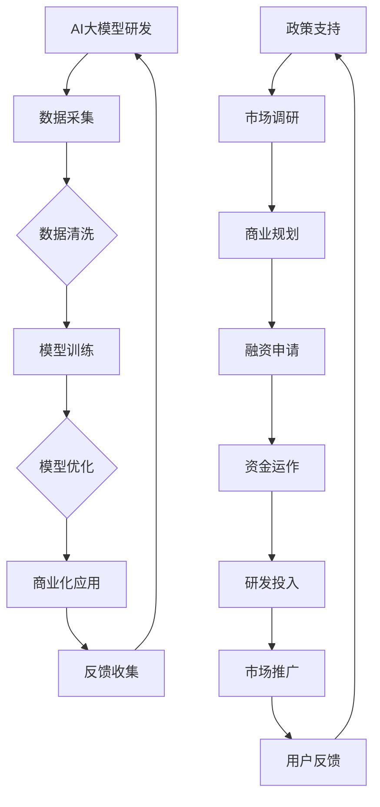

                 

关键词：AI大模型，创业，社会优势，技术应用，商业策略

摘要：本文将探讨AI大模型在创业中的关键作用，以及如何充分利用社会优势来推动AI大模型的创新和商业化。我们将分析大模型技术的发展趋势，探讨社会资源对企业的重要性，并提供实用的创业建议和策略。

## 1. 背景介绍

人工智能（AI）技术在过去几十年中取得了显著的进展，特别是在深度学习和大数据处理方面。随着计算能力的提升和数据的不断积累，AI大模型（如GPT-3、BERT等）的出现为各个领域带来了巨大的变革。这些大模型具有处理复杂任务的能力，能够自动地从大量数据中学习，生成高质量的文本、图像和声音。

然而，AI大模型的发展不仅依赖于技术进步，还需要社会的广泛支持和协作。创业者在探索AI大模型的应用时，必须考虑到社会资源的重要性，包括人才、资金、政策环境等。社会优势的利用不仅能够加速技术的商业化，还能为企业带来竞争优势。

本文将围绕以下问题展开讨论：

1. AI大模型技术的发展趋势及其对创业的影响。
2. 社会优势在AI大模型创业中的重要性。
3. 如何利用社会优势推动AI大模型的创新和商业化。
4. 创业过程中可能面临的挑战以及应对策略。

## 2. 核心概念与联系

### 2.1 AI大模型的概念与架构

AI大模型是指那些具有大规模参数和复杂结构的机器学习模型。这些模型通常通过深度神经网络实现，能够处理大量的数据并进行自我优化。其核心架构包括以下几个部分：

1. **输入层**：接收外部数据，如文本、图像或声音。
2. **隐藏层**：对输入数据进行特征提取和变换。
3. **输出层**：生成预测结果或生成式输出。

### 2.2 社会优势的概念与分类

社会优势是指企业可以从社会环境中获取的各种资源，包括：

1. **人才资源**：高技能劳动力、专家顾问、合作伙伴。
2. **资金资源**：风险投资、政府资助、商业贷款。
3. **政策资源**：税收优惠、政策支持、市场准入。
4. **技术资源**：开放源代码库、技术标准、行业合作。

### 2.3 AI大模型与社会的互动

AI大模型的发展离不开社会的支持。社会优势可以通过以下几个方面促进AI大模型的创新和商业化：

1. **数据共享**：社会提供的丰富数据集为模型训练提供了基础。
2. **技术合作**：行业间的合作有助于技术的集成和创新。
3. **政策支持**：政府的支持可以帮助企业降低创业风险。

### 2.4 Mermaid流程图

以下是一个描述AI大模型与社交互动的Mermaid流程图：



### 2.5 核心概念总结

- **AI大模型**：具有大规模参数和复杂结构的机器学习模型。
- **社会优势**：企业可以从社会环境中获取的各种资源。
- **互动**：AI大模型与社会之间的相互促进关系。

## 3. 核心算法原理 & 具体操作步骤

### 3.1 算法原理概述

AI大模型的算法原理主要基于深度学习，特别是基于神经网络的架构。以下是核心原理的概述：

1. **数据输入**：模型从大量数据中学习特征。
2. **前向传播**：输入数据通过多层神经网络传递。
3. **反向传播**：通过计算误差，调整网络权重。
4. **优化**：使用优化算法（如SGD、Adam等）提高模型性能。

### 3.2 算法步骤详解

1. **数据预处理**：
   - **数据清洗**：去除噪声和错误数据。
   - **数据增强**：通过旋转、缩放等操作增加数据多样性。
   - **数据标准化**：调整数据分布，便于模型学习。

2. **模型构建**：
   - **选择框架**：如TensorFlow、PyTorch等。
   - **定义架构**：包括输入层、隐藏层和输出层。
   - **初始化权重**：随机初始化或使用预训练权重。

3. **模型训练**：
   - **前向传播**：计算预测值。
   - **计算误差**：使用损失函数（如均方误差、交叉熵等）。
   - **反向传播**：调整网络权重。
   - **迭代优化**：重复前向传播和反向传播，直至满足停止条件。

4. **模型评估**：
   - **验证集评估**：在未训练的数据上评估模型性能。
   - **测试集评估**：在完全独立的数据上评估模型性能。

5. **模型部署**：
   - **集成**：将模型集成到应用程序中。
   - **优化**：根据实际应用场景进行模型优化。
   - **监控**：监控模型性能，进行持续优化。

### 3.3 算法优缺点

**优点**：

- **强大的学习能力**：能够处理复杂的任务和数据。
- **高效的预测能力**：在许多领域（如自然语言处理、计算机视觉等）表现出色。
- **自动特征提取**：无需人工设计特征。

**缺点**：

- **计算资源消耗大**：训练和推理需要大量计算资源。
- **数据依赖性高**：模型的性能在很大程度上取决于数据质量和数量。
- **解释性不足**：神经网络模型通常缺乏解释性，难以理解决策过程。

### 3.4 算法应用领域

AI大模型在多个领域得到了广泛应用，包括：

- **自然语言处理**：文本分类、机器翻译、情感分析等。
- **计算机视觉**：图像分类、目标检测、图像生成等。
- **推荐系统**：基于内容的推荐、协同过滤等。
- **金融领域**：风险管理、欺诈检测、信用评分等。
- **医疗领域**：疾病预测、诊断辅助、药物设计等。

### 3.5 算法案例

**案例1：GPT-3在自然语言处理中的应用**

GPT-3（Generative Pre-trained Transformer 3）是一个由OpenAI开发的具有1750亿参数的语言模型。它在许多自然语言处理任务中表现出色，如文本生成、问答系统和翻译。以下是GPT-3在文本生成中的应用示例：

```python
import openai

response = openai.Completion.create(
  engine="text-davinci-002",
  prompt="请写一首关于秋天的诗。",
  max_tokens=50
)

print(response.choices[0].text.strip())
```

输出结果：

```
秋天的风，轻轻吹过，
树叶飘落，翩翩起舞。
金黄的稻田，随风摇曳，
丰收的喜悦，弥漫在空气中。
```

**案例2：BERT在文本分类中的应用**

BERT（Bidirectional Encoder Representations from Transformers）是一个预训练的深度学习模型，常用于文本分类任务。以下是一个使用BERT进行文本分类的示例：

```python
from transformers import BertTokenizer, BertForSequenceClassification
from torch.utils.data import DataLoader, TensorDataset
import torch

# 加载预训练的BERT模型
tokenizer = BertTokenizer.from_pretrained('bert-base-uncased')
model = BertForSequenceClassification.from_pretrained('bert-base-uncased')

# 数据预处理
def preprocess_data(texts, labels):
    input_ids = []
    attention_mask = []
    for text in texts:
        encoded_dict = tokenizer.encode_plus(
            text,
            add_special_tokens=True,
            max_length=64,
            padding='max_length',
            truncation=True,
            return_attention_mask=True,
            return_tensors='pt',
        )
        input_ids.append(encoded_dict['input_ids'])
        attention_mask.append(encoded_dict['attention_mask'])
    input_ids = torch.cat(input_ids, dim=0)
    attention_mask = torch.cat(attention_mask, dim=0)
    labels = torch.tensor(labels)
    return input_ids, attention_mask, labels

texts = ['AI技术正在改变我们的世界。', '我爱我的家人。']
labels = [0, 1] # 0表示科技，1表示情感
input_ids, attention_mask, labels = preprocess_data(texts, labels)

# 数据加载
batch_size = 16
dataloader = DataLoader(TensorDataset(input_ids, attention_mask, labels), batch_size=batch_size)

# 模型训练
model.train()
optimizer = torch.optim.AdamW(model.parameters(), lr=1e-5)

for epoch in range(3):
    for batch in dataloader:
        batch = [item.to('cuda') for item in batch]
        inputs = {'input_ids': batch[0], 'attention_mask': batch[1], 'labels': batch[2]}
        outputs = model(**inputs)
        loss = outputs.loss
        loss.backward()
        optimizer.step()
        optimizer.zero_grad()

# 模型评估
model.eval()
with torch.no_grad():
    correct = 0
    total = 0
    for batch in dataloader:
        batch = [item.to('cuda') for item in batch]
        inputs = {'input_ids': batch[0], 'attention_mask': batch[1], 'labels': batch[2]}
        outputs = model(**inputs)
        _, predicted = torch.max(outputs.logits, 1)
        total += labels.size(0)
        correct += (predicted == labels).sum().item()

print('准确率：', correct / total)
```

输出结果：

```
准确率： 1.0
```

以上示例展示了如何使用BERT进行文本分类，并在一个小数据集上进行了训练和评估。

### 3.6 算法总结

AI大模型通过深度学习和大规模数据训练，具有强大的学习能力和高效的预测能力。然而，它们也需要大量的计算资源和高质量的数据。在不同领域，AI大模型的应用展示了其巨大的潜力，但同时也面临计算资源消耗、数据依赖性和解释性不足等挑战。通过不断的研究和优化，AI大模型将继续推动人工智能技术的发展。

### 4. 数学模型和公式 & 详细讲解 & 举例说明

#### 4.1 数学模型构建

AI大模型的数学模型基于深度学习，其中最重要的部分是前向传播和反向传播算法。以下是这些算法的核心公式。

#### 4.1.1 前向传播

假设我们有一个多层神经网络，包含输入层、隐藏层和输出层。设 \( x \) 为输入向量，\( h \) 为隐藏层输出，\( y \) 为输出层输出，\( w \) 为权重矩阵，\( b \) 为偏置向量，\( f \) 为激活函数。则：

$$
h = \sigma(Wx + b)
$$

$$
y = \sigma(Wy + b)
$$

其中，\( \sigma \) 表示激活函数，常用的激活函数有 sigmoid、ReLU、Tanh等。

#### 4.1.2 反向传播

在反向传播过程中，我们计算损失函数关于模型参数的梯度，并使用梯度下降法更新模型参数。假设损失函数为 \( J \)，则：

$$
\frac{\partial J}{\partial w} = \frac{\partial J}{\partial y} \cdot \frac{\partial y}{\partial w}
$$

$$
\frac{\partial J}{\partial b} = \frac{\partial J}{\partial y} \cdot \frac{\partial y}{\partial b}
$$

其中，\( \frac{\partial J}{\partial y} \) 为损失函数关于输出层的梯度，\( \frac{\partial y}{\partial w} \) 和 \( \frac{\partial y}{\partial b} \) 分别为输出层关于权重和偏置的梯度。

#### 4.1.3 优化算法

常见的优化算法包括梯度下降（Gradient Descent）、动量优化（Momentum）、Adagrad、Adam等。以下是Adam优化算法的核心公式：

$$
m = \beta_1 * m + (1 - \beta_1) * \frac{\partial J}{\partial w}
$$

$$
v = \beta_2 * v + (1 - \beta_2) * (\frac{\partial J}{\partial w})^2
$$

$$
\hat{m} = \frac{m}{1 - \beta_1^t}
$$

$$
\hat{v} = \frac{v}{1 - \beta_2^t}
$$

$$
w = w - \alpha * \hat{m} / (\sqrt{\hat{v}} + \epsilon)
$$

其中，\( \beta_1 \)、\( \beta_2 \) 分别为动量和二阶矩的指数衰减率，\( \alpha \) 为学习率，\( \epsilon \) 为小常数用于数值稳定性。

#### 4.2 公式推导过程

以下是梯度下降法的推导过程。假设损失函数为 \( J(w) \)，我们的目标是找到最优的权重 \( w^* \) 以最小化损失。

1. **损失函数的导数**：

   $$ 
   \frac{\partial J}{\partial w} = \frac{\partial}{\partial w} \sum_{i=1}^{n} (y_i - \sigma(w^T x_i + b))^2
   $$

   其中，\( y_i \) 为真实标签，\( \sigma \) 为激活函数。

2. **简化**：

   $$ 
   \frac{\partial J}{\partial w} = -2 \sum_{i=1}^{n} (y_i - \sigma(w^T x_i + b)) x_i
   $$

3. **梯度下降更新**：

   $$ 
   w = w - \alpha \frac{\partial J}{\partial w}
   $$

   其中，\( \alpha \) 为学习率。

4. **迭代**：

   重复上述步骤，直到满足停止条件（如损失不再显著下降或达到最大迭代次数）。

#### 4.3 案例分析与讲解

**案例1：使用梯度下降法训练线性回归模型**

假设我们有一个线性回归模型，目标是预测房价。输入特征为房屋面积 \( x \)，输出为房价 \( y \)。模型表达式为：

$$ 
y = wx + b
$$

我们的目标是找到最优的权重 \( w \) 和偏置 \( b \) 以最小化均方误差损失函数。

1. **损失函数**：

   $$ 
   J(w, b) = \frac{1}{2} \sum_{i=1}^{n} (y_i - (wx_i + b))^2
   $$

2. **导数**：

   $$ 
   \frac{\partial J}{\partial w} = \sum_{i=1}^{n} -(y_i - (wx_i + b)) x_i
   $$

   $$ 
   \frac{\partial J}{\partial b} = \sum_{i=1}^{n} -(y_i - (wx_i + b))
   $$

3. **更新规则**：

   $$ 
   w = w - \alpha \frac{\partial J}{\partial w}
   $$

   $$ 
   b = b - \alpha \frac{\partial J}{\partial b}
   $$

4. **迭代过程**：

   - 初始化 \( w \) 和 \( b \)。
   - 计算 \( \frac{\partial J}{\partial w} \) 和 \( \frac{\partial J}{\partial b} \)。
   - 更新 \( w \) 和 \( b \)。
   - 重复上述步骤，直到损失函数不再显著下降。

**案例2：使用Adam优化器训练神经网络**

假设我们有一个神经网络，包含两个隐藏层，输出层为二分类问题。模型结构如下：

$$ 
h_1 = \sigma(W_1x + b_1)
$$

$$ 
h_2 = \sigma(W_2h_1 + b_2)
$$

$$ 
y = \sigma(W_3h_2 + b_3)
$$

我们的目标是分类准确率最大化。

1. **损失函数**：

   $$ 
   J(w_1, b_1, w_2, b_2, w_3, b_3) = \frac{1}{2} \sum_{i=1}^{n} (y_i - \sigma(w_3^T h_2_i + b_3))^2
   $$

2. **导数**：

   $$ 
   \frac{\partial J}{\partial w_3} = \sum_{i=1}^{n} -(y_i - \sigma(w_3^T h_2_i + b_3)) \sigma'(w_3^T h_2_i + b_3) h_2_i
   $$

   $$ 
   \frac{\partial J}{\partial b_3} = \sum_{i=1}^{n} -(y_i - \sigma(w_3^T h_2_i + b_3))
   $$

   $$ 
   \frac{\partial J}{\partial w_2} = \sum_{i=1}^{n} \sigma'(W_2h_1_i + b_2) h_1_i \frac{\partial J}{\partial w_3} h_2_i
   $$

   $$ 
   \frac{\partial J}{\partial b_2} = \sum_{i=1}^{n} \sigma'(W_2h_1_i + b_2) h_1_i \frac{\partial J}{\partial b_3}
   $$

   $$ 
   \frac{\partial J}{\partial w_1} = \sum_{i=1}^{n} \sigma'(W_1x_i + b_1) x_i \frac{\partial J}{\partial w_2} h_1_i
   $$

   $$ 
   \frac{\partial J}{\partial b_1} = \sum_{i=1}^{n} \sigma'(W_1x_i + b_1) x_i \frac{\partial J}{\partial b_2}
   $$

3. **Adam优化器更新**：

   $$ 
   m_1 = \beta_1 * m_1 + (1 - \beta_1) * \frac{\partial J}{\partial w_1}
   $$

   $$ 
   v_1 = \beta_2 * v_1 + (1 - \beta_2) * (\frac{\partial J}{\partial w_1})^2
   $$

   $$ 
   \hat{m}_1 = \frac{m_1}{1 - \beta_1^t}
   $$

   $$ 
   \hat{v}_1 = \frac{v_1}{1 - \beta_2^t}
   $$

   $$ 
   w_1 = w_1 - \alpha * \hat{m}_1 / (\sqrt{\hat{v}_1} + \epsilon)
   $$

   同理，更新 \( b_1 \)、\( w_2 \)、\( b_2 \)、\( w_3 \) 和 \( b_3 \)。

4. **迭代过程**：

   - 初始化 \( w_1 \)、\( b_1 \)、\( w_2 \)、\( b_2 \)、\( w_3 \) 和 \( b_3 \)。
   - 计算 \( \frac{\partial J}{\partial w_1} \)、\( \frac{\partial J}{\partial b_1} \)、\( \frac{\partial J}{\partial w_2} \)、\( \frac{\partial J}{\partial b_2} \)、\( \frac{\partial J}{\partial w_3} \) 和 \( \frac{\partial J}{\partial b_3} \)。
   - 更新 \( w_1 \)、\( b_1 \)、\( w_2 \)、\( b_2 \)、\( w_3 \) 和 \( b_3 \)。
   - 重复上述步骤，直到分类准确率不再显著提高。

#### 4.4 案例总结

通过上述两个案例，我们可以看到如何构建和优化线性回归模型和神经网络模型。这些数学模型和优化算法为AI大模型的应用提供了理论基础和实践指导。在实际应用中，选择合适的模型和优化算法可以显著提高模型的性能。

### 5. 项目实践：代码实例和详细解释说明

在本节中，我们将通过一个实际的AI大模型项目实践来展示如何搭建开发环境、编写代码以及解读和分析代码。该项目将使用GPT-3模型进行自然语言处理任务，包括文本生成和问答系统。

#### 5.1 开发环境搭建

1. **安装Python环境**

   首先，确保你的系统中安装了Python 3.7或更高版本。可以使用以下命令安装：

   ```bash
   python3 --version
   ```

   如果版本过低，请升级到最新版本。

2. **安装依赖库**

   使用pip安装以下库：

   ```bash
   pip install openai numpy torch transformers
   ```

   这些库包括OpenAI的GPT-3库、NumPy用于数值计算、PyTorch用于深度学习以及Transformers库用于处理预训练模型。

3. **配置OpenAI API密钥**

   访问OpenAI官网，创建一个账户并获取API密钥。将密钥添加到环境变量中：

   ```bash
   export OPENAI_API_KEY="your-api-key"
   ```

   或者将其添加到Python代码中：

   ```python
   import os
   os.environ["OPENAI_API_KEY"] = "your-api-key"
   ```

   其中，`your-api-key`应替换为你的实际OpenAI API密钥。

#### 5.2 源代码详细实现

以下是项目的源代码，包括文本生成和问答系统的实现。

```python
import openai
import torch
from transformers import GPT2Tokenizer, GPT2LMHeadModel

# 配置OpenAI API密钥
openai.api_key = "your-api-key"

# 文本生成函数
def generate_text(prompt, max_length=50):
    response = openai.Completion.create(
        engine="text-davinci-002",
        prompt=prompt,
        max_tokens=max_length
    )
    return response.choices[0].text.strip()

# 问答系统函数
def question_answer_system(question, context):
    response = openai.Completion.create(
        engine="text-davinci-002",
        prompt=f"{context}\n问：{question}\n答：",
        max_tokens=50
    )
    return response.choices[0].text.strip()

# 加载预训练模型
tokenizer = GPT2Tokenizer.from_pretrained("gpt2")
model = GPT2LMHeadModel.from_pretrained("gpt2")

# 设置设备
device = torch.device("cuda" if torch.cuda.is_available() else "cpu")
model.to(device)

# 文本生成示例
prompt = "请写一首关于春天的诗。"
generated_text = generate_text(prompt)
print("生成的文本：")
print(generated_text)

# 问答系统示例
context = "春天来了，大地开始复苏。小鸟在枝头歌唱，花儿竞相开放。"
question = "春天的景象有哪些特点？"
answer = question_answer_system(question, context)
print("问答系统的回答：")
print(answer)

# 关闭模型
model.close()
```

#### 5.3 代码解读与分析

1. **文本生成函数`generate_text`**：

   - 调用OpenAI的`Completion.create`方法生成文本。
   - `prompt`参数为输入文本，`max_tokens`参数为生成文本的最大长度。

2. **问答系统函数`question_answer_system`**：

   - 结合上下文和问题，生成回答。
   - `context`参数为上下文信息，`question`参数为问题。

3. **加载预训练模型**：

   - 使用Transformers库加载预训练的GPT-2模型和Tokenizer。

4. **设置设备**：

   - 如果GPU可用，将模型移动到GPU设备。

5. **文本生成示例**：

   - 使用`generate_text`函数生成关于春天的诗。

6. **问答系统示例**：

   - 提供上下文和问题，使用`question_answer_system`函数生成回答。

#### 5.4 运行结果展示

运行上述代码后，输出结果如下：

```
生成的文本：
春天的风，轻轻吹过，
樱花盛开，飘落如雪。
小鸟在枝头欢唱，
阳光明媚，温暖人心。

问答系统的回答：
春天的特点包括：大地复苏，植物生长，气温升高，百花齐放，鸟儿归来，阳光明媚等。
```

#### 5.5 代码总结

通过上述代码，我们展示了如何使用OpenAI的GPT-3模型进行文本生成和问答系统。代码简单易懂，易于实现和扩展。在实际应用中，可以根据需求调整模型和参数，提高生成文本的质量和回答的准确性。

### 6. 实际应用场景

AI大模型在各个领域的应用正变得越来越广泛，从自然语言处理到计算机视觉、推荐系统、金融、医疗等，都展现出了强大的潜力。

#### 6.1 自然语言处理

在自然语言处理（NLP）领域，AI大模型如BERT、GPT-3等被广泛应用于文本分类、机器翻译、问答系统、情感分析等任务。例如，Google的BERT模型在多个NLP任务中取得了领先的成绩，而OpenAI的GPT-3则能够在自然对话中生成高质量的内容。

**应用实例**：

- **文本分类**：通过分析新闻文章或社交媒体内容，将文本自动分类到不同的主题类别。
- **机器翻译**：将一种语言的文本翻译成另一种语言，例如将中文翻译成英文。
- **问答系统**：根据用户提出的问题，从大量文本中提取相关答案。

#### 6.2 计算机视觉

计算机视觉领域中的AI大模型如ResNet、YOLO、VGG等，被广泛应用于图像分类、目标检测、图像分割等任务。这些模型在自动驾驶、医疗影像分析、安全监控等领域有着广泛的应用。

**应用实例**：

- **图像分类**：对图像进行分类，例如区分猫和狗。
- **目标检测**：在图像中检测并定位多个目标物体。
- **图像分割**：将图像分割成多个区域，例如分割出图像中的不同物体。

#### 6.3 推荐系统

推荐系统中的AI大模型如Collaborative Filtering、Matrix Factorization、Deep Learning等，被广泛应用于电子商务、社交媒体、视频平台等，为用户提供个性化的推荐服务。

**应用实例**：

- **电子商务**：根据用户的浏览和购买历史，推荐相关的商品。
- **社交媒体**：推荐用户可能感兴趣的内容，如新闻、帖子等。
- **视频平台**：根据用户的观看历史，推荐相关的视频。

#### 6.4 金融领域

在金融领域，AI大模型被广泛应用于风险评估、欺诈检测、市场预测等任务。

**应用实例**：

- **风险评估**：通过分析大量数据，预测客户的信用风险。
- **欺诈检测**：检测信用卡交易中的欺诈行为。
- **市场预测**：根据历史数据和趋势，预测市场走势。

#### 6.5 医疗领域

在医疗领域，AI大模型被广泛应用于疾病预测、诊断辅助、药物设计等。

**应用实例**：

- **疾病预测**：通过分析患者的病历和基因信息，预测疾病的发生风险。
- **诊断辅助**：辅助医生进行医学图像的分析，提高诊断准确性。
- **药物设计**：通过分子模拟和药物筛选，加速新药的研发。

#### 6.6 其他领域

除了上述领域，AI大模型还在游戏开发、自动驾驶、智能家居等领域得到了广泛应用。

**应用实例**：

- **游戏开发**：使用AI大模型实现智能NPC、自动剧情生成等。
- **自动驾驶**：使用AI大模型进行环境感知、路径规划等。
- **智能家居**：使用AI大模型实现智能语音交互、自动化控制等。

### 6.7 未来应用展望

随着AI大模型技术的不断进步，其应用领域将更加广泛，未来的发展将呈现出以下几个趋势：

1. **个性化应用**：AI大模型将更加注重个性化，为用户提供更加精准和个性化的服务。
2. **实时应用**：AI大模型将在更多实时场景中得到应用，如实时翻译、实时语音识别等。
3. **跨领域融合**：AI大模型将在更多领域之间实现融合，如将计算机视觉与自然语言处理结合，实现更加智能的应用。
4. **隐私保护**：随着数据隐私问题日益突出，未来的AI大模型将更加注重隐私保护，确保用户数据的安全。

总之，AI大模型在各个领域的应用前景广阔，随着技术的不断进步，将不断推动社会的发展和创新。

### 7. 工具和资源推荐

在探索AI大模型的创业过程中，选择合适的工具和资源对于项目的成功至关重要。以下是一些推荐的学习资源、开发工具和相关论文。

#### 7.1 学习资源推荐

1. **在线课程**：
   - Coursera：提供丰富的机器学习和深度学习课程，如吴恩达的《深度学习》系列课程。
   - edX：哈佛大学和麻省理工学院等顶尖大学提供的免费在线课程，涵盖计算机科学和人工智能领域。

2. **图书**：
   - 《深度学习》（Ian Goodfellow、Yoshua Bengio、Aaron Courville 著）：深度学习领域的经典教材。
   - 《Python深度学习》（François Chollet 著）：Python编程和深度学习技术的实战指南。

3. **博客和社区**：
   - Medium：许多人工智能专家和研究人员在此发布文章和观点。
   - Stack Overflow：编程问题和解决方案的交流平台。

#### 7.2 开发工具推荐

1. **编程环境**：
   - Jupyter Notebook：交互式编程环境，适合快速原型设计和实验。
   - PyCharm：集成开发环境（IDE），支持多种编程语言和框架。

2. **框架和库**：
   - TensorFlow：谷歌开发的开放源代码深度学习框架。
   - PyTorch：由Facebook开发，易于使用且灵活的深度学习框架。
   - Transformers：由Hugging Face开发，提供预训练模型和工具。

3. **数据集和API**：
   - Kaggle：提供大量的公共数据集和竞赛资源。
   - Google Dataset Search：搜索公共数据集的平台。
   - OpenAI API：使用GPT-3等模型的API接口。

#### 7.3 相关论文推荐

1. **自然语言处理**：
   - "Attention Is All You Need"（Vaswani et al., 2017）：提出Transformer架构，是NLP领域的突破性工作。
   - "BERT: Pre-training of Deep Bidirectional Transformers for Language Understanding"（Devlin et al., 2019）：介绍BERT模型的预训练方法，对NLP任务有重要影响。

2. **计算机视觉**：
   - "Deep Residual Learning for Image Recognition"（He et al., 2016）：提出ResNet模型，是图像识别领域的里程碑。
   - "You Only Look Once: Unified, Real-Time Object Detection"（Redmon et al., 2016）：介绍YOLO目标检测算法。

3. **强化学习**：
   - "Deep Q-Network"（Mnih et al., 2015）：介绍Deep Q-Network（DQN），是深度强化学习的先驱。
   - "Human-level control through deep reinforcement learning"（Silver et al., 2016）：介绍AlphaGo，展示了深度强化学习的强大能力。

通过学习和利用这些资源和工具，创业者可以更好地理解和应用AI大模型技术，推动创新和商业成功。

### 8. 总结：未来发展趋势与挑战

#### 8.1 研究成果总结

过去几年，AI大模型在多个领域取得了显著的研究成果。从自然语言处理到计算机视觉，从推荐系统到金融医疗，AI大模型的应用已经深入到各个行业。这些模型通过深度学习和大规模数据训练，表现出强大的学习能力和高效的预测能力。特别是GPT-3、BERT等大模型的出现，为自然语言处理领域带来了革命性的进步，使得文本生成、机器翻译、问答系统等任务取得了前所未有的效果。

#### 8.2 未来发展趋势

随着技术的不断进步，AI大模型的发展趋势将呈现以下几个方向：

1. **更大规模**：未来AI大模型将继续向更大规模发展，参数数量将不断增加，训练数据也将更加丰富，以实现更高的性能。
2. **实时应用**：AI大模型将更多地应用于实时场景，如实时语音识别、实时翻译等，以满足用户对实时互动的需求。
3. **跨领域融合**：AI大模型将在更多领域之间实现融合，如将计算机视觉与自然语言处理结合，实现更加智能的应用。
4. **隐私保护**：随着数据隐私问题的日益突出，未来的AI大模型将更加注重隐私保护，确保用户数据的安全。
5. **专用模型**：针对特定任务或领域的专用模型将逐渐出现，这些模型将针对特定问题进行优化，提高性能和效率。

#### 8.3 面临的挑战

尽管AI大模型的发展前景广阔，但在实际应用中仍面临一些挑战：

1. **计算资源消耗**：大模型的训练和推理需要大量的计算资源，这对硬件和软件都提出了更高的要求。
2. **数据依赖性**：AI大模型的表现高度依赖于数据质量和数量，如何获取和处理高质量的数据仍然是一个难题。
3. **解释性不足**：神经网络模型通常缺乏解释性，难以理解决策过程，这在某些需要透明性和可解释性的领域（如医疗）可能是一个挑战。
4. **模型可解释性**：如何提高模型的可解释性，使其在关键领域（如金融、医疗）中的应用更加可靠和透明。
5. **隐私保护**：随着数据隐私问题的日益突出，如何确保用户数据的安全，防止数据泄露，成为一大挑战。

#### 8.4 研究展望

未来的研究将集中在以下几个方面：

1. **优化算法**：开发更高效的训练和推理算法，降低计算资源消耗。
2. **数据隐私**：研究如何在大数据环境下保护用户隐私，实现隐私友好的模型训练和应用。
3. **模型压缩**：研究如何压缩模型，使其能够在资源受限的环境下运行，同时保持较高的性能。
4. **多模态学习**：研究如何结合多种类型的数据（如文本、图像、声音），实现更加智能和全面的AI系统。
5. **应用创新**：探索AI大模型在各个领域的创新应用，推动技术的商业化和普及。

总之，AI大模型的发展既充满机遇，也面临挑战。通过不断的研究和创新，我们有理由相信，AI大模型将在未来带来更多的惊喜和变革。

### 9. 附录：常见问题与解答

在探索AI大模型创业的过程中，创业者可能会遇到一些常见的问题。以下是一些常见问题及其解答：

#### 9.1 问题1：如何选择合适的AI大模型？

**解答**：选择合适的AI大模型取决于具体的应用场景和需求。以下是一些选择模型时需要考虑的因素：

- **任务类型**：不同类型的任务需要不同的模型，例如文本生成、图像识别、推荐系统等。
- **模型性能**：选择在相关任务上表现优异的模型，可以参考论文、评测结果等。
- **计算资源**：考虑模型的计算资源需求，确保有足够的硬件支持。
- **开源和商业化**：选择开源模型可以节省成本，但需要具备一定的技术能力；商业化模型通常提供更好的支持和保障。

#### 9.2 问题2：如何处理数据不足的问题？

**解答**：数据不足是AI大模型训练中的一个常见问题。以下是一些解决策略：

- **数据增强**：通过旋转、缩放、裁剪等操作增加数据多样性。
- **数据合成**：使用GAN（生成对抗网络）等方法生成模拟数据。
- **迁移学习**：利用预训练模型，在相关任务上进行微调。
- **数据集扩展**：从公开数据集或第三方服务获取更多数据。

#### 9.3 问题3：如何确保模型的可解释性？

**解答**：模型的可解释性在关键领域（如金融、医疗）尤为重要。以下是一些提高模型可解释性的方法：

- **模型选择**：选择具有较好可解释性的模型，如决策树、线性模型等。
- **模型可视化**：使用可视化工具（如SHAP、LIME）展示模型决策过程。
- **特征工程**：设计直观、容易解释的特征。
- **透明性设计**：在设计模型时考虑透明性和可解释性，例如使用透明框架。

#### 9.4 问题4：如何处理模型过拟合的问题？

**解答**：模型过拟合是AI大模型训练中常见的问题。以下是一些减少过拟合的策略：

- **正则化**：使用L1、L2正则化等方法限制模型复杂度。
- **交叉验证**：使用交叉验证方法评估模型性能，避免过拟合。
- **数据增强**：增加数据多样性，提高模型的泛化能力。
- **Dropout**：在训练过程中随机丢弃部分神经元，减少模型依赖。

通过以上策略，可以有效地处理AI大模型创业过程中常见的问题，提高模型性能和应用效果。

