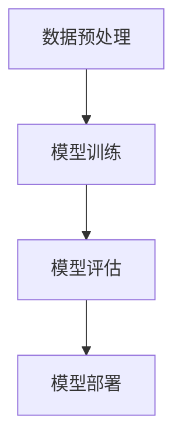

                 

关键词：人工智能，大模型，创业，科技优势，商业模式

> 摘要：随着人工智能技术的飞速发展，大模型技术已经成为了众多创业公司竞相追捧的热点。本文将探讨如何利用科技优势，通过AI大模型创业，实现商业价值和社会影响力的最大化。

## 1. 背景介绍

近年来，人工智能（AI）技术取得了显著的进展，特别是在深度学习领域。随着计算能力的提升和海量数据的积累，AI大模型（如GPT、BERT等）在自然语言处理、计算机视觉、语音识别等领域展现出了强大的能力。这些大模型的训练和部署，不仅推动了AI技术的发展，也为众多创业者提供了前所未有的机遇。

在这样的大背景下，越来越多的创业者开始探索如何利用AI大模型进行创业。一方面，AI大模型可以提供强大的算法支撑，帮助企业解决复杂的问题；另一方面，大模型的应用可以创造出全新的商业模式，为企业带来巨大的商业价值。然而，如何有效地利用AI大模型进行创业，仍然是许多创业者面临的重要课题。

## 2. 核心概念与联系

### 2.1 AI大模型的概念

AI大模型是指通过深度学习技术训练出的具有大规模参数的模型。这些模型通常由数百万甚至数十亿个参数组成，能够处理复杂的数据并产生精准的预测。常见的AI大模型包括GPT、BERT、Transformer等。

### 2.2 AI大模型的应用

AI大模型的应用非常广泛，涵盖了自然语言处理、计算机视觉、语音识别、推荐系统等多个领域。例如，GPT可以用于文本生成、问答系统等；BERT可以用于情感分析、文本分类等；Transformer在图像生成、视频处理等方面也有出色的表现。

### 2.3 AI大模型的架构

AI大模型的架构通常包括以下几个部分：

- **数据预处理**：对原始数据进行清洗、转换等处理，使其符合模型输入要求。
- **模型训练**：通过大量数据进行训练，使模型学会对数据进行分类、预测等操作。
- **模型评估**：对训练好的模型进行评估，确保其性能达到预期。
- **模型部署**：将模型部署到生产环境中，供用户使用。

### 2.4 Mermaid流程图



## 3. 核心算法原理 & 具体操作步骤

### 3.1 算法原理概述

AI大模型的算法原理主要基于深度学习技术，包括多层神经网络、卷积神经网络（CNN）、循环神经网络（RNN）等。这些算法通过学习大量数据，能够提取数据中的特征，并实现对数据的分类、预测等操作。

### 3.2 算法步骤详解

1. **数据预处理**：对原始数据进行清洗、转换等处理，使其符合模型输入要求。
2. **模型训练**：通过大量数据进行训练，使模型学会对数据进行分类、预测等操作。
3. **模型评估**：对训练好的模型进行评估，确保其性能达到预期。
4. **模型部署**：将模型部署到生产环境中，供用户使用。

### 3.3 算法优缺点

**优点**：

- **强大的学习能力**：AI大模型可以通过学习海量数据，提取出数据中的复杂特征，从而实现精准的分类、预测等操作。
- **广泛的应用场景**：AI大模型可以应用于自然语言处理、计算机视觉、语音识别等多个领域，具有广泛的应用前景。

**缺点**：

- **计算资源消耗大**：训练AI大模型需要大量的计算资源和时间，对硬件设施要求较高。
- **数据依赖性强**：AI大模型的性能很大程度上取决于训练数据的质量和数量，数据不足或质量差可能导致模型性能下降。

### 3.4 算法应用领域

AI大模型的应用领域非常广泛，包括但不限于以下几个方面：

- **自然语言处理**：文本生成、问答系统、机器翻译等。
- **计算机视觉**：图像分类、目标检测、图像生成等。
- **语音识别**：语音识别、语音合成等。
- **推荐系统**：基于用户行为和兴趣的推荐。

## 4. 数学模型和公式 & 详细讲解 & 举例说明

### 4.1 数学模型构建

在AI大模型的训练过程中，常用的数学模型包括多层感知机（MLP）、卷积神经网络（CNN）、循环神经网络（RNN）等。以下以多层感知机为例，介绍数学模型构建的过程。

### 4.2 公式推导过程

多层感知机（MLP）的数学模型可以表示为：

$$
z^{[l]} = \sigma(W^{[l]} \cdot a^{[l-1]} + b^{[l]})
$$

其中，$a^{[l]}$为输入层到第$l$层的激活值，$W^{[l]}$和$b^{[l]}$分别为第$l$层的权重和偏置项，$\sigma$为激活函数。

### 4.3 案例分析与讲解

假设我们有一个二分类问题，需要使用多层感知机进行分类。输入数据为$x_1, x_2, ..., x_n$，输出为$y$。首先，我们需要对输入数据进行预处理，将其归一化到$(0, 1)$区间。然后，使用训练数据集训练多层感知机模型。

在训练过程中，我们通过反向传播算法不断更新模型的权重和偏置项，使得模型的预测结果与实际结果尽可能接近。具体步骤如下：

1. **前向传播**：计算输入层到输出层的激活值。
2. **计算损失函数**：计算预测结果与实际结果的差距，常用的损失函数有均方误差（MSE）和交叉熵（Cross Entropy）。
3. **反向传播**：根据损失函数的梯度，更新模型的权重和偏置项。
4. **迭代训练**：重复前向传播、计算损失函数和反向传播的过程，直至模型收敛。

通过以上步骤，我们可以训练出一个性能良好的多层感知机模型，实现对输入数据的分类。

## 5. 项目实践：代码实例和详细解释说明

### 5.1 开发环境搭建

为了更好地演示AI大模型的应用，我们将使用Python编程语言，结合TensorFlow框架进行开发。首先，需要安装Python和TensorFlow。

```bash
pip install python tensorflow
```

### 5.2 源代码详细实现

以下是一个简单的多层感知机分类器的实现，用于实现二分类问题。

```python
import tensorflow as tf

# 定义模型
model = tf.keras.Sequential([
    tf.keras.layers.Dense(128, activation='relu', input_shape=(784,)),
    tf.keras.layers.Dense(10, activation='softmax')
])

# 编译模型
model.compile(optimizer='adam',
              loss=tf.keras.losses.SparseCategoricalCrossentropy(from_logits=True),
              metrics=['accuracy'])

# 加载数据
(x_train, y_train), (x_test, y_test) = tf.keras.datasets.mnist.load_data()

# 预处理数据
x_train = x_train.astype('float32') / 255
x_test = x_test.astype('float32') / 255
x_train = x_train.reshape((-1, 784))
x_test = x_test.reshape((-1, 784))

# 训练模型
model.fit(x_train, y_train, epochs=5, batch_size=64)

# 评估模型
test_loss, test_acc = model.evaluate(x_test, y_test, verbose=2)
print(f"Test accuracy: {test_acc}")
```

### 5.3 代码解读与分析

在上面的代码中，我们首先定义了一个多层感知机模型，包括一个128个神经元的隐藏层和一个10个神经元的输出层。隐藏层使用ReLU激活函数，输出层使用softmax激活函数。

接下来，我们加载MNIST手写数字数据集，并对数据进行预处理。然后，使用Adam优化器和稀疏交叉熵损失函数编译模型。最后，使用训练数据训练模型，并在测试数据上评估模型的性能。

通过这个简单的示例，我们可以看到如何使用Python和TensorFlow实现一个基本的AI大模型。

## 6. 实际应用场景

AI大模型在各个行业和领域都有广泛的应用，以下是一些典型的实际应用场景：

- **医疗领域**：利用AI大模型进行疾病诊断、药物研发等，如使用GPT进行医学文本分析，使用BERT进行药物分子预测。
- **金融领域**：利用AI大模型进行风险评估、股票交易策略制定等，如使用Transformer进行金融时间序列预测。
- **零售领域**：利用AI大模型进行商品推荐、库存管理等，如使用BERT进行用户行为分析，使用GPT进行商品描述生成。
- **自动驾驶领域**：利用AI大模型进行环境感知、路径规划等，如使用CNN进行图像识别，使用RNN进行时间序列预测。

## 7. 未来应用展望

随着AI大模型技术的不断发展和优化，其应用前景将更加广泛。未来，AI大模型有望在以下领域取得突破：

- **智能客服**：通过AI大模型实现更智能、更自然的客服交互，提升用户体验。
- **教育领域**：利用AI大模型进行个性化教学、学习效果评估等，提高教育质量。
- **智能制造**：利用AI大模型进行设备预测性维护、质量控制等，提高生产效率。
- **城市规划**：利用AI大模型进行城市规划、环境监测等，提升城市治理水平。

## 8. 工具和资源推荐

### 8.1 学习资源推荐

- **《深度学习》（Goodfellow, Bengio, Courville）**：深度学习领域的经典教材，适合初学者和进阶者。
- **《动手学深度学习》（阿斯顿·张）**：结合Python和TensorFlow的实战教材，适合初学者和进阶者。
- **《自然语言处理原理》（Daniel Jurafsky，James H. Martin）**：自然语言处理领域的经典教材，适合对NLP有兴趣的读者。

### 8.2 开发工具推荐

- **TensorFlow**：谷歌推出的开源深度学习框架，适合进行AI大模型的开发和应用。
- **PyTorch**：Facebook AI研究院推出的开源深度学习框架，易于使用和调试，适合进行AI大模型的开发和应用。

### 8.3 相关论文推荐

- **“Attention Is All You Need”**：提出Transformer架构的经典论文，对于理解AI大模型的工作原理有很大帮助。
- **“BERT: Pre-training of Deep Bidirectional Transformers for Language Understanding”**：介绍BERT模型的经典论文，对于理解自然语言处理领域的AI大模型有很大帮助。

## 9. 总结：未来发展趋势与挑战

随着AI大模型技术的不断发展，其在各个领域中的应用将越来越广泛。然而，也面临着一些挑战，如计算资源消耗、数据隐私保护、模型可解释性等。未来，我们需要在技术、政策、伦理等方面进行持续探索，以实现AI大模型技术的健康发展。

## 附录：常见问题与解答

### 问题1：如何选择合适的AI大模型？

**解答**：选择合适的AI大模型主要考虑以下几个因素：

- **应用领域**：根据具体的业务需求，选择适合的AI大模型，如自然语言处理、计算机视觉、语音识别等。
- **数据量**：考虑训练数据量的大小，选择能够处理海量数据的大模型。
- **计算资源**：根据硬件设施和计算资源，选择适合的AI大模型，确保模型能够训练和部署。

### 问题2：如何评估AI大模型的性能？

**解答**：评估AI大模型的性能主要从以下几个方面进行：

- **准确率**：评估模型在测试数据上的分类或预测准确率。
- **召回率**：评估模型对正类别的召回能力。
- **F1值**：综合考虑准确率和召回率，用于评估模型的综合性能。
- **ROC曲线**：评估模型对正负样本的分类能力。

### 问题3：如何优化AI大模型的性能？

**解答**：优化AI大模型的性能可以从以下几个方面进行：

- **数据增强**：通过数据增强技术，扩充训练数据集，提高模型的泛化能力。
- **模型调优**：通过调整模型的超参数，如学习率、批次大小等，优化模型的性能。
- **迁移学习**：利用已有的大模型进行迁移学习，提高新模型的性能。
- **模型压缩**：通过模型压缩技术，减少模型的参数数量，提高模型的运行速度。

## 作者署名

作者：禅与计算机程序设计艺术 / Zen and the Art of Computer Programming

----------------------------------------------------------------

以上是关于《AI 大模型创业：如何利用科技优势？》的文章正文。希望对您在AI大模型创业领域有所帮助。如果您有任何问题或建议，欢迎在评论区留言。

