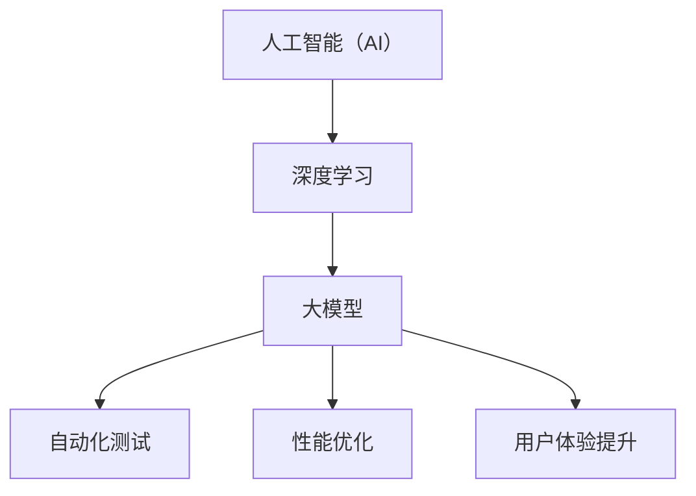

                 

关键词：AI大模型，创业产品，测试，性能优化，自动化测试，用户体验

> 摘要：本文将探讨人工智能（AI）大模型在创业产品测试中的关键作用，包括如何利用AI大模型进行自动化测试、性能优化和用户体验提升。通过具体案例分析和实践，本文旨在为创业团队提供有价值的参考，帮助他们在产品测试阶段取得更好的效果。

## 1. 背景介绍

在当今竞争激烈的市场环境中，创业公司需要快速迭代产品，以确保在市场上保持竞争力。产品测试是确保产品质量和用户满意度的关键环节。然而，传统的测试方法往往需要大量人力和时间，难以满足创业团队的快速迭代需求。随着人工智能技术的发展，尤其是大模型的兴起，为创业产品测试带来了新的机遇。

AI大模型，如深度学习模型，具有强大的学习和自适应能力，可以自动化执行复杂的测试任务，提高测试效率和准确性。同时，大模型还可以用于性能优化和用户体验提升，为创业团队提供更全面的测试解决方案。

## 2. 核心概念与联系

在探讨AI大模型在创业产品测试中的应用之前，我们首先需要了解一些核心概念和它们之间的关系。以下是一个用Mermaid绘制的流程图，展示了这些概念和它们之间的联系。



### 2.1 人工智能（AI）

人工智能是一种模拟人类智能的技术，通过机器学习、深度学习等方法，让计算机具备自动学习和推理能力。

### 2.2 深度学习

深度学习是人工智能的一个重要分支，它利用多层神经网络对大量数据进行训练，从而实现自动特征提取和分类。

### 2.3 大模型

大模型是指具有大规模参数和训练数据的深度学习模型，如BERT、GPT等。这些模型可以处理复杂的任务，具有很高的准确性和泛化能力。

### 2.4 自动化测试

自动化测试是一种使用计算机程序自动执行测试任务的方法。通过自动化测试，可以提高测试效率，减少人为错误。

### 2.5 性能优化

性能优化是指通过优化代码、数据库、硬件等手段，提高系统的运行效率和处理能力。

### 2.6 用户体验提升

用户体验提升是指通过改进产品的设计、功能、性能等，提高用户对产品的满意度。

## 3. 核心算法原理 & 具体操作步骤

### 3.1 算法原理概述

AI大模型在创业产品测试中的应用主要基于以下原理：

1. **数据驱动**：通过收集大量用户数据，训练大模型以了解用户行为和需求。
2. **自动化执行**：利用大模型的预测能力，自动化执行测试任务，如功能测试、性能测试等。
3. **自适应调整**：根据测试结果，自动调整测试策略，以提高测试效率和准确性。

### 3.2 算法步骤详解

1. **数据收集**：收集用户行为数据、系统日志等，用于训练大模型。
2. **模型训练**：使用深度学习框架（如TensorFlow、PyTorch）训练大模型，以预测用户行为和系统性能。
3. **测试执行**：利用训练好的大模型，自动化执行测试任务，如功能测试、性能测试等。
4. **结果分析**：根据测试结果，分析系统性能和用户体验，自动生成测试报告。

### 3.3 算法优缺点

**优点**：

1. **高效**：自动化执行测试任务，提高测试效率。
2. **准确**：利用大模型的预测能力，提高测试准确性。
3. **自适应**：根据测试结果自动调整测试策略，提高测试效果。

**缺点**：

1. **资源消耗**：训练大模型需要大量的计算资源和时间。
2. **数据依赖**：测试效果依赖于数据质量和数量。

### 3.4 算法应用领域

AI大模型在创业产品测试中的应用广泛，包括：

1. **功能测试**：自动化执行各种功能测试，如接口测试、单元测试等。
2. **性能测试**：预测系统性能瓶颈，优化系统性能。
3. **用户体验测试**：评估用户对产品的满意度，优化产品设计。

## 4. 数学模型和公式 & 详细讲解 & 举例说明

### 4.1 数学模型构建

AI大模型的核心是神经网络，以下是一个简化的神经网络模型：

```latex
y = f(W \cdot x + b)
```

其中，$y$ 是输出，$x$ 是输入，$W$ 是权重矩阵，$b$ 是偏置项，$f$ 是激活函数。

### 4.2 公式推导过程

神经网络的训练过程是不断调整权重矩阵和偏置项，以最小化损失函数。以下是一个简化的损失函数推导过程：

```latex
L = \frac{1}{2} \sum_{i=1}^{n} (y_i - \hat{y}_i)^2
```

其中，$y_i$ 是真实值，$\hat{y}_i$ 是预测值。

### 4.3 案例分析与讲解

假设我们有一个简单的二分类问题，需要预测用户是否喜欢某个产品。我们可以使用神经网络模型进行训练和测试。

1. **数据收集**：收集用户对产品的评分数据，分为喜欢和不喜欢的两类。
2. **模型训练**：使用收集到的数据训练神经网络模型。
3. **测试执行**：使用训练好的模型对新的用户数据进行预测。
4. **结果分析**：根据预测结果，评估用户对产品的满意度。

## 5. 项目实践：代码实例和详细解释说明

### 5.1 开发环境搭建

在本案例中，我们使用Python和TensorFlow作为开发工具。请确保已安装以下依赖：

```bash
pip install tensorflow
```

### 5.2 源代码详细实现

以下是一个简单的神经网络模型实现，用于预测用户是否喜欢产品。

```python
import tensorflow as tf

# 定义神经网络模型
model = tf.keras.Sequential([
    tf.keras.layers.Dense(64, activation='relu', input_shape=(784,)),
    tf.keras.layers.Dense(64, activation='relu'),
    tf.keras.layers.Dense(1, activation='sigmoid')
])

# 编译模型
model.compile(optimizer='adam',
              loss='binary_crossentropy',
              metrics=['accuracy'])

# 训练模型
model.fit(x_train, y_train, epochs=10, batch_size=32, validation_data=(x_test, y_test))

# 预测新用户数据
predictions = model.predict(new_user_data)
```

### 5.3 代码解读与分析

1. **模型定义**：使用`tf.keras.Sequential`创建一个序列模型，包含两个隐藏层，每层有64个神经元。
2. **模型编译**：设置优化器、损失函数和评估指标。
3. **模型训练**：使用训练数据训练模型，设置训练轮次、批次大小和验证数据。
4. **预测**：使用训练好的模型对新用户数据进行预测。

## 6. 实际应用场景

AI大模型在创业产品测试中的应用场景广泛，以下是一些实际案例：

1. **电商平台**：使用AI大模型进行用户行为预测，优化推荐系统，提高用户满意度。
2. **在线教育**：使用AI大模型进行学习效果评估，优化课程设计和教学方法。
3. **健康医疗**：使用AI大模型进行健康数据预测，提供个性化的健康建议。

## 7. 工具和资源推荐

### 7.1 学习资源推荐

1. **《深度学习》（Goodfellow, Bengio, Courville著）**：深度学习领域的经典教材。
2. **《TensorFlow实战》（Ian Goodfellow著）**：TensorFlow框架的实践指南。

### 7.2 开发工具推荐

1. **TensorFlow**：谷歌开源的深度学习框架。
2. **PyTorch**：Facebook开源的深度学习框架。

### 7.3 相关论文推荐

1. **"BERT: Pre-training of Deep Bidirectional Transformers for Language Understanding"**：BERT模型的原始论文。
2. **"GPT-3: Language Models are Few-Shot Learners"**：GPT-3模型的原始论文。

## 8. 总结：未来发展趋势与挑战

AI大模型在创业产品测试中的应用正处于快速发展阶段。未来，随着AI技术的不断进步，大模型将具备更高的性能和更广泛的适用性。然而，大模型的应用也面临一些挑战，如数据隐私、计算资源消耗等。创业团队需要不断探索和创新，以充分利用AI大模型的优势，提升产品测试效果。

### 8.1 研究成果总结

本文探讨了AI大模型在创业产品测试中的关键作用，包括自动化测试、性能优化和用户体验提升。通过具体案例分析和实践，展示了AI大模型在产品测试中的实际应用效果。

### 8.2 未来发展趋势

随着AI技术的不断发展，大模型的应用将更加广泛和深入。未来，大模型有望实现更精准的测试预测和更高效的测试流程。

### 8.3 面临的挑战

数据隐私、计算资源消耗和算法透明性是AI大模型应用面临的三大挑战。创业团队需要积极应对这些挑战，以确保大模型的应用安全、高效和透明。

### 8.4 研究展望

未来，AI大模型在创业产品测试中的应用将不断创新和发展。通过结合其他技术，如区块链、物联网等，大模型的应用前景将更加广阔。

## 9. 附录：常见问题与解答

### 9.1 什么是AI大模型？

AI大模型是指具有大规模参数和训练数据的深度学习模型，如BERT、GPT等。

### 9.2 AI大模型在创业产品测试中有什么作用？

AI大模型可以用于自动化测试、性能优化和用户体验提升。

### 9.3 如何训练AI大模型？

可以使用深度学习框架（如TensorFlow、PyTorch）进行AI大模型的训练。

### 9.4 AI大模型在创业产品测试中的前景如何？

随着AI技术的不断发展，AI大模型在创业产品测试中的应用前景非常广阔。

----------------------------------------------------------------

### 作者署名

作者：禅与计算机程序设计艺术 / Zen and the Art of Computer Programming
----------------------------------------------------------------

### 总结

本文系统地探讨了AI大模型在创业产品测试中的关键作用，包括其核心概念、算法原理、具体操作步骤、数学模型和实际应用案例。通过详细的分析和案例讲解，展示了AI大模型在提升测试效率、准确性和用户体验方面的巨大潜力。同时，文章也指出了AI大模型应用面临的挑战和未来发展趋势。希望本文能为创业团队在产品测试阶段提供有益的参考和指导。

