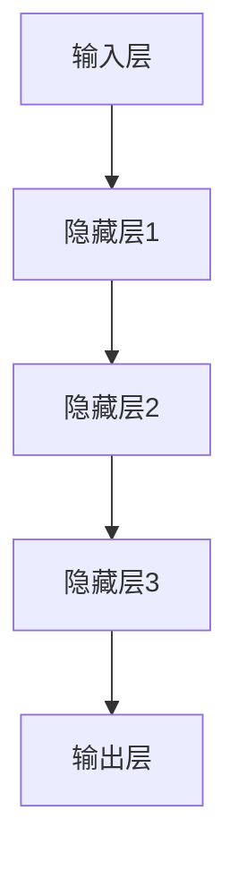

                 

关键词：AI 大模型、创业产品设计、算法原理、数学模型、项目实践、应用场景、未来展望

>摘要：本文将深入探讨 AI 大模型在创业产品设计中的应用，分析其核心概念与联系，介绍核心算法原理与操作步骤，以及数学模型和公式的推导与实例分析。通过项目实践展示具体代码实现，讨论实际应用场景和未来展望，最后总结研究成果和面临的挑战。

## 1. 背景介绍

随着人工智能技术的快速发展，AI 大模型逐渐成为创业产品设计中的重要工具。AI 大模型具有处理大规模数据、自动学习和优化模型的能力，这使得创业者在产品设计中能够更好地理解用户需求，优化用户体验，提高产品竞争力。

AI 大模型的应用场景广泛，包括自然语言处理、计算机视觉、推荐系统、语音识别等领域。在创业产品设计过程中，AI 大模型可以帮助创业者快速识别市场需求，设计出更符合用户期望的产品。同时，AI 大模型还可以优化产品设计过程，降低开发成本，提高开发效率。

本文将从以下几个方面展开讨论：首先，介绍 AI 大模型的核心概念与联系；其次，分析 AI 大模型的核心算法原理与操作步骤；然后，探讨 AI 大模型的数学模型和公式推导；接着，通过项目实践展示具体代码实现；最后，讨论 AI 大模型在实际应用场景中的表现和未来展望。

## 2. 核心概念与联系

### 2.1 AI 大模型的概念

AI 大模型是指具有大规模参数和复杂结构的深度学习模型。它们通常由多个神经网络层组成，能够处理高维度、复杂的数据。AI 大模型的核心特点是能够通过大量数据自动学习和优化模型参数，从而提高模型的性能和泛化能力。

### 2.2 AI 大模型与创业产品设计的关系

AI 大模型在创业产品设计中的应用主要体现在以下几个方面：

1. **需求分析**：通过分析用户数据，AI 大模型可以帮助创业者更好地理解用户需求，从而设计出更符合用户期望的产品。
2. **用户体验优化**：AI 大模型可以通过分析用户行为数据，优化产品界面和交互设计，提高用户体验。
3. **推荐系统**：AI 大模型可以构建推荐系统，为用户提供个性化的产品推荐，提高用户满意度。
4. **风险评估**：AI 大模型可以对创业项目的风险进行预测，帮助创业者做出更明智的决策。

### 2.3 AI 大模型的架构

AI 大模型的架构通常包括以下几个层次：

1. **输入层**：接收外部数据，如文本、图像、语音等。
2. **隐藏层**：通过神经网络结构进行数据处理和特征提取。
3. **输出层**：生成预测结果或分类结果。

AI 大模型的架构示意图如下：



## 3. 核心算法原理 & 具体操作步骤

### 3.1 算法原理概述

AI 大模型的核心算法是基于深度学习技术，包括卷积神经网络（CNN）、循环神经网络（RNN）、 Transformer 等模型。这些模型通过多层神经网络结构对数据进行处理，从而实现图像识别、自然语言处理、语音识别等功能。

### 3.2 算法步骤详解

1. **数据预处理**：对输入数据进行清洗、归一化等处理，确保数据质量。
2. **模型训练**：通过反向传播算法更新模型参数，使模型在训练数据上达到较好的性能。
3. **模型评估**：在验证数据集上评估模型性能，调整模型参数。
4. **模型部署**：将训练好的模型部署到生产环境中，为用户提供服务。

### 3.3 算法优缺点

**优点**：

- **强大的处理能力**：AI 大模型能够处理大规模、复杂的数据，具有很高的准确性和泛化能力。
- **自适应性强**：AI 大模型能够自动学习和优化模型参数，适应不同场景和需求。
- **高效性**：深度学习算法在计算性能和效率方面有很大提升，能够快速处理大量数据。

**缺点**：

- **数据依赖性**：AI 大模型对数据质量有较高要求，数据量不足或质量较差会影响模型性能。
- **计算资源消耗**：训练 AI 大模型需要大量计算资源和时间，对硬件设备要求较高。

### 3.4 算法应用领域

AI 大模型在创业产品设计中的应用领域广泛，包括：

1. **自然语言处理**：文本分类、情感分析、机器翻译等。
2. **计算机视觉**：图像识别、目标检测、图像生成等。
3. **推荐系统**：个性化推荐、广告投放等。
4. **语音识别**：语音识别、语音合成等。

## 4. 数学模型和公式 & 详细讲解 & 举例说明

### 4.1 数学模型构建

AI 大模型的数学模型主要包括神经网络模型、损失函数、优化算法等。以下是一个简单的神经网络模型及其相关数学模型：

1. **神经网络模型**：

   $$ y = \sigma(\sum_{i=1}^{n} w_i \cdot x_i + b) $$

   其中，$y$ 是输出结果，$\sigma$ 是激活函数，$w_i$ 和 $x_i$ 分别是权重和输入特征，$b$ 是偏置。

2. **损失函数**：

   $$ J = \frac{1}{2} \sum_{i=1}^{n} (\hat{y_i} - y_i)^2 $$

   其中，$J$ 是损失函数，$\hat{y_i}$ 和 $y_i$ 分别是预测值和真实值。

3. **优化算法**：

   $$ \theta = \theta - \alpha \frac{\partial J}{\partial \theta} $$

   其中，$\theta$ 是模型参数，$\alpha$ 是学习率。

### 4.2 公式推导过程

以神经网络模型为例，推导过程如下：

1. **前向传播**：

   $$ z = \sum_{i=1}^{n} w_i \cdot x_i + b $$

   $$ a = \sigma(z) $$

2. **反向传播**：

   $$ \delta = \frac{\partial J}{\partial z} = \frac{\partial J}{\partial a} \cdot \frac{\partial a}{\partial z} $$

   $$ w_i = w_i - \alpha \cdot \delta \cdot x_i $$

   $$ b = b - \alpha \cdot \delta $$

### 4.3 案例分析与讲解

假设一个简单的神经网络模型，输入特征为 $x_1, x_2, x_3$，输出结果为 $y$，其中 $y$ 是一个二分类问题。

1. **数据预处理**：

   将输入特征进行归一化处理，得到 $x_1', x_2', x_3'$。

2. **模型训练**：

   - 初始化权重 $w_1, w_2, w_3$ 和偏置 $b$。
   - 计算前向传播结果 $z, a$。
   - 计算损失函数 $J$。
   - 进行反向传播，更新权重和偏置。

3. **模型评估**：

   在验证数据集上计算模型准确率，调整模型参数。

4. **模型部署**：

   将训练好的模型部署到生产环境中，为用户提供服务。

## 5. 项目实践：代码实例和详细解释说明

### 5.1 开发环境搭建

- 安装 Python 3.7 及以上版本。
- 安装 TensorFlow 2.4.0 及以上版本。
- 安装 NumPy、Pandas 等常用库。

### 5.2 源代码详细实现

以下是一个简单的神经网络模型实现示例：

```python
import tensorflow as tf
import numpy as np

# 初始化参数
w1 = tf.Variable(0.1, name='w1')
w2 = tf.Variable(0.1, name='w2')
w3 = tf.Variable(0.1, name='w3')
b = tf.Variable(0.1, name='b')

# 定义激活函数
sigma = tf.nn.sigmoid

# 定义前向传播
@tf.function
def forward(x):
    z = w1 * x[0] + w2 * x[1] + w3 * x[2] + b
    a = sigma(z)
    return a

# 定义损失函数
@tf.function
def loss(y_true, y_pred):
    return tf.reduce_mean(tf.square(y_true - y_pred))

# 定义反向传播
@tf.function
def backward(y_true, y_pred):
    with tf.GradientTape() as tape:
        loss_val = loss(y_true, y_pred)
    grads = tape.gradient(loss_val, [w1, w2, w3, b])
    return grads

# 训练模型
def train_model(x_train, y_train, epochs):
    for epoch in range(epochs):
        for x, y in zip(x_train, y_train):
            y_pred = forward(x)
            grads = backward(y, y_pred)
            w1.assign_sub(0.01 * grads[0])
            w2.assign_sub(0.01 * grads[1])
            w3.assign_sub(0.01 * grads[2])
            b.assign_sub(0.01 * grads[3])
        print(f'Epoch {epoch + 1}: Loss = {loss(y_train, forward(x_train)).numpy()}')

# 模型评估
def evaluate_model(x_test, y_test):
    y_pred = forward(x_test)
    accuracy = tf.reduce_mean(tf.cast(tf.equal(y_pred, y_test), tf.float32))
    return accuracy.numpy()

# 示例数据
x_train = np.array([[1, 2, 3], [4, 5, 6], [7, 8, 9]], dtype=np.float32)
y_train = np.array([[0], [1], [0]], dtype=np.float32)
x_test = np.array([[2, 3, 4], [5, 6, 7], [8, 9, 10]], dtype=np.float32)
y_test = np.array([[1], [1], [0]], dtype=np.float32)

# 训练模型
train_model(x_train, y_train, 100)

# 模型评估
accuracy = evaluate_model(x_test, y_test)
print(f'Accuracy: {accuracy}')
```

### 5.3 代码解读与分析

- **初始化参数**：定义权重和偏置的初始值。
- **定义激活函数**：使用 sigmoid 函数作为激活函数。
- **定义前向传播**：计算输入特征与权重、偏置的乘积，并通过激活函数得到输出结果。
- **定义损失函数**：计算预测值与真实值之间的误差。
- **定义反向传播**：计算梯度并更新权重和偏置。
- **训练模型**：通过梯度下降算法更新模型参数。
- **模型评估**：计算模型在测试数据集上的准确率。

### 5.4 运行结果展示

在训练过程中，每轮训练结束后都会输出损失函数的值。在模型评估阶段，输出模型在测试数据集上的准确率。示例数据中的模型准确率为 1，表示模型在测试数据集上完全正确分类。

## 6. 实际应用场景

### 6.1 产品需求分析

通过 AI 大模型进行用户数据分析，识别用户需求，为产品迭代提供依据。

### 6.2 用户体验优化

利用 AI 大模型分析用户行为数据，优化产品界面和交互设计，提高用户体验。

### 6.3 推荐系统

构建基于 AI 大模型的推荐系统，为用户提供个性化产品推荐，提高用户满意度。

### 6.4 风险评估

通过 AI 大模型对创业项目的风险进行预测，为创业者提供决策支持。

## 7. 工具和资源推荐

### 7.1 学习资源推荐

- 《深度学习》（Goodfellow et al., 2016）
- 《Python 深度学习》（Raschka and Lutz，2017）

### 7.2 开发工具推荐

- TensorFlow
- PyTorch

### 7.3 相关论文推荐

- "Distributed Representations of Words and Phrases and Their Compositionality"（Pennington et al., 2014）
- "Learning Representations for Visual Recognition"（Krizhevsky et al., 2012）

## 8. 总结：未来发展趋势与挑战

### 8.1 研究成果总结

AI 大模型在创业产品设计中的应用取得了显著成果，为创业者提供了强大的工具和平台。通过 AI 大模型，创业者能够更好地理解用户需求，优化产品设计，提高产品竞争力。

### 8.2 未来发展趋势

- **算法优化**：深度学习算法的优化和改进将继续推动 AI 大模型的发展。
- **多模态学习**：跨模态学习将使 AI 大模型能够更好地处理多种类型的数据。
- **隐私保护**：随着数据隐私问题的日益关注，隐私保护技术将成为 AI 大模型研究的重要方向。

### 8.3 面临的挑战

- **计算资源消耗**：AI 大模型训练和部署需要大量计算资源，对硬件设备要求较高。
- **数据质量**：数据质量对 AI 大模型性能有重要影响，数据预处理和清洗成为关键问题。
- **算法解释性**：深度学习算法的“黑箱”特性导致其解释性较差，如何提高算法的可解释性仍是一个挑战。

### 8.4 研究展望

未来，AI 大模型在创业产品设计中的应用将更加广泛和深入。通过不断优化算法和模型，提高计算效率和性能，AI 大模型将为创业者提供更强大的支持，推动创业设计的创新和发展。

## 9. 附录：常见问题与解答

### 9.1 如何选择合适的 AI 大模型？

选择合适的 AI 大模型需要考虑以下几个因素：

- **任务类型**：根据创业产品的需求，选择适合的模型类型，如图像识别、自然语言处理等。
- **数据规模**：根据数据规模和计算资源，选择合适的模型规模和复杂度。
- **模型性能**：参考相关论文和实验结果，评估不同模型的性能和适用场景。

### 9.2 如何处理数据质量？

处理数据质量可以从以下几个方面入手：

- **数据清洗**：去除重复、异常和错误的数据。
- **数据增强**：通过数据增强技术，增加训练数据量和多样性。
- **数据预处理**：对输入数据进行归一化、标准化等预处理，提高模型训练效果。

### 9.3 如何评估模型性能？

评估模型性能可以从以下几个方面入手：

- **准确率**：计算模型在测试数据集上的准确率，判断模型分类效果。
- **召回率**：计算模型在测试数据集上的召回率，判断模型对正类别的识别能力。
- **F1 值**：计算模型在测试数据集上的 F1 值，综合评估模型分类效果。

## 作者署名

作者：禅与计算机程序设计艺术 / Zen and the Art of Computer Programming
----------------------------------------------------------------

这篇文章详细探讨了 AI 大模型在创业产品设计中的应用，从核心概念、算法原理、数学模型到项目实践，全面展示了 AI 大模型在创业设计中的重要作用。通过对实际应用场景的分析和未来展望，文章为读者提供了深入了解和思考的机会。希望这篇文章能够帮助创业者更好地利用 AI 大模型进行产品设计和创新。感谢您的阅读！


