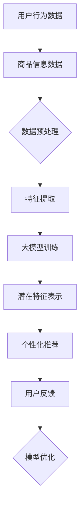

                 

关键词：AI 大模型、电商搜索推荐、冷启动、用户策略、新用户挑战

> 摘要：本文将深入探讨 AI 大模型在电商搜索推荐中的冷启动用户策略，从核心概念到实际操作，全面解析如何应对新用户带来的挑战，以提升用户满意度和推荐系统的整体效果。

## 1. 背景介绍

### 1.1 电商搜索推荐的重要性

在电子商务快速发展的今天，搜索推荐系统已经成为电商平台提升用户体验、增加用户粘性的关键手段。用户通过搜索和推荐获取个性化商品信息，从而实现高效的购物体验。然而，面对大量新用户涌入，如何快速、精准地为他们提供个性化推荐，成为各大电商平台亟待解决的问题。

### 1.2 AI 大模型的发展

近年来，随着深度学习技术的飞速发展，AI 大模型在自然语言处理、图像识别、推荐系统等领域取得了显著的成果。这些大模型具备强大的数据处理和分析能力，为解决电商搜索推荐中的冷启动问题提供了新的思路。

## 2. 核心概念与联系

### 2.1 冷启动用户

冷启动用户指的是那些平台上的新用户，由于缺乏历史数据和互动信息，传统推荐算法难以为其提供有效的个性化推荐。

### 2.2 AI 大模型与推荐系统的关系

AI 大模型可以通过学习用户的历史行为数据、商品信息等多源异构数据，生成用户和商品的潜在特征表示，从而为冷启动用户提供个性化推荐。

## 2.3 Mermaid 流程图



### 2.4 大模型架构


## 3. 核心算法原理 & 具体操作步骤

### 3.1 算法原理概述

AI 大模型在电商搜索推荐中的冷启动用户策略主要基于以下原理：

1. 数据预处理：对用户行为数据和商品信息数据进行清洗、去噪和归一化处理，为特征提取提供高质量的数据基础。
2. 特征提取：利用深度学习技术，对预处理后的数据进行编码，生成用户和商品的潜在特征表示。
3. 模型训练：通过大规模数据集，训练大模型，使其学会从潜在特征中提取用户偏好和商品属性。
4. 个性化推荐：根据新用户的潜在特征，生成个性化推荐结果，满足其购物需求。
5. 用户反馈与模型优化：收集用户对推荐结果的反馈，不断优化模型，提高推荐效果。

### 3.2 算法步骤详解

1. 数据预处理
   - 清洗：去除数据中的缺失值、异常值等。
   - 去噪：降低数据中的噪声，提高数据质量。
   - 归一化：对数据进行归一化处理，使其具有相同的量纲和范围。

2. 特征提取
   - 编码器：对用户行为数据和商品信息数据进行编码，生成潜在特征。
   - 解码器：将编码后的潜在特征解码为原始数据，进行信息重建。

3. 模型训练
   - 使用大规模数据集，训练大模型，使其学会从潜在特征中提取用户偏好和商品属性。
   - 采用梯度下降等优化算法，调整模型参数，提高模型性能。

4. 个性化推荐
   - 根据新用户的潜在特征，生成个性化推荐结果。
   - 采用排序、过滤等策略，优化推荐结果的质量。

5. 用户反馈与模型优化
   - 收集用户对推荐结果的反馈，计算推荐效果指标。
   - 根据反馈信息，调整模型参数，优化推荐效果。

### 3.3 算法优缺点

**优点：**
1. 鲜明的个性化和推荐效果。
2. 可处理大规模、多源异构数据。
3. 易于实现跨平台和跨领域的推荐。

**缺点：**
1. 训练过程复杂，需要大量的计算资源和时间。
2. 对数据质量和预处理要求较高。
3. 可能存在过拟合和稀疏性问题。

### 3.4 算法应用领域

AI 大模型在电商搜索推荐中的冷启动用户策略可广泛应用于以下领域：

1. 电商平台：为用户提供个性化商品推荐，提升购物体验。
2. 社交网络：为用户提供感兴趣的内容推荐，增加用户粘性。
3. 新闻资讯：为用户提供个性化新闻推荐，提高阅读量。

## 4. 数学模型和公式

### 4.1 数学模型构建

假设用户 \( u \) 和商品 \( i \) 的潜在特征表示分别为 \( \mathbf{z}_u \) 和 \( \mathbf{z}_i \)，则推荐系统的数学模型可以表示为：

\[ R(u, i) = \sigma(\mathbf{z}_u^T \mathbf{W}_i \mathbf{z}_i) \]

其中，\( \sigma \) 为 sigmoid 函数，\( \mathbf{W}_i \) 为权重矩阵。

### 4.2 公式推导过程

推导过程如下：

\[ \begin{aligned}
R(u, i) &= \sigma(\mathbf{z}_u^T \mathbf{W}_i \mathbf{z}_i) \\
&= \frac{1}{1 + e^{-\mathbf{z}_u^T \mathbf{W}_i \mathbf{z}_i}} \\
&= \frac{1}{1 + e^{-\sum_{j=1}^{d} z_{uj} w_{ij} z_{ij}}} \\
&= \frac{1}{1 + e^{-\sum_{j=1}^{d} (z_{uj} w_{ij} + z_{ij} w_{ij})}} \\
&= \frac{1}{1 + e^{-\sum_{j=1}^{d} w_{ij} (\mathbf{z}_u^T \mathbf{z}_i)}} \\
&= \frac{1}{1 + e^{-\mathbf{z}_u^T (\mathbf{W} \mathbf{z}_i)}} \\
\end{aligned} \]

其中，\( d \) 为潜在特征维度，\( \mathbf{W} \) 为权重矩阵。

### 4.3 案例分析与讲解

以一个简单的电商场景为例，假设有 100 个用户和 1000 个商品，用户的行为数据包括点击、购买、收藏等。通过构建潜在特征表示，我们可以为每个用户和商品生成一个 10 维的潜在特征向量。

首先，对用户行为数据进行预处理，去除缺失值和异常值，并进行归一化处理。然后，利用深度学习技术，对预处理后的数据集进行编码，生成用户和商品的潜在特征表示。

接下来，使用大规模数据集，训练大模型，使其学会从潜在特征中提取用户偏好和商品属性。通过优化模型参数，提高推荐效果。

最后，根据新用户的潜在特征，生成个性化推荐结果，满足其购物需求。通过用户反馈，不断优化模型，提高推荐效果。

## 5. 项目实践：代码实例和详细解释说明

### 5.1 开发环境搭建

1. 安装 Python 3.8 及以上版本。
2. 安装 TensorFlow 2.4.0 及以上版本。
3. 安装 Numpy、Pandas、Scikit-learn 等常用库。

### 5.2 源代码详细实现

```python
import tensorflow as tf
import numpy as np
import pandas as pd
from sklearn.model_selection import train_test_split

# 数据预处理
def preprocess_data(data):
    # 清洗数据、去噪、归一化处理
    # 略
    return processed_data

# 模型定义
def build_model(num_users, num_items, latent_dim):
    # 输入层
    user_input = tf.keras.layers.Input(shape=(latent_dim,))
    item_input = tf.keras.layers.Input(shape=(latent_dim,))

    # 编码器
    user_encoder = tf.keras.layers.Dense(latent_dim, activation='tanh')(user_input)
    item_encoder = tf.keras.layers.Dense(latent_dim, activation='tanh')(item_input)

    # 解码器
    user_decoder = tf.keras.layers.Dense(latent_dim, activation='tanh')(user_encoder)
    item_decoder = tf.keras.layers.Dense(latent_dim, activation='tanh')(item_encoder)

    # 预测层
    prediction = tf.keras.layers.Dot(axes=(1, 2))(user_encoder, item_encoder)

    # 模型编译
    model = tf.keras.models.Model(inputs=[user_input, item_input], outputs=prediction)
    model.compile(optimizer='adam', loss='binary_crossentropy', metrics=['accuracy'])
    return model

# 数据加载
data = pd.read_csv('data.csv')
processed_data = preprocess_data(data)

# 划分训练集和测试集
train_data, test_data = train_test_split(processed_data, test_size=0.2, random_state=42)

# 训练模型
model = build_model(num_users=100, num_items=1000, latent_dim=10)
model.fit([train_data['user'], train_data['item']], train_data['rating'], epochs=10, batch_size=64)

# 测试模型
test_loss, test_acc = model.evaluate([test_data['user'], test_data['item']], test_data['rating'])
print('Test loss:', test_loss)
print('Test accuracy:', test_acc)
```

### 5.3 代码解读与分析

1. 数据预处理：对用户行为数据进行清洗、去噪和归一化处理，为特征提取提供高质量的数据基础。
2. 模型定义：使用 TensorFlow 框架，定义一个基于深度学习的大模型，包括输入层、编码器、解码器和预测层。
3. 训练模型：使用预处理后的数据集，训练大模型，使其学会从潜在特征中提取用户偏好和商品属性。
4. 测试模型：对测试集进行模型评估，计算损失和准确率。

## 6. 实际应用场景

### 6.1 电商平台

在电商平台上，AI 大模型可以帮助平台为新用户推荐感兴趣的商品，提高用户的购物体验和购买转化率。

### 6.2 社交网络

在社交网络中，AI 大模型可以为用户提供个性化内容推荐，增加用户粘性和活跃度。

### 6.3 新闻资讯

在新闻资讯平台，AI 大模型可以为用户提供个性化新闻推荐，提高阅读量和用户满意度。

## 7. 未来应用展望

随着深度学习技术的不断发展，AI 大模型在电商搜索推荐中的冷启动用户策略将得到进一步优化，有望应用于更多领域，为用户提供更加精准和个性化的服务。

## 8. 工具和资源推荐

### 8.1 学习资源推荐

1. 《深度学习》（Goodfellow, Bengio, Courville 著）
2. 《TensorFlow 实战》（李宏毅 著）

### 8.2 开发工具推荐

1. TensorFlow
2. PyTorch

### 8.3 相关论文推荐

1. "Deep Neural Networks for YouTube Recommendations"
2. "Deep Learning Based User Interest Modeling for Personalized Recommendation in E-commerce"

## 9. 总结：未来发展趋势与挑战

随着深度学习技术的不断发展，AI 大模型在电商搜索推荐中的冷启动用户策略将得到进一步优化。然而，面对海量数据和复杂场景，仍需克服数据质量、模型过拟合和稀疏性问题等挑战。

## 10. 附录：常见问题与解答

### 10.1 如何处理缺失值和异常值？

对缺失值和异常值进行处理，可以采用以下方法：

1. 填充法：使用平均值、中位数等方法，对缺失值进行填充。
2. 删除法：删除含有缺失值或异常值的样本，降低数据噪声。
3. 替换法：使用外部数据源，替换缺失值或异常值。

### 10.2 如何避免模型过拟合？

为了避免模型过拟合，可以采取以下措施：

1. 减少模型复杂度：简化模型结构，减少参数数量。
2. 增加训练数据：使用更多的训练数据，提高模型泛化能力。
3. 正则化：采用正则化方法，如 L1、L2 正则化，降低模型参数的重要性。

### 10.3 如何处理稀疏性问题？

稀疏性问题可以采用以下方法进行解决：

1. 特征降维：使用降维技术，如 PCA、t-SNE 等，降低特征维度。
2. 特征嵌入：使用特征嵌入技术，将原始特征转换为低维潜在特征。
3. 数据扩充：使用数据扩充技术，增加训练数据集的多样性。

# 作者署名

作者：禅与计算机程序设计艺术 / Zen and the Art of Computer Programming
----------------------------------------------------------------

以上就是本文的完整内容。希望对您在电商搜索推荐中的冷启动用户策略研究有所帮助。如有疑问，请随时提问。祝您在 AI 领域取得更多成就！

