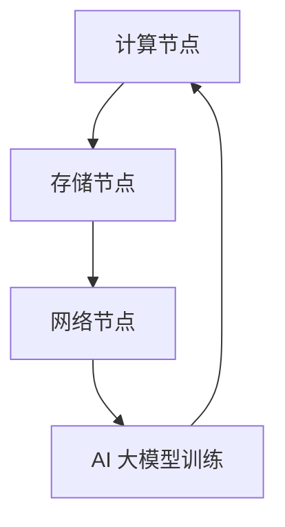

                 

关键词：AI 大模型、数据中心建设、数据中心产业、产业发展、技术趋势

> 摘要：本文探讨了 AI 大模型应用数据中心建设的必要性和重要性，详细介绍了数据中心产业的现状、发展趋势以及 AI 大模型在实际应用中的具体实践。通过分析数学模型、算法原理、项目实践等，为数据中心产业发展提供了有益的参考。

## 1. 背景介绍

在信息技术飞速发展的今天，数据中心已成为企业和社会运转的重要基础设施。随着人工智能（AI）技术的不断进步，AI 大模型的应用逐渐成为数据中心建设的核心驱动力。AI 大模型如 GPT-3、BERT 等在自然语言处理、图像识别、语音识别等领域展现出强大的性能，对数据中心的需求也日益增加。

数据中心产业正面临前所未有的发展机遇。一方面，数据中心的建设和运营已成为各国政府和企业关注的重点，另一方面，AI 大模型对数据中心资源的巨大需求，推动了数据中心产业的技术创新和优化。然而，数据中心产业也面临一些挑战，如能耗问题、数据安全问题、管理问题等。

## 2. 核心概念与联系

### 2.1 AI 大模型概述

AI 大模型是指具有海量参数和复杂结构的人工神经网络模型，通过深度学习算法在大量数据上训练得到。它们在图像识别、自然语言处理、语音识别等领域表现出色。

### 2.2 数据中心架构

数据中心架构包括计算节点、存储节点、网络节点等。计算节点负责处理 AI 大模型训练和推理任务，存储节点负责存储海量数据，网络节点负责数据传输和通信。

### 2.3 Mermaid 流程图



## 3. 核心算法原理 & 具体操作步骤

### 3.1 算法原理概述

AI 大模型的核心算法是深度学习算法，包括前向传播、反向传播等步骤。通过在大量数据上训练，模型可以自动提取数据特征，实现高精度的预测和分类。

### 3.2 算法步骤详解

1. 数据预处理：对输入数据进行标准化、归一化等处理，使其满足模型训练要求。
2. 构建模型：根据任务需求，设计合适的神经网络结构，如卷积神经网络（CNN）、循环神经网络（RNN）等。
3. 模型训练：通过反向传播算法，不断调整模型参数，使模型在训练数据上达到最优性能。
4. 模型评估：在验证数据集上评估模型性能，选择最佳模型。
5. 模型推理：在测试数据集上应用训练好的模型，实现预测和分类任务。

### 3.3 算法优缺点

优点：高精度、强泛化能力、自动特征提取。

缺点：计算资源需求大、训练时间长、易过拟合。

### 3.4 算法应用领域

AI 大模型在自然语言处理、图像识别、语音识别等领域具有广泛的应用，如智能问答、自动驾驶、智能安防等。

## 4. 数学模型和公式 & 详细讲解 & 举例说明

### 4.1 数学模型构建

假设我们有一个二分类问题，输入特征为 $X \in \mathbb{R}^{n \times d}$，输出标签为 $Y \in \{0, 1\}$。我们使用多层感知机（MLP）模型进行训练。

### 4.2 公式推导过程

多层感知机的输出可以通过以下公式计算：

$$
Z = \sigma(W_2 \cdot \sigma(W_1 \cdot X + b_1) + b_2)
$$

其中，$\sigma$ 表示 sigmoid 函数，$W_1, W_2$ 分别为第一层和第二层的权重矩阵，$b_1, b_2$ 分别为第一层和第二层的偏置向量。

### 4.3 案例分析与讲解

假设我们有一个包含 1000 个样本的二分类问题，其中 500 个样本为正类，500 个样本为负类。我们使用多层感知机模型进行训练。

1. 数据预处理：对输入数据进行标准化处理，使其满足模型训练要求。
2. 模型构建：设计一个包含一个输入层、一个隐藏层和一个输出层的多层感知机模型。
3. 模型训练：通过反向传播算法，不断调整模型参数，使模型在训练数据上达到最优性能。
4. 模型评估：在验证数据集上评估模型性能，选择最佳模型。
5. 模型推理：在测试数据集上应用训练好的模型，实现预测和分类任务。

## 5. 项目实践：代码实例和详细解释说明

### 5.1 开发环境搭建

1. 安装 Python 3.8 及以上版本。
2. 安装 TensorFlow 2.6 及以上版本。

### 5.2 源代码详细实现

```python
import tensorflow as tf
from sklearn.model_selection import train_test_split
from sklearn.preprocessing import StandardScaler

# 数据预处理
X, Y = load_data()  # 加载样本数据
X_train, X_test, Y_train, Y_test = train_test_split(X, Y, test_size=0.2, random_state=42)
scaler = StandardScaler()
X_train = scaler.fit_transform(X_train)
X_test = scaler.transform(X_test)

# 模型构建
model = tf.keras.Sequential([
    tf.keras.layers.Dense(64, activation='relu', input_shape=(X_train.shape[1],)),
    tf.keras.layers.Dense(1, activation='sigmoid')
])

# 模型训练
model.compile(optimizer='adam', loss='binary_crossentropy', metrics=['accuracy'])
model.fit(X_train, Y_train, epochs=10, batch_size=32, validation_data=(X_test, Y_test))

# 模型评估
loss, accuracy = model.evaluate(X_test, Y_test)
print(f"Test accuracy: {accuracy:.4f}")

# 模型推理
predictions = model.predict(X_test)
print(predictions)
```

### 5.3 代码解读与分析

该代码实现了一个简单的二分类问题，使用了 TensorFlow 2.6 编写。首先，我们加载样本数据并进行预处理，然后构建一个多层感知机模型，使用 Adam 优化器和 binary_crossentropy 损失函数进行模型训练。最后，我们在测试数据集上评估模型性能，并输出预测结果。

## 6. 实际应用场景

### 6.1 智能问答

利用 AI 大模型，我们可以实现智能问答系统。通过在大量问答数据集上训练，模型可以理解用户提问，并给出准确的答案。

### 6.2 自动驾驶

自动驾驶系统需要处理大量的图像和传感器数据。AI 大模型在图像识别和目标检测方面具有强大的性能，可以帮助自动驾驶系统识别道路标志、行人等。

### 6.3 智能安防

智能安防系统利用 AI 大模型进行实时监控，识别异常行为，提高安全防护能力。

## 7. 工具和资源推荐

### 7.1 学习资源推荐

1. 《深度学习》（Goodfellow、Bengio、Courville 著）
2. 《神经网络与深度学习》（邱锡鹏 著）

### 7.2 开发工具推荐

1. TensorFlow
2. PyTorch

### 7.3 相关论文推荐

1. "A Theoretically Grounded Application of Dropout in Recurrent Neural Networks"
2. "Bert: Pre-training of deep bidirectional transformers for language understanding"

## 8. 总结：未来发展趋势与挑战

### 8.1 研究成果总结

AI 大模型在数据中心建设中的应用取得了显著成果，为数据中心产业发展提供了强大动力。通过深度学习算法，AI 大模型在各个领域取得了突破性进展，推动了数据中心技术的不断创新。

### 8.2 未来发展趋势

1. 更高效、更节能的 AI 大模型算法。
2. 数据中心与边缘计算的融合。
3. 安全、隐私保护技术的应用。

### 8.3 面临的挑战

1. 数据安全与隐私保护。
2. 数据中心能耗问题。
3. 模型解释性和可解释性。

### 8.4 研究展望

未来，随着 AI 大模型技术的不断发展，数据中心建设将迎来更多机遇和挑战。我们需要深入研究数据安全、隐私保护、能耗优化等问题，推动数据中心产业的可持续发展。

## 9. 附录：常见问题与解答

### 9.1 问题 1：什么是 AI 大模型？

AI 大模型是指具有海量参数和复杂结构的人工神经网络模型，通过深度学习算法在大量数据上训练得到。它们在图像识别、自然语言处理、语音识别等领域表现出色。

### 9.2 问题 2：数据中心建设的重要性是什么？

数据中心建设是企业和社会运转的重要基础设施，提供了计算、存储、网络等资源。随着 AI 大模型的应用，数据中心建设成为推动数据中心产业发展的重要驱动力。

### 9.3 问题 3：AI 大模型在数据中心建设中如何应用？

AI 大模型在数据中心建设中可以用于自然语言处理、图像识别、语音识别等任务。通过深度学习算法，模型可以在大量数据上训练，实现高精度的预测和分类。

----------------------------------------------------------------

作者：禅与计算机程序设计艺术 / Zen and the Art of Computer Programming
----------------------------------------------------------------


