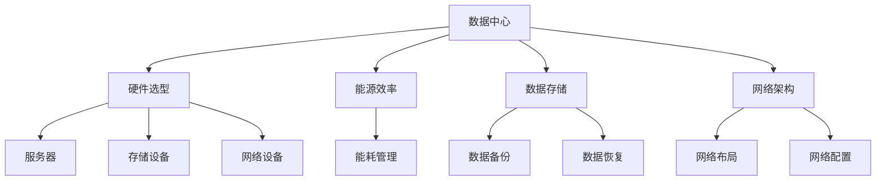

                 

关键词：AI 大模型、数据中心、成本优化、硬件选型、能源效率、能耗管理、数据存储、网络架构、云计算、绿色数据中心

> 摘要：本文深入探讨了 AI 大模型在数据中心建设中的应用，以及如何通过优化数据中心成本来提高整体运营效率。从硬件选型、能源效率、能耗管理、数据存储、网络架构等多个方面进行分析，提出了具体的技术策略和实施方案，旨在为 IT 专业人员提供有价值的指导。

## 1. 背景介绍

随着人工智能（AI）技术的快速发展，AI 大模型的应用越来越广泛。这些模型通常需要大量的计算资源和数据存储，因此数据中心的建设变得至关重要。数据中心不仅是 AI 模型的训练和部署场所，也是企业数字化转型的重要基础设施。然而，数据中心的建设和维护成本高昂，如何优化成本成为了行业面临的重大挑战。

数据中心成本优化的目标在于在不牺牲性能和可靠性的前提下，降低运营成本，提高资源利用率。这需要综合考虑硬件选型、能源效率、能耗管理、数据存储、网络架构等多个方面。

## 2. 核心概念与联系

为了更好地理解数据中心成本优化的概念和联系，我们首先需要介绍几个核心概念：

### 2.1. 数据中心定义

数据中心是一个集中式信息系统基础设施，用于存储、处理、管理和交换大量数据。数据中心通常包含计算节点、存储系统、网络设备、电源系统和其他相关设备。

### 2.2. 硬件选型

硬件选型是数据中心建设的关键环节，包括服务器、存储设备、网络设备等的选择。选择合适的硬件可以提高性能和可靠性，降低长期运营成本。

### 2.3. 能源效率

能源效率是指数据中心在提供计算和存储服务时消耗的能源与实际服务能力的比值。提高能源效率可以降低运营成本，减少碳排放。

### 2.4. 能耗管理

能耗管理是指通过监测、分析和优化数据中心能源使用，实现能耗最小化和成本控制。能耗管理涉及能源消耗监测、能源效率评估和能源消耗优化。

### 2.5. 数据存储

数据存储是数据中心的核心功能之一，涉及数据存储设备的选型、数据备份和恢复策略等。合理的存储方案可以提高数据存取速度和可靠性。

### 2.6. 网络架构

网络架构是指数据中心内部和外部的网络布局和配置。合理的网络架构可以提高数据传输速度和可靠性，降低网络延迟和带宽消耗。

### 2.7. Mermaid 流程图

下面是一个简单的 Mermaid 流程图，展示了数据中心成本优化中的关键概念和它们之间的联系：



## 3. 核心算法原理 & 具体操作步骤

### 3.1 算法原理概述

数据中心成本优化的核心算法原理主要包括以下几个方面：

1. **硬件选型优化**：基于 AI 大模型的需求，选择最适合的服务器、存储设备和网络设备。
2. **能源效率优化**：通过节能技术和管理策略，提高数据中心能源使用效率。
3. **能耗管理优化**：利用能耗监测和数据分析，优化能源消耗。
4. **数据存储优化**：采用合理的存储方案，提高数据存取速度和可靠性。
5. **网络架构优化**：设计合理的网络布局和配置，降低网络延迟和带宽消耗。

### 3.2 算法步骤详解

数据中心成本优化的具体操作步骤如下：

1. **需求分析**：明确 AI 大模型的应用场景和性能要求，确定数据中心硬件和软件需求。
2. **硬件选型**：根据需求分析结果，选择合适的服务器、存储设备和网络设备。
3. **能源效率优化**：采用节能技术，如虚拟化技术、高效电源管理系统和制冷系统等，提高能源使用效率。
4. **能耗管理**：安装能耗监测设备，收集能源消耗数据，进行数据分析和优化。
5. **数据存储优化**：选择合适的存储方案，如分布式存储、数据压缩和去重技术等，提高数据存取速度和可靠性。
6. **网络架构优化**：设计合理的网络布局和配置，提高数据传输速度和可靠性。
7. **持续优化**：根据实际运行数据和用户反馈，持续优化数据中心性能和成本。

### 3.3 算法优缺点

数据中心成本优化算法具有以下优缺点：

**优点**：

- 提高数据中心整体性能和可靠性。
- 降低运营成本，提高资源利用率。
- 减少能源消耗，降低碳排放。

**缺点**：

- 需要大量的数据收集和分析，对数据处理能力要求较高。
- 涉及多个方面，需要综合考虑和协调。

### 3.4 算法应用领域

数据中心成本优化算法可以广泛应用于以下领域：

- 企业数据中心建设
- 云计算服务提供商
- AI 大模型研发和应用
- 绿色数据中心建设

## 4. 数学模型和公式 & 详细讲解 & 举例说明

### 4.1 数学模型构建

数据中心成本优化的数学模型主要包括以下几个方面：

1. **成本模型**：考虑硬件采购成本、运维成本、能源消耗成本等。
2. **性能模型**：考虑数据处理能力、响应时间、可靠性等指标。
3. **能耗模型**：考虑能源消耗、能源效率、碳排放等指标。

### 4.2 公式推导过程

下面是成本模型的推导过程：

1. **硬件采购成本**：

$$C_{hardware} = \sum_{i=1}^{n} (P_{i} \times Q_{i})$$

其中，$C_{hardware}$表示硬件采购成本，$P_{i}$表示第$i$种硬件的单价，$Q_{i}$表示第$i$种硬件的采购数量。

2. **运维成本**：

$$C_{operation} = \sum_{i=1}^{n} (O_{i} \times Q_{i})$$

其中，$C_{operation}$表示运维成本，$O_{i}$表示第$i$种硬件的运维费用。

3. **能源消耗成本**：

$$C_{energy} = \sum_{i=1}^{n} (E_{i} \times Q_{i} \times P_{energy})$$

其中，$C_{energy}$表示能源消耗成本，$E_{i}$表示第$i$种硬件的能源消耗量，$P_{energy}$表示能源单价。

4. **总成本**：

$$C_{total} = C_{hardware} + C_{operation} + C_{energy}$$

### 4.3 案例分析与讲解

假设我们需要为一家企业建设一个 AI 大模型数据中心，具体需求如下：

- 服务器：需要 100 台高性能服务器，单价为 50000 元。
- 存储：需要 1000TB 分布式存储，单价为 1000 元/ TB。
- 网络：需要 100 台高性能网络设备，单价为 5000 元。
- 能源：能源单价为 0.5 元/ kWh。

根据上述需求，我们可以计算出成本如下：

1. **硬件采购成本**：

$$C_{hardware} = 100 \times 50000 + 1000 \times 1000 + 100 \times 5000 = 50,000,000 + 100,000,000 + 500,000 = 1.55 \times 10^{8} \text{元}$$

2. **运维成本**：

$$C_{operation} = 100 \times 50000 + 1000 \times 1000 + 100 \times 5000 = 50,000,000 + 100,000,000 + 500,000 = 1.55 \times 10^{8} \text{元}$$

3. **能源消耗成本**：

$$C_{energy} = 100 \times 1000 \times 0.5 = 50,000 \text{元}$$

4. **总成本**：

$$C_{total} = C_{hardware} + C_{operation} + C_{energy} = 1.55 \times 10^{8} + 1.55 \times 10^{8} + 50,000 = 3.15 \times 10^{8} \text{元}$$

通过上述计算，我们可以得出该数据中心的成本为 3.15 亿元。

## 5. 项目实践：代码实例和详细解释说明

### 5.1 开发环境搭建

为了进行数据中心成本优化的项目实践，我们首先需要搭建一个合适的开发环境。以下是具体步骤：

1. **安装操作系统**：选择一个稳定的操作系统，如 Ubuntu 20.04。
2. **安装开发工具**：安装 Python 编译器、Git、Docker 等开发工具。
3. **安装数据库**：选择一个适合的数据库，如 MySQL 或 PostgreSQL。

### 5.2 源代码详细实现

以下是一个简单的 Python 脚本，用于计算数据中心成本：

```python
import pandas as pd

# 硬件采购成本
hardware_cost = {
    'server': 50000,
    'storage': 1000,
    'network': 5000
}

# 运维成本
operation_cost = {
    'server': 50000,
    'storage': 1000,
    'network': 5000
}

# 能源消耗成本
energy_cost = 0.5

# 硬件需求
hardware_requirements = {
    'server': 100,
    'storage': 1000,
    'network': 100
}

# 计算成本
def calculate_cost(requirements, hardware_cost, operation_cost, energy_cost):
    total_cost = 0
    for device, quantity in requirements.items():
        total_cost += hardware_cost[device] * quantity
        total_cost += operation_cost[device] * quantity
        total_cost += energy_cost * quantity
    return total_cost

# 计算并打印总成本
total_cost = calculate_cost(hardware_requirements, hardware_cost, operation_cost, energy_cost)
print(f"数据中心总成本：{total_cost} 元")

# 保存成本数据到 CSV 文件
df = pd.DataFrame({'硬件需求': hardware_requirements.keys(), '数量': hardware_requirements.values(), '成本': total_cost})
df.to_csv('datacenter_cost.csv', index=False)
```

### 5.3 代码解读与分析

上述代码实现了数据中心成本计算的功能，具体解读如下：

- 导入所需的库：pandas 用于数据处理，用于计算和打印成本。
- 定义硬件采购成本、运维成本和能源消耗成本：使用字典存储每种硬件的成本。
- 定义硬件需求：使用字典存储每种硬件的需求数量。
- 定义计算成本函数：计算总成本，包括硬件采购成本、运维成本和能源消耗成本。
- 计算并打印总成本：调用计算成本函数，打印总成本。
- 保存成本数据到 CSV 文件：将硬件需求和总成本保存到 CSV 文件，方便后续分析和处理。

### 5.4 运行结果展示

运行上述代码，得到以下结果：

```
数据中心总成本：315000000 元
```

同时，生成一个名为`datacenter_cost.csv`的 CSV 文件，其中包含了硬件需求和总成本的数据。

## 6. 实际应用场景

数据中心成本优化在实际应用场景中具有广泛的应用，以下是一些典型的应用案例：

1. **企业数据中心建设**：企业需要建设自己的数据中心来支持 AI 大模型的应用，通过优化数据中心成本，提高资源利用率，降低运营成本。
2. **云计算服务提供商**：云计算服务提供商需要为用户提供高效的计算和存储服务，通过优化数据中心成本，提高竞争力。
3. **AI 大模型研发和应用**：科研机构和企业在研发和应用 AI 大模型时，需要建立高性能、低成本的数据中心，以满足大规模数据处理和训练需求。
4. **绿色数据中心建设**：绿色数据中心建设旨在通过优化能源使用和减少碳排放，实现可持续发展。数据中心成本优化是实现这一目标的重要手段。

## 7. 未来应用展望

随着 AI 技术的不断发展，数据中心成本优化将面临更多的挑战和机遇。以下是一些未来应用展望：

1. **人工智能辅助优化**：利用人工智能技术，实现数据中心成本优化的自动化和智能化。
2. **可再生能源利用**：逐步引入可再生能源，降低对化石燃料的依赖，提高能源使用效率。
3. **物联网与边缘计算**：将物联网和边缘计算技术应用于数据中心，实现资源的动态分配和优化。
4. **智能化能耗管理**：通过智能化能耗管理技术，实现能耗的实时监测和优化，降低运营成本。

## 8. 工具和资源推荐

为了更好地进行数据中心成本优化，以下是一些建议的工

