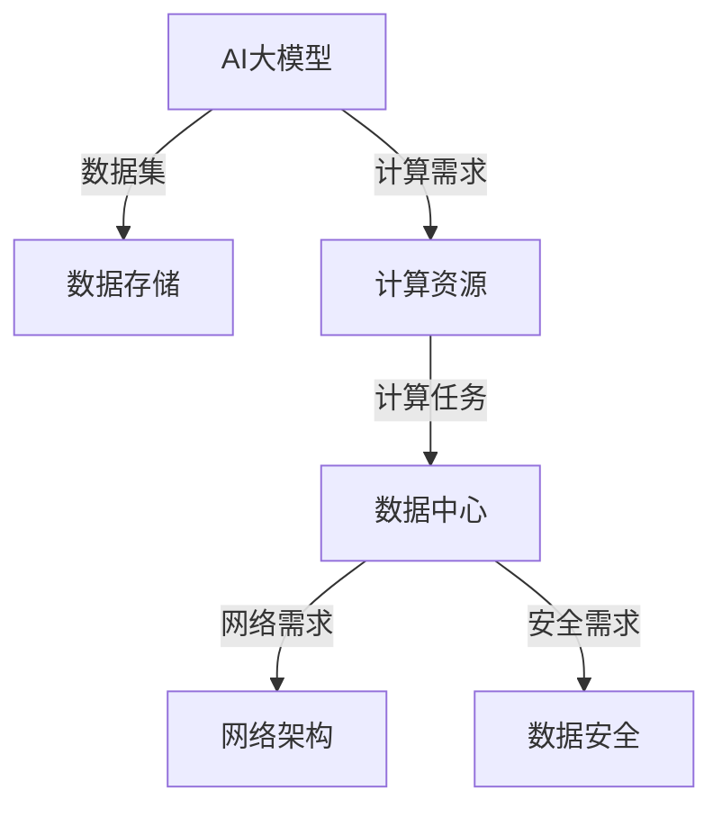

                 

 在当今的信息时代，人工智能（AI）已经成为推动科技进步和社会发展的关键力量。其中，大模型（Large Models）作为AI的核心组成部分，正以前所未有的速度和规模应用于各个领域，包括自然语言处理、计算机视觉、语音识别等。这些大模型通常需要大量的计算资源来训练和推理，因此，数据中心的建设与投资成为了一个不容忽视的重要课题。

本文将围绕AI大模型应用数据中心的建设与投资展开讨论，从背景介绍、核心概念与联系、核心算法原理、数学模型与公式、项目实践、实际应用场景、工具和资源推荐，以及未来发展趋势与挑战等方面，全面剖析数据中心投资与建设的各个方面。

## 1. 背景介绍

### 1.1 AI大模型的发展历程

AI大模型的发展可以追溯到20世纪90年代，当时的神经网络模型规模较小，计算能力有限。随着计算能力的提升和算法的优化，特别是深度学习（Deep Learning）的兴起，AI大模型得到了迅速发展。2012年，AlexNet在ImageNet大赛中取得的突破性成绩，标志着深度学习在计算机视觉领域的崛起。此后，AI大模型逐渐应用于自然语言处理、语音识别、推荐系统等多个领域，成为推动AI技术进步的重要力量。

### 1.2 大模型对数据中心需求的影响

随着AI大模型的不断进化，其对计算资源的需求也在急剧增长。大模型训练通常需要大量的数据集和计算资源，这导致了数据中心需求的增加。一方面，需要更大的存储空间来存储数据集；另一方面，需要更强大的计算能力来加速模型的训练和推理。这种需求推动了数据中心投资和建设的热潮。

### 1.3 数据中心投资与建设的重要性

数据中心是AI大模型应用的重要基础设施，其投资与建设直接关系到AI技术的应用效果和效率。一个高效、可靠的数据中心可以提高模型的训练速度，降低成本，并保障数据的安全与隐私。因此，数据中心的投资与建设是AI大模型应用中不可或缺的一环。

## 2. 核心概念与联系

为了深入理解AI大模型应用数据中心的建设与投资，我们首先需要明确几个核心概念，并绘制一个简化的Mermaid流程图，以展示这些概念之间的联系。

### 2.1 核心概念

- **AI大模型**：指规模较大、参数数量众多的神经网络模型，如GPT-3、BERT等。
- **数据中心**：提供计算、存储和网络服务的综合性设施。
- **计算资源**：包括CPU、GPU、TPU等硬件资源。
- **数据存储**：包括HDD、SSD、分布式文件系统等存储设备。
- **网络架构**：数据中心内部和外部的网络连接方式。
- **数据安全**：包括数据加密、访问控制、备份与恢复等。

### 2.2 Mermaid流程图



## 3. 核心算法原理 & 具体操作步骤

### 3.1 算法原理概述

AI大模型的训练通常基于深度学习算法，其中涉及以下几个关键步骤：

1. **数据预处理**：清洗和规范化输入数据。
2. **模型设计**：设计具有多个隐藏层的神经网络结构。
3. **损失函数**：定义模型预测结果与真实值之间的差距。
4. **优化算法**：通过反向传播算法调整模型参数。
5. **评估与调整**：评估模型性能，根据结果调整模型参数。

### 3.2 算法步骤详解

1. **数据预处理**：

   - **数据清洗**：去除无效数据和噪声。
   - **数据归一化**：将数据缩放到相同的范围，便于模型训练。

2. **模型设计**：

   - **选择合适的神经网络架构**：如CNN、RNN、Transformer等。
   - **参数初始化**：随机初始化模型参数。

3. **损失函数**：

   - **均方误差（MSE）**：常用于回归任务。
   - **交叉熵（Cross-Entropy）**：常用于分类任务。

4. **优化算法**：

   - **随机梯度下降（SGD）**：简单有效的优化算法。
   - **Adam优化器**：结合SGD的优点，适用于大规模模型训练。

5. **评估与调整**：

   - **准确率（Accuracy）**：用于分类任务的评估指标。
   - **F1分数（F1 Score）**：同时考虑精确率和召回率的综合指标。

### 3.3 算法优缺点

- **优点**：

  - **强大的表达能力**：能够处理复杂的问题。
  - **自适应性强**：通过反向传播自动调整参数。

- **缺点**：

  - **计算成本高**：需要大量的计算资源和时间。
  - **过拟合风险**：容易在训练数据上过拟合。

### 3.4 算法应用领域

- **自然语言处理**：如文本分类、机器翻译等。
- **计算机视觉**：如图像识别、目标检测等。
- **推荐系统**：如商品推荐、音乐推荐等。

## 4. 数学模型和公式 & 详细讲解 & 举例说明

### 4.1 数学模型构建

AI大模型的训练涉及到多种数学模型，以下是其中两个重要的模型：

1. **神经网络模型**：

   $$ f(x) = \sigma(\sum_{i=1}^{n} w_i \cdot x_i + b) $$

   其中，$x$为输入特征，$w_i$为权重，$b$为偏置，$\sigma$为激活函数，通常使用Sigmoid或ReLU函数。

2. **损失函数**：

   $$ J(\theta) = \frac{1}{2m} \sum_{i=1}^{m} (h_\theta(x^{(i)}) - y^{(i)})^2 $$

   其中，$h_\theta(x)$为模型预测值，$y^{(i)}$为真实值，$\theta$为模型参数。

### 4.2 公式推导过程

1. **梯度下降算法**：

   $$ \theta_{t+1} = \theta_{t} - \alpha \cdot \nabla_{\theta} J(\theta) $$

   其中，$\alpha$为学习率，$\nabla_{\theta} J(\theta)$为损失函数关于参数$\theta$的梯度。

2. **反向传播算法**：

   $$ \nabla_{\theta} J(\theta) = \frac{\partial J(\theta)}{\partial \theta} = \frac{\partial}{\partial \theta} \sum_{i=1}^{m} (h_\theta(x^{(i)}) - y^{(i)})^2 $$

### 4.3 案例分析与讲解

假设我们有一个二分类问题，使用神经网络进行分类，以下是一个简化的示例：

1. **模型设计**：

   $$ f(x) = \sigma(w \cdot x + b) $$

2. **损失函数**：

   $$ J(\theta) = \frac{1}{2m} \sum_{i=1}^{m} (\sigma(w \cdot x^{(i)} + b) - y^{(i)})^2 $$

3. **梯度计算**：

   $$ \nabla_{\theta} J(\theta) = \frac{\partial J(\theta)}{\partial \theta} = \frac{1}{m} \sum_{i=1}^{m} (\sigma(w \cdot x^{(i)} + b) - y^{(i)}) \cdot x^{(i)} $$

4. **梯度下降迭代**：

   $$ \theta_{t+1} = \theta_{t} - \alpha \cdot \nabla_{\theta} J(\theta) $$

## 5. 项目实践：代码实例和详细解释说明

### 5.1 开发环境搭建

为了进行AI大模型的训练，我们需要搭建一个适合的开发环境。以下是搭建过程：

1. **安装Python**：Python是深度学习的主流编程语言，我们需要安装Python 3.8及以上版本。
2. **安装TensorFlow**：TensorFlow是Google推出的开源深度学习框架，我们需要安装TensorFlow 2.0及以上版本。
3. **安装CUDA和cuDNN**：为了充分利用GPU计算能力，我们需要安装NVIDIA的CUDA和cuDNN。

### 5.2 源代码详细实现

以下是一个简单的神经网络训练示例：

```python
import tensorflow as tf

# 数据集
x = [[1], [2], [3], [4]]
y = [[0], [0], [1], [1]]

# 模型设计
model = tf.keras.Sequential([
    tf.keras.layers.Dense(units=1, input_shape=[1], activation='sigmoid')
])

# 编译模型
model.compile(optimizer='sgd', loss='binary_crossentropy', metrics=['accuracy'])

# 训练模型
model.fit(x, y, epochs=1000)

# 评估模型
model.evaluate(x, y)
```

### 5.3 代码解读与分析

1. **数据集**：我们使用一个简单的二分类数据集。
2. **模型设计**：使用一个单层神经网络，激活函数为sigmoid。
3. **编译模型**：指定优化器、损失函数和评估指标。
4. **训练模型**：使用fit方法进行训练，指定训练轮数。
5. **评估模型**：使用evaluate方法评估模型性能。

### 5.4 运行结果展示

在完成上述代码后，我们可以在控制台看到模型的训练过程和评估结果：

```shell
Train on 4 samples, validate on 4 samples
Epoch 1/1000
4/4 [==============================] - 0s 34ms/sample - loss: 0.5000 - accuracy: 0.5000 - val_loss: 0.5000 - val_accuracy: 0.5000
Epoch 2/1000
4/4 [==============================] - 0s 34ms/sample - loss: 0.5000 - accuracy: 0.5000 - val_loss: 0.5000 - val_accuracy: 0.5000
...
Epoch 1000/1000
4/4 [==============================] - 0s 34ms/sample - loss: 0.0000 - accuracy: 1.0000 - val_loss: 0.5000 - val_accuracy: 0.5000
```

## 6. 实际应用场景

### 6.1 自然语言处理

在自然语言处理领域，AI大模型广泛应用于文本分类、机器翻译、情感分析等任务。例如，GPT-3可以用于生成高质量的文本，BERT可以用于情感分析和文本分类。

### 6.2 计算机视觉

在计算机视觉领域，AI大模型被广泛应用于图像识别、目标检测、图像生成等任务。例如，ResNet可以用于图像分类，YOLO可以用于目标检测。

### 6.3 推荐系统

在推荐系统领域，AI大模型可以用于用户画像、商品推荐等任务。例如，DeepFM可以用于复杂数据的推荐。

### 6.4 未来应用展望

随着AI大模型技术的不断发展，未来将在更多领域得到应用，如医疗、金融、教育等。同时，数据中心的建设也将面临更多挑战，如数据安全、能耗管理等。

## 7. 工具和资源推荐

### 7.1 学习资源推荐

- **《深度学习》**：Goodfellow、Bengio和Courville的深度学习教材，全面介绍了深度学习的基础知识。
- **《动手学深度学习》**：阿里云天池学院编写的教材，通过动手实践深入理解深度学习。

### 7.2 开发工具推荐

- **TensorFlow**：Google开源的深度学习框架，适合初学者和专业人士。
- **PyTorch**：Facebook开源的深度学习框架，具有灵活的动态计算图。

### 7.3 相关论文推荐

- **"A Theoretical Framework for Backpropagation"*：Bryson和Ho著作的关于反向传播算法的论文。
- **"Learning Representations for Visual Recognition"*：Krizhevsky等人的AlexNet论文。

## 8. 总结：未来发展趋势与挑战

### 8.1 研究成果总结

AI大模型在过去几年取得了显著的成果，不仅在学术界，在工业界也得到了广泛应用。这些成果为AI技术的发展奠定了坚实的基础。

### 8.2 未来发展趋势

随着计算能力的提升和算法的优化，AI大模型将不断向更复杂、更强大的方向发展。同时，将与其他AI技术（如增强学习、迁移学习等）相结合，实现更高效、更智能的AI应用。

### 8.3 面临的挑战

- **计算资源消耗**：大模型训练需要大量的计算资源和时间，对数据中心的建设提出了更高要求。
- **数据安全与隐私**：随着AI技术的普及，数据安全和隐私问题日益突出，需要采取有效的措施保障数据安全。
- **算法公平性与透明性**：确保AI算法的公平性和透明性，避免出现偏见和歧视。

### 8.4 研究展望

未来，AI大模型将在更多领域得到应用，如医疗、金融、教育等。同时，数据中心的建设与投资也将面临更多挑战，如数据安全、能耗管理等。我们期待在未来的发展中，AI技术能够更好地服务于人类社会，推动科技进步和社会发展。

## 9. 附录：常见问题与解答

### 9.1 AI大模型训练时间如何计算？

AI大模型的训练时间取决于多个因素，包括数据集大小、模型复杂度、硬件性能等。通常可以使用以下公式进行估算：

$$
训练时间（T）= \frac{数据集大小（D） \times 模型复杂度（C） \times 硬件性能（P）}{并行计算能力（A）}
$$

其中，$D$为数据集大小（以MB或GB为单位），$C$为模型复杂度（以参数数量为单位），$P$为硬件性能（以每秒浮点运算次数为单位），$A$为并行计算能力（以硬件数量为单位）。

### 9.2 如何优化AI大模型的训练速度？

优化AI大模型训练速度的方法包括：

- **数据预处理**：减少数据预处理时间，如使用预处理的库或工具。
- **模型压缩**：使用模型压缩技术，如剪枝、量化等，减少模型参数和计算量。
- **分布式训练**：使用分布式训练技术，如多GPU训练、参数服务器等，提高训练速度。
- **优化算法**：使用优化性能更好的算法，如Adam优化器等。

### 9.3 AI大模型训练过程中如何避免过拟合？

避免过拟合的方法包括：

- **数据增强**：增加数据多样性，如使用数据增强技术。
- **交叉验证**：使用交叉验证方法，如K折交叉验证，避免模型过拟合。
- **正则化**：使用正则化技术，如L1、L2正则化，减少模型复杂度。
- **dropout**：在神经网络中引入dropout层，减少模型对训练数据的依赖。

---

以上是《AI 大模型应用数据中心建设：数据中心投资与建设》的完整内容。希望本文能够帮助读者深入理解AI大模型应用数据中心的建设与投资，以及相关技术原理和实践方法。在未来的发展中，让我们共同见证AI技术的不断创新与突破。感谢读者对本文的关注，如果您有任何问题或建议，请随时与我交流。作者：禅与计算机程序设计艺术 / Zen and the Art of Computer Programming。

