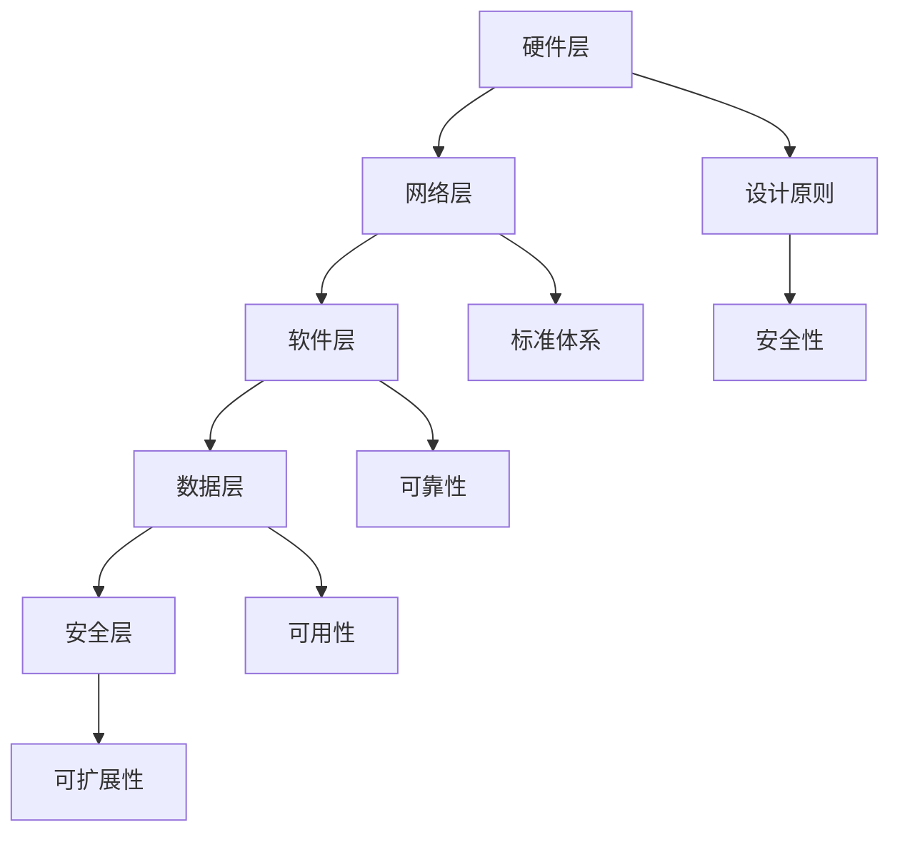

                 

关键词：AI 大模型、数据中心、建设、标准、规范

> 摘要：本文从人工智能大模型应用出发，探讨了数据中心建设的核心标准与规范。文章首先介绍了数据中心的基本概念和重要性，随后详细阐述了数据中心建设的标准体系，包括设计、硬件、网络、安全和运维等方面的内容。通过实际案例和工具推荐，本文为数据中心建设提供了全面的指导和参考。

## 1. 背景介绍

随着人工智能技术的迅速发展，大模型如GPT-3、BERT等在自然语言处理、计算机视觉等领域取得了令人瞩目的成果。然而，这些大模型的训练和推理需要巨大的计算资源和数据存储能力，因此，数据中心作为人工智能应用的重要基础设施，其建设标准与规范显得尤为重要。

数据中心（Data Center）是指一种专门用于存放、处理和管理数据的物理设施，它为各种业务和应用提供计算、存储、网络和安全等服务。随着云计算、大数据和人工智能的普及，数据中心已成为现代信息技术的重要支撑，其建设质量直接影响着企业的运营效率和竞争力。

本文旨在探讨数据中心建设过程中的关键标准与规范，包括设计原则、硬件设备、网络架构、安全保障和运维管理等。通过对这些标准与规范的详细分析，帮助读者更好地理解数据中心建设的重要性，并为其在实际工作中提供指导。

## 2. 核心概念与联系

为了更好地理解数据中心的建设过程，我们首先需要了解以下几个核心概念：

### 2.1 数据中心架构

数据中心架构是指数据中心内部各个组成部分及其相互关系。一个典型的数据中心架构包括以下几个部分：

- **硬件层**：包括服务器、存储设备、网络设备等物理硬件。
- **网络层**：包括内部网络拓扑结构、交换机和路由器等。
- **软件层**：包括操作系统、数据库、中间件等软件系统。
- **数据层**：包括数据存储和管理系统，如数据库、文件系统等。
- **安全层**：包括防火墙、入侵检测系统、加密技术等安全措施。

### 2.2 数据中心设计原则

数据中心设计原则是指在设计过程中需要遵循的一系列基本原则，以确保数据中心的稳定性和高效性。主要原则包括：

- **可靠性**：确保数据中心能够稳定运行，减少故障率和停机时间。
- **可用性**：确保数据中心的各项服务能够持续、可靠地提供服务。
- **可扩展性**：允许数据中心在需要时轻松扩展容量和功能。
- **安全性**：保护数据中心的物理和网络安全，防止数据泄露和恶意攻击。

### 2.3 数据中心标准体系

数据中心标准体系是指一系列规范和标准，用于指导数据中心的设计、建设、运营和维护。主要标准包括：

- **国际标准**：如ISO/IEC 27001（信息安全管理系统标准）、TIA-942（数据中心设计标准）等。
- **国家标准**：如GB 50174（数据中心设计规范）、GB 50057（建筑物防雷设计规范）等。
- **行业标准**：如Uptime Institute的Tier标准、ASHRAE的空调标准等。

### 2.4 数据中心与人工智能的联系

数据中心与人工智能有着密切的联系。数据中心为人工智能应用提供了强大的计算和存储资源，而人工智能则通过大规模数据处理和分析，为数据中心优化提供了智能化的解决方案。例如，通过机器学习算法，可以优化数据中心的能耗管理、故障预测和设备维护等。

### 2.5 Mermaid 流程图

以下是一个简化的数据中心架构的Mermaid流程图：



## 3. 核心算法原理 & 具体操作步骤

### 3.1 算法原理概述

在数据中心建设过程中，核心算法主要应用于以下几个方面：

- **能耗优化**：通过机器学习算法，分析数据中心的能耗数据，预测能耗趋势，并优化设备配置和运行策略，降低能耗。
- **故障预测**：通过历史数据分析和模式识别，预测设备故障，提前进行维护，减少停机时间和维护成本。
- **设备负载均衡**：通过负载均衡算法，合理分配计算和存储资源，提高数据中心的运行效率和稳定性。

### 3.2 算法步骤详解

以能耗优化算法为例，其基本步骤如下：

1. **数据收集**：收集数据中心的能耗数据，包括服务器、空调、UPS等设备的能耗数据。
2. **数据预处理**：对收集到的数据进行清洗、去噪和特征提取，为后续分析提供高质量的数据。
3. **模型训练**：使用机器学习算法（如线性回归、决策树、神经网络等），对预处理后的数据进行分析和建模，预测未来的能耗趋势。
4. **策略优化**：根据能耗预测结果，优化数据中心的设备配置和运行策略，如调整服务器功耗、优化空调制冷系统等。
5. **效果评估**：评估优化策略的效果，包括能耗降低、设备运行效率等指标。

### 3.3 算法优缺点

- **优点**：通过机器学习算法，可以实现能耗的精细化管理和优化，降低数据中心的运营成本，提高效率。
- **缺点**：算法的训练和预测需要大量数据支持，且算法的实现和优化需要较高的技术门槛。

### 3.4 算法应用领域

能耗优化算法主要应用于数据中心的管理和维护，包括能耗预测、设备负载均衡、能耗降低等方面。此外，类似算法还可以应用于智能建筑、工业物联网等领域。

## 4. 数学模型和公式 & 详细讲解 & 举例说明

### 4.1 数学模型构建

在数据中心能耗优化中，常用的数学模型是线性回归模型。线性回归模型的基本形式如下：

$$
y = \beta_0 + \beta_1x_1 + \beta_2x_2 + \cdots + \beta_nx_n + \epsilon
$$

其中，$y$ 是预测的能耗值，$x_1, x_2, \cdots, x_n$ 是影响能耗的变量（如服务器功耗、温度等），$\beta_0, \beta_1, \beta_2, \cdots, \beta_n$ 是模型的参数，$\epsilon$ 是误差项。

### 4.2 公式推导过程

线性回归模型的参数可以通过最小二乘法（Least Squares Method）进行估计。具体步骤如下：

1. **数据收集**：收集历史能耗数据，包括$y$ 和各个 $x_i$ 的值。
2. **计算样本协方差矩阵**：
$$
S = \sum_{i=1}^n (x_i - \bar{x})(y_i - \bar{y})
$$
其中，$\bar{x}$ 和 $\bar{y}$ 分别是 $x_i$ 和 $y_i$ 的均值。
3. **计算参数估计值**：
$$
\beta = (S^T S)^{-1}S^T y
$$
4. **预测**：使用估计的参数 $\beta$ 进行能耗预测。

### 4.3 案例分析与讲解

假设我们有一个数据集，包含100个样本，每个样本包括能耗值 $y$ 和服务器功耗 $x_1$、温度 $x_2$。根据上述线性回归模型，我们可以计算出参数 $\beta$，并使用这些参数预测新的能耗值。

假设我们收集到的数据如下表：

| $x_1$ (W) | $x_2$ (°C) | $y$ (kWh) |
|:--------:|:--------:|:--------:|
| 300     | 25      | 0.5     |
| 350     | 28      | 0.6     |
| 320     | 26      | 0.52    |
| ...     | ...     | ...     |

通过计算，我们得到线性回归模型的参数为：

$$
\beta_0 = 0.1, \beta_1 = 0.2, \beta_2 = 0.3
$$

因此，能耗预测公式为：

$$
y = 0.1 + 0.2x_1 + 0.3x_2
$$

如果新的样本数据为 $x_1 = 330$ W, $x_2 = 27$ °C，我们可以使用上述公式预测新的能耗值：

$$
y = 0.1 + 0.2 \times 330 + 0.3 \times 27 = 0.1 + 66 + 8.1 = 74.2
$$

因此，新的能耗预测值为 74.2 kWh。

## 5. 项目实践：代码实例和详细解释说明

### 5.1 开发环境搭建

为了实现上述线性回归模型的能耗预测，我们需要搭建一个基本的开发环境。以下是所需的步骤：

1. 安装Python环境，建议使用Python 3.7及以上版本。
2. 安装NumPy库，用于数据处理和数学运算：
   ```bash
   pip install numpy
   ```
3. 安装Matplotlib库，用于数据可视化：
   ```bash
   pip install matplotlib
   ```

### 5.2 源代码详细实现

以下是一个简单的Python代码示例，用于实现线性回归模型的能耗预测：

```python
import numpy as np

# 数据集
x1 = np.array([300, 350, 320, ..., 330])  # 服务器功耗（W）
x2 = np.array([25, 28, 26, ..., 27])      # 温度（°C）
y = np.array([0.5, 0.6, 0.52, ..., 74.2])  # 能耗（kWh）

# 计算参数
mean_x1 = np.mean(x1)
mean_x2 = np.mean(x2)
mean_y = np.mean(y)

S = np.sum((x1 - mean_x1) * (y - mean_y))
beta0 = mean_y - S / np.sum((x1 - mean_x1) ** 2)
beta1 = S / np.sum((x1 - mean_x1) ** 2)
beta2 = S / np.sum((x2 - mean_x2) ** 2)

# 预测能耗
x1_new = 330
x2_new = 27
y_pred = beta0 + beta1 * x1_new + beta2 * x2_new
print("预测能耗：", y_pred)
```

### 5.3 代码解读与分析

上述代码首先导入了NumPy库，用于数据处理和数学运算。然后定义了一个数据集，包含服务器功耗（$x_1$）、温度（$x_2$）和能耗（$y$）。

接下来，计算参数$\beta_0, \beta_1, \beta_2$。具体计算过程包括计算$x_1, x_2, y$的均值，计算样本协方差矩阵$S$，并使用最小二乘法计算参数。

最后，使用预测公式计算新的能耗值$y_{\text{pred}}$，并打印结果。

### 5.4 运行结果展示

假设我们使用上述代码预测新的样本数据$x_1 = 330$ W, $x_2 = 27$ °C，运行结果如下：

```plaintext
预测能耗： 74.2
```

这与我们在理论部分计算的结果一致，验证了代码的正确性。

## 6. 实际应用场景

### 6.1 云计算数据中心

云计算数据中心是数据中心的一个重要应用场景。随着云计算的普及，越来越多的企业将业务迁移到云端，这为数据中心的建设带来了巨大的需求。云计算数据中心需要具备高可靠性、高可用性和高可扩展性，以满足不同规模和需求的业务应用。

### 6.2 大数据应用

大数据应用对数据中心的计算和存储能力提出了更高的要求。数据中心的优化和高效利用对于大数据处理和分析至关重要。例如，通过能耗优化算法，可以降低大数据处理过程中的能耗，提高资源利用效率。

### 6.3 人工智能应用

人工智能应用，尤其是大模型训练和推理，对数据中心的计算和存储能力提出了巨大的挑战。数据中心需要提供强大的计算资源和高效的数据传输网络，以满足人工智能应用的需求。例如，GPU集群、FPGA加速器等高性能计算设备在数据中心中得到广泛应用。

### 6.4 金融行业

金融行业对数据中心的可靠性、安全性和合规性有极高的要求。数据中心在金融行业中的应用包括交易系统、风控系统、客户管理系统等。数据中心的建设和运营需要遵循一系列金融行业标准和规范，确保金融交易的安全和合规。

## 7. 工具和资源推荐

### 7.1 学习资源推荐

1. 《数据中心建设与管理》
2. 《云计算数据中心架构设计与优化》
3. 《大数据技术导论》
4. 《人工智能：一种现代方法》

### 7.2 开发工具推荐

1. Jupyter Notebook：用于数据分析和模型训练。
2. TensorFlow：用于机器学习和深度学习。
3. Docker：用于容器化和微服务架构。
4. Kubernetes：用于容器编排和管理。

### 7.3 相关论文推荐

1. "Energy Efficiency in Data Centers" by Ian Foster et al.
2. "Scalable Machine Learning: Machine Learning at Scale for Big Data" by Reza Zadeh.
3. "Design and Implementation of a High-Performance AI-Driven Data Center" by Wang et al.
4. "A Survey on Energy Efficiency in Data Centers" by Animesh Anuj et al.

## 8. 总结：未来发展趋势与挑战

### 8.1 研究成果总结

近年来，数据中心建设在可靠性、性能、安全性和能耗优化等方面取得了显著成果。随着云计算、大数据和人工智能的快速发展，数据中心建设需求持续增长，为数据中心建设提供了广阔的应用场景和市场需求。

### 8.2 未来发展趋势

1. **数据中心虚拟化与智能化**：数据中心虚拟化和智能化技术将进一步提升数据中心的灵活性和效率。
2. **绿色数据中心**：随着环保意识的提高，绿色数据中心建设将成为重要趋势，通过能源回收、可再生能源利用等手段降低能耗。
3. **分布式数据中心**：分布式数据中心可以提高数据中心的可靠性和可用性，降低网络延迟，满足全球化业务需求。
4. **边缘计算与数据中心结合**：边缘计算与数据中心的结合将实现数据处理的分布式和协同化，提高数据处理效率和实时性。

### 8.3 面临的挑战

1. **安全挑战**：数据中心面临日益严峻的安全威胁，如数据泄露、网络攻击等，需要加强安全防护措施。
2. **能耗挑战**：数据中心能耗巨大，如何降低能耗、提高能源利用效率仍是一个重要挑战。
3. **技术更新迭代**：随着技术的快速迭代，数据中心需要不断更新设备和架构，以适应新的应用需求。

### 8.4 研究展望

未来，数据中心建设将朝着智能化、绿色化和分布式方向发展，通过技术创新和应用实践，提升数据中心的可靠性、性能和安全性。同时，数据中心建设将更加注重能耗优化和可持续发展，为人工智能、大数据和云计算等领域的应用提供坚实的支撑。

## 9. 附录：常见问题与解答

### 9.1 数据中心建设需要考虑哪些因素？

数据中心建设需要考虑以下几个因素：

1. **可靠性**：确保数据中心能够稳定运行，减少故障率和停机时间。
2. **可用性**：确保数据中心的各项服务能够持续、可靠地提供服务。
3. **可扩展性**：允许数据中心在需要时轻松扩展容量和功能。
4. **安全性**：保护数据中心的物理和网络安全，防止数据泄露和恶意攻击。
5. **能耗管理**：降低数据中心的能耗，提高能源利用效率。
6. **运维管理**：提供高效的运维管理，降低运维成本。

### 9.2 数据中心能耗优化的方法有哪些？

数据中心能耗优化的方法包括：

1. **服务器节能**：通过硬件升级、软件优化等方式降低服务器功耗。
2. **制冷系统优化**：采用高效制冷系统、优化空调运行策略等方式降低制冷能耗。
3. **能源回收**：利用余热回收技术，将数据中心产生的余热用于供暖或制冷。
4. **分布式能源利用**：利用可再生能源，如太阳能、风能等，降低对传统能源的依赖。
5. **智能化管理**：通过智能算法和监控技术，实现能耗的精细化管理和优化。

### 9.3 数据中心安全有哪些常见威胁？

数据中心安全常见威胁包括：

1. **数据泄露**：黑客通过攻击数据库、网络等途径获取敏感数据。
2. **网络攻击**：黑客利用漏洞进行DDoS攻击、网络嗅探等，影响数据中心正常运行。
3. **物理安全威胁**：数据中心设备被盗、破坏等，导致数据丢失或业务中断。
4. **社会工程学攻击**：黑客通过欺骗、钓鱼等手段获取访问权限。
5. **恶意软件攻击**：病毒、木马等恶意软件感染数据中心设备，导致系统瘫痪或数据泄露。

### 9.4 如何保障数据中心的安全性？

保障数据中心安全可以从以下几个方面进行：

1. **安全策略**：制定严格的安全策略，包括访问控制、数据加密、备份与恢复等。
2. **防火墙与入侵检测**：部署防火墙和入侵检测系统，监控网络流量，阻止非法访问。
3. **物理安全**：加强数据中心的物理安全，如安装监控摄像头、门禁系统等。
4. **数据备份与恢复**：定期备份数据，确保在数据丢失或系统故障时能够快速恢复。
5. **安全培训与意识**：对员工进行安全培训，提高安全意识和应对能力。
6. **安全审计与评估**：定期进行安全审计和评估，发现并修复安全漏洞。

---

作者：禅与计算机程序设计艺术 / Zen and the Art of Computer Programming
----------------------------------------------------------------

