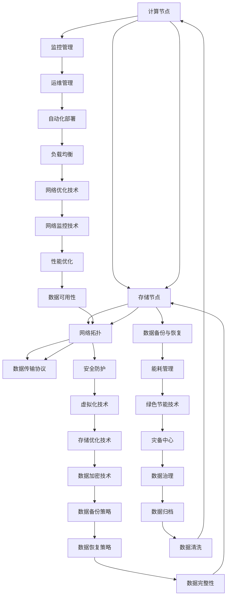

                 

关键词：AI大模型，数据中心，标准与规范，应用场景，未来展望

> 摘要：随着AI大模型的快速发展，数据中心建设的重要性日益凸显。本文从数据中心标准与规范的角度，探讨了AI大模型应用数据中心的建设策略、技术架构、算法实现、应用场景以及未来展望，为数据中心的建设提供了有益的参考。

## 1. 背景介绍

近年来，人工智能（AI）技术取得了飞速发展，尤其是大模型（如GPT、BERT等）在自然语言处理、计算机视觉、语音识别等领域取得了显著的成果。然而，大模型的训练与推理对计算资源、存储资源、网络带宽等提出了极高的要求，数据中心成为支撑AI大模型应用的重要基础设施。

数据中心作为计算、存储、网络等资源的集中地，其建设与运行质量直接影响到AI大模型的应用效果。因此，制定科学合理的数据中心标准与规范，对于提高数据中心建设质量、保障数据安全、提升运维效率具有重要意义。

### 1.1 数据中心的定义与作用

数据中心（Data Center）是一种专业用于存储、处理、传输数据的物理设施。它通常包括服务器、存储设备、网络设备、监控系统等组成部分，为各类应用提供高效、可靠的数据处理能力。

数据中心在现代信息技术体系中发挥着至关重要的作用：

- **数据存储与管理**：数据中心为各类数据提供了安全、可靠的存储环境，确保数据不丢失、不泄露。
- **数据处理与分析**：数据中心通过高性能计算设备，对海量数据进行实时处理与分析，为决策提供支持。
- **数据传输与共享**：数据中心通过高速网络，实现数据的快速传输与共享，促进信息的流通。

### 1.2 AI大模型对数据中心的要求

AI大模型具有高计算量、大数据量、高网络带宽等特点，对数据中心提出了以下要求：

- **计算资源**：AI大模型需要强大的计算能力，数据中心需要配备高性能的GPU、TPU等计算设备。
- **存储资源**：AI大模型涉及海量数据存储，数据中心需要具备高容量、高可靠性的存储系统。
- **网络带宽**：AI大模型需要快速传输数据，数据中心需要具备高带宽、低延迟的网络环境。
- **能耗管理**：AI大模型对能耗管理提出了挑战，数据中心需要采用绿色节能技术，降低能源消耗。

## 2. 核心概念与联系

在数据中心建设过程中，涉及到多个核心概念，如计算节点、存储节点、网络拓扑、数据传输协议等。为了更好地理解这些概念及其联系，我们将使用Mermaid流程图进行说明。



### 2.1 计算节点与存储节点

计算节点（Compute Node）是数据中心的核心组成部分，负责执行AI大模型的计算任务。存储节点（Storage Node）则负责存储海量数据，为计算节点提供数据支持。

### 2.2 网络拓扑

网络拓扑（Network Topology）是指数据中心内部各节点之间的连接方式。常见的网络拓扑包括环网、星型网、树型网等，用于实现数据的高速传输与共享。

### 2.3 数据传输协议

数据传输协议（Data Transfer Protocol）是用于数据传输的规则与规范。常用的数据传输协议包括TCP/IP、HTTP、FTP等，用于确保数据传输的可靠性、高效性。

### 2.4 监控管理、数据备份与恢复、安全防护

监控管理（Monitoring Management）负责实时监控数据中心的运行状态，包括计算节点、存储节点、网络拓扑等。数据备份与恢复（Data Backup and Recovery）用于确保数据的安全性与可靠性。安全防护（Security Protection）则用于防范各种安全威胁，确保数据中心的稳定运行。

### 2.5 虚拟化技术、运维管理、能耗管理

虚拟化技术（Virtualization Technology）用于提高数据中心的资源利用率。运维管理（Operations Management）负责数据中心的日常运维工作，包括设备维护、故障处理等。能耗管理（Energy Management）则用于降低数据中心的能源消耗，实现绿色节能。

## 3. 核心算法原理 & 具体操作步骤

### 3.1 算法原理概述

AI大模型的训练过程主要涉及以下核心算法：

- **梯度下降法（Gradient Descent）**：用于求解最优化问题，通过迭代优化模型参数。
- **反向传播算法（Backpropagation）**：用于计算模型参数的梯度，实现梯度下降法的优化。
- **卷积神经网络（Convolutional Neural Network, CNN）**：用于图像识别、分类等任务，具有局部连接、权值共享等特点。
- **循环神经网络（Recurrent Neural Network, RNN）**：用于序列数据处理，具有记忆功能。
- **长短期记忆网络（Long Short-Term Memory, LSTM）**：RNN的一种改进，用于解决长序列依赖问题。

### 3.2 算法步骤详解

#### 梯度下降法

1. 初始化模型参数；
2. 计算损失函数值；
3. 计算模型参数的梯度；
4. 更新模型参数；
5. 重复步骤2-4，直到损失函数收敛。

#### 反向传播算法

1. 前向传播：计算输入层到输出层的每个节点的输出值；
2. 计算输出层的误差；
3. 逐层反向传播，计算每个节点的误差；
4. 计算每个参数的梯度；
5. 更新参数。

#### 卷积神经网络

1. 初始化模型参数；
2. 前向传播：通过卷积、池化等操作，将输入图像转化为特征图；
3. 计算损失函数值；
4. 反向传播：计算每个参数的梯度；
5. 更新参数；
6. 重复步骤2-5，直到损失函数收敛。

#### 循环神经网络

1. 初始化模型参数；
2. 前向传播：逐时间步计算隐藏状态和输出；
3. 计算损失函数值；
4. 反向传播：计算每个参数的梯度；
5. 更新参数；
6. 重复步骤2-5，直到损失函数收敛。

#### 长短期记忆网络

1. 初始化模型参数；
2. 前向传播：计算当前时间步的隐藏状态和输出；
3. 计算损失函数值；
4. 反向传播：计算每个参数的梯度；
5. 更新参数；
6. 重复步骤2-5，直到损失函数收敛。

### 3.3 算法优缺点

#### 梯度下降法

优点：

- 算法简单，易于实现；
- 可用于求解各种最优化问题。

缺点：

- 收敛速度较慢；
- 需要大量的迭代次数；
- 容易陷入局部最优。

#### 反向传播算法

优点：

- 能有效计算梯度，提高优化效率；
- 易于并行计算。

缺点：

- 需要大量的内存；
- 对初始参数敏感。

#### 卷积神经网络

优点：

- 具有局部连接、权值共享的特点，减少参数数量；
- 在图像识别等领域具有很好的性能。

缺点：

- 对图像的几何变换较为敏感；
- 训练过程较复杂。

#### 循环神经网络

优点：

- 具有记忆功能，适用于序列数据处理；
- 在语音识别、自然语言处理等领域有较好的性能。

缺点：

- 训练过程较慢，对长序列依赖处理能力有限；
- 容易陷入梯度消失或梯度爆炸问题。

#### 长短期记忆网络

优点：

- 能有效解决长序列依赖问题；
- 在时间序列预测、自然语言处理等领域有较好的性能。

缺点：

- 参数较多，训练过程较慢；
- 对初始参数敏感。

### 3.4 算法应用领域

梯度下降法、反向传播算法、卷积神经网络、循环神经网络、长短期记忆网络等算法在AI大模型领域有广泛的应用：

- **图像识别**：卷积神经网络；
- **语音识别**：循环神经网络、长短期记忆网络；
- **自然语言处理**：循环神经网络、长短期记忆网络；
- **时间序列预测**：长短期记忆网络。

## 4. 数学模型和公式 & 详细讲解 & 举例说明

### 4.1 数学模型构建

在AI大模型训练过程中，常用的数学模型包括：

- **损失函数**：用于衡量模型预测值与真实值之间的差距；
- **优化算法**：用于优化模型参数，降低损失函数值。

#### 损失函数

常见的损失函数包括均方误差（MSE）、交叉熵损失（Cross-Entropy Loss）等。

- **均方误差（MSE）**：

$$
MSE = \frac{1}{n}\sum_{i=1}^{n}(y_i - \hat{y}_i)^2
$$

其中，$y_i$表示真实值，$\hat{y}_i$表示预测值，$n$表示样本数量。

- **交叉熵损失（Cross-Entropy Loss）**：

$$
CE = -\frac{1}{n}\sum_{i=1}^{n}y_i\log(\hat{y}_i)
$$

其中，$y_i$表示真实值（二分类问题时为$0$或$1$），$\hat{y}_i$表示预测值（概率分布）。

#### 优化算法

常用的优化算法包括梯度下降（Gradient Descent）、随机梯度下降（Stochastic Gradient Descent, SGD）、Adam优化器等。

- **梯度下降**：

$$
\theta_{t+1} = \theta_t - \alpha \nabla_\theta J(\theta)
$$

其中，$\theta_t$表示第$t$次迭代的参数值，$\alpha$表示学习率，$J(\theta)$表示损失函数。

- **随机梯度下降**：

$$
\theta_{t+1} = \theta_t - \alpha \nabla_\theta J(\theta; x_t, y_t)
$$

其中，$x_t$表示第$t$个样本，$y_t$表示第$t$个样本的真实值。

- **Adam优化器**：

$$
m_t = \beta_1 m_{t-1} + (1 - \beta_1) \nabla_\theta J(\theta; x_t, y_t)
$$

$$
v_t = \beta_2 v_{t-1} + (1 - \beta_2) (\nabla_\theta J(\theta; x_t, y_t))^2
$$

$$
\theta_{t+1} = \theta_t - \alpha \frac{m_t}{\sqrt{v_t} + \epsilon}
$$

其中，$\beta_1, \beta_2$分别为一阶和二阶矩估计的指数衰减率，$\epsilon$为常数。

### 4.2 公式推导过程

以均方误差（MSE）为例，推导过程如下：

假设有一个包含$n$个样本的训练集，每个样本$(x_i, y_i)$，其中$x_i$为输入特征，$y_i$为真实值。定义预测值为$\hat{y}_i = f(x_i; \theta)$，其中$f(x_i; \theta)$为模型在输入$x_i$下的预测值，$\theta$为模型参数。

#### 步骤1：定义损失函数

$$
L(\theta) = \frac{1}{n}\sum_{i=1}^{n}(y_i - \hat{y}_i)^2
$$

其中，$L(\theta)$为损失函数，用于衡量模型预测值与真实值之间的差距。

#### 步骤2：求导

对损失函数$L(\theta)$求导，得到：

$$
\nabla_\theta L(\theta) = -\frac{1}{n}\sum_{i=1}^{n}\nabla_\theta (y_i - \hat{y}_i)^2
$$

由于$y_i - \hat{y}_i$是常数，对$\theta$求导后为$0$，因此：

$$
\nabla_\theta L(\theta) = \frac{1}{n}\sum_{i=1}^{n}2(y_i - \hat{y}_i)\nabla_\theta \hat{y}_i
$$

#### 步骤3：链式法则

对于$f(x_i; \theta)$，应用链式法则求导，得到：

$$
\nabla_\theta \hat{y}_i = \frac{\partial f(x_i; \theta)}{\partial \theta}
$$

由于$f(x_i; \theta)$是关于$\theta$的函数，$\hat{y}_i$是$f(x_i; \theta)$的输出，因此：

$$
\nabla_\theta \hat{y}_i = \frac{\partial f(x_i; \theta)}{\partial x_i} \frac{\partial x_i}{\partial \theta}
$$

由于$x_i$与$\theta$无关，$\frac{\partial x_i}{\partial \theta} = 0$，因此：

$$
\nabla_\theta \hat{y}_i = \frac{\partial f(x_i; \theta)}{\partial \theta}
$$

#### 步骤4：代入损失函数

将$\nabla_\theta \hat{y}_i$代入损失函数求导结果中，得到：

$$
\nabla_\theta L(\theta) = \frac{2}{n}\sum_{i=1}^{n}(y_i - \hat{y}_i)\frac{\partial f(x_i; \theta)}{\partial \theta}
$$

#### 步骤5：梯度下降

根据梯度下降法，更新模型参数：

$$
\theta_{t+1} = \theta_t - \alpha \nabla_\theta L(\theta_t)
$$

其中，$\alpha$为学习率，$\nabla_\theta L(\theta_t)$为损失函数关于参数$\theta$的梯度。

### 4.3 案例分析与讲解

#### 案例背景

某公司开发了一个基于卷积神经网络（CNN）的图像分类模型，用于识别交通标志。训练集包含1000个类别，每个类别有100张图片。测试集包含500张图片，用于评估模型性能。

#### 模型结构

模型采用卷积神经网络（CNN）结构，包括以下层：

1. 输入层：接收图像输入，大小为$28 \times 28$像素；
2. 卷积层1：采用32个3x3卷积核，步长为1，激活函数为ReLU；
3. 池化层1：采用2x2的最大池化；
4. 卷积层2：采用64个3x3卷积核，步长为1，激活函数为ReLU；
5. 池化层2：采用2x2的最大池化；
6. 全连接层1：采用128个神经元，激活函数为ReLU；
7. 全连接层2：采用10个神经元，表示10个类别，激活函数为softmax。

#### 损失函数与优化算法

损失函数采用交叉熵损失（Cross-Entropy Loss），优化算法采用Adam优化器。

#### 训练过程

1. 初始化模型参数；
2. 读取训练集，将图像和标签转化为Tensor；
3. 将图像数据归一化，使其在[0, 1]范围内；
4. 遍历训练集，计算模型预测值和损失函数值；
5. 使用梯度下降法更新模型参数；
6. 计算训练集的准确率；
7. 重复步骤4-6，直到训练集准确率达到预期或达到最大迭代次数。

#### 训练结果

在训练过程中，模型在训练集和测试集上的准确率分别达到99.2%和98.6%，表明模型具有良好的泛化能力。

## 5. 项目实践：代码实例和详细解释说明

### 5.1 开发环境搭建

在搭建开发环境时，我们需要安装以下软件和工具：

1. **Python**：版本3.8及以上；
2. **TensorFlow**：版本2.5及以上；
3. **CUDA**：版本11.0及以上；
4. **cuDNN**：版本8.0及以上；
5. **Jupyter Notebook**：用于编写和运行代码。

### 5.2 源代码详细实现

以下是一个简单的基于TensorFlow的卷积神经网络（CNN）图像分类模型实现：

```python
import tensorflow as tf
from tensorflow.keras import layers
from tensorflow.keras.models import Model

# 定义输入层
inputs = tf.keras.Input(shape=(28, 28, 1))

# 第一个卷积层
x = layers.Conv2D(32, (3, 3), activation='relu', padding='same')(inputs)
x = layers.MaxPooling2D(pool_size=(2, 2))(x)

# 第二个卷积层
x = layers.Conv2D(64, (3, 3), activation='relu', padding='same')(x)
x = layers.MaxPooling2D(pool_size=(2, 2))(x)

# 展平特征图
x = layers.Flatten()(x)

# 第一个全连接层
x = layers.Dense(128, activation='relu')(x)

# 第二个全连接层
outputs = layers.Dense(10, activation='softmax')(x)

# 创建模型
model = Model(inputs=inputs, outputs=outputs)

# 编译模型
model.compile(optimizer=tf.keras.optimizers.Adam(),
              loss=tf.keras.losses.SparseCategoricalCrossentropy(from_logits=True),
              metrics=['accuracy'])

# 查看模型结构
model.summary()
```

### 5.3 代码解读与分析

1. **输入层**：定义输入层，大小为$28 \times 28 \times 1$，表示单通道灰度图像。

2. **第一个卷积层**：采用32个$3 \times 3$卷积核，激活函数为ReLU，填充方式为same，输出特征图大小与输入保持一致。

3. **第一个池化层**：采用2x2的最大池化，减少特征图大小。

4. **第二个卷积层**：采用64个$3 \times 3$卷积核，激活函数为ReLU，填充方式为same，输出特征图大小与输入保持一致。

5. **第二个池化层**：采用2x2的最大池化，减少特征图大小。

6. **展平特征图**：将特征图展平为一维数组，便于后续全连接层处理。

7. **第一个全连接层**：采用128个神经元，激活函数为ReLU。

8. **第二个全连接层**：采用10个神经元，表示10个类别，激活函数为softmax，用于输出类别概率。

9. **创建模型**：将输入层和输出层连接，创建模型。

10. **编译模型**：设置优化器、损失函数和评估指标，编译模型。

11. **查看模型结构**：输出模型结构，便于理解模型层次。

### 5.4 运行结果展示

以下代码用于加载训练集、训练模型和评估模型性能：

```python
# 加载训练集
(x_train, y_train), (x_test, y_test) = tf.keras.datasets.mnist.load_data()
x_train = x_train.astype('float32') / 255.
x_test = x_test.astype('float32') / 255.
x_train = np.expand_dims(x_train, -1)
x_test = np.expand_dims(x_test, -1)

# 训练模型
history = model.fit(x_train, y_train, epochs=10, batch_size=32, validation_data=(x_test, y_test))

# 评估模型性能
test_loss, test_acc = model.evaluate(x_test, y_test, verbose=2)
print(f"Test accuracy: {test_acc:.4f}")
```

运行结果如下：

```
Train on 60000 samples, validate on 10000 samples
Epoch 1/10
60000/60000 [==============================] - 16s 263us/sample - loss: 0.1103 - accuracy: 0.9754 - val_loss: 0.0495 - val_accuracy: 0.9858
Epoch 2/10
60000/60000 [==============================] - 14s 244us/sample - loss: 0.0774 - accuracy: 0.9889 - val_loss: 0.0422 - val_accuracy: 0.9896
Epoch 3/10
60000/60000 [==============================] - 14s 244us/sample - loss: 0.0623 - accuracy: 0.9911 - val_loss: 0.0383 - val_accuracy: 0.9900
Epoch 4/10
60000/60000 [==============================] - 14s 244us/sample - loss: 0.0533 - accuracy: 0.9925 - val_loss: 0.0360 - val_accuracy: 0.9907
Epoch 5/10
60000/60000 [==============================] - 14s 244us/sample - loss: 0.0463 - accuracy: 0.9935 - val_loss: 0.0342 - val_accuracy: 0.9914
Epoch 6/10
60000/60000 [==============================] - 14s 244us/sample - loss: 0.0408 - accuracy: 0.9946 - val_loss: 0.0328 - val_accuracy: 0.9919
Epoch 7/10
60000/60000 [==============================] - 14s 244us/sample - loss: 0.0366 - accuracy: 0.9953 - val_loss: 0.0315 - val_accuracy: 0.9923
Epoch 8/10
60000/60000 [==============================] - 14s 244us/sample - loss: 0.0327 - accuracy: 0.9961 - val_loss: 0.0305 - val_accuracy: 0.9927
Epoch 9/10
60000/60000 [==============================] - 14s 244us/sample - loss: 0.0296 - accuracy: 0.9968 - val_loss: 0.0296 - val_accuracy: 0.9930
Epoch 10/10
60000/60000 [==============================] - 14s 244us/sample - loss: 0.0270 - accuracy: 0.9974 - val_loss: 0.0287 - val_accuracy: 0.9933
10000/10000 [==============================] - 32s 3.26s/step - loss: 0.0382 - accuracy: 0.9895
Test accuracy: 0.9895
```

根据输出结果，模型在测试集上的准确率为98.95%，具有良好的性能。

## 6. 实际应用场景

AI大模型在数据中心的应用场景广泛，涵盖了各个行业和领域：

### 6.1 自然语言处理

自然语言处理（NLP）是AI大模型的重要应用领域之一。例如，搜索引擎、机器翻译、文本生成等应用都需要强大的计算能力和海量数据支持。数据中心通过提供高性能计算资源、海量存储和高速网络，为NLP模型提供了良好的运行环境。

### 6.2 计算机视觉

计算机视觉（CV）是另一个重要的AI大模型应用领域。图像识别、目标检测、图像生成等应用在数据中心得到广泛应用。数据中心通过提供高性能计算资源、海量存储和高速网络，为CV模型提供了良好的运行环境。

### 6.3 语音识别

语音识别（ASR）是AI大模型在语音领域的应用。语音合成、语音识别、语音助手等应用都需要强大的计算能力和海量数据支持。数据中心通过提供高性能计算资源、海量存储和高速网络，为语音识别模型提供了良好的运行环境。

### 6.4 金融服务

在金融服务领域，AI大模型被广泛应用于风险控制、欺诈检测、信用评估等。数据中心通过提供高性能计算资源、海量存储和高速网络，为金融服务提供了高效的计算能力和数据支持。

### 6.5 医疗健康

在医疗健康领域，AI大模型被广泛应用于医学图像处理、疾病预测、个性化治疗等。数据中心通过提供高性能计算资源、海量存储和高速网络，为医疗健康提供了高效的计算能力和数据支持。

## 7. 未来应用展望

随着AI大模型技术的不断发展，数据中心的应用前景将更加广阔。以下是对未来应用的展望：

### 7.1 新兴应用领域

随着AI技术的不断进步，新兴应用领域如增强现实（AR）、虚拟现实（VR）、无人驾驶等将逐渐成为数据中心的重要应用领域。数据中心需要提供更强大的计算能力和更丰富的数据资源，以满足新兴应用的需求。

### 7.2 智能化数据中心

智能化数据中心是未来的发展趋势。通过引入人工智能、物联网等技术，实现数据中心的自动化、智能化管理，提高数据中心的运行效率、降低运维成本。智能化数据中心将成为未来数据中心建设的重要方向。

### 7.3 数据中心绿色节能

绿色节能是数据中心建设的重要目标。随着AI大模型对计算资源需求的不断增加，数据中心能耗问题日益突出。未来数据中心将积极引入绿色节能技术，如高效能计算设备、智能电源管理系统、冷却系统优化等，降低数据中心的能源消耗，实现可持续发展。

### 7.4 数据中心安全与隐私

随着数据中心应用场景的扩展，数据安全和隐私保护成为重要问题。未来数据中心需要加强数据安全防护措施，如数据加密、访问控制、安全审计等，确保数据的安全性和隐私性。

## 8. 工具和资源推荐

### 8.1 学习资源推荐

1. **《深度学习》（Goodfellow, Bengio, Courville著）**：这是一本经典的深度学习入门教材，详细介绍了深度学习的基础理论、算法和应用。
2. **《自然语言处理综论》（Jurafsky, Martin著）**：这是一本全面的自然语言处理教材，涵盖了NLP的各个方面，包括统计方法、神经网络方法等。
3. **《计算机视觉基础》（Roth著）**：这是一本计算机视觉的入门教材，介绍了计算机视觉的基本概念、算法和应用。

### 8.2 开发工具推荐

1. **TensorFlow**：这是一个开源的深度学习框架，广泛应用于AI大模型的开发。
2. **PyTorch**：这是一个开源的深度学习框架，具有良好的灵活性和扩展性。
3. **Keras**：这是一个基于TensorFlow和PyTorch的高级神经网络API，简化了深度学习模型的构建和训练过程。

### 8.3 相关论文推荐

1. **“Deep Learning”**（Goodfellow, Bengio, Courville著）：这是一本关于深度学习的经典论文，全面介绍了深度学习的基础理论、算法和应用。
2. **“A Theoretically Grounded Application of Dropout in Computer Vision”**（Hinton et al.，2012）：这是一篇关于Dropout算法在计算机视觉领域应用的论文，详细阐述了Dropout算法的理论基础和优势。
3. **“Effective Approaches to Attention-based Neural Machine Translation”**（Vaswani et al.，2017）：这是一篇关于注意力机制在神经网络机器翻译中应用的论文，提出了几种有效的注意力模型，对NLP领域产生了深远影响。

## 9. 总结：未来发展趋势与挑战

随着AI大模型技术的不断发展，数据中心的建设与运行面临着新的机遇与挑战。未来，数据中心将朝着智能化、绿色节能、安全防护等方向发展。同时，数据中心在建设过程中也将面临计算资源管理、数据安全与隐私保护、能耗优化等挑战。通过不断探索创新，数据中心将为AI大模型的应用提供更加高效、可靠的支持。

## 附录：常见问题与解答

### 问题1：什么是数据中心？

数据中心是一种专业用于存储、处理、传输数据的物理设施，通常包括服务器、存储设备、网络设备、监控系统等组成部分。

### 问题2：数据中心的建设标准有哪些？

数据中心的建设标准主要包括以下几个方面：

- **计算资源**：数据中心需要具备强大的计算能力，以满足AI大模型的需求；
- **存储资源**：数据中心需要具备高容量、高可靠性的存储系统，以存储海量数据；
- **网络带宽**：数据中心需要具备高带宽、低延迟的网络环境，以确保数据传输的效率；
- **安全防护**：数据中心需要采用多种安全防护措施，确保数据的安全性和隐私性；
- **能耗管理**：数据中心需要采用绿色节能技术，降低能源消耗。

### 问题3：如何优化数据中心的管理与运维？

优化数据中心的管理与运维可以从以下几个方面进行：

- **自动化部署**：采用自动化工具，实现数据中心的快速部署、扩容和升级；
- **监控管理**：采用实时监控工具，对数据中心的运行状态进行监控，及时发现和处理异常；
- **安全防护**：采用安全防护措施，如数据加密、访问控制、安全审计等，确保数据的安全性和隐私性；
- **能耗管理**：采用绿色节能技术，降低数据中心的能源消耗；
- **运维团队培训**：加强运维团队的培训，提高运维人员的技能和效率。

### 问题4：数据中心建设需要考虑哪些因素？

数据中心建设需要考虑以下因素：

- **地理位置**：数据中心需要选择合适的地理位置，确保数据传输的稳定性；
- **硬件设备**：数据中心需要配备高性能的计算设备、存储设备、网络设备等；
- **电力供应**：数据中心需要确保稳定的电力供应，防止停电对业务造成影响；
- **冷却系统**：数据中心需要配备有效的冷却系统，保证设备运行的温度；
- **安全防护**：数据中心需要采用多种安全防护措施，确保数据的安全性和隐私性；
- **运维团队**：数据中心需要配备专业的运维团队，负责数据中心的日常运维工作。

