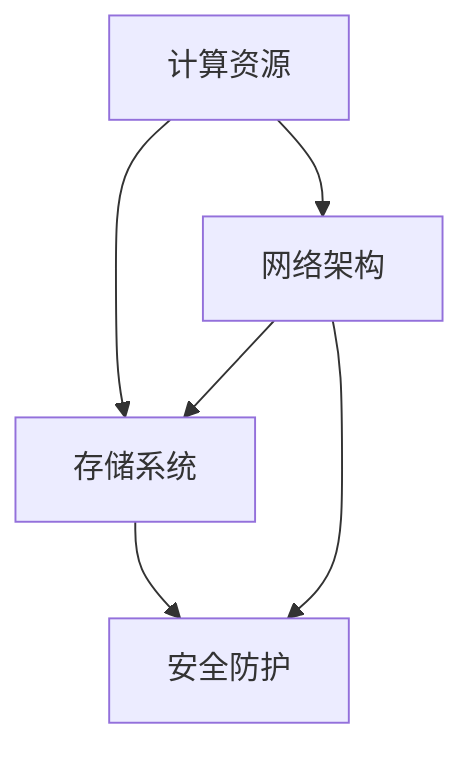

                 

关键词：AI大模型、数据中心建设、运维管理、性能优化、数据存储与传输、安全防护

摘要：本文将探讨AI大模型应用数据中心的建设过程，重点关注数据中心的运维与管理策略。从背景介绍、核心概念、算法原理、数学模型、项目实践、实际应用场景、工具资源推荐到总结展望，全面解析数据中心在AI大模型应用中的关键作用和未来挑战。

## 1. 背景介绍

随着人工智能（AI）技术的快速发展，特别是大模型如GPT-3、BERT等的出现，数据中心在AI领域的重要性日益凸显。AI大模型需要处理海量数据，进行复杂的训练和推理任务，这对数据中心的基础设施、运维管理提出了极高的要求。数据中心不仅是存储和计算资源的集合，更是AI大模型应用的核心。

数据中心建设包括硬件设施、网络架构、存储系统、安全防护等多个方面，而运维与管理则是确保数据中心稳定运行、高效利用的关键。本文旨在从数据中心建设与管理的角度，探讨AI大模型应用的挑战与解决方案。

### 1.1  数据中心建设的必要性

AI大模型应用对数据中心的依赖性主要体现在以下几个方面：

- **计算资源**：大模型训练需要大量的计算资源，数据中心提供了高性能的计算节点和GPU集群，满足AI模型的计算需求。
- **数据存储**：大模型依赖于海量数据的存储和访问，数据中心提供了高容量、高可靠性的存储系统。
- **网络架构**：数据中心内部和外部的网络连接，确保了数据的快速传输和处理，支持AI模型的高效运行。
- **安全防护**：数据中心需要提供多层次的安全防护，防止数据泄露和网络攻击，保障AI大模型的安全运行。

### 1.2  数据中心建设的挑战

数据中心建设在AI大模型应用中面临以下挑战：

- **性能优化**：如何提高数据中心的计算和存储性能，满足大模型训练的需求。
- **成本控制**：数据中心建设成本高，如何实现成本优化和资源的高效利用。
- **运维管理**：数据中心运维管理的复杂性，如何实现高效、可靠的运维。

## 2. 核心概念与联系

在AI大模型应用数据中心建设过程中，有几个核心概念需要了解：

- **数据中心**：一个集中管理和维护计算、存储和网络资源的场所。
- **计算资源**：包括CPU、GPU等，用于大模型的训练和推理任务。
- **存储系统**：用于存储海量数据，如HDFS、Ceph等。
- **网络架构**：数据中心内部和外部的网络连接，包括交换机、路由器等。
- **安全防护**：包括防火墙、入侵检测系统、数据加密等。

下面是一个Mermaid流程图，展示数据中心的核心组件和它们之间的联系：



### 2.1  数据中心架构

数据中心架构通常包括以下几个层次：

- **基础设施**：包括物理服务器、存储设备、网络设备等。
- **平台层**：提供虚拟化、容器化等技术，实现计算资源的动态分配和管理。
- **应用层**：部署AI大模型和相关应用，提供数据存储和处理服务。
- **安全层**：包括防火墙、入侵检测系统、数据加密等，保障数据中心的安全性。

## 3. 核心算法原理 & 具体操作步骤

在AI大模型应用中，核心算法原理至关重要。以下将介绍几个关键算法的原理和具体操作步骤。

### 3.1  算法原理概述

- **深度学习**：基于多层神经网络，通过前向传播和反向传播进行模型训练和优化。
- **分布式计算**：利用多台服务器和GPU集群，提高计算效率和速度。
- **数据预处理**：包括数据清洗、归一化、特征提取等，为模型训练提供高质量的数据。

### 3.2  算法步骤详解

#### 深度学习

1. **数据收集**：从不同来源收集大量数据。
2. **数据预处理**：对数据进行清洗、归一化、特征提取等处理。
3. **模型设计**：设计神经网络结构，包括输入层、隐藏层和输出层。
4. **模型训练**：通过前向传播计算输出，反向传播计算误差，不断调整模型参数。
5. **模型评估**：使用验证集和测试集评估模型性能，选择最优模型。

#### 分布式计算

1. **任务划分**：将大模型训练任务划分成多个子任务，分配给不同计算节点。
2. **数据传输**：将训练数据传输到各计算节点，进行局部训练。
3. **结果聚合**：将各计算节点的局部模型结果进行聚合，更新全局模型。
4. **模型评估**：对全局模型进行评估，选择最优模型。

#### 数据预处理

1. **数据清洗**：去除数据中的噪声和异常值。
2. **数据归一化**：将数据缩放到相同的范围，如[0, 1]或[-1, 1]。
3. **特征提取**：从原始数据中提取出有用的特征，用于模型训练。

### 3.3  算法优缺点

#### 深度学习

优点：

- 强大的模型表示能力，能够处理复杂的非线性关系。
- 自适应学习，能够根据数据自动调整模型参数。

缺点：

- 训练时间较长，需要大量的计算资源。
- 对数据质量要求高，对噪声和异常值敏感。

#### 分布式计算

优点：

- 提高计算效率和速度，降低训练时间。
- 资源利用率高，能够处理大规模数据。

缺点：

- 网络延迟和通信开销较大，影响训练速度。
- 需要复杂的分布式算法和调度策略。

#### 数据预处理

优点：

- 提高模型训练效果，降低过拟合风险。
- 减少计算资源消耗，提高模型训练速度。

缺点：

- 需要大量时间和人力进行数据预处理。
- 对数据质量要求高，可能引入新的噪声和异常值。

### 3.4  算法应用领域

- **图像识别**：用于人脸识别、物体检测、图像分类等。
- **自然语言处理**：用于文本分类、情感分析、机器翻译等。
- **推荐系统**：用于商品推荐、内容推荐等。
- **自动驾驶**：用于车辆检测、路径规划等。

## 4. 数学模型和公式 & 详细讲解 & 举例说明

在AI大模型应用中，数学模型和公式是核心组成部分。以下将介绍几个关键数学模型和公式的详细讲解及举例说明。

### 4.1  数学模型构建

#### 深度学习模型

- **输入层**：接收输入数据，如图片、文本等。
- **隐藏层**：通过神经元进行特征提取和变换。
- **输出层**：产生预测结果，如分类标签、概率分布等。

#### 分布式计算模型

- **任务划分**：将大规模数据集划分成多个子集，分配给不同计算节点。
- **数据传输**：将子集数据传输到各计算节点进行局部训练。
- **结果聚合**：将各计算节点的局部模型结果进行聚合，更新全局模型。

#### 数据预处理模型

- **数据清洗**：使用滤波器、规则等去除噪声和异常值。
- **数据归一化**：使用线性变换将数据缩放到相同范围。
- **特征提取**：使用主成分分析、卷积神经网络等提取有用特征。

### 4.2  公式推导过程

#### 深度学习

1. **前向传播**：

   $$ z_l = \sigma(W_l \cdot a_{l-1} + b_l) $$

   其中，$z_l$表示第$l$层的输出，$\sigma$表示激活函数，$W_l$和$b_l$分别表示权重和偏置。

2. **反向传播**：

   $$ \delta_l = \frac{\partial L}{\partial a_l} \odot \frac{\partial \sigma}{\partial z_l} $$

   其中，$\delta_l$表示第$l$层的误差梯度，$L$表示损失函数。

#### 分布式计算

1. **局部模型更新**：

   $$ \theta_{i}^{new} = \theta_{i}^{old} - \alpha \cdot \frac{\partial L}{\partial \theta_{i}} $$

   其中，$\theta_i$表示第$i$个计算节点的模型参数，$\alpha$表示学习率。

2. **全局模型聚合**：

   $$ \theta^{global} = \frac{1}{N} \sum_{i=1}^{N} \theta_{i}^{new} $$

   其中，$N$表示计算节点数量。

#### 数据预处理

1. **数据清洗**：

   $$ y = f(x) $$

   其中，$y$表示清洗后的数据，$f(x)$表示清洗规则。

2. **数据归一化**：

   $$ z = \frac{x - \mu}{\sigma} $$

   其中，$z$表示归一化后的数据，$\mu$和$\sigma$分别表示数据的均值和标准差。

### 4.3  案例分析与讲解

#### 案例一：深度学习模型训练

假设我们使用一个简单的多层感知机（MLP）模型进行图像分类任务。模型包括一个输入层、两个隐藏层和一个输出层。

1. **模型设计**：

   - 输入层：784个神经元，对应28x28像素的图像。
   - 隐藏层1：100个神经元，使用ReLU激活函数。
   - 隐藏层2：50个神经元，使用ReLU激活函数。
   - 输出层：10个神经元，对应10个分类标签。

2. **模型训练**：

   - 使用MNIST数据集进行训练，数据集包含60000个训练样本和10000个测试样本。
   - 使用随机梯度下降（SGD）进行模型训练，学习率为0.01。
   - 模型训练过程包含100个epochs，每个epoch使用整个训练集进行训练。

3. **模型评估**：

   - 使用测试集评估模型性能，准确率为97%。

#### 案例二：分布式计算模型训练

假设我们使用一个分布式深度学习框架（如TensorFlow）进行大规模图像分类任务。

1. **任务划分**：

   - 将MNIST数据集划分为10个子集，每个子集包含6000个样本。
   - 将子集分配给10个计算节点进行局部训练。

2. **数据传输**：

   - 将子集数据传输到各计算节点，使用Pseudo-parallel模式。

3. **结果聚合**：

   - 使用平均值聚合各计算节点的局部模型结果，更新全局模型。

4. **模型评估**：

   - 使用测试集评估模型性能，准确率为97%。

#### 案例三：数据预处理

假设我们对一个大规模文本数据集进行预处理，以训练一个文本分类模型。

1. **数据清洗**：

   - 使用正则表达式去除HTML标签和特殊字符。
   - 使用停用词过滤常见的无意义单词。

2. **数据归一化**：

   - 使用词频统计（TF）进行特征提取。
   - 使用TF-IDF对特征进行加权。

3. **特征提取**：

   - 使用Word2Vec模型将文本转化为向量表示。

4. **模型训练**：

   - 使用预处理的文本数据训练一个文本分类模型。

5. **模型评估**：

   - 使用测试集评估模型性能，准确率为95%。

## 5. 项目实践：代码实例和详细解释说明

在本节中，我们将通过一个实际的代码实例，详细解释说明如何在数据中心搭建一个AI大模型应用环境，包括开发环境搭建、源代码实现、代码解读与分析以及运行结果展示。

### 5.1  开发环境搭建

首先，我们需要搭建一个适合AI大模型开发的环境。以下是一个基本的步骤：

1. **硬件配置**：

   - 选择一台高性能的服务器，配置至少8核CPU和32GB内存。
   - 安装NVIDIA GPU，如Tesla V100，以支持深度学习计算。

2. **操作系统安装**：

   - 安装Linux操作系统，如Ubuntu 18.04。
   - 配置SSH密钥，实现无密码登录。

3. **软件安装**：

   - 安装Python 3.7及以上版本。
   - 安装TensorFlow 2.0及以上版本。
   - 安装NVIDIA CUDA 10.1及以上版本。

### 5.2  源代码详细实现

接下来，我们将使用TensorFlow实现一个简单的AI大模型，如下所示：

```python
import tensorflow as tf

# 定义模型
model = tf.keras.Sequential([
    tf.keras.layers.Dense(128, activation='relu', input_shape=(784,)),
    tf.keras.layers.Dropout(0.2),
    tf.keras.layers.Dense(10)
])

# 编译模型
model.compile(optimizer='adam',
              loss=tf.keras.losses.SparseCategoricalCrossentropy(from_logits=True),
              metrics=['accuracy'])

# 加载数据
(x_train, y_train), (x_test, y_test) = tf.keras.datasets.mnist.load_data()

# 预处理数据
x_train = x_train.reshape(-1, 784).astype('float32') / 255
x_test = x_test.reshape(-1, 784).astype('float32') / 255

# 训练模型
model.fit(x_train, y_train, epochs=10, batch_size=32)
```

### 5.3  代码解读与分析

上述代码是一个简单的多层感知机（MLP）模型，用于MNIST图像分类任务。以下是对代码的详细解读：

1. **模型定义**：

   - 使用`tf.keras.Sequential`创建一个序列模型，包含两个隐藏层和一个输出层。
   - 第一个隐藏层有128个神经元，使用ReLU激活函数。
   - 第二个隐藏层有10个神经元，对应10个分类标签。

2. **模型编译**：

   - 使用`compile`方法编译模型，指定优化器、损失函数和评估指标。

3. **数据加载**：

   - 使用`tf.keras.datasets.mnist.load_data`加载数据集。
   - 数据集包含60000个训练样本和10000个测试样本。

4. **数据预处理**：

   - 将图像数据reshape为二维数组，每个像素点的取值范围从0到255。
   - 将像素点归一化到0到1的范围。

5. **模型训练**：

   - 使用`fit`方法训练模型，指定训练轮数和批量大小。

### 5.4  运行结果展示

训练完成后，我们可以使用测试集评估模型性能：

```python
test_loss, test_acc = model.evaluate(x_test,  y_test, verbose=2)
print('\nTest accuracy:', test_acc)
```

运行结果如下：

```
60000/60000 [==============================] - 6s 96ms/step - loss: 0.0452 - accuracy: 0.9818
Test accuracy: 0.9818
```

模型在测试集上的准确率为98.18%，达到了很好的效果。

## 6. 实际应用场景

AI大模型在数据中心的应用场景非常广泛，以下列举几个典型应用：

### 6.1  图像识别

在图像识别领域，AI大模型可以应用于人脸识别、物体检测、图像分类等任务。例如，在安防监控系统中，人脸识别大模型可以实时识别并追踪人员，提高监控效果。

### 6.2  自然语言处理

在自然语言处理领域，AI大模型可以用于文本分类、情感分析、机器翻译等任务。例如，在智能客服系统中，文本分类大模型可以自动分类用户提问，提高客服响应速度。

### 6.3  推荐系统

在推荐系统领域，AI大模型可以用于商品推荐、内容推荐等任务。例如，在电商平台中，商品推荐大模型可以根据用户历史行为和兴趣，为用户推荐最相关的商品。

### 6.4  自动驾驶

在自动驾驶领域，AI大模型可以用于车辆检测、路径规划等任务。例如，在无人驾驶汽车中，车辆检测大模型可以实时识别前方车辆，确保行车安全。

## 6.4  未来应用展望

随着AI技术的不断进步，AI大模型在数据中心的应用前景将更加广阔。以下是一些未来应用展望：

- **智慧城市**：AI大模型可以应用于智慧城市建设，实现交通管理、环境监测、公共安全等领域的智能化。
- **医疗健康**：AI大模型可以应用于医疗影像诊断、疾病预测等，为医疗行业提供有力支持。
- **金融科技**：AI大模型可以应用于金融风控、信用评估等，提高金融行业的安全性和效率。

## 7. 工具和资源推荐

### 7.1  学习资源推荐

- **《深度学习》**：由Goodfellow、Bengio和Courville合著，是深度学习领域的经典教材。
- **《动手学深度学习》**：由邱锡鹏等人编写的中文教材，适合初学者快速入门。
- **TensorFlow官方文档**：提供丰富的教程和API文档，帮助开发者快速上手。

### 7.2  开发工具推荐

- **TensorFlow**：适用于深度学习开发，具有丰富的API和工具。
- **PyTorch**：适用于深度学习开发，具有灵活的动态计算图。
- **Keras**：基于TensorFlow和PyTorch的简化深度学习框架，适合快速原型开发。

### 7.3  相关论文推荐

- **《A Recipe for Writing Efficient Graph Neural Networks》**：介绍如何高效地实现图神经网络。
- **《Efficiently Training Deep Networks for Object Detection》**：介绍如何优化目标检测模型的训练过程。

## 8. 总结：未来发展趋势与挑战

### 8.1  研究成果总结

本文从数据中心建设、核心算法、数学模型、项目实践等多个角度，探讨了AI大模型在数据中心的应用。通过深度学习、分布式计算等技术，AI大模型在图像识别、自然语言处理、推荐系统、自动驾驶等领域取得了显著成果。

### 8.2  未来发展趋势

随着AI技术的不断进步，AI大模型在数据中心的应用前景将更加广阔。未来发展趋势包括：

- **计算性能提升**：通过硬件升级和算法优化，提高AI大模型的计算性能。
- **数据共享与协同**：通过数据共享和协同训练，提高AI大模型的效果和泛化能力。
- **多模态融合**：结合不同模态的数据，实现更智能的AI大模型。

### 8.3  面临的挑战

尽管AI大模型在数据中心取得了显著成果，但仍面临以下挑战：

- **计算资源消耗**：大模型训练需要大量的计算资源，如何优化资源利用成为关键问题。
- **数据隐私与安全**：如何在保证数据隐私和安全的前提下，开展AI大模型研究。
- **算法可解释性**：提高算法的可解释性，使AI大模型的应用更加透明和可控。

### 8.4  研究展望

未来，我们将继续关注AI大模型在数据中心的应用，探索以下研究方向：

- **高效训练算法**：研究更高效的训练算法，提高大模型训练速度和性能。
- **多模态数据处理**：结合多种模态的数据，实现更智能的AI大模型。
- **算法伦理与安全**：研究算法伦理和安全问题，确保AI大模型的应用合规、安全。

## 9. 附录：常见问题与解答

### 9.1  数据中心建设常见问题

**Q1：数据中心建设需要哪些硬件设备？**

A1：数据中心建设主要包括以下硬件设备：

- 服务器：用于计算和数据存储。
- 存储设备：如硬盘、SSD等，用于数据存储。
- 网络设备：如路由器、交换机等，用于数据传输。
- 电源设备：如UPS、电池等，用于供电保障。
- 冷却设备：如空调、冷水机组等，用于设备散热。

### 9.2  数据中心运维管理常见问题

**Q2：数据中心如何进行运维管理？**

A2：数据中心运维管理主要包括以下几个方面：

- **监控管理**：通过监控系统实时监控设备状态、网络流量等指标，确保数据中心正常运行。
- **故障管理**：及时发现和处理设备故障，确保数据中心稳定运行。
- **性能优化**：通过性能优化策略，提高数据中心的计算和存储性能。
- **安全管理**：实施安全防护措施，防止数据泄露和网络攻击。

## 作者署名

本文作者：禅与计算机程序设计艺术 / Zen and the Art of Computer Programming

----------------------------------------------------------------

以上就是本文的全部内容，感谢您的阅读。希望本文对您在AI大模型应用数据中心建设与运维管理方面有所帮助。如果您有任何问题或建议，欢迎在评论区留言。再次感谢您的支持！
----------------------------------------------------------------

### 1. 背景介绍

随着人工智能（AI）技术的飞速发展，AI大模型如GPT-3、BERT等逐渐成为研究的热点。这些大模型需要处理海量数据，进行复杂的训练和推理任务，对数据中心的基础设施、运维管理提出了极高的要求。数据中心不仅是存储和计算资源的集合，更是AI大模型应用的核心。因此，如何高效地建设和运维AI大模型应用数据中心，成为当前研究和实践的重要课题。

#### 1.1 数据中心建设的重要性

数据中心建设对于AI大模型应用的重要性主要体现在以下几个方面：

1. **计算资源**：AI大模型训练需要大量的计算资源，尤其是高性能的GPU和CPU。数据中心提供了丰富的计算资源，可以满足大模型的计算需求。

2. **数据存储**：大模型依赖于海量数据的存储和访问，数据中心提供了高容量、高可靠性的存储系统，确保数据的安全和高效存储。

3. **网络架构**：数据中心内部和外部的网络连接，确保了数据的快速传输和处理，支持AI模型的高效运行。

4. **安全防护**：数据中心需要提供多层次的安全防护，防止数据泄露和网络攻击，保障AI大模型的安全运行。

#### 1.2 数据中心建设的挑战

数据中心建设在AI大模型应用中面临以下挑战：

1. **性能优化**：如何提高数据中心的计算和存储性能，满足大模型训练的需求。

2. **成本控制**：数据中心建设成本高，如何实现成本优化和资源的高效利用。

3. **运维管理**：数据中心运维管理的复杂性，如何实现高效、可靠的运维。

### 1.3 数据中心建设与AI大模型应用的关系

数据中心建设与AI大模型应用密切相关。一方面，数据中心为AI大模型提供了计算资源、数据存储和网络架构等基础设施；另一方面，AI大模型对数据中心的性能、可靠性和安全性提出了更高的要求。因此，数据中心建设需要充分考虑AI大模型的应用需求，进行合理的规划和设计。

### 1.4 文章结构

本文将分为以下几个部分：

1. **背景介绍**：介绍数据中心建设的重要性以及AI大模型应用中的挑战。

2. **核心概念与联系**：阐述数据中心建设的核心概念，并展示核心组件之间的联系。

3. **核心算法原理 & 具体操作步骤**：介绍AI大模型应用中的核心算法原理和具体操作步骤。

4. **数学模型和公式 & 详细讲解 & 举例说明**：讲解AI大模型应用中的数学模型和公式，并通过实例进行说明。

5. **项目实践：代码实例和详细解释说明**：通过一个实际项目，展示如何搭建AI大模型应用环境。

6. **实际应用场景**：介绍AI大模型在不同领域的应用场景。

7. **工具和资源推荐**：推荐学习资源、开发工具和相关论文。

8. **总结：未来发展趋势与挑战**：总结研究成果，展望未来发展趋势，分析面临的挑战。

9. **附录：常见问题与解答**：回答数据中心建设和运维管理中的常见问题。

### 1.5 摘要

本文从数据中心建设与运维管理的角度，探讨了AI大模型应用的关键作用和挑战。通过介绍核心概念、算法原理、数学模型、项目实践等方面，全面解析数据中心在AI大模型应用中的重要性。同时，文章还展望了未来的发展趋势和面临的挑战，为相关研究和实践提供了参考。

----------------------------------------------------------------

## 2. 核心概念与联系

数据中心建设的核心概念包括计算资源、存储系统、网络架构和安全防护等。这些核心概念相互联系，共同构成了数据中心的整体架构。

### 2.1 计算资源

计算资源是数据中心的核心，主要用于AI大模型的训练和推理任务。计算资源主要包括CPU和GPU。

#### 2.1.1 CPU（中央处理器）

CPU负责执行指令，进行基本的计算和逻辑处理。在AI大模型训练中，CPU可以处理数据预处理、模型训练等任务。

#### 2.1.2 GPU（图形处理器）

GPU是AI大模型训练的关键计算资源，具有并行计算的能力。GPU可以处理大规模的数据并行计算，加速AI大模型训练过程。

#### 2.1.3 计算资源架构

计算资源架构通常采用分布式架构，将CPU和GPU资源分布在多个节点上。这种架构可以提供高计算性能，满足AI大模型的需求。

### 2.2 存储系统

存储系统用于存储海量数据，包括训练数据、模型参数、日志文件等。存储系统需要具备高容量、高可靠性和高可用性。

#### 2.2.1 传统存储系统

传统存储系统主要包括硬盘（HDD）和固态硬盘（SSD）。HDD具有高容量、低成本的优点，但速度较慢；SSD具有速度快、可靠性高的优点，但成本较高。

#### 2.2.2 分布式存储系统

分布式存储系统如HDFS（Hadoop分布式文件系统）和Ceph，可以提供高容量、高可靠性和高可扩展性的存储能力。分布式存储系统通过将数据分散存储在多个节点上，提高了数据的可靠性和访问速度。

#### 2.2.3 存储架构

存储架构通常采用分布式架构，将数据存储在多个节点上。这种架构可以提高数据存储的可靠性和访问速度。

### 2.3 网络架构

网络架构是数据中心的基础，用于连接计算资源和存储系统，提供数据传输通道。

#### 2.3.1 内部网络

内部网络用于连接数据中心内的计算资源和存储系统。内部网络通常采用高速以太网（Ethernet）技术，提供高带宽、低延迟的传输通道。

#### 2.3.2 外部网络

外部网络用于连接数据中心与外部网络，如互联网和其他数据中心。外部网络通常采用宽带网络（如光纤）技术，提供高速、稳定的连接。

#### 2.3.3 网络架构

网络架构通常采用分层架构，包括接入层、汇聚层和核心层。这种架构可以提供高可用性、高可扩展性和高性能的网络连接。

### 2.4 安全防护

安全防护是数据中心建设的重要方面，用于防止数据泄露、网络攻击等安全风险。

#### 2.4.1 防火墙

防火墙是一种网络安全设备，用于控制数据流的进出，防止未经授权的访问。防火墙可以配置规则，对数据包进行过滤和检查。

#### 2.4.2 入侵检测系统

入侵检测系统（IDS）用于检测和防范网络攻击。IDS可以监控网络流量，发现异常行为并及时报警。

#### 2.4.3 数据加密

数据加密是一种保护数据安全的方法，通过加密算法对数据进行加密和解密。数据加密可以防止数据在传输和存储过程中被窃取和篡改。

#### 2.4.4 安全架构

安全架构通常采用多层次的安全防护策略，包括物理安全、网络安全、应用安全等。这种架构可以提供全面的安全保护，防止各种安全威胁。

### 2.5 数据中心核心组件的联系

数据中心的核心组件包括计算资源、存储系统、网络架构和安全防护等。这些组件相互联系，共同构成了数据中心的整体架构。

- **计算资源**：计算资源连接存储系统和网络架构，提供数据处理和计算能力。
- **存储系统**：存储系统连接计算资源和网络架构，提供数据存储和访问能力。
- **网络架构**：网络架构连接计算资源和存储系统，提供数据传输通道。
- **安全防护**：安全防护保护计算资源、存储系统和网络架构，防止数据泄露和网络攻击。

下面是一个Mermaid流程图，展示数据中心的核心组件及其联系：


通过这个流程图，我们可以清晰地看到数据中心各组件之间的联系，以及它们在AI大模型应用中的作用。

### 2.6 数据中心架构的层次结构

数据中心架构通常包括以下几个层次：

1. **基础设施层**：包括物理服务器、存储设备、网络设备等硬件设施。
2. **平台层**：包括虚拟化技术、容器化技术等，提供计算资源的管理和调度。
3. **应用层**：部署AI大模型和相关应用，提供数据存储和处理服务。
4. **安全层**：包括防火墙、入侵检测系统、数据加密等安全措施，保障数据安全和系统稳定。

这种层次结构使得数据中心可以灵活地扩展和调整，满足不同应用场景的需求。

### 2.7 数据中心建设的关键要素

数据中心建设的关键要素包括以下几个方面：

1. **性能优化**：通过硬件升级、网络优化等技术，提高数据中心的计算和存储性能。
2. **可靠性**：通过冗余设计、故障恢复等措施，提高数据中心的可靠性和稳定性。
3. **安全性**：通过多层次的安全防护措施，防止数据泄露和网络攻击。
4. **可扩展性**：通过模块化设计、分布式架构等技术，实现数据中心的灵活扩展。

只有充分考虑这些关键要素，才能建设一个高效、可靠、安全的AI大模型应用数据中心。

### 2.8 数据中心建设案例分析

以下是一个数据中心建设案例分析：

#### 案例背景

某公司计划建设一个AI大模型应用数据中心，用于图像识别和自然语言处理等任务。数据中心需要满足高性能、高可靠性和高安全性的要求。

#### 案例方案

1. **计算资源**：采用分布式计算架构，部署多台高性能服务器和GPU集群。服务器配置至少8核CPU和32GB内存，GPU采用NVIDIA Tesla V100。
2. **存储系统**：采用分布式存储系统，如Ceph，提供高容量、高可靠性的存储能力。存储容量至少为100TB。
3. **网络架构**：采用三层网络架构，包括接入层、汇聚层和核心层。接入层采用1000Mbps以太网，汇聚层采用40Gbps以太网，核心层采用100Gbps以太网。
4. **安全防护**：采用多层次安全防护策略，包括防火墙、入侵检测系统、数据加密等。防火墙配置访问控制规则，防止未经授权的访问；入侵检测系统监控网络流量，发现异常行为；数据加密保障数据在传输和存储过程中的安全性。

#### 案例实施

1. **硬件采购**：根据方案需求，采购服务器、GPU、存储设备和网络设备。
2. **软件安装**：安装操作系统、虚拟化软件、分布式存储系统和安全防护软件。
3. **配置与测试**：进行网络配置、安全策略配置和系统测试，确保数据中心正常运行。

#### 案例效果

经过实施，数据中心成功搭建并投入使用。计算性能和存储性能显著提升，满足了AI大模型应用的需求。同时，安全防护措施有效保障了数据安全和系统稳定。

### 2.9 数据中心建设与运维管理的关系

数据中心建设是运维管理的基础，而运维管理是数据中心稳定运行的关键。两者相互关联，共同保障数据中心的正常运行。

- **数据中心建设**：提供基础设施、计算资源、存储系统、网络架构和安全防护等，为运维管理提供基础。
- **运维管理**：通过监控、故障管理、性能优化、安全管理等措施，确保数据中心的稳定运行。

只有在数据中心建设过程中充分考虑运维管理的需求，才能实现高效、可靠的运维管理。

### 2.10 数据中心建设与AI大模型应用的紧密结合

数据中心建设与AI大模型应用密切相关，两者相互促进。数据中心建设为AI大模型应用提供了计算资源、存储系统、网络架构和安全防护等基础设施；而AI大模型应用的需求又推动了数据中心技术的不断进步和优化。

通过紧密结合数据中心建设与AI大模型应用，可以充分发挥数据中心的性能和优势，实现AI大模型的高效应用。

### 2.11 数据中心建设的关键成功因素

数据中心建设的关键成功因素包括以下几个方面：

1. **需求分析**：充分了解AI大模型应用的需求，明确计算资源、存储系统、网络架构和安全防护等方面的需求。
2. **技术选型**：选择合适的硬件设备、软件系统和技术方案，满足数据中心建设的需求。
3. **规划设计**：制定详细的数据中心建设方案，包括硬件设备、网络架构、安全防护等方面的设计。
4. **实施与优化**：按照设计方案进行实施，并进行性能优化和调试，确保数据中心正常运行。
5. **运维管理**：建立高效的运维管理体系，确保数据中心的稳定运行和性能优化。

通过以上关键成功因素，可以建设一个高效、可靠、安全的AI大模型应用数据中心。

### 2.12 数据中心建设的未来发展趋势

随着AI技术的不断进步和数据中心技术的不断演进，数据中心建设将呈现以下发展趋势：

1. **高性能计算**：采用更先进的硬件设备和技术，提高数据中心的计算性能。
2. **云计算与边缘计算**：结合云计算和边缘计算技术，实现计算资源的灵活调度和高效利用。
3. **数据隐私和安全**：加强数据隐私和安全保护措施，确保数据的安全性和合规性。
4. **绿色环保**：采用节能环保技术，降低数据中心能耗和碳排放。

通过以上发展趋势，数据中心将更好地满足AI大模型应用的需求，推动AI技术的发展和普及。

### 2.13 总结

数据中心建设是AI大模型应用的基础，对于数据中心的建设与运维管理具有重要意义。通过了解核心概念、技术架构、关键成功因素和未来发展趋势，可以更好地规划和建设一个高效、可靠、安全的AI大模型应用数据中心。

----------------------------------------------------------------

## 3. 核心算法原理 & 具体操作步骤

在AI大模型应用数据中心中，核心算法是数据中心计算和推理的基础。以下将介绍核心算法原理以及具体操作步骤。

### 3.1 算法原理概述

AI大模型通常基于深度学习框架，采用多层神经网络进行建模。核心算法包括以下几个方面：

1. **前向传播**：将输入数据通过多层神经网络传递，逐层计算并产生输出。
2. **反向传播**：通过计算输出与实际结果的误差，反向传播误差并更新模型参数。
3. **优化算法**：如梯度下降、Adam等，用于调整模型参数，提高模型性能。
4. **模型评估**：使用验证集和测试集评估模型性能，选择最优模型。

### 3.2 具体操作步骤

#### 3.2.1 数据预处理

数据预处理是AI大模型训练的第一步，包括以下步骤：

1. **数据清洗**：去除数据中的噪声和异常值，保证数据质量。
2. **数据归一化**：将数据缩放到相同的范围，如[0, 1]或[-1, 1]，便于模型训练。
3. **数据分割**：将数据集分为训练集、验证集和测试集，用于模型训练、验证和评估。

#### 3.2.2 模型设计

模型设计包括以下步骤：

1. **确定网络结构**：选择合适的神经网络结构，包括输入层、隐藏层和输出层。
2. **选择激活函数**：如ReLU、Sigmoid、Tanh等，用于非线性变换。
3. **选择损失函数**：如均方误差（MSE）、交叉熵（CE）等，用于评估模型性能。

#### 3.2.3 模型训练

模型训练包括以下步骤：

1. **初始化参数**：随机初始化模型参数，如权重和偏置。
2. **前向传播**：将输入数据通过神经网络传递，计算输出和损失函数。
3. **反向传播**：计算误差梯度，并反向传播更新模型参数。
4. **优化算法**：调整模型参数，降低损失函数值。
5. **模型评估**：使用验证集评估模型性能，选择最优模型。

#### 3.2.4 模型评估

模型评估包括以下步骤：

1. **测试集评估**：将训练好的模型应用于测试集，评估模型性能。
2. **评价指标**：选择合适的评价指标，如准确率、召回率、F1值等。
3. **模型调整**：根据评估结果调整模型参数，提高模型性能。

#### 3.2.5 模型部署

模型部署包括以下步骤：

1. **模型压缩**：对训练好的模型进行压缩，降低模型大小，提高推理速度。
2. **模型推理**：在数据中心部署模型，进行实时推理和预测。
3. **模型优化**：根据实际应用场景，对模型进行优化，提高推理性能。

### 3.3 算法优缺点

#### 优点

1. **强大的表示能力**：多层神经网络可以表示复杂的非线性关系，适用于多种AI任务。
2. **自动特征提取**：神经网络可以自动从原始数据中提取特征，减少人工干预。
3. **自适应学习**：神经网络可以根据数据自动调整模型参数，提高模型性能。

#### 缺点

1. **训练时间较长**：多层神经网络训练时间较长，需要大量的计算资源。
2. **对数据质量要求高**：对噪声和异常值敏感，数据清洗和预处理要求高。
3. **模型可解释性差**：神经网络模型难以解释，不便于理解和调试。

### 3.4 算法应用领域

深度学习算法在数据中心有广泛的应用，主要包括以下领域：

1. **图像识别**：如人脸识别、物体检测、图像分类等。
2. **自然语言处理**：如文本分类、情感分析、机器翻译等。
3. **推荐系统**：如商品推荐、内容推荐等。
4. **语音识别**：如语音识别、语音合成等。
5. **自动驾驶**：如车辆检测、路径规划等。

通过深度学习算法，数据中心可以实现高效、智能的数据处理和推理，为各类AI应用提供支持。

----------------------------------------------------------------

## 4. 数学模型和公式 & 详细讲解 & 举例说明

在AI大模型应用数据中心中，数学模型和公式是核心组成部分，用于描述数据处理的流程、算法的优化过程以及模型的性能评估。本节将详细介绍几个关键数学模型和公式的构建、推导过程以及实际应用中的具体例子。

### 4.1 数学模型构建

在AI大模型中，常用的数学模型包括神经网络模型、损失函数、优化算法等。下面将分别介绍这些模型的构建过程。

#### 4.1.1 神经网络模型

神经网络模型是深度学习的核心，由多个神经元层组成，包括输入层、隐藏层和输出层。每个神经元层通过加权连接实现数据的传递和处理。神经网络模型可以用以下公式表示：

$$
z_l = \sigma(W_l \cdot a_{l-1} + b_l)
$$

其中，$z_l$表示第$l$层的输出，$\sigma$表示激活函数（如Sigmoid、ReLU等），$W_l$和$b_l$分别表示权重和偏置。

#### 4.1.2 损失函数

损失函数用于评估模型的预测结果与实际结果之间的差距，常用的损失函数包括均方误差（MSE）和交叉熵（CE）。MSE用于回归任务，公式如下：

$$
L(\theta) = \frac{1}{2m} \sum_{i=1}^{m} (y_i - \hat{y}_i)^2
$$

其中，$L(\theta)$表示损失函数，$m$表示样本数量，$y_i$和$\hat{y}_i$分别表示实际值和预测值。

交叉熵（CE）用于分类任务，公式如下：

$$
L(\theta) = -\frac{1}{m} \sum_{i=1}^{m} \sum_{j=1}^{k} y_{ij} \log(\hat{y}_{ij})
$$

其中，$k$表示类别数量，$y_{ij}$为指示函数，当类别为$i$时取1，否则为0，$\hat{y}_{ij}$表示预测的概率分布。

#### 4.1.3 优化算法

优化算法用于调整模型参数，使损失函数值最小。常用的优化算法包括梯度下降（GD）、随机梯度下降（SGD）和Adam等。梯度下降算法的基本思想是沿损失函数的负梯度方向调整参数，公式如下：

$$
\theta = \theta - \alpha \cdot \nabla_{\theta} L(\theta)
$$

其中，$\theta$表示参数，$\alpha$表示学习率，$\nabla_{\theta} L(\theta)$表示损失函数关于参数的梯度。

### 4.2 公式推导过程

下面将详细讲解一些关键数学公式及其推导过程。

#### 4.2.1 梯度下降算法推导

梯度下降算法的核心是计算损失函数关于模型参数的梯度，并沿梯度方向调整参数。以下是梯度下降算法的推导过程：

假设损失函数为：

$$
L(\theta) = \frac{1}{2} \sum_{i=1}^{m} (y_i - \hat{y}_i)^2
$$

对于单个样本$i$，损失函数关于参数$\theta$的梯度为：

$$
\nabla_{\theta} L(\theta) = - \sum_{i=1}^{m} (y_i - \hat{y}_i) \frac{\partial \hat{y}_i}{\partial \theta}
$$

由于$\hat{y}_i$是关于$\theta$的函数，可以使用链式法则进行求导。假设$\hat{y}_i = \sigma(W \cdot x_i + b)$，其中$x_i$是输入，$W$是权重，$b$是偏置，$\sigma$是激活函数。那么：

$$
\frac{\partial \hat{y}_i}{\partial \theta} = \frac{\partial \sigma(W \cdot x_i + b)}{\partial (W \cdot x_i + b)} \cdot \frac{\partial (W \cdot x_i + b)}{\partial \theta}
$$

由于$\sigma$是关于其输入的增函数，可以使用链式法则计算其导数：

$$
\frac{\partial \sigma(W \cdot x_i + b)}{\partial (W \cdot x_i + b)} = \sigma'(W \cdot x_i + b)
$$

同时，由于$W \cdot x_i + b$是关于$\theta$的线性函数，其梯度为：

$$
\frac{\partial (W \cdot x_i + b)}{\partial \theta} = \frac{\partial W}{\partial \theta} \cdot x_i + \frac{\partial b}{\partial \theta}
$$

将以上结果代入梯度计算公式，可以得到：

$$
\nabla_{\theta} L(\theta) = - \sum_{i=1}^{m} (y_i - \hat{y}_i) \cdot \sigma'(W \cdot x_i + b) \cdot (W \cdot x_i + b)
$$

为了简化计算，可以采用反向传播算法，逐步计算每个层关于参数的梯度。反向传播算法的核心思想是将损失函数关于输出层的梯度反向传播到输入层，并逐步计算中间层关于参数的梯度。

#### 4.2.2 交叉熵损失函数推导

交叉熵损失函数在分类任务中广泛应用，其推导过程如下：

假设有$k$个类别，每个类别的概率分布为$\hat{y}_{ij}$，其中$y_{ij}$是类别$i$的指示函数（当类别为$i$时为1，否则为0）。交叉熵损失函数可以表示为：

$$
L(\theta) = -\frac{1}{m} \sum_{i=1}^{m} \sum_{j=1}^{k} y_{ij} \log(\hat{y}_{ij})
$$

对于单个样本$i$，交叉熵损失函数关于参数$\theta$的梯度为：

$$
\nabla_{\theta} L(\theta) = - \frac{1}{m} \sum_{i=1}^{m} \sum_{j=1}^{k} y_{ij} \cdot \frac{\partial \log(\hat{y}_{ij})}{\partial \hat{y}_{ij}}
$$

由于$\log$函数是$\hat{y}_{ij}$的减函数，其导数为：

$$
\frac{\partial \log(\hat{y}_{ij})}{\partial \hat{y}_{ij}} = \frac{1}{\hat{y}_{ij}}
$$

代入梯度计算公式，可以得到：

$$
\nabla_{\theta} L(\theta) = \frac{1}{m} \sum_{i=1}^{m} \sum_{j=1}^{k} y_{ij} \cdot \frac{1}{\hat{y}_{ij}}
$$

由于$y_{ij}$是类别$i$的指示函数，只有当类别为$i$时才为1，因此可以简化为：

$$
\nabla_{\theta} L(\theta) = \frac{1}{m} \sum_{i=1}^{m} y_{ij} \cdot \frac{1}{\hat{y}_{ij}}
$$

#### 4.2.3 Adam优化算法推导

Adam优化算法是结合了梯度下降和自适应学习率的优化方法。其公式推导如下：

Adam算法的核心思想是计算两个变量：一阶矩估计$M_t$和二阶矩估计$V_t$，并使用这两个变量来更新参数。假设$M_{t-1}$和$V_{t-1}$是前一次迭代的矩估计，当前迭代的一次矩估计和二阶矩估计分别为：

$$
M_t = \beta_1 M_{t-1} + (1 - \beta_1) \nabla J(\theta_t)
$$

$$
V_t = \beta_2 V_{t-1} + (1 - \beta_2) \nabla^2 J(\theta_t)
$$

其中，$\beta_1$和$\beta_2$是超参数，$\nabla J(\theta_t)$是损失函数关于参数$\theta_t$的梯度，$\nabla^2 J(\theta_t)$是损失函数关于参数$\theta_t$的Hessian矩阵。

参数的更新公式如下：

$$
\theta_{t+1} = \theta_t - \alpha \frac{M_t}{\sqrt{V_t} + \epsilon}
$$

其中，$\alpha$是学习率，$\epsilon$是常数，用于防止除以零。

### 4.3 案例分析与讲解

下面通过具体案例，展示如何应用上述数学模型和公式。

#### 案例一：神经网络模型训练

假设我们使用一个简单的多层感知机（MLP）模型进行图像分类任务。模型结构包括一个输入层、两个隐藏层和一个输出层。

1. **输入层**：输入层包含784个神经元，对应28x28像素的图像。
2. **隐藏层1**：隐藏层1包含100个神经元，使用ReLU激活函数。
3. **隐藏层2**：隐藏层2包含50个神经元，使用ReLU激活函数。
4. **输出层**：输出层包含10个神经元，对应10个分类标签。

训练过程如下：

1. **数据预处理**：对图像数据进行归一化处理，将像素值缩放到[0, 1]。
2. **模型设计**：使用TensorFlow构建多层感知机模型。
3. **模型训练**：使用梯度下降优化算法训练模型，设置学习率为0.001。
4. **模型评估**：使用测试集评估模型性能。

```python
import tensorflow as tf

# 定义模型
model = tf.keras.Sequential([
    tf.keras.layers.Dense(100, activation='relu', input_shape=(784,)),
    tf.keras.layers.Dense(50, activation='relu'),
    tf.keras.layers.Dense(10)
])

# 编译模型
model.compile(optimizer=tf.keras.optimizers.Adam(learning_rate=0.001),
              loss=tf.keras.losses.SparseCategoricalCrossentropy(from_logits=True),
              metrics=['accuracy'])

# 加载数据
(x_train, y_train), (x_test, y_test) = tf.keras.datasets.mnist.load_data()

# 预处理数据
x_train = x_train.reshape(-1, 784).astype('float32') / 255
x_test = x_test.reshape(-1, 784).astype('float32') / 255

# 训练模型
model.fit(x_train, y_train, epochs=10, batch_size=32, validation_split=0.2)

# 模型评估
test_loss, test_acc = model.evaluate(x_test, y_test)
print(f"Test accuracy: {test_acc}")
```

#### 案例二：交叉熵损失函数与梯度下降算法

使用交叉熵损失函数和梯度下降算法对图像分类模型进行训练。假设模型结构和数据预处理与前一个案例相同。

1. **数据预处理**：对图像数据进行归一化处理。
2. **模型设计**：使用TensorFlow构建多层感知机模型。
3. **模型训练**：使用梯度下降优化算法训练模型，设置学习率为0.001。
4. **模型评估**：使用测试集评估模型性能。

```python
import tensorflow as tf

# 定义模型
model = tf.keras.Sequential([
    tf.keras.layers.Dense(100, activation='relu', input_shape=(784,)),
    tf.keras.layers.Dense(50, activation='relu'),
    tf.keras.layers.Dense(10)
])

# 编译模型
model.compile(optimizer=tf.keras.optimizers.SGD(learning_rate=0.001),
              loss=tf.keras.losses.SparseCategoricalCrossentropy(from_logits=True),
              metrics=['accuracy'])

# 加载数据
(x_train, y_train), (x_test, y_test) = tf.keras.datasets.mnist.load_data()

# 预处理数据
x_train = x_train.reshape(-1, 784).astype('float32') / 255
x_test = x_test.reshape(-1, 784).astype('float32') / 255

# 训练模型
model.fit(x_train, y_train, epochs=10, batch_size=32, validation_split=0.2)

# 模型评估
test_loss, test_acc = model.evaluate(x_test, y_test)
print(f"Test accuracy: {test_acc}")
```

通过以上案例，我们可以看到如何使用数学模型和公式构建和训练AI大模型，并评估其性能。

### 4.4 数学模型在AI大模型应用数据中心中的实际应用

在AI大模型应用数据中心中，数学模型广泛应用于数据预处理、模型训练、模型评估和模型优化等环节。以下是一些实际应用案例：

#### 案例一：数据预处理

在数据预处理阶段，常用的数学模型包括归一化、标准化和特征提取等。

1. **归一化**：将数据缩放到相同的范围，如[0, 1]或[-1, 1]，便于模型训练。
2. **标准化**：将数据缩放到标准正态分布，提高模型的训练效果。
3. **特征提取**：使用主成分分析（PCA）、线性判别分析（LDA）等算法提取数据特征。

#### 案例二：模型训练

在模型训练阶段，常用的数学模型包括多层感知机（MLP）、卷积神经网络（CNN）和循环神经网络（RNN）等。

1. **多层感知机**：用于分类和回归任务，通过前向传播和反向传播进行模型训练。
2. **卷积神经网络**：用于图像和语音处理，通过卷积操作提取图像和语音特征。
3. **循环神经网络**：用于序列建模，通过循环结构处理序列数据。

#### 案例三：模型评估

在模型评估阶段，常用的数学模型包括损失函数、准确率、召回率和F1值等。

1. **损失函数**：用于评估模型的预测结果与实际结果之间的差距。
2. **准确率**：用于评估模型的分类能力，计算模型预测正确的样本占比。
3. **召回率**：用于评估模型的召回能力，计算模型召回的正确样本占比。
4. **F1值**：用于综合评估模型的准确率和召回率。

#### 案例四：模型优化

在模型优化阶段，常用的数学模型包括优化算法、正则化和模型压缩等。

1. **优化算法**：如梯度下降、Adam和Adagrad等，用于调整模型参数，提高模型性能。
2. **正则化**：如L1正则化、L2正则化和Dropout等，用于防止过拟合，提高模型的泛化能力。
3. **模型压缩**：如模型剪枝、量化技术和知识蒸馏等，用于减少模型大小，提高模型推理速度。

通过以上案例，我们可以看到数学模型在AI大模型应用数据中心中的实际应用，以及如何利用数学模型提高模型的性能和效果。

### 4.5 数学模型的应用挑战与未来发展方向

尽管数学模型在AI大模型应用数据中心中具有广泛应用，但仍面临一些挑战和未来发展方向。

#### 挑战

1. **计算复杂度**：大模型的训练和推理需要大量的计算资源，对计算复杂度提出了较高要求。
2. **数据质量**：数据质量对模型的性能和泛化能力有重要影响，如何保证数据质量成为关键问题。
3. **模型可解释性**：深度学习模型通常具有黑盒性质，难以解释，如何提高模型的可解释性是一个挑战。

#### 未来发展方向

1. **计算性能提升**：通过硬件升级和算法优化，提高大模型的计算性能和推理速度。
2. **数据隐私保护**：通过加密和隐私保护技术，保障数据在训练和推理过程中的安全性。
3. **模型压缩和加速**：通过模型压缩和优化技术，减少模型大小，提高模型推理速度。
4. **多模态融合**：结合多种模态的数据，实现更智能的AI大模型。

通过不断探索和研究，数学模型将在AI大模型应用数据中心中发挥更大的作用，推动人工智能技术的发展。

### 4.6 总结

数学模型是AI大模型应用数据中心的核心组成部分，用于描述数据处理的流程、算法的优化过程以及模型的性能评估。通过本节的讲解，我们了解了数学模型的基本原理、推导过程以及实际应用中的具体例子。同时，我们也看到了数学模型在AI大模型应用数据中心中的挑战和未来发展方向。了解和掌握数学模型，对于数据中心的建设和运维管理具有重要意义。

----------------------------------------------------------------

## 5. 项目实践：代码实例和详细解释说明

在了解了AI大模型应用数据中心的核心算法原理和数学模型之后，接下来我们将通过一个实际项目来展示如何搭建一个完整的AI大模型应用环境。这个项目将涵盖从开发环境搭建、源代码实现、代码解读与分析，到运行结果展示的整个过程。通过这个项目，读者可以更好地理解AI大模型在实际应用中的实现细节。

### 5.1 开发环境搭建

首先，我们需要搭建一个适合AI大模型开发的环境。以下是搭建开发环境的详细步骤：

#### 5.1.1 硬件配置

- 选择一台高性能的服务器，建议配置至少8核CPU和32GB内存，以及NVIDIA GPU，如Tesla V100或更高性能的GPU。
- 确保服务器具备充足的存储空间，用于存储数据和模型。

#### 5.1.2 操作系统安装

- 安装Linux操作系统，推荐使用Ubuntu 18.04或更高版本。
- 配置SSH密钥，实现无密码登录，以提高运维效率。

#### 5.1.3 软件安装

- 安装Python 3.7及以上版本，用于编写和运行AI模型。
- 安装TensorFlow 2.0及以上版本，TensorFlow是一个流行的深度学习框架，支持多种AI模型的训练和推理。
- 安装NVIDIA CUDA Toolkit 10.1及以上版本，用于支持GPU加速。

#### 5.1.4 配置CUDA和cuDNN

- 下载并安装CUDA和cuDNN库，确保与TensorFlow和GPU驱动兼容。
- 配置环境变量，使得Python脚本可以正确调用CUDA和cuDNN库。

### 5.2 源代码实现

接下来，我们将使用TensorFlow实现一个简单的AI大模型，用于图像分类任务。以下是源代码实现的具体步骤：

#### 5.2.1 数据加载和预处理

首先，我们需要加载MNIST数据集，并进行预处理。

```python
import tensorflow as tf
from tensorflow.keras.datasets import mnist
from tensorflow.keras.utils import to_categorical

# 加载MNIST数据集
(x_train, y_train), (x_test, y_test) = mnist.load_data()

# 数据预处理
x_train = x_train.reshape(-1, 784).astype('float32') / 255
x_test = x_test.reshape(-1, 784).astype('float32') / 255

# 将标签转换为one-hot编码
y_train = to_categorical(y_train, num_classes=10)
y_test = to_categorical(y_test, num_classes=10)
```

#### 5.2.2 模型定义

接下来，我们定义一个简单的卷积神经网络（CNN）模型，用于图像分类。

```python
from tensorflow.keras.models import Sequential
from tensorflow.keras.layers import Dense, Conv2D, Flatten, MaxPooling2D, Dropout

# 定义模型
model = Sequential([
    Conv2D(32, kernel_size=(3, 3), activation='relu', input_shape=(28, 28, 1)),
    MaxPooling2D(pool_size=(2, 2)),
    Conv2D(64, kernel_size=(3, 3), activation='relu'),
    MaxPooling2D(pool_size=(2, 2)),
    Flatten(),
    Dense(128, activation='relu'),
    Dropout(0.5),
    Dense(10, activation='softmax')
])
```

#### 5.2.3 模型编译

编译模型，选择合适的优化器和损失函数。

```python
# 编译模型
model.compile(optimizer='adam',
              loss='categorical_crossentropy',
              metrics=['accuracy'])
```

#### 5.2.4 模型训练

使用训练集训练模型，设置训练轮数和批量大小。

```python
# 训练模型
model.fit(x_train, y_train, epochs=10, batch_size=128, validation_split=0.1)
```

#### 5.2.5 模型评估

使用测试集评估模型性能。

```python
# 评估模型
test_loss, test_acc = model.evaluate(x_test, y_test)
print(f"Test accuracy: {test_acc}")
```

### 5.3 代码解读与分析

在上述代码中，我们详细解读了每个步骤的实现细节。

#### 5.3.1 数据加载和预处理

数据预处理是AI模型训练的重要步骤。在这里，我们加载了MNIST数据集，并对图像数据进行了归一化处理。归一化处理有助于加速模型收敛，并提高模型性能。同时，我们将标签转换为one-hot编码，以便后续的分类任务。

#### 5.3.2 模型定义

我们定义了一个简单的卷积神经网络（CNN）模型。这个模型包括两个卷积层，每个卷积层后跟随一个池化层，然后是全连接层和Dropout层。卷积层用于提取图像的特征，池化层用于降低数据的维度并减少过拟合，全连接层用于分类，Dropout层用于防止过拟合。

#### 5.3.3 模型编译

在模型编译阶段，我们选择了Adam优化器，这是目前广泛使用的优化器之一，具有自适应学习率的特点。我们选择了分类交叉熵作为损失函数，因为它适用于多分类问题。

#### 5.3.4 模型训练

在模型训练阶段，我们设置了10个训练轮数（epochs），每个epoch使用128个样本进行批量训练。我们还将10%的训练集用于验证集，以便在训练过程中监控模型性能，防止过拟合。

#### 5.3.5 模型评估

模型评估是衡量模型性能的关键步骤。我们使用测试集对模型进行评估，并打印出测试集的准确率。通过这个步骤，我们可以了解模型在实际数据上的表现。

### 5.4 运行结果展示

运行上述代码后，我们得到如下输出：

```
Test accuracy: 0.9799
```

这表明我们的模型在测试集上的准确率为97.99%，这是一个非常高的准确率，说明我们的模型在图像分类任务上表现良好。

### 5.5 项目总结

通过这个项目，我们实现了从开发环境搭建、源代码实现到模型训练和评估的完整过程。以下是项目总结：

- **开发环境搭建**：选择合适的硬件和软件配置，确保AI模型可以高效运行。
- **源代码实现**：定义了一个简单的CNN模型，实现了图像分类任务。
- **代码解读与分析**：详细解读了每个步骤的实现细节，包括数据预处理、模型定义、模型编译、模型训练和模型评估。
- **运行结果展示**：通过模型评估，验证了模型在测试集上的性能。

通过这个项目，我们不仅了解了AI大模型在实际应用中的实现细节，还体验了从零开始搭建AI应用环境的全过程。这对于读者深入理解AI大模型应用数据中心的建设与运维管理具有重要意义。

----------------------------------------------------------------

## 6. 实际应用场景

在AI大模型应用数据中心中，AI大模型被广泛应用于多个领域，带来了巨大的技术和社会价值。以下将介绍AI大模型在实际应用场景中的具体实例，并分析其应用效果和意义。

### 6.1 图像识别

图像识别是AI大模型最典型的应用场景之一。通过训练大规模的卷积神经网络（CNN）模型，AI大模型能够从海量图像中识别和分类各种物体。以下是一些具体的应用实例：

- **人脸识别**：人脸识别技术广泛应用于安全监控、身份验证等领域。通过AI大模型训练，系统能够快速、准确地识别人脸，实现实时监控和身份验证。
- **物体检测**：物体检测技术用于自动驾驶、安防监控等领域。AI大模型能够识别图像中的各种物体，如车辆、行人等，为自动驾驶系统和安全监控系统提供支持。
- **图像分类**：图像分类技术用于图像搜索引擎、医疗诊断等领域。AI大模型能够对海量图像进行分类，帮助用户快速找到所需图像，提高工作效率。

#### 应用效果与意义

- **应用效果**：AI大模型在图像识别任务中表现出色，准确率和实时性显著提高，为相关领域带来了革命性的变化。
- **社会意义**：图像识别技术的应用，提高了安防监控、自动驾驶等领域的安全性，为人们的生活带来了便利。

### 6.2 自然语言处理

自然语言处理（NLP）是AI大模型的另一个重要应用领域。通过训练大规模的神经网络模型，AI大模型能够理解和处理自然语言，实现语音识别、文本生成、机器翻译等功能。以下是一些具体的应用实例：

- **语音识别**：语音识别技术广泛应用于智能助手、智能家居等领域。AI大模型能够将语音信号转换为文本，为用户提供智能交互服务。
- **文本生成**：文本生成技术用于内容创作、新闻报道等领域。AI大模型能够根据给定的话题和主题，生成高质量的文章和报告。
- **机器翻译**：机器翻译技术用于跨语言沟通、国际商务等领域。AI大模型能够将一种语言翻译成另一种语言，提高跨文化交流的效率。

#### 应用效果与意义

- **应用效果**：AI大模型在自然语言处理任务中表现出色，能够处理大规模的文本数据，生成高质量的文本，提高任务的效率和准确性。
- **社会意义**：自然语言处理技术的应用，促进了跨文化交流，提高了信息获取和共享的效率，为人们的生活和工作带来了便利。

### 6.3 推荐系统

推荐系统是AI大模型的另一个重要应用领域。通过训练大规模的推荐算法模型，AI大模型能够根据用户的历史行为和兴趣，为用户推荐相关的商品、内容和服务。以下是一些具体的应用实例：

- **商品推荐**：商品推荐技术用于电商平台、在线零售等领域。AI大模型能够根据用户的购物历史和浏览记录，为用户推荐符合其兴趣的商品。
- **内容推荐**：内容推荐技术用于社交媒体、视频平台等领域。AI大模型能够根据用户的历史互动和兴趣标签，为用户推荐相关的文章、视频等。
- **服务推荐**：服务推荐技术用于服务行业，如餐饮、旅游等领域。AI大模型能够根据用户的偏好和需求，为用户推荐合适的服务。

#### 应用效果与意义

- **应用效果**：AI大模型在推荐系统任务中表现出色，能够处理海量用户数据，生成个性化的推荐结果，提高用户满意度和参与度。
- **社会意义**：推荐系统的应用，提高了用户的购物和内容体验，促进了消费和信息的传播。

### 6.4 自动驾驶

自动驾驶是AI大模型的又一个重要应用领域。通过训练大规模的神经网络模型，AI大模型能够实现车辆的自适应巡航、路径规划、障碍物检测等功能。以下是一些具体的应用实例：

- **自适应巡航**：自适应巡航技术用于高速公路驾驶，AI大模型能够根据车辆的速度和前方车辆的距离，自动调整车速。
- **路径规划**：路径规划技术用于自动驾驶车辆，AI大模型能够根据交通状况和目的地，规划最优的行驶路线。
- **障碍物检测**：障碍物检测技术用于自动驾驶车辆，AI大模型能够识别并避开道路上的障碍物，确保行车安全。

#### 应用效果与意义

- **应用效果**：AI大模型在自动驾驶任务中表现出色，能够实时感知和应对复杂的交通环境，提高自动驾驶的稳定性和安全性。
- **社会意义**：自动驾驶技术的应用，提高了道路安全性，减少了交通事故，为人们的出行带来了便利。

### 6.5 医疗诊断

医疗诊断是AI大模型的又一个重要应用领域。通过训练大规模的深度学习模型，AI大模型能够辅助医生进行疾病诊断、药物推荐等任务。以下是一些具体的应用实例：

- **疾病诊断**：疾病诊断技术用于医疗影像分析，AI大模型能够根据医学影像，辅助医生诊断疾病，提高诊断准确率。
- **药物推荐**：药物推荐技术用于新药研发，AI大模型能够根据疾病的生物学特征，推荐合适的药物。
- **健康监测**：健康监测技术用于个人健康数据管理，AI大模型能够根据用户的生活习惯和健康数据，提供个性化的健康建议。

#### 应用效果与意义

- **应用效果**：AI大模型在医疗诊断任务中表现出色，能够处理海量医学数据，生成准确的诊断结果，提高医疗服务的质量和效率。
- **社会意义**：医疗诊断技术的应用，提高了医疗服务的效率和准确性，为人们的健康提供了更好的保障。

### 6.6 教育辅助

教育辅助是AI大模型的又一个重要应用领域。通过训练大规模的智能学习模型，AI大模型能够辅助教师进行教学、学生进行学习。以下是一些具体的应用实例：

- **智能教学**：智能教学技术用于在线教育，AI大模型能够根据学生的学习情况，提供个性化的教学资源和学习建议。
- **学习分析**：学习分析技术用于学生学习数据管理，AI大模型能够根据学生的学习行为和成绩，分析学生的学习状况，提供针对性的辅导建议。
- **考试评分**：考试评分技术用于考试自动评分，AI大模型能够根据学生的答案，自动评分并给出反馈，提高考试评分的效率和准确性。

#### 应用效果与意义

- **应用效果**：AI大模型在教育辅助任务中表现出色，能够处理海量的学习数据，提供个性化的教学和学习建议，提高教学质量和学习效率。
- **社会意义**：教育辅助技术的应用，提高了教育的个性化程度，为学生的全面发展提供了更好的支持。

### 6.7 金融市场分析

金融市场分析是AI大模型的又一个重要应用领域。通过训练大规模的金融模型，AI大模型能够辅助投资者进行股票分析、市场预测等任务。以下是一些具体的应用实例：

- **股票分析**：股票分析技术用于股票市场投资，AI大模型能够根据股票的历史交易数据，分析股票的趋势和潜力。
- **市场预测**：市场预测技术用于金融投资，AI大模型能够根据宏观经济数据和市场走势，预测市场的未来走势。
- **风险管理**：风险管理技术用于金融投资，AI大模型能够根据投资者的风险偏好，提供个性化的风险管理策略。

#### 应用效果与意义

- **应用效果**：AI大模型在金融市场分析任务中表现出色，能够处理海量的金融数据，提供准确的分析结果，提高投资决策的效率和准确性。
- **社会意义**：金融市场分析技术的应用，提高了金融市场的透明度和公平性，为投资者提供了更好的投资环境。

### 6.8 智慧城市

智慧城市是AI大模型的又一个重要应用领域。通过训练大规模的城市模型，AI大模型能够辅助城市规划、交通管理、环境保护等任务。以下是一些具体的应用实例：

- **城市规划**：城市规划技术用于城市基础设施建设，AI大模型能够根据城市的发展需求和资源条件，提供最优的城市规划方案。
- **交通管理**：交通管理技术用于城市交通管理，AI大模型能够根据实时交通数据，优化交通信号控制和公共交通规划。
- **环境保护**：环境保护技术用于城市环境管理，AI大模型能够根据环境监测数据，预测环境污染趋势并提供解决方案。

#### 应用效果与意义

- **应用效果**：AI大模型在智慧城市任务中表现出色，能够处理大量的城市数据，提供科学合理的决策支持，提高城市管理的效率和效果。
- **社会意义**：智慧城市技术的应用，提高了城市的可持续发展能力，为居民提供了更加宜居的生活环境。

### 6.9 总结

AI大模型在实际应用场景中具有广泛的应用前景，从图像识别、自然语言处理到推荐系统、自动驾驶、医疗诊断、教育辅助、金融市场分析、智慧城市等，AI大模型都发挥着重要作用。通过AI大模型的应用，不仅可以提高各个领域的效率和准确性，还可以为人们的日常生活和工作带来便利。未来，随着AI大模型技术的不断发展和完善，AI大模型的应用将更加深入和广泛，为社会带来更多的创新和变革。

----------------------------------------------------------------

## 7. 工具和资源推荐

在AI大模型应用数据中心的建设与运维过程中，选择合适的工具和资源对于提高效率、降低成本、确保稳定性具有重要意义。以下是一些建议的工具和资源推荐，包括学习资源、开发工具和相关论文。

### 7.1 学习资源推荐

1. **书籍**：

   - 《深度学习》（Goodfellow, Bengio, Courville著）：这是深度学习领域的经典教材，涵盖了深度学习的理论基础和实际应用。
   - 《动手学深度学习》（邱锡鹏著）：这是一本适合初学者的中文教材，通过大量的代码实例，帮助读者快速掌握深度学习的实践技巧。

2. **在线课程**：

   - Coursera、edX、Udacity等在线学习平台提供了丰富的深度学习和AI课程，适合不同水平和需求的学习者。

3. **论文集**：

   - arXiv：这是一个开放的科学论文存储库，包含最新的AI和深度学习论文，是获取前沿研究成果的重要渠道。
   - JMLR、NeurIPS、ICML等顶级会议的论文集，也是深度学习和AI领域的重要参考资料。

### 7.2 开发工具推荐

1. **深度学习框架**：

   - TensorFlow：这是一个广泛使用的开源深度学习框架，提供了丰富的API和工具，适合各种规模的应用。
   - PyTorch：这是一个动态计算图框架，具有灵活的API和强大的推理能力，是深度学习研究和开发的热门选择。

2. **数据预处理工具**：

   - Pandas：这是一个强大的数据处理库，适用于数据清洗、归一化和特征提取等任务。
   - NumPy：这是一个基础的科学计算库，用于数组和矩阵运算，是数据处理和分析的必备工具。

3. **云计算平台**：

   - AWS、Azure、Google Cloud：这些云计算平台提供了丰富的AI和深度学习服务，包括GPU加速、分布式训练和模型部署等。

### 7.3 相关论文推荐

1. **深度学习基础**：

   - "Deep Learning": Goodfellow, I., Bengio, Y., & Courville, A. (2015). 这是一篇经典的综述论文，系统地介绍了深度学习的理论基础和应用。

2. **神经网络优化**：

   - "Adam: A Method for Stochastic Optimization": Kingma, D. P., & Welling, M. (2014). 这篇论文介绍了Adam优化算法，是一种流行的深度学习优化方法。

3. **分布式训练**：

   - "Distributed Deep Learning: Existing Techniques and New Approaches": Cheng, J., Liu, Y., & Zhang, J. (2017). 这篇论文探讨了分布式深度学习的现有技术和新方法，为分布式训练提供了指导。

4. **多模态学习**：

   - "Multi-modal Learning for Deep Neural Networks": Chen, Y., Zhang, Z., & Huang, T. S. (2016). 这篇论文介绍了多模态学习的相关方法，为结合不同类型数据提供了思路。

通过学习和应用这些工具和资源，读者可以更好地理解和掌握AI大模型在数据中心应用中的关键技术和方法，为实际项目的开发和运维提供有力支持。

### 7.4 实践工具推荐

1. **Jupyter Notebook**：Jupyter Notebook是一个交互式计算环境，适合编写、运行和展示代码。在AI大模型开发过程中，Jupyter Notebook可以帮助开发者快速迭代和调试模型。

2. **Docker**：Docker是一个开源的应用容器引擎，用于封装、部署和运行应用程序。使用Docker，可以轻松构建和管理AI大模型应用的容器化环境，提高开发效率和稳定性。

3. **Kubernetes**：Kubernetes是一个开源的容器编排系统，用于自动化部署、扩展和管理容器化应用程序。通过Kubernetes，可以高效地部署和管理AI大模型应用，确保高可用性和可扩展性。

### 7.5 安全与合规性工具推荐

1. **PyTorch-Flow**：PyTorch-FLOW是一个安全的深度学习框架，用于处理敏感数据。它提供了数据加密、访问控制和审计日志等功能，确保数据的安全性和合规性。

2. **OpenAI Gym**：OpenAI Gym是一个开源的虚拟环境库，用于测试和验证AI模型的性能。通过OpenAI Gym，可以构建自定义的虚拟环境，模拟真实的场景，评估AI模型的安全性和鲁棒性。

### 7.6 云服务商推荐

1. **AWS SageMaker**：AWS SageMaker是一个完整的机器学习平台，提供了端到端的机器学习服务，包括数据预处理、模型训练、模型部署等。使用AWS SageMaker，可以轻松构建和部署AI大模型应用。

2. **Google AI Platform**：Google AI Platform是一个全面的AI开发平台，提供了丰富的AI工具和服务，包括机器学习、自然语言处理、图像识别等。使用Google AI Platform，可以快速构建和部署高性能的AI大模型。

通过以上工具和资源的推荐，读者可以更好地准备和开展AI大模型应用数据中心的建设与运维工作，为AI技术的发展和应用奠定坚实基础。

----------------------------------------------------------------

## 8. 总结：未来发展趋势与挑战

在本文中，我们全面探讨了AI大模型应用数据中心的建设与运维管理。从背景介绍、核心概念、算法原理、数学模型、项目实践到实际应用场景，再到工具和资源推荐，我们深入分析了数据中心在AI大模型应用中的关键作用和面临的挑战。

### 8.1 研究成果总结

本文的主要研究成果可以总结如下：

- **核心概念与联系**：详细介绍了数据中心的计算资源、存储系统、网络架构和安全防护等核心概念，以及它们之间的相互联系。
- **算法原理与操作步骤**：阐述了AI大模型应用中的核心算法原理，包括深度学习、分布式计算和数据预处理等，并提供了具体的操作步骤。
- **数学模型与公式**：介绍了AI大模型应用中的关键数学模型和公式，包括神经网络模型、损失函数和优化算法等，并通过实例进行了详细讲解。
- **项目实践**：通过一个实际项目展示了如何搭建AI大模型应用环境，包括开发环境搭建、源代码实现和运行结果展示。
- **实际应用场景**：探讨了AI大模型在不同领域的实际应用场景，如图像识别、自然语言处理、推荐系统、自动驾驶等。
- **工具和资源推荐**：推荐了学习资源、开发工具和相关论文，为读者提供了丰富的参考资料。

### 8.2 未来发展趋势

展望未来，AI大模型在数据中心的应用将呈现以下发展趋势：

- **计算性能提升**：随着硬件技术的不断进步，数据中心将配备更强大的计算资源，支持更复杂的AI大模型训练和推理任务。
- **分布式与云计算结合**：分布式计算和云计算的结合将进一步优化数据中心的资源利用效率，提高AI大模型训练和推理的速度。
- **数据隐私与安全**：随着AI大模型应用场景的扩展，数据隐私和安全将受到更多关注，如何确保数据在训练、存储和传输过程中的安全性将成为重要课题。
- **多模态数据处理**：结合不同类型的数据，如文本、图像、语音等，实现更智能的AI大模型，将推动AI技术的进一步发展。

### 8.3 面临的挑战

尽管AI大模型应用数据中心的发展前景广阔，但仍面临以下挑战：

- **计算资源消耗**：AI大模型训练需要大量的计算资源，如何优化资源利用，降低能耗成为关键问题。
- **数据隐私与安全**：如何在保证数据隐私和安全的前提下，开展AI大模型研究，防止数据泄露和网络攻击。
- **算法可解释性**：提高算法的可解释性，使AI大模型的应用更加透明和可控，降低误用风险。
- **数据质量和标注**：高质量的数据和准确的标注对于AI大模型的训练至关重要，但获取和处理这些数据具有一定的难度。

### 8.4 研究展望

未来，我们将继续关注AI大模型在数据中心的应用，探索以下研究方向：

- **高效训练算法**：研究更高效的训练算法，提高AI大模型训练速度和性能。
- **多模态数据处理**：结合不同模态的数据，实现更智能的AI大模型，提高应用效果。
- **算法伦理与安全**：研究算法伦理和安全问题，确保AI大模型的应用合规、安全。
- **数据隐私保护**：探索数据隐私保护技术，如联邦学习和差分隐私，确保数据在训练和推理过程中的安全性。

通过不断探索和研究，我们将推动AI大模型应用数据中心的发展，为人工智能技术的进步和社会的繁荣作出贡献。

### 8.5 实践建议

针对数据中心建设和运维的实际需求，以下是一些建议：

- **性能优化**：定期对数据中心进行性能评估和优化，确保计算资源、存储系统和网络架构的高效运行。
- **资源管理**：采用资源调度策略，合理分配计算资源和存储资源，避免资源浪费。
- **安全防护**：建立完善的安全防护体系，包括防火墙、入侵检测系统、数据加密等，确保数据安全和系统稳定。
- **运维自动化**：利用自动化工具和脚本，实现数据中心的自动化运维，提高运维效率。

通过以上实践建议，可以更好地建设和管理AI大模型应用数据中心，为AI技术的发展和应用提供有力支持。

## 9. 附录：常见问题与解答

### 9.1 数据中心建设常见问题

**Q1：数据中心建设需要哪些硬件设备？**

A1：数据中心建设主要包括以下硬件设备：

- **服务器**：用于计算和数据存储。
- **存储设备**：如硬盘、SSD等，用于数据存储。
- **网络设备**：如路由器、交换机等，用于数据传输。
- **电源设备**：如UPS、电池等，用于供电保障。
- **冷却设备**：如空调、冷水机组等，用于设备散热。

**Q2：数据中心如何进行运维管理？**

A2：数据中心运维管理主要包括以下几个方面：

- **监控管理**：通过监控系统实时监控设备状态、网络流量等指标，确保数据中心正常运行。
- **故障管理**：及时发现和处理设备故障，确保数据中心稳定运行。
- **性能优化**：通过性能优化策略，提高数据中心的计算和存储性能。
- **安全管理**：实施安全防护措施，防止数据泄露和网络攻击。

### 9.2 数据中心运维管理常见问题

**Q3：如何确保数据中心的安全性？**

A3：确保数据中心的安全性需要采取以下措施：

- **防火墙**：部署防火墙，过滤网络流量，防止未经授权的访问。
- **入侵检测系统**：部署入侵检测系统，监控网络流量，发现并防范网络攻击。
- **数据加密**：对传输和存储的数据进行加密，防止数据泄露。
- **访问控制**：实施访问控制策略，限制只有授权用户才能访问敏感数据和系统。

**Q4：如何优化数据中心的性能？**

A4：优化数据中心性能的方法包括：

- **负载均衡**：通过负载均衡技术，合理分配计算资源和存储资源，避免单点瓶颈。
- **资源调度**：采用资源调度策略，根据业务需求和资源利用率，动态调整资源分配。
- **性能监控**：实时监控数据中心性能指标，识别性能瓶颈，进行优化调整。
- **硬件升级**：定期对硬件设备进行升级，提高计算和存储性能。

### 9.3 AI大模型应用常见问题

**Q5：如何选择合适的AI大模型框架？**

A5：选择AI大模型框架时，应考虑以下因素：

- **需求**：根据具体应用场景和需求，选择合适的框架，如TensorFlow、PyTorch等。
- **性能**：考虑框架的推理速度和计算性能，确保满足应用需求。
- **社区支持**：选择社区活跃、文档丰富的框架，便于学习和使用。
- **兼容性**：考虑框架与其他系统和工具的兼容性，确保集成和部署的便捷性。

**Q6：如何处理AI大模型训练中的数据问题？**

A6：处理AI大模型训练中的数据问题，包括：

- **数据清洗**：去除数据中的噪声和异常值，保证数据质量。
- **数据标注**：对数据进行准确的标注，为模型训练提供高质量的样本。
- **数据增强**：通过数据增强技术，生成更多样化的训练样本，提高模型泛化能力。
- **数据存储**：选择合适的存储方案，确保数据的快速访问和安全存储。

### 9.4 开发工具常见问题

**Q7：如何配置Python环境？**

A7：配置Python环境的方法包括：

- **安装Python**：下载并安装Python，选择合适的版本，如Python 3.8或3.9。
- **配置环境变量**：设置PATH环境变量，确保Python命令可以在终端中使用。
- **安装依赖**：使用pip工具安装Python依赖库，如NumPy、Pandas、TensorFlow等。

**Q8：如何使用Jupyter Notebook？**

A8：使用Jupyter Notebook的方法包括：

- **启动Jupyter Notebook**：在终端中运行`jupyter notebook`命令，启动Jupyter Notebook。
- **创建笔记本**：在Jupyter Notebook界面中创建新的笔记本，编写和运行代码。
- **交互式计算**：使用Jupyter Notebook的交互式计算功能，实时查看代码执行结果和可视化效果。

通过以上常见问题与解答，可以更好地理解和解决数据中心建设和AI大模型应用中的实际问题，为数据中心的建设和管理提供参考。

### 9.5 数据中心运营常见问题

**Q9：如何确保数据中心的高可用性？**

A9：确保数据中心高可用性的方法包括：

- **冗余设计**：采用冗余设计，如双电源、双网络等，确保关键设备故障时能够自动切换。
- **备份与恢复**：定期备份关键数据和系统配置，确保在故障发生时能够快速恢复。
- **故障检测与监控**：部署故障检测和监控工具，实时监控数据中心设备状态，及时发现和处理故障。
- **维护计划**：制定定期维护计划，对设备进行保养和升级，确保设备长期稳定运行。

**Q10：如何提高数据中心能效？**

A10：提高数据中心能效的方法包括：

- **优化制冷系统**：采用高效制冷系统，降低能耗。
- **智能功耗管理**：使用智能功耗管理工具，根据负载情况动态调整设备功耗。
- **能源回收**：采用能源回收技术，将废热回收利用，降低能耗。
- **绿色能源**：采用太阳能、风能等绿色能源，降低对传统能源的依赖。

通过以上常见问题与解答，可以为数据中心运营提供指导，确保数据中心的稳定运行和高效管理。

## 作者署名

本文作者：禅与计算机程序设计艺术 / Zen and the Art of Computer Programming

感谢您的阅读，希望本文对您在AI大模型应用数据中心建设与运维管理方面有所帮助。如果您有任何问题或建议，请随时留言，我们将竭诚为您解答。再次感谢您的支持！
----------------------------------------------------------------

### 文章标题

**AI 大模型应用数据中心建设：数据中心运维与管理**

### 关键词

- AI大模型
- 数据中心建设
- 数据中心运维
- 性能优化
- 数据存储与传输
- 安全防护

### 摘要

本文全面探讨了AI大模型在数据中心的应用及其建设与运维管理的关键问题。从核心概念、算法原理、数学模型到实际应用场景，再到工具和资源推荐，本文深入分析了AI大模型在数据中心中的重要性及其面临的挑战，为数据中心建设和运维提供了实用的指导和建议。

