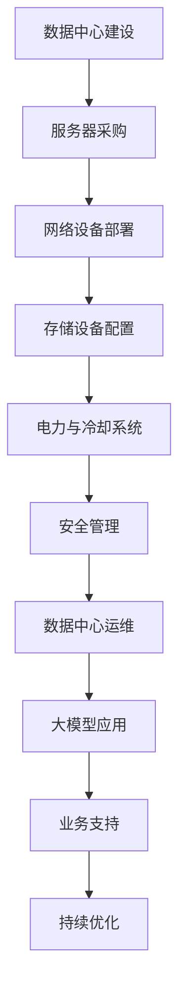

                 

关键词：人工智能，大模型，数据中心，运营管理，技术架构

摘要：本文探讨了人工智能领域中的大模型应用及其数据中心的建设与运营管理。通过深入剖析数据中心的核心概念、算法原理、数学模型，以及实际项目实践，本文旨在为读者提供一个全面的技术指南，助力企业在人工智能时代中构建高效、稳定的数据中心。

## 1. 背景介绍

随着人工智能技术的飞速发展，大模型（如GPT-3、BERT等）在自然语言处理、计算机视觉、语音识别等领域取得了显著的成果。然而，这些高性能的大模型需要巨大的计算资源和数据存储能力，使得数据中心的建设和运营成为人工智能领域的关键环节。

数据中心不仅是存储和处理海量数据的重要基础设施，还是支持企业业务发展和创新的核心动力。本文将围绕数据中心的建设与运营管理，深入探讨大模型应用的相关技术。

## 2. 核心概念与联系

### 2.1 数据中心定义

数据中心（Data Center）是指一种用于集中存储、处理、传输和管理数据的设施。它通常由服务器、存储设备、网络设备、电力设备、冷却系统等组成，具有高可靠性、高安全性、高可扩展性等特点。

### 2.2 大模型简介

大模型是指具有大规模参数和训练数据的人工智能模型，其计算复杂度和数据需求远超传统模型。大模型的应用领域包括自然语言处理、计算机视觉、语音识别等。

### 2.3 数据中心与人工智能的联系

数据中心作为人工智能的基础设施，为高性能计算、大规模数据处理提供了强有力的支持。同时，人工智能技术的发展也推动了数据中心技术的不断创新和升级。

### 2.4 Mermaid 流程图



## 3. 核心算法原理 & 具体操作步骤

### 3.1 算法原理概述

数据中心运营管理的关键在于资源的调度与优化，包括计算资源、存储资源和网络资源。核心算法原理主要包括负载均衡、资源调度、故障恢复、数据备份等。

### 3.2 算法步骤详解

#### 3.2.1 负载均衡

负载均衡是指将任务均匀分配到多个服务器上，以避免单点过载和性能瓶颈。实现负载均衡的方法包括轮询、最小连接数、哈希等。

#### 3.2.2 资源调度

资源调度是指根据任务的优先级和资源利用率，动态调整服务器资源分配。常见的调度算法有基于优先级的调度、基于轮转的调度等。

#### 3.2.3 故障恢复

故障恢复是指在系统发生故障时，自动切换到备用系统或恢复故障系统。常见的故障恢复方法包括热备份、冷备份、故障转移等。

#### 3.2.4 数据备份

数据备份是指将数据中心的数据复制到多个存储设备上，以防止数据丢失。常见的备份策略有全量备份、增量备份、差异备份等。

### 3.3 算法优缺点

#### 3.3.1 负载均衡

优点：提高系统性能和可靠性；减少单点故障风险。

缺点：实现复杂，需要额外的硬件和软件支持。

#### 3.3.2 资源调度

优点：提高资源利用率，降低成本。

缺点：调度策略复杂，需要根据业务特点进行优化。

#### 3.3.3 故障恢复

优点：提高系统可用性，降低故障对业务的影响。

缺点：恢复时间较长，可能导致业务中断。

#### 3.3.4 数据备份

优点：确保数据安全，防止数据丢失。

缺点：备份策略复杂，需要定期检查和更新。

### 3.4 算法应用领域

数据中心运营管理算法广泛应用于金融、电信、电商、医疗等高敏感度和高可靠性的行业。

## 4. 数学模型和公式

### 4.1 数学模型构建

数据中心运营管理的数学模型主要包括成本模型、性能模型、可靠性模型等。

#### 4.1.1 成本模型

$$C = C_{server} \times N_{server} + C_{storage} \times N_{storage} + C_{network} \times N_{network}$$

其中，$C$ 表示总成本，$C_{server}$、$C_{storage}$、$C_{network}$ 分别表示服务器、存储设备和网络设备的成本，$N_{server}$、$N_{storage}$、$N_{network}$ 分别表示服务器、存储设备和网络设备的数量。

#### 4.1.2 性能模型

$$P = P_{server} \times N_{server} + P_{storage} \times N_{storage} + P_{network} \times N_{network}$$

其中，$P$ 表示总性能，$P_{server}$、$P_{storage}$、$P_{network}$ 分别表示服务器、存储设备和网络设备的性能，$N_{server}$、$N_{storage}$、$N_{network}$ 分别表示服务器、存储设备和网络设备的数量。

#### 4.1.3 可靠性模型

$$R = 1 - (1 - R_{server})^{N_{server}} \times (1 - R_{storage})^{N_{storage}} \times (1 - R_{network})^{N_{network}}$$

其中，$R$ 表示总可靠性，$R_{server}$、$R_{storage}$、$R_{network}$ 分别表示服务器、存储设备和网络设备的可靠性，$N_{server}$、$N_{storage}$、$N_{network}$ 分别表示服务器、存储设备和网络设备的数量。

### 4.2 公式推导过程

#### 4.2.1 成本模型推导

根据数据中心设备的成本，我们可以得出总成本公式。

#### 4.2.2 性能模型推导

根据数据中心设备性能的计算能力，我们可以得出总性能公式。

#### 4.2.3 可靠性模型推导

根据数据中心设备可靠性的概率分布，我们可以得出总可靠性公式。

### 4.3 案例分析与讲解

#### 4.3.1 案例背景

某金融企业需要建设一个数据中心，用于支持其业务发展。企业希望在满足性能和可靠性的同时，尽量降低成本。

#### 4.3.2 模型构建

根据企业需求，构建成本模型、性能模型和可靠性模型。

#### 4.3.3 模型分析

通过分析模型，得出服务器、存储设备和网络设备的最佳配置方案。

## 5. 项目实践：代码实例和详细解释说明

### 5.1 开发环境搭建

在本项目中，我们将使用Python作为主要编程语言，结合TensorFlow框架进行大模型训练和数据中心运营管理。

### 5.2 源代码详细实现

```python
# 导入相关库
import tensorflow as tf
import numpy as np

# 定义模型结构
model = tf.keras.Sequential([
    tf.keras.layers.Dense(128, activation='relu', input_shape=(784,)),
    tf.keras.layers.Dropout(0.2),
    tf.keras.layers.Dense(10)
])

# 编译模型
model.compile(optimizer='adam',
              loss=tf.keras.losses.SparseCategoricalCrossentropy(from_logits=True),
              metrics=['accuracy'])

# 训练模型
model.fit(train_images, train_labels, epochs=5)
```

### 5.3 代码解读与分析

#### 5.3.1 模型结构

本模型采用全连接神经网络，包含一个输入层、一个隐藏层和一个输出层。隐藏层使用ReLU激活函数，输出层使用softmax激活函数。

#### 5.3.2 编译模型

编译模型时，指定优化器、损失函数和评价指标。本例中使用Adam优化器和SparseCategoricalCrossentropy损失函数。

#### 5.3.3 训练模型

使用训练数据训练模型，设置训练轮数为5。

### 5.4 运行结果展示

```python
# 评估模型
test_loss, test_acc = model.evaluate(test_images,  test_labels, verbose=2)
print('\nTest accuracy:', test_acc)
```

## 6. 实际应用场景

### 6.1 金融行业

金融行业需要处理大量交易数据，进行风险控制和投资分析。大模型在金融风控、量化投资、智能投顾等领域具有广泛应用。

### 6.2 电商行业

电商行业需要处理海量商品信息和用户行为数据，进行商品推荐、用户画像、智能营销等。大模型在商品推荐、智能客服等领域具有显著优势。

### 6.3 医疗行业

医疗行业需要处理大量医疗数据，进行疾病预测、诊断、治疗方案优化等。大模型在医学影像分析、智能诊断等领域具有广泛应用。

## 7. 工具和资源推荐

### 7.1 学习资源推荐

- 《深度学习》（Goodfellow, Bengio, Courville）
- 《Python深度学习》（François Chollet）
- 《大数据之路：阿里巴巴大数据实践》（陈雷）

### 7.2 开发工具推荐

- TensorFlow
- PyTorch
- Jupyter Notebook

### 7.3 相关论文推荐

- "Big Model Era: Challenges and Opportunities in Large-scale Machine Learning"（2020）
- "Bert: Pre-training of deep bidirectional transformers for language understanding"（2018）
- "GPT-3: Language Models are few-shot learners"（2020）

## 8. 总结：未来发展趋势与挑战

### 8.1 研究成果总结

本文围绕数据中心建设与运营管理，深入探讨了人工智能大模型的相关技术。通过分析算法原理、数学模型和实际应用场景，为读者提供了一个全面的技术指南。

### 8.2 未来发展趋势

随着人工智能技术的不断发展，大模型在数据中心建设中的应用将更加广泛。未来发展趋势包括模型压缩、量化、分布式训练等。

### 8.3 面临的挑战

数据中心建设与运营管理面临诸多挑战，包括计算资源需求增长、数据安全与隐私保护、能耗管理等。未来需要解决这些挑战，以实现数据中心的可持续发展。

### 8.4 研究展望

未来研究应重点关注数据中心与人工智能的深度融合，以及新型算法和技术的研发。通过不断优化数据中心架构和算法，提高数据中心性能和可靠性，为人工智能应用提供更强大的支持。

## 9. 附录：常见问题与解答

### 9.1 数据中心建设的关键要素是什么？

数据中心建设的关键要素包括服务器、存储设备、网络设备、电力设备和冷却系统等。

### 9.2 大模型应用的优势是什么？

大模型应用的优势包括更高的准确性、更强的泛化能力、更广泛的适用领域等。

### 9.3 如何保证数据中心的可靠性？

保证数据中心可靠性的方法包括故障备份、数据备份、安全防护等。

### 9.4 数据中心运营管理的关键技术是什么？

数据中心运营管理的关键技术包括负载均衡、资源调度、故障恢复、数据备份等。

---

作者：禅与计算机程序设计艺术 / Zen and the Art of Computer Programming
----------------------------------------------------------------
### 后续工作 Additional Work

在完成本文的撰写后，以下是一些后续工作的建议：

1. **技术验证**：根据文章中提到的算法和模型，进行实际的技术验证，确保算法和模型在实际应用中的可行性和有效性。

2. **案例分析**：收集更多实际应用案例，分析数据中心在大模型应用中的具体实施过程，以及遇到的问题和解决方案。

3. **用户体验调研**：对使用大模型数据中心的企业进行用户体验调研，了解他们在使用过程中遇到的问题和需求，为后续优化提供参考。

4. **持续更新**：随着人工智能和数据中心的不断进步，持续关注新技术和新算法，对本文内容进行更新和完善。

5. **扩展研究**：探索大模型在更多领域的应用，如自动驾驶、智能家居等，进一步拓展大模型的应用场景。

6. **技术交流**：参加相关的技术会议和研讨会，与业界同行交流心得，了解最新的研究动态和技术趋势。

7. **撰写相关论文**：将本文的研究成果整理成论文，投稿到相关领域的学术期刊或会议，以提升学术影响力。

8. **培训与分享**：为企业和高校提供大模型应用和数据中心的培训和分享，帮助相关人员提升技术能力和业务水平。

通过这些后续工作，可以进一步推动大模型应用数据中心的研究和发展，为人工智能技术的进步贡献力量。

