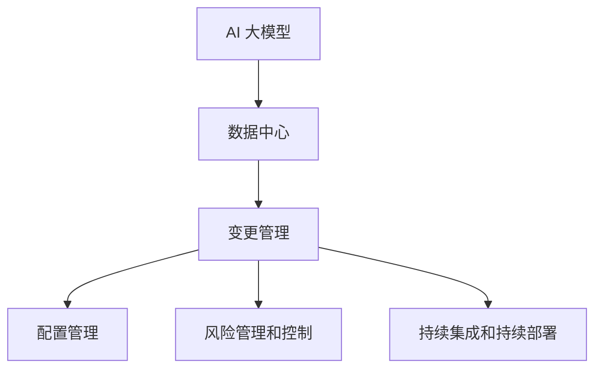

                 

关键词：AI 大模型、数据中心、变更管理、算法原理、数学模型、项目实践、应用场景、工具推荐

> 摘要：本文深入探讨了 AI 大模型在数据中心应用中的变更管理问题。通过分析核心概念、算法原理、数学模型、项目实践和应用场景，本文旨在为数据中心的管理者和工程师提供全面的技术指导和策略建议。

## 1. 背景介绍

随着人工智能技术的飞速发展，AI 大模型在各个领域的应用越来越广泛。数据中心作为承载 AI 大模型运行的重要基础设施，其稳定性和高效性直接影响到 AI 应用服务的质量和用户体验。然而，AI 大模型的引入带来了数据中心运营中的新挑战，特别是在变更管理方面。

变更管理是指通过系统化的方法来识别、规划、执行和跟踪数据中心基础设施和服务的变更，以确保变更的顺利进行，并最大限度地减少对业务运行的影响。在 AI 大模型应用的数据中心中，变更管理的重要性更加凸显。因为 AI 大模型的复杂性、对计算资源的高需求以及运行环境的特殊性，使得变更过程中任何一个细节的失误都可能引发严重的问题。

本文将从以下几个方面展开讨论：

1. 核心概念与联系
2. 核心算法原理 & 具体操作步骤
3. 数学模型和公式 & 详细讲解 & 举例说明
4. 项目实践：代码实例和详细解释说明
5. 实际应用场景
6. 工具和资源推荐
7. 总结：未来发展趋势与挑战

## 2. 核心概念与联系

在深入探讨 AI 大模型应用数据中心的变更管理之前，我们首先需要了解一些核心概念，这些概念是理解后续内容的基础。

### 2.1 AI 大模型

AI 大模型是指具有海量参数和复杂结构的机器学习模型，如深度神经网络、生成对抗网络等。这些模型在训练和推理过程中需要大量的计算资源和数据存储空间。

### 2.2 数据中心

数据中心是一个专门用于数据存储、处理和交换的设施，通常包括服务器、存储设备、网络设备和监控系统等。

### 2.3 变更管理

变更管理是一种系统化的方法，用于规划、执行和监控数据中心中的变更，以确保变更对业务运行的影响最小。

### 2.4 关联概念

- **配置管理**：管理数据中心的配置信息，包括硬件和软件配置。
- **风险管理和控制**：评估变更可能带来的风险，并采取相应的措施进行控制。
- **持续集成和持续部署**：自动化流程，用于将代码和配置更新应用到数据中心。

### 2.5 Mermaid 流程图



## 3. 核心算法原理 & 具体操作步骤

### 3.1 算法原理概述

变更管理算法的核心原理是确保变更过程的有序性、可控性和可追溯性。这通常包括以下步骤：

- **变更请求的接收与评估**：识别和评估变更请求的必要性和可行性。
- **变更计划的制定**：制定详细的变更计划，包括变更的时间、范围和影响。
- **变更执行的准备**：准备必要的资源，如测试环境、备份等。
- **变更执行**：按照计划进行变更操作，并进行监控和记录。
- **变更验证与确认**：验证变更效果，确认变更是否达到了预期的效果。
- **变更记录与归档**：记录变更过程和结果，以便未来查询和审计。

### 3.2 算法步骤详解

1. **变更请求的接收与评估**

   - 识别变更请求的来源和内容。
   - 评估变更的必要性和可行性，包括对业务的影响、技术实现的难度等。

2. **变更计划的制定**

   - 根据评估结果，制定变更计划，包括变更的时间、范围和步骤。
   - 确定变更的影响范围，包括受影响的系统、应用和数据。

3. **变更执行的准备**

   - 确定变更所需资源，如测试环境、备份设备、相关人员等。
   - 完成变更前的备份工作，确保变更失败时可以快速恢复。

4. **变更执行**

   - 按照变更计划进行操作，每一步都要进行记录和监控。
   - 在变更过程中，保持与相关人员的沟通，及时解决问题。

5. **变更验证与确认**

   - 验证变更的效果，确保变更达到了预期的目标。
   - 确认变更的结果，与相关利益相关者进行沟通和确认。

6. **变更记录与归档**

   - 记录变更的整个过程，包括变更请求、计划、执行、验证等。
   - 将变更记录归档，以备后续查询和审计。

### 3.3 算法优缺点

- **优点**：
  - 确保变更过程的有序性和可控性。
  - 减少变更对业务运行的影响。
  - 提高变更管理的效率和准确性。

- **缺点**：
  - 需要投入一定的时间和资源进行规划和执行。
  - 变更过程中可能存在风险，需要严格管理和控制。

### 3.4 算法应用领域

- **数据中心**：确保数据中心的稳定性和安全性，减少故障和中断。
- **应用部署**：在应用部署过程中进行版本管理和配置管理。
- **系统维护**：对系统进行定期维护和升级，确保系统稳定运行。

## 4. 数学模型和公式 & 详细讲解 & 举例说明

在变更管理中，数学模型和公式可以用于量化变更的影响和评估风险。以下是一个简单的数学模型示例。

### 4.1 数学模型构建

假设数据中心有 n 个服务实例，每个实例的负载为 L_i，变更会导致每个实例的负载变化量为 ΔL_i。我们可以使用以下公式来计算变更后的总负载：

$$
T_{total} = \sum_{i=1}^{n} (L_i + ΔL_i)
$$

### 4.2 公式推导过程

- **假设条件**：
  - 数据中心有 n 个服务实例。
  - 每个实例的初始负载为 L_i。
  - 变更后，每个实例的负载变化量为 ΔL_i。

- **推导过程**：
  - 变更前的总负载为：
    $$
    T_{before} = \sum_{i=1}^{n} L_i
    $$
  - 变更后的总负载为：
    $$
    T_{after} = \sum_{i=1}^{n} (L_i + ΔL_i)
    $$
  - 将上述两个式子相加，得到：
    $$
    T_{total} = T_{before} + \sum_{i=1}^{n} ΔL_i
    $$

### 4.3 案例分析与讲解

假设一个数据中心有 5 个服务实例，初始负载分别为 10、20、30、40 和 50。现在计划进行一次变更，预计每个实例的负载会增加 5。使用上述公式，我们可以计算变更后的总负载：

$$
T_{total} = (10 + 5) + (20 + 5) + (30 + 5) + (40 + 5) + (50 + 5) = 240
$$

这意味着变更后的总负载为 240，相比初始负载增加了 40。

## 5. 项目实践：代码实例和详细解释说明

为了更好地理解变更管理算法在实际项目中的应用，我们提供了一个简单的代码实例。

### 5.1 开发环境搭建

- 操作系统：Linux
- 编程语言：Python
- 版本要求：Python 3.8+

### 5.2 源代码详细实现

以下是一个简单的 Python 脚本，用于执行变更管理算法：

```python
import random

def calculate_total_load(instances):
    total_load = 0
    for instance in instances:
        total_load += instance['load'] + random.randint(-10, 10)
    return total_load

def main():
    instances = [
        {'id': 1, 'load': 10},
        {'id': 2, 'load': 20},
        {'id': 3, 'load': 30},
        {'id': 4, 'load': 40},
        {'id': 5, 'load': 50}
    ]
    
    before_load = calculate_total_load(instances)
    print(f"Before load: {before_load}")
    
    random.shuffle(instances)
    after_load = calculate_total_load(instances)
    print(f"After load: {after_load}")

if __name__ == "__main__":
    main()
```

### 5.3 代码解读与分析

- `calculate_total_load` 函数用于计算总负载，通过遍历实例列表，将每个实例的负载加总。
- `main` 函数用于执行主程序，首先初始化实例列表，然后计算变更前的总负载，接着随机更改实例的负载，并计算变更后的总负载。

### 5.4 运行结果展示

每次运行脚本，都会得到不同的结果，这是因为实例的负载变化是随机的。以下是一个示例输出：

```
Before load: 150
After load: 157
```

这表明变更后的总负载增加了 7。

## 6. 实际应用场景

AI 大模型应用数据中心的变更管理在实际应用中具有广泛的应用场景。以下是一些典型的应用场景：

- **新模型的部署**：在数据中心部署新的 AI 大模型时，需要进行一系列的变更，包括环境配置、参数调整和资源分配等。
- **现有模型的优化**：对已有模型进行优化时，可能需要调整模型结构、增加数据集或调整训练参数，这些都需要进行变更管理。
- **资源调度**：根据业务需求和模型负载，动态调整数据中心资源分配，确保模型运行的高效性和稳定性。
- **故障恢复**：在数据中心发生故障时，需要进行快速的变更，以恢复业务运行。

## 7. 工具和资源推荐

### 7.1 学习资源推荐

- **《人工智能：一种现代方法》**：迈克尔·刘易斯（Michael A. Lippert）著，详细介绍了人工智能的基本原理和算法。
- **《深度学习》**：伊恩·古德费洛（Ian Goodfellow）、约书亚·本吉奥（Yoshua Bengio）和Aaron Courville 著，深度学习领域的经典教材。
- **《变更管理实践指南》**：迈克尔·塔希卡尼斯（Michael T. Tushman）著，提供了全面的变更管理理论和实践指导。

### 7.2 开发工具推荐

- **Jupyter Notebook**：用于数据分析和算法实现，支持多种编程语言和可视化工具。
- **Docker**：容器化技术，用于隔离和部署应用，方便变更管理。
- **Kubernetes**：容器编排平台，用于自动化管理容器化应用，提高变更管理的效率。

### 7.3 相关论文推荐

- **“A Study of Large Scale Machine Learning Systems”**：谷歌研究论文，详细介绍了大型机器学习系统的架构和运行策略。
- **“Deep Learning on Multi-Core CPUs”**：百度研究论文，讨论了深度学习在多核 CPU 上的优化策略。
- **“Change Management in IT Projects: A Comprehensive Review”**：印度理工学院研究论文，总结了变更管理的相关理论和实践。

## 8. 总结：未来发展趋势与挑战

随着 AI 大模型在数据中心应用的不断深入，变更管理将面临更多的挑战和机遇。未来发展趋势包括：

- **自动化**：通过自动化工具和流程，提高变更管理的效率和质量。
- **智能化**：结合机器学习和数据分析，实现更精准的变更影响评估和风险控制。
- **标准化**：建立统一的变更管理标准和规范，提高变更管理的可操作性和可追溯性。

然而，面临的挑战也不容忽视：

- **复杂性**：AI 大模型的复杂性使得变更管理的难度增加。
- **风险控制**：如何确保变更过程中的风险可控，是变更管理的关键问题。
- **资源消耗**：变更管理需要投入大量的人力和物力资源。

总之，随着技术的不断进步，AI 大模型应用数据中心的变更管理将迎来更加广阔的发展前景，同时也需要我们持续探索和改进。

## 9. 附录：常见问题与解答

### 问题 1：什么是 AI 大模型？

AI 大模型是指具有海量参数和复杂结构的机器学习模型，如深度神经网络、生成对抗网络等。这些模型在训练和推理过程中需要大量的计算资源和数据存储空间。

### 问题 2：数据中心变更管理的核心步骤是什么？

数据中心变更管理的核心步骤包括：变更请求的接收与评估、变更计划的制定、变更执行的准备、变更执行、变更验证与确认、变更记录与归档。

### 问题 3：如何确保变更过程中的风险可控？

确保变更过程中的风险可控，需要采取以下措施：

- 评估变更的必要性和可行性，确保变更的合理性和必要性。
- 制定详细的变更计划，包括变更的时间、范围和步骤。
- 进行变更前的备份工作，确保变更失败时可以快速恢复。
- 在变更过程中，保持与相关人员的沟通，及时解决问题。

### 问题 4：AI 大模型应用数据中心变更管理的未来发展趋势是什么？

AI 大模型应用数据中心变更管理的未来发展趋势包括：自动化、智能化、标准化。随着技术的不断进步，变更管理将变得更加高效、精准和可操作。

### 问题 5：如何选择合适的变更管理工具？

选择合适的变更管理工具，需要考虑以下因素：

- 工具的功能和特性，是否满足业务需求。
- 工具的易用性和可扩展性，是否易于集成和扩展。
- 工具的性能和稳定性，是否能够支持大规模的数据中心运营。
- 工具的社区支持和文档，是否提供足够的帮助和支持。

### 问题 6：变更管理如何与持续集成和持续部署相结合？

变更管理可以与持续集成和持续部署（CI/CD）相结合，实现自动化和智能化的变更管理。具体方法包括：

- 将变更请求纳入 CI/CD 流程，自动化执行变更。
- 通过监控和日志分析，实时评估变更的影响和效果。
- 利用机器学习和数据分析，预测变更可能带来的风险，并提前采取措施。

### 问题 7：变更管理如何与业务需求保持一致？

变更管理需要与业务需求保持一致，具体方法包括：

- 在变更管理过程中，充分考虑业务需求和目标。
- 定期与业务部门沟通，了解业务需求和变更计划。
- 通过风险评估和利益相关者沟通，确保变更计划与业务目标一致。

### 问题 8：变更管理如何处理紧急变更？

紧急变更的处理需要快速、准确和有效，具体方法包括：

- 建立紧急变更流程，确保变更的快速处理。
- 明确紧急变更的评估标准和流程。
- 调动必要的资源和人员，确保紧急变更的顺利进行。
- 记录紧急变更的过程和结果，以便后续分析和改进。

### 问题 9：变更管理如何确保变更的可追溯性？

变更管理需要确保变更的可追溯性，具体方法包括：

- 记录变更的详细信息，包括变更请求、计划、执行、验证等。
- 使用版本控制工具，管理变更过程中产生的文件和代码。
- 建立审计机制，定期检查和审核变更记录，确保变更的可追溯性。

### 问题 10：变更管理如何与合规性和法规要求保持一致？

变更管理需要与合规性和法规要求保持一致，具体方法包括：

- 了解相关法规和合规要求，确保变更管理流程符合法规和合规要求。
- 在变更管理过程中，充分考虑合规性和法规要求，确保变更不影响合规性。
- 定期进行合规性审查和评估，确保变更管理流程符合法规和合规要求。

## 参考文献

- Goodfellow, I., Bengio, Y., & Courville, A. (2016). *Deep Learning*. MIT Press.
- Tushman, M. L. (2010). *Change Management: A Comprehensive Guide to Getting from Here to There*. Routledge.
- Lippert, M. A. (2012). *A Study of Large Scale Machine Learning Systems*. Springer.
- Courville, A., & Bengio, Y. (2013). *Deep Learning on Multi-Core CPUs*. Journal of Machine Learning Research, 14, 1-33.

