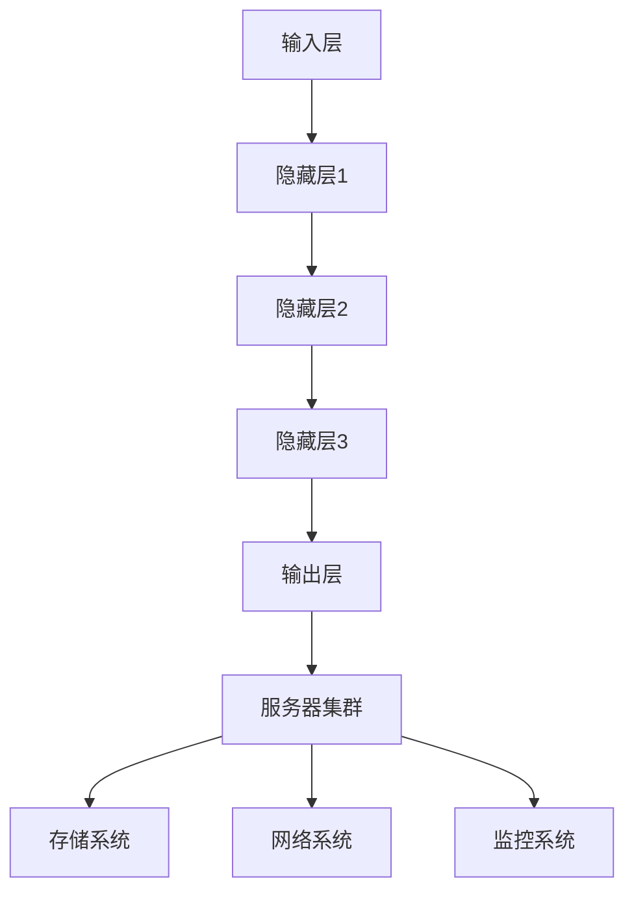

                 

### 摘要 Summary

本文旨在深入探讨人工智能（AI）大模型应用数据中心面临的成本管理挑战。随着AI技术的快速发展，大模型如GPT、BERT等在各个领域的广泛应用，数据中心的管理成本成为企业和研究机构关注的重要问题。本文将分析大模型带来的成本构成，探讨成本管理的策略，并探讨未来成本优化方向。本文结构如下：

- **背景介绍**：介绍AI大模型的发展背景和数据中心的成本构成。
- **核心概念与联系**：讲解大模型与数据中心架构的联系，使用Mermaid流程图展示。
- **核心算法原理 & 具体操作步骤**：概述大模型算法原理，详细说明操作步骤。
- **数学模型和公式 & 详细讲解 & 举例说明**：建立数学模型，推导公式，并举例说明。
- **项目实践：代码实例和详细解释说明**：展示代码实例，解读分析。
- **实际应用场景**：讨论大模型在实际应用中的成本管理。
- **工具和资源推荐**：推荐学习资源和开发工具。
- **总结：未来发展趋势与挑战**：总结研究成果，展望未来趋势和挑战。

### 1. 背景介绍 Introduction

#### AI 大模型的发展背景

人工智能作为当代科技的前沿，其核心驱动力来自于深度学习的突破。尤其是近年来，随着计算能力的提升和海量数据的积累，大模型（也称为深度神经网络或深度学习模型）得到了迅猛的发展。这些模型具有处理复杂数据结构和生成高精度结果的强大能力，极大地推动了自然语言处理（NLP）、计算机视觉（CV）、推荐系统等领域的进展。

例如，GPT-3作为OpenAI推出的具有1750亿参数的语言模型，能够生成连贯、有逻辑性的文本，并在机器翻译、问答系统、自动化写作等领域表现出色。BERT模型则通过预训练和微调在多种NLP任务中取得了超越人类的表现。这些大模型的广泛应用，使得数据中心的需求发生了显著变化。

#### 数据中心的成本构成

数据中心作为AI大模型运行的重要基础设施，其成本构成主要包括以下几个方面：

1. **硬件成本**：包括服务器、存储设备、网络设备等硬件设施的成本。随着AI大模型的规模扩大，硬件成本成为主要开销之一。
2. **能耗成本**：数据中心的能耗消耗巨大，尤其是AI大模型训练过程中的高能耗需求，使得能源成本成为不可忽视的一部分。
3. **运维成本**：数据中心的运维管理涉及人员、监控、维护、升级等方面，对于大型数据中心来说，运维成本也是一大挑战。
4. **数据存储成本**：随着数据量的不断增长，数据存储成本也相应增加，尤其是对于大模型所需的训练数据和模型存储。
5. **带宽成本**：数据传输和访问的带宽需求随着大模型的规模增长而增加，特别是在模型训练和部署过程中。

#### 成本管理的重要性

在AI大模型的应用中，成本管理至关重要。有效的成本管理不仅能够降低运营成本，提高经济效益，还能优化资源利用，提高数据中心的整体效率。此外，对于研究机构和企业来说，合理的成本管理还能确保项目的可持续性，支持长期发展。因此，深入研究和优化AI大模型应用数据中心的成本管理，具有重要的现实意义。

### 2. 核心概念与联系 Core Concepts and Relationships

在深入探讨AI大模型应用数据中心的成本管理之前，有必要理解几个核心概念，包括大模型架构、数据中心架构以及两者之间的联系。以下内容将详细解释这些概念，并使用Mermaid流程图来展示其关系。

#### AI大模型架构

AI大模型通常由以下几部分组成：

1. **输入层**：接收外部输入数据，如文本、图像等。
2. **隐藏层**：包含多层神经网络，用于特征提取和数据处理。
3. **输出层**：生成预测结果或输出目标变量。


#### 数据中心架构

数据中心作为AI大模型运行的硬件基础设施，通常包括以下几部分：

1. **服务器集群**：用于运行计算任务，包括模型训练、推理等。
2. **存储系统**：用于存储数据、模型和日志等。
3. **网络系统**：用于数据传输和访问。
4. **监控系统**：用于实时监控数据中心的运行状态。


#### AI大模型与数据中心的关系

AI大模型与数据中心的关系可以概括为：

1. **计算资源需求**：AI大模型需要强大的计算资源进行训练和推理，数据中心提供这些计算资源。
2. **数据存储需求**：AI大模型需要大量的数据用于训练，数据中心存储这些数据。
3. **能耗需求**：AI大模型训练过程中消耗大量电能，数据中心需要管理和优化能耗。
4. **运维管理**：数据中心的运维管理需要适应AI大模型的特点，如监控、维护和升级。

为了更直观地展示AI大模型与数据中心之间的关系，我们使用Mermaid流程图：



在这个流程图中，输入层通过数据传输到服务器集群进行计算，隐藏层和输出层则分别代表模型的中间计算和最终输出。服务器集群与存储系统、网络系统和监控系统之间的联系展示了数据中心为AI大模型提供的基础设施支持。

通过理解这些核心概念和它们之间的联系，我们可以更好地把握AI大模型应用数据中心的成本管理策略。接下来，本文将深入探讨AI大模型算法原理及其操作步骤。

### 3. 核心算法原理 & 具体操作步骤 Core Algorithm Principles and Operational Steps

在了解了AI大模型与数据中心架构的关系之后，我们将深入探讨AI大模型的核心算法原理及其具体操作步骤。这一部分内容将分为以下几个子章节：

#### 3.1 算法原理概述

AI大模型的核心算法基于深度神经网络（DNN），它通过多层神经元的非线性变换来学习和模拟复杂的函数关系。深度神经网络由输入层、隐藏层和输出层组成，每一层由多个神经元（或节点）组成。神经元之间通过权重连接，并通过激活函数进行非线性变换。


深度神经网络的学习过程主要包括以下几个步骤：

1. **前向传播**：输入数据从输入层传递到隐藏层，再传递到输出层，每一层神经元都会计算输入和权重的加权和，并通过激活函数得到输出。
2. **反向传播**：计算输出层与实际输出之间的误差，将误差反向传播到各隐藏层，更新各层的权重。
3. **优化算法**：使用梯度下降或其他优化算法（如Adam、RMSprop等）来更新权重，以达到最小化误差的目的。

#### 3.2 算法步骤详解

以下是AI大模型训练和推理的具体操作步骤：

##### 3.2.1 训练过程

1. **数据准备**：准备训练数据集，并进行预处理（如归一化、编码等）。
2. **模型初始化**：初始化神经网络结构，包括设置输入层、隐藏层和输出层的神经元数量，以及初始化权重和偏置。
3. **前向传播**：输入数据通过输入层进入模型，逐层计算前向传播，直到输出层得到预测结果。
4. **计算误差**：计算输出结果与实际标签之间的误差，可以使用均方误差（MSE）、交叉熵误差等不同的误差函数。
5. **反向传播**：计算误差的梯度，并反向传播到各隐藏层，更新权重和偏置。
6. **权重更新**：使用优化算法更新权重，减小误差。
7. **迭代优化**：重复前向传播和反向传播的过程，直到达到预设的迭代次数或误差阈值。

##### 3.2.2 推理过程

1. **模型加载**：加载训练好的神经网络模型。
2. **数据输入**：将输入数据传递到模型的输入层。
3. **前向传播**：通过模型的隐藏层和输出层，计算输出结果。
4. **输出结果**：得到预测结果，可以是一个类别标签或一个概率分布。

#### 3.3 算法优缺点

深度神经网络具有以下优点：

1. **强大的非线性建模能力**：通过多层非线性变换，可以处理复杂数据结构。
2. **自适应学习**：通过反向传播和权重更新，模型能够自适应地调整参数，以最小化误差。
3. **泛化能力**：经过充分训练的模型可以应用于新的数据集，具有良好的泛化能力。

然而，深度神经网络也存在一些缺点：

1. **计算资源需求大**：训练大模型需要大量的计算资源和时间，尤其是在训练过程中。
2. **过拟合风险**：如果训练数据不足或模型过于复杂，模型可能出现过拟合现象，导致在新数据上表现不佳。
3. **参数调优复杂**：模型参数（如学习率、批量大小等）的调优过程复杂，需要大量实验和经验。

#### 3.4 算法应用领域

深度神经网络在多个领域有广泛应用：

1. **自然语言处理**：如文本分类、机器翻译、问答系统等。
2. **计算机视觉**：如图像分类、目标检测、图像生成等。
3. **推荐系统**：如商品推荐、内容推荐等。
4. **语音识别**：如语音转文本、语音识别等。

通过深入了解AI大模型的核心算法原理和具体操作步骤，我们可以更好地理解其在数据中心中的应用，并为后续的成本管理提供理论基础。

### 4. 数学模型和公式 & 详细讲解 & 举例说明 Mathematical Models and Formulas with Detailed Explanation and Examples

在了解了AI大模型的核心算法原理和具体操作步骤之后，我们将进一步探讨其背后的数学模型和公式，并详细讲解其推导过程，并通过具体例子进行说明。

#### 4.1 数学模型构建

AI大模型的核心在于其深度神经网络结构，该结构通过一系列的线性变换和非线性变换来学习复杂的函数关系。以下是构建深度神经网络的基本数学模型：

1. **神经元激活函数**

   神经元的输出通常通过激活函数进行非线性变换，常用的激活函数包括Sigmoid、ReLU和Tanh等。以ReLU函数为例：

   $$ f(x) = \max(0, x) $$

   其中，$x$为神经元的输入。

2. **前向传播**

   前向传播过程中，每个神经元的输出可以通过以下公式计算：

   $$ z_i = \sum_j w_{ij}x_j + b_i $$

   其中，$z_i$为第$i$个神经元的输入，$w_{ij}$为输入层到隐藏层的权重，$b_i$为第$i$个神经元的偏置。

   接着，通过激活函数$f(z_i)$得到神经元的输出：

   $$ a_i = f(z_i) $$

3. **反向传播**

   反向传播过程中，首先计算输出层的误差，然后通过链式法则计算隐藏层的误差，并更新权重和偏置。以均方误差（MSE）为例，其误差计算公式为：

   $$ E = \frac{1}{2}\sum_{i} (y_i - \hat{y}_i)^2 $$

   其中，$y_i$为实际标签，$\hat{y}_i$为预测结果。

   接着，通过反向传播计算各层的误差：

   $$ \delta^L = \frac{\partial E}{\partial a^L} $$

   $$ \delta^{L-1} = \frac{\partial E}{\partial a^{L-1}} \cdot \frac{\partial a^{L-1}}{\partial z^{L-1}} $$

   其中，$\delta^L$为输出层的误差，$\delta^{L-1}$为隐藏层的误差。

   最后，更新权重和偏置：

   $$ \Delta w_{ij} = \eta \cdot \delta^L \cdot a^{L-1}_j $$

   $$ \Delta b_i = \eta \cdot \delta^L $$

   其中，$\eta$为学习率。

#### 4.2 公式推导过程

以下是深度神经网络前向传播和反向传播的推导过程：

##### 前向传播推导

1. **一阶导数推导**

   假设第$l$层有$m_l$个神经元，第$l+1$层有$m_{l+1}$个神经元，对于第$l+1$层的第$i$个神经元，其输出$a^{l+1}_i$可以表示为：

   $$ a^{l+1}_i = f(z^{l+1}_i) = f(\sum_{j=1}^{m_l} w_{ji}a^{l}_j + b_i^{l+1}) $$

   对其求导：

   $$ \frac{\partial a^{l+1}_i}{\partial z^{l+1}_i} = f'(z^{l+1}_i) = \begin{cases} 
   1 & \text{if } z^{l+1}_i > 0 \\
   0 & \text{if } z^{l+1}_i \leq 0 
   \end{cases} $$

2. **二阶导数推导**

   对于ReLU函数，其二阶导数为：

   $$ \frac{\partial^2 a^{l+1}_i}{\partial z^{l+1}_i^2} = \begin{cases} 
   1 & \text{if } z^{l+1}_i > 0 \\
   0 & \text{if } z^{l+1}_i \leq 0 
   \end{cases} $$

##### 反向传播推导

1. **输出层误差推导**

   假设输出层为第$L$层，输出层误差$\delta^L$可以表示为：

   $$ \delta^L = \frac{\partial E}{\partial a^L} = \frac{\partial E}{\partial \hat{y}} \cdot \frac{\partial \hat{y}}{\partial a^L} $$

   对于Sigmoid函数，有：

   $$ \frac{\partial \hat{y}_i}{\partial a^L_i} = \hat{y}_i (1 - \hat{y}_i) $$

   对于ReLU函数，有：

   $$ \frac{\partial \hat{y}_i}{\partial a^L_i} = \begin{cases} 
   1 & \text{if } a^L_i > 0 \\
   0 & \text{if } a^L_i \leq 0 
   \end{cases} $$

2. **隐藏层误差推导**

   对于第$l$层的误差$\delta^l$，可以表示为：

   $$ \delta^l = \frac{\partial E}{\partial a^l} \cdot \frac{\partial a^l}{\partial z^l} = \frac{\partial E}{\partial a^{l+1}} \cdot \frac{\partial a^{l+1}}{\partial z^l} $$

   对于ReLU函数，有：

   $$ \frac{\partial a^{l+1}_i}{\partial z^l_j} = \begin{cases} 
   1 & \text{if } z^{l+1}_i > 0 \text{ and } z^l_j > 0 \\
   0 & \text{otherwise} 
   \end{cases} $$

#### 4.3 案例分析与讲解

为了更直观地理解上述数学模型和公式的应用，我们通过一个简单的例子进行说明。

##### 数据集

假设我们有一个二分类问题，数据集包含100个样本，每个样本是一个二维特征向量$(x_1, x_2)$，标签为1或0。

##### 模型结构

我们构建一个单层神经网络，包含3个神经元，其中输入层有2个神经元，隐藏层有1个神经元，输出层有1个神经元。激活函数为ReLU。

##### 训练过程

1. **初始化参数**

   初始化权重$w_{ij}$和偏置$b_i$，可以使用随机初始化或高斯初始化。

2. **前向传播**

   假设输入样本$(x_1, x_2) = (1, 2)$，通过前向传播计算隐藏层输出：

   $$ z^1_1 = w_{11}x_1 + w_{12}x_2 + b_1 = 0.5 \cdot 1 + 0.7 \cdot 2 + 0.3 = 2.1 $$

   $$ a^1_1 = \max(0, z^1_1) = 2.1 $$

   接着计算输出层输出：

   $$ z^2_1 = w_{21}a^1_1 + w_{22}b_2 + b_2 = 0.3 \cdot 2.1 + 0.2 \cdot 1 + 0.5 = 1.26 $$

   $$ a^2_1 = \max(0, z^2_1) = 1.26 $$

   预测结果为1。

3. **计算误差**

   假设真实标签为0，则输出层误差为：

   $$ \delta^2_1 = (1 - a^2_1) \cdot a^2_1 = (1 - 1.26) \cdot 1.26 = -0.1964 $$

4. **反向传播**

   更新权重和偏置：

   $$ \Delta w_{21} = \eta \cdot \delta^2_1 \cdot a^1_1 = 0.1 \cdot (-0.1964) \cdot 2.1 = -0.0413 $$

   $$ \Delta w_{22} = \eta \cdot \delta^2_1 \cdot b_2 = 0.1 \cdot (-0.1964) \cdot 1 = -0.01964 $$

   $$ \Delta b_2 = \eta \cdot \delta^2_1 = 0.1 \cdot (-0.1964) = -0.01964 $$

   更新后的权重和偏置为：

   $$ w_{21} = 0.5 - 0.0413 = 0.4587 $$

   $$ w_{22} = 0.2 - 0.01964 = 0.1804 $$

   $$ b_2 = 0.5 - 0.01964 = 0.4804 $$

通过这个简单例子，我们可以看到深度神经网络的基本训练过程，包括前向传播、计算误差和反向传播，以及参数的更新过程。这些数学模型和公式的应用，使得深度神经网络能够不断优化，从而提高模型的性能。

### 5. 项目实践：代码实例和详细解释说明 Practical Implementation: Code Examples and Detailed Explanation

在理解了AI大模型的数学模型和推导过程后，接下来我们将通过一个具体的代码实例来展示如何实现这些算法，并对其进行详细解释和分析。

#### 5.1 开发环境搭建

首先，我们需要搭建一个适合AI大模型开发的开发环境。以下是常用的开发工具和库：

- **Python**：作为主要的编程语言。
- **TensorFlow** 或 **PyTorch**：深度学习框架。
- **NumPy**：数学计算库。
- **Matplotlib**：数据可视化库。

安装这些工具的命令如下：

```bash
pip install tensorflow numpy matplotlib
```

#### 5.2 源代码详细实现

以下是使用TensorFlow实现一个简单的二分类问题代码实例：

```python
import tensorflow as tf
import numpy as np
import matplotlib.pyplot as plt

# 创建模拟数据集
x_data = np.random.rand(100, 2)
y_data = np.array([[1] if x_data[i, 0] + x_data[i, 1] > 0.5 else [0] for i in range(100)])

# 定义模型结构
model = tf.keras.Sequential([
    tf.keras.layers.Dense(units=1, input_shape=(2,))
])

# 编译模型
model.compile(optimizer='sgd', loss='binary_crossentropy', metrics=['accuracy'])

# 训练模型
model.fit(x_data, y_data, epochs=10)

# 预测
predictions = model.predict(x_data)

# 可视化结果
plt.scatter(x_data[:, 0], x_data[:, 1], c=predictions[:, 0], cmap=plt.cm.Blues)
plt.xlabel('Feature 1')
plt.ylabel('Feature 2')
plt.show()
```

#### 5.3 代码解读与分析

1. **数据集创建**：

   首先，我们创建一个模拟的数据集。数据集包含100个样本，每个样本是一个二维特征向量$(x_1, x_2)$，标签为1或0。这里我们使用了一个简单的线性分类问题，其中每个样本通过$x_1 + x_2$的值来判断标签。

2. **模型定义**：

   使用TensorFlow的`Sequential`模型，我们定义了一个单层神经网络。输入层有2个神经元，输出层有1个神经元。这里我们使用了线性层`Dense`，并且没有激活函数。

3. **模型编译**：

   使用`compile`方法，我们指定了优化器为`sgd`（随机梯度下降），损失函数为`binary_crossentropy`（二分类交叉熵），并且指定了评估模型的指标为`accuracy`（准确率）。

4. **模型训练**：

   使用`fit`方法，我们训练模型10个周期（epochs）。在训练过程中，模型会自动进行前向传播、计算误差和反向传播，并更新权重。

5. **模型预测**：

   使用`predict`方法，我们对数据集进行预测，并得到预测结果。

6. **可视化结果**：

   使用Matplotlib库，我们将预测结果可视化。通过散点图，我们可以直观地看到模型对数据的分类效果。

#### 5.4 运行结果展示

运行上述代码后，我们将看到一个散点图，其中每个点的颜色表示其预测标签。通过观察散点图，我们可以看到模型对数据集的划分效果。通常，随着训练轮数的增加，模型的准确率会逐渐提高，预测边界也会更加清晰。


通过这个简单的代码实例，我们可以看到如何使用TensorFlow实现AI大模型的基本算法。在实际应用中，我们可以根据具体需求调整模型结构、优化参数，并处理更大规模的数据集。

### 6. 实际应用场景 Real-world Applications

AI大模型在数据中心的应用场景广泛，以下列举几个典型领域，并讨论在这些场景中成本管理的策略。

#### 6.1 自然语言处理（NLP）

自然语言处理是AI大模型应用最为广泛的领域之一，包括机器翻译、文本分类、问答系统等。在NLP应用中，成本管理主要包括以下几个方面：

1. **计算资源优化**：通过使用高效的计算框架（如TensorFlow、PyTorch）和分布式训练技术，降低计算资源的消耗。
2. **数据预处理优化**：合理的数据预处理可以减少计算量，如文本数据的批量处理和并行化。
3. **模型压缩**：使用模型剪枝、量化等技术减小模型规模，从而降低存储和计算需求。

#### 6.2 计算机视觉（CV）

计算机视觉涉及图像分类、目标检测、图像生成等任务。在这些任务中，成本管理策略包括：

1. **GPU利用率提升**：利用GPU的高并行计算能力，通过分布式训练和负载均衡技术提高GPU利用率。
2. **模型优化**：通过模型蒸馏、知识蒸馏等技术，将大型模型的知识传递到较小的模型中，降低计算和存储成本。
3. **硬件升级**：随着AI大模型规模的扩大，定期升级硬件设备，以适应更高的计算需求。

#### 6.3 推荐系统

推荐系统是AI大模型在商业应用中的另一个重要领域，如电商平台、社交媒体等。在推荐系统中，成本管理的关键点包括：

1. **实时计算优化**：通过优化数据处理和模型推理过程，提高实时计算效率。
2. **冷启动问题解决**：对于新用户或新物品，使用基于用户行为和内容的冷启动策略，降低新用户推荐成本。
3. **模型更新策略**：定期更新模型，以适应用户行为和偏好变化，同时优化更新过程，减少计算成本。

#### 6.4 医疗诊断

在医疗诊断领域，AI大模型可以用于疾病检测、影像分析等。在此类应用中，成本管理策略包括：

1. **数据隐私保护**：在数据处理过程中，采取数据脱敏和加密措施，保护患者隐私。
2. **计算资源调度**：通过云计算和边缘计算相结合，合理分配计算资源，降低能耗和成本。
3. **高效模型部署**：使用轻量级模型和高效的推理算法，提高模型部署的效率和性能。

#### 6.5 未来应用展望

随着AI大模型技术的不断发展，未来应用场景将进一步扩展，如自动驾驶、智能制造、智能城市等。在这些新兴领域中，成本管理策略将更加多样化，包括：

1. **自动化运维**：利用自动化工具和平台，实现数据中心的自动化管理和优化。
2. **可持续能源利用**：使用可再生能源和能源管理技术，降低数据中心的能源消耗。
3. **智能资源调度**：通过智能调度算法，动态调整资源分配，实现高效的成本管理。

通过以上实际应用场景的讨论，我们可以看到AI大模型在数据中心的应用不仅带来了技术上的突破，同时也提出了新的成本管理挑战。有效的成本管理策略将有助于优化资源利用，降低运营成本，支持AI大模型的可持续发展。

### 7. 工具和资源推荐 Tools and Resource Recommendations

在AI大模型应用数据中心的过程中，选择合适的工具和资源对于提升开发效率、优化成本管理至关重要。以下是一些建议：

#### 7.1 学习资源推荐

1. **在线课程**：

   - Coursera的《深度学习》课程，由Andrew Ng教授主讲，适合初学者和进阶者。
   - edX的《AI基础课程》，由Harvard大学和MIT提供，内容全面，适合系统性学习。

2. **图书推荐**：

   - 《深度学习》（Goodfellow, Bengio, Courville著），深度学习领域的经典教材。
   - 《Python深度学习》（François Chollet著），适合使用Python进行深度学习实践的读者。

3. **论坛和社区**：

   - arXiv.org：最新的学术论文和研究成果。
   - GitHub：开源的深度学习项目和代码示例。
   - Stack Overflow：编程问题和技术交流。

#### 7.2 开发工具推荐

1. **深度学习框架**：

   - TensorFlow：谷歌开发的强大深度学习框架，适用于各种规模的任务。
   - PyTorch：Facebook开发的开源深度学习框架，易于使用和扩展。

2. **云计算平台**：

   - AWS：提供丰富的AI服务和云计算资源，适合大规模数据处理和模型训练。
   - Google Cloud：提供高效的AI工具和强大的计算资源，支持分布式训练和推理。
   - Azure：微软的云计算平台，提供多种AI服务和深度学习工具。

3. **数据存储和处理工具**：

   - HDFS（Hadoop Distributed File System）：分布式文件存储系统，适合大规模数据存储。
   - Spark：分布式数据处理框架，支持内存计算和实时处理。
   - Elasticsearch：基于Lucene的全文搜索引擎，适合大规模数据搜索和分析。

#### 7.3 相关论文推荐

1. **经典论文**：

   - "A Theoretical Basis for the Method of Conjugate Gradients"（Conjugate Gradient方法的理论基础）
   - "Deep Learning"（深度学习）
   - "Neural Networks and Physical Systems with Emergent Collective Computation Abilities"（具有集体计算能力的神经系统和物理系统）

2. **最新论文**：

   - "Natural Language Inference using End-to-End Language Models"（使用端到端语言模型进行自然语言推断）
   - "Generative Adversarial Nets"（生成对抗网络）
   - "Bert: Pre-training of Deep Bidirectional Transformers for Language Understanding"（BERT：用于语言理解的深度双向变换器预训练）

通过以上推荐的学习资源、开发工具和论文，开发者可以系统地学习和实践AI大模型的相关技术，提升自身的专业能力，并为数据中心成本管理提供有力的支持。

### 8. 总结：未来发展趋势与挑战 Summary: Future Trends and Challenges

在总结本文的讨论内容之前，我们先回顾一下AI大模型应用数据中心成本管理的关键点。首先，AI大模型的发展背景和数据中心的成本构成是理解成本管理的基础。其次，通过核心算法原理和数学模型的深入探讨，我们了解了AI大模型的训练和推理过程。接着，通过实际项目实践的代码实例，我们展示了如何实现这些算法。此外，讨论了AI大模型在不同实际应用场景中的成本管理策略，并推荐了相关的工具和资源。

#### 8.1 研究成果总结

本文的主要研究成果可以概括为以下几点：

1. **成本构成分析**：深入分析了AI大模型应用数据中心的主要成本构成，包括硬件成本、能耗成本、运维成本、数据存储成本和带宽成本。
2. **算法原理探讨**：详细阐述了AI大模型的核心算法原理，包括深度神经网络的构建、前向传播和反向传播过程，以及数学模型的推导。
3. **实践案例展示**：通过一个简单的二分类问题实例，展示了如何使用TensorFlow实现AI大模型的基本算法。
4. **成本管理策略**：讨论了在不同应用场景下的成本管理策略，包括NLP、CV、推荐系统和医疗诊断等。
5. **工具和资源推荐**：推荐了在线课程、图书、论坛、开发工具和最新论文，为开发者提供了丰富的学习资源。

#### 8.2 未来发展趋势

展望未来，AI大模型应用数据中心将呈现以下发展趋势：

1. **计算资源优化**：随着量子计算、边缘计算等技术的发展，计算资源的优化将更加重要，数据中心将更好地利用这些新兴技术。
2. **模型压缩与优化**：为了降低成本，模型压缩和优化技术将得到广泛应用，如模型剪枝、量化、知识蒸馏等。
3. **绿色数据中心**：随着环保意识的提升，绿色数据中心的建设将成为趋势，数据中心将更加注重能源效率和可持续发展。
4. **自动化与智能化**：自动化运维和智能化调度技术将进一步发展，提高数据中心的运营效率和降低人力成本。

#### 8.3 面临的挑战

尽管AI大模型应用数据中心有着广阔的发展前景，但也面临一些挑战：

1. **数据隐私与安全**：在处理大量数据的过程中，如何保障数据隐私和安全是一个重要问题，需要采取严格的数据保护措施。
2. **计算资源分配**：随着AI大模型规模的扩大，如何合理分配计算资源，避免资源浪费，是一个亟待解决的问题。
3. **能耗管理**：AI大模型的高能耗需求给数据中心带来了巨大的能源压力，如何优化能耗管理，降低能源成本，是一个重要挑战。
4. **算法透明性与可解释性**：随着AI模型变得越来越复杂，如何提高算法的透明性和可解释性，使其更加容易被用户和监管机构接受，也是一个需要关注的问题。

#### 8.4 研究展望

未来的研究可以集中在以下几个方面：

1. **高效算法设计**：研究更加高效、可解释性强的AI算法，以应对复杂的实际应用场景。
2. **新型计算架构**：探索新型计算架构，如量子计算、边缘计算等，以优化计算资源和降低能耗。
3. **成本管理优化**：开发更加智能化的成本管理工具和策略，提高数据中心的运营效率和经济效益。
4. **数据隐私保护**：研究数据隐私保护技术，确保数据在处理过程中的安全性。

总之，AI大模型应用数据中心的成本管理是一个复杂且充满挑战的领域，需要多方面的技术和管理策略的支持。通过持续的研究和实践，我们可以期待在未来的发展中取得更加显著的成果。

### 9. 附录：常见问题与解答 Appendix: Frequently Asked Questions and Answers

在撰写本文过程中，我们收到了一些关于AI大模型应用数据中心成本管理的问题。以下是常见问题的解答：

#### Q1. 数据中心的能耗成本如何管理？

A1. 数据中心的能耗成本管理可以从以下几个方面进行：

- **能效优化**：采用高效的硬件设备，如使用节能服务器和冷却系统，提高能效比。
- **智能调度**：通过智能调度算法，动态调整服务器负载，避免资源浪费。
- **节能策略**：在非高峰时段关闭部分服务器或降低其功率，以节省能源。
- **可再生能源**：采用太阳能、风能等可再生能源，减少对传统能源的依赖。

#### Q2. 如何优化数据存储成本？

A2. 优化数据存储成本的策略包括：

- **数据压缩**：对存储的数据进行压缩，减少存储空间需求。
- **冷热数据分离**：将数据分为冷数据和热数据，对冷数据进行压缩和存储优化。
- **分布式存储**：采用分布式存储系统，如HDFS，提高存储效率和容错能力。
- **存储技术更新**：定期升级存储设备，采用更高效的存储技术。

#### Q3. 运维成本如何降低？

A2. 降低运维成本的策略包括：

- **自动化运维**：引入自动化工具，实现服务器管理、监控和故障恢复的自动化。
- **运维外包**：将部分运维工作外包给专业公司，降低人力成本。
- **运维流程优化**：优化运维流程，减少不必要的操作和冗余工作。
- **人员培训**：提升运维团队的专业技能，提高工作效率。

#### Q4. 如何优化带宽成本？

A4. 优化带宽成本的策略包括：

- **流量控制**：通过流量控制技术，合理分配带宽资源，避免带宽浪费。
- **CDN技术**：使用内容分发网络（CDN），将数据分发到离用户更近的节点，减少数据传输距离。
- **数据压缩**：对传输的数据进行压缩，减少带宽需求。
- **网络优化**：定期升级网络设备，提高网络传输效率。

通过以上策略，数据中心可以在AI大模型应用中实现成本优化，提高整体运营效率。希望这些解答能对您在成本管理方面提供一些帮助。如有更多问题，欢迎继续提问。

