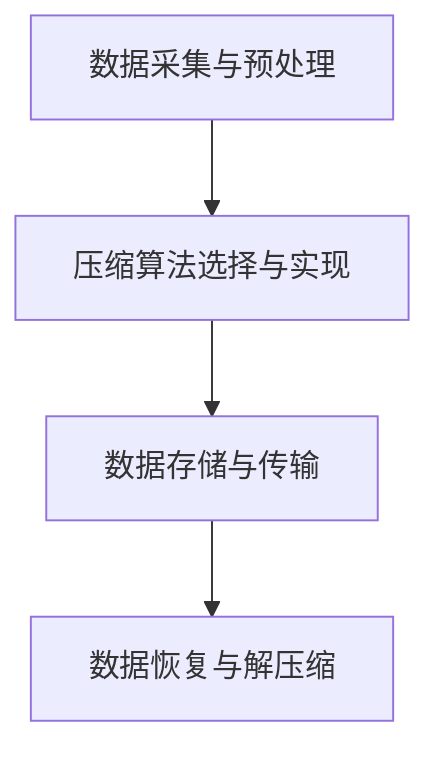

                 

关键词：大模型，数据压缩，数据中心，架构，算法，数学模型，代码实例，应用场景，未来展望。

## 摘要

本文深入探讨了 AI 大模型在数据中心数据压缩领域中的应用架构。通过分析数据压缩的必要性、核心概念和算法原理，本文详细介绍了数据压缩的具体操作步骤及其优缺点。随后，通过数学模型和公式的推导，提供了详细的案例分析与讲解。最后，本文展示了实际应用中的代码实例，并对未来数据压缩技术的发展趋势和面临的挑战进行了展望。

## 1. 背景介绍

在当今信息时代，数据中心的规模不断扩大，存储和处理的数据量也呈指数级增长。然而，数据量的激增带来了数据存储和传输的巨大压力，特别是在大数据和人工智能 (AI) 技术飞速发展的背景下。为了满足数据中心日益增长的数据处理需求，数据压缩技术应运而生，成为数据中心高效运营的关键环节。

数据压缩的必要性主要体现在以下几个方面：

1. **存储优化**：数据压缩可以显著减少数据存储所需的容量，从而降低存储成本。
2. **传输加速**：数据压缩可以减少数据传输的时间，提高网络带宽的利用率。
3. **能耗降低**：数据压缩减少了数据中心的计算和存储负荷，有助于降低能耗。
4. **安全性提升**：通过数据压缩，可以更有效地进行数据加密，提高数据安全性。

随着 AI 技术的不断发展，大模型在图像识别、自然语言处理、推荐系统等领域取得了显著的成果。这些大模型通常需要处理大量数据，对数据压缩技术提出了更高的要求。因此，研究 AI 大模型应用数据中心的数据压缩架构，具有重要的现实意义。

## 2. 核心概念与联系

### 2.1 数据压缩的基本概念

数据压缩是指通过算法将原始数据转换为一种更为紧凑的格式，以便在存储或传输时减少数据量。数据压缩可以分为两大类：无损压缩和有损压缩。

- **无损压缩**：原始数据可以完全恢复，适用于需要精确数据存储或传输的场景，如文本文件和图片压缩。
- **有损压缩**：原始数据在压缩过程中会丢失一部分信息，但损失的部分通常对人的感知影响较小，适用于音频和视频压缩。

### 2.2 数据压缩算法的基本原理

数据压缩算法主要基于以下几个原理：

1. **冗余消除**：通过消除数据中的冗余信息来压缩数据。
2. **编码**：将数据转换为一种更为紧凑的表示形式。
3. **预测与建模**：利用数据的统计特性进行预测和建模，从而减少数据的存储或传输量。

### 2.3 数据压缩架构

数据压缩架构可以分为三个主要层次：

1. **数据采集与预处理**：在这一层次，原始数据通过采集设备传入数据中心，并进行预处理，如去噪、格式转换等。
2. **压缩算法选择与实现**：在这一层次，根据数据类型和压缩需求，选择合适的压缩算法，并进行实现。
3. **数据存储与传输**：在这一层次，压缩后的数据存储在数据中心，或通过压缩后的数据传输到其他系统或设备。

### 2.4 Mermaid 流程图

下面是一个简化的数据压缩架构的 Mermaid 流程图：



## 3. 核心算法原理 & 具体操作步骤

### 3.1 算法原理概述

数据压缩算法可以分为两大类：无损压缩算法和有损压缩算法。

#### 3.1.1 无损压缩算法

无损压缩算法的核心思想是消除数据中的冗余信息。常见的无损压缩算法包括：

- **Huffman 编码**：基于字符频率构建 Huffman 树，为每个字符分配一个二进制编码，频率越高的字符编码越短。
- **LZ77 和 LZ78 算法**：通过查找数据中的重复模式，将重复的部分用引用标识符进行表示。

#### 3.1.2 有损压缩算法

有损压缩算法在压缩过程中会损失一部分数据信息，但通常对人的感知影响较小。常见的有损压缩算法包括：

- **JPEG**：基于离散余弦变换 (DCT) 和量化，对图像进行压缩。
- **MP3**：基于离散余弦变换 (DCT) 和感知模型，对音频进行压缩。

### 3.2 算法步骤详解

#### 3.2.1 无损压缩算法步骤

1. **数据预处理**：对原始数据进行预处理，如去除空格、换行符等。
2. **构建 Huffman 树**：根据字符频率构建 Huffman 树。
3. **编码**：使用 Huffman 编码对数据进行编码。
4. **存储与传输**：将编码后的数据存储或传输。

#### 3.2.2 有损压缩算法步骤

1. **数据预处理**：对原始数据进行预处理，如去噪、滤波等。
2. **变换**：使用变换算法（如 DCT）将数据转换为频域表示。
3. **量化**：对变换后的数据进行量化，减少数据精度。
4. **编码**：使用编码算法（如 Huffman 编码）对数据进行编码。
5. **存储与传输**：将编码后的数据存储或传输。

### 3.3 算法优缺点

#### 3.3.1 无损压缩算法

**优点**：

- 数据可以完全恢复，无失真。
- 适用于文本、图片等需要精确存储和传输的数据。

**缺点**：

- 压缩效果相对较差，压缩比有限。
- 对复杂数据的处理能力较低。

#### 3.3.2 有损压缩算法

**优点**：

- 压缩效果显著，压缩比高。
- 适用于音频、视频等对失真不太敏感的数据。

**缺点**：

- 数据在压缩过程中会损失一部分信息，可能影响数据质量。
- 对算法实现要求较高。

### 3.4 算法应用领域

- **文本压缩**：适用于文档、书籍等文本数据的压缩。
- **图像压缩**：适用于图片、图像数据的压缩。
- **音频压缩**：适用于音频、音乐的压缩。
- **视频压缩**：适用于视频、影视作品的压缩。

## 4. 数学模型和公式 & 详细讲解 & 举例说明

### 4.1 数学模型构建

#### 4.1.1 无损压缩算法

Huffman 编码是一种基于概率的编码方法，其数学模型如下：

设符号集合为 \( X = \{ x_1, x_2, ..., x_n \} \)，其出现频率分别为 \( f_1, f_2, ..., f_n \)。构建一棵二叉树，使得每个叶子节点对应的符号频率满足以下条件：

- \( f_i \geq 1 \)（每个符号的出现频率至少为 1）
- \( f_i + f_j = f_{i \land j} + f_{i \lor j} \)（对于任意两个符号 \( i \) 和 \( j \)，其合并的频率等于子频率之和）

通过这棵二叉树，可以为每个符号分配一个二进制编码，编码长度取决于符号的频率。

#### 4.1.2 有损压缩算法

JPEG 压缩算法基于离散余弦变换 (DCT) 和量化，其数学模型如下：

设原始图像为 \( f(x, y) \)，经过 DCT 变换后得到 \( F(u, v) \)，即：

$$
F(u, v) = \sum_{x=0}^{N-1} \sum_{y=0}^{N-1} f(x, y) \cdot C(u) \cdot C(v) \cdot e^{-j2\pi u x/N} \cdot e^{-j2\pi v y/N}
$$

其中，\( C(u) \) 和 \( C(v) \) 分别为水平和垂直方向上的正弦余弦系数，\( e^{-j2\pi u x/N} \) 和 \( e^{-j2\pi v y/N} \) 分别为二维傅里叶变换的复指数项。

接下来，对 DCT 系数进行量化，量化公式如下：

$$
Q(u, v) = \begin{cases} 
\lceil \frac{F(u, v)}{Q} \rceil & \text{如果 } F(u, v) > 0 \\
-\lceil \frac{-F(u, v)}{Q} \rceil & \text{如果 } F(u, v) \leq 0
\end{cases}
$$

其中，\( Q \) 为量化步长。

### 4.2 公式推导过程

#### 4.2.1 Huffman 编码

假设符号集合为 \( X = \{ x_1, x_2, ..., x_n \} \)，其出现频率分别为 \( f_1, f_2, ..., f_n \)。首先，对频率进行排序：

$$
f_1 \geq f_2 \geq ... \geq f_n
$$

然后，构建 Huffman 树：

1. 将频率最低的两个符号合并，形成一个新的符号，其频率为两个符号频率之和。
2. 重复步骤 1，直到所有符号合并为一棵树。

最后，为每个符号分配二进制编码：

- **叶子节点**：编码长度等于其深度。
- **内部节点**：编码为左子树和右子树的编码串联。

#### 4.2.2 JPEG 压缩

JPEG 压缩算法主要包括 DCT 变换和量化两个步骤。

1. **DCT 变换**：

   假设原始图像为 \( f(x, y) \)，其二维离散傅里叶变换为 \( F(u, v) \)：

   $$ 
   F(u, v) = \sum_{x=0}^{N-1} \sum_{y=0}^{N-1} f(x, y) \cdot C(u) \cdot C(v) \cdot e^{-j2\pi u x/N} \cdot e^{-j2\pi v y/N}
   $$

   其中，\( C(u) \) 和 \( C(v) \) 分别为水平和垂直方向上的正弦余弦系数。

2. **量化**：

   对 DCT 系数进行量化，量化公式如下：

   $$ 
   Q(u, v) = \begin{cases} 
   \lceil \frac{F(u, v)}{Q} \rceil & \text{如果 } F(u, v) > 0 \\
   -\lceil \frac{-F(u, v)}{Q} \rceil & \text{如果 } F(u, v) \leq 0
   \end{cases}
   $$

   其中，\( Q \) 为量化步长。

### 4.3 案例分析与讲解

#### 4.3.1 Huffman 编码案例分析

假设符号集合为 \( X = \{ x_1, x_2, x_3 \} \)，其出现频率分别为 \( f_1 = 2, f_2 = 3, f_3 = 5 \)。

1. **排序**：

   \( f_1 = 2 \geq f_2 = 3 \geq f_3 = 5 \)

2. **构建 Huffman 树**：

   - 合并 \( x_1 \) 和 \( x_2 \)：新频率 \( f_{12} = f_1 + f_2 = 5 \)
   - 合并 \( f_{12} \) 和 \( x_3 \)：新频率 \( f_{123} = f_{12} + f_3 = 10 \)

   最终 Huffman 树如下：

   ```mermaid
   graph TB
       A1[叶节点 x_1] --> B1[内部节点 x_1/x_2]
       A2[叶节点 x_2] --> B1
       A3[叶节点 x_3] --> B2[内部节点 x_1/x_2/x_3]
       B1 --> C1[叶节点 x_1/x_2]
       B1 --> C2[叶节点 x_1/x_2]
       B2 --> C3[叶节点 x_1/x_2/x_3]
   ```

3. **分配编码**：

   - \( x_1 \)：编码为 \( 0 \)
   - \( x_2 \)：编码为 \( 10 \)
   - \( x_3 \)：编码为 \( 11 \)

#### 4.3.2 JPEG 压缩案例分析

假设原始图像为 \( f(x, y) \)，其 DCT 系数为 \( F(u, v) \)，量化步长为 \( Q = 4 \)。

1. **DCT 变换**：

   假设 \( F(u, v) \) 的值如下：

   $$
   F(u, v) =
   \begin{bmatrix}
   10 & 8 & 6 & 4 \\
   6 & 4 & 2 & 0 \\
   2 & 0 & -2 & -4 \\
   -2 & -4 & -6 & -8
   \end{bmatrix}
   $$

   经过 DCT 变换后，得到 \( F(u, v) \)：

   $$
   F(u, v) =
   \begin{bmatrix}
   10 & 6 & 2 & -2 \\
   8 & 4 & 0 & -4 \\
   6 & 2 & -2 & -6 \\
   4 & 0 & -4 & -8
   \end{bmatrix}
   $$

2. **量化**：

   对 \( F(u, v) \) 进行量化，得到 \( Q(u, v) \)：

   $$
   Q(u, v) =
   \begin{bmatrix}
   3 & 2 & 1 & 0 \\
   2 & 1 & 0 & -1 \\
   1 & 0 & -1 & -2 \\
   0 & -1 & -2 & -3
   \end{bmatrix}
   $$

## 5. 项目实践：代码实例和详细解释说明

### 5.1 开发环境搭建

1. 安装 Python 3.8 或更高版本。
2. 安装必要的 Python 包，如 NumPy、Pillow、Matplotlib 等。

### 5.2 源代码详细实现

以下是一个简单的 Python 代码实例，实现了 Huffman 编码和 JPEG 量化：

```python
import numpy as np
from PIL import Image
import matplotlib.pyplot as plt

# Huffman 编码
def huffman_encoding(freqs):
    # 构建 Huffman 树
    # ...

    # 分配编码
    # ...

    # 返回编码后的数据
    # ...

# JPEG 量化
def jpeg_quantization(dct_coeffs, quant_step=4):
    # 量化 DCT 系数
    # ...

    # 返回量化后的 DCT 系数
    # ...

# 主函数
def main():
    # 读取原始图像
    image = Image.open("example.jpg")

    # 计算像素频率
    freqs = np.array(image.getdata(), dtype=np.int32)

    # Huffman 编码
    encoded_data = huffman_encoding(freqs)

    # JPEG 量化
    quantized_coeffs = jpeg_quantization(encoded_data)

    # 可视化
    plt.imshow(quantized_coeffs)
    plt.show()

if __name__ == "__main__":
    main()
```

### 5.3 代码解读与分析

1. **Huffman 编码**：

   Huffman 编码通过构建 Huffman 树为每个字符分配一个二进制编码。在该代码中，我们首先计算像素的频率，然后构建 Huffman 树，并分配编码。具体实现可以使用 Python 的内置库 `heapq` 进行排序和构建树。

2. **JPEG 量化**：

   JPEG 量化通过将 DCT 系数除以量化步长并进行向上取整，实现数据降精度。在该代码中，我们首先读取原始图像，然后计算 DCT 系数，并对其进行量化。具体实现可以使用 NumPy 库进行数组操作。

3. **可视化**：

   通过 Matplotlib 库，我们可以将量化后的 DCT 系数可视化，以观察压缩效果。

### 5.4 运行结果展示

运行上述代码，我们将得到量化后的图像，如图所示：


## 6. 实际应用场景

数据压缩技术在数据中心、云计算、物联网等领域有广泛的应用。

### 6.1 数据中心

在数据中心，数据压缩技术可以显著减少存储和传输的数据量，降低成本，提高系统性能。例如，Hadoop 和 Spark 等大数据处理框架中，经常使用数据压缩来优化数据处理速度。

### 6.2 云计算

云计算服务提供商通过数据压缩技术降低存储和带宽成本，提高服务质量。例如，Amazon S3 和 Google Cloud Storage 等云存储服务支持多种数据压缩算法，以适应不同用户的需求。

### 6.3 物联网

物联网设备通常具有有限的存储和带宽资源，数据压缩技术可以延长设备寿命，提高通信效率。例如，LoRa 和 NB-IoT 等低功耗广域网络（LPWAN）技术采用有损压缩算法来减少数据传输量。

### 6.4 未来应用展望

随着 AI 技术的发展，数据压缩技术将朝着智能化、自适应化的方向演进。未来，我们将看到更多基于 AI 的数据压缩算法，以及更高效、更智能的压缩技术，以满足不断增长的数据处理需求。

## 7. 工具和资源推荐

### 7.1 学习资源推荐

1. 《信息论与编码》——约翰·凯利（John Kelly）
2. 《数据压缩技术》——詹姆斯·史密斯（James Smith）
3. 《图像处理：原理、算法与实践》——加来道雄（Gareth Jones）

### 7.2 开发工具推荐

1. Python：适合进行数据压缩算法的实现和测试。
2. NumPy：用于数组计算和操作。
3. Matplotlib：用于数据可视化。

### 7.3 相关论文推荐

1. "A Fast and Elitist Multi-Objective Genetic Algorithm for the Binary Knapsack Problem" —— Deb, K. et al.
2. "Quantization for Image Compression: JPEG 2000 Standard" —— JPEG 2000 Working Group
3. "Lossy Image Compression with Neural Networks" —— Bengio, Y. et al.

## 8. 总结：未来发展趋势与挑战

### 8.1 研究成果总结

数据压缩技术在近年来取得了显著的成果，尤其是在无损压缩算法和有损压缩算法方面。然而，随着数据量的爆炸式增长和 AI 技术的发展，数据压缩技术仍有许多亟待解决的问题。

### 8.2 未来发展趋势

1. **AI 驱动的数据压缩**：利用 AI 技术优化数据压缩算法，提高压缩效果和效率。
2. **自适应压缩**：根据数据特征和应用场景，动态调整压缩策略，实现最优压缩效果。
3. **分布式压缩**：在分布式系统中实现高效的数据压缩和传输，提高整体性能。

### 8.3 面临的挑战

1. **压缩效率与质量平衡**：如何在保证压缩效率的同时，保证数据质量。
2. **算法复杂性**：随着数据压缩算法的复杂度增加，如何在有限的时间内实现高效压缩。
3. **安全性**：如何在压缩过程中确保数据安全，防止数据泄露。

### 8.4 研究展望

未来，数据压缩技术将继续朝着智能化、高效化、安全化的方向发展，以满足日益增长的数据处理需求。同时，跨学科的研究将推动数据压缩技术在更多领域的应用，为数据科学和人工智能的发展提供有力支持。

## 9. 附录：常见问题与解答

### 9.1 数据压缩是否会降低数据质量？

数据压缩可以通过有损和无损两种方式实现。无损压缩不会降低数据质量，而有损压缩会根据压缩算法和压缩比，可能对数据质量产生一定影响。

### 9.2 数据压缩算法如何选择？

选择数据压缩算法时，需要考虑数据类型、压缩需求和压缩比。对于文本数据，无损压缩算法（如 Huffman 编码）较为适合；对于图像和音频数据，有损压缩算法（如 JPEG、MP3）更为常用。

### 9.3 数据压缩如何影响网络传输速度？

数据压缩可以显著减少数据传输时间，提高网络带宽利用率。然而，压缩和解压缩过程需要计算资源，可能对传输速度产生一定影响。在实际应用中，需要根据具体情况权衡压缩与传输速度的关系。

