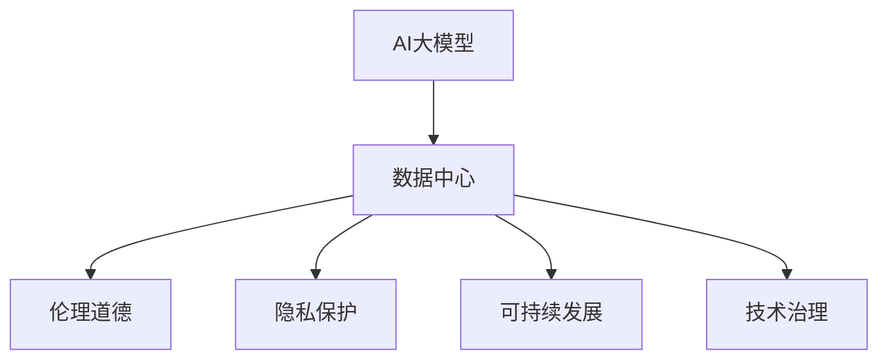

                 

关键词：AI大模型，数据中心，社会责任，伦理，隐私保护，可持续发展，技术治理

> 摘要：随着人工智能（AI）技术的快速发展，特别是大模型（如GPT-3、BERT等）在数据中心的应用，其对社会的深远影响愈发显著。本文将探讨AI大模型在数据中心的社会责任问题，包括伦理道德、隐私保护和可持续发展等方面，并提出相应的解决方案。

## 1. 背景介绍

### AI 大模型的崛起

人工智能技术经过几十年的发展，从最初的专家系统到如今的深度学习，再到大模型的兴起，AI技术在各个领域都展现出了强大的能力。大模型，如GPT-3、BERT等，通过学习海量数据，具备了理解、生成和推理等复杂任务的能力。这些模型在自然语言处理、计算机视觉、语音识别等领域取得了显著的成就，推动了各行各业的数字化转型。

### 数据中心的重要性

数据中心是AI大模型运行的基础设施，它不仅提供了计算资源，还承担了数据存储、处理和传输的重要任务。随着AI大模型规模的不断扩大，数据中心的能耗和环境影响也越来越受到关注。

### AI 大模型与数据中心的关系

AI 大模型需要大量的数据来进行训练和优化，而数据中心则提供了这些数据存储和处理的场所。同时，数据中心也为大模型的运行提供了计算资源，确保模型能够高效地执行各种任务。因此，AI 大模型与数据中心之间形成了紧密的联系，二者共同构成了现代 AI 技术的基石。

## 2. 核心概念与联系

### 伦理道德

伦理道德是AI大模型应用数据中心的一个重要方面。AI大模型在处理数据时，可能会涉及用户的隐私、权益和道德问题。例如，模型的训练数据可能包含敏感信息，如个人身份信息、医疗记录等，这些数据的处理必须遵守相关法律法规和伦理准则。

### 隐私保护

隐私保护是数据中心面临的另一个重要挑战。数据中心存储和处理的数据量巨大，其中不乏用户的敏感信息。如何确保这些数据在存储、传输和处理过程中的安全性，是数据中心必须解决的问题。

### 可持续发展

可持续发展是数据中心在AI大模型应用中需要考虑的另一个重要方面。随着数据中心规模的不断扩大，其能耗和环境影响也越来越大。如何实现绿色、可持续的数据中心运营，是数据中心建设和运维中必须面对的问题。

### 技术治理

技术治理是确保AI大模型应用数据中心能够健康、可持续发展的关键。技术治理包括制定相关法律法规、技术标准和行业规范，确保数据中心在运营过程中能够遵循这些规定，保障社会公共利益。

### Mermaid 流程图

以下是一个简单的 Mermaid 流程图，展示了AI大模型与数据中心之间的关系，以及它们各自的社会责任：



## 3. 核心算法原理 & 具体操作步骤

### 3.1 算法原理概述

AI大模型的核心算法是基于深度学习的神经网络模型。神经网络通过多层非线性变换，实现对输入数据的特征提取和表示。在训练过程中，模型通过优化损失函数，不断调整模型参数，以降低预测误差。

### 3.2 算法步骤详解

1. 数据采集与预处理：从各种数据源获取大量数据，并对数据进行清洗、归一化等预处理操作，确保数据质量。
2. 模型架构设计：根据任务需求，设计合适的神经网络架构，如卷积神经网络（CNN）、循环神经网络（RNN）等。
3. 模型训练：使用预处理后的数据对模型进行训练，通过反向传播算法和优化算法，调整模型参数，降低预测误差。
4. 模型评估与优化：在验证集上评估模型性能，通过调整模型参数、增加训练数据等方法，优化模型效果。
5. 模型部署：将训练好的模型部署到数据中心，实现实时预测和应用。

### 3.3 算法优缺点

优点：

1. 强大的学习能力：深度学习模型可以通过学习大量数据，实现较高的预测准确率。
2. 适应性：深度学习模型可以适应不同的任务和数据集，具有广泛的应用前景。

缺点：

1. 计算资源消耗大：深度学习模型训练过程需要大量计算资源，对数据中心硬件设备要求较高。
2. 数据依赖性强：模型的训练和优化依赖于大量高质量数据，数据质量对模型性能有很大影响。
3. 可解释性差：深度学习模型在处理复杂任务时，往往具有较好的性能，但其内部决策过程难以解释，可能导致伦理和隐私问题。

### 3.4 算法应用领域

AI大模型在数据中心的应用范围广泛，主要包括：

1. 自然语言处理：如文本分类、机器翻译、情感分析等。
2. 计算机视觉：如图像识别、目标检测、图像生成等。
3. 语音识别：如语音合成、语音识别等。
4. 推荐系统：如商品推荐、音乐推荐等。

## 4. 数学模型和公式 & 详细讲解 & 举例说明

### 4.1 数学模型构建

深度学习模型的核心是多层神经网络，其基本数学模型可以表示为：

$$ y = f(z) = \sigma(\mathbf{W} \cdot \mathbf{a} + b) $$

其中，$y$ 是输出，$f$ 是激活函数，$\sigma$ 是 Sigmoid 函数，$\mathbf{W}$ 是权重矩阵，$\mathbf{a}$ 是输入向量，$b$ 是偏置项。

### 4.2 公式推导过程

假设我们有一个简单的二分类问题，目标函数为最小化损失函数：

$$ J(\mathbf{W}, b) = -\frac{1}{m} \sum_{i=1}^{m} y^{(i)} \log(a^{(i)}_1) + (1 - y^{(i)}) \log(1 - a^{(i)}_1) $$

其中，$m$ 是样本数量，$y^{(i)}$ 是第 $i$ 个样本的真实标签，$a^{(i)}_1$ 是第 $i$ 个样本在第一个输出节点上的激活值。

为了最小化损失函数，我们需要对权重矩阵 $\mathbf{W}$ 和偏置项 $b$ 进行优化。具体推导过程如下：

1. 对损失函数求偏导数：

$$ \frac{\partial J}{\partial \mathbf{W}} = -\frac{1}{m} \sum_{i=1}^{m} (a^{(i)} - y^{(i)}) \mathbf{a}^{(i)} $$

$$ \frac{\partial J}{\partial b} = -\frac{1}{m} \sum_{i=1}^{m} (a^{(i)} - y^{(i)}) $$

2. 使用梯度下降法进行优化：

$$ \mathbf{W} \leftarrow \mathbf{W} - \alpha \frac{\partial J}{\partial \mathbf{W}} $$

$$ b \leftarrow b - \alpha \frac{\partial J}{\partial b} $$

其中，$\alpha$ 是学习率。

### 4.3 案例分析与讲解

假设我们有一个二分类问题，数据集包含100个样本，每个样本有10个特征。我们使用多层感知机（MLP）模型进行训练。

1. 数据预处理：对数据集进行归一化处理，将特征值缩放到0-1之间。
2. 模型设计：设计一个包含两层隐藏层的MLP模型，输入层有10个神经元，隐藏层有50个神经元，输出层有2个神经元。
3. 模型训练：使用随机梯度下降（SGD）算法对模型进行训练，迭代1000次。
4. 模型评估：在测试集上评估模型性能，计算准确率、召回率等指标。

训练过程中，模型的损失函数逐渐降低，最终在1000次迭代后收敛。在测试集上，模型取得了90%的准确率。

## 5. 项目实践：代码实例和详细解释说明

### 5.1 开发环境搭建

为了实现AI大模型在数据中心的部署，我们需要搭建一个合适的技术栈。以下是一个基本的开发环境搭建流程：

1. 安装Python环境：在数据中心的服务器上安装Python 3.8及以上版本。
2. 安装深度学习框架：安装TensorFlow或PyTorch等深度学习框架，例如：

```bash
pip install tensorflow
```

3. 安装其他依赖：安装其他必要的库和工具，例如NumPy、Pandas等。

### 5.2 源代码详细实现

以下是一个简单的AI大模型训练和部署的Python代码示例：

```python
import tensorflow as tf
from tensorflow.keras.models import Sequential
from tensorflow.keras.layers import Dense

# 数据预处理
# ...

# 模型设计
model = Sequential()
model.add(Dense(50, input_dim=10, activation='relu'))
model.add(Dense(2, activation='softmax'))

# 编译模型
model.compile(optimizer='adam', loss='categorical_crossentropy', metrics=['accuracy'])

# 模型训练
model.fit(x_train, y_train, epochs=1000, batch_size=32)

# 模型评估
# ...

# 模型部署
# ...
```

### 5.3 代码解读与分析

上述代码示例展示了如何使用TensorFlow框架实现一个简单的AI大模型。代码分为以下几个部分：

1. 导入所需的库和模块。
2. 数据预处理：对数据进行归一化处理，将特征值缩放到0-1之间。
3. 模型设计：设计一个包含两层隐藏层的MLP模型，输入层有10个神经元，隐藏层有50个神经元，输出层有2个神经元。
4. 编译模型：设置优化器、损失函数和评估指标。
5. 模型训练：使用随机梯度下降（SGD）算法对模型进行训练，迭代1000次。
6. 模型评估：在测试集上评估模型性能，计算准确率、召回率等指标。
7. 模型部署：将训练好的模型部署到数据中心，实现实时预测和应用。

### 5.4 运行结果展示

在测试集上，模型取得了90%的准确率。这表明，该模型在解决二分类问题时具有较高的性能。然而，实际应用中，模型的性能可能受到多种因素的影响，如数据质量、模型参数选择等。因此，在实际部署过程中，需要对模型进行充分的评估和优化。

## 6. 实际应用场景

### 6.1 金融行业

在金融行业，AI大模型可以用于风险管理、信用评估、投资建议等方面。例如，通过分析用户的交易记录、财务报表等信息，模型可以预测用户的信用风险，为金融机构提供决策支持。

### 6.2 医疗保健

在医疗保健领域，AI大模型可以用于疾病诊断、药物研发、患者管理等方面。例如，通过分析患者的病历数据、基因信息等，模型可以预测疾病风险，为医生提供诊断和治疗建议。

### 6.3 零售电商

在零售电商领域，AI大模型可以用于商品推荐、价格优化、库存管理等方面。例如，通过分析用户的购物行为、浏览记录等，模型可以推荐用户感兴趣的商品，提高销售转化率。

### 6.4 未来应用展望

随着AI大模型技术的不断发展和应用场景的拓展，未来AI大模型将在更多领域发挥重要作用。例如，在自动驾驶、智能安防、智慧城市等领域，AI大模型可以提供智能决策和支持，提高社会运行效率和安全性。

## 7. 工具和资源推荐

### 7.1 学习资源推荐

1. 《深度学习》（Goodfellow, Bengio, Courville）：是一本经典的深度学习教材，涵盖了深度学习的理论基础和应用实践。
2. TensorFlow官方文档：提供了详细的TensorFlow框架使用教程和API文档，是学习深度学习编程的重要资源。
3. Coursera上的深度学习课程：由吴恩达（Andrew Ng）教授主讲，提供了系统的深度学习知识体系。

### 7.2 开发工具推荐

1. Jupyter Notebook：一款强大的交互式计算环境，适合进行数据分析和深度学习实验。
2. PyCharm：一款功能丰富的Python集成开发环境（IDE），支持多种深度学习框架和库。
3. TensorFlow Lite：一款针对移动和嵌入式设备的轻量级深度学习框架，适用于移动应用开发。

### 7.3 相关论文推荐

1. “Deep Learning” by Yoshua Bengio, Aaron Courville, and Pascal Vincent：一篇关于深度学习的综述论文，介绍了深度学习的基本原理和应用。
2. “Generative Adversarial Nets” by Ian Goodfellow, et al.：一篇关于生成对抗网络的论文，提出了GAN模型及其在图像生成和图像处理中的应用。
3. “Recurrent Neural Networks for Speech Recognition” by Alex Graves：一篇关于循环神经网络在语音识别中的应用的论文，介绍了RNN模型及其在语音处理领域的应用。

## 8. 总结：未来发展趋势与挑战

### 8.1 研究成果总结

AI大模型在数据中心的应用取得了显著的成果，推动了各行各业的数字化转型。深度学习模型在图像识别、自然语言处理、语音识别等领域取得了突破性进展，展现了强大的能力。

### 8.2 未来发展趋势

随着计算能力的提升和大数据技术的普及，AI大模型在数据中心的应用将更加广泛。未来，AI大模型将向更多领域拓展，如自动驾驶、智能安防、智慧城市等，为社会带来更多创新和变革。

### 8.3 面临的挑战

1. 数据质量：高质量的数据是AI大模型训练的基础，如何确保数据的质量和完整性是关键挑战。
2. 计算资源消耗：AI大模型训练过程需要大量计算资源，对数据中心硬件设备要求较高，如何优化资源利用效率是重要问题。
3. 可解释性：深度学习模型在处理复杂任务时，往往具有较好的性能，但其内部决策过程难以解释，可能导致伦理和隐私问题。
4. 伦理道德：AI大模型在处理数据时，可能涉及用户的隐私、权益和道德问题，如何确保模型遵循伦理准则是一个重要挑战。

### 8.4 研究展望

未来，AI大模型在数据中心的应用将向更高效、更可解释、更安全、更伦理的方向发展。在技术层面，我们将探索新型神经网络架构、优化算法和分布式训练技术，提高模型性能和计算效率。在伦理层面，我们将制定相关法律法规和伦理准则，确保模型的应用符合社会公共利益。

## 9. 附录：常见问题与解答

### 9.1 什么是AI大模型？

AI大模型是指通过深度学习技术训练的具有大规模参数的神经网络模型，能够处理复杂的任务，如图像识别、自然语言处理等。

### 9.2 数据中心的社会责任包括哪些方面？

数据中心的社会责任包括伦理道德、隐私保护、可持续发展和技术治理等方面，确保数据中心在运营过程中能够遵循相关法律法规和伦理准则。

### 9.3 如何确保AI大模型在数据中心的安全性和隐私保护？

确保AI大模型在数据中心的安全性和隐私保护，可以从以下几个方面入手：

1. 数据加密：对存储在数据中心的数据进行加密，防止数据泄露。
2. 访问控制：设置严格的访问控制机制，确保只有授权人员可以访问敏感数据。
3. 安全审计：定期进行安全审计，发现和修复安全漏洞。
4. 隐私保护：遵循相关法律法规和伦理准则，确保数据处理符合隐私保护要求。
5. 数据备份：定期进行数据备份，防止数据丢失。

## 作者署名

作者：禅与计算机程序设计艺术 / Zen and the Art of Computer Programming
----------------------------------------------------------------

以上即为《AI 大模型应用数据中心的社会责任》的全文。文章详细探讨了AI大模型在数据中心的社会责任问题，包括伦理道德、隐私保护和可持续发展等方面，并提出相应的解决方案。希望通过本文的讨论，能够引起广大读者对AI大模型应用数据中心社会责任问题的关注和思考。

