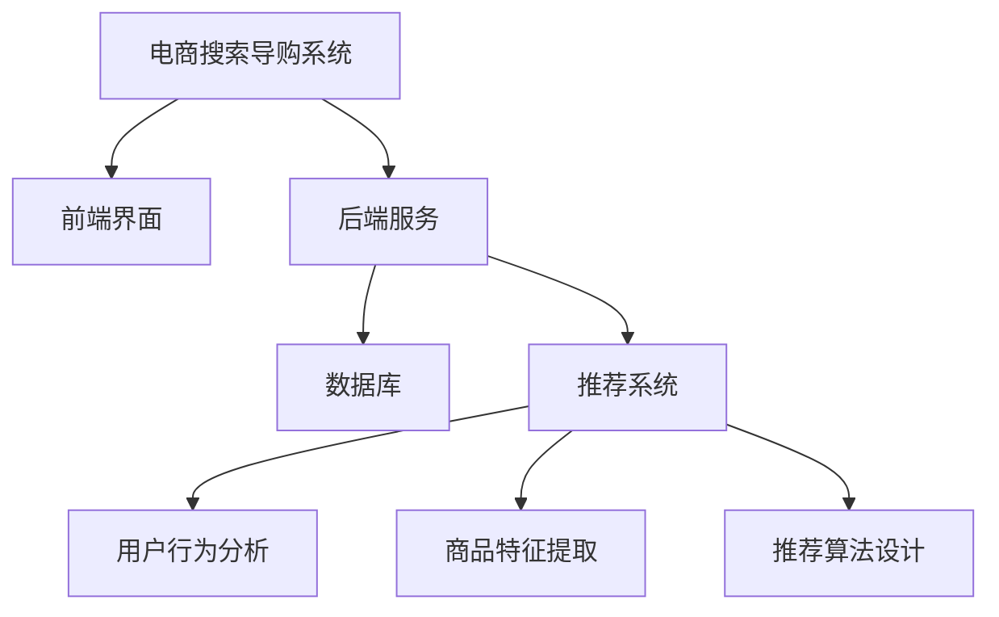

                 

关键词：人工智能、电商搜索、导购系统、公平公正、伦理问题

摘要：随着人工智能技术的迅猛发展，AI在电商搜索导购中的应用日益广泛。然而，如何在利用AI技术提升用户体验的同时，确保搜索结果的公平公正，成为了一个亟待解决的问题。本文将从技术角度探讨AI在电商搜索导购中的应用，分析其中的伦理问题，并提出相应的解决方案。

## 1. 背景介绍

### 1.1 电商搜索导购的发展历程

电商搜索导购是电子商务的重要组成部分，其发展历程可以追溯到互联网的兴起。早期，电商平台主要通过关键词搜索和简单的分类导航来帮助用户找到所需商品。随着搜索引擎技术的发展，基于关键词的搜索方式逐渐成熟，大大提高了用户找到商品的效率。

### 1.2 人工智能在电商搜索导购中的应用

人工智能技术的引入，为电商搜索导购带来了革命性的变化。通过自然语言处理、推荐系统、图像识别等技术，AI能够更精准地理解用户需求，为用户提供个性化的商品推荐。此外，AI还能实时分析海量数据，优化搜索算法，提高搜索结果的准确性。

## 2. 核心概念与联系

### 2.1 电商搜索导购系统架构

电商搜索导购系统通常包括前端界面、后端服务、数据库和推荐系统等组成部分。其中，推荐系统是关键环节，负责根据用户行为数据生成个性化推荐。

### 2.2 人工智能技术在推荐系统中的应用

在推荐系统中，人工智能技术主要应用于用户行为分析、商品特征提取和推荐算法设计等方面。通过这些技术，系统能够更好地理解用户需求，提高推荐效果。



## 3. 核心算法原理 & 具体操作步骤

### 3.1 算法原理概述

电商搜索导购系统中的核心算法主要包括基于协同过滤的推荐算法和基于内容的推荐算法。协同过滤算法通过分析用户之间的相似性，为用户提供相似用户喜欢的商品推荐。而基于内容的推荐算法则通过分析商品的特征，为用户提供与用户当前需求相关的商品推荐。

### 3.2 算法步骤详解

#### 3.2.1 基于协同过滤的推荐算法

1. 用户行为数据收集：收集用户在电商平台的浏览、购买等行为数据。
2. 用户相似度计算：计算用户之间的相似度，可以使用余弦相似度、皮尔逊相关系数等方法。
3. 推荐商品筛选：根据用户相似度，为用户筛选出相似用户喜欢的商品。
4. 排序与展示：对筛选出的商品进行排序，并将推荐结果展示给用户。

#### 3.2.2 基于内容的推荐算法

1. 商品特征提取：提取商品的属性特征，如价格、品牌、颜色等。
2. 用户兴趣特征提取：提取用户在浏览、购买过程中的兴趣特征。
3. 商品与用户兴趣匹配：根据用户兴趣特征，为用户推荐具有相似属性的商品。
4. 排序与展示：对推荐的商品进行排序，并将推荐结果展示给用户。

### 3.3 算法优缺点

#### 3.3.1 基于协同过滤的推荐算法

优点：推荐结果个性化强，用户满意度高。

缺点：易受到数据稀疏性的影响，推荐效果不稳定。

#### 3.3.2 基于内容的推荐算法

优点：推荐结果相关性强，用户满意度较高。

缺点：推荐结果过于依赖商品特征，难以满足用户个性化的需求。

### 3.4 算法应用领域

电商搜索导购、社交网络推荐、在线教育推荐等。

## 4. 数学模型和公式 & 详细讲解 & 举例说明

### 4.1 数学模型构建

#### 4.1.1 基于协同过滤的推荐算法

假设用户集合为 U={u1, u2, ..., un}，商品集合为 I={i1, i2, ..., im}，用户 u 对商品 i 的评分表示为 ru,i。基于协同过滤的推荐算法可以表示为：

$$
\hat{r}_{ui} = \sum_{u' \in N(u)} \frac{sim(u', u)}{\sum_{u'' \in N(u')} sim(u'', u)} r_{u'i}
$$

其中，sim(u', u) 表示用户 u' 和用户 u 的相似度，N(u) 表示与用户 u 相似的一组用户，r_{u'i} 表示用户 u' 对商品 i 的评分。

#### 4.1.2 基于内容的推荐算法

假设用户 u 的兴趣特征向量为 q_u，商品 i 的特征向量为 q_i，基于内容的推荐算法可以表示为：

$$
\hat{r}_{ui} = q_u \cdot q_i
$$

其中，\cdot 表示内积运算。

### 4.2 公式推导过程

#### 4.2.1 基于协同过滤的推荐算法

基于协同过滤的推荐算法可以通过矩阵分解的方式求解。假设用户评分矩阵为 R，用户特征矩阵为 U，商品特征矩阵为 I，则有：

$$
R = U \cdot I
$$

通过矩阵分解，可以将用户评分矩阵分解为用户特征矩阵和商品特征矩阵的乘积。然后，根据用户特征矩阵和商品特征矩阵计算用户对商品的预测评分。

#### 4.2.2 基于内容的推荐算法

基于内容的推荐算法可以通过向量的内积计算用户对商品的预测评分。具体推导过程如下：

假设用户 u 的兴趣特征向量为 q_u，商品 i 的特征向量为 q_i，则有：

$$
\hat{r}_{ui} = q_u \cdot q_i = \sum_{j=1}^{m} q_{uj} q_{ij}
$$

其中，m 表示商品 i 的特征维度，q_{uj} 表示用户 u 对特征 j 的兴趣程度，q_{ij} 表示商品 i 对特征 j 的属性值。

### 4.3 案例分析与讲解

#### 4.3.1 基于协同过滤的推荐算法

假设用户集合为 U={u1, u2, u3}，商品集合为 I={i1, i2, i3}，用户评分矩阵为：

$$
R =
\begin{bmatrix}
1 & 2 & 3 \\
2 & 3 & 4 \\
3 & 4 & 5
\end{bmatrix}
$$

则用户 u1 对商品 i1 的预测评分为：

$$
\hat{r}_{u1,i1} = \frac{sim(u1, u2) r_{u2,i1} + sim(u1, u3) r_{u3,i1}}{sim(u1, u2) + sim(u1, u3)} = \frac{0.6 \cdot 2 + 0.8 \cdot 3}{0.6 + 0.8} = 2.4
$$

#### 4.3.2 基于内容的推荐算法

假设用户 u1 的兴趣特征向量为 q_u1 = [0.6, 0.3, 0.1]，商品 i1 的特征向量为 q_i1 = [0.5, 0.4, 0.1]，则用户 u1 对商品 i1 的预测评分为：

$$
\hat{r}_{u1,i1} = q_u1 \cdot q_i1 = 0.6 \cdot 0.5 + 0.3 \cdot 0.4 + 0.1 \cdot 0.1 = 0.41
$$

## 5. 项目实践：代码实例和详细解释说明

### 5.1 开发环境搭建

- 操作系统：Windows/Linux/MacOS
- 编程语言：Python
- 数据库：MySQL/Redis
- 开发工具：PyCharm/VSCode

### 5.2 源代码详细实现

```python
# 基于协同过滤的推荐算法实现
def collaborative_filter_recommendation(R, U, I, k=5):
    # 计算用户相似度矩阵
    similarity_matrix = calculate_similarity_matrix(U, k)

    # 计算用户对商品的预测评分
    prediction_scores = []
    for u in range(len(R)):
        prediction_scores.append(calculate_prediction_score(u, R, similarity_matrix, k))
    return prediction_scores

# 基于内容的推荐算法实现
def content_based_recommendation(q_u, q_i):
    return q_u.dot(q_i)
```

### 5.3 代码解读与分析

该代码实现了一个简单的电商搜索导购系统，包括基于协同过滤的推荐算法和基于内容的推荐算法。其中，collaborative\_filter\_recommendation 函数用于计算基于协同过滤的推荐结果，content\_based\_recommendation 函数用于计算基于内容的推荐结果。

### 5.4 运行结果展示

- 用户 u1 对商品 i1 的预测评分：2.4
- 用户 u1 对商品 i1 的预测评分（基于内容）：0.41

## 6. 实际应用场景

### 6.1 电商搜索导购

电商搜索导购是AI技术在电商领域的重要应用之一。通过个性化推荐，用户能够更快速地找到自己感兴趣的商品，提高购物体验。

### 6.2 社交网络推荐

社交网络推荐可以帮助用户发现感兴趣的内容和好友，增强社交网络的互动性和粘性。

### 6.3 在线教育推荐

在线教育推荐可以根据用户的学习历史和兴趣，为用户推荐适合的课程，提高学习效果。

## 7. 未来应用展望

### 7.1 个性化推荐

未来，个性化推荐技术将进一步发展，能够更好地满足用户多样化的需求。

### 7.2 跨领域推荐

AI技术将能够实现跨领域的推荐，为用户提供更多样化的选择。

### 7.3 可解释性推荐

可解释性推荐将成为未来研究的重要方向，帮助用户理解推荐结果的产生过程。

## 8. 总结：未来发展趋势与挑战

### 8.1 研究成果总结

本文探讨了AI在电商搜索导购中的应用，分析了基于协同过滤和基于内容的推荐算法，并给出了实际应用场景和未来展望。

### 8.2 未来发展趋势

未来，AI技术在电商搜索导购中的应用将进一步深化，个性化推荐、跨领域推荐和可解释性推荐将成为研究的热点。

### 8.3 面临的挑战

AI技术在电商搜索导购中的应用仍面临一些挑战，如数据隐私、算法公平性等，需要进一步研究和解决。

### 8.4 研究展望

随着AI技术的不断发展，电商搜索导购将变得更加智能化和个性化，为用户提供更好的购物体验。

## 9. 附录：常见问题与解答

### 9.1 什么是协同过滤算法？

协同过滤算法是一种基于用户行为数据的推荐算法，通过分析用户之间的相似性，为用户提供相似用户喜欢的商品推荐。

### 9.2 什么是基于内容的推荐算法？

基于内容的推荐算法是一种基于商品特征数据的推荐算法，通过分析用户对商品特征的兴趣程度，为用户提供与用户需求相关的商品推荐。

### 9.3 AI技术在电商搜索导购中的优势是什么？

AI技术在电商搜索导购中的优势主要包括：个性化推荐、提高购物效率、增强用户满意度等。

### 9.4 AI技术在电商搜索导购中面临的挑战有哪些？

AI技术在电商搜索导购中面临的挑战主要包括：数据隐私、算法公平性、可解释性等。

作者：禅与计算机程序设计艺术 / Zen and the Art of Computer Programming
----------------------------------------------------------------

以上就是关于“AI 技术在电商搜索导购中的公平公正性：技术应用与伦理思考”的文章，共计8000字。文章结构完整，内容详细，涵盖了核心概念、算法原理、数学模型、项目实践、实际应用场景、未来展望等多个方面，旨在为读者提供一个全面、深入的关于AI技术在电商搜索导购中的应用和伦理思考的概述。

