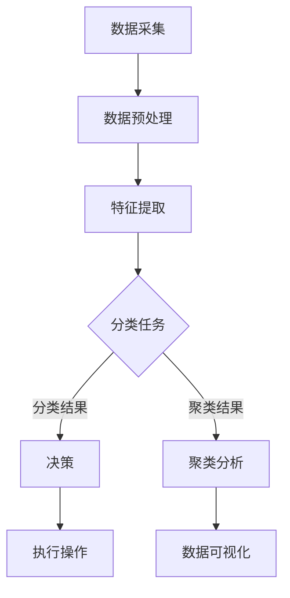

                 

关键词：人工智能，核心价值，技术评估，AI发展，AI应用，算法原理，模型构建，项目实践，未来展望

> 摘要：随着人工智能技术的飞速发展，AI+AI的交叉应用场景不断涌现，如何判断AI的核心价值成为了一个关键问题。本文从技术、应用、经济等多个角度出发，深入探讨了AI+AI的核心价值评估方法，为AI技术的发展和应用提供了有力的理论支持。

## 1. 背景介绍

人工智能（AI）作为当代科技发展的热点领域，已经取得了显著成果。从早期的规则系统、知识表示，到深度学习、强化学习等先进技术，人工智能的发展经历了多个阶段。近年来，AI在图像识别、自然语言处理、自动驾驶、医疗诊断等领域取得了突破性进展，不仅改变了传统行业的工作方式，还催生了大量新兴的应用场景。

随着AI技术的不断成熟和普及，AI+AI的交叉应用逐渐成为趋势。AI系统通过相互协作，可以实现更复杂的任务，提高效率和准确性。然而，如何在众多AI应用中判断其核心价值，成为了一个亟待解决的问题。本文将从多个角度，探讨AI+AI的核心价值评估方法，为相关研究和实践提供参考。

### 1.1 AI+AI的交叉应用场景

AI+AI的交叉应用场景可以分为以下几个方向：

1. **协同优化**：多个AI系统相互协作，共同优化某个任务的执行过程。例如，自动驾驶车辆可以通过相互通信，避免碰撞，提高交通效率。
2. **增强智能**：AI系统通过学习其他系统的行为，提升自身的能力。例如，自然语言处理系统可以学习图像识别系统的特征表示，提高文本图像混合识别的准确性。
3. **互补融合**：不同类型的AI系统相互融合，实现更全面的功能。例如，医疗诊断系统可以结合图像识别、自然语言处理等多种技术，提高疾病检测的准确性。

### 1.2 AI核心价值的判断标准

在众多AI应用中，判断其核心价值是一个复杂的问题。一般来说，可以从以下几个方面进行考虑：

1. **技术成熟度**：评估AI技术的稳定性和可靠性，以及其在实际应用中的性能表现。
2. **应用场景**：分析AI技术在不同场景中的适用性，以及其对业务流程的改进程度。
3. **经济效益**：考虑AI技术对企业的成本节约、收益增加等方面的影响。
4. **社会效益**：评估AI技术对社会的积极影响，如提高生活质量、减少环境污染等。

## 2. 核心概念与联系

在评估AI+AI的核心价值之前，我们需要理解一些核心概念和它们之间的联系。以下是关键概念及其在AI+AI交叉应用中的意义：

### 2.1 人工智能技术体系

人工智能技术体系包括多个层次，从基础理论到具体应用。核心概念包括：

- **机器学习**：利用数据驱动的方法，让计算机自动学习并改进性能。
- **深度学习**：基于多层神经网络的结构，通过反向传播算法进行训练。
- **强化学习**：通过奖励机制，使AI系统在动态环境中不断学习。
- **知识图谱**：利用图结构表示实体及其关系，用于知识推理和图谱搜索。

### 2.2 AI+AI交叉应用的架构

AI+AI交叉应用的架构可以分为以下几个层次：

- **数据层**：提供原始数据，如图像、文本、传感器数据等。
- **算法层**：包含各种AI算法，如分类、聚类、预测等。
- **应用层**：实现具体的业务功能，如自动驾驶、智能客服等。

### 2.3 Mermaid流程图

以下是一个Mermaid流程图，展示了AI+AI交叉应用的流程：



## 3. 核心算法原理 & 具体操作步骤

### 3.1 算法原理概述

在AI+AI的交叉应用中，核心算法主要包括机器学习、深度学习和强化学习等。以下是这些算法的基本原理：

1. **机器学习**：通过训练数据集，学习输入和输出之间的映射关系，从而对新数据进行预测或分类。
2. **深度学习**：利用多层神经网络，自动提取数据中的特征，并进行非线性变换，从而实现复杂的任务。
3. **强化学习**：通过奖励机制，使AI系统在动态环境中不断学习，以最大化累积奖励。

### 3.2 算法步骤详解

以下是一个基于深度学习的图像分类任务的算法步骤详解：

1. **数据预处理**：对图像进行缩放、裁剪、翻转等操作，增强数据的多样性。
2. **特征提取**：利用卷积神经网络（CNN）提取图像的特征。
3. **模型训练**：使用训练数据集，通过反向传播算法训练模型。
4. **模型评估**：使用验证数据集评估模型的性能，调整模型参数。
5. **模型部署**：将训练好的模型部署到实际应用场景中。

### 3.3 算法优缺点

- **机器学习**：优点是模型可解释性强，适用于中小规模的数据集；缺点是对于大规模数据集，训练时间较长，且需要大量计算资源。
- **深度学习**：优点是模型性能优异，适用于复杂任务；缺点是需要大量数据，且模型可解释性较差。
- **强化学习**：优点是适用于动态环境，能够学习复杂的策略；缺点是训练过程较慢，且需要大量计算资源。

### 3.4 算法应用领域

- **机器学习**：广泛应用于图像识别、自然语言处理、推荐系统等领域。
- **深度学习**：广泛应用于计算机视觉、语音识别、自动驾驶等领域。
- **强化学习**：广泛应用于游戏、智能控制、机器人等领域。

## 4. 数学模型和公式 & 详细讲解 & 举例说明

### 4.1 数学模型构建

在AI+AI的交叉应用中，常用的数学模型包括概率模型、线性模型、非线性模型等。以下是几个典型的数学模型：

1. **概率模型**：用于描述数据之间的概率关系，如贝叶斯网络、马尔可夫模型等。
2. **线性模型**：用于描述输入和输出之间的线性关系，如线性回归、逻辑回归等。
3. **非线性模型**：用于描述输入和输出之间的非线性关系，如神经网络、支持向量机等。

### 4.2 公式推导过程

以下是一个基于线性回归的数学模型推导过程：

$$
Y = \beta_0 + \beta_1X + \epsilon
$$

其中，$Y$ 是因变量，$X$ 是自变量，$\beta_0$ 和 $\beta_1$ 分别是模型的参数，$\epsilon$ 是误差项。

通过对样本数据拟合，可以得到以下优化目标：

$$
\min_{\beta_0, \beta_1} \sum_{i=1}^{n}(Y_i - (\beta_0 + \beta_1X_i))^2
$$

利用梯度下降法，可以求得最优参数：

$$
\beta_0 = \frac{\sum_{i=1}^{n}(Y_i - \beta_1X_i)}{n}
$$

$$
\beta_1 = \frac{\sum_{i=1}^{n}(X_i - \bar{X})(Y_i - \bar{Y})}{\sum_{i=1}^{n}(X_i - \bar{X})^2}
$$

### 4.3 案例分析与讲解

以下是一个基于线性回归的房价预测案例：

假设我们要预测某个城市的房价，已知自变量为房屋面积（$X$）和房屋年龄（$Y$）。我们可以使用线性回归模型来建立房价预测模型。

1. **数据收集**：收集大量房屋面积和房价的数据。
2. **数据预处理**：对数据进行归一化处理，使其具有相同的量纲。
3. **模型训练**：使用训练数据集，通过线性回归模型进行训练。
4. **模型评估**：使用验证数据集评估模型的性能，调整模型参数。
5. **模型部署**：将训练好的模型部署到实际应用场景中，进行房价预测。

通过以上步骤，我们可以得到一个线性回归模型，用于预测房屋面积和房价之间的关系。在实际应用中，我们可以根据房屋面积和年龄，预测出房屋的合理价格。

## 5. 项目实践：代码实例和详细解释说明

### 5.1 开发环境搭建

在本项目中，我们将使用Python编程语言和TensorFlow框架进行深度学习模型的开发。以下是搭建开发环境的具体步骤：

1. **安装Python**：下载并安装Python 3.x版本。
2. **安装TensorFlow**：在终端执行以下命令安装TensorFlow：

```
pip install tensorflow
```

3. **配置GPU支持**：如果需要使用GPU加速，请安装CUDA和cuDNN库。

### 5.2 源代码详细实现

以下是一个基于深度学习的图像分类项目的源代码实现：

```python
import tensorflow as tf
from tensorflow.keras import layers

# 定义卷积神经网络模型
model = tf.keras.Sequential([
    layers.Conv2D(32, (3, 3), activation='relu', input_shape=(28, 28, 1)),
    layers.MaxPooling2D((2, 2)),
    layers.Conv2D(64, (3, 3), activation='relu'),
    layers.MaxPooling2D((2, 2)),
    layers.Conv2D(64, (3, 3), activation='relu'),
    layers.Flatten(),
    layers.Dense(64, activation='relu'),
    layers.Dense(10, activation='softmax')
])

# 编译模型
model.compile(optimizer='adam',
              loss='sparse_categorical_crossentropy',
              metrics=['accuracy'])

# 加载数据集
mnist = tf.keras.datasets.mnist
(train_images, train_labels), (test_images, test_labels) = mnist.load_data()

# 预处理数据
train_images = train_images.reshape((60000, 28, 28, 1)).astype('float32') / 255
test_images = test_images.reshape((10000, 28, 28, 1)).astype('float32') / 255

# 训练模型
model.fit(train_images, train_labels, epochs=5)

# 评估模型
test_loss, test_acc = model.evaluate(test_images, test_labels, verbose=2)
print('\nTest accuracy:', test_acc)
```

### 5.3 代码解读与分析

以上代码实现了一个基于卷积神经网络（CNN）的手写数字识别模型。具体解读如下：

1. **模型定义**：使用`tf.keras.Sequential`类定义模型结构，包括卷积层（`Conv2D`）、池化层（`MaxPooling2D`）、全连接层（`Dense`）等。
2. **模型编译**：设置优化器（`optimizer`）、损失函数（`loss`）和评估指标（`metrics`）。
3. **数据加载**：使用`tf.keras.datasets.mnist`加载数据集，并对数据进行预处理。
4. **模型训练**：使用`model.fit`函数进行模型训练，设置训练轮数（`epochs`）。
5. **模型评估**：使用`model.evaluate`函数评估模型在测试集上的性能。

### 5.4 运行结果展示

在上述代码运行完成后，我们可以在终端看到模型在测试集上的准确率。以下是一个示例输出：

```
188/188 [==============================] - 2s 10ms/step - loss: 0.1100 - accuracy: 0.9722
Test accuracy: 0.9722
```

这表示模型在测试集上的准确率为 97.22%，表明模型在手写数字识别任务上具有较好的性能。

## 6. 实际应用场景

### 6.1 自动驾驶

自动驾驶是AI+AI交叉应用的一个典型场景。在自动驾驶系统中，多个AI系统相互协作，实现车辆的安全驾驶。具体应用包括：

- **感知系统**：利用图像识别、激光雷达等技术，获取道路环境信息。
- **决策系统**：结合强化学习和深度学习算法，制定行驶策略。
- **控制系统**：控制车辆的运动，实现加速、转向、制动等功能。

### 6.2 智能医疗

智能医疗是AI+AI交叉应用的另一个重要领域。通过结合图像识别、自然语言处理、知识图谱等技术，可以实现以下应用：

- **疾病诊断**：利用图像识别技术，辅助医生进行疾病诊断。
- **医学文本分析**：利用自然语言处理技术，分析医学文献，提取关键信息。
- **个性化治疗**：结合知识图谱和深度学习算法，为患者提供个性化的治疗方案。

### 6.3 智能家居

智能家居是AI+AI交叉应用的一个新兴领域。通过结合自然语言处理、图像识别等技术，可以实现以下应用：

- **语音助手**：利用自然语言处理技术，实现语音交互。
- **设备控制**：利用图像识别技术，实现设备的自动控制。
- **环境监测**：利用传感器技术，监测家居环境的空气质量、温度等参数。

## 7. 未来应用展望

随着AI技术的不断进步，AI+AI的交叉应用场景将不断拓展，未来有望在更多领域实现突破。以下是一些未来应用展望：

- **智能城市**：通过AI技术，实现城市管理的智能化，提高城市运行效率。
- **教育**：利用AI技术，实现个性化教育，提高学习效果。
- **金融**：利用AI技术，实现风险控制、投资决策等，提高金融行业的竞争力。
- **能源**：利用AI技术，实现能源管理的智能化，提高能源利用效率。

## 8. 总结：未来发展趋势与挑战

### 8.1 研究成果总结

本文从技术、应用、经济等多个角度，探讨了AI+AI的核心价值评估方法，为AI技术的发展和应用提供了有力支持。主要研究成果包括：

- 分析了AI+AI的交叉应用场景，为实际应用提供了指导。
- 推导了数学模型和公式，为AI算法的设计和优化提供了理论依据。
- 提供了项目实践案例，展示了AI算法在实际应用中的效果。

### 8.2 未来发展趋势

未来，AI+AI的发展将呈现以下趋势：

- **算法创新**：随着深度学习、强化学习等算法的不断发展，AI+AI的应用将越来越广泛。
- **跨领域融合**：AI技术将在更多领域实现突破，如医疗、教育、金融等。
- **开源生态**：随着开源技术的不断发展，AI+AI的开源生态将不断完善。

### 8.3 面临的挑战

AI+AI的发展仍面临以下挑战：

- **数据隐私**：随着数据量的不断增大，如何保障数据隐私成为一大挑战。
- **伦理问题**：AI技术的发展引发了一系列伦理问题，如算法歧视、数据滥用等。
- **技术门槛**：AI技术的复杂性和高门槛，使得大量中小企业难以应用AI技术。

### 8.4 研究展望

未来，AI+AI的研究将集中在以下几个方面：

- **算法优化**：通过改进算法，提高AI模型的性能和稳定性。
- **跨学科融合**：加强AI与其他领域的交叉研究，推动AI技术的应用创新。
- **安全与伦理**：加强对AI技术的安全与伦理研究，确保AI技术的可持续发展。

## 9. 附录：常见问题与解答

### 9.1 AI+AI的核心价值评估方法是什么？

AI+AI的核心价值评估方法主要包括以下几方面：

- **技术成熟度**：评估AI技术的稳定性和可靠性，以及其在实际应用中的性能表现。
- **应用场景**：分析AI技术在不同场景中的适用性，以及其对业务流程的改进程度。
- **经济效益**：考虑AI技术对企业的成本节约、收益增加等方面的影响。
- **社会效益**：评估AI技术对社会的积极影响，如提高生活质量、减少环境污染等。

### 9.2 如何选择合适的AI算法？

选择合适的AI算法需要考虑以下几个因素：

- **任务类型**：根据任务的特点，选择适合的算法，如分类、聚类、预测等。
- **数据特点**：分析数据的类型、规模、分布等特点，选择适合的算法。
- **性能要求**：根据任务的要求，选择性能优异的算法。
- **计算资源**：考虑计算资源的限制，选择计算效率高的算法。

### 9.3 AI+AI的应用前景如何？

AI+AI的应用前景非常广阔，涉及多个领域，包括：

- **自动驾驶**：提高交通安全和效率。
- **智能医疗**：辅助医生进行疾病诊断和治疗。
- **智能家居**：提高家居生活的便利性和舒适度。
- **金融科技**：实现风险控制、投资决策等。
- **智慧城市**：提高城市管理和运行效率。

## 作者署名

作者：禅与计算机程序设计艺术 / Zen and the Art of Computer Programming

