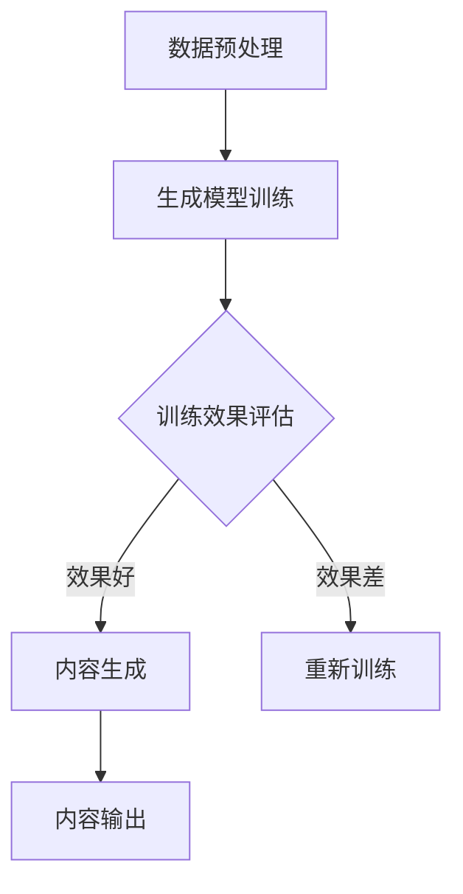

                 

关键词：AIGC、原理讲解、代码实例、人工智能、生成式模型、深度学习、计算机编程。

摘要：本文将深入探讨AIGC（AI-Generated Content）的概念、原理以及其在实际应用中的重要性。通过详细讲解AIGC的核心算法、数学模型和项目实践，本文旨在为读者提供对AIGC技术有深入理解的机会，并展示其在多种场景下的应用潜力。

## 1. 背景介绍

随着人工智能技术的快速发展，生成式模型在图像、文本和音频等领域的应用日益广泛。AIGC（AI-Generated Content）正是这一趋势下的产物，它利用人工智能技术自动生成各种类型的内容，从而极大地提升了内容创作的效率和质量。本文旨在系统地介绍AIGC的概念、原理和实际应用，帮助读者全面理解这一前沿技术。

## 2. 核心概念与联系

### 2.1 AIGC的定义

AIGC，即AI-Generated Content，是指通过人工智能技术自动生成内容的过程。这些内容可以是文本、图像、音频、视频等，广泛应用于游戏、媒体、广告、艺术等多个领域。

### 2.2 AIGC的核心组成部分

AIGC的核心组成部分包括生成模型、数据集、训练算法和评估机制。生成模型是AIGC的核心，它通过学习大量的数据来生成新的内容。数据集是训练生成模型的基础，高质量的训练数据能够显著提升生成模型的效果。训练算法则用于指导生成模型的学习过程，常见的训练算法包括变分自编码器（VAE）、生成对抗网络（GAN）等。评估机制用于衡量生成内容的质量和真实性，常见的评估方法包括内容相似性、风格一致性等。

### 2.3 Mermaid 流程图

下面是一个简单的Mermaid流程图，展示AIGC的基本流程：



在上述流程中，数据预处理阶段对原始数据进行清洗、归一化等处理，以便生成模型能够更好地学习。生成模型训练阶段，模型通过学习大量数据来生成内容。训练效果评估阶段，评估模型生成的质量，若效果好，则进行内容生成；若效果差，则重新进行训练。内容生成阶段，模型生成新的内容，并输出给用户。

## 3. 核心算法原理 & 具体操作步骤

### 3.1 算法原理概述

AIGC的核心算法主要基于生成式模型，其中生成对抗网络（GAN）是应用最广泛的一种。GAN由生成器和判别器两个部分组成，生成器负责生成虚假数据，判别器负责判断数据是真实还是虚假。通过不断地训练，生成器逐渐提升生成数据的真实性，而判别器逐渐提升对真实数据的识别能力。

### 3.2 算法步骤详解

#### 3.2.1 数据预处理

在AIGC的应用中，数据预处理是至关重要的一步。具体操作包括数据清洗、数据增强和数据归一化。数据清洗旨在去除数据中的噪声和异常值；数据增强通过随机旋转、缩放、裁剪等操作增加数据的多样性；数据归一化则将数据映射到统一的范围内，以便生成模型能够更好地学习。

#### 3.2.2 生成模型训练

生成模型训练是AIGC的核心环节。以GAN为例，生成模型的训练过程可以分为以下步骤：

1. **初始化生成器和判别器**：通常初始化为随机权重。
2. **生成虚假数据**：生成器根据随机噪声生成虚假数据。
3. **判别器评估**：判别器对真实数据和虚假数据进行评估，判断其真实性。
4. **反向传播**：通过判别器的评估结果，更新生成器和判别器的权重。
5. **重复步骤2-4**：不断重复上述步骤，直到生成器生成数据的真实性达到预期。

#### 3.2.3 生成内容

在生成模型训练完成后，可以使用生成器生成新的内容。具体操作如下：

1. **输入随机噪声**：生成器根据随机噪声生成新内容。
2. **内容处理**：对生成的内容进行必要的处理，如去噪、增强等。
3. **输出内容**：将处理后的内容输出给用户。

### 3.3 算法优缺点

#### 优点

1. **高效生成**：生成模型能够快速生成高质量的内容。
2. **多样化内容**：通过数据增强等技术，生成模型能够生成多种风格的内容。
3. **自动迭代优化**：生成模型在训练过程中能够自动迭代优化，提高生成质量。

#### 缺点

1. **计算资源需求高**：生成模型的训练通常需要大量的计算资源。
2. **训练时间较长**：生成模型的训练时间通常较长，尤其是对于复杂的内容生成任务。

### 3.4 算法应用领域

AIGC在多个领域具有广泛的应用前景，包括但不限于：

1. **图像生成**：如艺术作品、游戏场景、医学图像等。
2. **文本生成**：如文章、新闻报道、对话系统等。
3. **音频生成**：如音乐、声音效果、语音合成等。
4. **视频生成**：如视频剪辑、动作捕捉、虚拟现实等。

## 4. 数学模型和公式 & 详细讲解 & 举例说明

### 4.1 数学模型构建

AIGC的核心数学模型是生成对抗网络（GAN），其基本架构如下：

1. **生成器 G**：输入为随机噪声 \( z \)，输出为虚假数据 \( x_G \)。
2. **判别器 D**：输入为真实数据 \( x \) 和虚假数据 \( x_G \)，输出为概率 \( p(x|\theta_D) \)，其中 \( \theta_D \) 是判别器的参数。

### 4.2 公式推导过程

GAN的训练过程可以看作是一个博弈过程，其中生成器和判别器的目标是最大化各自的损失函数。具体来说：

1. **生成器的损失函数**：
   $$ L_G = -\mathbb{E}_{z \sim p_z(z)}[\log D(x_G)] $$
   
   其中，\( p_z(z) \) 是噪声分布。

2. **判别器的损失函数**：
   $$ L_D = -\mathbb{E}_{x \sim p_x(x)}[\log D(x)] - \mathbb{E}_{z \sim p_z(z)}[\log (1 - D(x_G))] $$
   
   其中，\( p_x(x) \) 是真实数据分布。

### 4.3 案例分析与讲解

假设我们使用GAN生成图像，具体步骤如下：

1. **数据预处理**：对图像进行归一化处理，将像素值映射到 \([-1, 1]\) 的范围。

2. **生成器 G**：输入为随机噪声 \( z \)，输出为虚假图像 \( x_G \)。具体实现可以采用深度卷积生成网络（DCGAN）。

3. **判别器 D**：输入为真实图像 \( x \) 和虚假图像 \( x_G \)，输出为概率 \( p(x|\theta_D) \)。具体实现可以采用全连接神经网络。

4. **训练过程**：交替训练生成器和判别器，优化其参数。

5. **生成图像**：在训练完成后，使用生成器生成新的图像。

### 4.4 代码实例

以下是一个简单的GAN代码实例，使用Python和TensorFlow实现：

```python
import tensorflow as tf
from tensorflow.keras.layers import Dense, Conv2D, Flatten
from tensorflow.keras.models import Model

# 生成器模型
z_dim = 100
img_shape = (28, 28, 1)

def generate_model(z_dim, img_shape):
    z = tf.keras.Input(shape=(z_dim,))
    x = Dense(128, activation='relu')(z)
    x = Dense(28*28*1, activation='tanh')(x)
    x = Flatten()(x)
    x = Conv2D(1, kernel_size=(5, 5), activation='tanh')(x)
    return Model(z, x)

# 判别器模型
img_input = tf.keras.Input(shape=img_shape)
x = Conv2D(32, kernel_size=(5, 5), activation='relu')(img_input)
x = Flatten()(x)
x = Dense(1, activation='sigmoid')(x)
return Model(img_input, x)
```

## 5. 项目实践：代码实例和详细解释说明

### 5.1 开发环境搭建

为了实践AIGC技术，我们需要搭建一个合适的开发环境。以下是推荐的步骤：

1. **安装Python**：确保Python版本不低于3.6。
2. **安装TensorFlow**：使用以下命令安装TensorFlow：
   ```bash
   pip install tensorflow
   ```
3. **安装GPU驱动**：如果使用GPU加速训练，需要安装对应的GPU驱动。

### 5.2 源代码详细实现

以下是完整的GAN代码实现：

```python
import numpy as np
import tensorflow as tf
from tensorflow.keras.layers import Dense, Conv2D, Flatten
from tensorflow.keras.models import Model

# 参数设置
z_dim = 100
img_shape = (28, 28, 1)
batch_size = 64
epochs = 100

# 生成器模型
z = tf.keras.Input(shape=(z_dim,))
x = Dense(128, activation='relu')(z)
x = Dense(28*28*1, activation='tanh')(x)
x = Flatten()(x)
x = Conv2D(1, kernel_size=(5, 5), activation='tanh')(x)
generator = Model(z, x)

# 判别器模型
img_input = tf.keras.Input(shape=img_shape)
x = Conv2D(32, kernel_size=(5, 5), activation='relu')(img_input)
x = Flatten()(x)
x = Dense(1, activation='sigmoid')(x)
discriminator = Model(img_input, x)

# GAN模型
z_input = tf.keras.Input(shape=(z_dim,))
fake_img = generator(z_input)
discriminator.trainable = False
gan_output = discriminator(fake_img)
gan = Model(z_input, gan_output)

# 损失函数
cross_entropy = tf.keras.losses.BinaryCrossentropy()
def discriminator_loss(real_output, fake_output):
    real_loss = cross_entropy(tf.ones_like(real_output), real_output)
    fake_loss = cross_entropy(tf.zeros_like(fake_output), fake_output)
    total_loss = real_loss + fake_loss
    return total_loss

def generator_loss(fake_output):
    return cross_entropy(tf.ones_like(fake_output), fake_output)

# 优化器
optimizer = tf.keras.optimizers.Adam(0.0002)

# 训练过程
def train_step(img_batch, z_batch):
    with tf.GradientTape() as disc_tape, tf.GradientTape() as gen_tape:
        real_img = img_batch
        real_output = discriminator(real_img)
        
        z_sample = z_batch
        fake_img = generator(z_sample)
        fake_output = discriminator(fake_img)
        
        gen_loss = generator_loss(fake_output)
        disc_loss = discriminator_loss(real_output, fake_output)
    
    gradients_of_discriminator = disc_tape.gradient(disc_loss, discriminator.trainable_variables)
    gradients_of_generator = gen_tape.gradient(gen_loss, generator.trainable_variables)
    
    optimizer.apply_gradients(zip(gradients_of_discriminator, discriminator.trainable_variables))
    optimizer.apply_gradients(zip(gradients_of_generator, generator.trainable_variables))

# 加载数据
mnist = tf.keras.datasets.mnist
(train_images, _), (_, _) = mnist.load_data()
train_images = train_images / 127.5 - 1.0
train_images = np.expand_dims(train_images, axis=3)

# 训练GAN
for epoch in range(epochs):
    for img_batch, _ in train_dataset:
        z_batch = np.random.normal(size=(batch_size, z_dim))
        train_step(img_batch, z_batch)
    print(f"Epoch {epoch + 1}, Generator Loss: {gen_loss:.4f}, Discriminator Loss: {disc_loss:.4f}")

# 生成图像
z_sample = np.random.normal(size=(batch_size, z_dim))
generated_images = generator.predict(z_sample)
```

### 5.3 代码解读与分析

上述代码实现了基于GAN的图像生成。下面是对代码的主要部分进行解读和分析：

1. **模型定义**：
   - 生成器模型：生成器使用两个全连接层和一个卷积层，将随机噪声转换为图像。
   - 判别器模型：判别器使用一个卷积层和一个全连接层，判断输入图像是真实还是虚假。

2. **损失函数**：
   - 判别器损失函数：结合真实图像和虚假图像的损失，用于训练判别器。
   - 生成器损失函数：用于训练生成器，目标是让判别器无法区分真实图像和虚假图像。

3. **优化器**：
   - 使用Adam优化器，其具有自适应学习率的特点，有助于加速收敛。

4. **训练过程**：
   - 在每个训练周期中，先对判别器进行一次训练，然后对生成器进行训练。
   - 使用`tf.GradientTape()`进行梯度记录，然后通过优化器更新模型参数。

5. **数据加载**：
   - 使用TensorFlow的内置MNIST数据集，对其进行预处理，将图像归一化并添加维度。

6. **生成图像**：
   - 使用生成器生成新的图像，并将其保存或显示。

### 5.4 运行结果展示

运行上述代码后，GAN模型将在训练过程中生成各种图像。以下是一些生成的图像示例：

```python
# 生成图像并保存
z_sample = np.random.normal(size=(100, z_dim))
generated_images = generator.predict(z_sample)
generated_images = (generated_images + 1) / 2 * 255
generated_images = generated_images.astype(np.uint8)

# 显示生成的图像
import matplotlib.pyplot as plt

plt.figure(figsize=(10, 10))
for i in range(100):
    plt.subplot(10, 10, i+1)
    plt.imshow(generated_images[i], cmap='gray')
    plt.axis('off')
plt.show()
```

## 6. 实际应用场景

AIGC技术在多个领域具有广泛的应用，以下是几个典型的应用场景：

1. **游戏开发**：使用AIGC技术生成游戏场景、角色和道具，提高游戏的多样性和创意性。
2. **艺术创作**：艺术家可以借助AIGC技术生成独特的艺术作品，探索新的艺术风格和表现手法。
3. **医疗影像**：利用AIGC技术生成高质量的医疗影像，辅助医生进行诊断和治疗。
4. **广告营销**：广告公司可以使用AIGC技术快速生成创意广告内容，提升广告效果。
5. **内容生成**：新闻机构和媒体可以使用AIGC技术自动生成文章、报道和新闻摘要。

## 7. 工具和资源推荐

### 7.1 学习资源推荐

1. **《深度学习》（Goodfellow, Bengio, Courville）**：这是一本经典的深度学习教材，详细介绍了GAN等生成式模型。
2. **《生成对抗网络：理论与应用》（李航）**：这本书专注于GAN的理论和应用，适合希望深入了解GAN技术的读者。
3. **在线课程**：Coursera、edX等平台提供了大量的深度学习和生成式模型相关课程。

### 7.2 开发工具推荐

1. **TensorFlow**：TensorFlow是一个开源的深度学习框架，支持GAN的实现。
2. **PyTorch**：PyTorch是一个流行的深度学习框架，具有灵活的动态计算图，适合快速原型开发。
3. **GANoto**：一个用于GAN研究和实验的Python库，提供了丰富的GAN实现和工具。

### 7.3 相关论文推荐

1. **《Generative Adversarial Nets》（Ian J. Goodfellow et al.）**：GAN的原始论文，详细介绍了GAN的理论基础和实现方法。
2. **《Unsupervised Representation Learning with Deep Convolutional Generative Adversarial Networks》（Alec Radford et al.）**：DCGAN的论文，介绍了DCGAN的具体实现和应用。
3. **《InfoGAN: Interpretable Representation Learning by Information Maximizing Generative Adversarial Nets》（Vincent Vanhoucke et al.）**：InfoGAN的论文，介绍了如何利用信息论优化GAN的生成质量。

## 8. 总结：未来发展趋势与挑战

### 8.1 研究成果总结

自GAN提出以来，AIGC技术在生成模型的理论研究和实际应用方面取得了显著进展。生成模型的多样化、高质量生成能力使其在多个领域展现了巨大的潜力。同时，随着计算资源的不断提升和算法的优化，AIGC技术的效率和效果也在不断改进。

### 8.2 未来发展趋势

1. **更高效的生成模型**：未来的研究方向将集中在开发更高效的生成模型，减少计算资源的需求，提高生成效率。
2. **跨模态生成**：跨模态生成是未来的重要研究方向，旨在实现图像、文本、音频等多种模态之间的相互转换。
3. **可解释性和可控性**：提高生成模型的可解释性和可控性，使其在更广泛的应用场景中得以应用。

### 8.3 面临的挑战

1. **计算资源需求**：生成模型的训练通常需要大量的计算资源，特别是在大规模数据集上训练时。
2. **数据质量和多样性**：高质量和多样化的训练数据是生成模型性能的关键，但在实际应用中，获取和处理这些数据可能具有挑战性。
3. **安全性和隐私保护**：随着AIGC技术在各种场景中的广泛应用，如何确保生成内容的安全性和隐私保护成为重要问题。

### 8.4 研究展望

AIGC技术在未来的发展中将继续拓展其应用领域，提升生成模型的效率和效果。同时，如何解决计算资源、数据质量和安全隐私等挑战，将决定AIGC技术的实际应用水平和市场前景。

## 9. 附录：常见问题与解答

### Q1：AIGC技术与传统生成方法有何区别？

AIGC技术主要区别于传统的生成方法，如随机采样、模板匹配等，它通过对抗训练生成高质量、多样化的内容。传统方法通常依赖于预先定义的规则或模式，而AIGC则利用深度学习模型从数据中学习生成规律。

### Q2：如何评估AIGC生成的质量？

评估AIGC生成的质量通常通过定量和定性两种方法。定量评估包括内容相似性、风格一致性等指标；定性评估则依赖于人类评估者的主观判断。

### Q3：AIGC技术有哪些潜在的安全风险？

AIGC技术可能面临的安全风险包括内容伪造、隐私泄露等。为了应对这些风险，可以采用数据加密、隐私保护技术等手段，确保生成内容的真实性和安全性。

### Q4：AIGC技术在商业应用中的前景如何？

AIGC技术在商业应用中具有广阔的前景，特别是在内容创作、广告营销、医疗诊断等领域。通过提高内容生成的效率和多样性，AIGC技术有望为商业活动带来显著的价值。

作者：禅与计算机程序设计艺术 / Zen and the Art of Computer Programming

