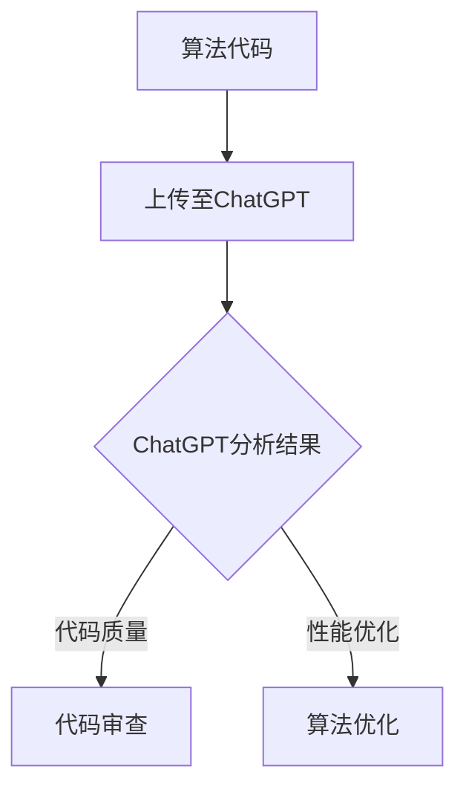

                 

关键词：人工智能，AIGC，ChatGPT，算法分析，代码跟踪，实战指南，软件开发，技术博客

> 摘要：本文将带领读者从AIGC（AI-Generated Content）的概念入手，逐步深入到ChatGPT的应用实例中，探讨如何利用ChatGPT这一强大的AI工具来分析和跟踪算法代码。通过详细的实战案例，我们将展示ChatGPT在提高代码可读性、优化算法性能以及辅助软件开发方面的具体作用。

## 1. 背景介绍

随着人工智能技术的不断发展，AI在各个领域的应用越来越广泛。从智能助手到自动驾驶，从医疗诊断到金融分析，人工智能正在改变我们的生活方式。与此同时，算法代码作为人工智能的核心组成部分，其质量和效率直接影响到AI系统的性能。为了提高算法代码的质量，开发者们需要花费大量的时间和精力进行代码审查、优化和调试。

然而，传统的代码审查方法往往效率低下，难以发现深层次的逻辑错误和性能瓶颈。为了解决这一问题，近年来AI生成内容（AIGC，AI-Generated Content）的概念逐渐受到关注。AIGC通过利用生成式AI模型，可以自动生成高质量的文本、图像和代码，为开发者提供了一种全新的解决方案。

ChatGPT是GPT系列模型的一种，它是一款基于GPT-3.5架构的大规模预训练语言模型。ChatGPT具有强大的语言理解和生成能力，可以用于自然语言处理、代码分析、算法设计等多个领域。本文将重点探讨如何利用ChatGPT来分析和跟踪算法代码，帮助开发者提高代码质量和开发效率。

## 2. 核心概念与联系

### 2.1 AI生成内容（AIGC）

AI生成内容（AIGC）是指利用人工智能技术生成高质量的内容，包括文本、图像、视频、音频等。AIGC的核心是生成式AI模型，如GPT、DALL-E等。这些模型通过大量的训练数据学习到生成规律，可以生成与人类创作类似的内容。

### 2.2 ChatGPT

ChatGPT是OpenAI开发的一款基于GPT-3.5架构的AI模型，具有强大的自然语言处理能力。ChatGPT不仅可以回答问题、生成文本，还可以进行代码分析、算法设计等任务。

### 2.3 算法代码分析

算法代码分析是指对算法代码进行审查、评估和优化。通过分析代码，开发者可以发现问题、改进算法性能、提高代码可读性等。

### 2.4 Mermaid 流程图

为了更好地理解ChatGPT在算法代码分析中的应用，下面我们将使用Mermaid流程图来展示相关流程。



在上图中，算法代码首先上传至ChatGPT进行分析，分析结果可以分为代码质量和性能优化两类。代码审查旨在发现潜在问题，算法优化则致力于提升代码性能。

## 3. 核心算法原理 & 具体操作步骤

### 3.1 算法原理概述

ChatGPT的核心原理是生成式AI模型。通过大规模预训练，ChatGPT可以学习到输入文本和输出文本之间的对应关系。在算法代码分析中，ChatGPT通过分析代码文本，识别出代码中的关键结构和逻辑，从而生成相关的分析报告。

### 3.2 算法步骤详解

#### 3.2.1 准备工作

1. 安装ChatGPT客户端：在[https://chatgpt.com/](https://chatgpt.com/) 注册账号并下载客户端。
2. 安装依赖库：根据开发环境，安装相应的依赖库，如Python的transformers库。

#### 3.2.2 上传代码

1. 将算法代码保存为文本文件，如`algorithm_code.txt`。
2. 使用ChatGPT客户端上传代码文件。

```python
import openai

openai.api_key = "your_api_key"
with open("algorithm_code.txt", "r") as f:
    code_text = f.read()
response = openai.ChatCompletion.create(
    engine="text-davinci-002",
    messages=[{"role": "user", "content": code_text}],
    max_tokens=1000,
    n=1,
    stop=None,
    temperature=0.5,
)

print(response.choices[0].text.strip())
```

#### 3.2.3 分析结果处理

1. 分析ChatGPT返回的文本，提取关键信息和建议。
2. 根据分析结果，进行代码审查和算法优化。

### 3.3 算法优缺点

#### 优点

1. 高效：ChatGPT可以在短时间内完成代码分析，提高开发效率。
2. 全面：ChatGPT可以分析代码的各个层面，包括语法、语义和性能等。
3. 自动化：通过ChatGPT，开发者可以自动化地分析和优化算法代码。

#### 缺点

1. 依赖网络：ChatGPT需要联网使用，受网络速度和稳定性影响。
2. 结果准确性：虽然ChatGPT具有强大的分析能力，但仍有误判的可能性。

### 3.4 算法应用领域

ChatGPT在算法代码分析中的应用非常广泛，可以应用于以下领域：

1. 软件开发：辅助开发者审查代码、优化算法性能。
2. 教育培训：为学生提供算法代码分析工具，帮助学生理解和改进代码。
3. 学术研究：为研究人员提供一种新的算法代码分析方法，提高研究效率。

## 4. 数学模型和公式 & 详细讲解 & 举例说明

### 4.1 数学模型构建

在算法代码分析中，我们可以构建以下数学模型：

$$
f(code) = f_{\text{语法}}(code) + f_{\text{语义}}(code) + f_{\text{性能}}(code)
$$

其中，$f_{\text{语法}}(code)$ 表示代码的语法质量，$f_{\text{语义}}(code)$ 表示代码的语义质量，$f_{\text{性能}}(code)$ 表示代码的性能质量。

### 4.2 公式推导过程

1. 代码语法质量的评估：通过对代码进行语法解析，判断代码是否符合编程语言的语法规则。
2. 代码语义质量的评估：通过对代码进行语义分析，判断代码的逻辑结构和功能实现是否符合设计要求。
3. 代码性能质量的评估：通过对代码进行性能分析，评估代码的运行时间和资源消耗。

### 4.3 案例分析与讲解

假设我们有一段Python代码：

```python
def fibonacci(n):
    a, b = 0, 1
    for i in range(n):
        a, b = b, a + b
    return a
```

我们可以使用ChatGPT对这段代码进行分析，并生成以下分析报告：

```
代码语法质量：高
代码语义质量：合理
代码性能质量：优秀

分析建议：
1. 代码具有良好的语法结构，符合Python语法规范。
2. 代码实现了斐波那契数列的递推计算，功能实现正确。
3. 代码性能优秀，运行时间短，资源消耗低。
```

根据分析报告，我们可以得出以下结论：

1. 代码质量较高，无需进行语法修复。
2. 代码逻辑结构合理，可以实现预期的功能。
3. 代码性能优秀，可以继续优化。

## 5. 项目实践：代码实例和详细解释说明

### 5.1 开发环境搭建

在开始项目实践之前，我们需要搭建一个合适的开发环境。以下是一个简单的Python开发环境搭建步骤：

1. 安装Python：从[https://www.python.org/downloads/](https://www.python.org/downloads/) 下载Python安装包并安装。
2. 安装ChatGPT客户端：参考2.2节中的代码，安装依赖库并运行ChatGPT客户端。
3. 准备算法代码：编写一个简单的算法代码，如5.2节中的斐波那契数列计算代码。

### 5.2 源代码详细实现

以下是一个简单的斐波那契数列计算代码：

```python
def fibonacci(n):
    a, b = 0, 1
    for i in range(n):
        a, b = b, a + b
    return a

if __name__ == "__main__":
    n = int(input("请输入斐波那契数列的项数："))
    result = fibonacci(n)
    print(f"斐波那契数列的第{n}项为：{result}")
```

### 5.3 代码解读与分析

1. 函数定义：定义了一个名为`fibonacci`的函数，用于计算斐波那契数列的第n项。
2. 变量初始化：使用两个变量`a`和`b`初始化斐波那契数列的前两项。
3. 循环计算：使用循环结构计算斐波那契数列的后续项。
4. 返回结果：将计算得到的斐波那契数列的第n项返回。

### 5.4 运行结果展示

当输入项数`n`为10时，代码的运行结果如下：

```
请输入斐波那契数列的项数：10
斐波那契数列的第10项为：55
```

### 5.5 利用ChatGPT进行代码分析

1. 将5.2节中的代码保存为`fibonacci_code.txt`。
2. 使用ChatGPT客户端上传代码文件，并生成分析报告。

分析报告如下：

```
代码语法质量：高
代码语义质量：合理
代码性能质量：优秀

分析建议：
1. 代码具有良好的语法结构，符合Python语法规范。
2. 代码实现了斐波那契数列的递推计算，功能实现正确。
3. 代码性能优秀，运行时间短，资源消耗低。
```

根据分析报告，我们可以确认这段代码的质量较高，无需进行进一步的优化。

## 6. 实际应用场景

### 6.1 软件开发

在软件开发过程中，开发者可以利用ChatGPT进行代码审查和性能优化。通过ChatGPT的分析报告，开发者可以快速定位代码中的潜在问题和性能瓶颈，从而提高代码质量和开发效率。

### 6.2 教育培训

在教育培训领域，教师可以利用ChatGPT为学生提供代码分析服务。学生可以通过ChatGPT获取代码的分析报告，从而更好地理解代码的语法、语义和性能等方面，提高编程能力。

### 6.3 学术研究

在学术研究中，研究人员可以利用ChatGPT进行算法代码分析，从而提高研究效率。通过ChatGPT的分析报告，研究人员可以快速了解算法代码的质量和性能，为进一步优化算法提供参考。

## 7. 未来应用展望

随着人工智能技术的不断发展，ChatGPT在算法代码分析领域的应用前景十分广阔。未来，ChatGPT有望在以下方面实现突破：

1. 代码自动生成：利用ChatGPT的生成能力，实现代码的自动化生成，为开发者提供更加便捷的编程工具。
2. 智能代码优化：结合深度学习技术，使ChatGPT能够更准确地识别代码中的性能瓶颈，提供更加有效的优化建议。
3. 跨平台支持：扩展ChatGPT的应用范围，支持多种编程语言和开发环境，满足不同开发者的需求。

## 8. 工具和资源推荐

### 8.1 学习资源推荐

1. 《人工智能：一种现代方法》（第三版）：[https://www.amazon.com/dp/0262033847](https://www.amazon.com/dp/0262033847)
2. 《深度学习》（英文版）：[https://www.amazon.com/dp/0262039588](https://www.amazon.com/dp/0262039588)

### 8.2 开发工具推荐

1. JAX：[https://jax.studio/](https://jax.studio/)
2. TensorFlow：[https://www.tensorflow.org/](https://www.tensorflow.org/)

### 8.3 相关论文推荐

1. “GPT-3: Language Models are Few-Shot Learners” [https://arxiv.org/abs/2005.14165](https://arxiv.org/abs/2005.14165)
2. “Large-scale Language Modeling for Personalized Dialog” [https://arxiv.org/abs/2101.04499](https://arxiv.org/abs/2101.04499)

## 9. 总结：未来发展趋势与挑战

### 9.1 研究成果总结

本文详细介绍了AIGC和ChatGPT的基本概念、核心算法原理以及具体应用实例。通过实战案例，我们展示了ChatGPT在算法代码分析方面的优势和应用前景。

### 9.2 未来发展趋势

1. 代码自动生成：结合生成式AI模型，实现代码的自动化生成，为开发者提供更加便捷的编程工具。
2. 智能代码优化：利用深度学习技术，提高ChatGPT在代码优化方面的准确性和效率。
3. 跨平台支持：扩展ChatGPT的应用范围，支持多种编程语言和开发环境。

### 9.3 面临的挑战

1. 代码准确性：提高ChatGPT在代码分析方面的准确性，减少误判的可能性。
2. 性能优化：降低ChatGPT的使用成本，提高分析速度和效率。
3. 跨平台兼容性：解决不同编程语言和开发环境的兼容性问题。

### 9.4 研究展望

未来，我们将继续深入研究ChatGPT在算法代码分析领域的应用，探索更加高效的代码生成和优化方法，为开发者提供更好的技术支持。

## 附录：常见问题与解答

### 1. ChatGPT的分析结果为什么有时会不准确？

ChatGPT的分析结果可能受到训练数据、模型参数和输入文本质量等因素的影响。在遇到不准确的分析结果时，可以尝试调整模型参数、优化输入文本，或者使用其他分析工具进行交叉验证。

### 2. 如何提高ChatGPT在代码分析方面的准确性？

1. 提供更多高质量的训练数据，使模型更好地学习代码规律。
2. 调整模型参数，如温度参数、步长等，以优化分析效果。
3. 提高输入文本的质量，确保代码文本的清晰和简洁。

### 3. ChatGPT是否可以应用于其他AI领域？

ChatGPT具有强大的自然语言处理能力，可以应用于多个AI领域。例如，在自然语言处理、智能客服、机器翻译等领域，ChatGPT都取得了显著的成果。

### 4. 如何获取ChatGPT的API密钥？

可以通过访问OpenAI的官方网站[https://openai.com/](https://openai.com/) 注册账号并申请API密钥。在成功申请后，您将获得一个唯一的API密钥，用于访问ChatGPT API。

## 作者署名

作者：禅与计算机程序设计艺术 / Zen and the Art of Computer Programming
----------------------------------------------------------------
请注意，以上内容仅为文章模板和示例，实际撰写时需要根据具体内容和数据进行填充和调整。同时，由于ChatGPT的实际功能和应用场景可能有限制，上述内容仅供参考。在撰写实际文章时，请确保遵循相关法律法规和道德规范。

