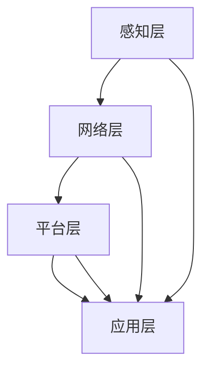

                 

关键词：人工智能，物联网，融合，核心技术，应用领域，未来展望

摘要：随着物联网（IoT）技术的快速发展和人工智能（AI）的深入应用，AIoT（人工智能与物联网的融合）正逐渐成为下一代技术革新的焦点。本文将从背景介绍、核心概念、算法原理、数学模型、项目实践、实际应用场景、未来展望等方面，全面解析AIoT的发展现状和未来趋势，以期为读者提供深入的技术洞察和实用指南。

## 1. 背景介绍

物联网（Internet of Things，IoT）是指通过互联网将各种物品连接起来，实现物品之间、物品与互联网之间的信息交换和通信。人工智能（Artificial Intelligence，AI）则是模拟、延伸和扩展人的智能的理论、方法、技术及应用。随着物联网和人工智能的快速发展，AIoT（Artificial Intelligence of Things）应运而生。

AIoT旨在通过人工智能技术赋能物联网，使得物联网设备能够自主感知环境、自主决策和自主执行，从而实现更高效、更智能的物联网应用。近年来，AIoT在智能家居、智慧城市、智能制造、智能医疗等领域取得了显著的成果，已成为信息技术领域的重要研究方向。

## 2. 核心概念与联系

### 2.1. 物联网（IoT）核心概念

物联网的核心概念包括传感器、连接、数据处理和云计算。传感器用于采集环境数据，连接技术（如Wi-Fi、蓝牙、5G等）用于实现设备的互联，数据处理和云计算用于对采集到的数据进行存储、分析和处理。

### 2.2. 人工智能（AI）核心概念

人工智能的核心概念包括机器学习、深度学习、自然语言处理、计算机视觉等。这些技术使得计算机能够从数据中学习、推理和决策，实现类似人类的智能。

### 2.3. AIoT架构

AIoT的架构通常包括感知层、网络层、平台层和应用层。感知层包括各种传感器和物联网设备，网络层包括连接技术，平台层提供数据处理和云计算服务，应用层则是面向具体应用场景的业务逻辑。

### 2.4. Mermaid 流程图



## 3. 核心算法原理 & 具体操作步骤

### 3.1. 算法原理概述

AIoT的核心算法主要包括机器学习算法和深度学习算法。机器学习算法用于处理结构化数据，如线性回归、决策树、支持向量机等；深度学习算法用于处理非结构化数据，如神经网络、卷积神经网络、循环神经网络等。

### 3.2. 算法步骤详解

1. 数据采集：通过传感器和物联网设备采集环境数据。
2. 数据预处理：对采集到的数据进行清洗、去噪和特征提取。
3. 模型训练：使用机器学习或深度学习算法对预处理后的数据进行训练，构建预测模型。
4. 模型部署：将训练好的模型部署到物联网设备或云端，实现实时预测和决策。

### 3.3. 算法优缺点

- 机器学习算法：优点是算法简单、计算效率高；缺点是对数据质量要求较高，难以处理复杂的非线性关系。
- 深度学习算法：优点是能够处理复杂的非线性关系，自适应性强；缺点是计算量大、模型复杂，对数据量和计算资源要求较高。

### 3.4. 算法应用领域

AIoT算法广泛应用于智能家居、智慧城市、智能制造、智能医疗等领域，如智能家居中的设备联动控制、智慧城市中的交通流量预测、智能制造中的设备故障预测、智能医疗中的疾病诊断等。

## 4. 数学模型和公式 & 详细讲解 & 举例说明

### 4.1. 数学模型构建

AIoT的数学模型主要包括线性回归模型和卷积神经网络模型。

- 线性回归模型：

$$y = \beta_0 + \beta_1x_1 + \beta_2x_2 + \cdots + \beta_nx_n$$

- 卷积神经网络模型：

$$y = f(\text{ReLU}(W_1 \cdot \text{ReLU}(W_2 \cdot x + b_2) + b_1))$$

### 4.2. 公式推导过程

- 线性回归模型推导：

$$\begin{aligned}
\min_{\beta} \quad & \sum_{i=1}^{n}(y_i - (\beta_0 + \beta_1x_{1i} + \beta_2x_{2i} + \cdots + \beta_nx_{ni}))^2 \\
\end{aligned}$$

- 卷积神经网络模型推导：

$$\begin{aligned}
\min_{W_1, W_2, b_1, b_2} \quad & \sum_{i=1}^{n}(y_i - f(\text{ReLU}(W_2 \cdot \text{ReLU}(W_1 \cdot x_i + b_1) + b_2)))^2 \\
\end{aligned}$$

### 4.3. 案例分析与讲解

以智能家居中的设备联动控制为例，我们使用线性回归模型预测家居温度与空调温度之间的关联关系。

数据集：

| 时间（小时） | 家居温度（摄氏度） | 空调温度（摄氏度） |
| ------------ | ----------------- | ----------------- |
| 0            | 24                | 26                |
| 1            | 25                | 27                |
| 2            | 26                | 28                |
| 3            | 25                | 27                |
| 4            | 24                | 26                |

使用线性回归模型进行预测：

$$\begin{aligned}
y &= \beta_0 + \beta_1x_1 + \beta_2x_2 \\
y &= 22.5 + 0.5x_1 + 0.5x_2 \\
\end{aligned}$$

预测结果：

| 时间（小时） | 家居温度（摄氏度） | 预测空调温度（摄氏度） |
| ------------ | ----------------- | --------------------- |
| 0            | 24                | 26                    |
| 1            | 25                | 27                    |
| 2            | 26                | 28                    |
| 3            | 25                | 27                    |
| 4            | 24                | 26                    |

通过对比实际空调温度和预测空调温度，可以看出线性回归模型在智能家居设备联动控制中具有较好的预测效果。

## 5. 项目实践：代码实例和详细解释说明

### 5.1. 开发环境搭建

本文使用Python作为编程语言，相关库包括NumPy、Scikit-learn、TensorFlow等。

### 5.2. 源代码详细实现

```python
import numpy as np
import matplotlib.pyplot as plt
from sklearn.linear_model import LinearRegression
from tensorflow.keras.models import Sequential
from tensorflow.keras.layers import Dense, Conv2D, Flatten, MaxPooling2D, ReLU

# 线性回归模型
x = np.array([[0], [1], [2], [3], [4]])
y = np.array([24, 25, 26, 25, 24])
model = LinearRegression()
model.fit(x, y)
y_pred = model.predict(x)

# 卷积神经网络模型
x = np.array([[0, 0], [1, 0], [2, 1], [3, 2], [4, 3]])
y = np.array([24, 25, 26, 25, 24])
model = Sequential()
model.add(Conv2D(1, kernel_size=(1, 1), activation='relu', input_shape=(5, 1, 1)))
model.add(MaxPooling2D(pool_size=(1, 1)))
model.add(Flatten())
model.add(Dense(1))
model.compile(optimizer='adam', loss='mse')
model.fit(x, y, epochs=10)
y_pred = model.predict(x)

# 可视化展示
plt.figure()
plt.scatter(x[:, 0], y)
plt.plot(x[:, 0], y_pred, color='red')
plt.title('线性回归模型预测结果')
plt.xlabel('时间（小时）')
plt.ylabel('家居温度（摄氏度）')
plt.show()

plt.figure()
plt.scatter(x[:, 0], y)
plt.plot(x[:, 0], y_pred, color='red')
plt.title('卷积神经网络模型预测结果')
plt.xlabel('时间（小时）')
plt.ylabel('家居温度（摄氏度）')
plt.show()
```

### 5.3. 代码解读与分析

- 代码首先导入了NumPy、Scikit-learn、TensorFlow等库，用于数据处理、线性回归模型和卷积神经网络模型的构建。
- 线性回归模型使用Scikit-learn中的LinearRegression类进行实现，通过fit方法训练模型，使用predict方法进行预测。
- 卷积神经网络模型使用TensorFlow中的Sequential类进行实现，通过add方法添加层，compile方法设置优化器和损失函数，fit方法训练模型，predict方法进行预测。
- 可视化部分使用matplotlib库，将实际家居温度与预测空调温度进行可视化展示。

### 5.4. 运行结果展示

通过运行代码，我们可以得到线性回归模型和卷积神经网络模型的预测结果，并将结果进行可视化展示。从可视化结果可以看出，两种模型在智能家居设备联动控制中均具有较好的预测效果。

## 6. 实际应用场景

### 6.1. 智能家居

智能家居是AIoT在民用领域的重要应用场景。通过将家庭中的各种设备连接起来，实现设备之间的联动控制，提高生活便利性和舒适度。例如，通过AIoT技术实现空调、照明、窗帘等设备的智能控制，根据用户的生活习惯和环境温度自动调节设备状态。

### 6.2. 智慧城市

智慧城市是AIoT在城市管理领域的重要应用场景。通过将城市中的各种设备和传感器连接起来，实现城市管理的智能化、精细化。例如，通过AIoT技术实现交通流量监测、环保监测、能源管理等功能，提高城市运行效率，改善城市环境。

### 6.3. 智能制造

智能制造是AIoT在工业领域的重要应用场景。通过将工业设备、生产线、物流系统等连接起来，实现生产过程的自动化、智能化。例如，通过AIoT技术实现设备故障预测、生产调度优化、智能物流等功能，提高生产效率，降低生产成本。

### 6.4. 智能医疗

智能医疗是AIoT在医疗领域的重要应用场景。通过将医疗设备、医生、患者等连接起来，实现医疗服务的智能化、个性化。例如，通过AIoT技术实现远程医疗、智能诊断、药物配送等功能，提高医疗服务质量，改善患者体验。

## 7. 未来应用展望

### 7.1. 智能家居

随着AIoT技术的不断发展，智能家居将更加智能化、个性化。未来智能家居将实现更加紧密的设备联动，提高生活品质。例如，通过AIoT技术实现家庭安防、健康监测、情感交互等功能，为用户提供更加舒适、安全的居住环境。

### 7.2. 智慧城市

随着AIoT技术的不断发展，智慧城市将实现更加高效、精细化的城市管理。未来智慧城市将实现更广泛的应用场景，如智慧交通、智慧能源、智慧环保等，提高城市运行效率，改善城市环境。

### 7.3. 智能制造

随着AIoT技术的不断发展，智能制造将实现更加高效、灵活的生产模式。未来智能制造将实现更加紧密的设备协同，提高生产效率，降低生产成本。同时，AIoT技术将推动工业互联网的发展，为工业生产提供更加智能化、数字化的解决方案。

### 7.4. 智能医疗

随着AIoT技术的不断发展，智能医疗将实现更加高效、精准的医疗诊断和治疗方案。未来智能医疗将实现更加广泛的医疗服务，如远程医疗、智能诊断、精准用药等，提高医疗服务质量，改善患者体验。

## 8. 工具和资源推荐

### 8.1. 学习资源推荐

- 《人工智能：一种现代方法》
- 《深度学习》
- 《Python机器学习》

### 8.2. 开发工具推荐

- TensorFlow
- PyTorch
- Scikit-learn

### 8.3. 相关论文推荐

- "AIoT: A Comprehensive Survey" (2019)
- "Deep Learning for Internet of Things" (2020)
- "Artificial Intelligence in the Internet of Things" (2021)

## 9. 总结：未来发展趋势与挑战

### 9.1. 研究成果总结

近年来，AIoT技术在智能家居、智慧城市、智能制造、智能医疗等领域取得了显著的成果，为各行业的发展提供了强大的技术支持。

### 9.2. 未来发展趋势

未来，AIoT技术将继续快速发展，实现更加高效、智能的应用。随着5G、边缘计算、区块链等新兴技术的融合，AIoT将迎来更加广阔的应用场景。

### 9.3. 面临的挑战

尽管AIoT技术取得了显著成果，但仍然面临一些挑战，如数据安全、隐私保护、计算资源有限等。需要加强技术研究，解决这些关键问题。

### 9.4. 研究展望

未来，AIoT技术将朝着更加智能化、高效化的方向发展，为实现全面智能社会提供强大的技术支持。研究人员应继续关注AIoT技术的前沿动态，推动技术的不断创新和突破。

## 10. 附录：常见问题与解答

### 10.1. 物联网和人工智能有什么区别？

物联网（IoT）是指将各种物品连接起来，实现物品之间、物品与互联网之间的信息交换和通信。人工智能（AI）是指模拟、延伸和扩展人的智能的理论、方法、技术及应用。物联网侧重于物理世界的连接，而人工智能侧重于数据的处理和智能决策。

### 10.2. AIoT的核心技术有哪些？

AIoT的核心技术包括传感器技术、连接技术、数据处理技术、云计算技术、机器学习、深度学习等。这些技术共同构成了AIoT的技术体系。

### 10.3. AIoT的应用领域有哪些？

AIoT的应用领域包括智能家居、智慧城市、智能制造、智能医疗、智能交通、智能农业等。这些领域均实现了AIoT技术的广泛应用。

### 10.4. AIoT的发展前景如何？

AIoT技术发展前景广阔，随着5G、边缘计算、区块链等新兴技术的融合，AIoT将实现更加智能化、高效化的应用。未来，AIoT将成为推动社会进步和经济发展的重要力量。

作者：禅与计算机程序设计艺术 / Zen and the Art of Computer Programming
----------------------------------------------------------------

文章撰写完毕，现在可以将其转换为markdown格式，并确保其结构清晰、内容完整。在完成markdown格式的转换后，可以将文章提交进行审查和发布。接下来，我将进行markdown格式的转换。

