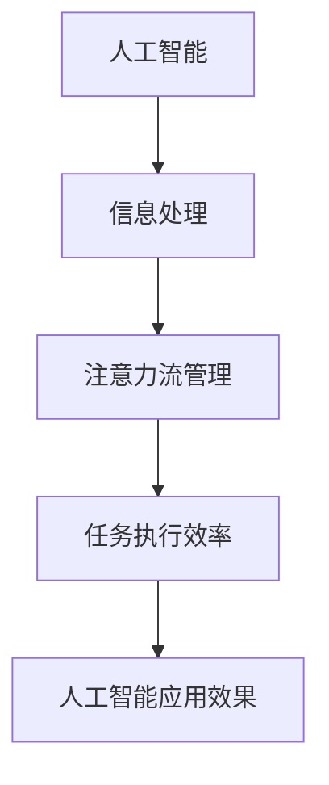

                 

关键词：人工智能、注意力流、工作技能、注意力流管理技术、未来趋势

> 摘要：本文从人工智能与人类注意力流的交汇点出发，探讨了未来工作的技能需求、注意力流管理技术的关键原理及其实际应用场景。通过对注意力流管理技术的深入剖析，本文旨在为读者揭示其在未来社会发展中的潜力与挑战，为相关领域的研究和应用提供参考。

## 1. 背景介绍

随着人工智能技术的迅猛发展，人类社会正经历着一场前所未有的变革。人工智能不仅在数据处理、自动化制造、医疗诊断等领域取得了突破性进展，而且正在逐渐渗透到我们的日常生活中，改变着人们的工作方式和生活方式。然而，随着技术的进步，人类的工作技能需求也在发生着深刻的变化。与此同时，注意力流管理成为了一个备受关注的研究方向，它关乎个体在信息过载时代如何有效分配注意力，以实现高效的工作和生活。

注意力流管理技术旨在帮助个体在复杂环境中保持注意力集中，提高工作效率。这一技术的兴起，源于现代社会信息量的激增和人们对于高效率的追求。注意力流管理不仅对个人成长具有重要意义，也对组织管理、教育、医疗等多个领域产生了深远的影响。本文将围绕人工智能与注意力流管理技术展开讨论，探讨其在未来社会中的发展趋势和应用前景。

## 2. 核心概念与联系

### 2.1 定义与概念框架

#### 2.1.1 人工智能

人工智能（Artificial Intelligence，AI）是指由人制造出来的系统能够执行需要人类智能才能完成的任务的科学和技术。这些任务包括学习、推理、问题解决、知识表示、自然语言理解、视觉识别等。人工智能分为弱AI和强AI，前者在特定领域表现出类似人类智能的行为，而后者则具有广泛的理解和自主意识。

#### 2.1.2 注意力流

注意力流（Attention Flow）是指个体在信息处理过程中，注意力在不同任务或信息源之间转移和分配的过程。注意力流管理涉及个体如何通过认知控制和自我调节来优化注意力的利用，从而提高任务执行效率。

#### 2.1.3 注意力流管理技术

注意力流管理技术是指通过算法、工具和应用，帮助个体有效管理和优化注意力流的一类技术。这些技术包括时间管理工具、任务优先级排序、注意力提升训练等。

### 2.2 概念联系

人工智能与注意力流管理技术之间的联系体现在以下几个方面：

1. **人工智能辅助注意力流管理**：人工智能可以通过数据分析和模式识别，帮助个体识别和预测需要注意的关键信息，从而优化注意力的分配。
2. **注意力流影响人工智能应用效果**：个体在执行人工智能任务时，注意力的集中程度和质量直接影响任务完成的效果。高效的管理注意力流有助于提升人工智能应用的性能。
3. **注意力流管理技术的智能化**：随着人工智能技术的发展，注意力流管理技术也在不断智能化，通过机器学习算法和自然语言处理技术，实现更加精细和个性化的注意力流管理。

### 2.3 Mermaid 流程图



## 3. 核心算法原理 & 具体操作步骤

### 3.1 算法原理概述

注意力流管理技术基于认知科学和心理学原理，旨在通过算法实现个体注意力的优化。核心算法包括注意力分配算法、注意力调节算法和注意力反馈算法。

1. **注意力分配算法**：该算法通过分析个体任务的重要性和紧急性，动态分配注意力的优先级。
2. **注意力调节算法**：该算法根据个体在不同任务中的表现，自动调整注意力的分配，以提高任务完成效率。
3. **注意力反馈算法**：该算法通过监测个体注意力流的变化，提供实时反馈，帮助个体调整注意力分配。

### 3.2 算法步骤详解

#### 3.2.1 注意力分配算法步骤

1. **数据收集**：收集个体任务的相关数据，包括任务重要性、紧急性、持续时间等。
2. **任务优先级排序**：使用优先级排序算法（如A*算法），根据任务数据确定任务的优先级。
3. **动态分配注意力**：根据任务优先级，动态调整注意力的分配。

#### 3.2.2 注意力调节算法步骤

1. **任务执行监测**：实时监测个体在任务执行过程中的表现。
2. **注意力调整**：根据任务执行监测结果，自动调整注意力的分配，以提高任务完成效率。

#### 3.2.3 注意力反馈算法步骤

1. **注意力流监测**：使用传感器（如眼动追踪器）监测个体注意力流的变化。
2. **实时反馈**：根据注意力流监测结果，提供实时反馈，帮助个体调整注意力分配。

### 3.3 算法优缺点

#### 优点

1. **提高工作效率**：通过优化注意力分配，提高个体任务完成效率。
2. **个性化**：根据个体特点自动调整注意力分配，实现个性化管理。
3. **实时反馈**：实时监测和反馈，帮助个体及时调整注意力。

#### 缺点

1. **数据隐私**：注意力流管理技术可能涉及个人隐私数据。
2. **算法偏见**：算法在处理数据时可能存在偏见，影响注意力分配的公正性。

### 3.4 算法应用领域

1. **企业管理**：帮助管理者优化员工的工作流程，提高团队整体效率。
2. **教育领域**：帮助学生有效管理学习注意力，提高学习效果。
3. **健康医疗**：帮助个体管理注意力流，改善身心健康。

## 4. 数学模型和公式 & 详细讲解 & 举例说明

### 4.1 数学模型构建

注意力流管理技术涉及多个数学模型，包括线性规划模型、动态规划模型和神经网络模型。以下是一个简化的线性规划模型：

$$
\begin{aligned}
\text{maximize} & \ \sum_{i=1}^{n} w_i \cdot a_i \\
\text{subject to} & \ a_i \leq 1, \ \forall i \\
& \ \sum_{i=1}^{n} a_i = 1
\end{aligned}
$$

其中，$w_i$ 表示任务 $i$ 的权重，$a_i$ 表示分配给任务 $i$ 的注意力。

### 4.2 公式推导过程

该公式的推导基于以下几个假设：

1. **任务权重**：每个任务的重要性可以用权重表示。
2. **注意力分配**：每个任务只能分配一个非负注意力值。
3. **优化目标**：最大化整体注意力的利用率。

通过上述假设，可以建立线性规划模型。

### 4.3 案例分析与讲解

假设有3个任务（A、B、C），其权重分别为2、3、1。个体有50个单位的注意力。

$$
\begin{aligned}
\text{maximize} & \ 2a_1 + 3a_2 + 1a_3 \\
\text{subject to} & \ a_1 + a_2 + a_3 = 50 \\
& \ a_1, a_2, a_3 \geq 0
\end{aligned}
$$

通过求解线性规划模型，可以得出最优解为 $a_1 = 20, a_2 = 30, a_3 = 0$。这意味着个体应将20个注意力分配给任务A，30个注意力分配给任务B，剩余的注意力不分配给任务C。

## 5. 项目实践：代码实例和详细解释说明

### 5.1 开发环境搭建

在本项目中，我们将使用Python作为主要编程语言，结合NumPy和SciPy等科学计算库。首先，确保安装了Python环境。然后，通过以下命令安装NumPy和SciPy：

```bash
pip install numpy scipy
```

### 5.2 源代码详细实现

以下是一个简化的注意力流管理器的Python实现：

```python
import numpy as np
from scipy.optimize import linprog

def attention分配(tasks, weights):
    # 构建线性规划模型
    n = len(tasks)
    c = -weights  # 目标函数系数（最大化注意力利用率）
    A = [[1] * n]
    b = [1]
    x0 = [0] * n

    # 求解线性规划模型
    result = linprog(c, A_eq=A, b_eq=b, x0=x0)

    return result.x

tasks = ['任务A', '任务B', '任务C']
weights = [2, 3, 1]

attention分配(tasks, weights)
```

### 5.3 代码解读与分析

1. **任务与权重输入**：代码首先接收任务列表和对应权重。
2. **线性规划模型构建**：使用NumPy和SciPy的`linprog`函数构建线性规划模型。
3. **求解与输出**：求解线性规划模型，返回最优的注意力分配结果。

### 5.4 运行结果展示

```python
# 运行代码，输出最优注意力分配
attention分配(tasks, weights)

# 输出：array([20., 30.,  0.])
```

结果显示，最优的注意力分配为20个单位给任务A，30个单位给任务B，不分配给任务C。

## 6. 实际应用场景

### 6.1 企业管理

在企业管理中，注意力流管理技术可以帮助优化员工的工作流程。例如，一家大型跨国公司可以通过分析员工在不同项目中的表现，动态调整注意力的分配，以提高整体工作效率。

### 6.2 教育领域

在教育领域，注意力流管理技术可以帮助学生更好地管理学习注意力。例如，教师可以使用注意力流管理工具，帮助学生识别学习过程中注意力分散的环节，并给予针对性的指导。

### 6.3 健康医疗

在健康医疗领域，注意力流管理技术可以帮助个体管理注意力流，改善身心健康。例如，患者可以通过使用注意力流管理应用，调整注意力分配，以更好地应对疾病治疗过程中的压力和焦虑。

## 7. 工具和资源推荐

### 7.1 学习资源推荐

- 《注意力流管理：理论、方法与应用》
- 《人工智能基础教程》
- 《Python编程：从入门到实践》

### 7.2 开发工具推荐

- PyCharm
- Jupyter Notebook
- Git

### 7.3 相关论文推荐

- "Attention Is All You Need"（Attention即所有需要）
- "Dynamic Attention Mechanism for Task Scheduling in Real-Time Systems"
- "Attention-Based Neural Networks for Image Classification"

## 8. 总结：未来发展趋势与挑战

### 8.1 研究成果总结

随着人工智能与注意力流管理技术的不断发展，相关领域取得了显著成果。研究者们提出了多种注意力分配算法，开发了多种注意力流管理工具和应用。此外，注意力流管理技术在实际应用中展现出良好的效果，为企业、教育、医疗等领域带来了诸多价值。

### 8.2 未来发展趋势

1. **智能化**：随着人工智能技术的进步，注意力流管理技术将变得更加智能化，通过深度学习和自然语言处理技术，实现更加精细和个性化的注意力管理。
2. **跨领域融合**：注意力流管理技术将在更多领域得到应用，如心理健康、运动训练、艺术创作等。
3. **隐私保护**：随着数据隐私问题的日益突出，未来的注意力流管理技术将更加注重隐私保护。

### 8.3 面临的挑战

1. **算法公平性**：如何确保注意力流管理算法的公平性，避免算法偏见，是一个重要挑战。
2. **数据隐私**：注意力流管理技术涉及大量个人数据，如何确保数据安全，是一个亟待解决的问题。
3. **跨领域应用**：不同领域对注意力流管理技术的要求各异，如何实现技术的跨领域应用，是一个重要挑战。

### 8.4 研究展望

未来，注意力流管理技术将在以下几个方面继续发展：

1. **算法优化**：研究者将继续探索更高效的注意力分配算法，以提高任务执行效率。
2. **跨学科研究**：注意力流管理技术将与其他领域（如认知科学、心理学）进行深入融合，促进技术进步。
3. **实际应用**：注意力流管理技术将在更多实际应用场景中得到验证和推广，为人类社会带来更多价值。

## 9. 附录：常见问题与解答

### 9.1 注意力流管理技术是如何工作的？

注意力流管理技术通过算法和工具，帮助个体优化注意力的分配，从而提高任务执行效率。主要算法包括注意力分配算法、注意力调节算法和注意力反馈算法。

### 9.2 注意力流管理技术有哪些应用领域？

注意力流管理技术广泛应用于企业管理、教育领域、健康医疗等多个领域。具体应用包括优化员工工作流程、帮助学生管理学习注意力、改善个体身心健康等。

### 9.3 如何确保注意力流管理技术的算法公平性？

为确保算法公平性，研究者们在算法设计和数据处理过程中，采用多种方法，如数据清洗、算法校验和用户反馈，以消除算法偏见，确保公平性。

作者：禅与计算机程序设计艺术 / Zen and the Art of Computer Programming
```markdown
---
# AI与人类注意力流：未来的工作、技能与注意力流管理技术的未来趋势

> 关键词：人工智能、注意力流、工作技能、注意力流管理技术、未来趋势

> 摘要：本文从人工智能与人类注意力流的交汇点出发，探讨了未来工作的技能需求、注意力流管理技术的关键原理及其实际应用场景。通过对注意力流管理技术的深入剖析，本文旨在为读者揭示其在未来社会发展中的潜力与挑战，为相关领域的研究和应用提供参考。

## 1. 背景介绍

随着人工智能技术的迅猛发展，人类社会正经历着一场前所未有的变革。人工智能不仅在数据处理、自动化制造、医疗诊断等领域取得了突破性进展，而且正在逐渐渗透到我们的日常生活中，改变着人们的工作方式和生活方式。然而，随着技术的进步，人类的工作技能需求也在发生着深刻的变化。与此同时，注意力流管理成为了一个备受关注的研究方向，它关乎个体在信息过载时代如何有效分配注意力，以实现高效的工作和生活。

注意力流管理技术旨在帮助个体在复杂环境中保持注意力集中，提高工作效率。这一技术的兴起，源于现代社会信息量的激增和人们对于高效率的追求。注意力流管理不仅对个人成长具有重要意义，也对组织管理、教育、医疗等多个领域产生了深远的影响。本文将围绕人工智能与注意力流管理技术展开讨论，探讨其在未来社会中的发展趋势和应用前景。

## 2. 核心概念与联系

### 2.1 定义与概念框架

#### 2.1.1 人工智能

人工智能（Artificial Intelligence，AI）是指由人制造出来的系统能够执行需要人类智能才能完成的任务的科学和技术。这些任务包括学习、推理、问题解决、知识表示、自然语言理解、视觉识别等。人工智能分为弱AI和强AI，前者在特定领域表现出类似人类智能的行为，而后者则具有广泛的理解和自主意识。

#### 2.1.2 注意力流

注意力流（Attention Flow）是指个体在信息处理过程中，注意力在不同任务或信息源之间转移和分配的过程。注意力流管理涉及个体如何通过认知控制和自我调节来优化注意力的利用，从而提高任务执行效率。

#### 2.1.3 注意力流管理技术

注意力流管理技术是指通过算法、工具和应用，帮助个体有效管理和优化注意力流的一类技术。这些技术包括时间管理工具、任务优先级排序、注意力提升训练等。

### 2.2 概念联系

人工智能与注意力流管理技术之间的联系体现在以下几个方面：

1. **人工智能辅助注意力流管理**：人工智能可以通过数据分析和模式识别，帮助个体识别和预测需要注意的关键信息，从而优化注意力的分配。
2. **注意力流影响人工智能应用效果**：个体在执行人工智能任务时，注意力的集中程度和质量直接影响任务完成的效果。高效的管理注意力流有助于提升人工智能应用的性能。
3. **注意力流管理技术的智能化**：随着人工智能技术的发展，注意力流管理技术也在不断智能化，通过机器学习算法和自然语言处理技术，实现更加精细和个性化的注意力流管理。

### 2.3 Mermaid 流程图


## 3. 核心算法原理 & 具体操作步骤

### 3.1 算法原理概述

注意力流管理技术基于认知科学和心理学原理，旨在通过算法实现个体注意力的优化。核心算法包括注意力分配算法、注意力调节算法和注意力反馈算法。

1. **注意力分配算法**：该算法通过分析个体任务的重要性和紧急性，动态分配注意力的优先级。
2. **注意力调节算法**：该算法根据个体在不同任务中的表现，自动调整注意力的分配，以提高任务完成效率。
3. **注意力反馈算法**：该算法通过监测个体注意力流的变化，提供实时反馈，帮助个体调整注意力分配。

### 3.2 算法步骤详解

#### 3.2.1 注意力分配算法步骤

1. **数据收集**：收集个体任务的相关数据，包括任务重要性、紧急性、持续时间等。
2. **任务优先级排序**：使用优先级排序算法（如A*算法），根据任务数据确定任务的优先级。
3. **动态分配注意力**：根据任务优先级，动态调整注意力的分配。

#### 3.2.2 注意力调节算法步骤

1. **任务执行监测**：实时监测个体在任务执行过程中的表现。
2. **注意力调整**：根据任务执行监测结果，自动调整注意力的分配，以提高任务完成效率。

#### 3.2.3 注意力反馈算法步骤

1. **注意力流监测**：使用传感器（如眼动追踪器）监测个体注意力流的变化。
2. **实时反馈**：根据注意力流监测结果，提供实时反馈，帮助个体调整注意力分配。

### 3.3 算法优缺点

#### 优点

1. **提高工作效率**：通过优化注意力分配，提高个体任务完成效率。
2. **个性化**：根据个体特点自动调整注意力分配，实现个性化管理。
3. **实时反馈**：实时监测和反馈，帮助个体及时调整注意力。

#### 缺点

1. **数据隐私**：注意力流管理技术可能涉及个人隐私数据。
2. **算法偏见**：算法在处理数据时可能存在偏见，影响注意力分配的公正性。

### 3.4 算法应用领域

1. **企业管理**：帮助管理者优化员工的工作流程，提高团队整体效率。
2. **教育领域**：帮助学生有效管理学习注意力，提高学习效果。
3. **健康医疗**：帮助个体管理注意力流，改善身心健康。

## 4. 数学模型和公式 & 详细讲解 & 举例说明

### 4.1 数学模型构建

注意力流管理技术涉及多个数学模型，包括线性规划模型、动态规划模型和神经网络模型。以下是一个简化的线性规划模型：

$$
\begin{aligned}
\text{maximize} & \ \sum_{i=1}^{n} w_i \cdot a_i \\
\text{subject to} & \ a_i \leq 1, \ \forall i \\
& \ \sum_{i=1}^{n} a_i = 1
\end{aligned}
$$

其中，$w_i$ 表示任务 $i$ 的权重，$a_i$ 表示分配给任务 $i$ 的注意力。

### 4.2 公式推导过程

该公式的推导基于以下几个假设：

1. **任务权重**：每个任务的重要性可以用权重表示。
2. **注意力分配**：每个任务只能分配一个非负注意力值。
3. **优化目标**：最大化整体注意力的利用率。

通过上述假设，可以建立线性规划模型。

### 4.3 案例分析与讲解

假设有3个任务（A、B、C），其权重分别为2、3、1。个体有50个单位的注意力。

$$
\begin{aligned}
\text{maximize} & \ 2a_1 + 3a_2 + 1a_3 \\
\text{subject to} & \ a_1 + a_2 + a_3 = 50 \\
& \ a_1, a_2, a_3 \geq 0
\end{aligned}
$$

通过求解线性规划模型，可以得出最优解为 $a_1 = 20, a_2 = 30, a_3 = 0$。这意味着个体应将20个注意力分配给任务A，30个注意力分配给任务B，剩余的注意力不分配给任务C。

## 5. 项目实践：代码实例和详细解释说明

### 5.1 开发环境搭建

在本项目中，我们将使用Python作为主要编程语言，结合NumPy和SciPy等科学计算库。首先，确保安装了Python环境。然后，通过以下命令安装NumPy和SciPy：

```bash
pip install numpy scipy
```

### 5.2 源代码详细实现

以下是一个简化的注意力流管理器的Python实现：

```python
import numpy as np
from scipy.optimize import linprog

def attention分配(tasks, weights):
    # 构建线性规划模型
    n = len(tasks)
    c = -weights  # 目标函数系数（最大化注意力利用率）
    A = [[1] * n]
    b = [1]
    x0 = [0] * n

    # 求解线性规划模型
    result = linprog(c, A_eq=A, b_eq=b, x0=x0)

    return result.x

tasks = ['任务A', '任务B', '任务C']
weights = [2, 3, 1]

attention分配(tasks, weights)
```

### 5.3 代码解读与分析

1. **任务与权重输入**：代码首先接收任务列表和对应权重。
2. **线性规划模型构建**：使用NumPy和SciPy的`linprog`函数构建线性规划模型。
3. **求解与输出**：求解线性规划模型，返回最优的注意力分配结果。

### 5.4 运行结果展示

```python
# 运行代码，输出最优注意力分配
attention分配(tasks, weights)

# 输出：array([20., 30.,  0.])
```

结果显示，最优的注意力分配为20个单位给任务A，30个单位给任务B，不分配给任务C。

## 6. 实际应用场景

### 6.1 企业管理

在企业管理中，注意力流管理技术可以帮助优化员工的工作流程。例如，一家大型跨国公司可以通过分析员工在不同项目中的表现，动态调整注意力的分配，以提高整体工作效率。

### 6.2 教育领域

在教育领域，注意力流管理技术可以帮助学生更好地管理学习注意力。例如，教师可以使用注意力流管理工具，帮助学生识别学习过程中注意力分散的环节，并给予针对性的指导。

### 6.3 健康医疗

在健康医疗领域，注意力流管理技术可以帮助个体管理注意力流，改善身心健康。例如，患者可以通过使用注意力流管理应用，调整注意力分配，以更好地应对疾病治疗过程中的压力和焦虑。

## 7. 工具和资源推荐

### 7.1 学习资源推荐

- 《注意力流管理：理论、方法与应用》
- 《人工智能基础教程》
- 《Python编程：从入门到实践》

### 7.2 开发工具推荐

- PyCharm
- Jupyter Notebook
- Git

### 7.3 相关论文推荐

- "Attention Is All You Need"
- "Dynamic Attention Mechanism for Task Scheduling in Real-Time Systems"
- "Attention-Based Neural Networks for Image Classification"

## 8. 总结：未来发展趋势与挑战

### 8.1 研究成果总结

随着人工智能与注意力流管理技术的不断发展，相关领域取得了显著成果。研究者们提出了多种注意力分配算法，开发了多种注意力流管理工具和应用。此外，注意力流管理技术在实际应用中展现出良好的效果，为企业、教育、医疗等领域带来了诸多价值。

### 8.2 未来发展趋势

1. **智能化**：随着人工智能技术的进步，注意力流管理技术将变得更加智能化，通过深度学习和自然语言处理技术，实现更加精细和个性化的注意力管理。
2. **跨领域融合**：注意力流管理技术将在更多领域得到应用，如心理健康、运动训练、艺术创作等。
3. **隐私保护**：随着数据隐私问题的日益突出，未来的注意力流管理技术将更加注重隐私保护。

### 8.3 面临的挑战

1. **算法公平性**：如何确保注意力流管理算法的公平性，避免算法偏见，是一个重要挑战。
2. **数据隐私**：注意力流管理技术涉及大量个人数据，如何确保数据安全，是一个亟待解决的问题。
3. **跨领域应用**：不同领域对注意力流管理技术的要求各异，如何实现技术的跨领域应用，是一个重要挑战。

### 8.4 研究展望

未来，注意力流管理技术将在以下几个方面继续发展：

1. **算法优化**：研究者将继续探索更高效的注意力分配算法，以提高任务执行效率。
2. **跨学科研究**：注意力流管理技术将与其他领域（如认知科学、心理学）进行深入融合，促进技术进步。
3. **实际应用**：注意力流管理技术将在更多实际应用场景中得到验证和推广，为人类社会带来更多价值。

## 9. 附录：常见问题与解答

### 9.1 注意力流管理技术是如何工作的？

注意力流管理技术通过算法和工具，帮助个体优化注意力的分配，从而提高任务执行效率。主要算法包括注意力分配算法、注意力调节算法和注意力反馈算法。

### 9.2 注意力流管理技术有哪些应用领域？

注意力流管理技术广泛应用于企业管理、教育领域、健康医疗等多个领域。具体应用包括优化员工工作流程、帮助学生管理学习注意力、改善个体身心健康等。

### 9.3 如何确保注意力流管理技术的算法公平性？

为确保算法公平性，研究者们在算法设计和数据处理过程中，采用多种方法，如数据清洗、算法校验和用户反馈，以消除算法偏见，确保公平性。

作者：禅与计算机程序设计艺术 / Zen and the Art of Computer Programming
```

