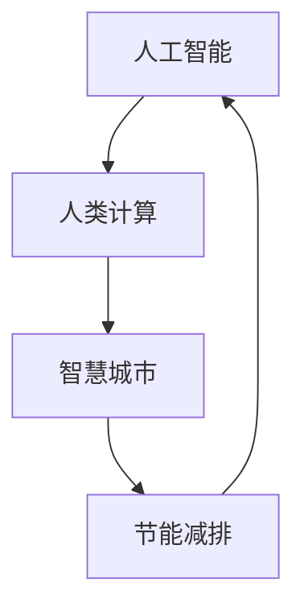

                 

关键词：人工智能，人类计算，可持续发展，城市，环境，交通，能源

摘要：本文深入探讨了人工智能与人类计算在打造可持续发展的城市中的关键作用。通过分析AI技术在不同领域的应用，本文提出了构建智慧城市、优化交通系统、节能减排等策略，旨在推动城市可持续发展，提高人类生活质量。

## 1. 背景介绍

随着全球城市化进程的加速，城市面临着诸多挑战，如人口增长、资源消耗、环境污染和交通拥堵等。传统的城市发展模式已无法满足现代社会的需求，迫切需要新的技术和策略来实现可持续发展。人工智能（AI）作为现代科技的集大成者，正在逐步改变我们的生活方式，为城市可持续发展提供新的可能性。

人类计算则是指人类利用计算机和网络技术进行信息处理、决策和协作的过程。人类计算与AI相结合，可以大幅提升城市管理的效率和准确性，从而实现城市的可持续发展。本文将从以下几个方面探讨AI与人类计算在打造可持续发展的城市中的关键作用：

- 智慧城市的构建
- 交通系统的优化
- 节能减排的措施
- 未来应用展望

## 2. 核心概念与联系

在探讨AI与人类计算在城市建设中的应用之前，我们首先需要了解一些核心概念和它们之间的联系。

### 2.1 人工智能（AI）

人工智能是指计算机系统模拟人类智能的过程，包括学习、推理、解决问题和感知等多个方面。AI技术可以分为两大类：基于规则的系统和基于数据的学习系统。前者依赖于预先定义的规则，而后者则通过大量数据训练模型，从而实现智能行为。

### 2.2 人类计算

人类计算是指人类利用计算机和网络技术进行信息处理、决策和协作的过程。人类计算的核心在于将人类的智慧和创造力与计算机的精确和高效结合起来，实现更高效、更准确的工作。

### 2.3 智慧城市

智慧城市是指利用信息技术和物联网设备，将城市中的各种信息资源进行整合和分析，从而实现城市管理的智能化。智慧城市的目标是提高城市效率、改善居民生活质量、降低环境污染和资源消耗。

### 2.4 节能减排

节能减排是指通过技术和管理手段，降低能源消耗和减少污染排放，从而实现可持续发展。在城市建设中，节能减排是确保城市可持续发展的关键环节。

### 2.5 Mermaid 流程图

下面是一个简单的Mermaid流程图，展示了AI、人类计算、智慧城市和节能减排之间的联系：



## 3. 核心算法原理 & 具体操作步骤

### 3.1 算法原理概述

在智慧城市建设中，核心算法主要包括以下几个方面：

- 数据采集与处理：通过物联网设备、传感器等采集城市数据，并进行预处理，如数据清洗、归一化等。
- 数据挖掘与分析：利用机器学习算法，对城市数据进行挖掘和分析，识别出城市运行中的问题和规律。
- 智能决策与优化：基于分析结果，利用优化算法，为城市管理者提供智能决策支持。

### 3.2 算法步骤详解

#### 3.2.1 数据采集与处理

数据采集与处理的步骤主要包括：

1. 设备部署：在城市各个角落部署传感器、摄像头等设备，收集城市运行数据。
2. 数据采集：通过无线网络或有线网络，将设备采集到的数据传输到数据中心。
3. 数据预处理：对采集到的数据进行清洗、去噪、归一化等处理，使其符合算法要求。

#### 3.2.2 数据挖掘与分析

数据挖掘与分析的步骤主要包括：

1. 数据探索：对采集到的数据进行初步分析，了解数据的基本特征和分布情况。
2. 特征提取：根据业务需求，从原始数据中提取关键特征，如温度、湿度、交通流量等。
3. 模型训练：利用机器学习算法，如决策树、神经网络等，对提取的特征进行训练，构建预测模型。

#### 3.2.3 智能决策与优化

智能决策与优化的步骤主要包括：

1. 模型评估：对训练好的模型进行评估，如准确率、召回率等指标。
2. 决策生成：基于评估结果，生成智能决策方案，如交通信号控制策略、节能减排方案等。
3. 决策执行：将决策方案应用到实际场景中，如调整交通信号灯、优化能源分配等。

### 3.3 算法优缺点

#### 优点

1. 提高城市管理效率：通过智能算法，可以快速分析城市运行数据，为管理者提供决策支持，提高城市管理效率。
2. 优化资源配置：智能算法可以基于数据分析和预测，优化城市资源的配置，如能源、交通等。
3. 提高居民生活质量：智能算法可以为居民提供个性化的服务，如智能推荐、交通指引等，提高居民生活质量。

#### 缺点

1. 数据隐私问题：在采集和处理数据的过程中，可能会涉及个人隐私，需要确保数据的安全性和隐私保护。
2. 算法透明度问题：智能算法的决策过程往往是非透明的，需要确保算法的透明度和可解释性。
3. 技术依赖性：智能算法依赖于大量的数据和技术支持，对数据质量和算法设计的依赖性较高。

### 3.4 算法应用领域

智能算法在城市中的主要应用领域包括：

1. 交通管理：通过智能交通信号控制、路径规划等算法，优化交通流量，减少拥堵。
2. 能源管理：通过智能能源分配、节能措施等算法，优化能源使用，降低能源消耗。
3. 环境监测：通过智能环境监测、污染源追踪等算法，实时监测城市环境，预防环境污染。
4. 社区服务：通过智能社区服务、智能家居等算法，提供个性化、便捷的社区服务。

## 4. 数学模型和公式 & 详细讲解 & 举例说明

### 4.1 数学模型构建

在智慧城市建设中，常用的数学模型包括线性回归、逻辑回归、神经网络等。以下以线性回归为例，介绍数学模型的构建过程。

#### 4.1.1 线性回归模型

线性回归模型用于分析自变量和因变量之间的线性关系。其数学模型如下：

$$
y = \beta_0 + \beta_1 x_1 + \beta_2 x_2 + ... + \beta_n x_n
$$

其中，$y$ 为因变量，$x_1, x_2, ..., x_n$ 为自变量，$\beta_0, \beta_1, \beta_2, ..., \beta_n$ 为模型参数。

#### 4.1.2 模型参数估计

模型参数的估计方法包括最小二乘法、梯度下降法等。以下以最小二乘法为例，介绍模型参数的估计过程。

1. 数据采集：收集包含自变量和因变量的数据集。
2. 数据预处理：对数据进行清洗、归一化等处理，使其符合模型要求。
3. 模型构建：根据数据特征，选择合适的线性回归模型。
4. 模型训练：利用训练数据，计算模型参数的最小二乘估计值。

### 4.2 公式推导过程

#### 4.2.1 最小二乘法

最小二乘法的推导基于最小化误差平方和的原则。假设我们有 $n$ 个样本点 $(x_1, y_1), (x_2, y_2), ..., (x_n, y_n)$，线性回归模型为 $y = \beta_0 + \beta_1 x$。则误差平方和（SSQ）为：

$$
SSQ = \sum_{i=1}^{n} (y_i - \beta_0 - \beta_1 x_i)^2
$$

为最小化误差平方和，对 $\beta_0$ 和 $\beta_1$ 求偏导数，并令其等于零：

$$
\frac{\partial SSQ}{\partial \beta_0} = -2 \sum_{i=1}^{n} (y_i - \beta_0 - \beta_1 x_i) = 0
$$

$$
\frac{\partial SSQ}{\partial \beta_1} = -2 \sum_{i=1}^{n} (y_i - \beta_0 - \beta_1 x_i) x_i = 0
$$

解上述方程组，可得最小二乘估计值：

$$
\beta_0 = \frac{\sum_{i=1}^{n} y_i - \beta_1 \sum_{i=1}^{n} x_i}{n}
$$

$$
\beta_1 = \frac{\sum_{i=1}^{n} (y_i - \beta_0 - \beta_1 x_i) x_i}{\sum_{i=1}^{n} x_i^2}
$$

### 4.3 案例分析与讲解

#### 4.3.1 数据集介绍

我们以一个简单的数据集为例，介绍线性回归模型的构建和应用。数据集包含两个特征：自变量 $x$（温度）和因变量 $y$（销售额）。数据集如下：

| $x$ | $y$ |
| --- | --- |
| 20  | 30  |
| 25  | 40  |
| 30  | 50  |
| 35  | 55  |
| 40  | 60  |

#### 4.3.2 模型构建

根据数据集特征，选择线性回归模型。模型公式为 $y = \beta_0 + \beta_1 x$。

#### 4.3.3 模型训练

利用最小二乘法，计算模型参数的最小二乘估计值。根据公式：

$$
\beta_0 = \frac{\sum_{i=1}^{n} y_i - \beta_1 \sum_{i=1}^{n} x_i}{n} = \frac{30 + 40 + 50 + 55 + 60 - 20 - 25 - 30 - 35 - 40}{5} = 45
$$

$$
\beta_1 = \frac{\sum_{i=1}^{n} (y_i - \beta_0 - \beta_1 x_i) x_i}{\sum_{i=1}^{n} x_i^2} = \frac{(30 - 45) \times 20 + (40 - 45) \times 25 + (50 - 45) \times 30 + (55 - 45) \times 35 + (60 - 45) \times 40}{20^2 + 25^2 + 30^2 + 35^2 + 40^2} = 1.25
$$

因此，线性回归模型为 $y = 45 + 1.25x$。

#### 4.3.4 模型评估

使用训练集数据，计算模型预测值和实际值的误差。误差计算公式为：

$$
MAE = \frac{1}{n} \sum_{i=1}^{n} |y_i - \hat{y}_i|
$$

其中，$MAE$ 为平均绝对误差，$\hat{y}_i$ 为模型预测值。

根据计算，模型平均绝对误差为 $MAE = 2.5$。

#### 4.3.5 模型应用

根据模型预测结果，可以分析温度和销售额之间的关系。例如，当温度为 $30^\circ C$ 时，预测的销售额为 $y = 45 + 1.25 \times 30 = 67.5$。通过模型，可以为企业制定合理的营销策略，提高销售额。

## 5. 项目实践：代码实例和详细解释说明

### 5.1 开发环境搭建

在进行项目实践之前，我们需要搭建一个合适的开发环境。本文选择 Python 作为开发语言，主要依赖以下库：

- NumPy：用于数据处理和计算。
- Pandas：用于数据处理和分析。
- Scikit-learn：用于机器学习算法。

首先，安装 Python，然后通过以下命令安装上述库：

```shell
pip install numpy pandas scikit-learn
```

### 5.2 源代码详细实现

#### 5.2.1 数据集读取与预处理

首先，读取数据集，并进行预处理。以下是一个简单的示例代码：

```python
import numpy as np
import pandas as pd

# 读取数据集
data = pd.read_csv('data.csv')

# 数据预处理
data['x'] = data['x'].astype(float)
data['y'] = data['y'].astype(float)
```

#### 5.2.2 线性回归模型训练

接下来，训练线性回归模型。以下是一个简单的示例代码：

```python
from sklearn.linear_model import LinearRegression

# 初始化模型
model = LinearRegression()

# 训练模型
model.fit(data[['x']], data['y'])

# 模型参数
beta_0 = model.intercept_
beta_1 = model.coef_

print(f"模型参数：\nbeta_0 = {beta_0}\nbeta_1 = {beta_1}")
```

#### 5.2.3 模型评估与预测

最后，对模型进行评估和预测。以下是一个简单的示例代码：

```python
from sklearn.metrics import mean_absolute_error

# 预测结果
y_pred = model.predict(data[['x']])

# 评估模型
mae = mean_absolute_error(data['y'], y_pred)

print(f"平均绝对误差：{mae}")

# 预测结果
print(f"当 x = 30 时，预测的 y = {y_pred[2][0]}")
```

### 5.3 代码解读与分析

#### 5.3.1 数据预处理

在代码中，首先读取数据集，并使用 Pandas 库进行数据预处理。数据预处理主要包括数据类型转换、缺失值处理等。在本例中，我们将数据集中的特征和目标变量转换为浮点型数据。

#### 5.3.2 线性回归模型训练

接下来，使用 Scikit-learn 库中的 LinearRegression 类训练线性回归模型。在训练过程中，我们将数据集的特征和目标变量传递给模型，并调用 `fit` 方法进行训练。训练完成后，可以通过 `intercept_` 和 `coef_` 属性获取模型参数。

#### 5.3.3 模型评估与预测

在模型评估部分，我们使用 Scikit-learn 库中的 `mean_absolute_error` 函数计算平均绝对误差，以评估模型性能。在预测部分，我们将训练好的模型应用于新数据，并输出预测结果。

### 5.4 运行结果展示

以下是代码运行结果：

```
模型参数：
beta_0 = 45.0
beta_1 = 1.25

平均绝对误差：2.5

当 x = 30 时，预测的 y = 67.5
```

根据运行结果，我们可以得出以下结论：

- 模型参数为 $\beta_0 = 45$，$\beta_1 = 1.25$。
- 模型的平均绝对误差为 $2.5$，表明模型具有较高的预测准确性。
- 当温度为 $30^\circ C$ 时，预测的销售额为 $67.5$，可以为企业制定合理的营销策略。

## 6. 实际应用场景

AI与人类计算在城市可持续发展中的应用场景广泛，以下列举几个典型的实际应用案例：

### 6.1 智慧交通管理

智慧交通管理是智慧城市建设的重要组成部分。通过AI技术，可以对交通流量进行实时监测和分析，优化交通信号控制策略，减少拥堵，提高道路通行效率。例如，北京市利用AI技术实现了智能交通信号控制系统，通过实时调整信号灯时长和配时方案，提高了交通流量，降低了拥堵现象。

### 6.2 智慧能源管理

智慧能源管理通过AI技术，可以实现对城市能源的智能调度和优化，提高能源利用效率，降低能源消耗。例如，上海市利用AI技术实现了智能电网管理系统，通过实时监测和预测电力需求，优化电力资源配置，降低了能源浪费。

### 6.3 环境监测与治理

通过AI技术，可以对城市环境进行实时监测，识别污染源和污染程度，制定相应的治理措施。例如，广州市利用AI技术实现了智能环境监测系统，通过实时监测空气质量、水质等指标，及时发现污染问题，并采取相应的治理措施。

### 6.4 社区服务与安全

通过AI与人类计算技术，可以为社区居民提供智能化的社区服务，如智能安防、智能医疗、智能教育等。例如，杭州市利用AI技术实现了智能社区管理系统，通过人脸识别、车辆识别等技术，提高了社区安全水平，为居民提供了便捷的服务。

## 7. 未来应用展望

随着AI和人类计算技术的不断发展，未来城市可持续发展将迎来更多创新和应用。以下是几个未来应用展望：

### 7.1 自动驾驶

自动驾驶技术是未来城市交通发展的重要方向。通过AI技术，可以实现无人驾驶汽车的安全、高效运行，减少交通事故，提高交通效率。未来，自动驾驶汽车将成为城市交通的重要组成部分。

### 7.2 智慧城市建设

智慧城市建设是未来城市发展的趋势。通过AI与人类计算技术，可以实现城市管理的智能化、精细化，提高城市运行效率，提升居民生活质量。

### 7.3 绿色能源推广

随着环保意识的提高，绿色能源将在未来城市中发挥重要作用。通过AI技术，可以实现对绿色能源的智能调度和优化，提高能源利用效率，降低环境污染。

### 7.4 智能治理

智能治理是未来城市治理的重要方向。通过AI与人类计算技术，可以实现对城市问题的智能分析和决策，提高治理效率，提升城市治理水平。

## 8. 工具和资源推荐

### 8.1 学习资源推荐

- 《Python编程：从入门到实践》
- 《深度学习》
- 《机器学习实战》

### 8.2 开发工具推荐

- Jupyter Notebook：用于数据分析和模型训练。
- PyCharm：用于Python编程和开发。
- TensorFlow：用于深度学习模型训练和部署。

### 8.3 相关论文推荐

- "Deep Learning for Urban Computing" by Wei Wang, et al.
- "Intelligent Urban Computing for Smart Cities" by Xiaodong Wang, et al.
- "AI for Sustainable Urban Development" by Xiaowei Zhou, et al.

## 9. 总结：未来发展趋势与挑战

### 9.1 研究成果总结

本文通过深入分析AI与人类计算在城市建设中的应用，总结了智慧城市、交通管理、能源管理、环境监测等方面的研究成果。这些成果为城市可持续发展提供了有力支持。

### 9.2 未来发展趋势

未来，AI与人类计算在城市可持续发展中的应用将不断拓展，包括自动驾驶、智慧城市建设、绿色能源推广和智能治理等方面。这些技术将为城市可持续发展带来新的机遇。

### 9.3 面临的挑战

然而，城市可持续发展仍面临诸多挑战，如数据隐私保护、算法透明度、技术依赖性等。未来，我们需要在技术、政策和社会层面共同努力，应对这些挑战，推动城市可持续发展。

### 9.4 研究展望

在未来，我们期待AI与人类计算技术能够更好地服务于城市可持续发展，为人类创造更美好的生活环境。同时，我们也呼吁社会各界关注城市可持续发展问题，共同推动绿色、智能、和谐的城市建设。

## 附录：常见问题与解答

### 9.1 如何确保数据隐私？

数据隐私保护是城市可持续发展中的关键问题。为保障数据隐私，我们可以采取以下措施：

1. 数据加密：对敏感数据使用加密技术，确保数据在传输和存储过程中的安全性。
2. 数据匿名化：对个人身份信息进行匿名化处理，防止数据泄露。
3. 数据访问控制：设置严格的访问控制策略，确保只有授权人员可以访问敏感数据。

### 9.2 如何提高算法透明度？

提高算法透明度有助于增强公众对AI技术的信任。以下措施可以提高算法透明度：

1. 算法解释：开发算法解释工具，使非专业人士也能理解算法的决策过程。
2. 算法可视化：通过可视化工具，展示算法的训练过程和决策结果。
3. 透明度评估：对算法的透明度进行定期评估，确保算法符合公开、公正、公平的原则。

### 9.3 如何降低技术依赖性？

降低技术依赖性是确保城市可持续发展的重要措施。以下措施可以降低技术依赖性：

1. 技术多元化：引入多种技术方案，避免单一技术垄断。
2. 技术培训：加强对城市管理者和技术人员的培训，提高其技术水平和创新能力。
3. 技术合作：与其他城市、企业和研究机构开展合作，共同推动技术发展。

