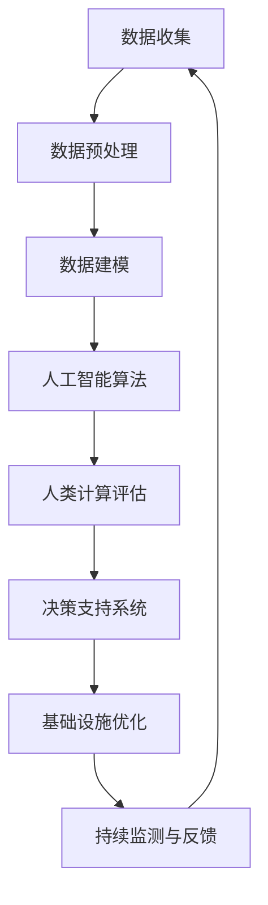

                 

关键词：人工智能，城市交通，基础设施，可持续发展，计算模型，算法，数据分析，交通运输规划

> 摘要：随着全球城市化进程的加速，城市交通和基础设施面临前所未有的挑战。人工智能作为一种强有力的工具，正逐步改变传统城市规划和交通管理的模式。本文旨在探讨如何利用人工智能与人类计算的结合，实现城市交通与基础设施的可持续发展，并通过具体案例展示其实际应用和未来前景。

## 1. 背景介绍

### 1.1 城市交通与基础设施的挑战

城市化进程带来了人口密度增加、交通拥堵、能源消耗和环境恶化等问题。传统城市规划和基础设施管理方式已无法满足现代城市的需求。因此，寻找一种可持续的解决方案已成为当务之急。

### 1.2 人工智能的崛起

近年来，人工智能技术取得了飞速发展，尤其是在机器学习、深度学习、计算机视觉和自然语言处理等领域。人工智能的应用不仅提升了效率和准确性，还提供了新的思考方式。

### 1.3 人类计算的力量

人类计算，即人类专家的智慧和经验，是解决复杂问题的重要资源。通过将人工智能与人类计算相结合，可以充分发挥两者的优势，提高城市交通和基础设施的管理水平。

## 2. 核心概念与联系

### 2.1 核心概念

- **城市交通**：指城市内部的交通流动，包括车辆、行人、公共交通等。
- **基础设施**：包括道路、桥梁、隧道、公共交通系统等。
- **可持续发展**：满足当前需求而不损害未来世代满足其需求的能力。

### 2.2 联系与架构

以下是利用人工智能和人类计算实现城市交通与基础设施可持续发展的Mermaid流程图：



### 2.3 关键环节解释

- **数据收集与预处理**：通过传感器、摄像头、社交媒体等渠道收集城市交通和基础设施数据，并进行清洗、格式化等预处理。
- **数据建模**：构建数学模型，以量化分析城市交通和基础设施的性能。
- **人工智能算法**：利用机器学习和深度学习技术，对数据进行智能分析，识别交通模式和趋势。
- **人类计算评估**：专家对算法分析结果进行评估，结合人类经验提供决策建议。
- **决策支持系统**：将评估结果转化为具体的行动方案，用于优化基础设施。
- **持续监测与反馈**：对优化方案进行实时监测，及时调整策略，实现动态管理。

## 3. 核心算法原理 & 具体操作步骤

### 3.1 算法原理概述

本文将介绍一种基于深度强化学习的交通流量预测算法。该算法利用历史交通数据，通过深度神经网络学习交通流量模式，并在实时数据输入时进行预测。

### 3.2 算法步骤详解

#### 3.2.1 数据收集

收集包括交通流量、天气状况、节假日信息等在内的各种数据。

#### 3.2.2 数据预处理

对收集到的数据进行清洗、格式化，确保数据质量。

#### 3.2.3 数据建模

使用时间序列分析方法，构建交通流量预测模型。

#### 3.2.4 深度强化学习

利用深度神经网络，实现交通流量预测的自动化。

#### 3.2.5 预测与评估

在模型训练完成后，使用实时数据对模型进行预测，并对预测结果进行评估。

### 3.3 算法优缺点

#### 优点：

- **自适应性强**：能够根据实时数据不断调整预测模型。
- **准确性高**：利用深度神经网络，提高预测精度。

#### 缺点：

- **计算复杂度高**：深度强化学习算法需要大量计算资源。
- **数据依赖性强**：模型的性能高度依赖于数据的质量和数量。

### 3.4 算法应用领域

- **智能交通管理**：用于优化交通信号控制和路线规划。
- **城市规划**：用于评估城市规划方案对交通流量的影响。
- **环境监测**：结合空气质量、噪音等数据，实现智能环境监测。

## 4. 数学模型和公式 & 详细讲解 & 举例说明

### 4.1 数学模型构建

本文使用的时间序列预测模型为ARIMA（自回归积分滑动平均模型）。

### 4.2 公式推导过程

ARIMA模型由三个部分组成：自回归（AR）、差分（I）和移动平均（MA）。其数学表达式为：

\[ \text{ARIMA}(p, d, q) = \phi(B) \, \sigma^2(B) / \theta(B) \]

其中：

- \( B \) 是滞后算子。
- \( \phi(B) \) 是自回归项。
- \( \sigma^2(B) \) 是误差项的移动平均。
- \( \theta(B) \) 是差分项的移动平均。

### 4.3 案例分析与讲解

假设我们收集了某城市某路段在过去一年的交通流量数据，现在使用ARIMA模型进行预测。

#### 4.3.1 数据预处理

对数据进行平稳性检验，发现数据存在非平稳性，因此需要进行差分处理。

#### 4.3.2 模型选择

通过AIC（赤池信息准则）和SBIC（施瓦茨信息准则）选择最优的ARIMA模型参数。

#### 4.3.3 模型训练

使用历史数据进行模型训练，得到最优的ARIMA模型。

#### 4.3.4 预测

使用训练好的模型对未来的交通流量进行预测。

#### 4.3.5 预测评估

将预测结果与实际数据进行对比，评估模型的准确性。

## 5. 项目实践：代码实例和详细解释说明

### 5.1 开发环境搭建

在Python环境中安装必要的库，如pandas、numpy、statsmodels等。

### 5.2 源代码详细实现

以下是使用ARIMA模型进行交通流量预测的Python代码示例：

```python
import pandas as pd
from statsmodels.tsa.arima.model import ARIMA

# 数据加载与预处理
data = pd.read_csv('traffic_data.csv')
data['date'] = pd.to_datetime(data['date'])
data.set_index('date', inplace=True)
data = data.diff().dropna()

# 模型训练
model = ARIMA(data['流量'], order=(5,1,2))
model_fit = model.fit()

# 预测
forecast = model_fit.forecast(steps=5)

# 预测结果展示
forecast.plot()
```

### 5.3 代码解读与分析

- **数据加载与预处理**：读取交通流量数据，将日期转换为索引，并进行差分处理以消除非平稳性。
- **模型训练**：使用ARIMA模型进行训练，指定自回归、差分和移动平均的参数。
- **预测**：使用训练好的模型进行预测，预测未来5个时间步的交通流量。
- **预测结果展示**：将预测结果绘制成图表，以便于分析和理解。

### 5.4 运行结果展示

运行上述代码后，将生成一张预测交通流量的时间序列图表，用于展示预测结果。

## 6. 实际应用场景

### 6.1 智能交通管理

通过交通流量预测，智能交通管理系统可以实时调整交通信号灯，优化交通流量，减少拥堵。

### 6.2 城市规划

在规划新城市或扩建现有城市时，可以利用交通流量预测数据来评估不同方案对交通流量的影响。

### 6.3 环境监测

结合空气质量、噪音等数据，实现智能环境监测，提供更加舒适的城市生活环境。

## 7. 未来应用展望

随着人工智能技术的不断发展，城市交通和基础设施的管理将变得更加智能、高效。未来，我们有望看到以下应用场景：

### 7.1 智能化交通系统

利用5G和物联网技术，实现车辆与基础设施之间的实时通信，构建高度智能化的交通系统。

### 7.2 自动驾驶技术

自动驾驶技术的成熟将彻底改变城市交通模式，减少交通事故，提高交通效率。

### 7.3 环境友好型交通

鼓励使用公共交通、自行车和电动交通工具，减少对环境的污染。

## 8. 工具和资源推荐

### 8.1 学习资源推荐

- 《深度学习》（Goodfellow, Bengio, Courville著）
- 《机器学习实战》（周志华著）

### 8.2 开发工具推荐

- Python（用于数据分析和建模）
- TensorFlow（用于深度学习）

### 8.3 相关论文推荐

- “Deep Learning for Transportation”（作者：DeepMind团队）
- “AI for Urban Planning”（作者：麻省理工学院城市实验室）

## 9. 总结：未来发展趋势与挑战

### 9.1 研究成果总结

人工智能在城市交通和基础设施管理中的应用已取得显著成果，为可持续发展提供了新的思路和方法。

### 9.2 未来发展趋势

随着技术的不断进步，人工智能在城市交通和基础设施管理中的应用将更加广泛，实现更高效、更智能的管理。

### 9.3 面临的挑战

- **数据隐私**：如何保护用户隐私是一个重要问题。
- **技术成熟度**：当前技术仍需进一步发展，才能应对复杂的城市交通环境。

### 9.4 研究展望

未来，我们需要进一步探索如何将人工智能与人类计算更好地结合，实现城市交通和基础设施的智能化、可持续发展。

## 附录：常见问题与解答

### 问题1：人工智能技术是否会对人类工作产生威胁？

解答：人工智能技术确实有可能替代一些重复性、低技能的工作，但同时也创造了新的工作岗位，如数据科学家、人工智能工程师等。总体来说，人工智能与人类劳动是互补关系。

### 问题2：如何确保人工智能系统的公平性和透明性？

解答：确保人工智能系统的公平性和透明性是当前研究的重要方向。通过引入可解释性人工智能（Explainable AI）技术，可以使得人工智能决策过程更加透明，便于人类理解和监督。

[作者：禅与计算机程序设计艺术 / Zen and the Art of Computer Programming]
----------------------------------------------------------------

这篇文章详细介绍了如何利用人工智能和人类计算结合，实现城市交通和基础设施的可持续发展。通过算法原理、数学模型、项目实践和实际应用场景的讲解，展示了人工智能在城市规划和管理中的潜力。未来的发展将继续深化这一领域的研究，为构建更加智能、高效、可持续的城市提供支持。

