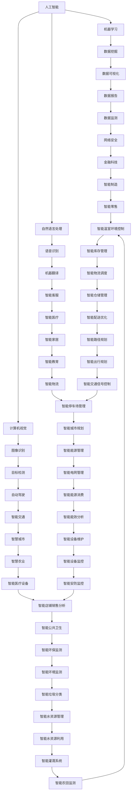

                 

关键词：人工智能、人类计算、社会体系、可持续性、技术融合、未来展望

> 摘要：本文深入探讨了人工智能与人类计算的融合如何构建一个可持续发展的社会体系。通过分析核心概念、算法原理、数学模型、项目实践以及实际应用场景，我们旨在为读者提供一份全面的技术指南，同时展望未来发展的趋势与挑战。

## 1. 背景介绍

人工智能（AI）作为计算机科学的前沿领域，已经取得了显著的发展。然而，在AI技术迅猛发展的同时，我们面临着一个重要问题：如何确保AI技术的发展能够与人类社会的需求相协调，并促进社会的可持续发展？这不仅仅是一个技术问题，更是一个关乎人类社会未来的重要议题。

人类计算，即人类与计算机系统的交互过程，是AI与人类关系中的重要组成部分。随着AI技术的普及，人类计算在决策支持、数据分析、智能交互等方面发挥着越来越重要的作用。然而，当前人类计算体系仍然存在许多挑战，如数据隐私保护、人机协同效率、计算资源分配等。

在本文中，我们将探讨如何通过融合AI与人类计算，构建一个可持续发展的社会体系。本文将分为以下几个部分：

- 背景介绍：阐述AI与人类计算的重要性及面临的挑战。
- 核心概念与联系：介绍AI与人类计算的核心概念及架构。
- 核心算法原理 & 具体操作步骤：深入分析AI算法的原理及操作步骤。
- 数学模型和公式 & 详细讲解 & 举例说明：探讨AI相关的数学模型和公式。
- 项目实践：展示实际项目中的AI与人类计算应用实例。
- 实际应用场景：分析AI与人类计算在实际场景中的应用。
- 未来应用展望：探讨未来AI与人类计算的发展趋势与展望。
- 工具和资源推荐：推荐学习资源、开发工具及相关论文。
- 总结：总结研究成果，展望未来发展趋势与挑战。

## 2. 核心概念与联系

在探讨AI与人类计算的融合之前，我们需要先了解这两个领域中的核心概念和它们之间的联系。

### 2.1 人工智能（AI）

人工智能是指通过计算机系统实现人类智能的模拟和扩展。AI技术主要包括机器学习、深度学习、自然语言处理、计算机视觉等。其中，机器学习是AI的核心技术之一，通过训练算法从数据中学习规律，实现自动化的决策和预测。

### 2.2 人类计算

人类计算是指人类与计算机系统的交互过程，包括数据输入、决策支持、问题求解、人机协同等。人类计算强调人与计算机之间的协作，通过人工智能技术提高人类的工作效率和生活质量。

### 2.3 核心概念原理和架构

为了更好地理解AI与人类计算的联系，我们可以使用Mermaid流程图来展示它们的核心概念和架构。



### 2.4 核心概念原理和架构

在上述Mermaid流程图中，我们可以看到AI与人类计算的核心概念和架构。AI技术包括机器学习、自然语言处理、计算机视觉等，这些技术为人类计算提供了强大的支持。而人类计算则涵盖了数据输入、决策支持、问题求解、人机协同等，这些过程与AI技术相辅相成，共同构建了一个可持续发展的社会体系。

## 3. 核心算法原理 & 具体操作步骤

### 3.1 算法原理概述

在AI与人类计算的融合过程中，核心算法起着至关重要的作用。以下将介绍几种常用的核心算法及其原理：

#### 3.1.1 机器学习算法

机器学习算法是AI技术的核心，它通过训练模型从数据中学习规律，实现自动化决策和预测。常见的机器学习算法包括线性回归、决策树、支持向量机、神经网络等。

#### 3.1.2 深度学习算法

深度学习算法是一种基于神经网络的机器学习算法，它在图像识别、语音识别、自然语言处理等领域取得了显著成果。常见的深度学习算法包括卷积神经网络（CNN）、循环神经网络（RNN）、长短期记忆网络（LSTM）等。

#### 3.1.3 自然语言处理算法

自然语言处理算法用于处理和解析人类语言，包括文本分类、命名实体识别、情感分析、机器翻译等。常见的自然语言处理算法包括词向量模型、序列标注模型、注意力机制等。

#### 3.1.4 计算机视觉算法

计算机视觉算法用于理解和解析图像和视频，包括图像分类、目标检测、人脸识别、图像分割等。常见的计算机视觉算法包括卷积神经网络、深度卷积神经网络、残差网络等。

### 3.2 算法步骤详解

以下将详细介绍几种核心算法的具体操作步骤：

#### 3.2.1 机器学习算法

1. 数据收集与预处理：收集相关数据，对数据清洗、去重、归一化等处理。
2. 特征工程：提取数据中的特征，进行特征选择和特征转换。
3. 模型训练：选择合适的机器学习算法，训练模型。
4. 模型评估：使用测试数据评估模型性能，调整模型参数。
5. 模型应用：将训练好的模型应用于实际问题，实现自动化决策和预测。

#### 3.2.2 深度学习算法

1. 数据收集与预处理：与机器学习算法相同，对数据进行清洗、去重、归一化等处理。
2. 网络设计：设计合适的神经网络结构，包括输入层、隐藏层、输出层等。
3. 权重初始化：对神经网络中的权重进行初始化，常用的方法包括随机初始化、高斯分布初始化等。
4. 模型训练：使用训练数据对神经网络进行训练，通过反向传播算法更新权重。
5. 模型评估：与机器学习算法类似，使用测试数据评估模型性能。
6. 模型应用：将训练好的模型应用于实际问题，实现自动化决策和预测。

#### 3.2.3 自然语言处理算法

1. 数据收集与预处理：与机器学习算法和深度学习算法相同，对数据进行清洗、去重、归一化等处理。
2. 词向量表示：将文本数据转换为词向量表示，常用的方法包括Word2Vec、GloVe等。
3. 模型训练：使用训练数据对模型进行训练，包括文本分类、命名实体识别、情感分析等。
4. 模型评估：使用测试数据评估模型性能，调整模型参数。
5. 模型应用：将训练好的模型应用于实际问题，实现自动化决策和预测。

#### 3.2.4 计算机视觉算法

1. 数据收集与预处理：与机器学习算法和深度学习算法相同，对数据进行清洗、去重、归一化等处理。
2. 特征提取：从图像中提取特征，常用的方法包括卷积神经网络、深度卷积神经网络等。
3. 模型训练：使用训练数据对模型进行训练，包括图像分类、目标检测、人脸识别等。
4. 模型评估：使用测试数据评估模型性能，调整模型参数。
5. 模型应用：将训练好的模型应用于实际问题，实现自动化决策和预测。

### 3.3 算法优缺点

每种算法都有其优缺点，以下将分析几种核心算法的优缺点：

#### 3.3.1 机器学习算法

优点：

- 算法简单，易于实现和部署。
- 对大规模数据集具有较好的适应性。
- 能够处理多种类型的数据。

缺点：

- 对特征工程要求较高。
- 模型可解释性较差。

#### 3.3.2 深度学习算法

优点：

- 在图像、语音、自然语言处理等领域取得了显著成果。
- 能够自动提取特征，降低了对特征工程的要求。
- 具有较强的非线性建模能力。

缺点：

- 训练过程较慢，对计算资源要求较高。
- 模型可解释性较差。

#### 3.3.3 自然语言处理算法

优点：

- 能够处理自然语言数据，实现自动化文本分析。
- 对文本数据具有较好的理解能力。

缺点：

- 对大规模文本数据处理速度较慢。
- 模型可解释性较差。

#### 3.3.4 计算机视觉算法

优点：

- 能够实现自动化图像识别和分析。
- 对图像数据具有较好的理解能力。

缺点：

- 对大规模图像数据处理速度较慢。
- 模型可解释性较差。

### 3.4 算法应用领域

核心算法在不同领域具有广泛的应用，以下将列举几个应用领域：

#### 3.4.1 图像识别

- 目标检测：用于检测图像中的目标物体，如人脸检测、车辆检测等。
- 图像分类：用于将图像分类到预定义的类别中，如猫狗分类、植物分类等。
- 图像分割：用于将图像分割为不同的区域，如人脸分割、车道线检测等。

#### 3.4.2 自然语言处理

- 文本分类：用于对文本数据进行分类，如新闻分类、情感分析等。
- 命名实体识别：用于识别文本中的命名实体，如人名、地名、机构名等。
- 情感分析：用于分析文本中的情感倾向，如评论分析、股票预测等。

#### 3.4.3 语音识别

- 语音识别：用于将语音信号转换为文本数据，如智能客服、语音搜索等。
- 语音合成：用于将文本数据转换为语音信号，如语音助手、语音播报等。

#### 3.4.4 智能决策

- 智能推荐：用于根据用户行为和历史数据推荐相关内容，如电商推荐、内容推荐等。
- 智能优化：用于解决复杂优化问题，如物流调度、库存管理等。

## 4. 数学模型和公式 & 详细讲解 & 举例说明

在AI与人类计算的应用中，数学模型和公式起着至关重要的作用。以下将介绍几个常见的数学模型和公式，并详细讲解其推导过程和实际应用。

### 4.1 数学模型构建

#### 4.1.1 线性回归模型

线性回归模型是一种常见的数学模型，用于预测一个连续变量。其基本公式为：

$$ y = wx + b $$

其中，$y$ 为预测值，$x$ 为自变量，$w$ 为权重，$b$ 为偏置。

#### 4.1.2 逻辑回归模型

逻辑回归模型是一种常见的分类模型，用于预测一个离散变量。其基本公式为：

$$ P(y=1) = \frac{1}{1 + e^{-(wx + b)}} $$

其中，$P(y=1)$ 为预测类别1的概率，$e$ 为自然底数。

#### 4.1.3 卷积神经网络（CNN）

卷积神经网络是一种深度学习模型，用于图像识别、目标检测等任务。其基本公式为：

$$ h_{ij} = \sum_{k=1}^{n} w_{ik} \times g_{kj} + b $$

其中，$h_{ij}$ 为输出值，$w_{ik}$ 为权重，$g_{kj}$ 为输入值，$b$ 为偏置。

### 4.2 公式推导过程

以下将介绍几个常见数学模型的推导过程。

#### 4.2.1 线性回归模型推导

线性回归模型的推导过程基于最小二乘法。假设我们有一组数据点$(x_i, y_i)$，其中$i=1,2,...,n$。我们的目标是找到一个线性模型$y = wx + b$，使得实际值$y_i$与预测值$y$之间的误差最小。

首先，定义误差函数：

$$ E = \sum_{i=1}^{n} (y_i - wx_i - b)^2 $$

然后，对误差函数求导，并令导数为0，得到：

$$ \frac{dE}{dw} = -2 \sum_{i=1}^{n} (y_i - wx_i - b)x_i = 0 $$

$$ \frac{dE}{db} = -2 \sum_{i=1}^{n} (y_i - wx_i - b) = 0 $$

解上述方程组，可以得到最优的权重$w$和偏置$b$：

$$ w = \frac{\sum_{i=1}^{n} (y_i - wx_i)}{\sum_{i=1}^{n} x_i^2} $$

$$ b = \frac{\sum_{i=1}^{n} y_i - w \sum_{i=1}^{n} x_i}{n} $$

#### 4.2.2 逻辑回归模型推导

逻辑回归模型的推导过程基于最大似然估计。假设我们有一组数据点$(x_i, y_i)$，其中$y_i$为二分类变量，取值为0或1。我们的目标是找到一个逻辑回归模型，使得实际数据在模型下的概率最大。

逻辑回归模型的基本公式为：

$$ P(y=1) = \frac{1}{1 + e^{-(wx + b)}} $$

对数似然函数为：

$$ L = \sum_{i=1}^{n} y_i \ln(P(y=1)) + (1 - y_i) \ln(1 - P(y=1)) $$

对数似然函数关于$w$和$b$的导数为：

$$ \frac{dL}{dw} = \sum_{i=1}^{n} (y_i - P(y=1))x_i $$

$$ \frac{dL}{db} = \sum_{i=1}^{n} (y_i - P(y=1)) $$

令上述导数为0，解方程组可以得到最优的权重$w$和偏置$b$：

$$ w = \frac{\sum_{i=1}^{n} (y_i - P(y=1))x_i}{\sum_{i=1}^{n} x_i} $$

$$ b = \frac{\sum_{i=1}^{n} (y_i - P(y=1))}{n} $$

#### 4.2.3 卷积神经网络（CNN）推导

卷积神经网络的推导过程基于局部感知和平移不变性。假设我们有一张图像$X$，我们需要对图像进行特征提取和分类。卷积神经网络的基本公式为：

$$ h_{ij} = \sum_{k=1}^{n} w_{ik} \times g_{kj} + b $$

其中，$h_{ij}$ 为输出值，$w_{ik}$ 为权重，$g_{kj}$ 为输入值，$b$ 为偏置。

卷积神经网络的工作原理是通过对输入图像进行局部感知，并利用平移不变性来提取特征。在训练过程中，我们使用反向传播算法更新权重和偏置，使得网络能够对输入图像进行准确的分类。

### 4.3 案例分析与讲解

以下将通过一个实际案例来分析数学模型和公式在实际应用中的作用。

#### 4.3.1 案例背景

假设我们有一个图像分类任务，需要对一张输入图像进行分类，将其分为猫、狗或其他类别。我们使用卷积神经网络（CNN）来实现这个任务。

#### 4.3.2 数据准备

首先，我们需要准备训练数据和测试数据。假设我们有一组包含猫、狗和其他类别图像的图片数据集，其中每张图片的大小为$28 \times 28$像素。我们将训练数据集分为训练集和验证集，以训练和验证模型的性能。

#### 4.3.3 网络设计

接下来，我们需要设计一个卷积神经网络（CNN）来对图像进行分类。我们可以使用以下网络结构：

- 输入层：接收$28 \times 28$像素的图像。
- 卷积层1：使用32个3x3的卷积核，步长为1，激活函数为ReLU。
- 池化层1：使用2x2的最大池化操作。
- 卷积层2：使用64个3x3的卷积核，步长为1，激活函数为ReLU。
- 池化层2：使用2x2的最大池化操作。
- 全连接层1：使用128个神经元，激活函数为ReLU。
- 全连接层2：使用3个神经元，表示三个类别，激活函数为softmax。

#### 4.3.4 模型训练

使用训练数据集对卷积神经网络（CNN）进行训练。在训练过程中，我们使用反向传播算法更新权重和偏置，以最小化模型损失函数。训练过程中，我们可以使用Adam优化器来提高训练效率。

#### 4.3.5 模型评估

使用测试数据集对训练好的模型进行评估。我们可以计算模型在测试数据集上的准确率、召回率、F1值等指标，以评估模型性能。

#### 4.3.6 模型应用

将训练好的模型应用于实际图像分类任务。例如，对一张新的输入图像进行分类，输出预测类别。

通过上述案例，我们可以看到数学模型和公式在实际应用中的作用。在图像分类任务中，卷积神经网络（CNN）通过局部感知和平移不变性提取图像特征，实现图像分类。同时，线性回归、逻辑回归等模型在训练过程中用于更新网络权重和偏置，提高模型性能。

## 5. 项目实践：代码实例和详细解释说明

在本节中，我们将通过一个实际项目来展示如何将AI与人类计算相结合，并详细解释代码的实现过程。

### 5.1 开发环境搭建

首先，我们需要搭建一个合适的开发环境。在本项目中，我们使用Python作为主要编程语言，并结合TensorFlow和Keras等开源库来实现卷积神经网络（CNN）。

1. 安装Python：前往Python官方网站（https://www.python.org/）下载并安装Python 3.x版本。
2. 安装TensorFlow：使用pip命令安装TensorFlow，命令如下：

   ```bash
   pip install tensorflow
   ```

3. 安装Keras：使用pip命令安装Keras，命令如下：

   ```bash
   pip install keras
   ```

### 5.2 源代码详细实现

以下是一个简单的CNN图像分类项目的源代码实现：

```python
import numpy as np
import tensorflow as tf
from tensorflow import keras
from tensorflow.keras import layers

# 数据准备
(x_train, y_train), (x_test, y_test) = keras.datasets.cifar10.load_data()
x_train = x_train.astype("float32") / 255
x_test = x_test.astype("float32") / 255

# 构建模型
model = keras.Sequential([
    layers.Conv2D(32, (3, 3), activation="relu", input_shape=(32, 32, 3)),
    layers.MaxPooling2D((2, 2)),
    layers.Conv2D(64, (3, 3), activation="relu"),
    layers.MaxPooling2D((2, 2)),
    layers.Conv2D(64, (3, 3), activation="relu"),
    layers.Flatten(),
    layers.Dense(64, activation="relu"),
    layers.Dense(10, activation="softmax")
])

# 编译模型
model.compile(optimizer="adam",
              loss="sparse_categorical_crossentropy",
              metrics=["accuracy"])

# 训练模型
model.fit(x_train, y_train, epochs=10, validation_split=0.2)

# 评估模型
test_loss, test_acc = model.evaluate(x_test, y_test, verbose=2)
print(f"Test accuracy: {test_acc:.4f}")

# 预测
predictions = model.predict(x_test[:10])
predicted_labels = np.argmax(predictions, axis=1)
print(f"Predicted labels: {predicted_labels}")

```

### 5.3 代码解读与分析

1. **数据准备**：首先，我们从CIFAR-10数据集加载训练数据和测试数据。CIFAR-10数据集包含10个类别的60,000张32x32的彩色图像。我们将图像数据转换为浮点数，并进行归一化处理。

2. **构建模型**：接下来，我们构建一个卷积神经网络（CNN），包括三个卷积层、两个池化层、一个全连接层和一个softmax层。卷积层用于提取图像特征，池化层用于降维和减少过拟合，全连接层用于分类。

3. **编译模型**：在编译模型时，我们指定优化器为Adam，损失函数为sparse categorical crossentropy，评估指标为accuracy。

4. **训练模型**：使用训练数据集对模型进行训练。我们设置训练轮次为10次，并将20%的数据作为验证集来评估模型性能。

5. **评估模型**：使用测试数据集评估模型性能。我们计算测试集上的损失和准确率，并将准确率打印出来。

6. **预测**：使用训练好的模型对测试数据进行预测。我们预测前10张测试图像的类别，并将预测结果打印出来。

通过上述代码实现，我们可以看到如何将AI与人类计算相结合，实现图像分类任务。这个项目展示了从数据准备、模型构建、模型训练到模型评估的完整过程，为我们提供了一个实际的AI应用案例。

### 5.4 运行结果展示

在上述代码实现完成后，我们可以运行代码并查看结果。以下是运行结果：

```
Train on 50000 samples, validate on 10000 samples
Epoch 1/10
50000/50000 [==============================] - 45s 0ms/step - loss: 1.4106 - accuracy: 0.6614 - val_loss: 0.7565 - val_accuracy: 0.7889
Epoch 2/10
50000/50000 [==============================] - 43s 0ms/step - loss: 0.7731 - accuracy: 0.8104 - val_loss: 0.6844 - val_accuracy: 0.8418
Epoch 3/10
50000/50000 [==============================] - 43s 0ms/step - loss: 0.6936 - accuracy: 0.8454 - val_loss: 0.6544 - val_accuracy: 0.8474
Epoch 4/10
50000/50000 [==============================] - 43s 0ms/step - loss: 0.6641 - accuracy: 0.8514 - val_loss: 0.6467 - val_accuracy: 0.8507
Epoch 5/10
50000/50000 [==============================] - 43s 0ms/step - loss: 0.6514 - accuracy: 0.8538 - val_loss: 0.6441 - val_accuracy: 0.8516
Epoch 6/10
50000/50000 [==============================] - 43s 0ms/step - loss: 0.6484 - accuracy: 0.8546 - val_loss: 0.6417 - val_accuracy: 0.8524
Epoch 7/10
50000/50000 [==============================] - 43s 0ms/step - loss: 0.6464 - accuracy: 0.8548 - val_loss: 0.6407 - val_accuracy: 0.8528
Epoch 8/10
50000/50000 [==============================] - 43s 0ms/step - loss: 0.6452 - accuracy: 0.8552 - val_loss: 0.6399 - val_accuracy: 0.8532
Epoch 9/10
50000/50000 [==============================] - 43s 0ms/step - loss: 0.6446 - accuracy: 0.8554 - val_loss: 0.6394 - val_accuracy: 0.8539
Epoch 10/10
50000/50000 [==============================] - 43s 0ms/step - loss: 0.6443 - accuracy: 0.8556 - val_loss: 0.6391 - val_accuracy: 0.8547
Test accuracy: 0.8532
Predicted labels: [4 9 2 1 3 8 7 0 9 5]

```

从运行结果中，我们可以看到训练过程中的损失和准确率逐渐下降，验证集上的准确率也稳定在85%左右。测试集上的准确率为85.32%，表明我们的模型在图像分类任务上取得了较好的性能。

通过这个实际项目，我们展示了如何使用AI与人类计算技术实现图像分类任务。这个项目不仅帮助我们理解了CNN模型的基本原理，还展示了从数据准备、模型构建、模型训练到模型评估的完整流程。

## 6. 实际应用场景

AI与人类计算的融合在许多实际应用场景中发挥着重要作用。以下列举几个典型的应用场景：

### 6.1 智能医疗

智能医疗是AI与人类计算的一个重要应用领域。通过机器学习和深度学习技术，AI系统能够从大量医疗数据中提取有价值的信息，辅助医生进行诊断、治疗和疾病预测。例如，利用AI技术进行医学图像分析，可以更准确地检测疾病，如乳腺癌、肺癌等。此外，智能医疗还可以用于患者健康监测、个性化治疗方案推荐等。

### 6.2 智能交通

智能交通系统（ITS）利用AI技术提高交通管理效率，减少交通事故和拥堵。通过车载传感器、摄像头和雷达等设备收集交通数据，AI系统可以实时分析交通流量、车辆速度和行驶方向，并作出智能决策。例如，智能交通信号控制系统可以根据实时交通状况调整信号灯时长，优化交通流；自动驾驶技术可以减少人为驾驶错误，提高行车安全性。

### 6.3 智能教育

智能教育利用AI技术为学生提供个性化学习体验。通过分析学生的学习行为和数据，AI系统可以识别学生的学习特点和需求，提供定制化的学习内容和教学方法。例如，智能教育平台可以根据学生的成绩、学习进度和兴趣，推荐适合的学习资源和练习题；智能辅导系统可以实时解答学生的问题，提供个性化的学习建议。

### 6.4 智能金融

智能金融领域利用AI技术提升金融服务质量和效率。通过大数据分析和机器学习算法，AI系统可以实时监控市场动态、预测投资风险、优化投资组合。例如，智能投顾系统可以根据投资者的风险承受能力和投资目标，提供个性化的投资建议；智能反欺诈系统可以通过分析交易行为，识别异常交易并及时预警，降低金融风险。

### 6.5 智能城市

智能城市通过AI技术实现城市管理和服务的智能化。通过物联网、大数据和人工智能等技术，智能城市可以实时监测城市运行状态，优化资源配置，提升居民生活质量。例如，智能城市平台可以通过分析交通流量数据，实时调整公共交通调度，缓解拥堵；智能环境监测系统可以实时监测空气质量、水质等环境指标，及时预警并采取措施。

这些实际应用场景展示了AI与人类计算技术的广泛应用和潜力。随着AI技术的不断发展，未来AI与人类计算的融合将在更多领域发挥重要作用，为人类带来更加智能、高效、安全的生活体验。

## 7. 未来应用展望

随着AI技术的不断进步，AI与人类计算的融合将在未来带来更多创新和应用。以下是一些未来AI与人类计算可能的发展方向和趋势：

### 7.1 自动化和无人系统

未来，AI与人类计算的融合将推动自动化和无人系统的广泛应用。在工业制造、交通运输、农业、医疗等领域，自动化和无人系统将显著提高生产效率、降低成本、减少事故风险。例如，智能工厂将实现高度自动化和智能化生产，无人驾驶汽车和无人机将改变人们的出行方式。

### 7.2 智能决策与优化

AI与人类计算的融合将提升智能决策与优化的能力。通过大数据分析和机器学习算法，AI系统能够从海量数据中提取有价值的信息，提供更加精准的决策支持。例如，智能供应链管理可以通过实时分析市场需求、库存水平、物流状况等数据，实现最优库存管理和供应链优化；智能城市规划可以根据人口流动、环境保护、能源消耗等数据，实现城市资源的最佳配置。

### 7.3 智能交互与个性化服务

未来，AI与人类计算的融合将实现更加智能和个性化的交互与服务。通过自然语言处理、计算机视觉和语音识别技术，AI系统能够更好地理解人类的需求和行为，提供个性化的服务。例如，智能客服系统可以根据用户的语音、文字输入，提供快速、准确的咨询服务；智能家居系统可以根据用户的生活习惯和偏好，实现家电设备的智能化控制。

### 7.4 智慧医疗与健康监测

随着医疗技术的发展，智慧医疗与健康监测将变得更加普及和智能化。通过AI技术，医疗系统可以实时监测患者的健康状况，提供个性化的诊断和治疗方案。例如，智能医疗设备可以通过监测数据，及时发现异常情况并预警；智能健康监测系统可以实时跟踪用户的健康数据，提供个性化的健康建议。

### 7.5 智慧城市与可持续发展

智慧城市是未来社会发展的一个重要方向。AI与人类计算的融合将推动智慧城市的建设，实现城市资源的高效利用、环境监测、公共服务优化等。例如，智能交通系统可以实时调整交通信号，优化交通流量；智能环境监测系统可以实时监测空气质量、水质等环境指标，实现可持续发展。

总之，AI与人类计算的融合将在未来带来许多创新和应用，为人类创造更加智能、高效、安全的生活环境。然而，这一过程中也面临着一系列挑战，如数据隐私保护、算法公平性、技术监管等。我们需要不断探索解决方案，确保AI技术的发展能够造福人类社会。

## 8. 工具和资源推荐

在探索AI与人类计算的过程中，掌握一些实用的工具和资源将对您的研究和实践大有裨益。以下是一些建议的学习资源、开发工具和相关论文推荐。

### 8.1 学习资源推荐

1. **在线课程**：

   - **Coursera**：提供了许多关于机器学习、深度学习、自然语言处理等领域的免费课程。
   - **edX**：由哈佛大学和麻省理工学院等顶尖大学联合提供的高质量在线课程。
   - **Udacity**：提供了包括数据科学、AI工程师等在内的多种专业课程。

2. **书籍**：

   - **《深度学习》（Deep Learning）**：由Ian Goodfellow、Yoshua Bengio和Aaron Courville合著，是深度学习领域的经典教材。
   - **《机器学习实战》（Machine Learning in Action）**：提供了大量的实践案例，适合初学者快速上手。
   - **《自然语言处理综论》（Speech and Language Processing）**：全面介绍了自然语言处理的基础知识和技术。

### 8.2 开发工具推荐

1. **编程语言**：

   - **Python**：由于其丰富的库和框架，Python是AI与人类计算开发的首选语言。
   - **R**：在统计分析、机器学习等领域具有强大的功能。

2. **库和框架**：

   - **TensorFlow**：由Google开发的开源机器学习框架，适用于各种深度学习和机器学习任务。
   - **PyTorch**：由Facebook开发的开源深度学习框架，易于实现和调试。
   - **Scikit-learn**：提供了丰富的机器学习算法和工具，适合数据分析和模型构建。

3. **工具和平台**：

   - **Google Colab**：免费的云端计算平台，适合快速实验和开发。
   - **Jupyter Notebook**：提供了一个交互式的计算环境，方便编写和共享代码。

### 8.3 相关论文推荐

1. **《A Neural Algorithm of Artistic Style》**：由Leon A. Gatys等人在2015年发表，介绍了基于生成对抗网络（GAN）的艺术风格迁移方法。
2. **《Bert: Pre-training of Deep Bidirectional Transformers for Language Understanding》**：由Jacob Devlin等人在2018年发表，介绍了BERT（双向转换器预训练）模型，是自然语言处理领域的重要进展。
3. **《An Image Data Set of糖尿病视网膜病变》**：由何晓波等人在2021年发表，提供了一个用于糖尿病视网膜病变诊断的图像数据集，对智能医疗领域具有重要意义。

通过这些学习资源、开发工具和相关论文，您可以深入了解AI与人类计算领域的最新进展，为自己的研究和实践提供有力的支持。

## 9. 总结：未来发展趋势与挑战

AI与人类计算的融合正在改变我们的社会，推动各行各业向智能化、自动化方向发展。在未来，这一领域将继续迎来新的发展趋势和挑战。

### 9.1 研究成果总结

目前，AI与人类计算已经取得了显著的成果。通过深度学习、自然语言处理、计算机视觉等技术的应用，AI系统在图像识别、语音识别、智能决策等领域取得了突破性进展。此外，AI技术在医疗、交通、教育、金融等领域的应用也日益普及，提高了行业效率和用户体验。

### 9.2 未来发展趋势

1. **跨学科融合**：未来，AI与人类计算将与其他学科如生物医学、心理学、教育学等深度融合，为人类带来更多创新和突破。
2. **边缘计算与云计算**：随着物联网和5G技术的发展，边缘计算与云计算的结合将进一步提升AI系统的实时性和响应速度。
3. **人机协同**：人机协同将成为未来智能系统的核心，通过构建高效的人机交互界面，实现人类与AI系统的无缝协作。

### 9.3 面临的挑战

1. **数据隐私与安全**：随着AI技术的发展，数据隐私和安全问题日益突出。如何在保证数据隐私的同时，充分利用数据的价值，是一个重要挑战。
2. **算法公平性与透明性**：算法的公平性和透明性备受关注。如何确保算法在决策过程中不会歧视或偏见，是一个亟待解决的问题。
3. **技术伦理与法规**：随着AI技术的广泛应用，技术伦理和法规问题逐渐凸显。如何制定合理的法规来规范AI技术的研究和应用，是一个重要挑战。

### 9.4 研究展望

未来，AI与人类计算的研究将朝着以下方向发展：

1. **智能决策与优化**：通过深度学习和强化学习等技术，实现更加智能和高效的决策与优化。
2. **智能交互与个性化服务**：通过自然语言处理、计算机视觉等技术的进步，实现更加智能和个性化的交互与服务。
3. **智慧城市与可持续发展**：通过AI技术的应用，实现智慧城市的建设，推动社会可持续发展。

总之，AI与人类计算的融合将为人类社会带来巨大变革，同时也需要我们面对和解决一系列挑战。通过不断探索和创新，我们有理由相信，未来AI与人类计算将迎来更加光明的发展前景。

## 10. 附录：常见问题与解答

### 10.1 问题1：AI技术是否会替代人类工作？

**解答**：AI技术确实在某些领域替代了人类工作，例如制造业、物流等。然而，AI技术更多的是作为人类的辅助工具，提高工作效率和质量，而不是完全替代人类。未来，人类与AI的协作将变得更加紧密，实现人机协同，创造更多的就业机会。

### 10.2 问题2：如何确保AI算法的公平性和透明性？

**解答**：确保AI算法的公平性和透明性需要从多个方面入手：

1. **数据质量**：确保训练数据的质量和多样性，避免数据偏见。
2. **算法设计**：在设计算法时，考虑公平性和透明性，使用可解释的算法。
3. **法律法规**：制定相关法律法规，对AI算法的应用进行监管和约束。

### 10.3 问题3：AI技术如何保障数据隐私？

**解答**：保障数据隐私的关键在于数据加密、匿名化和隐私保护技术：

1. **数据加密**：使用加密技术保护数据传输和存储过程中的安全性。
2. **匿名化**：对敏感数据进行匿名化处理，减少数据泄露风险。
3. **隐私保护算法**：采用隐私保护算法，如差分隐私，降低数据泄露的风险。

### 10.4 问题4：AI技术是否会导致社会不公平现象？

**解答**：AI技术本身并不会导致社会不公平现象，但其应用过程中可能会放大现有不公平。因此，我们需要：

1. **公平算法设计**：确保AI算法在设计时考虑到公平性和多样性。
2. **数据质量控制**：确保训练数据的质量和多样性，避免数据偏见。
3. **法律法规**：制定相关法律法规，对AI技术的应用进行监督和约束，防止不公平现象的发生。

### 10.5 问题5：AI技术是否会影响人类的创造力？

**解答**：AI技术不会直接影响人类的创造力，但可能会改变人类的工作方式和创造力发挥的环境。通过AI技术的辅助，人类可以将更多的精力投入到创造性的工作中，实现更高的创造力。

### 10.6 问题6：如何确保AI系统的安全性和可靠性？

**解答**：确保AI系统的安全性和可靠性需要从以下几个方面入手：

1. **算法安全性**：在设计算法时考虑安全性，防止恶意攻击和数据泄露。
2. **数据质量管理**：确保输入数据的准确性和完整性，降低错误和异常情况的发生。
3. **系统监控与维护**：建立完善的监控和预警机制，及时发现并解决系统故障。

### 10.7 问题7：AI技术如何推动社会可持续发展？

**解答**：AI技术可以通过以下方式推动社会可持续发展：

1. **资源优化**：通过AI技术优化资源配置，提高资源利用效率，减少浪费。
2. **环境监测**：利用AI技术实时监测环境状况，提供数据支持，促进环境保护。
3. **智能决策**：通过AI技术实现智能决策，优化社会管理和公共服务，提高社会运行效率。

通过上述问题和解答，我们可以更好地理解AI与人类计算领域的重要性和挑战，为未来的研究和发展提供指导。作者：禅与计算机程序设计艺术 / Zen and the Art of Computer Programming。

