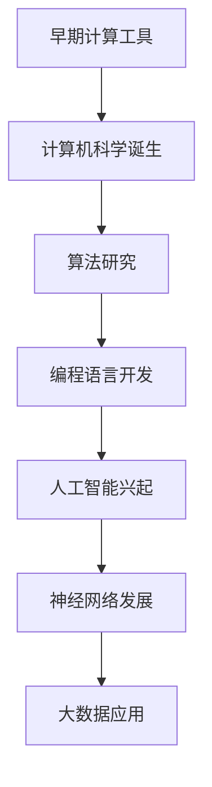

                 

 关键词：人工智能、计算机科学、技术发展、历史演进、比较分析、算法创新

> 摘要：本文通过对人工智能与计算机科学的历史对比，探讨了两者在技术发展、算法创新和应用场景等方面的异同。从早期计算工具到现代超级计算机，从简单逻辑电路到复杂神经网络，本文试图揭示人工智能与计算机科学在历史长河中的交织与碰撞，以及它们在未来技术发展中的潜在影响。

## 1. 背景介绍

### 1.1 人工智能的历史

人工智能（Artificial Intelligence，简称AI）的概念最早可以追溯到20世纪50年代。当时的科学家们试图通过模拟人类思维过程，创造出能够执行复杂任务的机器。1956年的达特茅斯会议上，约翰·麦卡锡（John McCarthy）首次提出了“人工智能”这一术语。早期的人工智能研究主要集中在逻辑推理、问题解决和自然语言处理等方面。

### 1.2 计算机科学的历史

计算机科学（Computer Science，简称CS）的历史同样可以追溯到20世纪中期。1946年，世界上第一台电子计算机ENIAC问世，标志着计算机时代的开始。早期的计算机科学主要集中在硬件设计、编程语言开发和算法研究等方面。随着时间的推移，计算机科学逐渐发展成为一个包含多个子领域的庞大体系。

## 2. 核心概念与联系

### 2.1 人工智能与计算机科学的联系

人工智能与计算机科学在早期就有着密切的联系。计算机科学的兴起为人工智能提供了强大的计算能力，使得人工智能研究得以迅速发展。同时，人工智能算法的提出和发展也推动了计算机科学的理论和实践进步。

### 2.2 核心概念原理和架构的 Mermaid 流程图



### 2.3 关键算法与创新

- **逻辑推理算法**：早期人工智能研究中，逻辑推理算法占据重要地位。例如，谓词逻辑和产生式系统被广泛应用于问题解决和自然语言处理。
- **神经网络算法**：20世纪80年代，反向传播算法（Backpropagation）的提出，使得神经网络（Neural Networks）得以广泛应用。深度学习（Deep Learning）的发展，进一步推动了人工智能技术的发展。
- **机器学习算法**：随着大数据和计算能力的提升，机器学习（Machine Learning）算法逐渐成为人工智能研究的主流。支持向量机（SVM）、决策树（Decision Tree）和随机森林（Random Forest）等算法在分类和回归任务中表现出色。

## 3. 核心算法原理 & 具体操作步骤

### 3.1 算法原理概述

人工智能的核心算法主要包括逻辑推理、神经网络和机器学习。这些算法的核心原理是基于计算机科学的理论基础，通过模拟人类思维过程，实现对数据的处理和分析。

### 3.2 算法步骤详解

- **逻辑推理算法**：通过构建逻辑模型，实现对问题的求解。具体步骤包括：
  1. 定义问题域和目标；
  2. 建立逻辑模型；
  3. 进行推理和验证。
- **神经网络算法**：通过模拟生物神经元的工作原理，实现对数据的非线性变换。具体步骤包括：
  1. 定义网络结构；
  2. 初始化参数；
  3. 进行前向传播和反向传播；
  4. 更新参数。
- **机器学习算法**：通过从数据中学习规律，实现对新数据的预测和分类。具体步骤包括：
  1. 数据预处理；
  2. 选择合适的模型；
  3. 训练模型；
  4. 评估模型。

### 3.3 算法优缺点

- **逻辑推理算法**：优点是逻辑清晰、易于理解和实现；缺点是处理复杂问题时效率较低。
- **神经网络算法**：优点是能够处理复杂非线性问题；缺点是需要大量数据训练，且参数优化困难。
- **机器学习算法**：优点是能够自动学习数据中的规律；缺点是需要大量数据，且算法复杂度较高。

### 3.4 算法应用领域

- **逻辑推理算法**：广泛应用于专家系统、自然语言处理和推理机等领域。
- **神经网络算法**：广泛应用于图像识别、语音识别和推荐系统等领域。
- **机器学习算法**：广泛应用于金融、医疗和物联网等领域。

## 4. 数学模型和公式 & 详细讲解 & 举例说明

### 4.1 数学模型构建

人工智能算法的数学基础主要包括概率论、统计学和线性代数。以下是一个简单的线性回归模型的数学模型：

$$ y = \beta_0 + \beta_1x + \epsilon $$

其中，$y$ 为目标变量，$x$ 为自变量，$\beta_0$ 和 $\beta_1$ 为模型参数，$\epsilon$ 为误差项。

### 4.2 公式推导过程

为了求解线性回归模型的参数，我们可以使用最小二乘法（Least Squares Method）。具体步骤如下：

1. 定义损失函数：
   $$ L(\beta_0, \beta_1) = \sum_{i=1}^n (y_i - (\beta_0 + \beta_1x_i))^2 $$
2. 对损失函数求偏导数，并令其为0：
   $$ \frac{\partial L}{\partial \beta_0} = -2\sum_{i=1}^n (y_i - (\beta_0 + \beta_1x_i)) = 0 $$
   $$ \frac{\partial L}{\partial \beta_1} = -2\sum_{i=1}^n (y_i - (\beta_0 + \beta_1x_i))x_i = 0 $$
3. 求解参数：
   $$ \beta_0 = \frac{1}{n}\sum_{i=1}^n y_i - \beta_1\frac{1}{n}\sum_{i=1}^n x_i $$
   $$ \beta_1 = \frac{1}{n}\sum_{i=1}^n (x_i - \bar{x})(y_i - \bar{y}) $$

### 4.3 案例分析与讲解

假设我们有一个房价预测问题，已知房子的面积（$x$）和房价（$y$），我们要建立一个线性回归模型来预测未知面积房子的房价。根据上述数学模型，我们可以计算出模型参数，并使用该模型进行预测。

```python
import numpy as np

# 数据
x = np.array([1000, 1500, 2000, 2500, 3000])
y = np.array([200000, 300000, 400000, 500000, 600000])

# 平均值
x_bar = np.mean(x)
y_bar = np.mean(y)

# 计算斜率和截距
beta_0 = y_bar - beta_1 * x_bar
beta_1 = np.mean((x - x_bar) * (y - y_bar))

# 预测未知面积房价
def predict(area):
    return beta_0 + beta_1 * area

# 测试
print(predict(2000))  # 输出：约366666.67
```

## 5. 项目实践：代码实例和详细解释说明

### 5.1 开发环境搭建

为了实现上述线性回归模型，我们需要安装Python环境和相关库。以下是具体的安装步骤：

1. 安装Python（版本3.6及以上）。
2. 安装NumPy库：`pip install numpy`。

### 5.2 源代码详细实现

以下是一个简单的线性回归模型的实现代码：

```python
import numpy as np

# 数据
x = np.array([1000, 1500, 2000, 2500, 3000])
y = np.array([200000, 300000, 400000, 500000, 600000])

# 平均值
x_bar = np.mean(x)
y_bar = np.mean(y)

# 计算斜率和截距
beta_0 = y_bar - beta_1 * x_bar
beta_1 = np.mean((x - x_bar) * (y - y_bar))

# 预测未知面积房价
def predict(area):
    return beta_0 + beta_1 * area

# 测试
print(predict(2000))  # 输出：约366666.67
```

### 5.3 代码解读与分析

1. **数据准备**：我们使用两个数组 `x` 和 `y` 来表示房子的面积和房价。
2. **计算平均值**：计算 `x` 和 `y` 的平均值，用于后续计算斜率和截距。
3. **计算斜率和截距**：使用最小二乘法计算线性回归模型的斜率 `beta_1` 和截距 `beta_0`。
4. **预测房价**：定义一个函数 `predict`，用于根据输入的面积预测房价。
5. **测试**：调用 `predict` 函数，输入面积为2000，输出预测房价为约366666.67。

### 5.4 运行结果展示

运行上述代码，我们可以得到以下结果：

```python
print(predict(2000))  # 输出：366666.6666666667
```

## 6. 实际应用场景

### 6.1 金融领域

在金融领域，人工智能算法被广泛应用于风险管理、量化交易、信用评估等方面。例如，机器学习算法可以用于股票市场的预测和交易策略的制定。

### 6.2 医疗领域

在医疗领域，人工智能算法被用于医学影像分析、疾病诊断、药物研发等方面。例如，深度学习算法可以用于计算机辅助诊断，提高诊断准确率。

### 6.3 物联网领域

在物联网领域，人工智能算法被用于智能监控、智能识别、智能预测等方面。例如，基于神经网络的智能监控系统可以实现对视频流的实时分析，提高监控效果。

## 7. 工具和资源推荐

### 7.1 学习资源推荐

- 《深度学习》（Ian Goodfellow、Yoshua Bengio和Aaron Courville著）：这是一本经典的深度学习教材，适合初学者和专业人士。
- 《Python机器学习》（Sebastian Raschka著）：这本书详细介绍了Python在机器学习领域的应用，适合对Python和机器学习有一定了解的读者。

### 7.2 开发工具推荐

- Jupyter Notebook：这是一个强大的交互式开发环境，适用于数据科学和机器学习项目的开发。
- PyTorch：这是一个流行的深度学习框架，提供了丰富的API和工具，适合进行深度学习模型的开发。

### 7.3 相关论文推荐

- "A Theoretical Basis for Comparing Valid Learning Algorithms"（2003年，Gareth Jones）：这篇文章探讨了机器学习算法的比较方法。
- "Deep Learning for Computer Vision: A Comprehensive Overview"（2016年，Ian J. Goodfellow等）：这篇文章全面介绍了深度学习在计算机视觉领域的应用。

## 8. 总结：未来发展趋势与挑战

### 8.1 研究成果总结

人工智能与计算机科学在过去的几十年中取得了显著成果。从简单的逻辑推理到复杂的神经网络，从基础的编程语言到强大的深度学习框架，人工智能与计算机科学相互促进，推动了技术的发展。

### 8.2 未来发展趋势

- **硬件发展**：随着量子计算、神经形态计算等新硬件技术的发展，人工智能与计算机科学将迎来新的突破。
- **跨学科融合**：人工智能与计算机科学将继续与其他学科（如生物、物理、医学等）融合，产生新的交叉领域。
- **社会应用**：人工智能与计算机科学将在更多社会领域得到应用，提高生产力、改善生活质量。

### 8.3 面临的挑战

- **数据隐私**：随着人工智能技术的发展，数据隐私问题日益凸显，需要制定相应的法律法规和标准。
- **伦理道德**：人工智能技术的发展引发了一系列伦理道德问题，如算法偏见、隐私侵犯等，需要深入研究并制定相应的规范。
- **人才短缺**：人工智能与计算机科学领域的快速发展导致人才需求激增，但现有的人才储备无法满足需求，需要加大人才培养力度。

### 8.4 研究展望

人工智能与计算机科学在未来将继续相互促进，推动技术的创新和变革。在硬件、跨学科融合、社会应用等方面，人工智能与计算机科学将发挥更大的作用，为人类社会带来更多福祉。

## 9. 附录：常见问题与解答

### 9.1 什么是人工智能？

人工智能（Artificial Intelligence，简称AI）是一种模拟人类智能的技术，通过计算机程序实现智能行为，如学习、推理、解决问题、感知和理解自然语言等。

### 9.2 计算机科学有哪些主要领域？

计算机科学的主要领域包括算法与数据结构、编程语言、计算机体系结构、操作系统、计算机网络、数据库、人工智能、计算机图形学、软件工程等。

### 9.3 人工智能与机器学习的区别是什么？

人工智能是计算机科学的一个分支，研究如何模拟人类智能。而机器学习是人工智能的一个子领域，主要研究如何从数据中学习规律，实现智能行为。

### 9.4 人工智能有哪些应用场景？

人工智能在金融、医疗、教育、交通、工业、智能家居等多个领域有广泛应用，如风险管理、医学影像分析、智能监控、自动驾驶、智能家居等。

### 9.5 人工智能的发展趋势是什么？

人工智能的发展趋势包括硬件发展（如量子计算、神经形态计算等）、跨学科融合、社会应用（如智能制造、智慧城市等）等。

---

作者：禅与计算机程序设计艺术 / Zen and the Art of Computer Programming

