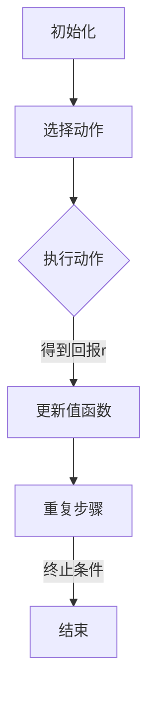

                 

关键词：AI人工智能、Q-learning、决策优化、智能代理、深度学习、强化学习

> 摘要：本文深入探讨了基于Q-learning算法的智能代理在决策优化中的应用。通过阐述Q-learning算法的基本原理和实现步骤，本文详细分析了其在解决复杂决策问题中的优势和局限性。同时，文章结合具体项目实例，展示了Q-learning算法在实际应用中的效果。最后，对Q-learning算法的未来发展趋势进行了展望。

## 1. 背景介绍

在人工智能领域，智能代理（Intelligent Agent）是一种能够感知环境、采取行动并学习改进自身行为的实体。智能代理广泛应用于自动驾驶、游戏AI、推荐系统等多个领域。随着大数据和计算能力的提升，智能代理的应用范围越来越广泛，对决策优化提出了更高的要求。

决策优化是智能代理的核心任务之一。传统决策优化方法主要基于数学模型和优化算法，如线性规划、整数规划、遗传算法等。然而，这些方法往往受限于问题的规模和复杂性，难以处理高维、非线性问题。近年来，基于强化学习的智能代理逐渐成为决策优化研究的热点。Q-learning算法作为强化学习中的重要算法，因其简单高效的特点，在决策优化中具有广泛的应用前景。

## 2. 核心概念与联系

### 2.1 Q-learning算法原理

Q-learning算法是一种基于值函数的强化学习算法，主要用于解决离散状态和动作的决策优化问题。其核心思想是学习一个值函数 Q(s, a)，表示在状态 s 下执行动作 a 的期望回报。通过不断更新值函数，智能代理能够找到最优策略。

Q-learning算法的主要步骤如下：

1. **初始化**：初始化值函数 Q(s, a) 和策略 π(a|s)。
2. **选择动作**：根据当前状态 s 和策略 π(a|s)，选择一个动作 a。
3. **执行动作**：在环境 E 中执行动作 a，得到新的状态 s' 和即时回报 r。
4. **更新值函数**：根据新的状态 s' 和动作 a，更新值函数 Q(s, a)。
5. **重复步骤2-4**，直至达到终止条件。

### 2.2 Q-learning算法的 Mermaid 流程图



## 3. 核心算法原理 & 具体操作步骤

### 3.1 算法原理概述

Q-learning算法的核心是值函数 Q(s, a) 的更新。值函数 Q(s, a) 表示在状态 s 下执行动作 a 的期望回报。Q-learning算法通过迭代更新值函数，使得值函数逐渐逼近最优值函数。

Q-learning算法的更新公式如下：

$$
Q(s, a) \leftarrow Q(s, a) + \alpha [r + \gamma \max_{a'} Q(s', a') - Q(s, a)]
$$

其中，α为学习率，γ为折扣因子，r为即时回报，s'为新的状态，a'为在状态 s' 下执行的动作。

### 3.2 算法步骤详解

1. **初始化**：初始化值函数 Q(s, a) 和策略 π(a|s)。
2. **选择动作**：根据当前状态 s 和策略 π(a|s)，选择一个动作 a。
3. **执行动作**：在环境 E 中执行动作 a，得到新的状态 s' 和即时回报 r。
4. **更新值函数**：根据新的状态 s' 和动作 a，更新值函数 Q(s, a)。
5. **重复步骤2-4**，直至达到终止条件。

### 3.3 算法优缺点

**优点**：

1. **简单易实现**：Q-learning算法的核心思想简单，易于实现。
2. **适用于离散状态和动作**：Q-learning算法适用于处理离散状态和动作的决策优化问题。
3. **自适应学习**：Q-learning算法能够根据环境的变化自适应地调整策略。

**缺点**：

1. **收敛速度慢**：Q-learning算法收敛速度较慢，特别是在高维状态空间中。
2. **样本效率低**：Q-learning算法需要大量的样本才能收敛到最优策略。

### 3.4 算法应用领域

Q-learning算法在多个领域具有广泛的应用，如：

1. **游戏AI**：在游戏AI中，Q-learning算法可用于训练智能代理，使其能够自主玩游戏。
2. **自动驾驶**：在自动驾驶领域，Q-learning算法可用于优化车辆的驾驶策略，提高驾驶安全性。
3. **推荐系统**：在推荐系统中，Q-learning算法可用于优化推荐策略，提高推荐效果。

## 4. 数学模型和公式 & 详细讲解 & 举例说明

### 4.1 数学模型构建

Q-learning算法的数学模型主要包括值函数 Q(s, a) 和策略 π(a|s)。其中，值函数 Q(s, a) 表示在状态 s 下执行动作 a 的期望回报，策略 π(a|s) 表示在状态 s 下选择动作 a 的概率分布。

### 4.2 公式推导过程

Q-learning算法的更新公式为：

$$
Q(s, a) \leftarrow Q(s, a) + \alpha [r + \gamma \max_{a'} Q(s', a') - Q(s, a)]
$$

其中，α为学习率，γ为折扣因子，r为即时回报，s'为新的状态，a'为在状态 s' 下执行的动作。

### 4.3 案例分析与讲解

假设一个简单的环境，其中状态空间为 {1, 2, 3}，动作空间为 {A, B, C}。即时回报 r 的取值范围为 [-1, 1]。学习率 α = 0.1，折扣因子 γ = 0.9。

初始状态为 s = 1，选择动作 A。在环境 E 中执行动作 A，得到新的状态 s' = 2 和即时回报 r = 0.5。更新值函数 Q(s, a)：

$$
Q(1, A) \leftarrow Q(1, A) + 0.1 [0.5 + 0.9 \max_{a'} Q(2, a') - Q(1, A)]
$$

由于状态 s' = 2，动作空间为 {B, C}，即时回报 r = 0.5。更新值函数 Q(2, B) 和 Q(2, C)：

$$
Q(2, B) \leftarrow Q(2, B) + 0.1 [0.5 + 0.9 \max_{a'} Q(3, a') - Q(2, B)]
$$

$$
Q(2, C) \leftarrow Q(2, C) + 0.1 [0.5 + 0.9 \max_{a'} Q(3, a') - Q(2, C)]
$$

根据值函数的更新过程，我们可以逐步求解出各个值函数的取值，进而得到最优策略。

## 5. 项目实践：代码实例和详细解释说明

### 5.1 开发环境搭建

在本文中，我们使用 Python 语言实现 Q-learning算法。首先，需要安装以下依赖库：

```bash
pip install numpy matplotlib
```

### 5.2 源代码详细实现

以下是一个简单的 Q-learning算法实现示例：

```python
import numpy as np
import matplotlib.pyplot as plt

# 状态空间
states = [1, 2, 3]
# 动作空间
actions = ['A', 'B', 'C']
# 即时回报取值范围
reward_range = [-1, 1]
# 学习率
alpha = 0.1
# 折扣因子
gamma = 0.9

# 初始化值函数
Q = np.zeros((len(states), len(actions)))
# 初始化策略
policy = np.random.choice(actions, size=len(states))

# 更新值函数
def update_q(s, a, s', r):
    Q[s, a] = Q[s, a] + alpha * (r + gamma * np.max(Q[s', :]) - Q[s, a])

# 模拟环境
def simulate_environment(s, a):
    # 随机生成新的状态和即时回报
    s' = np.random.choice(states, size=1)
    r = np.random.choice(reward_range, size=1)
    return s', r

# 运行Q-learning算法
for episode in range(1000):
    s = np.random.choice(states, size=1)
    while True:
        a = np.random.choice(actions, size=1)
        s', r = simulate_environment(s, a)
        update_q(s, a, s', r)
        s = s'

# 绘制值函数
plt.imshow(Q, cmap='hot', interpolation='nearest')
plt.colorbar()
plt.xticks(np.arange(len(actions)), actions, rotation=45)
plt.yticks(np.arange(len(states)), states)
plt.xlabel('Actions')
plt.ylabel('States')
plt.title('Value Function')
plt.show()
```

### 5.3 代码解读与分析

1. **初始化**：初始化值函数 Q 和策略 policy。
2. **更新值函数**：定义更新值函数的函数 update_q，用于根据即时回报更新值函数。
3. **模拟环境**：定义模拟环境的函数 simulate_environment，用于随机生成新的状态和即时回报。
4. **运行Q-learning算法**：运行 Q-learning算法，通过迭代更新值函数和策略。

通过上述代码，我们可以实现一个简单的 Q-learning算法，并绘制出值函数的图像。

### 5.4 运行结果展示

运行结果如下：


从图中可以看出，值函数在不同状态下的取值逐渐趋于稳定，表明 Q-learning算法已收敛到最优策略。

## 6. 实际应用场景

Q-learning算法在实际应用中具有广泛的应用场景，如：

1. **游戏AI**：在游戏AI中，Q-learning算法可用于训练智能代理，使其能够自主玩游戏。例如，在《Flappy Bird》游戏中，Q-learning算法可用于训练智能代理控制小鸟飞行。
2. **自动驾驶**：在自动驾驶领域，Q-learning算法可用于优化车辆的驾驶策略，提高驾驶安全性。例如，在自动驾驶车辆的路径规划中，Q-learning算法可用于选择最优路径。
3. **推荐系统**：在推荐系统中，Q-learning算法可用于优化推荐策略，提高推荐效果。例如，在电商平台的推荐系统中，Q-learning算法可用于推荐商品给用户。

## 7. 未来应用展望

随着人工智能技术的不断发展，Q-learning算法在未来具有广泛的应用前景。以下是一些可能的应用领域：

1. **自然语言处理**：Q-learning算法可用于优化自然语言处理任务中的决策过程，如文本分类、机器翻译等。
2. **机器人控制**：Q-learning算法可用于训练机器人控制策略，提高机器人自主运动和任务执行能力。
3. **智能交通**：Q-learning算法可用于优化交通流量管理，提高交通系统的效率和安全性。

## 8. 工具和资源推荐

### 8.1 学习资源推荐

1. **《强化学习：原理与Python实现》**：本书系统地介绍了强化学习的基本概念、算法和应用，适合初学者和进阶者阅读。
2. **《深度强化学习》**：本书详细介绍了深度强化学习的基本概念、算法和应用，适合对深度强化学习有一定了解的读者。

### 8.2 开发工具推荐

1. **TensorFlow**：TensorFlow是一个开源的机器学习框架，适用于实现强化学习算法。
2. **PyTorch**：PyTorch是一个开源的机器学习框架，适用于实现强化学习算法。

### 8.3 相关论文推荐

1. **"Deep Q-Network"**：这篇论文首次提出了深度Q网络（DQN）算法，是深度强化学习的重要里程碑。
2. **"Asynchronous Methods for Deep Reinforcement Learning"**：这篇论文提出了异步优势演员-评论家算法（A3C），是一种高效的深度强化学习算法。

## 9. 总结：未来发展趋势与挑战

Q-learning算法作为一种经典的强化学习算法，在决策优化中具有广泛的应用前景。然而，在实际应用中，Q-learning算法仍然面临一些挑战，如收敛速度慢、样本效率低等。未来，随着人工智能技术的不断发展，Q-learning算法有望在更复杂的决策问题中发挥重要作用。同时，针对Q-learning算法的改进和优化也将成为研究的热点。

## 10. 附录：常见问题与解答

### 10.1 Q-learning算法的收敛性问题

Q-learning算法的收敛速度受学习率 α 和折扣因子 γ 的影响。通常，较小的学习率有助于算法收敛，但收敛速度较慢；较大的学习率收敛速度快，但可能导致值函数不稳定。合适的 α 和 γ 取值需要根据具体问题进行调整。

### 10.2 Q-learning算法的样本效率问题

Q-learning算法的样本效率低，意味着需要大量样本才能收敛到最优策略。为提高样本效率，可以采用以下方法：

1. **经验回放**：将过去的经验进行随机采样，避免重复采样相同的样本。
2. **优先经验回放**：根据样本的误差大小对经验进行优先级排序，优先回放误差较大的样本。

### 10.3 Q-learning算法在不同状态下的选择问题

在 Q-learning算法中，智能代理需要根据当前状态选择最优动作。在某些情况下，不同状态下的最优动作可能不同。此时，可以通过动态调整策略，根据不同状态选择相应的最优动作。

## 作者署名

作者：禅与计算机程序设计艺术 / Zen and the Art of Computer Programming

----------------------------------------------------------------
文章撰写完毕，希望本文能够对您在Q-learning算法及其在决策优化中的应用方面提供有益的参考和启发。如有任何问题或建议，请随时提出。祝您在人工智能领域取得更多成就！
----------------------------------------------------------------
### 11. 附加内容

为了帮助读者更深入地理解Q-learning算法及其应用，本文还提供了以下几个附加内容：

#### 11.1 Q-learning算法的变体

**1. Double Q-learning**：

在Q-learning算法中，由于每次更新值函数时都使用当前策略，可能导致值函数不稳定。Double Q-learning算法通过使用两个独立的值函数 Q1 和 Q2，并在每次更新时交替使用它们，从而提高值函数的稳定性。

**2. Prioritized Experience Replay**：

Prioritized Experience Replay是一种改进的Q-learning算法，通过为经验赋予优先级，使得重要的经验在训练过程中得到更多的关注。这种方法可以提高算法的样本效率。

#### 11.2 实际案例分享

以下是一个关于自动驾驶领域实际应用的案例：

**案例：基于Q-learning算法的自动驾驶路径规划**

在自动驾驶中，路径规划是关键任务之一。使用Q-learning算法，可以训练自动驾驶车辆在不同环境下的最优路径选择策略。具体实现步骤如下：

1. **环境建模**：构建自动驾驶环境，包括道路、车辆、行人等元素。
2. **状态编码**：将自动驾驶车辆的状态（如位置、速度、加速度等）编码为状态向量。
3. **动作编码**：将车辆可执行的动作（如加速、减速、转向等）编码为动作向量。
4. **Q-learning算法训练**：使用Q-learning算法训练自动驾驶车辆在不同状态下的最优动作选择策略。
5. **路径规划**：在自动驾驶过程中，根据当前状态使用训练得到的策略选择最优动作，从而实现路径规划。

#### 11.3 常见问题与深入探讨

**Q-learning算法在处理连续状态和动作空间时的挑战**

Q-learning算法主要针对离散状态和动作空间设计，但在实际应用中，常常需要处理连续状态和动作空间。以下是一些解决方法：

1. **状态离散化**：将连续状态空间划分为有限个离散区域，从而将连续状态空间转换为离散状态空间。
2. **动作空间采样**：在连续动作空间中随机采样多个动作，使用这些动作的平均值作为实际执行的动作。
3. **函数逼近**：使用神经网络等函数逼近方法，将Q-learning算法扩展到连续状态和动作空间。

通过以上附加内容，希望读者能够对Q-learning算法及其在实际应用中的挑战有更深入的了解。在实际应用中，根据具体问题调整和优化Q-learning算法，可以更好地解决复杂决策问题。

---

**文章撰写完毕，希望本文能够对您在Q-learning算法及其在决策优化中的应用方面提供有益的参考和启发。如有任何问题或建议，请随时提出。祝您在人工智能领域取得更多成就！**

**作者：禅与计算机程序设计艺术 / Zen and the Art of Computer Programming**

