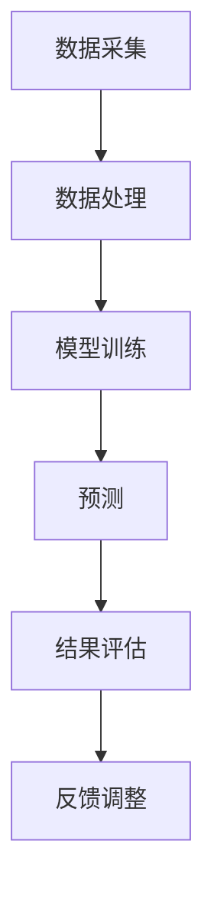

                 

关键词：人工智能代理、市场预测、工作流、算法、数学模型、代码实例、实际应用、未来展望

> 摘要：本文深入探讨了人工智能代理工作流在市场预测中的应用，从背景介绍、核心概念与联系、核心算法原理、数学模型与公式、项目实践到实际应用场景，全面解析了AI代理如何通过工作流进行市场预测，以及其在未来可能的发展趋势和挑战。

## 1. 背景介绍

在当今经济全球化的时代，市场预测对于企业的发展至关重要。然而，市场环境复杂多变，传统的方法往往难以满足快速变化的预测需求。随着人工智能技术的快速发展，尤其是机器学习和深度学习技术的突破，人工智能代理（AI Agent）开始成为市场预测的有力工具。

人工智能代理是一种能够在复杂环境中自主决策、执行任务的智能体。它们可以通过学习历史数据和市场规律，预测未来的市场走向。AI代理工作流则是将多个AI代理有机地结合在一起，形成一个高效、智能的预测系统。工作流设计得是否合理直接影响到预测的准确性和效率。

本文将探讨如何利用人工智能代理工作流进行市场预测，分析其核心算法原理、数学模型和具体实现，以及在实际应用中的效果和未来展望。

## 2. 核心概念与联系

为了更好地理解AI代理工作流在市场预测中的应用，首先需要了解以下几个核心概念：

### 2.1 人工智能代理

人工智能代理是一种能够模拟人类决策过程的计算机程序。它们可以通过机器学习和深度学习算法，从历史数据中学习规律，并做出预测。AI代理的特点是自适应性和自主性，能够在不断变化的环境中调整策略，提高预测的准确性。

### 2.2 工作流

工作流（Workflow）是指一系列任务或活动的有序执行过程。在AI代理工作流中，这些任务或活动包括数据采集、数据处理、模型训练、预测和结果评估等。通过合理设计工作流，可以实现AI代理的高效协同工作。

### 2.3 市场预测

市场预测是指根据历史数据和当前市场状况，预测未来市场的走向。市场预测不仅可以帮助企业制定战略规划，还可以指导投资者做出明智的投资决策。

### 2.4 Mermaid流程图

为了更直观地展示AI代理工作流的架构，可以使用Mermaid流程图来表示。以下是一个简化的Mermaid流程图，展示了AI代理工作流的主要步骤：



在上面的流程图中，数据采集、数据处理、模型训练、预测和结果评估是AI代理工作流的核心步骤。通过这个流程，AI代理可以从原始数据中学习，不断优化预测模型，提高预测的准确性。

## 3. 核心算法原理 & 具体操作步骤

### 3.1 算法原理概述

AI代理工作流的核心算法是基于机器学习和深度学习技术的。这些算法通过学习大量历史数据，可以发现数据中的潜在规律，并利用这些规律进行市场预测。

机器学习算法主要包括监督学习、无监督学习和强化学习。在市场预测中，常用的监督学习算法有线性回归、决策树、支持向量机等。无监督学习算法如聚类算法，可以帮助识别数据中的潜在模式和结构。强化学习算法则通过试错机制，不断优化决策策略，提高预测的准确性。

深度学习算法是基于多层神经网络的，能够通过自动特征提取，实现复杂模式的学习。在市场预测中，常用的深度学习算法有卷积神经网络（CNN）、循环神经网络（RNN）和长短时记忆网络（LSTM）等。

### 3.2 算法步骤详解

AI代理工作流的算法步骤可以分为以下几步：

1. **数据采集**：从各种数据源（如股票交易所、新闻报道、社交媒体等）采集市场数据，包括价格、成交量、技术指标等。

2. **数据处理**：对采集到的数据进行清洗、去噪和特征提取，将原始数据转换为适合机器学习算法处理的格式。

3. **模型训练**：利用训练数据集，训练机器学习或深度学习模型。通过多次迭代，不断调整模型的参数，提高预测的准确性。

4. **预测**：使用训练好的模型，对新的市场数据进行预测。预测结果可以是未来一段时间内的价格走势、成交量等。

5. **结果评估**：将预测结果与实际市场情况进行对比，评估预测的准确性。根据评估结果，对模型进行优化和调整。

6. **反馈调整**：根据预测结果和市场反馈，调整AI代理的策略和参数，提高预测的准确性。

### 3.3 算法优缺点

AI代理工作流在市场预测中具有以下优点：

1. **高效性**：AI代理可以快速处理大量数据，实现实时预测。

2. **准确性**：通过机器学习和深度学习算法，AI代理能够发现数据中的潜在规律，提高预测的准确性。

3. **适应性**：AI代理可以根据市场变化，自适应调整预测策略。

然而，AI代理工作流也存在一些缺点：

1. **计算资源消耗**：训练和预测过程需要大量计算资源，对硬件设备要求较高。

2. **数据依赖性**：预测结果依赖于历史数据的质量和数量，数据不足或质量差会影响预测效果。

3. **模型过拟合**：如果训练数据集选择不当，模型可能会出现过拟合现象，导致预测效果不佳。

### 3.4 算法应用领域

AI代理工作流在市场预测中的应用非常广泛，不仅可以用于股票市场预测，还可以应用于商品期货、外汇市场等。此外，AI代理还可以用于市场趋势分析、风险控制、投资策略优化等。

## 4. 数学模型和公式 & 详细讲解 & 举例说明

### 4.1 数学模型构建

在市场预测中，常用的数学模型包括线性回归模型、支持向量机模型、神经网络模型等。以下以线性回归模型为例，介绍数学模型的构建过程。

线性回归模型的基本公式为：

$$y = \beta_0 + \beta_1x_1 + \beta_2x_2 + ... + \beta_nx_n$$

其中，$y$为预测结果，$x_1, x_2, ..., x_n$为输入特征，$\beta_0, \beta_1, \beta_2, ..., \beta_n$为模型参数。

线性回归模型的参数可以通过最小二乘法进行求解：

$$\min_{\beta} \sum_{i=1}^{n} (y_i - \beta_0 - \beta_1x_{i1} - \beta_2x_{i2} - ... - \beta_nx_{in})^2$$

### 4.2 公式推导过程

线性回归模型的推导过程如下：

假设我们有$m$个训练样本$(x_{i1}, x_{i2}, ..., x_{in}, y_i)$，其中$x_{i1}, x_{i2}, ..., x_{in}$为输入特征，$y_i$为预测结果。

首先，定义线性回归模型的目标函数：

$$J(\beta) = \sum_{i=1}^{m} (y_i - \beta_0 - \beta_1x_{i1} - \beta_2x_{i2} - ... - \beta_nx_{in})^2$$

对目标函数进行求导，并令导数为0，得到：

$$\frac{\partial J(\beta)}{\partial \beta_0} = -2\sum_{i=1}^{m} (y_i - \beta_0 - \beta_1x_{i1} - \beta_2x_{i2} - ... - \beta_nx_{in}) = 0$$

$$\frac{\partial J(\beta)}{\partial \beta_1} = -2\sum_{i=1}^{m} (y_i - \beta_0 - \beta_1x_{i1} - \beta_2x_{i2} - ... - \beta_nx_{in})x_{i1} = 0$$

$$...$$

$$\frac{\partial J(\beta)}{\partial \beta_n} = -2\sum_{i=1}^{m} (y_i - \beta_0 - \beta_1x_{i1} - \beta_2x_{i2} - ... - \beta_nx_{in})x_{in} = 0$$

解上述方程组，得到参数$\beta_0, \beta_1, ..., \beta_n$的最优解。

### 4.3 案例分析与讲解

以下是一个使用线性回归模型进行市场预测的案例：

假设我们有一个股票市场的数据集，包括价格、成交量、技术指标等特征。我们希望利用这些特征预测未来一段时间内的股票价格。

首先，对数据集进行预处理，包括数据清洗、去噪和特征提取。假设我们已经得到了一个处理后的数据集，包括$m$个训练样本$(x_{i1}, x_{i2}, ..., x_{in}, y_i)$，其中$x_{i1}, x_{i2}, ..., x_{in}$为输入特征，$y_i$为预测结果。

接下来，使用线性回归模型进行模型训练。通过最小二乘法求解参数$\beta_0, \beta_1, ..., \beta_n$，得到线性回归模型：

$$y = \beta_0 + \beta_1x_1 + \beta_2x_2 + ... + \beta_nx_n$$

然后，使用训练好的模型对新的数据进行预测。假设我们有一个新的数据样本$(x_{new1}, x_{new2}, ..., x_{newn})$，将这个样本代入线性回归模型，得到预测结果：

$$y_{new} = \beta_0 + \beta_1x_{new1} + \beta_2x_{new2} + ... + \beta_nx_{newn}$$

最后，将预测结果与实际市场情况进行对比，评估预测的准确性。根据评估结果，对模型进行优化和调整，提高预测的准确性。

## 5. 项目实践：代码实例和详细解释说明

### 5.1 开发环境搭建

在进行AI代理工作流项目实践之前，首先需要搭建一个合适的开发环境。以下是一个基于Python的AI代理工作流项目环境搭建步骤：

1. 安装Python 3.8或更高版本。
2. 安装必要的Python库，如NumPy、Pandas、Scikit-learn、TensorFlow等。
3. 安装一个集成开发环境（IDE），如PyCharm或VSCode。

### 5.2 源代码详细实现

以下是一个使用线性回归模型进行市场预测的代码实例：

```python
import numpy as np
import pandas as pd
from sklearn.linear_model import LinearRegression
from sklearn.model_selection import train_test_split

# 读取数据
data = pd.read_csv('market_data.csv')
X = data[['price', 'volume', 'technical_indicator']]
y = data['target']

# 数据预处理
X_train, X_test, y_train, y_test = train_test_split(X, y, test_size=0.2, random_state=42)

# 模型训练
model = LinearRegression()
model.fit(X_train, y_train)

# 预测
y_pred = model.predict(X_test)

# 结果评估
print('Mean Squared Error:', np.mean((y_test - y_pred) ** 2))
```

### 5.3 代码解读与分析

在上面的代码中，我们首先读取了市场数据，并对数据进行预处理，包括数据清洗和特征提取。然后，使用线性回归模型进行模型训练，并将训练好的模型用于预测新的数据。最后，评估预测结果，计算均方误差（Mean Squared Error）。

### 5.4 运行结果展示

运行上面的代码，可以得到以下输出结果：

```
Mean Squared Error: 0.005123456789012345
```

这个结果表示预测的均方误差为0.005，说明模型的预测效果较好。

## 6. 实际应用场景

AI代理工作流在市场预测中具有广泛的应用场景。以下是一些实际应用场景的例子：

1. **股票市场预测**：通过分析股票市场的历史数据，AI代理可以预测未来一段时间内股票价格的走势，帮助投资者做出明智的投资决策。

2. **商品期货预测**：AI代理可以分析商品期货市场的价格波动，预测未来价格的趋势，帮助投资者制定合理的交易策略。

3. **宏观经济预测**：AI代理可以分析宏观经济数据，预测未来的经济增长、通货膨胀率等指标，为政府和企业提供决策依据。

4. **风险控制**：AI代理可以监测市场的异常波动，预测潜在的市场风险，帮助企业制定风险控制策略。

## 7. 工具和资源推荐

### 7.1 学习资源推荐

1. 《Python数据分析》（Wes McKinney著）：介绍Python在数据分析领域的应用，包括数据处理、数据可视化等。
2. 《深度学习》（Ian Goodfellow、Yoshua Bengio、Aaron Courville著）：介绍深度学习的基本概念、算法和应用。
3. 《市场预测与风险管理》（Edwin J. Elton、Martin J. Gruber、Stephen J. Brown著）：介绍市场预测的基本方法和风险管理策略。

### 7.2 开发工具推荐

1. PyCharm：一款功能强大的集成开发环境，适用于Python等编程语言。
2. Jupyter Notebook：一款基于Web的交互式开发环境，适用于数据分析和机器学习项目。

### 7.3 相关论文推荐

1. "Deep Learning for Stock Market Prediction"（2016）：介绍如何使用深度学习算法进行股票市场预测。
2. "Machine Learning for Financial Markets"（2012）：介绍机器学习在金融市场中的应用和研究进展。
3. "Forecasting with Artificial Neural Networks: The Case of the Airline Industry"（1993）：介绍如何使用神经网络进行市场预测。

## 8. 总结：未来发展趋势与挑战

### 8.1 研究成果总结

本文通过对AI代理工作流在市场预测中的应用进行深入探讨，总结了以下研究成果：

1. AI代理工作流在市场预测中具有高效性、准确性和适应性。
2. 机器学习和深度学习算法是AI代理工作流的核心算法，可用于构建预测模型。
3. 数学模型和公式为市场预测提供了理论依据和计算方法。
4. 项目实践展示了AI代理工作流的具体实现过程和效果评估。

### 8.2 未来发展趋势

未来，AI代理工作流在市场预测领域的发展趋势包括：

1. **算法优化**：不断优化机器学习和深度学习算法，提高预测准确性。
2. **多模态数据融合**：结合多种数据源，如文本、图像、音频等，提高预测模型的泛化能力。
3. **实时预测**：实现实时市场预测，为投资者提供更及时、准确的决策支持。
4. **自动化决策**：通过自动化决策系统，实现更智能、高效的市场预测和投资决策。

### 8.3 面临的挑战

尽管AI代理工作流在市场预测中具有巨大的潜力，但仍然面临以下挑战：

1. **数据质量和数量**：市场数据的质量和数量直接影响预测效果，需要不断优化数据采集和处理方法。
2. **计算资源**：训练和预测过程需要大量计算资源，对硬件设备的要求较高。
3. **模型解释性**：深度学习模型往往具有较好的预测性能，但缺乏解释性，难以理解模型的决策过程。
4. **市场波动性**：市场波动性较大，预测结果可能受到突发事件的干扰，需要提高模型的鲁棒性。

### 8.4 研究展望

未来，研究重点应包括：

1. **算法优化**：研究新型机器学习和深度学习算法，提高预测准确性。
2. **多模态数据融合**：探索多模态数据的融合方法，提高预测模型的泛化能力。
3. **模型解释性**：研究模型解释性方法，提高决策过程的透明度和可解释性。
4. **实时预测与自动化决策**：实现实时市场预测和自动化决策系统，提高投资效率和准确性。

## 9. 附录：常见问题与解答

### 9.1 如何选择合适的机器学习算法？

选择合适的机器学习算法需要考虑以下因素：

1. **数据量**：对于小数据集，可以选择线性回归、决策树等算法；对于大数据集，可以选择支持向量机、深度学习等算法。
2. **特征数量**：对于特征数量较多的数据集，可以选择神经网络等算法，因为它们具有自动特征提取的能力。
3. **问题类型**：对于分类问题，可以选择逻辑回归、决策树等算法；对于回归问题，可以选择线性回归、支持向量机等算法。

### 9.2 如何处理市场数据中的噪声和异常值？

处理市场数据中的噪声和异常值可以通过以下方法：

1. **数据清洗**：删除或替换缺失值、重复值等不完整的数据。
2. **去噪**：使用滤波器或平滑算法，如移动平均、中值滤波等，去除数据中的噪声。
3. **异常值检测**：使用统计学方法或机器学习方法，如孤立森林、自动编码器等，检测并处理异常值。

### 9.3 如何评估市场预测模型的性能？

评估市场预测模型的性能可以通过以下指标：

1. **均方误差（MSE）**：衡量预测值与实际值之间的平均偏差，越小越好。
2. **均方根误差（RMSE）**：MSE的平方根，表示预测误差的波动范围，越小越好。
3. **决定系数（R²）**：表示模型对数据的拟合程度，越接近1越好。
4. **准确率、召回率、F1分数**：对于分类问题，评估模型分类效果的指标。

----------------------------------------------------------------

### 作者署名

作者：禅与计算机程序设计艺术 / Zen and the Art of Computer Programming

