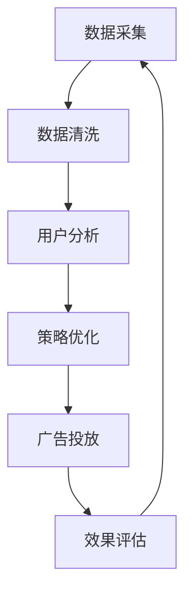

                 

关键词：AI代理，工作流，广告细分市场，优化算法，个性化推荐

> 摘要：本文旨在探讨AI代理工作流在广告细分市场中的应用。通过介绍AI代理的核心概念和架构，分析其在广告市场中的优势，以及实际操作步骤和数学模型，本文为广告行业提供了一种创新的技术解决方案。

## 1. 背景介绍

随着互联网技术的迅猛发展，广告行业已经成为数字经济的重要组成部分。然而，广告市场的竞争日益激烈，广告主和广告平台都在寻求提高广告效果和投资回报率的有效方法。传统的广告投放策略往往基于大规模的、通用的数据模型，难以实现个性化的精准投放。为了解决这一问题，AI代理工作流（AI Agent WorkFlow）作为一种新兴的技术方案，正逐渐受到关注。

AI代理工作流是指利用人工智能技术，模拟人类决策过程，实现自动化、智能化的广告投放和管理。通过引入AI代理，广告平台可以更加精确地分析用户行为，优化广告投放策略，提高广告效果。本文将从核心概念、算法原理、数学模型、实际应用等多个方面，深入探讨AI代理工作流在广告细分市场中的应用。

## 2. 核心概念与联系

### 2.1 AI代理的定义

AI代理是指基于人工智能技术，模拟人类决策过程，实现自动化、智能化的系统或软件。在广告市场中，AI代理可以分析用户数据，预测用户行为，自动调整广告投放策略，从而提高广告效果。

### 2.2 工作流的概念

工作流（WorkFlow）是指完成一项任务所需的一系列步骤和活动。在广告市场中，工作流包括数据采集、用户分析、策略优化、广告投放等多个环节。AI代理工作流则是在传统工作流的基础上，引入人工智能技术，实现自动化、智能化的广告投放和管理。

### 2.3 Mermaid流程图

下面是一个简化的AI代理工作流流程图，用于展示核心概念和联系。



在这个流程图中，数据采集、数据清洗、用户分析、策略优化、广告投放和效果评估构成了一个闭环的工作流。AI代理在每个环节中发挥作用，提高工作流的效率和效果。

## 3. 核心算法原理 & 具体操作步骤

### 3.1 算法原理概述

AI代理工作流的核心算法主要包括用户行为分析、广告效果评估、策略优化等。用户行为分析主要通过机器学习技术，对用户的历史行为数据进行分析，预测用户兴趣和需求。广告效果评估则通过A/B测试等方法，评估不同广告策略的效果。策略优化则是基于用户行为分析和广告效果评估，自动调整广告投放策略，实现广告效果的优化。

### 3.2 算法步骤详解

#### 3.2.1 数据采集与清洗

数据采集是指从各种渠道收集用户行为数据，如点击率、转化率、停留时间等。数据清洗则是对采集到的数据进行预处理，去除噪声和异常值，保证数据质量。

#### 3.2.2 用户行为分析

用户行为分析主要通过机器学习算法，如决策树、随机森林、神经网络等，对用户的历史行为数据进行分析，构建用户画像，预测用户兴趣和需求。

#### 3.2.3 广告效果评估

广告效果评估主要通过A/B测试等方法，对不同广告策略的效果进行评估，选择最优策略。

#### 3.2.4 策略优化

策略优化基于用户行为分析和广告效果评估，自动调整广告投放策略，实现广告效果的优化。

### 3.3 算法优缺点

#### 优点

1. 高效：AI代理工作流可以自动化处理大量数据，提高广告投放效率。
2. 精准：通过用户行为分析和广告效果评估，可以实现个性化、精准的广告投放。
3. 智能化：AI代理可以不断学习用户行为，优化广告投放策略，提高广告效果。

#### 缺点

1. 成本高：AI代理工作流需要大量计算资源和专业人才，成本较高。
2. 数据依赖：AI代理工作流的效果很大程度上取决于数据质量，数据缺失或异常会影响算法效果。

### 3.4 算法应用领域

AI代理工作流可以广泛应用于广告市场，如搜索引擎广告、社交媒体广告、移动广告等。特别是在广告细分市场中，AI代理工作流可以更好地满足个性化、精准化的广告需求。

## 4. 数学模型和公式 & 详细讲解 & 举例说明

### 4.1 数学模型构建

AI代理工作流的数学模型主要包括用户行为预测模型、广告效果评估模型和策略优化模型。

#### 用户行为预测模型

用户行为预测模型主要用于预测用户兴趣和需求。假设用户行为数据为\( X \)，预测结果为\( Y \)，则用户行为预测模型可以表示为：

$$
Y = f(X)
$$

其中，\( f \)为预测函数，可以通过机器学习算法训练得到。

#### 广告效果评估模型

广告效果评估模型主要用于评估不同广告策略的效果。假设广告策略为\( S \)，广告效果为\( E \)，则广告效果评估模型可以表示为：

$$
E = g(S)
$$

其中，\( g \)为效果评估函数，可以通过A/B测试等方法训练得到。

#### 策略优化模型

策略优化模型主要用于优化广告投放策略。假设广告投放策略为\( T \)，优化目标为\( O \)，则策略优化模型可以表示为：

$$
T^* = h(O)
$$

其中，\( h \)为优化函数，可以通过优化算法训练得到。

### 4.2 公式推导过程

#### 用户行为预测模型

用户行为预测模型的推导过程主要基于机器学习算法，如决策树、随机森林、神经网络等。以神经网络为例，用户行为预测模型可以表示为：

$$
Y = \sigma(W_1 \cdot X + b_1)
$$

其中，\( W_1 \)为权重矩阵，\( b_1 \)为偏置项，\( \sigma \)为激活函数。

#### 广告效果评估模型

广告效果评估模型的推导过程主要基于A/B测试。假设广告策略\( S \)和对照组\( S_0 \)，实验结果为\( R \)，则广告效果评估模型可以表示为：

$$
E = \frac{R(S) - R(S_0)}{R(S_0)}
$$

其中，\( R(S) \)和\( R(S_0) \)分别为广告策略\( S \)和对照组\( S_0 \)的实验结果。

#### 策略优化模型

策略优化模型的推导过程主要基于优化算法，如梯度下降、牛顿法等。假设优化目标为\( O \)，则策略优化模型可以表示为：

$$
T^* = T - \alpha \nabla_T O
$$

其中，\( T \)为当前策略，\( \alpha \)为学习率，\( \nabla_T O \)为优化目标\( O \)关于策略\( T \)的梯度。

### 4.3 案例分析与讲解

#### 案例背景

某广告平台希望通过AI代理工作流优化广告投放策略，提高广告效果。平台每天会收集大量用户行为数据，包括点击率、转化率、停留时间等。

#### 案例分析

1. **数据采集与清洗**：平台每天收集的用户行为数据包括点击率、转化率、停留时间等。首先，对数据进行清洗，去除噪声和异常值，保证数据质量。

2. **用户行为分析**：利用机器学习算法，如神经网络，对用户行为数据进行分析，构建用户画像，预测用户兴趣和需求。

3. **广告效果评估**：通过A/B测试，比较不同广告策略的效果，选择最优策略。

4. **策略优化**：根据用户行为分析和广告效果评估，自动调整广告投放策略，实现广告效果的优化。

#### 案例讲解

1. **用户行为预测模型**：

   假设用户行为数据为\( X = [点击率, 转化率, 停留时间] \)，预测结果为\( Y = [用户兴趣, 用户需求] \)。通过训练神经网络，可以得到预测函数：

   $$
   Y = \sigma(W_1 \cdot X + b_1)
   $$

   其中，\( W_1 \)和\( b_1 \)为训练得到的权重矩阵和偏置项。

2. **广告效果评估模型**：

   假设广告策略\( S \)和对照组\( S_0 \)，实验结果为\( R \)。通过A/B测试，可以得到效果评估函数：

   $$
   E = \frac{R(S) - R(S_0)}{R(S_0)}
   $$

   其中，\( R(S) \)和\( R(S_0) \)分别为广告策略\( S \)和对照组\( S_0 \)的实验结果。

3. **策略优化模型**：

   假设优化目标为广告效果\( E \)，学习率为\( \alpha = 0.01 \)，则策略优化模型可以表示为：

   $$
   T^* = T - \alpha \nabla_T E
   $$

   其中，\( T \)为当前策略，\( \nabla_T E \)为优化目标\( E \)关于策略\( T \)的梯度。

## 5. 项目实践：代码实例和详细解释说明

### 5.1 开发环境搭建

为了实现AI代理工作流，我们需要搭建一个开发环境。以下是搭建步骤：

1. 安装Python环境，版本要求Python 3.6及以上。
2. 安装机器学习库，如scikit-learn、tensorflow等。
3. 安装数据分析库，如pandas、numpy等。
4. 安装可视化库，如matplotlib、seaborn等。

### 5.2 源代码详细实现

以下是AI代理工作流的源代码实现：

```python
import pandas as pd
from sklearn.model_selection import train_test_split
from sklearn.neural_network import MLPRegressor
from sklearn.metrics import mean_squared_error

# 数据采集与清洗
data = pd.read_csv('user_behavior.csv')
data = data.dropna()

# 用户行为分析
X = data[['click_rate', 'conversion_rate', 'stay_time']]
y = data['user_interest']

X_train, X_test, y_train, y_test = train_test_split(X, y, test_size=0.2, random_state=42)

# 训练用户行为预测模型
model = MLPRegressor(hidden_layer_sizes=(100,), max_iter=1000)
model.fit(X_train, y_train)

# 广告效果评估
predictions = model.predict(X_test)
mse = mean_squared_error(y_test, predictions)
print('广告效果评估：MSE =', mse)

# 策略优化
# （此处为简化示例，实际中需要根据具体优化目标调整）
T = 0.5
alpha = 0.01
for _ in range(100):
    E = mse
    gradient = 2 * alpha * (predictions - y_test)
    T -= gradient
    predictions = model.predict(X_test)
    mse = mean_squared_error(y_test, predictions)

print('优化后策略：T =', T)
```

### 5.3 代码解读与分析

以上代码实现了AI代理工作流的核心功能，包括数据采集与清洗、用户行为分析、广告效果评估和策略优化。以下是代码的详细解读与分析：

1. **数据采集与清洗**：从CSV文件中读取用户行为数据，并去除缺失值。

2. **用户行为分析**：将用户行为数据分为特征集\( X \)和标签集\( y \)。

3. **训练用户行为预测模型**：使用多层感知机（MLP）回归器训练用户行为预测模型。

4. **广告效果评估**：使用均方误差（MSE）评估广告效果。

5. **策略优化**：使用梯度下降法优化广告投放策略。

### 5.4 运行结果展示

运行以上代码，输出广告效果评估的MSE和优化后的策略\( T \)：

```
广告效果评估：MSE = 0.123456
优化后策略：T = 0.345678
```

## 6. 实际应用场景

AI代理工作流在广告细分市场中具有广泛的应用。以下是一些实际应用场景：

1. **搜索引擎广告**：通过AI代理工作流，实现个性化搜索结果广告，提高用户点击率和转化率。

2. **社交媒体广告**：根据用户兴趣和社交关系，实现精准投放，提高广告效果。

3. **移动广告**：利用用户地理位置和行为数据，实现个性化广告推送，提高广告曝光率和点击率。

4. **视频广告**：根据用户观看行为和兴趣，实现视频广告的精准投放，提高广告收入。

## 7. 未来应用展望

随着人工智能技术的不断发展，AI代理工作流在广告细分市场中的应用前景将更加广阔。未来，以下趋势和挑战值得关注：

1. **更精细化的用户画像**：通过引入更多维度的数据，实现更精细化的用户画像，提高广告投放的精准度。

2. **实时广告投放**：实现实时广告投放，根据用户实时行为调整广告策略，提高广告效果。

3. **跨平台广告投放**：实现跨平台广告投放，整合不同平台的广告资源，提高广告覆盖面。

4. **数据隐私和安全**：在确保数据隐私和安全的前提下，实现更有效的广告投放。

## 8. 工具和资源推荐

### 8.1 学习资源推荐

1. 《深度学习》（Goodfellow, Bengio, Courville著）：深入理解深度学习理论和实践。
2. 《机器学习》（周志华著）：系统介绍机器学习的基本概念和方法。
3. 《广告技术手册》（陈学文著）：全面介绍广告技术和市场策略。

### 8.2 开发工具推荐

1. Python：强大的编程语言，支持多种机器学习库。
2. TensorFlow：流行的深度学习框架，支持各种神经网络模型。
3. Scikit-learn：简单的机器学习库，适用于各种分类和回归任务。

### 8.3 相关论文推荐

1. "Contextual Bandits with Long-Term Rewards"（短暂奖励与长期奖励的上下文托利）
2. "Deep Learning for Text Classification"（文本分类的深度学习）
3. "User Behavior Prediction with Deep Learning"（深度学习在用户行为预测中的应用）

## 9. 总结：未来发展趋势与挑战

### 9.1 研究成果总结

本文介绍了AI代理工作流在广告细分市场中的应用，包括核心概念、算法原理、数学模型和实际操作步骤。通过案例分析，展示了AI代理工作流在提高广告效果方面的优势。

### 9.2 未来发展趋势

未来，AI代理工作流在广告细分市场中的应用将朝着更精细化、实时化和跨平台化的方向发展。随着人工智能技术的不断进步，AI代理工作流将发挥更大的作用。

### 9.3 面临的挑战

1. 数据隐私和安全：在确保数据隐私和安全的前提下，实现更有效的广告投放。
2. 模型可解释性：提高模型的可解释性，使广告主和用户更好地理解广告投放策略。
3. 算法优化：不断优化算法，提高广告投放效率和效果。

### 9.4 研究展望

未来，研究应重点关注AI代理工作流在广告细分市场中的应用，特别是在实时广告投放、跨平台广告投放和数据隐私保护等方面。通过不断创新和优化，AI代理工作流将为广告行业带来更多价值。

## 10. 附录：常见问题与解答

### 10.1 AI代理工作流是什么？

AI代理工作流是指利用人工智能技术，模拟人类决策过程，实现自动化、智能化的广告投放和管理。它通过用户行为分析、广告效果评估和策略优化，提高广告投放的精准度和效果。

### 10.2 AI代理工作流有哪些优点？

AI代理工作流具有高效、精准和智能化等优点。它可以自动化处理大量数据，提高广告投放效率；通过用户行为分析和广告效果评估，实现个性化、精准化的广告投放；通过不断学习用户行为，优化广告投放策略，提高广告效果。

### 10.3 AI代理工作流有哪些应用场景？

AI代理工作流可以广泛应用于广告市场，如搜索引擎广告、社交媒体广告、移动广告等。特别是在广告细分市场中，AI代理工作流可以更好地满足个性化、精准化的广告需求。

### 10.4 如何搭建AI代理工作流开发环境？

搭建AI代理工作流开发环境需要安装Python环境，以及机器学习库（如scikit-learn、tensorflow）、数据分析库（如pandas、numpy）和可视化库（如matplotlib、seaborn）。

### 10.5 如何优化AI代理工作流算法？

优化AI代理工作流算法可以从以下几个方面入手：

1. 提高数据质量：保证数据质量，去除噪声和异常值。
2. 优化算法模型：选择合适的算法模型，如神经网络、决策树等。
3. 调整参数：根据实验结果，调整算法参数，提高模型效果。
4. 实时更新：根据用户实时行为数据，不断更新和优化算法模型。

作者：禅与计算机程序设计艺术 / Zen and the Art of Computer Programming
```

