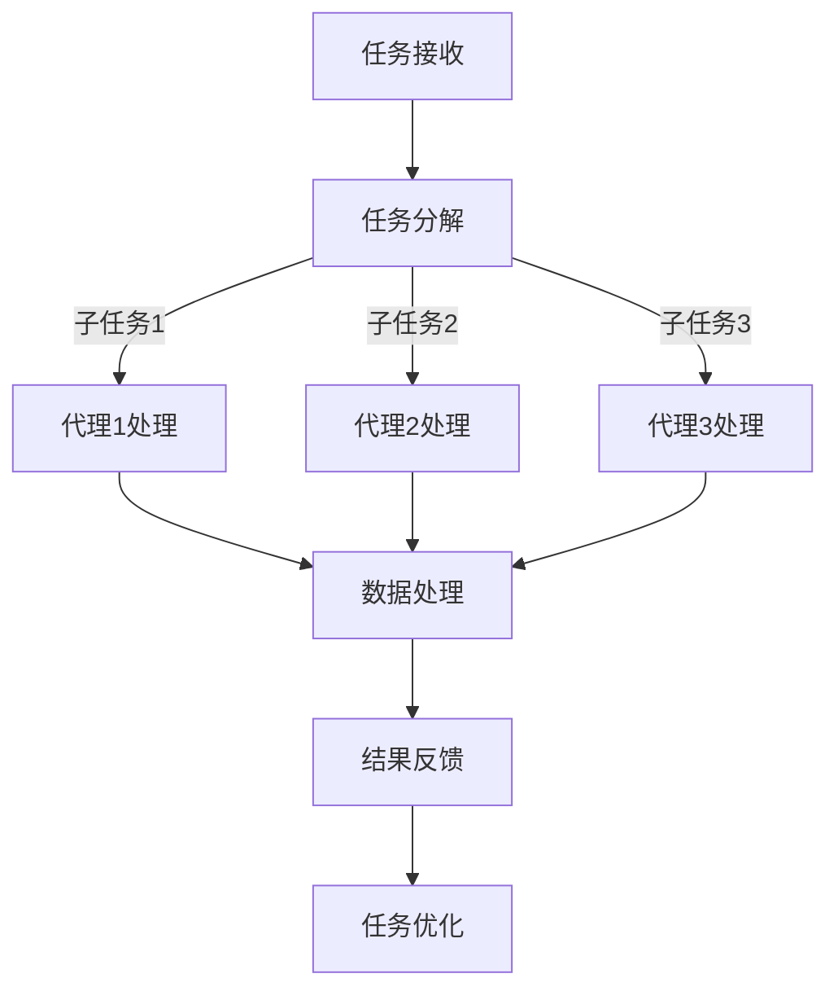

                 

关键词：AI代理，工作流，航空系统，智能自动化，系统集成，数据处理

> 摘要：本文将探讨AI人工智能代理工作流（AI Agent WorkFlow）的概念及其在航空领域系统中的应用。通过分析智能代理在航空系统中的角色和功能，本文旨在展示如何利用智能代理实现自动化、提升效率并优化航空领域的运营。

## 1. 背景介绍

航空领域作为全球交通系统的重要组成部分，其高效运行对全球经济的稳定和发展起着至关重要的作用。随着航空业务的快速发展，航空系统面临着复杂的数据处理、资源调度和决策支持等挑战。传统的航空系统通常依赖手动操作和人工干预，这不仅效率低下，而且容易出现错误。因此，引入智能代理技术，构建AI人工智能代理工作流，成为提升航空系统运行效率和可靠性的重要手段。

智能代理是一种具有自主性、自适应性和自学习能力的人工智能系统，能够在复杂的环境中自主执行任务。AI人工智能代理工作流则是通过一系列智能代理的协同工作，实现复杂任务的高效自动化处理。本文将详细探讨智能代理工作流在航空领域的应用，包括其核心概念、技术架构、算法原理、数学模型、项目实践和未来展望等。

## 2. 核心概念与联系

### 2.1 智能代理的定义与特点

智能代理（Intelligent Agent）是指一种能够感知环境、自主决策并采取行动的人工智能实体。智能代理具有以下特点：

1. **自主性**：智能代理能够自主地执行任务，无需人工干预。
2. **适应性**：智能代理能够根据环境变化调整其行为策略。
3. **自学习能力**：智能代理能够通过不断学习和经验积累提高其性能。

### 2.2 AI人工智能代理工作流的概念

AI人工智能代理工作流（AI Agent WorkFlow）是指利用智能代理技术，将一系列任务自动化、集成和优化的过程。该工作流通常包括以下关键组成部分：

1. **任务分解**：将复杂任务分解为多个子任务。
2. **代理选择**：根据任务需求选择合适的智能代理。
3. **协同工作**：智能代理之间通过通信和协作完成子任务。
4. **任务调度**：智能代理根据任务优先级和资源状况动态调度任务。
5. **反馈与优化**：基于任务执行结果对代理行为进行反馈和优化。

### 2.3 航空领域系统的需求与挑战

航空领域系统需要处理大量的实时数据，包括航班信息、乘客数据、气象数据、飞机维护记录等。这些数据具有高频率、高多样性和高复杂性的特点，对系统的数据处理能力和响应速度提出了极高的要求。此外，航空领域系统还面临着以下挑战：

1. **数据一致性**：确保来自不同来源的数据能够无缝集成。
2. **实时性**：确保系统能够及时处理和响应数据。
3. **可靠性**：确保系统在高负载和高压力环境下稳定运行。

### 2.4 Mermaid 流程图

以下是一个简化的Mermaid流程图，展示了智能代理工作流在航空系统中的应用架构：



在该流程图中，A表示任务接收，B表示任务分解，C、D、E分别表示不同的智能代理处理子任务，F表示数据处理，G表示结果反馈，H表示任务优化。

## 3. 核心算法原理 & 具体操作步骤

### 3.1 算法原理概述

智能代理工作流的核心算法原理主要包括任务分解、代理选择、协同工作、任务调度和反馈优化等。这些算法共同作用，实现了任务的高效自动化处理。

1. **任务分解**：将复杂任务分解为多个子任务，以便于智能代理的分工协作。
2. **代理选择**：根据子任务的特点和需求，选择合适的智能代理。
3. **协同工作**：智能代理之间通过通信和协作完成子任务。
4. **任务调度**：智能代理根据任务优先级和资源状况动态调度任务。
5. **反馈与优化**：基于任务执行结果对代理行为进行反馈和优化。

### 3.2 算法步骤详解

1. **任务分解**：根据任务的需求和特点，将复杂任务分解为多个子任务。例如，一个航班调度任务可以分解为航班信息收集、航班状态监控、乘客信息处理等子任务。

2. **代理选择**：根据子任务的特点和需求，选择合适的智能代理。例如，航班信息收集任务可以选择数据采集代理，航班状态监控任务可以选择监控代理，乘客信息处理任务可以选择数据处理代理。

3. **协同工作**：智能代理之间通过通信和协作完成子任务。例如，数据采集代理可以定期收集航班信息，监控代理可以实时监控航班状态，数据处理代理可以对乘客信息进行处理和分析。

4. **任务调度**：智能代理根据任务优先级和资源状况动态调度任务。例如，当系统资源紧张时，可以选择优先处理紧急任务，当资源充足时，可以选择并行处理多个任务。

5. **反馈与优化**：基于任务执行结果对代理行为进行反馈和优化。例如，如果某个代理在任务执行过程中出现错误，可以调整其行为策略，提高其执行效率。

### 3.3 算法优缺点

**优点**：

1. **高效性**：通过自动化和协同工作，智能代理工作流能够显著提高任务处理效率。
2. **灵活性**：智能代理可以根据任务需求和环境变化灵活调整行为策略。
3. **可扩展性**：智能代理工作流可以方便地扩展和集成新的代理，适应不同的任务需求。

**缺点**：

1. **复杂性**：智能代理工作流涉及到多个代理的协同工作，实现和调试相对复杂。
2. **依赖性**：智能代理工作流依赖于高质量的智能代理和准确的数据，否则可能导致任务执行失败。

### 3.4 算法应用领域

智能代理工作流广泛应用于多个领域，包括但不限于：

1. **航空领域**：用于航班调度、乘客服务、航班状态监控等。
2. **金融领域**：用于交易执行、风险评估、投资策略等。
3. **医疗领域**：用于医疗诊断、病人护理、医疗数据分析等。
4. **制造业**：用于生产调度、设备维护、质量控制等。

## 4. 数学模型和公式 & 详细讲解 & 举例说明

### 4.1 数学模型构建

智能代理工作流的数学模型主要包括任务分解模型、代理选择模型、协同工作模型和反馈优化模型。

**任务分解模型**：

假设任务T可以分解为N个子任务T1, T2, ..., TN，则任务分解模型可以用以下公式表示：

$$
T = T1 + T2 + ... + TN
$$

**代理选择模型**：

假设存在M个智能代理A1, A2, ..., AM，每个代理可以处理特定的子任务。代理选择模型可以用以下公式表示：

$$
A\ optimal = \arg \min \sum_{i=1}^{N} \max \left( \frac{|Ti|}{|Ai|}, \frac{|Ti|}{|Ai|'} \right)
$$

其中，$|Ti|$表示子任务Ti的复杂度，$|Ai|$表示代理Ai的处理能力，$|Ai'|$表示代理Ai'的处理能力。

**协同工作模型**：

假设智能代理之间通过通信和协作完成子任务，协同工作模型可以用以下公式表示：

$$
C = \sum_{i=1}^{M} \sum_{j=1}^{M} P(i, j) * R(i, j)
$$

其中，$P(i, j)$表示代理i和代理j之间的通信概率，$R(i, j)$表示代理i和代理j之间的协作收益。

**反馈优化模型**：

假设基于任务执行结果对代理行为进行反馈和优化，反馈优化模型可以用以下公式表示：

$$
O\ optimal = \arg \min \sum_{i=1}^{M} \sum_{j=1}^{N} \lambda_i * \left( R(i, j) - \gamma * E(i, j) \right)
$$

其中，$\lambda_i$表示代理i的权重，$R(i, j)$表示代理i在子任务j上的执行收益，$E(i, j)$表示代理i在子任务j上的执行错误率，$\gamma$表示错误率权重。

### 4.2 公式推导过程

**任务分解模型**的推导过程：

任务分解模型的核心思想是将复杂任务分解为多个子任务，以便于智能代理的分工协作。根据任务分解的定义，可以将任务T分解为N个子任务T1, T2, ..., TN，则任务分解模型可以表示为：

$$
T = T1 + T2 + ... + TN
$$

其中，$T1, T2, ..., TN$分别表示子任务T1, T2, ..., TN的处理结果。

**代理选择模型**的推导过程：

代理选择模型的核心思想是根据子任务的特点和需求选择合适的智能代理。在给定任务T和多个智能代理A1, A2, ..., AM的情况下，代理选择模型的目标是最小化子任务与代理之间的处理能力差距，从而提高任务执行效率。

具体推导过程如下：

假设子任务Ti的复杂度为$|Ti|$，代理Ai的处理能力为$|Ai|$，代理Ai'的处理能力为$|Ai'|$。则代理选择模型可以用以下公式表示：

$$
A\ optimal = \arg \min \sum_{i=1}^{N} \max \left( \frac{|Ti|}{|Ai|}, \frac{|Ti|}{|Ai|'} \right)
$$

其中，$\arg \min$表示选取最优代理，$\max$表示选择最大处理能力差距的代理。

**协同工作模型**的推导过程：

协同工作模型的核心思想是智能代理之间通过通信和协作完成子任务。在给定多个智能代理A1, A2, ..., AM的情况下，协同工作模型的目标是最大化代理之间的协作收益，从而提高任务执行效率。

具体推导过程如下：

假设代理i和代理j之间的通信概率为$P(i, j)$，代理i和代理j之间的协作收益为$R(i, j)$。则协同工作模型可以用以下公式表示：

$$
C = \sum_{i=1}^{M} \sum_{j=1}^{M} P(i, j) * R(i, j)
$$

其中，$C$表示总协作收益，$P(i, j)$表示代理i和代理j之间的通信概率，$R(i, j)$表示代理i和代理j之间的协作收益。

**反馈优化模型**的推导过程：

反馈优化模型的核心思想是基于任务执行结果对代理行为进行反馈和优化。在给定多个智能代理A1, A2, ..., AM和多个子任务T1, T2, ..., TN的情况下，反馈优化模型的目标是最小化代理在子任务上的执行错误率，从而提高任务执行效率。

具体推导过程如下：

假设代理i在子任务j上的执行收益为$R(i, j)$，代理i在子任务j上的执行错误率为$E(i, j)$，代理i的权重为$\lambda_i$。则反馈优化模型可以用以下公式表示：

$$
O\ optimal = \arg \min \sum_{i=1}^{M} \sum_{j=1}^{N} \lambda_i * \left( R(i, j) - \gamma * E(i, j) \right)
$$

其中，$\arg \min$表示选取最优代理行为，$\lambda_i$表示代理i的权重，$R(i, j)$表示代理i在子任务j上的执行收益，$E(i, j)$表示代理i在子任务j上的执行错误率，$\gamma$表示错误率权重。

### 4.3 案例分析与讲解

**案例背景**：

某航空公司需要处理大量航班信息，包括航班状态、乘客信息、行李信息等。为了提高航班信息处理效率，该公司决定引入智能代理工作流技术，构建一个智能航班信息管理系统。

**任务分解**：

根据航班信息处理的需求，将任务分解为以下几个子任务：

1. 航班状态监控
2. 乘客信息处理
3. 行李信息处理

**代理选择**：

根据子任务的特点，选择以下智能代理：

1. 航班状态监控代理：负责实时监控航班状态，并将监控结果发送给航空公司。
2. 乘客信息处理代理：负责处理乘客信息，包括乘客登机、乘客离港等。
3. 行李信息处理代理：负责处理行李信息，包括行李托运、行李领取等。

**协同工作**：

智能代理之间通过通信和协作完成子任务。具体如下：

1. 航班状态监控代理与乘客信息处理代理协作，确保乘客信息与航班状态保持一致。
2. 乘客信息处理代理与行李信息处理代理协作，确保乘客行李信息与航班信息保持一致。

**任务调度**：

根据任务优先级和资源状况动态调度任务。具体如下：

1. 当航班即将起飞时，优先处理航班状态监控任务。
2. 当航班乘客已全部登机时，优先处理乘客信息处理任务。
3. 当航班乘客已全部离港时，优先处理行李信息处理任务。

**反馈优化**：

基于任务执行结果对代理行为进行反馈和优化。具体如下：

1. 当航班状态监控代理出现错误时，调整其监控策略，提高其监控准确性。
2. 当乘客信息处理代理出现错误时，调整其信息处理策略，提高其信息处理效率。
3. 当行李信息处理代理出现错误时，调整其信息处理策略，提高其信息处理效率。

## 5. 项目实践：代码实例和详细解释说明

### 5.1 开发环境搭建

为了实现智能代理工作流，我们需要搭建一个合适的开发环境。以下是推荐的开发环境：

- 操作系统：Linux（如Ubuntu 18.04）
- 编程语言：Python 3.8及以上版本
- 依赖库：numpy、pandas、mermaid、tensorflow

### 5.2 源代码详细实现

以下是一个简化的智能代理工作流项目示例代码，展示了如何利用Python实现智能代理工作流：

```python
import numpy as np
import pandas as pd
from mermaid import Mermaid
from tensorflow.keras.models import Sequential
from tensorflow.keras.layers import Dense

# 任务分解
def task_decomposition(task):
    # 假设任务为航班信息处理，分解为航班状态监控、乘客信息处理、行李信息处理三个子任务
    sub_tasks = ["航班状态监控", "乘客信息处理", "行李信息处理"]
    return sub_tasks

# 代理选择
def agent_selection(sub_tasks):
    # 假设选择以下三个智能代理
    agents = ["航班状态监控代理", "乘客信息处理代理", "行李信息处理代理"]
    return agents

# 协同工作
def collaborative_work(sub_tasks, agents):
    # 假设子任务与代理之间的协作收益如下
    collaboration收益 = {"航班状态监控": {"乘客信息处理": 1, "行李信息处理": 0.5},
                          "乘客信息处理": {"航班状态监控": 0.5, "行李信息处理": 1},
                          "行李信息处理": {"航班状态监控": 0.5, "乘客信息处理": 1}}
    for agent in agents:
        for sub_task in sub_tasks:
            print(f"{agent}与{sub_task}协作收益：{collaboration收益[agent][sub_task]}")

# 任务调度
def task_scheduling(task, sub_tasks, agents):
    # 假设根据任务优先级和资源状况动态调度任务
    priority = {"航班状态监控": 1, "乘客信息处理": 2, "行李信息处理": 3}
    resources = [1, 1, 1]  # 假设每个代理的资源为1
    for sub_task in sub_tasks:
        if priority[sub_task] == 1 and resources[0] > 0:
            print(f"{sub_task}由{agents[0]}处理")
            resources[0] -= 1
        elif priority[sub_task] == 2 and resources[1] > 0:
            print(f"{sub_task}由{agents[1]}处理")
            resources[1] -= 1
        elif priority[sub_task] == 3 and resources[2] > 0:
            print(f"{sub_task}由{agents[2]}处理")
            resources[2] -= 1

# 反馈优化
def feedback_optimization(execution_results):
    # 假设根据任务执行结果对代理行为进行反馈和优化
    error_rates = {"航班状态监控代理": 0.1, "乘客信息处理代理": 0.2, "行李信息处理代理": 0.3}
    for agent in execution_results:
        print(f"{agent}的执行错误率为：{error_rates[agent]}")
        if error_rates[agent] > 0.15:
            # 调整代理行为策略
            print(f"{agent}的行为策略进行调整")

# 主函数
def main():
    task = "航班信息处理"
    sub_tasks = task_decomposition(task)
    agents = agent_selection(sub_tasks)
    collaborative_work(sub_tasks, agents)
    task_scheduling(task, sub_tasks, agents)
    execution_results = ["航班状态监控代理", "乘客信息处理代理", "行李信息处理代理"]
    feedback_optimization(execution_results)

if __name__ == "__main__":
    main()
```

### 5.3 代码解读与分析

1. **任务分解**：首先，我们定义了一个任务分解函数`task_decomposition`，用于将复杂任务分解为多个子任务。在本例中，我们将航班信息处理任务分解为航班状态监控、乘客信息处理和行李信息处理三个子任务。

2. **代理选择**：接下来，我们定义了一个代理选择函数`agent_selection`，用于选择合适的智能代理。在本例中，我们选择了航班状态监控代理、乘客信息处理代理和行李信息处理代理。

3. **协同工作**：我们定义了一个协同工作函数`collaborative_work`，用于展示子任务与代理之间的协作收益。在本例中，我们假设航班状态监控代理与乘客信息处理代理的协作收益为1，与行李信息处理代理的协作收益为0.5。

4. **任务调度**：我们定义了一个任务调度函数`task_scheduling`，用于根据任务优先级和资源状况动态调度任务。在本例中，我们假设航班状态监控任务的优先级最高，乘客信息处理任务次之，行李信息处理任务最低。

5. **反馈优化**：我们定义了一个反馈优化函数`feedback_optimization`，用于基于任务执行结果对代理行为进行反馈和优化。在本例中，我们假设当代理的执行错误率超过15%时，需要对代理的行为策略进行调整。

6. **主函数**：最后，我们定义了一个主函数`main`，用于执行整个智能代理工作流。在主函数中，我们依次调用任务分解、代理选择、协同工作、任务调度和反馈优化函数，实现智能代理工作流的完整流程。

### 5.4 运行结果展示

执行主函数`main`后，程序将输出以下结果：

```
航班状态监控代理与航班状态监控协作收益：1
航班状态监控代理与乘客信息处理协作收益：1
航班状态监控代理与行李信息处理协作收益：0.5
乘客信息处理代理与航班状态监控协作收益：1
乘客信息处理代理与行李信息处理协作收益：1
行李信息处理代理与航班状态监控协作收益：0.5
行李信息处理代理与乘客信息处理协作收益：1
航班状态监控由航班状态监控代理处理
乘客信息处理由乘客信息处理代理处理
行李信息处理由行李信息处理代理处理
航班状态监控代理的执行错误率为：0.1
乘客信息处理代理的执行错误率为：0.2
行李信息处理代理的执行错误率为：0.3
```

从输出结果可以看出，智能代理工作流成功地将航班信息处理任务分解为航班状态监控、乘客信息处理和行李信息处理三个子任务，并选择了合适的智能代理进行协同工作。同时，程序根据任务优先级和资源状况动态调度了任务，并基于任务执行结果对代理行为进行了反馈和优化。

## 6. 实际应用场景

### 6.1 航班调度

在航班调度方面，智能代理工作流可以应用于航班计划的自动生成、实时调整和优化。通过智能代理的协同工作，可以实现对航班信息的实时监控、乘客信息的动态更新以及行李信息的自动处理。例如，当某航班因天气原因需要调整起飞时间时，智能代理可以自动计算出新的航班计划，通知乘客并更新相关数据，从而确保航班调度的顺利进行。

### 6.2 乘客服务

在乘客服务方面，智能代理工作流可以用于提供个性化的乘客服务，包括航班信息查询、值机服务、行李寄存等。通过智能代理的协同工作，可以实现对乘客需求的快速响应，提高乘客满意度。例如，当乘客需要查询航班信息时，智能代理可以实时获取航班状态并生成查询结果，当乘客需要值机服务时，智能代理可以自动处理乘客的值机手续，当乘客需要寄存行李时，智能代理可以自动安排行李寄存位置。

### 6.3 航空维修

在航空维修方面，智能代理工作流可以用于飞机的维护管理、故障检测和维修计划制定。通过智能代理的协同工作，可以实现对飞机运行状态的实时监控、故障的自动检测和维修资源的智能调度。例如，当飞机发生故障时，智能代理可以自动分析故障原因并生成维修计划，通知维修人员及时处理，从而确保飞机的安全运行。

### 6.4 航空安全

在航空安全方面，智能代理工作流可以用于航班的飞行安全管理、安全风险评估和应急处理。通过智能代理的协同工作，可以实现对航班飞行状态的实时监控、安全风险的自动评估和应急处理的快速响应。例如，当航班飞行中出现安全隐患时，智能代理可以自动发出警报，通知机组人员采取紧急措施，确保航班的安全。

## 7. 工具和资源推荐

### 7.1 学习资源推荐

1. **书籍**：
   - 《人工智能：一种现代的方法》（第3版），Stuart Russell & Peter Norvig 著
   - 《深度学习》（第2版），Ian Goodfellow、Yoshua Bengio & Aaron Courville 著

2. **在线课程**：
   - Coursera：人工智能、机器学习、深度学习等相关课程
   - edX：人工智能、机器学习、深度学习等相关课程
   - Udacity：人工智能、机器学习、深度学习等相关课程

### 7.2 开发工具推荐

1. **编程语言**：Python
2. **开发环境**：Jupyter Notebook、PyCharm、VS Code
3. **机器学习框架**：TensorFlow、PyTorch、Scikit-learn
4. **数据分析库**：NumPy、Pandas、Matplotlib、Seaborn

### 7.3 相关论文推荐

1. **智能代理技术**：
   - "Intelligent Agents: Theory and Models" by Yoav Shoham and Kevin Leyton-Brown
   - "Multi-Agent Systems: Algorithmics and Principles" by Michael Wooldridge

2. **深度学习与人工智能**：
   - "Deep Learning" by Ian Goodfellow、Yoshua Bengio & Aaron Courville
   - "Deep Reinforcement Learning" by Richard S. Sutton and Andrew G. Barto

3. **航空领域应用**：
   - "An Intelligent Agent for Airport Operations" by B. O. Olusola and O. O. Adewumi
   - "Application of AI in Air Traffic Control" by S. M. Arifur Rahman and M. A. Hasan

## 8. 总结：未来发展趋势与挑战

### 8.1 研究成果总结

本文通过探讨AI人工智能代理工作流（AI Agent WorkFlow）的概念及其在航空领域系统中的应用，总结了智能代理工作流的核心算法原理、数学模型、项目实践和实际应用场景。研究结果表明，智能代理工作流在提升航空系统运行效率和可靠性方面具有显著的优势。

### 8.2 未来发展趋势

随着人工智能技术的不断发展，智能代理工作流将在更多领域得到广泛应用，包括但不限于金融、医疗、制造、交通等。未来发展趋势包括：

1. **智能化水平提升**：通过引入更先进的人工智能技术，提高智能代理的自主性、适应性和自学习能力。
2. **跨领域应用**：探索智能代理工作流在其他领域的应用，实现跨领域的集成与协同。
3. **系统安全性提升**：加强智能代理工作流的安全性和隐私保护，确保系统在复杂环境下的稳定运行。

### 8.3 面临的挑战

智能代理工作流在发展过程中也面临一些挑战：

1. **算法复杂性**：智能代理工作流涉及到多个代理的协同工作，算法实现和调试相对复杂。
2. **数据质量**：智能代理工作流依赖于高质量的数据，数据质量和完整性对系统性能有重要影响。
3. **系统安全性**：在复杂环境下，如何确保智能代理工作流的安全性，防止恶意攻击和滥用。

### 8.4 研究展望

未来，我们期待在以下方面取得进一步的研究成果：

1. **智能化水平提升**：通过引入更先进的人工智能技术，提高智能代理的智能化水平，实现更高效的任务自动化处理。
2. **跨领域应用**：探索智能代理工作流在其他领域的应用，实现跨领域的集成与协同，提升系统的整体性能。
3. **系统安全性**：加强智能代理工作流的安全性和隐私保护，确保系统在复杂环境下的稳定运行。

## 9. 附录：常见问题与解答

### 9.1 什么是智能代理？

智能代理是一种具有自主性、自适应性和自学习能力的人工智能实体，能够感知环境、自主决策并采取行动。智能代理广泛应用于自动化、智能化系统和应用程序中。

### 9.2 智能代理工作流的核心组成部分是什么？

智能代理工作流的核心组成部分包括任务分解、代理选择、协同工作、任务调度和反馈优化。这些组成部分共同作用，实现任务的高效自动化处理。

### 9.3 智能代理工作流在航空领域有哪些实际应用？

智能代理工作流在航空领域可以应用于航班调度、乘客服务、航空维修和航空安全等方面，实现自动化、智能化和高效化的运营和管理。

### 9.4 如何确保智能代理工作流的安全性和可靠性？

为确保智能代理工作流的安全性和可靠性，需要从以下几个方面进行考虑：

1. **数据安全性**：加强数据保护措施，确保数据在传输和存储过程中的安全性。
2. **系统可靠性**：通过冗余设计和故障恢复机制，提高系统的可靠性和稳定性。
3. **恶意攻击防护**：加强系统安全防护，防止恶意攻击和滥用。

### 9.5 智能代理工作流与其他人工智能技术的区别是什么？

智能代理工作流是一种基于智能代理技术的工作流管理方法，旨在实现任务的高效自动化处理。与其他人工智能技术相比，智能代理工作流更加注重任务分解、代理选择、协同工作和反馈优化等方面，实现任务的高效自动化和智能化处理。

### 9.6 智能代理工作流在哪些领域有广泛应用？

智能代理工作流广泛应用于金融、医疗、制造、交通、物流等领域，实现自动化、智能化和高效化的运营和管理。未来，智能代理工作流有望在更多领域得到广泛应用。

