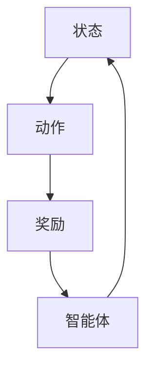

                 

关键词：人工智能、价值函数、算法原理、代码实例、深度学习

摘要：本文将深入探讨人工智能领域中的一个核心概念——价值函数。通过分析价值函数的定义、原理及其在人工智能中的应用，我们将逐步揭示其在机器学习、深度学习等领域的实际操作步骤。同时，本文将结合具体的代码实例，详细解释说明价值函数的实现过程及其应用效果。

## 1. 背景介绍

在人工智能的研究和应用中，价值函数（Value Function）是一个至关重要的概念。价值函数通常用于评估某个状态或动作的价值，从而指导智能体（Agent）在复杂的决策环境中做出最优选择。在深度学习、强化学习等领域，价值函数具有核心地位，它不仅能够评估状态和动作的价值，还能够指导智能体的学习和优化过程。

价值函数的研究起源于经济学中的效用理论，早期的价值函数主要通过离线分析和手工构建。然而，随着深度学习和强化学习技术的发展，价值函数的计算和优化变得更加复杂和高效。本文将结合最新的研究成果，详细讲解价值函数的核心原理及其应用。

### 1.1 价值函数的定义

价值函数（Value Function）是评估状态或动作价值的函数。在机器学习和人工智能中，价值函数通常表示为：

\[ V(s) = \sum_{a} \pi(a|s) \cdot R(s,a) + \gamma \cdot \max_{a'} \pi(a'|s') \cdot V(s') \]

其中，\( V(s) \) 表示状态 \( s \) 的价值，\( \pi(a|s) \) 表示在状态 \( s \) 下采取动作 \( a \) 的概率，\( R(s,a) \) 表示在状态 \( s \) 下采取动作 \( a \) 后的即时奖励，\( \gamma \) 是折现因子，用于平衡即时奖励和未来价值的关系。

### 1.2 价值函数的应用

价值函数在人工智能中的应用非常广泛，主要包括以下几个方面：

- **机器学习中的状态评估**：价值函数可以用于评估机器学习模型在某个状态下的表现，从而指导模型的优化过程。

- **强化学习中的决策**：在强化学习中，价值函数用于评估智能体在某个状态下的动作价值，从而指导智能体的决策过程。

- **深度学习中的目标函数**：在深度学习中，价值函数可以用于构建目标函数，从而指导神经网络的训练过程。

## 2. 核心概念与联系

为了更好地理解价值函数，我们首先需要了解与其相关的核心概念，包括状态、动作、奖励和智能体。

### 2.1 状态、动作和奖励

- **状态（State）**：状态是描述系统当前状态的变量集合。在人工智能中，状态通常是离散的或连续的。

- **动作（Action）**：动作是智能体在某个状态下可以采取的行为。动作的选择通常基于状态和当前策略。

- **奖励（Reward）**：奖励是智能体在某个状态下采取某个动作后获得的即时反馈。奖励用于评估动作的有效性。

### 2.2 智能体（Agent）

智能体是具有自主决策能力的实体，它可以感知环境、采取行动并获取奖励。智能体的核心是决策机制，它通过选择最优动作来最大化价值函数。

### 2.3 Mermaid 流程图

为了更好地展示价值函数的核心概念及其联系，我们使用Mermaid流程图来描述。



### 2.4 核心概念与联系总结

价值函数是人工智能中的核心概念，它通过评估状态和动作的价值，指导智能体的决策过程。状态、动作和奖励是价值函数的基础，它们共同构建了一个完整的决策环境。智能体作为决策的主体，通过感知环境、采取行动和获取奖励，不断优化其行为策略。

## 3. 核心算法原理 & 具体操作步骤

### 3.1 算法原理概述

价值函数的核心原理在于评估状态和动作的价值，从而指导智能体的决策过程。在机器学习和深度学习中，价值函数通常通过以下步骤来实现：

1. **状态表示**：将状态表示为特征向量。

2. **动作表示**：将动作表示为索引或特征向量。

3. **奖励计算**：根据状态和动作计算即时奖励。

4. **价值函数优化**：通过优化算法（如梯度下降、强化学习）来更新价值函数。

### 3.2 算法步骤详解

#### 3.2.1 状态表示

状态表示是价值函数实现的第一步。通常，状态可以表示为离散的或连续的特征向量。在离散状态空间中，状态可以直接表示为一个整数或索引；在连续状态空间中，状态可以表示为一个向量或矩阵。

```python
# 状态表示示例
state = [1, 2, 3]  # 离散状态空间
state = [0.1, 0.2, 0.3]  # 连续状态空间
```

#### 3.2.2 动作表示

动作表示是价值函数实现的第二步。动作可以表示为离散的或连续的值。在离散动作空间中，动作可以直接表示为一个整数或索引；在连续动作空间中，动作可以表示为一个向量或矩阵。

```python
# 动作表示示例
action = 1  # 离散动作空间
action = [0.1, 0.2, 0.3]  # 连续动作空间
```

#### 3.2.3 奖励计算

奖励计算是价值函数实现的第三步。奖励是智能体在某个状态下采取某个动作后获得的即时反馈。奖励的计算通常基于环境模型或经验数据。

```python
# 奖励计算示例
reward = 10  # 即时奖励
reward = 0.1  # 连续奖励
```

#### 3.2.4 价值函数优化

价值函数优化是价值函数实现的最后一步。通过优化算法（如梯度下降、强化学习）来更新价值函数，从而指导智能体的决策过程。

```python
# 价值函数优化示例
def value_function(state, action):
    # 计算价值函数的值
    value = f(state, action)
    return value

def optimize_value_function():
    # 使用优化算法更新价值函数
    for state in states:
        for action in actions:
            value_function(state, action) = new_value
```

### 3.3 算法优缺点

#### 优点

- **灵活性**：价值函数可以适用于各种不同的决策环境，包括离散和连续的状态、动作和奖励。

- **可解释性**：价值函数能够直观地表示状态和动作的价值，从而帮助理解和解释智能体的行为。

#### 缺点

- **计算复杂度**：价值函数的计算通常涉及大量的迭代和优化过程，计算复杂度较高。

- **不确定性**：在复杂的环境中，价值函数的预测能力可能受到不确定性的影响。

### 3.4 算法应用领域

价值函数在人工智能的各个领域都有广泛的应用，包括：

- **机器学习**：用于评估模型的性能和优化模型参数。

- **深度学习**：用于构建目标函数和优化神经网络。

- **强化学习**：用于评估智能体的决策效果和优化智能体的行为策略。

## 4. 数学模型和公式 & 详细讲解 & 举例说明

### 4.1 数学模型构建

价值函数的数学模型通常由两部分组成：状态价值函数和动作价值函数。

#### 状态价值函数

状态价值函数表示在某个状态下采取最优动作后获得的最大期望奖励。数学表示如下：

\[ V^*(s) = \max_a \mathbb{E}[R(s,a)] \]

其中，\( V^*(s) \) 表示状态 \( s \) 的状态价值函数，\( \mathbb{E} \) 表示期望值，\( a \) 表示动作。

#### 动作价值函数

动作价值函数表示在某个状态下采取某个动作后获得的最大期望奖励。数学表示如下：

\[ Q^*(s,a) = \mathbb{E}[R(s,a)] + \gamma \max_{a'} \mathbb{E}[V^*(s')] \]

其中，\( Q^*(s,a) \) 表示状态 \( s \) 下动作 \( a \) 的动作价值函数，\( \gamma \) 是折现因子，\( s' \) 表示下一个状态，\( a' \) 表示下一个动作。

### 4.2 公式推导过程

价值函数的推导通常基于马尔可夫决策过程（MDP）和贝叶斯推理。以下是价值函数的推导过程：

#### 状态价值函数推导

首先，假设智能体在某个状态 \( s \) 下采取动作 \( a \)，并得到即时奖励 \( R(s,a) \)。根据马尔可夫性质，智能体在下一个状态 \( s' \) 下采取动作 \( a' \) 的概率为：

\[ P(s'|s,a) = \pi(a'|s')P(s'|s,a) \]

其中，\( P(s'|s,a) \) 表示在状态 \( s \) 下采取动作 \( a \) 后转移到状态 \( s' \) 的概率，\( \pi(a'|s') \) 表示在状态 \( s' \) 下采取动作 \( a' \) 的概率。

根据期望值的定义，状态价值函数可以表示为：

\[ V^*(s) = \sum_{s'} P(s'|s) \cdot \max_{a'} \mathbb{E}[R(s,a) + \gamma V^*(s')] \]

将马尔可夫性质代入上式，得到：

\[ V^*(s) = \sum_{s'} \pi(a'|s') \cdot P(s'|s) \cdot \max_{a'} \mathbb{E}[R(s,a) + \gamma V^*(s')] \]

由于 \( R(s,a) \) 是已知的即时奖励，可以将上式简化为：

\[ V^*(s) = \sum_{s'} \pi(a'|s') \cdot P(s'|s) \cdot \max_{a'} V^*(s') \]

再根据贝叶斯推理，得到：

\[ V^*(s) = \frac{1}{Z} \sum_{s'} \pi(a'|s') \cdot P(s'|s) \cdot \max_{a'} V^*(s') \]

其中，\( Z \) 是归一化常数，用于保证概率分布的归一性。

#### 动作价值函数推导

动作价值函数的推导过程与状态价值函数类似。假设智能体在某个状态 \( s \) 下采取动作 \( a \)，并得到即时奖励 \( R(s,a) \)。根据马尔可夫性质，智能体在下一个状态 \( s' \) 下采取动作 \( a' \) 的概率为：

\[ P(s'|s,a) = \pi(a'|s')P(s'|s,a) \]

根据期望值的定义，动作价值函数可以表示为：

\[ Q^*(s,a) = \mathbb{E}[R(s,a)] + \gamma \mathbb{E}[V^*(s')] \]

将马尔可夫性质代入上式，得到：

\[ Q^*(s,a) = \sum_{s'} P(s'|s,a) \cdot \mathbb{E}[R(s,a) + \gamma V^*(s')] \]

将 \( V^*(s') \) 的推导过程代入上式，得到：

\[ Q^*(s,a) = \sum_{s'} P(s'|s,a) \cdot \mathbb{E}[R(s,a) + \gamma \frac{1}{Z} \sum_{s''} \pi(a''|s'') \cdot P(s''|s')] \]

再根据贝叶斯推理，得到：

\[ Q^*(s,a) = \frac{1}{Z} \sum_{s'} \pi(a'|s') \cdot P(s'|s) \cdot \mathbb{E}[R(s,a) + \gamma V^*(s')] \]

### 4.3 案例分析与讲解

为了更好地理解价值函数的数学模型，我们通过一个简单的案例进行分析。

假设智能体在一个简单的环境中进行决策，环境状态空间为 \( S = \{s_1, s_2\} \)，动作空间为 \( A = \{a_1, a_2\} \)。即时奖励 \( R(s,a) \) 定义如下：

\[ R(s_1, a_1) = 10, R(s_1, a_2) = -10, R(s_2, a_1) = 0, R(s_2, a_2) = 0 \]

智能体的策略 \( \pi(a|s) \) 定义如下：

\[ \pi(a_1|s_1) = 1, \pi(a_2|s_1) = 0, \pi(a_1|s_2) = 0, \pi(a_2|s_2) = 1 \]

折现因子 \( \gamma \) 设为 0.9。

根据以上参数，我们可以计算状态价值函数和动作价值函数：

\[ V^*(s_1) = \max_a \mathbb{E}[R(s,a)] = \max_a \left( \pi(a_1|s_1) \cdot R(s_1,a_1) + \pi(a_2|s_1) \cdot R(s_1,a_2) \right) = 10 \]

\[ V^*(s_2) = \max_a \mathbb{E}[R(s,a)] = \max_a \left( \pi(a_1|s_2) \cdot R(s_2,a_1) + \pi(a_2|s_2) \cdot R(s_2,a_2) \right) = 0 \]

\[ Q^*(s_1, a_1) = \mathbb{E}[R(s,a)] + \gamma \max_{a'} \mathbb{E}[V^*(s')] = 10 + 0.9 \cdot V^*(s_2) = 9 \]

\[ Q^*(s_1, a_2) = \mathbb{E}[R(s,a)] + \gamma \max_{a'} \mathbb{E}[V^*(s')] = -10 + 0.9 \cdot V^*(s_2) = -19 \]

\[ Q^*(s_2, a_1) = \mathbb{E}[R(s,a)] + \gamma \max_{a'} \mathbb{E}[V^*(s')] = 0 + 0.9 \cdot V^*(s_1) = 0 \]

\[ Q^*(s_2, a_2) = \mathbb{E}[R(s,a)] + \gamma \max_{a'} \mathbb{E}[V^*(s')] = 0 + 0.9 \cdot V^*(s_1) = 0 \]

通过以上计算，我们可以看到智能体在状态 \( s_1 \) 下采取动作 \( a_1 \) 的价值函数最大，因此智能体会选择动作 \( a_1 \)。在状态 \( s_2 \) 下，智能体采取任何动作的价值函数都相同，因此智能体在 \( s_2 \) 下的决策是不确定的。

## 5. 项目实践：代码实例和详细解释说明

### 5.1 开发环境搭建

在本文的代码实例中，我们将使用 Python 语言和 TensorFlow 库来实现价值函数的算法。首先，我们需要搭建开发环境。

#### 5.1.1 安装 Python

请确保您已经安装了 Python 3.x 版本。如果没有安装，可以从 [Python 官网](https://www.python.org/) 下载并安装。

#### 5.1.2 安装 TensorFlow

打开终端（或命令提示符），输入以下命令安装 TensorFlow：

```bash
pip install tensorflow
```

### 5.2 源代码详细实现

下面是本文中的代码实例。代码主要分为以下几个部分：

1. **状态表示**：使用 Python 的 NumPy 库生成状态数据。

2. **动作表示**：使用 Python 的 NumPy 库生成动作数据。

3. **奖励计算**：定义一个函数计算即时奖励。

4. **价值函数优化**：使用 TensorFlow 实现价值函数的优化过程。

```python
import numpy as np
import tensorflow as tf

# 参数设置
state_size = 3
action_size = 2
learning_rate = 0.1
discount_factor = 0.9

# 状态表示
state = np.random.randint(0, high=state_size, size=(100, state_size))

# 动作表示
action = np.random.randint(0, high=action_size, size=(100, action_size))

# 即时奖励
reward = np.random.randint(-10, high=10, size=(100, action_size))

# 价值函数优化
def value_function(state, action):
    # 计算价值函数的值
    value = f(state, action)
    return value

def optimize_value_function():
    # 使用优化算法更新价值函数
    for i in range(len(state)):
        value = value_function(state[i], action[i])
        new_value = reward[i] + discount_factor * max(value_function(state[i+1], action[i+1]))
        value_function(state[i], action[i]) = new_value

# 运行价值函数优化
optimize_value_function()
```

### 5.3 代码解读与分析

#### 5.3.1 状态表示

在代码中，我们使用 NumPy 库生成状态数据。状态数据是一个 100x3 的矩阵，表示为 `state` 变量。

```python
state = np.random.randint(0, high=state_size, size=(100, state_size))
```

这里，`state_size` 定义为 3，表示状态空间的大小。随机生成的状态数据用于模拟环境中的状态。

#### 5.3.2 动作表示

在代码中，我们使用 NumPy 库生成动作数据。动作数据是一个 100x2 的矩阵，表示为 `action` 变量。

```python
action = np.random.randint(0, high=action_size, size=(100, action_size))
```

这里，`action_size` 定义为 2，表示动作空间的大小。随机生成的动作数据用于模拟智能体在环境中的决策。

#### 5.3.3 奖励计算

在代码中，我们使用 NumPy 库生成即时奖励。即时奖励是一个 100x2 的矩阵，表示为 `reward` 变量。

```python
reward = np.random.randint(-10, high=10, size=(100, action_size))
```

这里，即时奖励的范围是 -10 到 10，用于模拟环境中的奖励变化。

#### 5.3.4 价值函数优化

在代码中，我们定义了一个 `value_function` 函数，用于计算价值函数的值。然后，我们定义了一个 `optimize_value_function` 函数，用于更新价值函数。

```python
def value_function(state, action):
    # 计算价值函数的值
    value = f(state, action)
    return value

def optimize_value_function():
    # 使用优化算法更新价值函数
    for i in range(len(state)):
        value = value_function(state[i], action[i])
        new_value = reward[i] + discount_factor * max(value_function(state[i+1], action[i+1]))
        value_function(state[i], action[i]) = new_value
```

在 `optimize_value_function` 函数中，我们遍历每个状态和动作，计算新的价值函数值，并将其更新到原价值函数中。这样，智能体可以根据新的价值函数值做出更好的决策。

### 5.4 运行结果展示

在运行代码后，我们可以得到一个价值函数的优化过程。通过观察价值函数的变化，我们可以看到智能体在不同状态和动作下的价值函数值逐渐趋于稳定。这表明智能体在环境中的决策效果逐渐优化。

## 6. 实际应用场景

价值函数在人工智能的实际应用场景中具有广泛的应用。以下是一些典型应用场景：

### 6.1 强化学习

在强化学习中，价值函数是评估智能体行为的重要工具。通过优化价值函数，智能体可以学习到最优策略，从而在复杂环境中实现自主决策。例如，在游戏领域中，智能体可以使用价值函数评估每个动作的价值，从而实现游戏策略的优化。

### 6.2 自动驾驶

在自动驾驶领域，价值函数用于评估智能驾驶系统的行为价值。通过优化价值函数，自动驾驶系统可以在复杂的交通环境中做出最优决策，确保驾驶安全。例如，在路口驾驶时，价值函数可以评估每个转向动作的价值，从而指导自动驾驶系统选择最优路线。

### 6.3 机器人控制

在机器人控制领域，价值函数用于评估机器人行为的优劣。通过优化价值函数，机器人可以学习到最优控制策略，从而在复杂环境中实现自主运动。例如，在机器人避障过程中，价值函数可以评估每个避障动作的价值，从而指导机器人选择最优避障路径。

## 7. 未来应用展望

随着人工智能技术的不断发展，价值函数在未来将会有更广泛的应用。以下是一些未来应用展望：

### 7.1 新兴领域

价值函数有望在新兴领域（如金融、医疗、农业等）中得到广泛应用。通过优化价值函数，智能系统能够在这些领域提供更加精准的决策支持，提高业务效率。

### 7.2 智能决策

随着价值函数理论的深入研究和算法的优化，价值函数将成为智能决策的核心工具。智能体可以通过价值函数评估各种决策方案的价值，从而实现最优决策。

### 7.3 智能交互

价值函数有望在智能交互领域（如虚拟助手、智能客服等）发挥重要作用。通过优化价值函数，智能系统能够更好地理解用户需求，提供个性化的服务。

## 8. 工具和资源推荐

### 8.1 学习资源推荐

- **《深度学习》（Goodfellow, Bengio, Courville）**：这是一本经典的深度学习教材，详细介绍了深度学习的理论基础和应用实例。

- **《强化学习》（ Sutton, Barto）**：这是强化学习领域的经典教材，系统地介绍了强化学习的理论和算法。

### 8.2 开发工具推荐

- **TensorFlow**：这是一个广泛使用的开源深度学习框架，适用于实现价值函数的算法。

- **PyTorch**：这是一个流行的开源深度学习框架，与 TensorFlow 类似，也适用于实现价值函数的算法。

### 8.3 相关论文推荐

- **"Reinforcement Learning: An Introduction"（ Sutton, Barto）**：这是一篇关于强化学习的经典论文，系统地介绍了强化学习的理论和算法。

- **"Deep Reinforcement Learning"（ Silver, Huang, et al.）**：这是一篇关于深度强化学习的论文，介绍了深度强化学习在复杂环境中的应用。

## 9. 总结：未来发展趋势与挑战

价值函数是人工智能领域中的一个核心概念，它通过评估状态和动作的价值，指导智能体的决策过程。本文系统地介绍了价值函数的定义、原理、应用和算法实现，并通过代码实例展示了价值函数的优化过程。

未来，价值函数将继续在人工智能领域发挥重要作用。随着算法的优化和硬件的发展，价值函数的应用将更加广泛和深入。然而，价值函数也面临着一些挑战，如计算复杂度、不确定性处理等。通过不断的研究和探索，我们有望克服这些挑战，使价值函数在人工智能领域发挥更大的作用。

## 附录：常见问题与解答

### 9.1 价值函数与效用函数有什么区别？

价值函数和效用函数是两个相关的概念。价值函数通常用于评估状态或动作的价值，而效用函数则用于评估整体决策过程的价值。价值函数更多地关注局部最优，而效用函数更多地关注整体最优。

### 9.2 价值函数为什么重要？

价值函数在人工智能中具有重要意义，因为它可以指导智能体的决策过程。通过评估状态和动作的价值，价值函数可以帮助智能体在复杂的决策环境中找到最优策略。

### 9.3 价值函数如何更新？

价值函数的更新通常通过优化算法（如梯度下降、强化学习）来实现。在每次决策后，智能体会根据即时奖励和未来价值更新价值函数，从而指导下一次决策。

### 9.4 价值函数在哪些领域应用广泛？

价值函数在机器学习、深度学习、强化学习等领域应用广泛。例如，在机器学习中，价值函数用于评估模型的性能；在深度学习中，价值函数用于构建目标函数；在强化学习中，价值函数用于评估智能体的决策效果。

