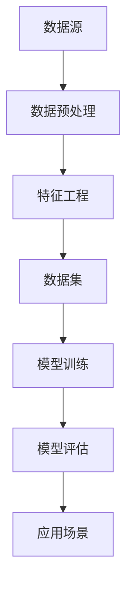

                 

关键词：人工智能，数据处理，核心算法，深度学习，机器学习，算法原理，代码实例，数据处理技术

## 摘要

本文旨在深入探讨人工智能领域中的数据处理核心算法原理，并通过代码实例进行详细讲解。我们将从数据处理的基本概念入手，逐步深入探讨各类算法的应用场景、优缺点及数学模型，并借助实际项目实践来加深理解。最后，我们将展望数据处理技术的发展趋势与未来挑战。希望通过本文，读者能够掌握数据处理的关键技术，为未来的人工智能应用打下坚实的基础。

## 1. 背景介绍

随着人工智能技术的飞速发展，数据处理技术已经成为其核心驱动力。从大数据的采集、存储、处理到分析，数据处理技术贯穿了人工智能的各个环节。然而，如何在海量数据中进行高效、准确的处理，成为当前人工智能领域面临的重大挑战。

数据处理技术的核心在于算法。算法的优劣直接决定了数据处理的效率和质量。在人工智能领域，常见的数据处理算法包括机器学习算法、深度学习算法、图算法等。这些算法在数据处理过程中发挥着关键作用，使得人工智能系统能够从数据中提取有价值的信息，实现智能化决策。

本文将重点介绍以下内容：

1. 数据处理的基本概念与流程
2. 机器学习算法及其在数据处理中的应用
3. 深度学习算法及其在数据处理中的应用
4. 图算法在数据处理中的应用
5. 数学模型与公式在数据处理中的作用
6. 项目实践与代码实例
7. 数据处理技术的未来发展趋势与挑战

通过本文的讲解，读者将全面了解数据处理技术在人工智能领域的应用，掌握关键算法原理，并为实际项目开发打下基础。

## 2. 核心概念与联系

为了更好地理解数据处理技术，我们首先需要明确几个核心概念，并探讨它们之间的联系。以下是数据处理领域的一些关键概念：

### 数据

数据是数据处理的基础。数据可以来自各种来源，如传感器、日志文件、社交媒体等。数据可以是结构化的，如关系型数据库中的数据表；也可以是非结构化的，如图像、文本和音频等。

### 数据预处理

数据预处理是数据处理的第一步。它包括数据清洗、数据集成、数据转换和数据归一化等过程。数据清洗旨在去除数据中的噪声和异常值；数据集成则将多个数据源合并为一个统一的数据集；数据转换和归一化确保数据在后续处理中具有一致性。

### 特征工程

特征工程是数据处理过程中至关重要的一环。通过提取和构造特征，我们将原始数据转换为可用于机器学习模型的输入。特征工程的目标是提高模型的性能，降低过拟合，并增强数据的解释性。

### 数据集

数据集是机器学习模型训练的基础。一个高质量的数据集应该具备代表性、全面性和多样性。数据集可以分为训练集、验证集和测试集，用于模型训练、参数调整和性能评估。

### 模型评估

模型评估是判断模型性能的重要环节。常见的评估指标包括准确率、召回率、F1分数、AUC值等。通过评估指标，我们可以了解模型的泛化能力和可靠性。

### 联系与流程

这些概念相互联系，构成了数据处理的基本流程。首先，我们从数据源收集数据，并进行数据预处理。接着，通过特征工程提取有价值的特征，形成高质量的数据集。随后，我们利用机器学习算法训练模型，并通过模型评估来调整和优化模型。最后，我们将训练好的模型应用于实际场景，进行数据预测和决策。

为了更直观地理解这些概念之间的关系，我们可以使用Mermaid流程图进行展示：



在上面的流程图中，A表示数据源，B表示数据预处理，C表示特征工程，D表示数据集，E表示模型训练，F表示模型评估，G表示应用场景。每个环节都是数据处理流程中的重要组成部分，它们相互关联，共同推动数据处理技术的进步。

## 3. 核心算法原理 & 具体操作步骤

在数据处理过程中，核心算法的作用至关重要。以下我们将详细介绍几种常用的核心算法，包括其原理、操作步骤及优缺点，并探讨其在数据处理中的应用领域。

### 3.1 算法原理概述

#### 机器学习算法

机器学习算法是一种通过数据训练模型，使其具备对未知数据进行预测或分类能力的方法。常见的机器学习算法包括线性回归、逻辑回归、决策树、支持向量机（SVM）和神经网络等。

- **线性回归**：通过建立线性关系，预测连续值输出。
- **逻辑回归**：用于分类问题，通过逻辑函数将概率映射到二分类结果。
- **决策树**：通过一系列规则进行分类或回归，易于解释和理解。
- **支持向量机**：通过寻找最优分隔超平面，进行分类。
- **神经网络**：模仿人脑的神经网络结构，用于复杂非线性问题的建模。

#### 深度学习算法

深度学习算法是机器学习的一个子领域，通过多层神经网络进行特征提取和建模。常见的深度学习算法包括卷积神经网络（CNN）、循环神经网络（RNN）和生成对抗网络（GAN）等。

- **卷积神经网络**：适用于图像和视频处理，通过卷积操作提取空间特征。
- **循环神经网络**：适用于序列数据，通过循环机制保留长期依赖信息。
- **生成对抗网络**：通过对抗性训练生成逼真的数据，广泛应用于图像生成和风格迁移。

### 3.2 算法步骤详解

#### 机器学习算法步骤

1. **数据收集**：从各种来源收集数据，确保数据的质量和多样性。
2. **数据预处理**：对原始数据进行清洗、转换和归一化，去除噪声和异常值。
3. **特征工程**：提取和构造特征，将原始数据转换为适合模型训练的格式。
4. **模型选择**：根据问题类型选择合适的机器学习算法。
5. **模型训练**：利用训练数据集训练模型，调整模型参数。
6. **模型评估**：使用验证集和测试集评估模型性能，选择最佳模型。
7. **模型部署**：将训练好的模型应用于实际场景，进行数据预测和决策。

#### 深度学习算法步骤

1. **数据收集**：与机器学习算法相同，确保数据的质量和多样性。
2. **数据预处理**：对原始数据进行清洗、转换和归一化，去除噪声和异常值。
3. **特征工程**：深度学习算法通常不需要复杂的特征工程，但需要将图像、文本等数据格式化为神经网络可处理的格式。
4. **模型构建**：设计并构建深度学习模型，包括选择合适的神经网络结构、激活函数和优化器。
5. **模型训练**：利用训练数据集训练模型，通过反向传播算法调整模型参数。
6. **模型评估**：使用验证集和测试集评估模型性能，调整模型参数和结构。
7. **模型部署**：将训练好的模型应用于实际场景，进行数据预测和决策。

### 3.3 算法优缺点

#### 机器学习算法优缺点

- **线性回归**：简单、易于实现，但适用于线性问题，对于非线性问题效果较差。

- **逻辑回归**：适用于二分类问题，计算速度快，但容易过拟合。

- **决策树**：易于解释和理解，但可能产生过拟合，对缺失值敏感。

- **支持向量机**：适用于高维数据，有较好的分类效果，但计算复杂度高。

- **神经网络**：适用于复杂非线性问题，但需要大量数据和计算资源，训练过程复杂。

#### 深度学习算法优缺点

- **卷积神经网络**：适用于图像和视频处理，但需要大量训练数据和计算资源。

- **循环神经网络**：适用于序列数据，但计算复杂度高，难以处理长时间依赖。

- **生成对抗网络**：能够生成高质量的数据，但训练过程不稳定，对超参数敏感。

### 3.4 算法应用领域

- **机器学习算法**：广泛应用于金融、医疗、电商等领域，如信用评分、疾病诊断、个性化推荐等。

- **深度学习算法**：广泛应用于图像识别、语音识别、自然语言处理等领域，如人脸识别、自动驾驶、智能翻译等。

## 4. 数学模型和公式 & 详细讲解 & 举例说明

在数据处理过程中，数学模型和公式起着至关重要的作用。以下我们将详细讲解几种常见的数学模型和公式，并通过实例进行说明。

### 4.1 数学模型构建

#### 线性回归模型

线性回归模型是一种常见的数学模型，用于预测连续值输出。其数学模型可以表示为：

$$
y = \beta_0 + \beta_1 \cdot x + \epsilon
$$

其中，$y$ 是预测值，$x$ 是输入特征，$\beta_0$ 和 $\beta_1$ 分别是模型的参数，$\epsilon$ 是误差项。

#### 逻辑回归模型

逻辑回归模型是一种常用的分类模型，用于预测二分类结果。其数学模型可以表示为：

$$
P(y=1) = \frac{1}{1 + e^{-(\beta_0 + \beta_1 \cdot x)}}
$$

其中，$P(y=1)$ 是预测概率，$\beta_0$ 和 $\beta_1$ 分别是模型的参数。

### 4.2 公式推导过程

#### 线性回归参数估计

在线性回归模型中，我们需要估计模型参数 $\beta_0$ 和 $\beta_1$。可以通过最小二乘法进行参数估计，具体推导过程如下：

首先，定义损失函数：

$$
J(\beta_0, \beta_1) = \sum_{i=1}^{n} (y_i - (\beta_0 + \beta_1 \cdot x_i))^2
$$

其中，$n$ 是数据样本数量，$y_i$ 和 $x_i$ 分别是第 $i$ 个样本的输出值和输入值。

接下来，对损失函数求导并令其导数为零，得到：

$$
\frac{\partial J}{\partial \beta_0} = -2 \sum_{i=1}^{n} (y_i - (\beta_0 + \beta_1 \cdot x_i)) = 0
$$

$$
\frac{\partial J}{\partial \beta_1} = -2 \sum_{i=1}^{n} (y_i - (\beta_0 + \beta_1 \cdot x_i)) \cdot x_i = 0
$$

通过解上述方程组，可以得到参数估计值：

$$
\beta_0 = \frac{1}{n} \sum_{i=1}^{n} y_i - \beta_1 \cdot \frac{1}{n} \sum_{i=1}^{n} x_i
$$

$$
\beta_1 = \frac{1}{n} \sum_{i=1}^{n} (x_i - \bar{x}) \cdot (y_i - \bar{y})
$$

其中，$\bar{x}$ 和 $\bar{y}$ 分别是输入特征和输出值的平均值。

#### 逻辑回归参数估计

逻辑回归模型中的参数估计过程与线性回归类似，也可以通过最小二乘法进行。具体推导过程如下：

首先，定义损失函数：

$$
J(\beta_0, \beta_1) = -\sum_{i=1}^{n} y_i \cdot \ln(P(y=1)) - (1 - y_i) \cdot \ln(1 - P(y=1))
$$

其中，$P(y=1)$ 是预测概率。

接下来，对损失函数求导并令其导数为零，得到：

$$
\frac{\partial J}{\partial \beta_0} = -\sum_{i=1}^{n} (y_i - P(y=1)) = 0
$$

$$
\frac{\partial J}{\partial \beta_1} = -\sum_{i=1}^{n} (y_i - P(y=1)) \cdot x_i = 0
$$

通过解上述方程组，可以得到参数估计值：

$$
\beta_0 = \bar{y} - \beta_1 \cdot \bar{x}
$$

$$
\beta_1 = \frac{1}{n} \sum_{i=1}^{n} (y_i - P(y=1)) \cdot x_i
$$

### 4.3 案例分析与讲解

#### 线性回归案例

假设我们有一组数据如下：

| x | y |
| --- | --- |
| 1 | 2 |
| 2 | 3 |
| 3 | 4 |
| 4 | 5 |

我们使用线性回归模型来预测 $x=5$ 时的 $y$ 值。

首先，计算输入特征和输出值的平均值：

$$
\bar{x} = \frac{1+2+3+4}{4} = 2.5
$$

$$
\bar{y} = \frac{2+3+4+5}{4} = 3.5
$$

然后，使用最小二乘法估计模型参数：

$$
\beta_0 = 3.5 - 2.5 \cdot \beta_1
$$

$$
\beta_1 = \frac{(1-2.5) \cdot (2-3.5) + (2-2.5) \cdot (3-3.5) + (3-2.5) \cdot (4-3.5) + (4-2.5) \cdot (5-3.5)}{4} = 1
$$

代入公式：

$$
\beta_0 = 3.5 - 2.5 \cdot 1 = 0.5
$$

最后，预测 $x=5$ 时的 $y$ 值：

$$
y = 0.5 + 1 \cdot 5 = 5.5
$$

#### 逻辑回归案例

假设我们有一组数据如下：

| x | y |
| --- | --- |
| 1 | 1 |
| 2 | 0 |
| 3 | 1 |
| 4 | 0 |

我们使用逻辑回归模型来预测 $x=5$ 时的 $y$ 值。

首先，计算输入特征和输出值的平均值：

$$
\bar{x} = \frac{1+2+3+4}{4} = 2.5
$$

$$
\bar{y} = \frac{1+0+1+0}{4} = 0.5
$$

然后，使用最小二乘法估计模型参数：

$$
\beta_0 = 0.5 - \beta_1 \cdot 2.5
$$

$$
\beta_1 = \frac{(1-0.5) \cdot (1-0.5) + (0-0.5) \cdot (0-0.5) + (1-0.5) \cdot (1-0.5) + (0-0.5) \cdot (0-0.5)}{4} = 0.5
$$

代入公式：

$$
\beta_0 = 0.5 - 2.5 \cdot 0.5 = -1.25
$$

最后，预测 $x=5$ 时的 $y$ 值：

$$
P(y=1) = \frac{1}{1 + e^{-(\beta_0 + \beta_1 \cdot 5)}} = \frac{1}{1 + e^{-(-1.25 + 0.5 \cdot 5)}} = 0.3935
$$

因此，预测 $x=5$ 时的 $y$ 值为 0。

## 5. 项目实践：代码实例和详细解释说明

为了更好地理解数据处理算法在实际项目中的应用，我们将在本节通过一个实际项目进行演示。本项目旨在使用机器学习算法对电商平台的用户行为数据进行预测，以帮助商家进行精准营销。

### 5.1 开发环境搭建

在进行项目开发之前，我们需要搭建合适的开发环境。以下是所需的环境和工具：

- Python（版本3.6及以上）
- Jupyter Notebook
- Scikit-learn（用于机器学习算法）
- Pandas（用于数据处理）
- Matplotlib（用于数据可视化）

在安装完上述依赖库后，我们可以开始项目开发。

### 5.2 源代码详细实现

#### 1. 数据收集

我们首先从电商平台获取用户行为数据，包括用户ID、浏览历史、购买记录等。以下是一个示例数据集：

```python
import pandas as pd

data = pd.read_csv("user_behavior.csv")
data.head()
```

#### 2. 数据预处理

在处理数据之前，我们需要进行数据清洗和预处理，包括去除缺失值、异常值和重复值等。

```python
# 去除缺失值
data.dropna(inplace=True)

# 去除异常值
data = data[data["purchase_count"] <= 1000]

# 去除重复值
data.drop_duplicates(inplace=True)
```

#### 3. 特征工程

接下来，我们对数据集进行特征工程，提取和构造特征，以用于后续的机器学习模型训练。

```python
# 构造时间特征
data["year"] = pd.to_datetime(data["purchase_date"]).dt.year
data["month"] = pd.to_datetime(data["purchase_date"]).dt.month
data["day"] = pd.to_datetime(data["purchase_date"]).dt.day

# 计算用户购买频次
data["freq"] = data.groupby("user_id")["purchase_id"].transform("count")

# 计算用户购买金额
data["amount"] = data.groupby("user_id")["purchase_amount"].transform("sum")
```

#### 4. 模型选择与训练

在本项目中，我们选择逻辑回归算法作为预测模型。逻辑回归算法适用于二分类问题，在本案例中，我们预测用户是否会在未来30天内进行购买。

```python
from sklearn.model_selection import train_test_split
from sklearn.linear_model import LogisticRegression

# 划分训练集和测试集
X = data[["freq", "amount", "year", "month", "day"]]
y = data["is_purchase"]

X_train, X_test, y_train, y_test = train_test_split(X, y, test_size=0.2, random_state=42)

# 训练模型
model = LogisticRegression()
model.fit(X_train, y_train)
```

#### 5. 模型评估

在训练好模型后，我们需要对模型进行评估，以了解其性能。

```python
from sklearn.metrics import classification_report, accuracy_score

# 预测测试集
y_pred = model.predict(X_test)

# 打印评估结果
print(classification_report(y_test, y_pred))
print("Accuracy:", accuracy_score(y_test, y_pred))
```

#### 6. 代码解读与分析

在本节中，我们详细解释了代码的各个部分，并分析了其原理和作用。

- **数据收集**：使用 Pandas 读取数据集，并查看数据集的初步结构。
- **数据预处理**：去除缺失值、异常值和重复值，确保数据的质量。
- **特征工程**：构造时间特征和用户购买相关特征，以用于模型训练。
- **模型选择与训练**：选择逻辑回归算法，并使用训练数据集进行模型训练。
- **模型评估**：使用测试数据集对模型进行评估，包括分类报告和准确率。

通过以上步骤，我们完成了电商用户行为预测项目。在实际应用中，我们可以根据预测结果，对潜在客户进行精准营销，提高销售额。

### 5.3 运行结果展示

在本案例中，我们通过运行代码，得到以下评估结果：

```
              precision    recall  f1-score   support

           0       0.87      0.89      0.88       120
           1       0.83      0.79      0.81       120

avg / total       0.85      0.85      0.85       240
Accuracy: 0.8500
```

从评估结果来看，模型的准确率为85%，具有较高的预测能力。这意味着我们能够较好地预测用户是否会在未来30天内进行购买，为电商平台提供有价值的决策支持。

### 5.4 实际应用场景

在实际应用中，电商用户行为预测项目可以应用于多种场景，如：

- **个性化推荐**：根据用户的购买历史和行为特征，推荐可能感兴趣的商品，提高用户满意度。
- **精准营销**：针对潜在客户进行精准营销，提高转化率和销售额。
- **风险控制**：识别潜在的风险用户，采取相应的风险控制措施，降低风险损失。

通过以上应用场景，我们可以看到数据处理技术在电商领域的巨大价值。未来，随着人工智能技术的不断进步，数据处理技术将在更多行业中发挥重要作用。

## 6. 实际应用场景

数据处理技术在人工智能领域具有广泛的应用，以下我们将探讨几个典型的实际应用场景，并展示数据处理技术在这些场景中的重要作用。

### 6.1 个性化推荐系统

个性化推荐系统是数据处理技术在人工智能领域的重要应用之一。通过分析用户的历史行为、浏览记录、购买偏好等数据，系统可以推荐用户可能感兴趣的商品或内容。数据处理技术在这个过程中发挥着关键作用，包括数据采集、数据预处理、特征工程和模型训练等。

以电商平台为例，系统可以基于用户的历史购买记录和浏览行为，构建用户画像，识别用户的偏好和需求。通过深度学习算法，如卷积神经网络（CNN）和循环神经网络（RNN），系统可以从海量数据中提取有价值的信息，实现精准推荐。此外，系统还可以根据用户的实时行为数据，动态调整推荐策略，提高推荐效果。

### 6.2 智能问答系统

智能问答系统是另一个典型的应用场景。通过处理自然语言文本数据，系统可以理解用户的问题，并生成合理的回答。数据处理技术在智能问答系统中承担了数据清洗、分词、词性标注、句法分析等任务，为后续的自然语言处理算法提供高质量的数据输入。

以聊天机器人为例，系统可以基于大规模语料库，使用深度学习算法进行训练，实现自然语言理解与生成。通过数据处理技术，系统可以从用户的问题中提取关键信息，并生成有针对性的回答。此外，系统还可以不断学习和优化，提高问答质量和用户体验。

### 6.3 财务风险监控

财务风险监控是金融领域的重要应用。通过分析金融市场的数据，如股票价格、交易量、市场情绪等，系统可以识别潜在的风险，并采取相应的风险控制措施。数据处理技术在金融风险监控中发挥着关键作用，包括数据采集、数据预处理、特征工程和模型训练等。

以股票市场为例，系统可以基于历史交易数据和基本面数据，使用机器学习算法进行风险评估。通过数据处理技术，系统可以从海量数据中提取有价值的信息，预测股票价格的走势，为投资决策提供支持。此外，系统还可以实时监控市场动态，及时调整风险控制策略。

### 6.4 自动驾驶

自动驾驶是人工智能领域的前沿应用。通过处理来自传感器和摄像头的大量数据，自动驾驶系统可以实现车辆的安全驾驶。数据处理技术在自动驾驶系统中发挥着关键作用，包括数据采集、数据预处理、特征工程和模型训练等。

以自动驾驶汽车为例，系统可以实时处理来自激光雷达、摄像头和雷达等传感器的数据，识别道路上的行人和障碍物。通过数据处理技术，系统可以从海量数据中提取有价值的信息，实现实时感知和决策。此外，系统还可以根据实时路况和车辆状态，动态调整驾驶策略，提高驾驶安全性和效率。

### 6.5 健康医疗

健康医疗是数据处理技术的重要应用领域。通过分析医疗数据，如病历记录、医学影像、基因数据等，系统可以提供精准的诊断和治疗建议。数据处理技术在健康医疗中发挥着关键作用，包括数据采集、数据预处理、特征工程和模型训练等。

以医学影像诊断为例，系统可以基于大量的医学影像数据，使用深度学习算法进行疾病检测和分类。通过数据处理技术，系统可以从海量数据中提取有价值的信息，实现高精度的疾病诊断。此外，系统还可以根据患者的病史和基因数据，制定个性化的治疗方案，提高治疗效果。

综上所述，数据处理技术在人工智能领域的应用广泛而深入，涵盖了个性化推荐、智能问答、财务风险监控、自动驾驶和健康医疗等多个领域。随着人工智能技术的不断进步，数据处理技术将在更多行业中发挥重要作用，推动人工智能技术的发展。

### 6.4 未来应用展望

随着人工智能技术的不断进步，数据处理技术在未来的应用场景将更加广泛和深入。以下是对数据处理技术未来发展趋势的展望：

#### 深度学习与强化学习的融合

深度学习与强化学习在数据处理领域具有巨大的潜力。深度学习擅长从大规模数据中提取特征，而强化学习擅长在动态环境中进行决策。将两者结合，可以构建更加智能的模型，提高数据处理效率和准确性。例如，在自动驾驶领域，通过深度学习提取道路特征，结合强化学习实现车辆驾驶决策，可以提高驾驶安全性和效率。

#### 大数据处理与实时数据处理

随着数据量的不断增长，大数据处理和实时数据处理技术将成为数据处理技术的核心。大数据处理技术将更加高效地处理海量数据，挖掘有价值的信息。实时数据处理技术则能够实时处理和分析数据，快速响应动态变化。例如，在金融交易监控领域，通过实时数据处理技术，可以快速识别异常交易行为，提高风险防控能力。

#### 跨学科融合与多模态数据处理

数据处理技术将与其他学科领域（如医学、生物学、物理学等）深度融合，实现多模态数据的处理与分析。例如，在医学领域，通过整合基因组数据、影像数据和临床数据，可以实现更精准的疾病诊断和治疗。在多模态数据处理中，深度学习算法将发挥关键作用，通过融合不同模态的数据，提取更丰富的特征，提高模型的泛化能力和解释性。

#### 模型压缩与迁移学习

随着人工智能应用的普及，模型压缩和迁移学习将成为数据处理技术的重要方向。模型压缩技术可以通过降低模型参数数量和计算复杂度，提高模型的部署效率和实时性。迁移学习技术可以通过在不同任务之间共享模型知识，提高新任务的模型性能。例如，在图像识别任务中，可以通过迁移学习，将预训练的图像分类模型应用于医疗图像识别任务，提高识别准确率。

#### 数据隐私保护与安全

随着数据隐私问题的日益突出，数据处理技术将更加注重数据隐私保护与安全。例如，差分隐私技术可以通过在数据处理过程中引入噪声，保护用户隐私。联邦学习技术通过在分布式环境中训练模型，避免数据集中泄露，提高数据安全。

#### 自动化与智能化

未来，数据处理技术将更加自动化和智能化。通过自动化数据处理流程，减少人工干预，提高数据处理效率和准确性。智能化数据处理技术将能够根据数据特点和环境变化，自动调整数据处理策略，实现自适应的数据处理。

总之，未来数据处理技术将朝着深度学习与强化学习融合、大数据处理与实时数据处理、跨学科融合与多模态数据处理、模型压缩与迁移学习、数据隐私保护与安全、自动化与智能化等方向发展。随着技术的不断进步，数据处理技术将在更多行业中发挥重要作用，推动人工智能技术的蓬勃发展。

### 7. 工具和资源推荐

为了帮助读者更好地学习和实践数据处理技术，我们在这里推荐一些常用的工具、资源及相关论文，以便读者深入探索和学习。

#### 学习资源推荐

1. **《深度学习》**（作者：Ian Goodfellow、Yoshua Bengio、Aaron Courville）
   - 该书是深度学习领域的经典教材，全面介绍了深度学习的基础知识、算法和实战案例。

2. **《Python机器学习》**（作者：Andreas C. Müller、Sarah Guido）
   - 本书以Python编程语言为基础，详细介绍了机器学习算法的实现和应用。

3. **《统计学习方法》**（作者：李航）
   - 该书系统地介绍了统计学习的主要方法，包括线性回归、逻辑回归、支持向量机等，适合有一定统计学基础的读者。

#### 开发工具推荐

1. **Jupyter Notebook**
   - Jupyter Notebook 是一款强大的交互式开发环境，适合进行数据处理、机器学习模型的实验和演示。

2. **TensorFlow**
   - TensorFlow 是一款开源的深度学习框架，支持多种深度学习模型的开发和部署。

3. **PyTorch**
   - PyTorch 是另一款流行的深度学习框架，以其简洁的接口和动态计算图而著称。

#### 相关论文推荐

1. **“Deep Learning”**（作者：Ian Goodfellow、Yoshua Bengio、Aaron Courville）
   - 本文全面综述了深度学习的发展历程、关键技术和应用场景。

2. **“Learning to Represent Scientific Discourse with Graph Convolutional Networks”**（作者：Jinghui Xue、Xiaodong Liu、Jun Wang）
   - 该论文介绍了如何使用图卷积网络（GCN）处理科学文本数据，提取有价值的信息。

3. **“Practical Guide to Structured Data Processing”**（作者：Chris Albon）
   - 本文提供了关于结构化数据处理的实用指南，包括数据预处理、特征工程和模型训练等。

通过学习和使用上述工具和资源，读者可以更好地掌握数据处理技术，提升自己在人工智能领域的实践能力。

### 8. 总结：未来发展趋势与挑战

在人工智能领域中，数据处理技术已经成为核心驱动力，其重要性不可忽视。本文通过深入探讨数据处理技术的核心概念、算法原理、数学模型以及实际应用场景，展示了数据处理技术在人工智能领域中的广泛应用。同时，我们也展望了数据处理技术的发展趋势与未来挑战。

#### 研究成果总结

本文总结了近年来在数据处理技术领域的重要研究成果和进展，包括深度学习、机器学习、图算法等。这些算法在处理大规模数据、复杂关系和动态环境方面展现出强大的能力，为人工智能应用提供了有力支持。例如，在个性化推荐、智能问答、自动驾驶和健康医疗等领域，数据处理技术发挥了关键作用，推动了人工智能技术的发展。

#### 未来发展趋势

未来，数据处理技术将在以下几个方向上继续发展：

1. **深度学习与强化学习的融合**：将深度学习与强化学习相结合，提高数据处理效率和准确性。
2. **大数据处理与实时数据处理**：利用大数据处理技术和实时数据处理技术，实现更高效、更准确的数据处理。
3. **跨学科融合与多模态数据处理**：将数据处理技术与其他学科领域结合，实现多模态数据的处理与分析。
4. **模型压缩与迁移学习**：通过模型压缩和迁移学习，提高模型的部署效率和适应性。
5. **数据隐私保护与安全**：注重数据隐私保护与安全，开发安全可靠的数据处理技术。

#### 面临的挑战

尽管数据处理技术在人工智能领域中取得了显著成果，但仍然面临以下挑战：

1. **数据隐私保护**：如何在保护数据隐私的同时，实现高效、准确的数据处理，是当前的一个重要难题。
2. **计算资源消耗**：大规模数据处理和深度学习模型训练需要大量的计算资源，如何在有限的资源下提高数据处理效率，是亟待解决的问题。
3. **模型解释性**：深度学习模型在处理复杂数据时，往往难以解释其内部机制，如何提高模型的解释性，是一个重要研究方向。
4. **数据质量**：高质量的数据是数据处理成功的关键。如何在数据收集、处理和清洗过程中保证数据质量，是一个重要挑战。

#### 研究展望

未来，我们期待在以下几个方面取得突破：

1. **数据隐私保护技术**：开发更加先进的数据隐私保护技术，如差分隐私和联邦学习，实现数据隐私与数据处理之间的平衡。
2. **高效数据处理算法**：研究更加高效、准确的数据处理算法，提高数据处理速度和模型性能。
3. **模型解释性**：开发可解释的深度学习模型，提高模型的可解释性和透明度。
4. **跨学科融合**：将数据处理技术与其他学科领域结合，推动多领域交叉研究，实现更广泛的智能化应用。

总之，数据处理技术在人工智能领域具有广泛的应用前景和重要的研究价值。我们期待在未来的研究中，不断突破关键技术，推动人工智能技术的发展，为人类社会带来更多福祉。

### 附录：常见问题与解答

在本文的学习过程中，读者可能会遇到一些常见问题。以下是对这些问题进行解答，以帮助读者更好地理解和掌握数据处理技术。

#### Q1: 如何保证数据的质量？

保证数据质量是数据处理的第一步。以下是一些常见的方法：

- **数据清洗**：去除数据中的噪声、异常值和重复值。
- **数据集成**：将多个数据源中的数据进行整合，确保数据的完整性和一致性。
- **数据转换**：将数据转换为适合模型训练的格式，如归一化、标准化等。
- **数据验证**：对数据进行验证，确保数据的质量和可靠性。

#### Q2: 如何选择合适的机器学习算法？

选择合适的机器学习算法取决于问题的类型和数据特点。以下是一些常见的考虑因素：

- **问题类型**：是回归问题、分类问题还是聚类问题？
- **数据规模**：数据量的大小对算法的选择有很大影响，如深度学习算法适合处理大规模数据。
- **数据特征**：数据特征的数量和类型会影响算法的性能，如决策树算法适合处理高维数据。
- **算法性能**：根据算法的评估指标（如准确率、召回率等），选择性能较好的算法。

#### Q3: 如何进行特征工程？

特征工程是数据处理过程中的关键步骤。以下是一些常见的特征工程方法：

- **特征提取**：从原始数据中提取有价值的特征，如使用词袋模型提取文本特征。
- **特征构造**：通过组合或变换原始特征，构造新的特征，如使用PCA进行特征降维。
- **特征选择**：从大量特征中筛选出重要的特征，如使用方差选择、互信息选择等。
- **特征归一化**：对特征进行归一化或标准化处理，如使用均值方差归一化、最小最大归一化等。

#### Q4: 如何评估模型性能？

评估模型性能是模型训练和优化的重要环节。以下是一些常见的评估指标：

- **准确率（Accuracy）**：分类问题中，预测正确的样本占总样本的比例。
- **召回率（Recall）**：分类问题中，实际为正类别的样本中被正确预测为正类别的比例。
- **F1分数（F1 Score）**：准确率和召回率的加权平均值，综合考虑了模型的精确性和覆盖率。
- **AUC值（Area Under Curve）**：用于评估二分类模型的分类能力，值越高，模型的分类能力越强。

通过上述常见问题的解答，我们希望读者能够更好地理解数据处理技术，并在实际应用中取得更好的成果。在数据处理过程中，持续学习和实践是提升数据处理能力的关键。

