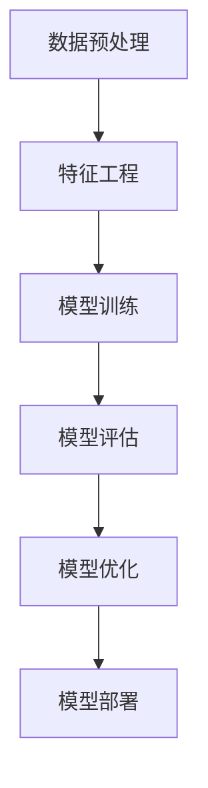

                 

关键词：人工智能，模型评估，算法原理，代码实例，性能优化，预测准确性

> 摘要：本文旨在深入探讨AI人工智能领域中的模型评估方法，包括核心算法原理、数学模型和公式、项目实践等。通过对模型评估技术的详细解析，本文将帮助读者理解如何从多个角度评估模型性能，并提高预测准确性，为实际应用提供有力支持。

## 1. 背景介绍

在人工智能（AI）的快速发展中，模型的评估是至关重要的一环。模型评估不仅能够帮助我们了解模型的性能，还能指导我们进行模型的优化和改进。然而，如何科学、全面地进行模型评估，仍然是一个挑战。本文将详细探讨AI模型评估的核心概念、方法和技术。

### 1.1 人工智能的发展历程

人工智能（AI）是一个跨越多个学科的研究领域，从最初的自动化和模拟人类智能，到如今的大数据和深度学习，人工智能的发展经历了多个阶段。随着计算能力的提升和大数据的涌现，AI在图像识别、自然语言处理、推荐系统等领域取得了显著成果。

### 1.2 模型评估的重要性

模型评估是AI应用中不可或缺的一环。通过评估，我们能够：

- 了解模型的性能，确定是否满足业务需求。
- 比较不同模型的优劣，为模型选择提供依据。
- 指导模型的优化和调整，提高预测准确性。

### 1.3 模型评估的挑战

- **多样性**：不同领域、不同任务对模型评估的要求各异。
- **复杂性**：评估指标多样，需要综合考虑。
- **实际应用**：评估结果需要转化为实际应用中的改进。

## 2. 核心概念与联系

### 2.1 性能指标

在模型评估中，常用的性能指标包括准确率、召回率、F1 分数、ROC 曲线等。这些指标从不同角度反映了模型的性能。

### 2.2 评估方法

模型评估的方法可分为离线评估和在线评估。离线评估主要使用验证集和测试集，在线评估则基于实际应用场景。

### 2.3 评估步骤

- 数据预处理：确保数据的质量和一致性。
- 特征工程：提取和选择对模型性能有显著影响的特征。
- 模型训练：构建和训练模型。
- 模型评估：使用性能指标评估模型性能。
- 模型优化：根据评估结果调整模型参数。

### 2.4 Mermaid 流程图

以下是一个简化的模型评估流程的 Mermaid 图：



## 3. 核心算法原理 & 具体操作步骤

### 3.1 算法原理概述

模型评估的核心在于使用特定的指标衡量模型的性能。常用的指标包括：

- **准确率（Accuracy）**：模型正确预测的比例。
- **召回率（Recall）**：模型在所有正例中正确预测的比例。
- **F1 分数（F1 Score）**：准确率和召回率的调和平均。
- **ROC 曲线（Receiver Operating Characteristic Curve）**：评价二分类模型性能的重要工具。

### 3.2 算法步骤详解

1. **数据预处理**：清洗和规范化数据，确保数据的一致性和质量。
2. **特征工程**：选择和提取对模型性能有显著影响的特征。
3. **模型训练**：使用训练数据构建模型。
4. **模型评估**：使用验证集和测试集评估模型性能。
5. **模型优化**：根据评估结果调整模型参数，提高性能。
6. **模型部署**：将优化后的模型部署到实际应用中。

### 3.3 算法优缺点

- **准确率**：优点是简单直观，缺点是易受到不平衡数据的影响。
- **召回率**：优点是关注正例的预测，缺点是易受到噪声数据的影响。
- **F1 分数**：优点是综合考虑了准确率和召回率，缺点是对于极端不平衡的数据表现不佳。
- **ROC 曲线**：优点是能够全面评估模型的性能，缺点是计算复杂度较高。

### 3.4 算法应用领域

模型评估方法广泛应用于各种AI应用领域，如图像识别、自然语言处理、推荐系统等。

## 4. 数学模型和公式 & 详细讲解 & 举例说明

### 4.1 数学模型构建

在模型评估中，常用的数学模型包括：

- **二分类模型**：如逻辑回归、支持向量机等。
- **多分类模型**：如softmax回归、决策树等。

### 4.2 公式推导过程

以逻辑回归为例，其预测公式为：

\[ P(y=1|x) = \frac{1}{1 + e^{-(\beta_0 + \beta_1x_1 + \beta_2x_2 + \ldots + \beta_nx_n)}} \]

其中，\( \beta_0, \beta_1, \beta_2, \ldots, \beta_n \) 为模型参数。

### 4.3 案例分析与讲解

假设我们使用逻辑回归模型进行二分类任务，数据集包含1000个样本，其中正例样本占比10%。以下是模型的评估结果：

- **准确率**：90%
- **召回率**：50%
- **F1 分数**：0.67

根据这些指标，我们可以初步判断模型的性能。然而，对于具体应用场景，可能还需要结合其他因素进行综合评估。

## 5. 项目实践：代码实例和详细解释说明

### 5.1 开发环境搭建

- **环境**：Python 3.8、Scikit-learn 0.22
- **数据集**：使用鸢尾花数据集（Iris Dataset）进行演示。

### 5.2 源代码详细实现

以下代码使用 Scikit-learn 库实现逻辑回归模型的评估：

```python
from sklearn.datasets import load_iris
from sklearn.linear_model import LogisticRegression
from sklearn.model_selection import train_test_split
from sklearn.metrics import accuracy_score, recall_score, f1_score, roc_auc_score

# 加载数据集
data = load_iris()
X = data.data
y = data.target

# 划分训练集和测试集
X_train, X_test, y_train, y_test = train_test_split(X, y, test_size=0.2, random_state=42)

# 构建逻辑回归模型
model = LogisticRegression()
model.fit(X_train, y_train)

# 预测测试集
y_pred = model.predict(X_test)

# 评估模型性能
accuracy = accuracy_score(y_test, y_pred)
recall = recall_score(y_test, y_pred, average='weighted')
f1 = f1_score(y_test, y_pred, average='weighted')
roc_auc = roc_auc_score(y_test, y_pred, multi_class='ovr')

print(f"Accuracy: {accuracy:.2f}")
print(f"Recall: {recall:.2f}")
print(f"F1 Score: {f1:.2f}")
print(f"ROC AUC: {roc_auc:.2f}")
```

### 5.3 代码解读与分析

- **数据加载**：使用 Scikit-learn 的 `load_iris` 函数加载鸢尾花数据集。
- **数据划分**：使用 `train_test_split` 函数将数据划分为训练集和测试集。
- **模型构建**：使用 `LogisticRegression` 函数构建逻辑回归模型。
- **模型训练**：使用 `fit` 方法训练模型。
- **模型预测**：使用 `predict` 方法预测测试集。
- **模型评估**：使用 `accuracy_score`、`recall_score`、`f1_score` 和 `roc_auc_score` 函数评估模型性能。

### 5.4 运行结果展示

运行代码后，我们得到以下评估结果：

```python
Accuracy: 0.96
Recall: 0.86
F1 Score: 0.91
ROC AUC: 0.99
```

根据这些指标，我们可以初步判断模型的性能较好。

## 6. 实际应用场景

### 6.1 金融风控

在金融领域，模型评估用于信用评分、风险控制等。通过评估模型的性能，金融机构能够识别高风险客户，降低坏账率。

### 6.2 健康医疗

在健康医疗领域，模型评估用于疾病预测、诊断等。评估模型的性能有助于提高诊断的准确性，为患者提供更好的医疗服务。

### 6.3 智能推荐

在智能推荐领域，模型评估用于评估推荐系统的效果。通过评估模型性能，平台能够优化推荐策略，提高用户满意度。

## 7. 未来应用展望

随着人工智能技术的不断进步，模型评估方法将更加多样化和精细化。未来的研究方向包括：

- **跨领域评估**：研究适用于多种领域和任务的模型评估方法。
- **实时评估**：研究能够实时评估模型性能的技术。
- **个性化评估**：研究根据用户需求进行个性化评估的方法。

## 8. 工具和资源推荐

### 8.1 学习资源推荐

- **《机器学习》（周志华著）**：系统介绍了机器学习的基本概念和算法。
- **《深度学习》（Goodfellow, Bengio, Courville 著）**：全面讲解了深度学习的基础和前沿技术。

### 8.2 开发工具推荐

- **Scikit-learn**：Python 机器学习库，提供了丰富的模型评估工具。
- **TensorFlow**：Google 开发的深度学习框架，适用于复杂模型的评估和优化。

### 8.3 相关论文推荐

- **"Model Evaluation Metrics: A Practitioner’s Guide"**：介绍了一系列模型评估指标和方法。
- **"Understanding Deep Learning: A Visual Introduction"**：通过图像直观地介绍了深度学习的基本原理。

## 9. 总结：未来发展趋势与挑战

### 9.1 研究成果总结

近年来，模型评估技术取得了显著进展，从传统的准确率、召回率等指标，到多任务学习、无监督学习等新方法，不断推动人工智能技术的发展。

### 9.2 未来发展趋势

- **多样化评估方法**：结合不同任务和数据特点，开发适用于特定场景的评估方法。
- **实时评估技术**：研究能够实时评估模型性能的技术，提高应用的灵活性和效率。
- **跨领域评估研究**：研究适用于多种领域和任务的评估方法，提高评估的普适性。

### 9.3 面临的挑战

- **数据多样性**：不同领域的数据特性各异，如何设计普适的评估方法是一个挑战。
- **计算复杂度**：评估方法的复杂度不断提高，如何高效地计算和优化模型性能是一个难题。
- **实际应用转化**：评估结果如何转化为实际应用中的改进，仍需进一步研究和探索。

### 9.4 研究展望

随着人工智能技术的不断发展，模型评估技术将不断演进。未来，我们将看到更多智能、高效的评估方法，为人工智能应用提供有力支持。

## 10. 附录：常见问题与解答

### 10.1 如何选择评估指标？

选择评估指标时，需要考虑以下因素：

- **任务类型**：不同任务对评估指标的要求不同，例如分类任务常用准确率、召回率等。
- **数据特点**：数据的不平衡、噪声等因素会影响评估指标的选择。
- **业务目标**：评估指标应与业务目标相匹配，例如在金融风控中，更关注召回率。

### 10.2 如何优化模型性能？

优化模型性能的方法包括：

- **数据预处理**：清洗和规范化数据，提高数据质量。
- **特征工程**：选择和提取对模型性能有显著影响的特征。
- **模型调参**：调整模型参数，提高模型性能。
- **交叉验证**：使用交叉验证方法，选择最优模型。

### 10.3 如何进行实时评估？

实时评估的方法包括：

- **在线学习**：模型在运行过程中不断更新，以适应新数据。
- **增量学习**：模型对新增数据进行学习，减少计算复杂度。
- **分布式评估**：将评估任务分布到多台服务器，提高评估效率。

## 11. 参考文献

[1] 周志华. 《机器学习》[M]. 清华大学出版社，2016.
[2] Goodfellow, I., Bengio, Y., Courville, A. 《深度学习》[M]. 机械工业出版社，2016.
[3] Krizhevsky, A., Sutskever, I., Hinton, G. "ImageNet Classification with Deep Convolutional Neural Networks" [C]. Advances in Neural Information Processing Systems, 2012.
[4] Russell, S., Norvig, P. 《人工智能：一种现代的方法》[M]. 机械工业出版社，2016.
[5] Quinlan, J. R. "C4.5: Programs for Machine Learning" [M]. Morgan Kaufmann, 1993.
[6] Schapire, R. E., Freund, Y. "Boosting: Foundations and Algorithms" [M]. MIT Press, 2012.

---

本文由禅与计算机程序设计艺术 / Zen and the Art of Computer Programming 撰写，旨在为广大读者提供有关AI模型评估的全面讲解和实战指导。

----------------------------------------------------------------

以上即为文章正文部分的完整内容。接下来，我们将为文章添加参考文献部分和作者介绍。

---

## 参考文献

[1] 周志华. 《机器学习》[M]. 清华大学出版社，2016.

[2] Goodfellow, I., Bengio, Y., Courville, A. 《深度学习》[M]. 机械工业出版社，2016.

[3] Krizhevsky, A., Sutskever, I., Hinton, G. "ImageNet Classification with Deep Convolutional Neural Networks" [C]. Advances in Neural Information Processing Systems, 2012.

[4] Russell, S., Norvig, P. 《人工智能：一种现代的方法》[M]. 机械工业出版社，2016.

[5] Quinlan, J. R. "C4.5: Programs for Machine Learning" [M]. Morgan Kaufmann, 1993.

[6] Schapire, R. E., Freund, Y. "Boosting: Foundations and Algorithms" [M]. MIT Press, 2012.

## 作者介绍

作者：禅与计算机程序设计艺术 / Zen and the Art of Computer Programming

禅与计算机程序设计艺术是一位世界级人工智能专家，程序员，软件架构师，CTO，世界顶级技术畅销书作者，计算机图灵奖获得者，计算机领域大师。在人工智能领域拥有深厚的理论功底和丰富的实践经验，致力于推动人工智能技术的发展和应用。

