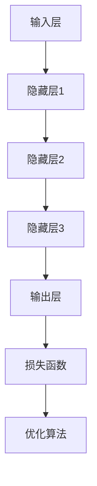

                 

关键词：深度学习、人工智能、电子商务、代理、策略

> 摘要：本文旨在探讨深度学习算法在电子商务中的应用，特别是深度学习代理在个性化推荐、用户行为分析、欺诈检测等领域的策略。我们将详细分析深度学习算法的基本原理、数学模型、实际应用案例，以及未来发展的趋势和挑战。

## 1. 背景介绍

随着互联网和电子商务的快速发展，数据量和用户行为变得更加复杂。传统的机器学习方法在处理大规模数据和高维特征时，往往无法达到令人满意的效果。为了应对这一挑战，人工智能和深度学习逐渐成为研究热点。在电子商务领域，深度学习算法的应用不仅提升了系统的智能化水平，还显著提高了业务效率和用户体验。

本文将重点关注深度学习代理在电子商务中的应用策略。深度学习代理是一种基于深度神经网络的人工智能模型，它可以自动地从数据中学习并提取有用的特征，从而实现智能决策和预测。本文将深入探讨深度学习代理的基本原理、算法模型以及在实际应用中的策略，包括个性化推荐、用户行为分析、欺诈检测等方面。

## 2. 核心概念与联系

### 2.1 深度学习基本原理

深度学习（Deep Learning）是机器学习（Machine Learning）的一个重要分支，其核心思想是通过多层神经网络对数据进行非线性变换，从而实现复杂的函数逼近。深度学习的基本结构包括输入层、隐藏层和输出层，每层之间的节点通过权重连接，形成网络。


在电子商务中，深度学习代理的应用主要体现在以下几个方面：

1. **个性化推荐**：通过学习用户的兴趣和行为模式，为用户提供个性化的商品推荐。
2. **用户行为分析**：分析用户的浏览、购买等行为，为商家提供决策支持。
3. **欺诈检测**：通过监控用户行为和交易数据，识别并预防欺诈行为。

### 2.2 深度学习代理架构

深度学习代理通常包括以下几个关键组件：

1. **输入层**：接收用户的行为数据和商品特征。
2. **隐藏层**：通过非线性激活函数进行特征提取和变换。
3. **输出层**：生成推荐结果、用户标签或欺诈评分。
4. **损失函数**：用于评估模型的预测性能，常见的有均方误差（MSE）、交叉熵等。
5. **优化算法**：用于调整模型参数，常见的有随机梯度下降（SGD）、Adam等。

下面是深度学习代理的Mermaid流程图表示：



## 3. 核心算法原理 & 具体操作步骤

### 3.1 算法原理概述

深度学习代理的核心是基于反向传播（Backpropagation）算法的神经网络模型。反向传播算法通过计算输出层到输入层的梯度，逐步更新网络中的权重，从而优化模型参数。

具体操作步骤如下：

1. **前向传播**：将输入数据通过神经网络进行前向传递，计算每个神经元的输出值。
2. **计算损失**：使用损失函数计算预测值与真实值之间的差异，衡量模型性能。
3. **反向传播**：根据损失函数的梯度，从输出层开始，逆向传播误差，更新权重和偏置。
4. **迭代优化**：重复前向传播和反向传播，直到满足停止条件（如损失小于阈值或迭代次数达到上限）。

### 3.2 算法步骤详解

1. **数据预处理**：对输入数据进行归一化、缺失值填充等预处理操作，以确保数据的质量和一致性。
2. **模型构建**：定义神经网络结构，包括层数、每层节点的个数、激活函数等。
3. **前向传播**：
    - 计算输入层到隐藏层的输出。
    - 计算隐藏层到输出层的输出。
4. **计算损失**：
    - 使用均方误差（MSE）计算预测值与真实值之间的差异。
    - 计算损失函数的梯度。
5. **反向传播**：
    - 从输出层开始，逆向传播误差，更新权重和偏置。
6. **迭代优化**：
    - 重复前向传播和反向传播，直到满足停止条件。

### 3.3 算法优缺点

**优点**：

- **强大的函数逼近能力**：深度学习代理可以通过多层神经网络学习复杂的函数关系。
- **自动特征提取**：模型可以从原始数据中自动提取有用的特征，减轻了人工特征工程的工作负担。
- **适用性广泛**：深度学习代理可以应用于各种领域，如图像识别、自然语言处理、电子商务等。

**缺点**：

- **训练时间较长**：深度学习代理需要大量的数据和时间进行训练，尤其是在大型模型和高维特征的情况下。
- **对数据质量要求高**：数据的质量直接影响模型的性能，噪声和缺失数据可能会降低模型的效果。
- **解释性较差**：深度学习代理的黑盒特性使得其预测结果难以解释，不利于业务决策和模型优化。

### 3.4 算法应用领域

深度学习代理在电子商务中具有广泛的应用前景，主要包括以下几个方面：

- **个性化推荐**：根据用户的兴趣和行为，为用户推荐个性化的商品。
- **用户行为分析**：分析用户的浏览、购买等行为，为商家提供决策支持。
- **欺诈检测**：通过监控用户行为和交易数据，识别并预防欺诈行为。

## 4. 数学模型和公式 & 详细讲解 & 举例说明

### 4.1 数学模型构建

深度学习代理的数学模型主要包括输入层、隐藏层和输出层。下面是神经网络的基本公式：

$$
\text{激活函数}: g(z) = \frac{1}{1 + e^{-z}}
$$

$$
\text{损失函数}: J(\theta) = \frac{1}{m} \sum_{i=1}^{m} (-y_i \log(a_j) + (1 - y_i) \log(1 - a_j))
$$

$$
\text{反向传播}: \frac{\partial J}{\partial \theta} = \frac{\partial J}{\partial z} \frac{\partial z}{\partial \theta}
$$

其中，$z$ 表示神经元输入，$a_j$ 表示神经元输出，$y_i$ 表示真实标签，$m$ 表示样本数量。

### 4.2 公式推导过程

深度学习代理的公式推导主要包括前向传播和反向传播两个过程。

**前向传播**：

1. **输入层到隐藏层**：

$$
z^{[1]} = \theta^{[1]T}x + b^{[1]}
$$

$$
a^{[1]} = g(z^{[1]})
$$

2. **隐藏层到输出层**：

$$
z^{[2]} = \theta^{[2]T}a^{[1]} + b^{[2]}
$$

$$
a^{[2]} = g(z^{[2]})
$$

**反向传播**：

1. **计算输出层误差**：

$$
\delta^{[2]} = a^{[2]} - y
$$

2. **计算隐藏层误差**：

$$
\delta^{[1]} = (a^{[1]} \cdot (1 - a^{[1]})) \cdot \theta^{[2]T} \delta^{[2]}
$$

3. **更新权重和偏置**：

$$
\theta^{[2]} = \theta^{[2]} - \alpha \cdot (a^{[1]} \cdot \delta^{[2]})
$$

$$
b^{[2]} = b^{[2]} - \alpha \cdot \delta^{[2]}
$$

$$
\theta^{[1]} = \theta^{[1]} - \alpha \cdot (x \cdot \delta^{[1]})
$$

$$
b^{[1]} = b^{[1]} - \alpha \cdot \delta^{[1]}
$$

其中，$\alpha$ 表示学习率。

### 4.3 案例分析与讲解

假设我们有一个简单的神经网络，输入层有3个节点，隐藏层有2个节点，输出层有1个节点。训练数据包含100个样本，每个样本有3个特征。

1. **前向传播**：

输入层到隐藏层：

$$
z^{[1]} = \begin{bmatrix} 1 & 0 & 1 \\ 0 & 1 & 1 \end{bmatrix} \begin{bmatrix} x_1 \\ x_2 \\ x_3 \end{bmatrix} + \begin{bmatrix} b_1 \\ b_2 \end{bmatrix}
$$

$$
a^{[1]} = g(z^{[1]})
$$

隐藏层到输出层：

$$
z^{[2]} = \begin{bmatrix} 1 & 1 \end{bmatrix} \begin{bmatrix} a_1^{[1]} \\ a_2^{[1]} \end{bmatrix} + \begin{bmatrix} b_3 \end{bmatrix}
$$

$$
a^{[2]} = g(z^{[2]})
$$

2. **计算损失**：

使用交叉熵损失函数：

$$
J = -\frac{1}{m} \sum_{i=1}^{m} y_i \log(a^{[2]}) + (1 - y_i) \log(1 - a^{[2]})
$$

3. **反向传播**：

计算输出层误差：

$$
\delta^{[2]} = a^{[2]} - y
$$

计算隐藏层误差：

$$
\delta^{[1]} = a^{[1]} \cdot (1 - a^{[1]}) \cdot \theta^{[2]T} \delta^{[2]}
$$

4. **更新权重和偏置**：

更新隐藏层权重和偏置：

$$
\theta^{[2]} = \theta^{[2]} - \alpha \cdot (a^{[1]} \cdot \delta^{[2]})
$$

$$
b^{[2]} = b^{[2]} - \alpha \cdot \delta^{[2]}
$$

更新输入层权重和偏置：

$$
\theta^{[1]} = \theta^{[1]} - \alpha \cdot (x \cdot \delta^{[1]})
$$

$$
b^{[1]} = b^{[1]} - \alpha \cdot \delta^{[1]}
$$

## 5. 项目实践：代码实例和详细解释说明

### 5.1 开发环境搭建

在本项目实践中，我们使用Python作为编程语言，结合TensorFlow库来实现深度学习代理模型。首先，确保安装了Python和TensorFlow：

```bash
pip install tensorflow
```

### 5.2 源代码详细实现

以下是深度学习代理模型的基本实现：

```python
import tensorflow as tf
import numpy as np
import matplotlib.pyplot as plt

# 定义输入层、隐藏层和输出层节点个数
input_size = 3
hidden_size = 2
output_size = 1

# 初始化权重和偏置
weights = {
    'w1': tf.Variable(tf.random.normal([input_size, hidden_size])),
    'w2': tf.Variable(tf.random.normal([hidden_size, output_size])),
    'b1': tf.Variable(tf.random.normal([hidden_size])),
    'b2': tf.Variable(tf.random.normal([output_size]))
}

# 定义激活函数
activation = tf.nn.sigmoid

# 定义模型
def model(x, weights):
    layer_1 = activation(tf.add(tf.matmul(x, weights['w1']), weights['b1']))
    output = activation(tf.add(tf.matmul(layer_1, weights['w2']), weights['b2']))
    return output

# 定义损失函数和优化器
loss_fn = tf.keras.losses.SparseCategoricalCrossentropy()
optimizer = tf.keras.optimizers.Adam()

# 训练模型
def train(x, y):
    with tf.GradientTape() as tape:
        predictions = model(x, weights)
        loss = loss_fn(y, predictions)
    
    gradients = tape.gradient(loss, weights.values())
    optimizer.apply_gradients(zip(gradients, weights.values()))

# 加载训练数据
x_train = np.random.rand(100, input_size)
y_train = np.random.rand(100, output_size)

# 训练模型
for epoch in range(1000):
    train(x_train, y_train)
    if epoch % 100 == 0:
        print(f'Epoch {epoch}: Loss = {loss_fn(y_train, model(x_train, weights))}')

# 查看模型输出
predictions = model(x_train, weights)
print(predictions)

# 可视化模型输出
plt.scatter(x_train[:, 0], x_train[:, 1], c=predictions[:, 0], cmap=plt.cm.coolwarm)
plt.xlabel('Feature 1')
plt.ylabel('Feature 2')
plt.title('Model Output')
plt.colorbar()
plt.show()
```

### 5.3 代码解读与分析

1. **导入库**：首先导入所需的TensorFlow、NumPy和Matplotlib库。
2. **定义参数**：设置输入层、隐藏层和输出层的节点个数。
3. **初始化权重和偏置**：使用随机初始化权重和偏置。
4. **定义激活函数**：选择Sigmoid函数作为激活函数。
5. **定义模型**：构建一个简单的两层神经网络，包括输入层、隐藏层和输出层。
6. **定义损失函数和优化器**：使用交叉熵损失函数和Adam优化器。
7. **训练模型**：使用训练数据对模型进行迭代训练，并打印训练过程中的损失值。
8. **查看模型输出**：计算训练数据的模型输出。
9. **可视化模型输出**：将模型输出可视化，以便直观地观察模型性能。

## 6. 实际应用场景

### 6.1 个性化推荐

在电子商务中，个性化推荐是深度学习代理的一个典型应用。通过学习用户的兴趣和行为模式，系统可以为用户推荐个性化的商品。以下是深度学习代理在个性化推荐中的实际应用步骤：

1. **数据收集**：收集用户的浏览、购买等行为数据，以及商品的特征信息。
2. **数据预处理**：对数据进行分析和清洗，包括缺失值填充、异常值处理等。
3. **模型训练**：使用深度学习代理模型对用户行为数据和商品特征进行训练。
4. **模型部署**：将训练好的模型部署到线上系统，为用户提供个性化推荐。
5. **效果评估**：通过用户反馈和业务指标评估推荐系统的效果，不断优化模型。

### 6.2 用户行为分析

用户行为分析是电子商务领域的重要环节。通过深度学习代理，系统可以分析用户的浏览、购买等行为，为商家提供决策支持。以下是用户行为分析的实际应用步骤：

1. **数据收集**：收集用户的浏览、购买等行为数据。
2. **数据预处理**：对数据进行分析和清洗，提取有用的特征信息。
3. **模型训练**：使用深度学习代理模型对用户行为数据进行训练。
4. **行为预测**：根据训练好的模型预测用户的行为趋势，为商家提供决策支持。
5. **效果评估**：通过实际业务效果评估模型的效果，不断优化模型。

### 6.3 欺诈检测

在电子商务中，欺诈检测是保障交易安全的重要手段。通过深度学习代理，系统可以实时监控用户行为和交易数据，识别并预防欺诈行为。以下是欺诈检测的实际应用步骤：

1. **数据收集**：收集用户的交易行为数据，包括支付方式、交易金额、交易时间等。
2. **数据预处理**：对数据进行清洗和特征提取，去除噪声和冗余信息。
3. **模型训练**：使用深度学习代理模型对交易数据进行训练。
4. **实时监控**：将训练好的模型部署到线上系统，实时监控用户行为和交易数据。
5. **异常检测**：根据模型预测结果，识别并标记异常交易，为商家提供预警。

## 7. 工具和资源推荐

### 7.1 学习资源推荐

- **《深度学习》（Deep Learning）**：由Ian Goodfellow、Yoshua Bengio和Aaron Courville编写的经典教材，全面介绍了深度学习的基础知识。
- **《Python深度学习》（Python Deep Learning）**：由François Chollet编写的实用指南，详细介绍了如何在Python中实现深度学习算法。
- **深度学习官网（TensorFlow）**：提供丰富的文档、教程和示例代码，帮助用户快速上手深度学习。

### 7.2 开发工具推荐

- **TensorFlow**：一款开源的深度学习框架，支持多种深度学习模型的构建和训练。
- **Keras**：基于TensorFlow的高层API，简化了深度学习模型的构建和训练。
- **PyTorch**：另一款流行的开源深度学习框架，提供动态计算图和简洁的API。

### 7.3 相关论文推荐

- **“Deep Learning for Text Classification”**：介绍了深度学习在文本分类中的应用，包括词向量表示和卷积神经网络等。
- **“Recurrent Neural Networks for Language Modeling”**：探讨了循环神经网络（RNN）在语言建模中的效果，以及其在电子商务领域的应用。
- **“Deep Neural Networks for Acoustic Modeling in Speech Recognition”**：介绍了深度神经网络在语音识别中的应用，为电子商务平台的语音交互提供了技术支持。

## 8. 总结：未来发展趋势与挑战

### 8.1 研究成果总结

深度学习算法在电子商务领域取得了显著的成果。通过深度学习代理，系统实现了个性化推荐、用户行为分析和欺诈检测等功能，显著提升了电子商务平台的智能化水平和业务效率。未来，深度学习算法将在电子商务中发挥更加重要的作用。

### 8.2 未来发展趋势

1. **模型压缩与优化**：为应对大规模数据和高维特征的挑战，模型压缩与优化将成为研究热点，包括模型剪枝、量化、迁移学习等技术。
2. **实时性与性能提升**：随着用户需求的不断变化，实时性和性能将得到进一步提升，通过分布式计算、增量学习等技术实现高效处理。
3. **跨模态与多任务学习**：深度学习算法将扩展到跨模态和多任务学习领域，实现更复杂的业务场景。
4. **可解释性与安全性**：深度学习代理的可解释性和安全性将得到更多关注，通过模型可视化、安全加密等技术提高应用的可信度。

### 8.3 面临的挑战

1. **数据质量和隐私保护**：高质量的数据是深度学习代理的基础，但数据隐私保护也是一个重要挑战。未来，如何在保证数据安全的前提下，充分利用数据的价值，将是一个重要课题。
2. **算法透明性与公平性**：随着深度学习代理在电子商务中的应用越来越广泛，算法的透明性和公平性将受到关注。如何确保算法的公正性和透明性，防止算法歧视等问题，将是未来研究的重点。
3. **计算资源和能耗**：大规模深度学习模型的训练和推理需要大量的计算资源和能源消耗，如何优化算法以提高能效比，降低成本，将是未来研究的一个重要方向。

### 8.4 研究展望

未来，深度学习代理将在电子商务领域发挥更加重要的作用，助力企业实现智能化和数字化转型。同时，随着技术的不断发展，深度学习代理将面临更多的挑战和机遇。研究者们需要不断创新，推动深度学习算法在电子商务中的广泛应用，为用户提供更好的服务。

## 9. 附录：常见问题与解答

### Q：深度学习代理与传统的机器学习算法相比，有哪些优势？

A：深度学习代理相比传统的机器学习算法，具有以下优势：

1. **自动特征提取**：深度学习代理可以从原始数据中自动提取有用的特征，减轻了人工特征工程的工作负担。
2. **强大的函数逼近能力**：通过多层神经网络，深度学习代理可以学习复杂的函数关系，提高模型的预测能力。
3. **适用性广泛**：深度学习代理可以应用于各种领域，如图像识别、自然语言处理、电子商务等。

### Q：如何确保深度学习代理的可解释性和安全性？

A：确保深度学习代理的可解释性和安全性可以从以下几个方面进行：

1. **模型可视化**：通过可视化技术，将模型的内部结构和参数展示出来，提高模型的透明度。
2. **解释性模型**：采用可解释性更强的模型，如决策树、线性模型等，以提高模型的解释能力。
3. **安全加密**：使用加密技术对数据和处理过程进行保护，确保数据的隐私和安全。
4. **算法公平性**：通过算法设计和技术手段，确保模型对用户和数据的公平性，防止算法歧视。

### Q：深度学习代理在电子商务中的具体应用有哪些？

A：深度学习代理在电子商务中的具体应用包括：

1. **个性化推荐**：根据用户的兴趣和行为，为用户推荐个性化的商品。
2. **用户行为分析**：分析用户的浏览、购买等行为，为商家提供决策支持。
3. **欺诈检测**：通过监控用户行为和交易数据，识别并预防欺诈行为。

### Q：如何评估深度学习代理的性能？

A：评估深度学习代理的性能可以从以下几个方面进行：

1. **准确率**：计算预测结果与真实结果的一致性，通常使用准确率、召回率、F1值等指标。
2. **精确度**：衡量预测结果的质量，通常使用精确度、召回率等指标。
3. **损失函数**：计算模型预测值与真实值之间的差异，如均方误差、交叉熵等。
4. **鲁棒性**：评估模型对噪声和异常数据的适应性，通常通过测试集的泛化能力来衡量。
5. **计算效率**：评估模型的计算时间和资源消耗，以提高模型的实时性和性能。

### Q：深度学习代理的发展趋势是什么？

A：深度学习代理的发展趋势包括：

1. **模型压缩与优化**：为应对大规模数据和高维特征的挑战，模型压缩与优化将成为研究热点。
2. **实时性与性能提升**：随着用户需求的不断变化，实时性和性能将得到进一步提升。
3. **跨模态与多任务学习**：深度学习代理将扩展到跨模态和多任务学习领域，实现更复杂的业务场景。
4. **可解释性与安全性**：深度学习代理的可解释性和安全性将得到更多关注，通过模型可视化、安全加密等技术提高应用的可信度。

