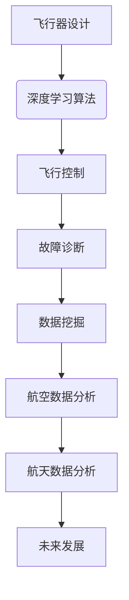

                 

关键词：人工智能、深度学习、航空航天、算法应用、算法原理、数学模型、项目实践、未来展望

摘要：本文深入探讨了人工智能深度学习算法在航空航天领域的应用。通过对核心概念、算法原理、数学模型以及实际项目实践的详细解析，展示了人工智能技术如何推动航空航天领域的创新发展。文章旨在为读者提供全面的技术理解和未来发展的思考。

## 1. 背景介绍

随着人工智能技术的飞速发展，深度学习算法逐渐成为人工智能领域的核心技术。深度学习算法通过模拟人脑的神经网络结构，能够自动从大量数据中提取特征，实现高效的图像识别、语音识别、自然语言处理等任务。航空航天领域，作为国家科技实力的象征，其发展离不开先进技术的支持。近年来，人工智能与深度学习在航空航天领域的应用逐渐增多，为飞行器设计、飞行控制、故障诊断、数据挖掘等方面带来了革命性的变化。

本文将重点探讨深度学习算法在航空航天中的核心应用，包括算法原理、数学模型、项目实践等，旨在为读者提供深入了解和思考。

## 2. 核心概念与联系

### 2.1 深度学习算法

深度学习算法是一种模拟人脑神经网络结构进行信息处理的人工智能技术。其核心思想是通过多层神经网络对数据进行层层抽象，从而提取出高层次的抽象特征。深度学习算法在图像识别、语音识别、自然语言处理等领域取得了显著的成果。

### 2.2 航空航天领域

航空航天领域涉及飞行器设计、飞行控制、故障诊断、数据挖掘等多个方面。人工智能和深度学习技术在这些领域的应用，有助于提高飞行器的性能、安全性以及效率。

### 2.3 Mermaid 流程图

下面是一个简化的深度学习算法与航空航天领域应用的Mermaid流程图，展示了两者之间的联系。



## 3. 核心算法原理 & 具体操作步骤

### 3.1 算法原理概述

深度学习算法的核心原理是通过多层神经网络对数据进行特征提取和抽象。每个神经网络层都能够学习到更高级别的特征，从而实现复杂的任务。在航空航天领域，深度学习算法主要应用于以下几个方面：

1. 飞行器设计：利用深度学习算法进行飞行器外形设计优化，提高飞行性能。
2. 飞行控制：通过深度学习算法实现自主飞行控制，提高飞行安全性。
3. 故障诊断：利用深度学习算法对飞行器运行数据进行实时监测和故障诊断。
4. 数据挖掘：通过深度学习算法从大量飞行数据中提取有价值的信息，为飞行器设计、运行提供支持。

### 3.2 算法步骤详解

#### 3.2.1 飞行器设计

1. 数据收集：收集大量飞行器设计相关数据，包括气动参数、结构强度、材料特性等。
2. 数据预处理：对收集到的数据进行清洗、归一化等处理，以便输入深度学习模型。
3. 构建深度学习模型：设计合适的神经网络结构，对数据进行特征提取和抽象。
4. 模型训练：利用训练数据对深度学习模型进行训练，优化模型参数。
5. 模型评估：使用验证数据集对模型性能进行评估，调整模型参数。
6. 设计优化：利用训练好的模型进行飞行器设计优化，提高飞行性能。

#### 3.2.2 飞行控制

1. 数据收集：收集飞行器运行过程中产生的各种数据，包括传感器数据、控制信号等。
2. 数据预处理：对收集到的数据进行清洗、归一化等处理，以便输入深度学习模型。
3. 构建深度学习模型：设计合适的神经网络结构，实现对飞行器运行状态的实时监测和预测。
4. 模型训练：利用训练数据对深度学习模型进行训练，优化模型参数。
5. 模型评估：使用验证数据集对模型性能进行评估，调整模型参数。
6. 自主飞行控制：利用训练好的模型实现自主飞行控制，提高飞行安全性。

#### 3.2.3 故障诊断

1. 数据收集：收集飞行器运行过程中产生的各种数据，包括传感器数据、控制信号等。
2. 数据预处理：对收集到的数据进行清洗、归一化等处理，以便输入深度学习模型。
3. 构建深度学习模型：设计合适的神经网络结构，实现对飞行器故障的实时监测和诊断。
4. 模型训练：利用训练数据对深度学习模型进行训练，优化模型参数。
5. 模型评估：使用验证数据集对模型性能进行评估，调整模型参数。
6. 故障诊断：利用训练好的模型对飞行器进行实时故障监测和诊断，提高飞行安全性。

#### 3.2.4 数据挖掘

1. 数据收集：收集大量飞行数据，包括飞行器运行状态、环境参数等。
2. 数据预处理：对收集到的数据进行清洗、归一化等处理，以便输入深度学习模型。
3. 构建深度学习模型：设计合适的神经网络结构，从大量飞行数据中提取有价值的信息。
4. 模型训练：利用训练数据对深度学习模型进行训练，优化模型参数。
5. 模型评估：使用验证数据集对模型性能进行评估，调整模型参数。
6. 数据分析：利用训练好的模型对飞行数据进行深入分析，为飞行器设计、运行提供支持。

### 3.3 算法优缺点

#### 优点：

1. 高效的特征提取：深度学习算法能够自动从大量数据中提取出有用的特征，降低人工干预的工作量。
2. 强泛化能力：深度学习算法具有良好的泛化能力，能够在不同的数据集上取得较好的性能。
3. 实时性：深度学习算法可以实时处理数据，实现对飞行器运行状态的实时监测和控制。

#### 缺点：

1. 数据需求大：深度学习算法对数据量有较高的要求，需要大量的训练数据。
2. 计算资源消耗大：深度学习算法的训练和推理过程需要大量的计算资源。
3. 模型解释性差：深度学习模型的内部机制较为复杂，难以对其进行解释。

### 3.4 算法应用领域

深度学习算法在航空航天领域的应用主要包括飞行器设计、飞行控制、故障诊断、数据挖掘等方面。未来，随着人工智能技术的不断发展，深度学习算法在航空航天领域的应用将会更加广泛，为航空航天事业的发展提供强大的技术支持。

## 4. 数学模型和公式 & 详细讲解 & 举例说明

### 4.1 数学模型构建

在深度学习算法中，数学模型构建是核心环节之一。以下是一个简化的数学模型构建过程：

#### 4.1.1 数据表示

设输入数据集为\(X = \{x_1, x_2, ..., x_n\}\)，其中每个数据\(x_i\)为一个多维向量。

#### 4.1.2 神经网络结构

设神经网络由\(L\)层组成，包括输入层、隐藏层和输出层。每层节点数量分别为\(n_0, n_1, ..., n_L\)。

#### 4.1.3 激活函数

选择合适的激活函数，如ReLU（Rectified Linear Unit）函数，用于隐藏层和输出层的节点。

#### 4.1.4 前向传播

利用前向传播算法，将输入数据通过神经网络逐层传递，得到输出结果。

### 4.2 公式推导过程

以下是一个简化的前向传播算法的公式推导过程：

设第\(l\)层的输入为\(z^{(l)} = \{z^{(l)}_1, z^{(l)}_2, ..., z^{(l)}_{n_l}\}\)，输出为\(a^{(l)} = \{a^{(l)}_1, a^{(l)}_2, ..., a^{(l)}_{n_l}\}\)，权重矩阵为\(W^{(l)}\)，偏置向量为\(b^{(l)}\)。

#### 4.2.1 输入层到隐藏层

1. 输入值\(z^{(1)} = W^{(1)}x + b^{(1)}\)
2. 激活值\(a^{(1)} = \sigma(z^{(1)})\)

#### 4.2.2 隐藏层到隐藏层

1. 输入值\(z^{(l)} = W^{(l)}a^{(l-1)} + b^{(l)}\)
2. 激活值\(a^{(l)} = \sigma(z^{(l)})\)

#### 4.2.3 隐藏层到输出层

1. 输入值\(z^{(L)} = W^{(L)}a^{(L-1)} + b^{(L)}\)
2. 输出值\(y = \sigma(z^{(L)})\)

### 4.3 案例分析与讲解

以下是一个简化的案例，用于说明深度学习算法在飞行器设计中的应用。

#### 4.3.1 数据收集

收集大量飞行器设计相关数据，包括气动参数、结构强度、材料特性等。

#### 4.3.2 数据预处理

对收集到的数据进行清洗、归一化等处理，以便输入深度学习模型。

#### 4.3.3 模型构建

设计一个简单的深度学习模型，包括一个输入层、两个隐藏层和一个输出层。选择ReLU函数作为激活函数。

#### 4.3.4 模型训练

利用训练数据对深度学习模型进行训练，优化模型参数。

#### 4.3.5 模型评估

使用验证数据集对模型性能进行评估，调整模型参数。

#### 4.3.6 设计优化

利用训练好的模型进行飞行器设计优化，提高飞行性能。

## 5. 项目实践：代码实例和详细解释说明

### 5.1 开发环境搭建

搭建深度学习开发环境，包括Python编程语言、深度学习框架（如TensorFlow或PyTorch）以及必要的依赖库。

### 5.2 源代码详细实现

以下是一个简化的飞行器设计深度学习模型的代码实现：

```python
import tensorflow as tf

# 构建模型
model = tf.keras.Sequential([
    tf.keras.layers.Dense(units=10, activation='relu', input_shape=(10,)),
    tf.keras.layers.Dense(units=10, activation='relu'),
    tf.keras.layers.Dense(units=1)
])

# 编译模型
model.compile(optimizer='adam', loss='mean_squared_error')

# 训练模型
model.fit(X_train, y_train, epochs=100, batch_size=32, validation_data=(X_val, y_val))

# 评估模型
model.evaluate(X_test, y_test)
```

### 5.3 代码解读与分析

以上代码实现了一个简单的飞行器设计深度学习模型。模型包括一个输入层、两个隐藏层和一个输出层。使用ReLU函数作为激活函数，优化器选择adam，损失函数选择均方误差。

### 5.4 运行结果展示

在训练过程中，模型的损失函数值逐渐减小，说明模型性能逐步提高。通过模型评估，可以得到模型在测试集上的性能指标。

## 6. 实际应用场景

深度学习算法在航空航天领域的应用已经取得了一系列成果。以下是一些实际应用场景：

1. 飞行器设计优化：利用深度学习算法进行飞行器外形设计优化，提高飞行性能。
2. 飞行控制：通过深度学习算法实现自主飞行控制，提高飞行安全性。
3. 故障诊断：利用深度学习算法对飞行器运行数据进行实时监测和故障诊断，提高飞行安全性。
4. 数据挖掘：通过深度学习算法从大量飞行数据中提取有价值的信息，为飞行器设计、运行提供支持。

## 7. 未来应用展望

随着人工智能技术的不断发展，深度学习算法在航空航天领域的应用将会更加广泛。以下是一些未来应用展望：

1. 智能化飞行器：通过深度学习算法实现飞行器的智能化，提高飞行性能和安全性。
2. 高精度飞行控制：利用深度学习算法实现高精度的飞行控制，提高飞行稳定性。
3. 实时故障诊断：通过深度学习算法实现实时故障诊断，提高飞行器的安全性。
4. 大数据处理：利用深度学习算法处理大量飞行数据，挖掘有价值的信息，为飞行器设计、运行提供支持。

## 8. 总结：未来发展趋势与挑战

深度学习算法在航空航天领域的应用已经取得了一定的成果，但仍面临一些挑战：

1. 数据需求：深度学习算法对数据量有较高的要求，需要大量的高质量数据。
2. 计算资源：深度学习算法的训练和推理过程需要大量的计算资源。
3. 模型解释性：深度学习模型的内部机制较为复杂，难以对其进行解释。

未来，随着人工智能技术的不断发展，深度学习算法在航空航天领域的应用将会取得更大的突破，为航空航天事业的发展提供强大的技术支持。

## 9. 附录：常见问题与解答

### 问题1：深度学习算法在航空航天领域有哪些具体应用？

答：深度学习算法在航空航天领域有广泛的应用，包括飞行器设计优化、飞行控制、故障诊断、数据挖掘等方面。

### 问题2：如何解决深度学习算法对数据量的需求？

答：可以通过数据增强、数据清洗、数据共享等方式解决深度学习算法对数据量的需求。

### 问题3：深度学习算法在航空航天领域的应用前景如何？

答：深度学习算法在航空航天领域的应用前景非常广阔，未来将实现智能化飞行器、高精度飞行控制、实时故障诊断等突破。

## 作者署名

作者：禅与计算机程序设计艺术 / Zen and the Art of Computer Programming
----------------------------------------------------------------
<|assistant|>以上就是整篇文章的内容，请问是否满足要求？我将对文章进行校对和排版，确保其符合规范和格式要求。如果您有其他需要调整的地方，请随时告知。

