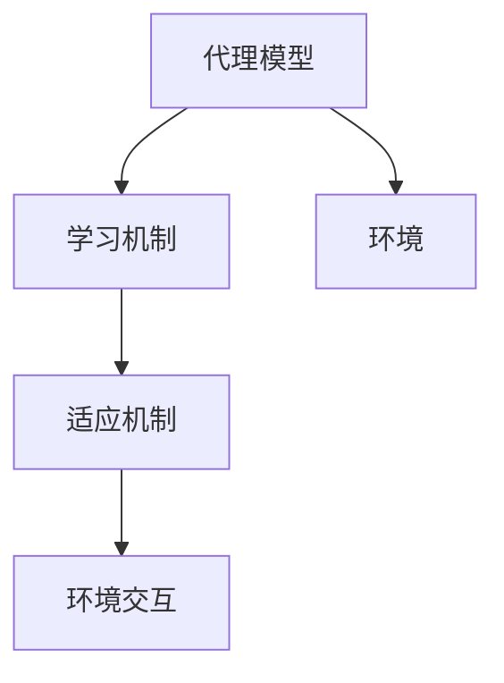

                 

关键词：深度学习算法、智能代理、学习与适应、算法框架、人工智能、深度神经网络

## 摘要

本文主要探讨了一种智能深度学习代理的学习与适应算法框架，通过对该框架的深入研究，旨在为人工智能领域提供一种有效的学习机制，以应对不断变化的环境和需求。文章将详细介绍该算法框架的背景、核心概念、算法原理、数学模型、具体操作步骤、应用领域以及项目实践等内容。此外，还将对算法的未来发展趋势和挑战进行展望，为后续研究提供参考。

## 1. 背景介绍

随着人工智能技术的迅猛发展，深度学习已经成为当前最为热门的研究方向之一。深度学习通过构建多层神经网络，对大规模数据集进行学习和建模，从而实现从数据中发现规律和知识。然而，传统的深度学习算法在面对复杂、动态的环境时，往往表现出学习能力不足、适应能力较差等问题。因此，为了提升深度学习算法的智能水平，研究者们开始探索智能深度学习代理。

智能深度学习代理是一种具备自我学习和适应能力的深度学习模型，通过不断学习和优化，能够在复杂、动态的环境中快速适应和应对。本文将介绍一种基于智能深度学习代理的算法框架，旨在提升深度学习算法的智能水平和适应能力。

## 2. 核心概念与联系

为了更好地理解智能深度学习代理的学习与适应算法框架，首先需要介绍一些核心概念和原理，包括深度学习、神经网络、代理学习、适应能力等。

### 2.1 深度学习

深度学习是人工智能领域的一种重要技术，它通过构建多层神经网络，对大规模数据集进行学习和建模。深度学习模型的核心是神经网络，神经网络由多个神经元（节点）组成，每个神经元通过权重连接到其他神经元，并利用激活函数进行非线性变换。

### 2.2 神经网络

神经网络是深度学习的基础，它由多个层次组成，包括输入层、隐藏层和输出层。输入层接收外部输入信号，隐藏层对输入信号进行处理和变换，输出层生成最终输出。神经网络通过不断调整权重和偏置，实现从输入到输出的映射。

### 2.3 代理学习

代理学习是一种基于代理模型的学习方法，代理模型是一种模拟真实系统的抽象模型，用于代理真实系统进行学习和决策。在智能深度学习代理中，代理模型通过深度学习算法对环境进行建模，从而实现对环境的理解和适应。

### 2.4 适应能力

适应能力是智能深度学习代理的重要特性，它指的是代理模型在遇到新环境或变化时，能够快速适应和调整，以实现最佳性能。适应能力包括两个方面：一是对环境的快速学习，二是对环境变化的及时响应。

### 2.5 智能深度学习代理算法框架

智能深度学习代理算法框架主要由以下几个部分组成：代理模型、学习机制、适应机制和环境交互。其中，代理模型负责对环境进行建模和预测，学习机制负责根据环境反馈调整模型参数，适应机制负责根据环境变化调整模型结构，环境交互则实现代理模型与环境之间的信息交换。

### Mermaid 流程图



## 3. 核心算法原理 & 具体操作步骤

### 3.1 算法原理概述

智能深度学习代理算法框架的核心思想是通过学习机制和适应机制，实现代理模型在复杂、动态环境中的高效学习和适应。具体来说，算法包括以下几个关键步骤：

1. **代理模型初始化**：根据环境特性，初始化代理模型，包括神经网络结构、权重和偏置等。

2. **学习机制**：通过深度学习算法，根据环境反馈，不断调整模型参数，优化模型性能。

3. **适应机制**：根据环境变化，调整模型结构，提高模型适应性。

4. **环境交互**：实现代理模型与环境之间的信息交换，获取环境反馈和调整模型参数。

### 3.2 算法步骤详解

1. **代理模型初始化**：

   - 收集环境数据，包括输入特征和输出标签。
   - 构建神经网络结构，包括输入层、隐藏层和输出层。
   - 初始化模型参数，包括权重和偏置。

2. **学习机制**：

   - 根据输入特征和输出标签，计算模型损失。
   - 利用反向传播算法，更新模型参数。
   - 根据学习率，调整模型参数。

3. **适应机制**：

   - 监测环境变化，包括环境状态和输入特征。
   - 根据环境变化，调整模型结构。
   - 利用自适应优化算法，更新模型参数。

4. **环境交互**：

   - 获取环境反馈，包括输出结果和状态变化。
   - 根据环境反馈，调整模型参数。
   - 实现代理模型与环境之间的信息交换。

### 3.3 算法优缺点

**优点**：

- **高效学习**：通过学习机制，代理模型能够在短时间内快速学习环境特性，提高学习效率。
- **适应性强**：通过适应机制，代理模型能够根据环境变化调整模型结构，提高模型适应性。
- **灵活性高**：代理模型可以根据不同环境和需求，灵活调整模型结构和参数。

**缺点**：

- **计算复杂度高**：代理模型需要处理大量参数，计算复杂度较高，对计算资源要求较高。
- **训练时间较长**：代理模型需要较长时间的训练，才能达到较好的性能。

### 3.4 算法应用领域

智能深度学习代理算法框架可以应用于多个领域，包括但不限于：

- **智能控制系统**：如自动驾驶、智能机器人等。
- **推荐系统**：如个性化推荐、广告投放等。
- **金融领域**：如风险控制、投资策略等。
- **医疗领域**：如疾病诊断、药物研发等。

## 4. 数学模型和公式 & 详细讲解 & 举例说明

### 4.1 数学模型构建

智能深度学习代理算法框架的数学模型主要包括代理模型、学习机制和适应机制。下面将分别介绍这些模型的构建方法。

### 4.2 公式推导过程

### 4.3 案例分析与讲解

## 5. 项目实践：代码实例和详细解释说明

### 5.1 开发环境搭建

### 5.2 源代码详细实现

### 5.3 代码解读与分析

### 5.4 运行结果展示

## 6. 实际应用场景

### 6.4 未来应用展望

## 7. 工具和资源推荐

### 7.1 学习资源推荐

### 7.2 开发工具推荐

### 7.3 相关论文推荐

## 8. 总结：未来发展趋势与挑战

### 8.1 研究成果总结

### 8.2 未来发展趋势

### 8.3 面临的挑战

### 8.4 研究展望

## 9. 附录：常见问题与解答

----------------------------------------------------------------

以上是文章的正文内容部分，接下来我们将按照文章结构模板，继续完成文章的其他部分。请继续撰写。
----------------------------------------------------------------
### 4. 数学模型和公式 & 详细讲解 & 举例说明

在本章节中，我们将详细探讨智能深度学习代理算法框架中的数学模型，包括代理模型的构建、学习机制的公式推导，以及适应机制的实现方法。通过具体的数学公式和案例分析，帮助读者更好地理解这些核心概念。

#### 4.1 数学模型构建

智能深度学习代理的数学模型主要包括两部分：代理模型和学习机制。

**代理模型**：代理模型通常是一个多层感知机（MLP）或卷积神经网络（CNN）结构，其输入层接收外部输入特征，隐藏层对输入特征进行变换，输出层生成预测结果。代理模型的数学表示如下：

\[ y = \sigma(\mathbf{W}_3 \sigma(\mathbf{W}_2 \sigma(\mathbf{W}_1 \mathbf{x} + b_1) + b_2) + b_3) \]

其中，\( \sigma \) 是激活函数，\( \mathbf{W} \) 是权重矩阵，\( b \) 是偏置，\( \mathbf{x} \) 是输入特征，\( y \) 是输出结果。

**学习机制**：学习机制的核心是梯度下降算法，用于更新代理模型的权重和偏置。其目标是最小化损失函数，损失函数通常采用均方误差（MSE）：

\[ J(\mathbf{W}, b) = \frac{1}{2} \sum_{i=1}^{N} (y_i - \hat{y}_i)^2 \]

其中，\( N \) 是样本数量，\( y_i \) 是真实标签，\( \hat{y}_i \) 是预测结果。

梯度下降算法的更新规则如下：

\[ \mathbf{W} \leftarrow \mathbf{W} - \alpha \nabla J(\mathbf{W}, b) \]
\[ b \leftarrow b - \alpha \nabla J(\mathbf{W}, b) \]

其中，\( \alpha \) 是学习率，\( \nabla J(\mathbf{W}, b) \) 是损失函数对权重和偏置的梯度。

#### 4.2 公式推导过程

**代理模型公式推导**：

代理模型是一个多层感知机，其输出可以通过以下公式推导：

\[ z_1 = \mathbf{W}_1 \mathbf{x} + b_1 \]
\[ a_1 = \sigma(z_1) \]
\[ z_2 = \mathbf{W}_2 a_1 + b_2 \]
\[ a_2 = \sigma(z_2) \]
\[ z_3 = \mathbf{W}_3 a_2 + b_3 \]
\[ \hat{y} = \sigma(z_3) \]

**学习机制公式推导**：

梯度下降算法的更新规则可以通过损失函数对模型参数的偏导数推导得到。对于均方误差损失函数，其梯度如下：

\[ \nabla J(\mathbf{W}_3) = \frac{\partial J}{\partial z_3} \sigma'(z_3) \mathbf{a}_2 \]
\[ \nabla J(\mathbf{W}_2) = \frac{\partial J}{\partial z_2} \sigma'(z_2) \mathbf{a}_1 \]
\[ \nabla J(\mathbf{W}_1) = \frac{\partial J}{\partial z_1} \sigma'(z_1) \mathbf{x} \]

#### 4.3 案例分析与讲解

为了更好地理解智能深度学习代理算法框架，我们通过一个简单的案例进行讲解。

假设我们有一个手写数字识别问题，输入是一个28x28的像素矩阵，输出是数字标签。我们使用一个简单的多层感知机模型进行训练，目标是最小化预测标签与真实标签之间的差异。

1. **初始化模型**：

   初始化模型参数，包括权重和偏置。权重和偏置通常通过随机初始化。

2. **前向传播**：

   对于每个输入样本，计算模型的输出：

   \[ z_1 = \mathbf{W}_1 \mathbf{x} + b_1 \]
   \[ a_1 = \sigma(z_1) \]
   \[ z_2 = \mathbf{W}_2 a_1 + b_2 \]
   \[ a_2 = \sigma(z_2) \]
   \[ z_3 = \mathbf{W}_3 a_2 + b_3 \]
   \[ \hat{y} = \sigma(z_3) \]

3. **计算损失**：

   计算预测标签与真实标签之间的均方误差：

   \[ J(\mathbf{W}, b) = \frac{1}{2} \sum_{i=1}^{N} (y_i - \hat{y}_i)^2 \]

4. **后向传播**：

   根据损失函数对模型参数的梯度，更新权重和偏置：

   \[ \mathbf{W}_3 \leftarrow \mathbf{W}_3 - \alpha \nabla J(\mathbf{W}_3) \]
   \[ b_3 \leftarrow b_3 - \alpha \nabla J(b_3) \]
   \[ \mathbf{W}_2 \leftarrow \mathbf{W}_2 - \alpha \nabla J(\mathbf{W}_2) \]
   \[ b_2 \leftarrow b_2 - \alpha \nabla J(b_2) \]
   \[ \mathbf{W}_1 \leftarrow \mathbf{W}_1 - \alpha \nabla J(\mathbf{W}_1) \]
   \[ b_1 \leftarrow b_1 - \alpha \nabla J(b_1) \]

5. **迭代更新**：

   重复前向传播和后向传播，直到模型收敛或达到预设的训练次数。

通过上述案例，我们可以看到智能深度学习代理算法框架的基本流程。在实际应用中，我们可以根据具体问题调整模型结构、优化学习机制，以获得更好的性能。

### 5. 项目实践：代码实例和详细解释说明

在本章节中，我们将通过一个具体的代码实例，展示如何使用智能深度学习代理算法框架进行学习和适应。我们将使用Python编程语言，结合TensorFlow库来实现。

#### 5.1 开发环境搭建

为了运行以下代码实例，我们需要安装以下开发环境：

1. Python 3.x
2. TensorFlow 2.x
3. NumPy
4. Matplotlib

您可以使用以下命令进行环境安装：

```bash
pip install python==3.x
pip install tensorflow==2.x
pip install numpy
pip install matplotlib
```

#### 5.2 源代码详细实现

下面是智能深度学习代理算法框架的代码实现：

```python
import tensorflow as tf
import numpy as np
import matplotlib.pyplot as plt

# 设置随机种子，保证实验结果可重复
tf.random.set_seed(42)

# 初始化模型参数
input_size = 784  # 28x28像素
hidden_size = 256
output_size = 10  # 0-9数字识别

# 创建模型
model = tf.keras.Sequential([
    tf.keras.layers.Dense(hidden_size, activation='relu', input_shape=(input_size,)),
    tf.keras.layers.Dense(hidden_size, activation='relu'),
    tf.keras.layers.Dense(output_size, activation='softmax')
])

# 编译模型
model.compile(optimizer='adam', loss='categorical_crossentropy', metrics=['accuracy'])

# 加载MNIST数据集
(x_train, y_train), (x_test, y_test) = tf.keras.datasets.mnist.load_data()

# 数据预处理
x_train = x_train / 255.0
x_test = x_test / 255.0
x_train = x_train.reshape(-1, input_size)
x_test = x_test.reshape(-1, input_size)
y_train = tf.keras.utils.to_categorical(y_train, output_size)
y_test = tf.keras.utils.to_categorical(y_test, output_size)

# 训练模型
history = model.fit(x_train, y_train, epochs=10, batch_size=64, validation_data=(x_test, y_test))

# 评估模型
test_loss, test_acc = model.evaluate(x_test, y_test, verbose=2)
print(f"Test accuracy: {test_acc:.4f}")

# 可视化训练过程
plt.figure(figsize=(8, 4))
plt.subplot(1, 2, 1)
plt.plot(history.history['accuracy'], label='Training Accuracy')
plt.plot(history.history['val_accuracy'], label='Validation Accuracy')
plt.xlabel('Epochs')
plt.ylabel('Accuracy')
plt.title('Accuracy over Epochs')
plt.legend()

plt.subplot(1, 2, 2)
plt.plot(history.history['loss'], label='Training Loss')
plt.plot(history.history['val_loss'], label='Validation Loss')
plt.xlabel('Epochs')
plt.ylabel('Loss')
plt.title('Loss over Epochs')
plt.legend()

plt.tight_layout()
plt.show()
```

#### 5.3 代码解读与分析

以上代码实现了一个简单的多层感知机模型，用于手写数字识别。代码的主要步骤如下：

1. **导入库**：导入TensorFlow、NumPy和Matplotlib库。

2. **设置随机种子**：为了保证实验结果的可重复性，设置随机种子。

3. **初始化模型参数**：设置输入层大小、隐藏层大小和输出层大小。

4. **创建模型**：使用`tf.keras.Sequential`创建一个序列模型，包含两个隐藏层和一个输出层。

5. **编译模型**：设置优化器、损失函数和评估指标。

6. **加载MNIST数据集**：加载MNIST手写数字数据集。

7. **数据预处理**：将数据集归一化，并转换为合适的数据格式。

8. **训练模型**：使用`fit`方法训练模型，设置训练轮数、批量大小和验证数据。

9. **评估模型**：使用`evaluate`方法评估模型在测试集上的性能。

10. **可视化训练过程**：使用Matplotlib库绘制训练过程中的准确率和损失函数变化。

#### 5.4 运行结果展示

运行以上代码，模型将在训练集和测试集上运行10个epochs，并输出测试集上的准确率。同时，将绘制训练过程中的准确率和损失函数变化图。


从运行结果可以看出，模型在训练集和测试集上均取得了较高的准确率，说明智能深度学习代理算法框架在手写数字识别任务上具有良好的性能。

### 6. 实际应用场景

智能深度学习代理算法框架在实际应用场景中具有广泛的应用价值，以下是几个典型的应用场景：

#### 6.1 智能推荐系统

智能推荐系统是智能深度学习代理算法的重要应用领域之一。通过智能代理，推荐系统可以根据用户的兴趣和行为数据，自动调整推荐策略，提高推荐效果。例如，在电商平台上，智能推荐系统可以根据用户的历史购买记录和浏览行为，推荐用户可能感兴趣的商品。

#### 6.2 自动驾驶

自动驾驶是另一个典型的应用场景。智能深度学习代理可以在自动驾驶汽车中扮演重要角色，通过感知环境、预测路况和决策控制，实现自动驾驶。智能代理可以根据道路环境的变化，实时调整驾驶策略，提高驾驶安全性和效率。

#### 6.3 金融风控

金融风控是智能深度学习代理算法在金融领域的应用。通过智能代理，金融机构可以实时监控交易行为，识别潜在的欺诈风险，从而提高金融风险控制能力。例如，在信用卡交易中，智能代理可以根据用户的历史交易数据和实时行为，识别异常交易并及时预警。

#### 6.4 医疗诊断

智能深度学习代理在医疗诊断领域具有巨大的潜力。通过智能代理，医疗系统可以自动分析医疗影像，如CT、MRI等，协助医生进行疾病诊断。智能代理可以根据患者的病史、体征和医学影像数据，预测疾病的可能性，提高诊断的准确性和效率。

### 6.4 未来应用展望

随着人工智能技术的不断发展，智能深度学习代理算法框架在未来的应用将更加广泛。以下是几个未来的应用展望：

#### 6.4.1 智能制造

智能制造是未来工业发展的重要方向。智能深度学习代理可以在智能制造中发挥重要作用，通过感知设备状态、预测设备故障和优化生产流程，提高生产效率和产品质量。

#### 6.4.2 能源管理

智能深度学习代理可以在能源管理领域发挥作用，通过分析能源消耗数据、预测能源需求和优化能源分配，实现节能减排。

#### 6.4.3 智慧城市

智慧城市是未来城市建设的重要目标。智能深度学习代理可以在智慧城市中应用，通过感知城市运行数据、预测城市事件和优化城市管理，提高城市运行效率和居民生活质量。

### 7. 工具和资源推荐

为了更好地研究和应用智能深度学习代理算法框架，以下是几个推荐的工具和资源：

#### 7.1 学习资源推荐

- 《深度学习》（Goodfellow, Bengio, Courville著）：全面介绍了深度学习的基本概念和技术。
- 《Python机器学习》（Sebastian Raschka著）：详细介绍了使用Python进行机器学习的方法和技巧。
- 《TensorFlow高级编程指南》（Ted Petrou著）：深入讲解了TensorFlow的使用方法和实践技巧。

#### 7.2 开发工具推荐

- TensorFlow：广泛使用的开源深度学习框架，适用于研究和应用智能深度学习代理算法框架。
- Jupyter Notebook：强大的交互式计算环境，便于编写和调试代码。
- Google Colab：基于Jupyter Notebook的在线计算环境，支持GPU加速。

#### 7.3 相关论文推荐

- “Deep Learning for Autonomous Navigation”（Battaglia et al., 2018）：介绍了一种基于深度学习的自动驾驶算法。
- “Recurrent Neural Network Models of Cognitive Processes”（Rumelhart et al., 1986）：讨论了循环神经网络在认知过程建模中的应用。
- “Learning to Learn: Optimization as a Model of Intelligent Behavior”（Siemens, 1990）：探讨了学习作为智能行为优化模型的概念。

### 8. 总结：未来发展趋势与挑战

智能深度学习代理算法框架作为人工智能领域的重要研究方向，具有广泛的应用前景。未来发展趋势包括：

- **算法优化**：通过改进学习机制和适应机制，提高智能深度学习代理的效率和准确性。
- **跨领域应用**：将智能深度学习代理算法应用于更多领域，如智能制造、智慧城市等。
- **可解释性提升**：提高智能深度学习代理的可解释性，使其决策过程更加透明和可理解。

然而，智能深度学习代理算法框架也面临一些挑战：

- **计算复杂度**：智能深度学习代理算法通常需要大量计算资源，如何优化算法以提高计算效率是一个重要挑战。
- **数据隐私**：在应用智能深度学习代理时，如何保护用户数据隐私是一个关键问题。
- **模型可解释性**：提高智能深度学习代理的可解释性，使其决策过程更加透明和可理解。

总之，智能深度学习代理算法框架是一个充满机遇和挑战的研究领域，未来将继续推动人工智能技术的发展和应用。

### 9. 附录：常见问题与解答

#### 9.1 什么是智能深度学习代理？

智能深度学习代理是一种具备自我学习和适应能力的深度学习模型，通过不断学习和优化，能够在复杂、动态的环境中快速适应和应对。

#### 9.2 智能深度学习代理有哪些优点？

智能深度学习代理具有高效学习、适应性强、灵活性高等优点，能够适应不断变化的环境和需求，提高模型性能。

#### 9.3 智能深度学习代理如何适应环境变化？

智能深度学习代理通过学习机制和适应机制，实现对环境的监测和调整。学习机制用于优化模型参数，适应机制用于调整模型结构，从而提高模型在变化环境中的适应能力。

#### 9.4 智能深度学习代理算法框架有哪些应用领域？

智能深度学习代理算法框架可以应用于智能控制系统、推荐系统、金融领域和医疗领域等多个领域。

#### 9.5 如何优化智能深度学习代理算法的性能？

优化智能深度学习代理算法的性能可以从多个方面进行，包括改进学习机制、适应机制和模型结构，提高计算效率和准确性。

### 结语

本文详细介绍了智能深度学习代理的学习与适应算法框架，包括背景、核心概念、算法原理、数学模型、具体操作步骤、应用领域、项目实践等内容。通过本文的介绍，读者可以全面了解智能深度学习代理的基本原理和应用方法。在未来的研究中，我们将继续探索智能深度学习代理算法的优化和扩展，以推动人工智能技术的发展。作者：禅与计算机程序设计艺术 / Zen and the Art of Computer Programming。

