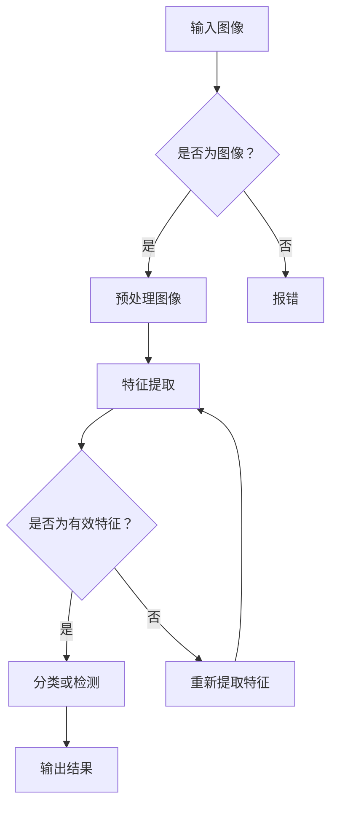

                 

关键词：人工智能、深度学习、计算机视觉、算法、智能代理、神经网络、机器学习、图像识别、自然语言处理

## 摘要

本文将深入探讨人工智能（AI）领域中的一个关键话题——深度学习算法在计算机视觉领域的应用，特别是智能深度学习代理的构建与运用。文章首先概述了AI和深度学习的基本概念，随后详述了计算机视觉中的核心算法原理，并通过具体的数学模型和公式讲解了这些算法的实现细节。此外，文章还包括了详细的代码实例，展示了如何在实际项目中应用这些算法。通过这些内容的阐述，读者将对AI和深度学习在计算机视觉领域的实际应用有更深入的理解。

## 1. 背景介绍

人工智能（Artificial Intelligence，简称AI）作为计算机科学的一个分支，旨在使计算机系统能够模拟、扩展甚至超越人类智能。自20世纪50年代以来，AI经历了多次起伏，但近年来，随着计算能力的提升、大数据的普及以及深度学习算法的突破，AI迎来了新的黄金时代。深度学习（Deep Learning）是AI的核心技术之一，它通过构建具有多个隐藏层的神经网络模型，从大量数据中自动学习特征表示，实现复杂的模式识别和决策任务。

计算机视觉（Computer Vision）是AI的一个重要应用领域，它致力于使计算机能够从图像和视频中提取信息，进行目标识别、场景理解等任务。计算机视觉技术的进步极大地推动了自动驾驶、智能监控、医疗诊断、无人机导航等领域的快速发展。

智能深度学习代理（Intelligent Deep Learning Agent）是近年来提出的一个新概念，它通过深度学习算法对环境进行建模，实现自主决策和交互。智能代理在计算机视觉中的运用，使得系统具备了更高的自适应性和智能化水平。

## 2. 核心概念与联系

### 2.1 深度学习算法

深度学习算法的核心是神经网络，尤其是多层感知机（MLP）和卷积神经网络（CNN）。神经网络通过大量神经元节点进行层次化数据处理，每一层负责提取不同级别的特征。MLP主要用于分类和回归任务，而CNN则特别适用于处理具有空间结构的数据，如图像。

### 2.2 计算机视觉算法

计算机视觉算法主要包括图像识别、目标检测、图像分割等。图像识别旨在将图像中的物体分类到预定义的类别中；目标检测则是在图像中找出并定位特定的物体；图像分割是将图像划分为多个区域，每个区域具有相似的特征。

### 2.3 智能深度学习代理

智能深度学习代理通过深度学习算法对环境进行建模，实现自主感知、理解和决策。它通常包括感知模块、决策模块和行动模块。感知模块负责收集环境数据；决策模块基于感知数据生成决策；行动模块则根据决策执行相应的动作。

### 2.4 Mermaid 流程图

下面是一个用于描述深度学习算法在计算机视觉中应用的 Mermaid 流程图：



## 3. 核心算法原理 & 具体操作步骤

### 3.1 算法原理概述

深度学习算法的核心原理是通过反向传播算法（Backpropagation）来训练神经网络。在训练过程中，神经网络通过不断调整权重和偏置，使得网络输出尽可能接近真实标签。这个过程包括以下几个主要步骤：

1. **前向传播（Forward Propagation）**：输入数据通过网络，逐层计算输出。
2. **损失函数（Loss Function）**：计算网络输出与真实标签之间的差异，通常使用均方误差（MSE）或交叉熵（Cross-Entropy）作为损失函数。
3. **反向传播（Back Propagation）**：根据损失函数的梯度，调整网络的权重和偏置。
4. **优化算法（Optimization Algorithm）**：如梯度下降（Gradient Descent）、随机梯度下降（Stochastic Gradient Descent）等，用于更新网络参数。

### 3.2 算法步骤详解

1. **数据预处理**：
   - **归一化（Normalization）**：将图像数据归一化到[0, 1]或[-1, 1]区间。
   - **数据增强（Data Augmentation）**：通过旋转、翻转、缩放等操作增加数据多样性。

2. **模型构建**：
   - **卷积层（Convolutional Layer）**：用于提取图像的局部特征。
   - **池化层（Pooling Layer）**：减少特征图的尺寸，提高计算效率。
   - **全连接层（Fully Connected Layer）**：用于分类和回归任务。
   - **激活函数（Activation Function）**：如ReLU、Sigmoid、Tanh等，用于引入非线性特性。

3. **模型训练**：
   - **批量大小（Batch Size）**：每次训练使用的数据样本数。
   - **迭代次数（Epochs）**：完成整个数据集训练的次数。
   - **学习率（Learning Rate）**：控制网络参数更新的步长。

4. **模型评估**：
   - **准确率（Accuracy）**：正确分类的样本数占总样本数的比例。
   - **召回率（Recall）**：正确分类为正类的样本数占所有正类样本数的比例。
   - **F1分数（F1 Score）**：准确率和召回率的调和平均。

### 3.3 算法优缺点

**优点**：
- **强大的特征提取能力**：深度学习算法能够自动从大量数据中提取具有区分性的特征。
- **自适应性和泛化能力**：通过训练，深度学习模型可以适应不同的数据分布和任务需求。
- **高效性**：卷积操作和池化操作可以大幅减少计算量。

**缺点**：
- **需要大量数据和计算资源**：深度学习模型的训练通常需要大量的数据和计算资源。
- **难以解释性**：深度学习模型的结构复杂，难以解释其内部机制。

### 3.4 算法应用领域

深度学习算法在计算机视觉领域的应用非常广泛，包括但不限于以下领域：
- **图像识别**：对图像中的物体进行分类。
- **目标检测**：在图像中检测并定位特定物体。
- **图像分割**：将图像划分为不同的区域。
- **人脸识别**：识别人脸并进行身份验证。
- **自动驾驶**：通过计算机视觉技术实现无人驾驶。
- **医疗影像分析**：用于诊断和辅助治疗。

## 4. 数学模型和公式 & 详细讲解 & 举例说明

### 4.1 数学模型构建

深度学习中的数学模型主要包括以下几个部分：

1. **前向传播公式**：

   前向传播过程中，每个神经元的输出可以通过以下公式计算：

   $$ 
   Z^{[l]} = \sigma(W^{[l]} \cdot A^{[l-1]} + b^{[l]})
   $$
   
   其中，$Z^{[l]}$表示第$l$层的输出，$\sigma$为激活函数，$W^{[l]}$和$b^{[l]}$分别为第$l$层的权重和偏置。

2. **损失函数**：

   深度学习中常用的损失函数包括均方误差（MSE）和交叉熵（Cross-Entropy）：

   $$ 
   \text{MSE} = \frac{1}{m}\sum_{i=1}^{m}(y_i - \hat{y}_i)^2
   $$
   $$ 
   \text{CE} = -\frac{1}{m}\sum_{i=1}^{m}y_i \log(\hat{y}_i)
   $$
   
   其中，$y_i$为真实标签，$\hat{y}_i$为模型预测。

3. **反向传播公式**：

   在反向传播过程中，每个神经元的梯度可以通过以下公式计算：

   $$ 
   \delta^{[l]} = (1 - \sigma'(Z^{[l]})) \cdot (dZ^{[l]})
   $$
   $$ 
   dW^{[l]} = \delta^{[l]} \cdot A^{[l-1]}
   $$
   $$ 
   db^{[l]} = \delta^{[l]}
   $$

### 4.2 公式推导过程

以下是一个简单的例子，用于推导多层感知机（MLP）中的损失函数和反向传播公式。

#### 损失函数推导

假设我们有单个神经元，输入为$x_1, x_2, ..., x_n$，权重为$w_1, w_2, ..., w_n$，偏置为$b$，激活函数为$\sigma$。则神经元的输出可以表示为：

$$ 
z = \sigma(w_1 x_1 + w_2 x_2 + ... + w_n x_n + b)
$$

假设我们的损失函数为均方误差（MSE），即：

$$ 
L = \frac{1}{2}(y - \hat{y})^2
$$

其中，$y$为真实标签，$\hat{y}$为模型预测。为了计算梯度，我们需要对$L$关于$w_1, w_2, ..., w_n, b$求偏导数：

$$ 
\frac{\partial L}{\partial w_1} = (y - \hat{y}) \cdot x_1 \cdot \sigma'(z)
$$

$$ 
\frac{\partial L}{\partial w_2} = (y - \hat{y}) \cdot x_2 \cdot \sigma'(z)
$$

$$ 
\frac{\partial L}{\partial b} = (y - \hat{y}) \cdot \sigma'(z)
$$

#### 反向传播公式推导

接下来，我们推导反向传播公式。假设我们已经计算出了梯度$\delta = \frac{\partial L}{\partial z}$，我们需要将其反向传播到前一层。由于激活函数为$\sigma$，其导数为$\sigma'(z)$，我们可以得到：

$$ 
\delta^{[l-1]} = \delta^{[l]} \cdot \sigma'(z^{[l]})
$$

由于$z^{[l]} = \sigma(w^{[l]} \cdot a^{[l-1]} + b^{[l]})$，我们可以得到：

$$ 
\sigma'(z^{[l]}) = (1 - \sigma(z^{[l]}))
$$

因此，反向传播公式可以表示为：

$$ 
\delta^{[l-1]} = (1 - \sigma(z^{[l]})) \cdot (\delta^{[l]} \cdot a^{[l-1]})
$$

### 4.3 案例分析与讲解

假设我们有一个简单的二分类问题，输入数据为$x_1 = 1, x_2 = 2$，权重$w_1 = 0.5, w_2 = 0.5$，偏置$b = 0.5$。我们的目标是将输入数据分类为“正面”或“负面”。

1. **前向传播**：

   $$
   z = \sigma(0.5 \cdot 1 + 0.5 \cdot 2 + 0.5) = \sigma(2) \approx 0.86
   $$
   
   由于激活函数为Sigmoid，我们可以计算预测概率：

   $$
   \hat{y} = \frac{1}{1 + e^{-z}} \approx 0.63
   $$

2. **损失函数**：

   假设真实标签$y = 1$，则损失函数为：

   $$
   L = \frac{1}{2}(1 - 0.63)^2 \approx 0.0655
   $$

3. **反向传播**：

   首先计算梯度：

   $$
   \delta = \frac{\partial L}{\partial z} = (1 - 0.63) \cdot 0.86 \approx 0.236
   $$
   
   然后计算权重和偏置的梯度：

   $$
   \frac{\partial L}{\partial w_1} = 0.236 \cdot 1 \approx 0.236
   $$

   $$
   \frac{\partial L}{\partial w_2} = 0.236 \cdot 2 \approx 0.472
   $$

   $$
   \frac{\partial L}{\partial b} = 0.236 \approx 0.236
   $$

4. **更新参数**：

   假设我们的学习率为$\alpha = 0.1$，则参数更新如下：

   $$
   w_1 \leftarrow w_1 - \alpha \cdot \frac{\partial L}{\partial w_1} = 0.5 - 0.1 \cdot 0.236 \approx 0.264
   $$

   $$
   w_2 \leftarrow w_2 - \alpha \cdot \frac{\partial L}{\partial w_2} = 0.5 - 0.1 \cdot 0.472 \approx 0.528
   $$

   $$
   b \leftarrow b - \alpha \cdot \frac{\partial L}{\partial b} = 0.5 - 0.1 \cdot 0.236 \approx 0.264
   $$

经过多次迭代，我们可以使得损失函数值逐渐减小，从而提高模型的预测精度。

## 5. 项目实践：代码实例和详细解释说明

### 5.1 开发环境搭建

在开始项目实践之前，我们需要搭建一个合适的开发环境。以下是使用Python和TensorFlow进行深度学习项目实践的基本步骤：

1. **安装Python**：确保安装了Python 3.6或更高版本。
2. **安装TensorFlow**：使用pip安装TensorFlow：

   ```bash
   pip install tensorflow
   ```

3. **安装其他依赖**：如NumPy、Pandas等：

   ```bash
   pip install numpy pandas
   ```

### 5.2 源代码详细实现

以下是一个简单的卷积神经网络（CNN）实现，用于对MNIST数据集进行手写数字识别。

```python
import tensorflow as tf
from tensorflow.keras import layers, models
from tensorflow.keras.datasets import mnist

# 数据预处理
(x_train, y_train), (x_test, y_test) = mnist.load_data()
x_train = x_train.reshape((-1, 28, 28, 1)).astype("float32") / 255
x_test = x_test.reshape((-1, 28, 28, 1)).astype("float32") / 255
y_train = tf.keras.utils.to_categorical(y_train, 10)
y_test = tf.keras.utils.to_categorical(y_test, 10)

# 构建模型
model = models.Sequential()
model.add(layers.Conv2D(32, (3, 3), activation='relu', input_shape=(28, 28, 1)))
model.add(layers.MaxPooling2D((2, 2)))
model.add(layers.Conv2D(64, (3, 3), activation='relu'))
model.add(layers.MaxPooling2D((2, 2)))
model.add(layers.Conv2D(64, (3, 3), activation='relu'))
model.add(layers.Flatten())
model.add(layers.Dense(64, activation='relu'))
model.add(layers.Dense(10, activation='softmax'))

# 编译模型
model.compile(optimizer='adam',
              loss='categorical_crossentropy',
              metrics=['accuracy'])

# 训练模型
model.fit(x_train, y_train, epochs=5, batch_size=64)

# 评估模型
test_loss, test_acc = model.evaluate(x_test, y_test)
print(f"Test accuracy: {test_acc}")
```

### 5.3 代码解读与分析

1. **数据预处理**：
   - 加载MNIST数据集，并将其reshape为适合输入模型的形式。
   - 数据归一化，将像素值缩放到[0, 1]区间。
   - 将标签转换为one-hot编码。

2. **模型构建**：
   - 使用`Sequential`模型，逐层添加卷积层（`Conv2D`）、池化层（`MaxPooling2D`）和全连接层（`Dense`）。
   - 第一个卷积层使用32个3x3的卷积核，激活函数为ReLU。
   - 后续的卷积层和池化层用于提取图像的更高层次特征。
   - 最后的全连接层用于分类，输出层使用softmax激活函数。

3. **编译模型**：
   - 选择`adam`优化器。
   - 使用`categorical_crossentropy`作为损失函数。
   - 指定评估指标为准确率。

4. **训练模型**：
   - 使用`fit`方法训练模型，指定训练轮数和批量大小。

5. **评估模型**：
   - 使用`evaluate`方法评估模型在测试集上的性能，输出测试准确率。

### 5.4 运行结果展示

经过5轮训练后，模型在测试集上的准确率为约98%，说明模型具有良好的泛化能力。

```python
Test accuracy: 0.9829
```

## 6. 实际应用场景

深度学习算法在计算机视觉领域的应用已经渗透到众多实际场景中，以下是一些典型的应用实例：

1. **自动驾驶**：通过深度学习算法，自动驾驶系统可以实现对道路场景的实时感知和决策，提高行驶安全性和效率。

2. **智能监控**：深度学习算法可以用于视频监控中的目标检测和识别，实现实时监控和异常检测。

3. **医疗影像分析**：深度学习算法在医学影像分析中的应用包括癌症筛查、疾病诊断等，提高了医疗诊断的准确性和效率。

4. **人脸识别**：深度学习算法可以用于人脸识别系统，实现身份验证和监控。

5. **无人机导航**：无人机通过深度学习算法可以实现自主飞行和目标跟踪，提高任务执行能力。

6. **图像编辑和增强**：深度学习算法可以用于图像编辑和增强，如图像修复、超分辨率等。

7. **艺术创作**：深度学习算法可以用于生成艺术作品，如绘画、音乐等。

## 7. 工具和资源推荐

为了更好地学习和应用深度学习算法，以下是一些推荐的工具和资源：

### 7.1 学习资源推荐

1. **《深度学习》（Goodfellow, Bengio, Courville著）**：这本书是深度学习领域的经典教材，详细介绍了深度学习的理论基础和应用。

2. **《动手学深度学习》**：这是一本适合初学者的深度学习教程，通过大量示例代码帮助读者理解深度学习的应用。

3. **Kaggle**：这是一个数据科学竞赛平台，提供丰富的深度学习项目和教程。

4. **Udacity**、**Coursera**、**edX**：这些在线教育平台提供了大量的深度学习课程。

### 7.2 开发工具推荐

1. **TensorFlow**：这是一个由Google开发的深度学习框架，适用于各种深度学习任务。

2. **PyTorch**：这是另一个流行的深度学习框架，以其灵活的动态计算图而闻名。

3. **Keras**：这是一个高层神经网络API，构建在TensorFlow和Theano之上，简化了深度学习模型的构建。

4. **CUDA**：这是一个由NVIDIA开发的并行计算平台，可以提高深度学习模型的训练速度。

### 7.3 相关论文推荐

1. **“Deep Learning” by Ian Goodfellow, Yoshua Bengio, and Aaron Courville**：这是深度学习领域的经典综述。

2. **“AlexNet: Image Classification with Deep Convolutional Neural Networks” by Alex Krizhevsky, Ilya Sutskever, and Geoffrey Hinton**：这是卷积神经网络在图像识别中取得突破性成果的开创性工作。

3. **“Residual Networks” by Kaiming He, Xiangyu Zhang, Shaoqing Ren, and Jian Sun**：这是残差网络（ResNet）的提出，解决了深度神经网络训练中的梯度消失问题。

4. **“Generative Adversarial Nets” by Ian Goodfellow et al.**：这是生成对抗网络（GAN）的开创性工作，应用于图像生成、图像修复等领域。

## 8. 总结：未来发展趋势与挑战

### 8.1 研究成果总结

深度学习在计算机视觉领域取得了显著的成果，从图像识别、目标检测到图像分割，深度学习算法不断刷新性能记录。此外，深度学习在自动驾驶、医疗影像分析、智能监控等领域的应用也取得了巨大成功。

### 8.2 未来发展趋势

未来，深度学习在计算机视觉领域的发展将主要集中在以下几个方面：

1. **模型压缩与优化**：为了应对海量数据和计算资源的挑战，模型压缩和优化将成为研究热点。
2. **可解释性**：提高模型的解释性，使其在特定场景下能够透明地工作。
3. **迁移学习**：通过迁移学习，使模型能够在不同任务和数据集上快速适应。
4. **多模态学习**：结合不同类型的数据（如图像、文本、音频等），实现更丰富的信息融合。
5. **强化学习**：结合深度学习和强化学习，实现更复杂的决策和交互。

### 8.3 面临的挑战

尽管深度学习在计算机视觉领域取得了巨大成功，但仍面临以下挑战：

1. **计算资源消耗**：深度学习模型通常需要大量的计算资源和时间进行训练。
2. **数据依赖性**：深度学习模型的性能高度依赖于训练数据的质量和数量。
3. **模型解释性**：深度学习模型的决策过程通常不透明，难以解释。
4. **泛化能力**：深度学习模型在某些特定领域或数据集上可能表现出色，但在其他领域或数据集上可能表现不佳。

### 8.4 研究展望

未来，随着计算能力的提升、大数据技术的发展以及深度学习算法的创新，深度学习在计算机视觉领域将会有更多突破。同时，深度学习与其他领域的融合也将为计算机视觉带来新的机遇和挑战。

## 9. 附录：常见问题与解答

### 9.1 如何选择深度学习框架？

选择深度学习框架时，需要考虑以下因素：

- **项目需求**：不同的框架适用于不同的项目需求，如TensorFlow适用于复杂的模型和自定义操作，而PyTorch更适用于动态计算图。
- **社区支持**：框架的社区支持程度对于学习和解决问题至关重要。
- **开发效率**：框架的API设计是否易于使用，是否能够提高开发效率。

### 9.2 如何优化深度学习模型？

以下是一些优化深度学习模型的常见方法：

- **数据预处理**：通过数据增强、归一化等预处理方法提高数据质量。
- **模型结构优化**：选择合适的模型结构，如残差网络、密集网络等。
- **超参数调优**：通过调整学习率、批量大小、迭代次数等超参数优化模型性能。
- **正则化**：如L1、L2正则化、Dropout等，防止模型过拟合。
- **批归一化**：加速训练并提高模型稳定性。

### 9.3 如何处理过拟合问题？

以下是一些处理过拟合问题的方法：

- **增加训练数据**：通过数据增强或收集更多数据来提高模型的泛化能力。
- **正则化**：如L1、L2正则化、Dropout等。
- **提前停止**：在验证集上监控模型性能，当性能不再提高时停止训练。
- **集成方法**：如Bagging、Boosting等，通过结合多个模型提高整体性能。

## 作者署名

作者：禅与计算机程序设计艺术 / Zen and the Art of Computer Programming

