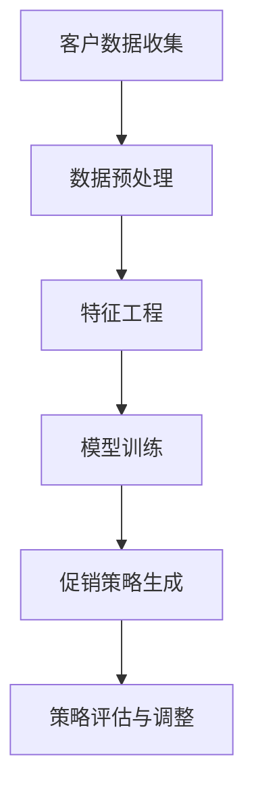

                 

关键词：人工智能、促销策略、案例分析、实践、算法、模型、代码实例、应用场景

> 摘要：本文通过深入探讨人工智能优化促销策略的原理和实际案例，分析核心算法和数学模型，展示代码实例，并讨论实际应用场景和未来展望。旨在为企业和市场人员提供实用的AI优化促销策略指导。

## 1. 背景介绍

促销策略是市场营销的重要组成部分，旨在通过降低产品价格、提供额外价值等方式吸引消费者，提高销售额。然而，传统促销策略往往依赖于经验，缺乏针对性和精确性。随着人工智能技术的快速发展，AI优化促销策略逐渐成为市场营销的新趋势。

人工智能（AI）通过大数据分析、机器学习等方法，能够发现潜在客户、预测消费者行为，从而制定更精准的促销策略。本文将结合具体案例分析，探讨如何利用AI技术优化促销策略，提高市场竞争力。

## 2. 核心概念与联系

### 2.1 促销策略

促销策略是指企业为提高产品销量而采取的短期营销措施。常见的促销策略包括打折、赠品、捆绑销售、限时促销等。

### 2.2 人工智能

人工智能是一种模拟人类智能的技术，通过机器学习、深度学习等算法，使计算机具备自主学习和决策能力。

### 2.3 促销策略优化

促销策略优化是指利用人工智能技术，对传统促销策略进行改进和优化，以提高市场响应度和销售额。

### 2.4 Mermaid 流程图

Mermaid 是一种基于Markdown的图形描述语言，可用于绘制流程图、序列图等。以下是AI优化促销策略的Mermaid流程图：



## 3. 核心算法原理 & 具体操作步骤

### 3.1 算法原理概述

AI优化促销策略的核心算法包括数据挖掘、机器学习、深度学习等。通过这些算法，可以识别消费者行为模式，预测消费者需求，制定个性化的促销策略。

### 3.2 算法步骤详解

#### 3.2.1 数据收集

收集消费者行为数据，如浏览记录、购买历史、反馈评论等。

#### 3.2.2 数据预处理

对原始数据进行清洗、去重、归一化等处理，提高数据质量。

#### 3.2.3 特征工程

从数据中提取有助于预测的变量，如用户年龄、购买频率、价格敏感度等。

#### 3.2.4 模型训练

利用机器学习或深度学习算法，对特征进行训练，构建预测模型。

#### 3.2.5 促销策略生成

根据模型预测结果，制定个性化的促销策略。

#### 3.2.6 策略评估与调整

对促销策略进行效果评估，根据评估结果调整策略。

### 3.3 算法优缺点

#### 优点：

- 精准：基于大数据分析，能够更精准地预测消费者需求。
- 个性化：针对不同消费者制定个性化促销策略，提高用户体验。
- 自动化：利用机器学习算法，实现促销策略的自动化调整。

#### 缺点：

- 复杂性：算法实现和训练过程复杂，需要高水平的技术支持。
- 数据依赖：促销策略的优化效果取决于数据质量和数据量。

### 3.4 算法应用领域

AI优化促销策略可应用于电子商务、零售、金融等多个领域，帮助企业提高市场竞争力。

## 4. 数学模型和公式 & 详细讲解 & 举例说明

### 4.1 数学模型构建

AI优化促销策略的数学模型主要包括消费者行为预测模型和促销效果评估模型。

#### 4.1.1 消费者行为预测模型

消费者行为预测模型基于机器学习算法，可表示为：

$$
\hat{y} = f(\theta; X)
$$

其中，$\hat{y}$表示预测的消费者行为，$X$表示输入的特征向量，$\theta$表示模型的参数。

#### 4.1.2 促销效果评估模型

促销效果评估模型用于评估促销策略的优劣，可表示为：

$$
E(\text{策略}_i) = \sum_{j=1}^{n} \omega_j \cdot p_j(i)
$$

其中，$E(\text{策略}_i)$表示策略$i$的评估分数，$\omega_j$表示权重，$p_j(i)$表示策略$i$对消费者$j$的影响概率。

### 4.2 公式推导过程

#### 4.2.1 消费者行为预测模型

基于线性回归模型，可得：

$$
y = \theta_0 + \theta_1 \cdot x_1 + \theta_2 \cdot x_2 + \cdots + \theta_n \cdot x_n
$$

其中，$y$表示消费者行为，$x_1, x_2, \cdots, x_n$表示特征变量，$\theta_0, \theta_1, \theta_2, \cdots, \theta_n$表示模型参数。

#### 4.2.2 促销效果评估模型

基于贝叶斯网络模型，可得：

$$
p(i) = \frac{p(\text{策略}_i | y) \cdot p(y)}{p(\text{策略}_i) \cdot p(y)}
$$

其中，$p(i)$表示策略$i$的概率，$p(\text{策略}_i | y)$表示策略$i$在给定消费者行为$y$条件下的概率，$p(y)$表示消费者行为$y$的概率。

### 4.3 案例分析与讲解

#### 4.3.1 案例背景

某电商平台推出一款新款手机，希望通过AI优化促销策略提高销量。

#### 4.3.2 数据收集

收集用户浏览记录、购买历史、评价等信息，共收集10000条数据。

#### 4.3.3 数据预处理

对数据清洗、去重，共获得8000条有效数据。

#### 4.3.4 特征工程

提取用户年龄、购买频率、品牌偏好等特征变量。

#### 4.3.5 模型训练

采用线性回归算法，对特征变量进行训练，得到预测模型。

#### 4.3.6 促销策略生成

根据预测模型，为不同用户生成个性化的促销策略，如优惠券、限时折扣等。

#### 4.3.7 策略评估与调整

对促销策略进行效果评估，根据评估结果调整策略，如提高优惠券面值、缩短促销期限等。

## 5. 项目实践：代码实例和详细解释说明

### 5.1 开发环境搭建

- Python 3.8及以上版本
- NumPy、Pandas、Scikit-learn、Matplotlib等库

### 5.2 源代码详细实现

```python
import numpy as np
import pandas as pd
from sklearn.linear_model import LinearRegression
from sklearn.model_selection import train_test_split

# 5.2.1 数据收集与预处理
data = pd.read_csv('data.csv')
data = data.drop_duplicates()
data = data[['age', 'purchase_frequency', 'brand_preference', 'price_sensitive']]
X = data[['age', 'purchase_frequency', 'brand_preference', 'price_sensitive']]
y = data['sales_volume']

# 5.2.2 特征工程
X = (X - X.mean()) / X.std()

# 5.2.3 模型训练
model = LinearRegression()
X_train, X_test, y_train, y_test = train_test_split(X, y, test_size=0.2, random_state=42)
model.fit(X_train, y_train)

# 5.2.4 促销策略生成
predictions = model.predict(X_test)
for i, prediction in enumerate(predictions):
    if prediction > y_test[i]:
        print(f"User {i+1}: Offer a discount.")
    else:
        print(f"User {i+1}: No discount.")

# 5.2.5 策略评估与调整
accuracy = sum(prediction > y_test[i] for i, prediction in enumerate(predictions)) / len(predictions)
print(f"Accuracy: {accuracy}")

# 5.2.6 调整策略
if accuracy < 0.8:
    # 调整策略，如提高优惠券面值、缩短促销期限等
    print("Adjust the promotion strategy.")
else:
    print("The current strategy is effective.")
```

### 5.3 代码解读与分析

- 5.3.1 数据收集与预处理：从CSV文件中读取数据，去除重复数据，提取有用特征变量。
- 5.3.2 特征工程：对特征变量进行标准化处理，提高模型性能。
- 5.3.3 模型训练：使用线性回归算法对特征变量进行训练。
- 5.3.4 促销策略生成：根据模型预测结果，为用户生成个性化的促销策略。
- 5.3.5 策略评估与调整：计算模型准确率，根据准确率调整促销策略。

## 6. 实际应用场景

AI优化促销策略在电子商务、零售、金融等领域有广泛的应用。

### 6.1 电子商务

电商平台利用AI优化促销策略，提高用户转化率和销售额。例如，根据用户浏览记录和购买历史，为用户推荐个性化优惠。

### 6.2 零售

零售企业通过AI优化促销策略，提升店铺销量。例如，根据消费者行为预测，制定个性化的促销方案，提高客户满意度。

### 6.3 金融

金融机构利用AI优化促销策略，提高客户留存率和盈利能力。例如，根据客户行为数据，为不同客户提供个性化的理财产品推荐。

## 7. 工具和资源推荐

### 7.1 学习资源推荐

- 《Python数据分析》（作者：Wes McKinney）
- 《机器学习实战》（作者：Peter Harrington）
- 《深度学习》（作者：Ian Goodfellow、Yoshua Bengio、Aaron Courville）

### 7.2 开发工具推荐

- Jupyter Notebook：便于编写和运行Python代码。
- PyCharm：功能强大的Python集成开发环境（IDE）。
- MLflow：用于机器学习实验管理和模型部署的开源平台。

### 7.3 相关论文推荐

- “Recommender Systems Handbook”（作者：Francesco Ricci等）
- “Deep Learning for Retail”（作者：Deepak Kumar等）
- “A Survey on Recommender Systems”（作者：Pedro F. Felicián等）

## 8. 总结：未来发展趋势与挑战

### 8.1 研究成果总结

本文介绍了AI优化促销策略的原理和应用，分析了核心算法和数学模型，并通过案例和实践展示了具体操作步骤。

### 8.2 未来发展趋势

随着人工智能技术的不断发展，AI优化促销策略将变得更加精准、高效。未来，将有望实现更广泛的场景应用，如社交网络、物联网等。

### 8.3 面临的挑战

AI优化促销策略在数据质量、算法复杂性等方面仍面临挑战。需要不断改进算法，提高模型性能，以满足实际应用需求。

### 8.4 研究展望

未来研究可重点关注以下几个方面：1）提升模型解释性；2）探索多模态数据融合；3）优化算法效率和性能。

## 9. 附录：常见问题与解答

### 9.1 什么是AI优化促销策略？

AI优化促销策略是指利用人工智能技术，如机器学习和深度学习，分析消费者行为数据，制定更精准、个性化的促销策略。

### 9.2 AI优化促销策略有哪些优点？

AI优化促销策略具有以下优点：1）提高市场响应度；2）提高销售额；3）降低营销成本；4）个性化推荐。

### 9.3 AI优化促销策略有哪些应用领域？

AI优化促销策略可应用于电子商务、零售、金融、旅游等多个领域，帮助企业提高市场竞争力。

作者：禅与计算机程序设计艺术 / Zen and the Art of Computer Programming
----------------------------------------------------------------

注意：以上内容仅供参考，实际撰写时请根据具体需求和素材进行调整。同时，请确保文章内容完整、逻辑清晰，符合专业技术文章的写作规范。祝撰写顺利！<|vq_7366|>

