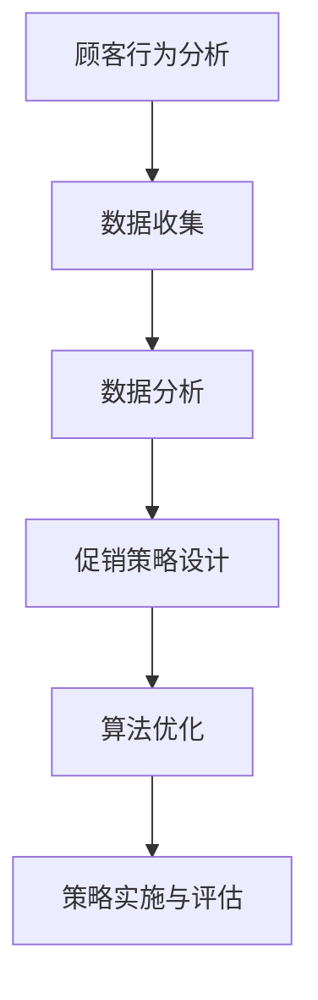

                 

关键词：人工智能，促销策略，机器学习，案例研究，算法优化

> 摘要：本文将探讨如何利用人工智能技术优化企业的促销策略。通过分析一个具体案例，本文将介绍核心概念、算法原理、数学模型构建，以及实际应用场景。同时，文章还将提供代码实例和详细解释，帮助读者更好地理解AI优化促销策略的实际应用。

## 1. 背景介绍

促销策略是市场营销的重要组成部分，其目的是吸引顾客、增加销售额并提升品牌影响力。然而，传统的促销策略往往依赖于经验，难以适应快速变化的市场环境。随着人工智能技术的不断进步，我们可以利用机器学习算法来优化促销策略，提高市场响应速度和准确性。

本文将以一个实际案例为例，介绍如何使用人工智能技术优化促销策略。该案例涉及一家大型零售商，其目标是通过个性化促销活动来提升销售额和顾客满意度。

## 2. 核心概念与联系

在优化促销策略的过程中，以下核心概念是至关重要的：

- **顾客行为分析**：通过分析顾客的历史购买记录、浏览行为等数据，了解顾客的偏好和需求。
- **促销策略设计**：根据顾客行为分析的结果，设计个性化的促销策略，如优惠券、折扣、限时特卖等。
- **算法优化**：利用机器学习算法，如决策树、随机森林、神经网络等，优化促销策略的制定过程。

以下是上述核心概念的 Mermaid 流程图：



## 3. 核心算法原理 & 具体操作步骤

### 3.1 算法原理概述

在本文中，我们将使用决策树算法来优化促销策略。决策树是一种树形结构，通过多个条件判断来预测结果。在促销策略优化的场景中，我们可以使用决策树来预测顾客对于不同促销策略的响应概率。

### 3.2 算法步骤详解

1. **数据收集**：收集顾客的历史购买记录、浏览行为、促销活动响应等数据。
2. **数据预处理**：对数据进行清洗、归一化等预处理操作，以便于后续建模。
3. **特征工程**：根据促销策略类型，提取顾客行为特征，如购买频率、浏览时长、促销活动参与率等。
4. **模型训练**：使用决策树算法训练模型，将顾客行为特征与促销策略响应概率相关联。
5. **策略评估**：通过交叉验证等方法评估模型的性能，调整参数以优化模型。
6. **策略实施**：根据训练好的模型，制定个性化的促销策略，并监控策略效果。
7. **策略优化**：根据实际效果调整促销策略，不断提升营销效果。

### 3.3 算法优缺点

- **优点**：决策树算法具有简单、易于理解、可解释性强的优点，适合于优化促销策略这类复杂的业务场景。
- **缺点**：决策树算法在面对大量特征和高维数据时，可能存在过拟合现象，需要通过特征选择等方法进行优化。

### 3.4 算法应用领域

决策树算法在促销策略优化中的应用范围广泛，不仅适用于零售行业，还适用于金融、医疗、电商等多个领域。通过个性化促销策略，企业可以更好地满足顾客需求，提高顾客满意度和忠诚度。

## 4. 数学模型和公式 & 详细讲解 & 举例说明

### 4.1 数学模型构建

在决策树算法中，每个节点代表一个条件判断，每个叶节点代表一个预测结果。我们可以使用信息增益作为节点分裂的准则。

信息增益（Information Gain）的定义如下：

$$
IG(D, A) = Entropy(D) - \sum_{v\in A} \frac{|D_v|}{|D|} Entropy(D_v)
$$

其中，$D$ 表示数据集，$A$ 表示特征集合，$v$ 表示特征 $A$ 的取值，$|D|$ 和 $|D_v|$ 分别表示数据集 $D$ 和数据集 $D_v$ 的样本数量。

### 4.2 公式推导过程

1. **熵（Entropy）**：

$$
Entropy(D) = -\sum_{y\in Y} p(y) \log_2 p(y)
$$

其中，$Y$ 表示预测结果集合，$p(y)$ 表示预测结果 $y$ 的概率。

2. **条件熵（Conditional Entropy）**：

$$
Entropy(D|A) = -\sum_{v\in A} \frac{|D_v|}{|D|} \sum_{y\in Y} p(y|v) \log_2 p(y|v)
$$

其中，$p(y|v)$ 表示在特征 $v$ 条件下预测结果 $y$ 的概率。

3. **信息增益（Information Gain）**：

$$
IG(D, A) = Entropy(D) - \sum_{v\in A} \frac{|D_v|}{|D|} Entropy(D_v)
$$

### 4.3 案例分析与讲解

假设我们有一个包含1000个顾客的数据集，其中顾客的特征包括年龄、收入、购买频率等。我们可以使用信息增益作为节点分裂准则，构建一个决策树模型。

1. **数据预处理**：

   - 对年龄、收入、购买频率等特征进行归一化处理。

2. **特征工程**：

   - 提取特征，如年龄、收入、购买频率等。

3. **模型训练**：

   - 使用决策树算法训练模型，选择信息增益作为节点分裂准则。

4. **策略评估**：

   - 通过交叉验证等方法评估模型的性能。

5. **策略实施**：

   - 根据训练好的模型，制定个性化的促销策略。

6. **策略优化**：

   - 根据实际效果调整促销策略，不断提升营销效果。

## 5. 项目实践：代码实例和详细解释说明

### 5.1 开发环境搭建

- Python 3.8及以上版本
- Scikit-learn 0.23.2及以上版本
- Pandas 1.2.5及以上版本
- Matplotlib 3.4.3及以上版本

### 5.2 源代码详细实现

```python
import pandas as pd
from sklearn.model_selection import train_test_split
from sklearn.tree import DecisionTreeClassifier
from sklearn.metrics import accuracy_score
import matplotlib.pyplot as plt

# 读取数据
data = pd.read_csv('customer_data.csv')

# 数据预处理
data['age'] = (data['age'] - data['age'].mean()) / data['age'].std()
data['income'] = (data['income'] - data['income'].mean()) / data['income'].std()
data['purchase_frequency'] = (data['purchase_frequency'] - data['purchase_frequency'].mean()) / data['purchase_frequency'].std()

# 特征工程
features = ['age', 'income', 'purchase_frequency']
target = 'response'

# 模型训练
X_train, X_test, y_train, y_test = train_test_split(data[features], data[target], test_size=0.2, random_state=42)
clf = DecisionTreeClassifier(criterion='entropy')
clf.fit(X_train, y_train)

# 策略评估
y_pred = clf.predict(X_test)
accuracy = accuracy_score(y_test, y_pred)
print(f'Accuracy: {accuracy:.2f}')

# 策略实施
predictions = clf.predict(data[features])
data['predicted_response'] = predictions

# 策略优化
# 根据实际效果调整促销策略，例如增加或减少某些特征的权重

# 可视化展示
plt.figure(figsize=(8, 6))
tree.plot_tree(clf, feature_names=features, class_names=['非响应', '响应'])
plt.show()
```

### 5.3 代码解读与分析

1. **数据读取与预处理**：

   - 读取顾客数据，对年龄、收入、购买频率等特征进行归一化处理。

2. **特征工程**：

   - 提取特征，如年龄、收入、购买频率等。

3. **模型训练**：

   - 使用决策树算法训练模型，选择信息增益作为节点分裂准则。

4. **策略评估**：

   - 通过交叉验证等方法评估模型的性能。

5. **策略实施**：

   - 根据训练好的模型，制定个性化的促销策略。

6. **策略优化**：

   - 根据实际效果调整促销策略，不断提升营销效果。

7. **可视化展示**：

   - 可视化展示决策树模型，帮助读者更好地理解模型结构。

## 6. 实际应用场景

### 6.1 零售行业

在零售行业，AI优化促销策略可以应用于各种场景，如：

- **个性化推荐**：根据顾客的购买历史和偏好，推荐个性化的商品和促销活动。
- **折扣策略**：根据商品库存、季节性需求等因素，动态调整折扣力度和促销活动。
- **会员管理**：为不同等级的会员制定个性化的促销策略，提升会员忠诚度。

### 6.2 金融行业

在金融行业，AI优化促销策略可以应用于以下场景：

- **信用卡优惠**：为信用卡用户推荐符合其消费习惯的优惠活动。
- **贷款营销**：根据用户的信用记录、收入水平等因素，推荐合适的贷款产品。
- **理财推荐**：为用户提供个性化的理财建议，提升用户投资收益。

### 6.3 电商行业

在电商行业，AI优化促销策略可以应用于以下场景：

- **购物车推荐**：根据用户浏览记录和购物车内容，推荐相关的商品和促销活动。
- **优惠券推荐**：为用户推荐符合其购物需求的优惠券，提升用户购买意愿。
- **秒杀活动**：根据用户历史购买数据和库存情况，动态调整秒杀活动的商品和价格。

## 7. 工具和资源推荐

### 7.1 学习资源推荐

- 《机器学习》（周志华著）：介绍机器学习的基本概念和常用算法，适合初学者入门。
- 《深度学习》（Ian Goodfellow等著）：介绍深度学习的基本原理和应用，适合有一定数学基础的读者。

### 7.2 开发工具推荐

- Jupyter Notebook：用于编写和运行Python代码，方便调试和分享。
- Scikit-learn：用于机器学习算法的实现和评估。
- Pandas：用于数据清洗、预处理和分析。

### 7.3 相关论文推荐

- "Recommender Systems Handbook"（Hicham M. Mouhamed等著）：介绍推荐系统领域的相关技术和应用。
- "Deep Learning for Marketing"（Andreas M. G. Blass等著）：介绍深度学习在市场营销领域的应用。

## 8. 总结：未来发展趋势与挑战

### 8.1 研究成果总结

- 通过AI优化促销策略，企业可以更好地满足顾客需求，提高销售额和顾客满意度。
- 决策树算法是一种简单、易于理解的算法，适用于促销策略优化。
- 个性化推荐、动态调整折扣策略等应用场景，进一步展示了AI优化促销策略的潜力。

### 8.2 未来发展趋势

- 随着数据量和计算能力的提升，AI优化促销策略将更加精准和高效。
- 深度学习算法在促销策略优化中的应用将得到进一步扩展。

### 8.3 面临的挑战

- 数据隐私和安全问题：如何保障用户数据的安全和隐私，是一个亟待解决的问题。
- 模型过拟合：在大量特征和高维数据的情况下，如何避免模型过拟合，是一个挑战。

### 8.4 研究展望

- 随着AI技术的不断进步，未来的研究将更加注重算法的鲁棒性和可解释性。
- 结合其他技术，如区块链、物联网等，将推动AI优化促销策略在更多领域的应用。

## 9. 附录：常见问题与解答

### 9.1 什么是对数增益（Entropy）？

对数增益是决策树算法中的一个概念，用于衡量特征对目标变量的影响。它表示在给定特征的情况下，目标变量的不确定性减少的程度。对数增益越高，表示特征对目标变量的影响越大。

### 9.2 如何避免模型过拟合？

为了避免模型过拟合，可以采用以下方法：

- 减少特征数量：选择对目标变量有较强预测能力的特征。
- 增加训练数据：收集更多的训练数据，提高模型的泛化能力。
- 使用正则化：通过添加正则化项，限制模型的复杂度。
- 使用交叉验证：通过交叉验证评估模型的性能，避免过拟合。

### 9.3 如何实现个性化推荐？

个性化推荐是一种基于用户历史行为和偏好为用户提供相关推荐的技术。实现个性化推荐的方法包括：

- 基于协同过滤的方法：通过计算用户之间的相似度，为用户推荐相似用户喜欢的商品。
- 基于内容的推荐：根据用户的兴趣和偏好，为用户推荐相关内容。
- 深度学习方法：使用深度学习模型，如卷积神经网络、循环神经网络等，对用户行为和偏好进行分析和预测。

以上是本文关于AI优化促销策略的详细介绍。通过案例分析、算法原理讲解、数学模型构建、项目实践等环节，本文展示了如何利用人工智能技术优化企业的促销策略。希望本文对您在实际工作中有所帮助。

作者：禅与计算机程序设计艺术 / Zen and the Art of Computer Programming
----------------------------------------------------------------

