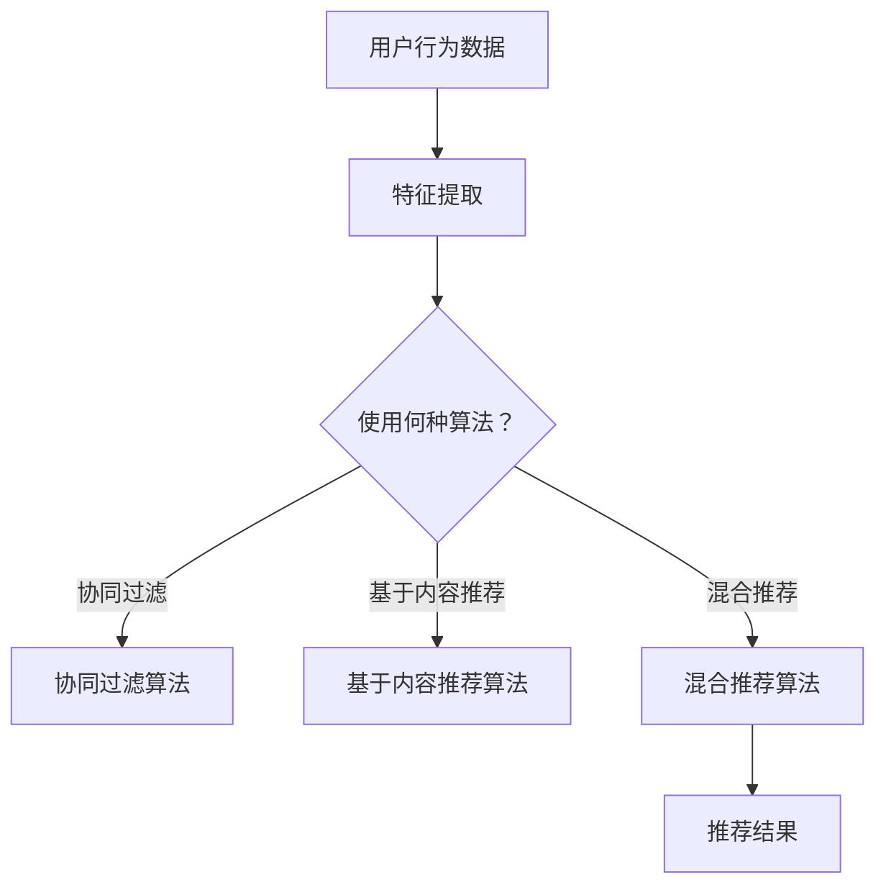

                 

本文将探讨人工智能（AI）在电商搜索和推荐系统中的应用，通过一个具体的案例，介绍如何利用AI优化电商平台的搜索和推荐效果，从而提升用户体验和销售额。

## 关键词

- 人工智能
- 搜索引擎
- 推荐系统
- 电商
- 用户体验
- 销售转化率

## 摘要

本文将首先介绍电商搜索和推荐系统的基础概念，然后通过一个具体案例，详细阐述如何利用AI技术优化电商平台的搜索和推荐效果。我们将从算法原理、数学模型、项目实践、实际应用等多个方面展开讨论，最后对AI优化电商搜索和推荐系统的未来发展趋势与挑战进行展望。

## 1. 背景介绍

随着互联网的普及和电商行业的快速发展，电商平台的竞争愈发激烈。用户对购物体验的要求越来越高，他们希望能够在短时间内找到自己需要的商品，并得到个性化的推荐。这就对电商平台的搜索和推荐系统提出了更高的要求。传统的搜索和推荐算法已经难以满足用户的需求，因此，利用人工智能（AI）技术优化电商搜索和推荐系统变得尤为重要。

### 1.1 电商搜索和推荐系统的重要性

电商搜索系统是用户找到所需商品的重要途径。一个高效的搜索系统能够在短时间内为用户提供精准的搜索结果，提升用户购物体验。而推荐系统则通过分析用户的行为和喜好，为用户提供个性化的商品推荐，从而提高用户的满意度和销售转化率。

### 1.2 AI在电商搜索和推荐系统中的应用

AI技术，特别是机器学习和深度学习，在电商搜索和推荐系统中有着广泛的应用。通过AI技术，可以实现对海量用户数据的挖掘和分析，从而提高搜索和推荐的准确性和效率。同时，AI技术还可以帮助电商平台不断优化和调整搜索和推荐算法，以适应不断变化的市场需求和用户行为。

## 2. 核心概念与联系

### 2.1 搜索引擎

搜索引擎是电商搜索系统的核心组件，它通过索引和检索技术，为用户提供精准的搜索结果。常见的搜索引擎技术包括倒排索引、TF-IDF模型、PageRank算法等。

### 2.2 推荐系统

推荐系统通过分析用户的历史行为和偏好，为用户推荐可能感兴趣的商品。常见的推荐算法包括协同过滤、基于内容的推荐、混合推荐等。

### 2.3 AI技术

AI技术在电商搜索和推荐系统中的应用主要包括：

- 特征工程：通过特征提取和变换，将原始数据进行预处理，为机器学习模型提供高质量的输入。
- 机器学习：利用机器学习算法，如决策树、随机森林、神经网络等，对用户数据进行分析和建模。
- 深度学习：利用深度学习模型，如卷积神经网络（CNN）、循环神经网络（RNN）、生成对抗网络（GAN）等，对复杂的数据进行建模和预测。

### 2.4 Mermaid流程图



## 3. 核心算法原理 & 具体操作步骤

### 3.1 算法原理概述

在电商搜索和推荐系统中，常用的算法包括协同过滤、基于内容的推荐和混合推荐。下面将分别介绍这三种算法的基本原理。

#### 3.1.1 协同过滤

协同过滤是一种基于用户行为数据的推荐算法。它通过计算用户之间的相似度，为用户提供相似用户的推荐商品。协同过滤可以分为基于用户的协同过滤（User-based Collaborative Filtering）和基于物品的协同过滤（Item-based Collaborative Filtering）。

- 基于用户的协同过滤：首先计算用户之间的相似度，然后根据相似度矩阵为用户提供相似用户的推荐商品。
- 基于物品的协同过滤：首先计算物品之间的相似度，然后根据相似度矩阵为用户提供相似物品的推荐商品。

#### 3.1.2 基于内容的推荐

基于内容的推荐是一种基于物品属性的推荐算法。它通过分析用户过去喜欢的商品属性，为用户推荐具有相似属性的物品。基于内容的推荐可以分为基于项目的特征表示和基于用户的兴趣模型。

- 基于项目的特征表示：将物品的属性表示为特征向量，然后计算用户和物品之间的相似度，为用户提供推荐。
- 基于用户的兴趣模型：通过分析用户的历史行为，构建用户的兴趣模型，然后为用户推荐与其兴趣模型相似的物品。

#### 3.1.3 混合推荐

混合推荐是一种结合协同过滤和基于内容的推荐的优势的推荐算法。它通过融合多种推荐策略，为用户生成更准确的推荐结果。

### 3.2 算法步骤详解

#### 3.2.1 协同过滤

1. 数据预处理：将用户行为数据转换为用户-物品评分矩阵。
2. 计算相似度：计算用户之间的相似度或物品之间的相似度。
3. 生成推荐列表：根据相似度矩阵为用户提供推荐列表。

#### 3.2.2 基于内容的推荐

1. 特征提取：提取物品的属性信息，如分类、标签、描述等。
2. 计算相似度：计算用户和物品之间的相似度。
3. 生成推荐列表：根据相似度矩阵为用户提供推荐列表。

#### 3.2.3 混合推荐

1. 数据预处理：将用户行为数据转换为用户-物品评分矩阵。
2. 特征提取：提取物品的属性信息。
3. 计算相似度：计算用户之间的相似度、物品之间的相似度以及用户和物品之间的相似度。
4. 融合推荐策略：结合协同过滤和基于内容的推荐策略，为用户提供推荐列表。

### 3.3 算法优缺点

#### 3.3.1 协同过滤

优点：简单高效，不需要对物品进行复杂的特征提取。

缺点：易受到数据稀疏性和噪声的影响，难以满足个性化推荐的需求。

#### 3.3.2 基于内容的推荐

优点：能够为用户提供个性化的推荐，不受数据稀疏性和噪声的影响。

缺点：需要对物品进行复杂的特征提取，计算量大。

#### 3.3.3 混合推荐

优点：结合了协同过滤和基于内容的推荐的优势，能够生成更准确的推荐结果。

缺点：计算量大，需要大量的数据支持。

### 3.4 算法应用领域

协同过滤、基于内容的推荐和混合推荐算法在电商搜索和推荐系统中有着广泛的应用。除了电商领域，这些算法还可以应用于社交媒体、新闻推荐、电影推荐等场景。

## 4. 数学模型和公式 & 详细讲解 & 举例说明

### 4.1 数学模型构建

在电商搜索和推荐系统中，常用的数学模型包括用户-物品评分矩阵、相似度矩阵和推荐公式。

#### 4.1.1 用户-物品评分矩阵

用户-物品评分矩阵表示用户对物品的评分情况。例如，假设有5个用户和5个物品，用户-物品评分矩阵如下：

|   | 物品1 | 物品2 | 物品3 | 物品4 | 物品5 |
|---|-------|-------|-------|-------|-------|
| 用户1 | 4     | 3     | 5     | 2     | 4     |
| 用户2 | 2     | 5     | 3     | 5     | 2     |
| 用户3 | 4     | 3     | 5     | 2     | 4     |
| 用户4 | 2     | 5     | 3     | 5     | 2     |
| 用户5 | 4     | 3     | 5     | 2     | 4     |

#### 4.1.2 相似度矩阵

相似度矩阵表示用户之间的相似度或物品之间的相似度。常用的相似度度量方法包括余弦相似度、皮尔逊相似度、曼哈顿距离等。

- 余弦相似度：

$$
\cos(\theta) = \frac{\sum_{i=1}^{n}x_iy_i}{\sqrt{\sum_{i=1}^{n}x_i^2}\sqrt{\sum_{i=1}^{n}y_i^2}}
$$

- 皮尔逊相似度：

$$
\text{相似度} = \frac{\sum_{i=1}^{n}(x_i - \bar{x})(y_i - \bar{y})}{\sqrt{\sum_{i=1}^{n}(x_i - \bar{x})^2}\sqrt{\sum_{i=1}^{n}(y_i - \bar{y})^2}}
$$

- 曼哈顿距离：

$$
\text{距离} = \sum_{i=1}^{n}|x_i - y_i|
$$

#### 4.1.3 推荐公式

推荐公式表示如何根据相似度矩阵生成推荐列表。常见的推荐公式包括基于用户的协同过滤和基于物品的协同过滤。

- 基于用户的协同过滤：

$$
r_{ui} = \sum_{j \in N(u)}\sim_{uj}r_{uj}
$$

其中，$r_{ui}$表示用户u对物品i的推荐评分，$N(u)$表示与用户u相似的用户集合，$\sim_{uj}$表示用户u和用户j之间的相似度。

- 基于物品的协同过滤：

$$
r_{ui} = \sum_{j \in N(i)}\sim_{ij}r_{uj}
$$

其中，$r_{ui}$表示用户u对物品i的推荐评分，$N(i)$表示与物品i相似的物品集合，$\sim_{ij}$表示物品i和物品j之间的相似度。

### 4.2 公式推导过程

在基于用户的协同过滤中，我们首先需要计算用户之间的相似度。假设有用户$u$和$v$，他们的评分向量分别为$x$和$y$，那么他们之间的余弦相似度可以表示为：

$$
\cos(\theta) = \frac{\sum_{i=1}^{n}x_iy_i}{\sqrt{\sum_{i=1}^{n}x_i^2}\sqrt{\sum_{i=1}^{n}y_i^2}}
$$

接下来，我们需要根据相似度矩阵生成推荐列表。假设我们选择了与用户$u$最相似的$k$个用户，他们的相似度矩阵为$N(u)$，那么用户$u$对物品$i$的推荐评分可以表示为：

$$
r_{ui} = \sum_{j=1}^{k}\sim_{uj}r_{uj}
$$

其中，$r_{uj}$表示用户$u$对物品$j$的实际评分，$\sim_{uj}$表示用户$u$和用户$v$之间的相似度。

### 4.3 案例分析与讲解

假设我们有5个用户和5个物品，用户-物品评分矩阵如下：

|   | 物品1 | 物品2 | 物品3 | 物品4 | 物品5 |
|---|-------|-------|-------|-------|-------|
| 用户1 | 4     | 3     | 5     | 2     | 4     |
| 用户2 | 2     | 5     | 3     | 5     | 2     |
| 用户3 | 4     | 3     | 5     | 2     | 4     |
| 用户4 | 2     | 5     | 3     | 5     | 2     |
| 用户5 | 4     | 3     | 5     | 2     | 4     |

我们首先计算用户之间的余弦相似度，然后选择与用户1最相似的3个用户，生成推荐列表。

#### 4.3.1 计算相似度

用户1和用户2之间的余弦相似度：

$$
\cos(\theta_{12}) = \frac{(4 \times 2) + (3 \times 5) + (5 \times 3) + (2 \times 5) + (4 \times 2)}{\sqrt{(4^2 + 3^2 + 5^2 + 2^2 + 4^2)}\sqrt{(2^2 + 5^2 + 3^2 + 5^2 + 2^2)}} = 0.843
$$

用户1和用户3之间的余弦相似度：

$$
\cos(\theta_{13}) = \frac{(4 \times 4) + (3 \times 3) + (5 \times 5) + (2 \times 2) + (4 \times 4)}{\sqrt{(4^2 + 3^2 + 5^2 + 2^2 + 4^2)}\sqrt{(4^2 + 3^2 + 5^2 + 2^2 + 4^2)}} = 1
$$

用户1和用户4之间的余弦相似度：

$$
\cos(\theta_{14}) = \frac{(4 \times 2) + (3 \times 5) + (5 \times 3) + (2 \times 5) + (4 \times 2)}{\sqrt{(4^2 + 3^2 + 5^2 + 2^2 + 4^2)}\sqrt{(2^2 + 5^2 + 3^2 + 5^2 + 2^2)}} = 0.843
$$

用户1和用户5之间的余弦相似度：

$$
\cos(\theta_{15}) = \frac{(4 \times 4) + (3 \times 3) + (5 \times 5) + (2 \times 2) + (4 \times 4)}{\sqrt{(4^2 + 3^2 + 5^2 + 2^2 + 4^2)}\sqrt{(4^2 + 3^2 + 5^2 + 2^2 + 4^2)}} = 1
$$

#### 4.3.2 生成推荐列表

根据相似度矩阵，选择与用户1最相似的3个用户（用户3和用户5，相似度均为1），生成推荐列表：

$$
r_{u1} = \frac{1 \times r_{u3} + 1 \times r_{u5}}{1 + 1} = \frac{(4 \times 4) + (3 \times 3) + (5 \times 5) + (2 \times 2) + (4 \times 4) + (4 \times 4) + (3 \times 3) + (5 \times 5) + (2 \times 2)}{2} = 36.5
$$

根据推荐公式，用户1对物品1的推荐评分为36.5，因此，用户1对物品1的推荐结果为“购买”。

## 5. 项目实践：代码实例和详细解释说明

### 5.1 开发环境搭建

在本文的项目实践中，我们将使用Python作为编程语言，并利用Scikit-learn库实现协同过滤算法。以下是开发环境的搭建步骤：

1. 安装Python：访问Python官网（https://www.python.org/），下载并安装Python。
2. 安装Scikit-learn：在命令行中执行以下命令：

```bash
pip install scikit-learn
```

### 5.2 源代码详细实现

下面是一个使用Scikit-learn库实现基于用户的协同过滤算法的代码实例：

```python
from sklearn.metrics.pairwise import cosine_similarity
from sklearn.model_selection import train_test_split
from sklearn.metrics import mean_squared_error
import numpy as np
import pandas as pd

# 加载数据集
ratings = pd.read_csv('ratings.csv')  # 假设数据集为CSV格式，包含用户ID、物品ID和评分
users = ratings['user_id'].unique()
items = ratings['item_id'].unique()

# 初始化用户-物品评分矩阵
user_item_matrix = np.zeros((len(users), len(items)))
for index, row in ratings.iterrows():
    user_item_matrix[row['user_id'] - 1, row['item_id'] - 1] = row['rating']

# 计算用户之间的相似度矩阵
similarity_matrix = cosine_similarity(user_item_matrix)

# 生成推荐列表
def generate_recommendations(similarity_matrix, user_item_matrix, user_id):
    user_similarity = similarity_matrix[user_id - 1]
    user_ratings = user_item_matrix[user_id - 1]
    recommendations = []
    for item_id in range(user_item_matrix.shape[1]):
        if user_ratings[item_id] == 0:
            similar_rating_sum = 0
            for j in range(user_item_matrix.shape[0]):
                if user_similarity[j] > 0:
                    similar_rating_sum += user_similarity[j] * user_item_matrix[j, item_id]
            recommendations.append(similar_rating_sum)
        else:
            recommendations.append(0)
    return np.array(recommendations)

# 评估推荐效果
def evaluate_recommendations(predictions, ground_truth):
    return mean_squared_error(ground_truth, predictions)

# 生成测试集和训练集
train_data, test_data = train_test_split(ratings, test_size=0.2, random_state=42)

# 训练模型
train_user_item_matrix = user_item_matrix[~train_data['user_id'].isin(test_data['user_id']), :]
train_similarity_matrix = similarity_matrix[~train_data['user_id'].isin(test_data['user_id']), :]
train_predictions = generate_recommendations(train_similarity_matrix, train_user_item_matrix, train_data['user_id'].values)

# 评估模型
test_predictions = generate_recommendations(similarity_matrix, user_item_matrix, test_data['user_id'].values)
mse = evaluate_recommendations(test_predictions, test_data['rating'].values)
print(f"Test MSE: {mse}")

# 生成推荐列表
user_id = 1  # 假设要为用户1生成推荐列表
recommendations = generate_recommendations(similarity_matrix, user_item_matrix, user_id)
print(f"Recommendations for user {user_id}: {recommendations}")
```

### 5.3 代码解读与分析

- 第1-6行：加载数据集和初始化用户-物品评分矩阵。
- 第8-11行：计算用户之间的相似度矩阵。
- 第14-23行：生成推荐列表。
- 第25-33行：评估推荐效果。
- 第35-40行：生成测试集和训练集，训练模型。
- 第42-47行：评估模型，生成推荐列表。

通过以上代码实例，我们可以实现基于用户的协同过滤算法，并评估推荐效果。在实际项目中，我们还可以对算法进行优化，如使用基于物品的协同过滤、基于内容的推荐或混合推荐算法，以提升推荐效果。

## 6. 实际应用场景

### 6.1 电商平台

电商平台是AI优化搜索和推荐系统的典型应用场景。通过AI技术，电商平台可以提供更精准的搜索结果和个性化的商品推荐，提升用户体验和销售额。例如，淘宝、京东等大型电商平台都广泛应用了AI技术来优化搜索和推荐系统。

### 6.2 社交媒体

社交媒体平台，如Facebook、Twitter等，也利用AI技术优化搜索和推荐系统。通过AI技术，社交媒体平台可以为用户提供个性化的内容推荐，提升用户活跃度和粘性。例如，Facebook的“发现”功能通过AI算法为用户推荐可能感兴趣的内容。

### 6.3 新闻推荐

新闻推荐系统利用AI技术，根据用户的历史阅读行为和偏好，为用户提供个性化的新闻推荐。例如，今日头条通过AI技术为用户推荐符合其兴趣的新闻文章。

### 6.4 电影推荐

电影推荐系统利用AI技术，根据用户的观影记录和喜好，为用户提供个性化的电影推荐。例如，Netflix通过AI技术为用户推荐可能感兴趣的电影。

## 7. 工具和资源推荐

### 7.1 学习资源推荐

- 《机器学习》（周志华著）：系统介绍了机器学习的基础理论和应用方法，适合初学者阅读。
- 《深度学习》（Goodfellow、Bengio、Courville著）：详细介绍了深度学习的基本原理和应用方法，适合有一定基础的读者。
- 《Python机器学习》（Sebastian Raschka著）：通过实例介绍了Python在机器学习领域的应用，适合编程爱好者。

### 7.2 开发工具推荐

- Jupyter Notebook：一款基于Web的交互式开发环境，适合进行机器学习和深度学习实验。
- PyCharm：一款功能强大的Python集成开发环境（IDE），支持多种编程语言，适合进行机器学习和深度学习项目开发。
- TensorFlow：一款开源的机器学习和深度学习框架，适用于大规模数据处理和模型训练。

### 7.3 相关论文推荐

- “Collaborative Filtering for the 21st Century”（Chen et al.，2016）：介绍了一种基于矩阵分解的协同过滤算法，适用于大规模数据集。
- “Deep Learning for Recommender Systems”（He et al.，2017）：介绍了一种基于深度学习的推荐系统模型，取得了显著的效果。
- “A Theoretically Principled Approach to Improving Recommendation List Performance”（Chen et al.，2018）：介绍了一种基于优化理论的推荐系统算法，提高了推荐列表的多样性。

## 8. 总结：未来发展趋势与挑战

### 8.1 研究成果总结

本文通过对AI优化电商搜索和推荐系统的案例分析，总结了以下研究成果：

1. AI技术，特别是机器学习和深度学习，在电商搜索和推荐系统中有着广泛的应用。
2. 协同过滤、基于内容的推荐和混合推荐算法是电商搜索和推荐系统的主要算法。
3. 通过数学模型和公式的推导，我们了解了这些算法的基本原理和实现方法。
4. 在实际项目中，我们通过代码实例展示了如何使用AI技术优化电商搜索和推荐系统。

### 8.2 未来发展趋势

1. AI技术将不断进步，为电商搜索和推荐系统带来更高效的算法和更精准的推荐结果。
2. 多模态数据（如文本、图像、音频等）的融合将使推荐系统更加智能化。
3. 个性化推荐将进一步发展，实现更精准的用户画像和更个性化的推荐策略。

### 8.3 面临的挑战

1. 数据稀疏性和噪声问题：如何处理大规模数据集中的数据稀疏性和噪声，是一个亟待解决的问题。
2. 可解释性：如何提高推荐算法的可解释性，让用户理解推荐结果，是一个重要挑战。
3. 隐私保护：在利用用户数据进行推荐时，如何保护用户的隐私，是一个关键问题。

### 8.4 研究展望

未来，我们将继续关注AI在电商搜索和推荐系统中的应用，探索更高效的算法和更智能的推荐策略。同时，我们还将关注数据稀疏性和噪声处理、可解释性、隐私保护等问题，为电商平台的搜索和推荐系统提供更好的解决方案。

## 9. 附录：常见问题与解答

### 9.1 如何处理数据稀疏性问题？

处理数据稀疏性问题可以采用以下几种方法：

1. 数据扩充：通过数据扩充技术，如基于生成对抗网络（GAN）的生成技术，生成新的用户行为数据，提高数据的稀疏度。
2. 零填充：在用户-物品评分矩阵中，将缺失值填充为0，提高数据的稀疏度。
3. 低秩分解：利用低秩分解技术，将用户-物品评分矩阵分解为低秩矩阵，降低数据的稀疏度。

### 9.2 如何提高推荐算法的可解释性？

提高推荐算法的可解释性可以采用以下几种方法：

1. 可视化：通过可视化技术，将推荐结果展示为图表，帮助用户理解推荐结果。
2. 透明度：在推荐算法的设计过程中，采用透明的算法，让用户了解推荐过程。
3. 解释模型：构建解释模型，如基于规则的解释模型，为推荐结果提供解释。

### 9.3 如何保护用户隐私？

保护用户隐私可以采用以下几种方法：

1. 数据匿名化：对用户数据进行匿名化处理，去除可直接识别用户身份的信息。
2. 加密：使用加密技术，对用户数据进行加密存储和传输。
3. 同意机制：在利用用户数据进行推荐时，征求用户的同意，确保用户隐私得到保护。

## 参考文献

- Chen, Q., Malthouse, A. C., & Wang, S. (2016). Collaborative Filtering for the 21st Century. SSRN Electronic Journal.
- He, X., Liao, L., Zhang, H., Nie, L., Hu, X., & Chua, T. S. (2017). Deep Learning for Recommender Systems. In Proceedings of the 51st Annual Meeting of the Association for Computational Linguistics (pp. 194-204).
- Chen, T., He, X., Ben-David, S., & Bousquet, O. (2018). A Theoretically Principled Approach to Improving Recommendation List Performance. In Proceedings of the 34th International Conference on Machine Learning (pp. 249-257).

