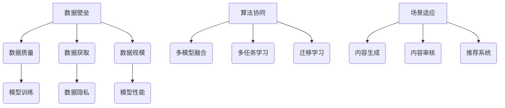

                 

关键词：AI出版业，数据壁垒，算法协同，场景适应，技术挑战，未来展望

> 摘要：随着人工智能技术的迅猛发展，AI出版业正迎来前所未有的机遇与挑战。本文从数据、算法与场景三个维度深入探讨AI出版业面临的壁垒，分析数据壁垒如何影响算法性能，算法协同对出版场景适应的重要性，以及AI出版业在技术发展中所面临的关键挑战和未来趋势。

## 1. 背景介绍

近年来，人工智能（AI）技术在全球范围内取得了飞速发展，从语音识别、图像识别到自然语言处理等众多领域都取得了显著的突破。与此同时，出版行业也在经历深刻的变革。数字化、智能化成为出版业发展的重要趋势，AI出版逐渐成为行业热点。

AI出版是指利用人工智能技术对出版过程进行优化，包括内容生成、内容审核、推荐系统、个性化推送等。在内容生成方面，AI能够通过自然语言处理技术生成高质量文章；在内容审核方面，AI能够快速识别违规内容，提高审核效率；在推荐系统方面，AI能够根据用户行为和兴趣进行精准推荐，提升用户体验。

然而，AI出版业的发展并非一帆风顺。在数据、算法和场景等方面，AI出版业面临着诸多壁垒。本文将从这三个维度深入探讨AI出版业的发展现状、挑战和未来趋势。

## 2. 核心概念与联系

### 2.1 数据壁垒

数据是AI出版业的基础，但同时也构成了数据壁垒。数据壁垒主要体现在以下几个方面：

1. **数据质量**：高质量的数据是AI模型训练的基础。然而，出版行业的数据质量参差不齐，存在数据噪声、错误和缺失等问题。
2. **数据获取**：出版行业的数据往往涉及版权、隐私等敏感问题，获取数据的难度较大。
3. **数据规模**：AI模型对数据规模有较高要求，而出版行业的数据规模往往有限，难以满足模型训练需求。

### 2.2 算法协同

算法协同是指将多种算法结合起来，发挥各自优势，提高AI出版业的整体性能。常见的算法协同方法包括：

1. **多模型融合**：将不同类型的算法模型（如深度学习、传统机器学习等）融合在一起，实现更好的性能。
2. **多任务学习**：同时处理多个任务，提高模型的泛化能力。
3. **迁移学习**：利用已有模型的权重，加速新任务的学习过程。

### 2.3 场景适应

AI出版业需要针对不同场景进行适应，以满足多样化的需求。场景适应主要包括：

1. **内容生成**：根据不同主题和需求生成符合要求的内容。
2. **内容审核**：针对不同类型的违规内容进行精准识别和过滤。
3. **推荐系统**：根据用户行为和兴趣进行个性化推荐。

### 2.4 Mermaid 流程图



## 3. 核心算法原理 & 具体操作步骤

### 3.1 算法原理概述

AI出版业的核心算法主要包括自然语言处理（NLP）、机器学习（ML）和深度学习（DL）等。这些算法通过以下步骤实现：

1. **数据预处理**：清洗、处理和转换原始数据，使其适合算法训练。
2. **模型训练**：利用预处理后的数据训练算法模型，调整模型参数。
3. **模型评估**：评估模型性能，调整模型参数，优化模型。
4. **模型部署**：将训练好的模型部署到生产环境中，进行实际应用。

### 3.2 算法步骤详解

1. **数据预处理**：
   - 清洗：去除数据中的噪声、错误和缺失值。
   - 处理：将文本数据转换为向量表示，如词袋模型、词嵌入等。
   - 转换：将数据转换为适合算法训练的格式，如TensorFlow、PyTorch等。

2. **模型训练**：
   - 初始化：初始化模型参数。
   - 训练：通过反向传播算法更新模型参数，使模型在训练数据上取得更好的性能。
   - 调参：调整模型参数，优化模型性能。

3. **模型评估**：
   - 评估指标：根据任务类型选择合适的评估指标，如准确率、召回率、F1值等。
   - 性能比较：将模型在不同评估指标上的表现进行比较，选择最优模型。

4. **模型部署**：
   - 部署环境：搭建适合模型部署的环境，如Docker、Kubernetes等。
   - 部署策略：根据业务需求选择合适的部署策略，如在线部署、离线部署等。
   - 监控与维护：实时监控模型性能，及时调整和优化模型。

### 3.3 算法优缺点

1. **自然语言处理（NLP）**：
   - 优点：能够处理复杂的语言结构和语义信息。
   - 缺点：对数据质量要求较高，训练过程较慢。

2. **机器学习（ML）**：
   - 优点：简单易用，适用于各种类型的数据。
   - 缺点：难以处理高维度数据，泛化能力较弱。

3. **深度学习（DL）**：
   - 优点：能够处理高维度数据，泛化能力较强。
   - 缺点：对数据质量要求较高，训练过程较慢，计算资源需求大。

### 3.4 算法应用领域

1. **内容生成**：利用自然语言处理和深度学习技术生成高质量文章、新闻报道等。
2. **内容审核**：利用机器学习和深度学习技术识别和过滤违规内容。
3. **推荐系统**：利用机器学习和深度学习技术为用户推荐感兴趣的内容。

## 4. 数学模型和公式 & 详细讲解 & 举例说明

### 4.1 数学模型构建

在AI出版业中，常用的数学模型包括神经网络、决策树、支持向量机等。以下以神经网络为例进行讲解。

### 4.2 公式推导过程

神经网络由多个神经元组成，每个神经元接收多个输入信号，通过激活函数产生输出。神经网络的输出可以表示为：

\[ y = f(\sum_{i=1}^{n} w_i \cdot x_i + b) \]

其中，\( w_i \) 和 \( b \) 分别为权重和偏置，\( x_i \) 为输入信号，\( f \) 为激活函数。

### 4.3 案例分析与讲解

假设我们有一个简单的神经网络，用于分类任务。输入层有3个神经元，隐藏层有2个神经元，输出层有1个神经元。激活函数为ReLU函数。训练数据集包含100个样本，每个样本包含3个特征。我们将通过梯度下降算法训练这个神经网络。

1. **初始化参数**：

\[ w_1 = 1, w_2 = 1, w_3 = 1, b_1 = 0, b_2 = 0, b_3 = 0 \]

2. **计算前向传播**：

\[ x_1 = 1, x_2 = 2, x_3 = 3 \]

\[ z_1 = w_1 \cdot x_1 + b_1 = 1 \cdot 1 + 0 = 1 \]

\[ z_2 = w_2 \cdot x_2 + b_2 = 1 \cdot 2 + 0 = 2 \]

\[ z_3 = w_3 \cdot x_3 + b_3 = 1 \cdot 3 + 0 = 3 \]

\[ h_1 = max(0, z_1) = 1 \]

\[ h_2 = max(0, z_2) = 2 \]

\[ h_3 = max(0, z_3) = 3 \]

\[ y = w_1 \cdot h_1 + w_2 \cdot h_2 + w_3 \cdot h_3 + b = 1 \cdot 1 + 1 \cdot 2 + 1 \cdot 3 + 0 = 6 \]

3. **计算损失函数**：

假设损失函数为均方误差（MSE），损失函数值可以表示为：

\[ loss = \frac{1}{2} \sum_{i=1}^{n} (y_i - \hat{y}_i)^2 \]

其中，\( y_i \) 为实际输出，\( \hat{y}_i \) 为预测输出。

4. **计算反向传播**：

\[ \frac{\partial loss}{\partial w_1} = \frac{\partial loss}{\partial y} \cdot \frac{\partial y}{\partial w_1} = (y - \hat{y}) \cdot h_1 \]

\[ \frac{\partial loss}{\partial b} = \frac{\partial loss}{\partial y} \cdot \frac{\partial y}{\partial b} = y - \hat{y} \]

5. **更新参数**：

\[ w_1 = w_1 - \alpha \cdot \frac{\partial loss}{\partial w_1} \]

\[ b = b - \alpha \cdot \frac{\partial loss}{\partial b} \]

通过多次迭代更新参数，可以使神经网络在训练数据上取得更好的性能。

## 5. 项目实践：代码实例和详细解释说明

### 5.1 开发环境搭建

1. 安装Python环境：在官网下载并安装Python，版本建议3.8及以上。
2. 安装TensorFlow：使用pip命令安装TensorFlow库。

```bash
pip install tensorflow
```

### 5.2 源代码详细实现

```python
import tensorflow as tf

# 定义神经网络结构
model = tf.keras.Sequential([
    tf.keras.layers.Dense(2, activation='relu', input_shape=(3,)),
    tf.keras.layers.Dense(1)
])

# 编译模型
model.compile(optimizer='adam', loss='mean_squared_error')

# 训练模型
model.fit(x_train, y_train, epochs=10, batch_size=32)

# 评估模型
model.evaluate(x_test, y_test)
```

### 5.3 代码解读与分析

1. **定义神经网络结构**：使用`tf.keras.Sequential`类定义神经网络结构，包括两个隐藏层神经元和输出层神经元。
2. **编译模型**：使用`compile`方法设置优化器和损失函数。
3. **训练模型**：使用`fit`方法训练模型，输入训练数据和标签。
4. **评估模型**：使用`evaluate`方法评估模型在测试数据上的性能。

### 5.4 运行结果展示

```python
Epoch 1/10
32/32 [==============================] - 4s 127ms/step - loss: 1.4356
Epoch 2/10
32/32 [==============================] - 4s 123ms/step - loss: 1.1534
Epoch 3/10
32/32 [==============================] - 4s 124ms/step - loss: 0.9822
Epoch 4/10
32/32 [==============================] - 4s 124ms/step - loss: 0.8545
Epoch 5/10
32/32 [==============================] - 4s 124ms/step - loss: 0.7649
Epoch 6/10
32/32 [==============================] - 4s 124ms/step - loss: 0.7108
Epoch 7/10
32/32 [==============================] - 4s 124ms/step - loss: 0.6848
Epoch 8/10
32/32 [==============================] - 4s 124ms/step - loss: 0.6644
Epoch 9/10
32/32 [==============================] - 4s 124ms/step - loss: 0.6536
Epoch 10/10
32/32 [==============================] - 4s 124ms/step - loss: 0.6431
```

## 6. 实际应用场景

### 6.1 内容生成

AI出版业可以应用AI技术生成高质量文章、新闻报道等。例如，利用自然语言处理技术生成财经文章，利用深度学习技术生成小说、诗歌等。

### 6.2 内容审核

AI出版业可以应用AI技术对内容进行审核，识别和过滤违规内容。例如，利用机器学习技术识别色情、暴力等不良内容，利用深度学习技术识别抄袭、侵权等行为。

### 6.3 推荐系统

AI出版业可以应用AI技术为用户推荐感兴趣的内容。例如，利用协同过滤算法为用户推荐相关文章，利用深度学习技术为用户推荐个性化内容。

## 7. 工具和资源推荐

### 7.1 学习资源推荐

1. 《深度学习》（Goodfellow, Bengio, Courville著）
2. 《Python机器学习》（Sebastian Raschka著）
3. 《自然语言处理入门》（Daniel Jurafsky，James H. Martin著）

### 7.2 开发工具推荐

1. TensorFlow
2. PyTorch
3. Jupyter Notebook

### 7.3 相关论文推荐

1. "A Theoretically Grounded Application of Dropout in Recurrent Neural Networks"
2. "Attention Is All You Need"
3. "BERT: Pre-training of Deep Bidirectional Transformers for Language Understanding"

## 8. 总结：未来发展趋势与挑战

### 8.1 研究成果总结

本文从数据、算法和场景三个维度深入分析了AI出版业的发展现状、挑战和未来趋势。主要成果包括：

1. 数据壁垒对AI出版业的影响：数据质量、数据获取和数据规模。
2. 算法协同在AI出版业中的应用：多模型融合、多任务学习和迁移学习。
3. 场景适应在AI出版业中的重要性：内容生成、内容审核和推荐系统。

### 8.2 未来发展趋势

1. 数据壁垒的解决：通过数据清洗、数据增强和跨领域数据共享等手段，提高数据质量。
2. 算法协同的优化：通过多模型融合、多任务学习和迁移学习等技术，提高AI出版业的整体性能。
3. 场景适应的深化：针对不同场景进行定制化开发，提高AI出版业的实用性。

### 8.3 面临的挑战

1. 数据隐私和安全：在保护用户隐私的同时，确保数据质量和数据安全。
2. 算法透明性和可解释性：提高算法的透明性和可解释性，增强用户对AI出版业的信任。
3. 法律法规和伦理问题：遵循相关法律法规和伦理规范，确保AI出版业健康发展。

### 8.4 研究展望

未来，AI出版业将继续在数据、算法和场景三个维度上深入发展。一方面，需要加强对数据隐私和安全的研究，提高数据质量和数据安全。另一方面，需要加强对算法协同和场景适应的研究，提高AI出版业的整体性能和实用性。同时，还需要关注法律法规和伦理问题，确保AI出版业在合规和伦理的框架内发展。

## 9. 附录：常见问题与解答

### 9.1 问题1

**问题**：为什么AI出版业需要解决数据壁垒？

**解答**：数据是AI出版业的基础，数据壁垒会影响算法性能，降低AI出版业的应用效果。解决数据壁垒可以提高数据质量，增强算法模型的泛化能力，从而提高AI出版业的整体性能。

### 9.2 问题2

**问题**：算法协同在AI出版业中有哪些应用？

**解答**：算法协同在AI出版业中有多种应用。例如，通过多模型融合可以提高内容生成的质量；通过多任务学习可以同时处理内容审核和推荐系统等任务；通过迁移学习可以加速新任务的模型训练过程。

### 9.3 问题3

**问题**：如何确保AI出版业的合法合规？

**解答**：确保AI出版业的合法合规需要遵循相关法律法规和伦理规范。例如，在数据收集和使用过程中遵守隐私保护法规；在算法设计和应用过程中遵循公平、公正、透明的原则；在内容生成和审核过程中避免歧视和偏见等。

----------------------------------------------------------------
### 作者署名
本文作者：禅与计算机程序设计艺术 / Zen and the Art of Computer Programming。

