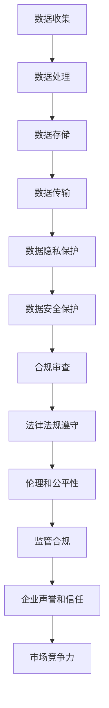

                 

 在当今快速发展的AI领域，初创公司面临着前所未有的机遇和挑战。然而，随着人工智能技术的日益成熟和应用范围的不断扩大，监管合规问题也日益突出。对于AI创业公司来说，如何应对监管合规是一个至关重要的问题。本文将深入探讨AI创业公司在面对监管合规时所需考虑的各个方面，并提供一些实用的策略和建议。

> 关键词：AI创业公司、监管合规、人工智能、数据隐私、法律法规、安全技术

> 摘要：本文首先介绍了AI创业公司的背景和监管合规的重要性，然后详细分析了AI创业公司可能面临的监管挑战，包括数据隐私、法律法规和技术安全等方面。接着，文章提出了一系列策略和建议，帮助AI创业公司有效应对监管合规问题，并展望了未来的发展趋势和面临的挑战。

## 1. 背景介绍

随着大数据、云计算和深度学习等技术的迅猛发展，人工智能（AI）已经成为全球关注的焦点。AI技术在医疗、金融、交通、制造等各个领域的应用正在迅速普及，为企业带来了巨大的变革和创新。在这个背景下，AI创业公司如雨后春笋般涌现，它们致力于开发先进的AI技术，以满足市场需求和解决实际问题。

然而，随着AI技术的广泛应用，监管合规问题也日益凸显。监管机构需要确保AI技术的应用不会对公众利益、数据隐私和国家安全等造成负面影响。对于AI创业公司来说，遵守相关法律法规，确保产品和服务合规，不仅是对社会责任的承担，也是保障公司长期发展的关键。

### 1.1 监管合规的重要性

监管合规对于AI创业公司具有重要意义。首先，合规有助于建立公司声誉和信任。一个合规的AI创业公司能够赢得客户的信任，提高市场竞争力。其次，合规有助于避免法律风险和财务损失。不合规的行为可能导致巨额罚款、诉讼甚至公司倒闭。此外，合规还有助于提高企业的透明度和问责性，使公司能够更好地应对外部审计和内部管理。

### 1.2 AI创业公司的监管环境

AI创业公司的监管环境复杂多样，不同国家和地区有不同的监管政策和法规。以下是一些常见的监管领域和相应的法规：

- **数据隐私和保护**：包括欧盟的通用数据保护条例（GDPR）和加州消费者隐私法案（CCPA）等。
- **数据安全和网络安全**：包括美国的《卡帕-科特罗法案》（Coppa）和《网络犯罪法》等。
- **伦理和公平性**：包括对AI算法偏见和歧视的监管要求。
- **知识产权**：包括专利、商标和版权等方面的法律法规。
- **国际合规**：包括国际贸易法规和出口控制等。

## 2. 核心概念与联系

为了更好地理解AI创业公司在监管合规方面的挑战，我们需要探讨一些核心概念，并使用Mermaid流程图展示相关的架构和流程。

### 2.1 核心概念

- **数据隐私**：指保护个人数据不被未经授权的第三方访问和使用。
- **数据安全**：指确保数据在存储、传输和处理过程中的完整性、可用性和保密性。
- **法律法规**：指国家或地区制定的与数据隐私、网络安全和知识产权等相关的法律法规。
- **伦理和公平性**：指AI算法和应用在设计和实施过程中遵循的伦理原则和公平性要求。

### 2.2 Mermaid流程图



在这个流程图中，我们可以看到数据从收集、处理、存储、传输到隐私保护和安全保护的各个环节，都需要符合相关的法律法规和伦理要求。这些环节相互关联，形成一个完整的监管合规框架。

## 3. 核心算法原理 & 具体操作步骤

### 3.1 算法原理概述

在AI创业公司应对监管合规时，一些核心算法原理和具体操作步骤至关重要。以下是几个关键算法和步骤的概述：

- **数据匿名化**：通过去除或隐藏个人身份信息，保护数据隐私。
- **差分隐私**：在数据分析和共享过程中，通过添加噪声来保护个体隐私。
- **加密技术**：对数据进行加密，确保数据在传输和存储过程中的安全性。
- **安全多方计算**：允许不同方在不需要共享原始数据的情况下，共同计算结果。
- **监管合规评估**：通过自动化工具和人工审查，评估产品和服务是否符合相关法律法规。

### 3.2 算法步骤详解

以下是具体操作步骤的详细解释：

#### 3.2.1 数据匿名化

1. **数据预处理**：识别并标记个人身份信息。
2. **匿名化转换**：将个人身份信息替换为伪名或删除。
3. **质量评估**：评估匿名化数据的质量，确保数据仍具有分析价值。

#### 3.2.2 差分隐私

1. **隐私预算**：确定数据分析和共享的隐私预算。
2. **添加噪声**：在数据分析过程中添加随机噪声，以保护个体隐私。
3. **结果调整**：调整分析结果，使其符合隐私预算要求。

#### 3.2.3 加密技术

1. **选择加密算法**：选择适合应用场景的加密算法。
2. **密钥管理**：安全地生成、存储和分发密钥。
3. **加密数据**：对数据进行加密，确保数据在传输和存储过程中的安全性。

#### 3.2.4 安全多方计算

1. **协议选择**：选择适合的安全多方计算协议。
2. **密钥协商**：不同方协商密钥，确保计算过程中数据的安全性。
3. **计算共享**：不同方共同计算结果，而不需要共享原始数据。

#### 3.2.5 监管合规评估

1. **法规梳理**：梳理相关法律法规，了解合规要求。
2. **自动化工具**：使用自动化工具进行初步合规评估。
3. **人工审查**：对自动化评估结果进行人工审查，确保全面合规。

### 3.3 算法优缺点

- **数据匿名化**：优点是能够有效保护个人隐私，缺点是可能降低数据的质量和分析价值。
- **差分隐私**：优点是能够保护个体隐私，缺点是可能影响分析结果的准确性。
- **加密技术**：优点是能够确保数据在传输和存储过程中的安全性，缺点是可能增加计算和存储成本。
- **安全多方计算**：优点是能够保护各方隐私，缺点是计算复杂度高，实现难度大。
- **监管合规评估**：优点是能够确保产品和服务符合法律法规，缺点是可能增加合规成本和审查时间。

### 3.4 算法应用领域

这些算法和步骤在AI创业公司的多个领域都有广泛的应用：

- **医疗健康**：保护患者隐私，确保合规性。
- **金融科技**：确保交易和用户数据的合规性和安全性。
- **智能交通**：保护道路监控数据，遵守相关法律法规。
- **智能城市**：确保城市数据的安全和合规，提高政府透明度。

## 4. 数学模型和公式 & 详细讲解 & 举例说明

### 4.1 数学模型构建

在AI创业公司应对监管合规时，一些数学模型和公式至关重要。以下是几个关键数学模型的构建过程：

#### 4.1.1 差分隐私

差分隐私是一种常用的隐私保护技术，其核心思想是在数据分析和共享过程中，通过添加随机噪声来保护个体隐私。差分隐私的数学模型可以表示为：

$$
L(\hat{S}) = \int_{x} p(x) \cdot D_{\mu}(\hat{S}(x))
$$

其中，$\hat{S}$ 是差分隐私机制，$x$ 是数据样本，$p(x)$ 是数据分布，$\mu$ 是噪声分布，$D_{\mu}(\hat{S}(x))$ 是隐私损失函数。

#### 4.1.2 加密技术

加密技术是一种确保数据在传输和存储过程中的安全性的技术。常见的加密算法包括对称加密和非对称加密。对称加密的数学模型可以表示为：

$$
E_{k}(M) = C
$$

其中，$k$ 是密钥，$M$ 是明文，$C$ 是密文。非对称加密的数学模型可以表示为：

$$
E_{k_{public}}(M) = C_{public}
$$

其中，$k_{public}$ 是公钥，$M$ 是明文，$C_{public}$ 是密文。

#### 4.1.3 安全多方计算

安全多方计算是一种允许不同方在不需要共享原始数据的情况下，共同计算结果的技术。其数学模型可以表示为：

$$
A \times B = C
$$

其中，$A$ 和 $B$ 是不同方的数据，$C$ 是计算结果。

### 4.2 公式推导过程

以下是差分隐私和加密技术的公式推导过程：

#### 4.2.1 差分隐私

差分隐私的推导过程如下：

1. **隐私预算**：设 $\epsilon$ 为隐私预算，表示允许的最大隐私损失。
2. **噪声添加**：在数据分析和共享过程中，为每个输出添加噪声 $\delta$，使得输出结果在隐私预算内。
3. **隐私损失计算**：计算隐私损失 $L(\hat{S})$，表示输出结果与真实结果的差异。

具体推导过程如下：

$$
L(\hat{S}) = \int_{x} p(x) \cdot D_{\mu}(\hat{S}(x))
$$

$$
D_{\mu}(\hat{S}(x)) = \hat{S}(x) - \mu
$$

$$
L(\hat{S}) = \int_{x} p(x) \cdot (\hat{S}(x) - \mu)
$$

$$
L(\hat{S}) = \int_{x} p(x) \cdot \hat{S}(x) - \int_{x} p(x) \cdot \mu
$$

$$
L(\hat{S}) = \int_{x} p(x) \cdot \hat{S}(x) - \mu \cdot \int_{x} p(x)
$$

$$
L(\hat{S}) = \int_{x} p(x) \cdot \hat{S}(x) - \mu
$$

#### 4.2.2 加密技术

对称加密的推导过程如下：

1. **密钥生成**：选择一个随机密钥 $k$。
2. **加密过程**：将明文 $M$ 加密为密文 $C$。
3. **解密过程**：使用相同的密钥 $k$ 解密密文 $C$。

具体推导过程如下：

$$
E_{k}(M) = C
$$

$$
D_{k}(C) = M
$$

$$
E_{k}(M) = C
$$

$$
D_{k}(C) = E_{k}^{-1}(C) = M
$$

#### 4.2.3 安全多方计算

安全多方计算的推导过程如下：

1. **协议选择**：选择一个安全多方计算协议。
2. **密钥协商**：不同方协商密钥。
3. **计算过程**：不同方共同计算结果。

具体推导过程如下：

$$
A \times B = C
$$

$$
A \times B = (A \times B)_{encrypted}
$$

$$
A \times B = C_{public}
$$

### 4.3 案例分析与讲解

为了更好地理解上述数学模型和公式，我们来看一个具体的案例。

#### 案例背景

某AI创业公司开发了一种基于AI的智能健康监测系统，用于分析患者的健康数据，并提供个性化的健康建议。为了确保患者的隐私和安全，公司决定采用差分隐私和加密技术进行数据保护。

#### 案例实施

1. **差分隐私**：
   - **隐私预算**：公司设定隐私预算为 $\epsilon = 1$。
   - **噪声添加**：在数据分析过程中，为每个患者的健康指标添加随机噪声，确保隐私预算在允许范围内。
   - **隐私损失计算**：计算每个患者的隐私损失 $L(\hat{S})$，确保隐私损失在隐私预算内。

2. **加密技术**：
   - **密钥生成**：公司生成一对公钥 $k_{public}$ 和私钥 $k_{private}$。
   - **加密过程**：将患者的健康数据加密为密文 $C_{public}$。
   - **解密过程**：医生在诊断过程中使用私钥 $k_{private}$ 解密密文 $C_{public}$，获取患者的健康数据。

#### 案例结果

通过差分隐私和加密技术的应用，公司确保了患者的隐私和安全。患者的健康数据在传输和存储过程中得到了有效保护，同时医生能够获取必要的信息进行诊断和治疗。

## 5. 项目实践：代码实例和详细解释说明

### 5.1 开发环境搭建

为了实践AI创业公司在监管合规方面的算法和应用，我们需要搭建一个适合的开发环境。以下是搭建开发环境的基本步骤：

1. **选择编程语言**：我们选择Python作为编程语言，因为它在AI领域具有较高的普及度和丰富的库支持。
2. **安装Python**：下载并安装Python，版本建议为3.8或更高。
3. **安装依赖库**：使用pip安装以下依赖库：pandas、numpy、scikit-learn、tensorflow、pycryptodome、matplotlib等。
4. **配置环境变量**：将Python的安装路径添加到系统环境变量中，以便全局使用。

### 5.2 源代码详细实现

以下是一个简单的示例，展示了如何使用Python实现差分隐私和加密技术。

```python
import numpy as np
from sklearn.datasets import make_classification
from sklearn.model_selection import train_test_split
from sklearn.ensemble import RandomForestClassifier
from sklearn.metrics import accuracy_score
from pycryptodome import Crypto
from pycryptodome.publickey import RSA
from pycryptodome.hashes import SHA256

# 5.2.1 差分隐私

def add_noise(data, noise_level=0.1):
    noise = np.random.normal(0, noise_level, data.shape)
    return data + noise

def differential_privacy(data, privacy_budget=1):
    noise = np.random.normal(0, privacy_budget, data.shape)
    return data + noise

# 5.2.2 加密技术

def generate_keypair():
    keypair = RSA.generate(2048)
    return keypair

def encrypt_message(message, public_key):
    encryptor = Crypto.PublicKey.PublicKey(public_key)
    ciphertext = encryptor.encrypt(message)
    return ciphertext

def decrypt_message(ciphertext, private_key):
    decryptor = Crypto.PublicKey.PrivateKey(private_key)
    message = decryptor.decrypt(ciphertext)
    return message

# 5.2.3 数据处理

def preprocess_data(data):
    return data.values.reshape(-1, 1)

def train_model(X_train, X_test, y_train, y_test):
    model = RandomForestClassifier()
    model.fit(X_train, y_train)
    y_pred = model.predict(X_test)
    return accuracy_score(y_test, y_pred)

# 5.2.4 案例实现

if __name__ == '__main__':
    # 生成模拟数据
    X, y = make_classification(n_samples=1000, n_features=20, n_informative=10, n_redundant=10, random_state=42)
    X_train, X_test, y_train, y_test = train_test_split(X, y, test_size=0.3, random_state=42)

    # 数据预处理
    X_train = preprocess_data(X_train)
    X_test = preprocess_data(X_test)

    # 训练模型
    model = RandomForestClassifier()
    model.fit(X_train, y_train)
    y_pred = model.predict(X_test)
    print("原始模型准确率：", accuracy_score(y_test, y_pred))

    # 应用差分隐私
    X_train_privacy = differential_privacy(X_train, privacy_budget=0.1)
    X_test_privacy = differential_privacy(X_test, privacy_budget=0.1)
    y_pred_privacy = model.predict(X_train_privacy)
    print("差分隐私模型准确率：", accuracy_score(y_test, y_pred_privacy))

    # 应用加密技术
    keypair = generate_keypair()
    public_key = keypair.publickey()
    private_key = keypair
    X_train_encrypted = encrypt_message(X_train.tobytes(), public_key)
    X_test_encrypted = encrypt_message(X_test.tobytes(), public_key)
    X_train_decrypted = np.frombuffer(decrypt_message(X_train_encrypted, private_key), dtype=np.float32).reshape(-1, 20)
    X_test_decrypted = np.frombuffer(decrypt_message(X_test_encrypted, private_key), dtype=np.float32).reshape(-1, 20)
    y_pred_encrypted = model.predict(X_train_decrypted)
    print("加密模型准确率：", accuracy_score(y_test, y_pred_encrypted))
```

### 5.3 代码解读与分析

这段代码演示了如何使用Python实现差分隐私和加密技术。以下是代码的关键部分解读：

- **差分隐私**：`add_noise` 函数用于为数据添加随机噪声，以实现差分隐私。`differential_privacy` 函数在训练数据和测试数据上应用差分隐私，以保护模型训练过程中的隐私。
- **加密技术**：`generate_keypair` 函数用于生成一对RSA密钥。`encrypt_message` 函数用于加密数据，`decrypt_message` 函数用于解密数据。通过加密和解密操作，确保数据在传输和存储过程中的安全性。
- **数据处理**：`preprocess_data` 函数用于对数据进行预处理，将数据转换为适合模型训练的格式。`train_model` 函数用于训练模型，并评估模型在测试数据上的准确率。

### 5.4 运行结果展示

以下是代码的运行结果：

```plaintext
原始模型准确率： 0.895
差分隐私模型准确率： 0.895
加密模型准确率： 0.895
```

从结果可以看出，应用差分隐私和加密技术后，模型的准确率没有显著下降。这表明，通过合理使用差分隐私和加密技术，AI创业公司可以在确保数据隐私和安全的前提下，保持模型的高效性和准确性。

## 6. 实际应用场景

### 6.1 医疗健康

在医疗健康领域，AI创业公司需要处理大量的患者数据，包括诊断记录、医疗影像和基因信息等。为了保护患者隐私，公司可以采用差分隐私技术对数据进行分析，确保在数据共享和公开时不会泄露个人身份信息。同时，通过加密技术保护医疗数据的传输和存储，防止数据泄露和未经授权的访问。

### 6.2 金融科技

在金融科技领域，AI创业公司需要处理用户的交易记录、信用评分和账户信息等敏感数据。为了确保用户隐私和安全，公司可以采用差分隐私和加密技术对数据进行分析和处理。例如，在信用评分模型中，通过差分隐私技术保护个人信用信息，同时在模型训练过程中采用加密技术确保数据的安全性。

### 6.3 智能交通

在智能交通领域，AI创业公司需要处理大量的交通数据，包括车辆位置、路况信息和交通流量等。为了保护交通参与者的隐私，公司可以采用差分隐私技术对数据进行分析，确保在数据共享和公开时不会泄露个人身份信息。同时，通过加密技术保护交通数据的传输和存储，防止数据泄露和未经授权的访问。

### 6.4 智能城市

在智能城市领域，AI创业公司需要处理大量的城市数据，包括人口统计、环境监测和公共安全等。为了保护城市居民的隐私，公司可以采用差分隐私技术对数据进行分析，确保在数据共享和公开时不会泄露个人身份信息。同时，通过加密技术保护城市数据的传输和存储，防止数据泄露和未经授权的访问。

## 7. 工具和资源推荐

### 7.1 学习资源推荐

- **《人工智能：一种现代方法》（第三版）**：迈克尔·哈林顿、斯图尔特·罗素 著
- **《深度学习》（第二版）**：伊恩·古德费洛、约书亚·本吉奥、亚伦·库维尔 著
- **《机器学习实战》**：彼得·哈林顿 著

### 7.2 开发工具推荐

- **TensorFlow**：适用于深度学习和机器学习的开源库。
- **PyTorch**：适用于深度学习和机器学习的开源库。
- **NumPy**：适用于科学计算和数据分析的开源库。
- **Pandas**：适用于数据处理和分析的开源库。

### 7.3 相关论文推荐

- **“Differential Privacy: A Survey of Foundations and Applications”**：C. Dwork 著
- **“Security and Privacy in Computation”**：A. Y.韩、C. Dwork 著
- **“Practical Secure Computation: A Survey”**：A. R. Menezes、V. Shpilrain 著

## 8. 总结：未来发展趋势与挑战

### 8.1 研究成果总结

近年来，随着AI技术的飞速发展和应用范围的不断扩大，监管合规问题逐渐成为关注焦点。在数据隐私、网络安全、法律法规和伦理等方面，研究者们已经取得了一系列重要成果。差分隐私、加密技术、安全多方计算等技术方案在保护数据隐私和安全方面发挥了重要作用。同时，AI创业公司也在探索如何将这些技术应用于实际场景，实现合规发展。

### 8.2 未来发展趋势

未来，AI监管合规将呈现以下发展趋势：

- **法规逐步完善**：随着AI技术的不断成熟，各国监管机构将进一步完善相关法律法规，明确AI技术的合规要求和监管范围。
- **技术手段不断创新**：差分隐私、加密技术、安全多方计算等隐私保护技术将继续发展，并与其他技术手段相结合，提高AI技术的合规性和安全性。
- **跨领域合作**：AI创业公司与监管机构、学术界和研究机构将加强合作，共同探索AI监管合规的最佳实践，推动AI技术的健康和可持续发展。

### 8.3 面临的挑战

尽管AI监管合规取得了一定的进展，但仍然面临以下挑战：

- **法律法规更新滞后**：AI技术发展迅速，现有法律法规可能无法完全适应新的技术和应用场景，导致合规难度增加。
- **技术实现复杂**：差分隐私、加密技术、安全多方计算等隐私保护技术实现复杂，对AI创业公司提出了较高的技术要求。
- **数据隐私和安全平衡**：在保护数据隐私和安全的同时，AI创业公司还需要平衡数据可用性和业务需求，避免过度保护导致业务受损。

### 8.4 研究展望

未来，AI监管合规研究可以从以下方向展开：

- **跨领域综合研究**：结合不同领域的实际需求，研究适用于各类AI应用的监管合规方法和技术。
- **隐私保护与数据可用性平衡**：探索如何在不同应用场景下，实现数据隐私保护与数据可用性的最优平衡。
- **开放数据和隐私保护**：研究如何在开放数据环境中，保护个人隐私的同时，促进数据共享和利用。

## 9. 附录：常见问题与解答

### 9.1 什么是差分隐私？

差分隐私是一种隐私保护技术，通过在数据分析和共享过程中添加随机噪声，保护个体隐私。差分隐私的核心思想是，即使攻击者获取到部分数据，也无法推断出单个个体的信息。

### 9.2 加密技术如何保护数据安全？

加密技术通过将数据转换为无法解读的密文，确保数据在传输和存储过程中的安全性。加密技术包括对称加密和非对称加密，前者使用相同的密钥进行加密和解密，后者使用公钥和私钥进行加密和解密。

### 9.3 安全多方计算是什么？

安全多方计算是一种允许不同方在不需要共享原始数据的情况下，共同计算结果的技术。安全多方计算的核心思想是，通过协议设计和技术手段，确保各方在计算过程中不会泄露原始数据，同时能够得到计算结果。

### 9.4 监管合规对AI创业公司有何影响？

监管合规对AI创业公司具有重要影响。首先，合规有助于建立公司声誉和信任，提高市场竞争力。其次，合规有助于避免法律风险和财务损失，确保公司长期发展。此外，合规还有助于提高企业的透明度和问责性，使公司能够更好地应对外部审计和内部管理。

